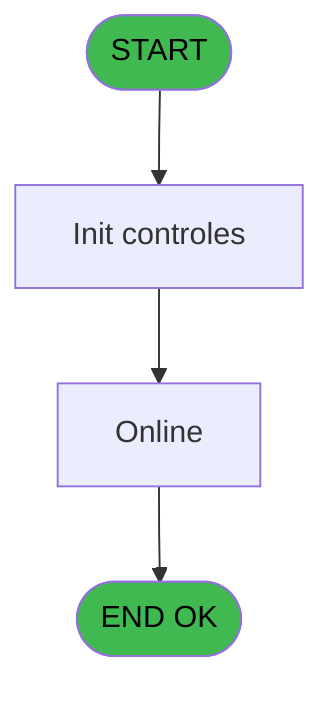
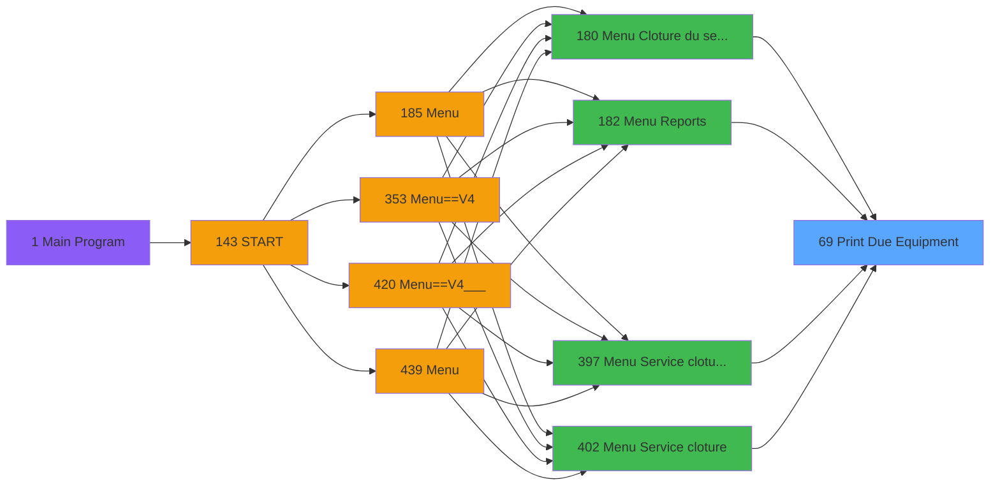

# PVE IDE 69 - Print Due Equipment

> **Analyse**: Phases 1-4 2026-02-03 09:06 -> 09:07 (21s) | Assemblage 09:07
> **Pipeline**: V7.2 Enrichi
> **Structure**: 4 onglets (Resume | Ecrans | Donnees | Connexions)

<!-- TAB:Resume -->

## 1. FICHE D'IDENTITE

| Attribut | Valeur |
|----------|--------|
| Projet | PVE |
| IDE Position | 69 |
| Nom Programme | Print Due Equipment |
| Fichier source | `Prg_69.xml` |
| Domaine metier | Impression |
| Taches | 4 (1 ecrans visibles) |
| Tables modifiees | 0 |
| Programmes appeles | 1 |

## 2. DESCRIPTION FONCTIONNELLE

**Print Due Equipment** assure la gestion complete de ce processus, accessible depuis [Menu Cloture du service (IDE 180)](PVE-IDE-180.md), [Menu Service cloture v2 (IDE 397)](PVE-IDE-397.md), [Menu Service cloture (IDE 402)](PVE-IDE-402.md), [Menu Reports (IDE 182)](PVE-IDE-182.md).

Le flux de traitement s'organise en **2 blocs fonctionnels** :

- **Traitement** (2 taches) : traitements metier divers
- **Impression** (2 taches) : generation de tickets et documents

Detail : phases du traitement

#### Phase 1 : Impression (2 taches)

- **69** - Print Due Equipment **[[ECRAN]](#ecran-t1)**
- **69.2** - EDITION

#### Phase 2 : Traitement (2 taches)

- **69.1** - Equipments due **[[ECRAN]](#ecran-t2)**
- **69.2.1** - Read Cust Rentals

Delegue a : [Get room # (Batch) (IDE 300)](PVE-IDE-300.md)

## 3. BLOCS FONCTIONNELS

### 3.1 Impression (2 taches)

Generation des documents et tickets.

---

#### 69 - Print Due Equipment [[ECRAN]](#ecran-t1)

**Role** : Generation du document : Print Due Equipment.
**Ecran** : 312 x 173 DLU (MDI) | [Voir mockup](#ecran-t1)

---

#### 69.2 - EDITION

**Role** : Generation du document : EDITION.
**Variables liees** : B (p. edition type)

### 3.2 Traitement (2 taches)

Traitements internes.

---

#### 69.1 - Equipments due [[ECRAN]](#ecran-t2)

**Role** : Traitement : Equipments due.
**Ecran** : 313 x 174 DLU (MDI) | [Voir mockup](#ecran-t2)
**Delegue a** : [Get room # (Batch) (IDE 300)](PVE-IDE-300.md)

---

#### 69.2.1 - Read Cust Rentals

**Role** : Traitement : Read Cust Rentals.
**Delegue a** : [Get room # (Batch) (IDE 300)](PVE-IDE-300.md)

## 5. REGLES METIER

*(Aucune regle metier identifiee)*

## 6. CONTEXTE

- **Appele par**: [Menu Cloture du service (IDE 180)](PVE-IDE-180.md), [Menu Service cloture v2 (IDE 397)](PVE-IDE-397.md), [Menu Service cloture (IDE 402)](PVE-IDE-402.md), [Menu Reports (IDE 182)](PVE-IDE-182.md)
- **Appelle**: 1 programmes | **Tables**: 7 (W:0 R:1 L:6) | **Taches**: 4 | **Expressions**: 6

<!-- TAB:Ecrans -->

## 8. ECRANS

### 8.1 Forms visibles (1 / 4)

| # | Position | Tache | Nom | Type | Largeur | Hauteur | Bloc |
|---|----------|-------|-----|------|---------|---------|------|
| 1 | 69.1 | 69.1 | Equipments due | MDI | 313 | 174 | Traitement |

### 8.2 Mockups Ecrans

---

#### 69.1 - Equipments due
**Tache** : [69.1](#t2) | **Type** : MDI | **Dimensions** : 313 x 174 DLU
**Bloc** : Traitement | **Titre IDE** : Equipments due

<!-- FORM-DATA:
{
    "width":  313,
    "vFactor":  8,
    "type":  "MDI",
    "hFactor":  4,
    "controls":  [
                     {
                         "x":  17,
                         "type":  "label",
                         "var":  "",
                         "y":  59,
                         "w":  265,
                         "fmt":  "",
                         "name":  "",
                         "h":  10,
                         "color":  "187",
                         "text":  "Select the deadline for equipments to be returned",
                         "parent":  null
                     },
                     {
                         "x":  69,
                         "type":  "label",
                         "var":  "",
                         "y":  88,
                         "w":  48,
                         "fmt":  "",
                         "name":  "",
                         "h":  16,
                         "color":  "183",
                         "text":  "Date",
                         "parent":  null
                     },
                     {
                         "x":  69,
                         "type":  "label",
                         "var":  "",
                         "y":  113,
                         "w":  48,
                         "fmt":  "",
                         "name":  "",
                         "h":  16,
                         "color":  "183",
                         "text":  "Type",
                         "parent":  null
                     },
                     {
                         "x":  0,
                         "type":  "label",
                         "var":  "",
                         "y":  0,
                         "w":  312,
                         "fmt":  "",
                         "name":  "",
                         "h":  42,
                         "color":  "182",
                         "text":  "",
                         "parent":  null
                     },
                     {
                         "x":  12,
                         "type":  "label",
                         "var":  "",
                         "y":  16,
                         "w":  243,
                         "fmt":  "",
                         "name":  "",
                         "h":  10,
                         "color":  "186",
                         "text":  "List of equipments due for a specific date",
                         "parent":  5
                     },
                     {
                         "x":  0,
                         "type":  "label",
                         "var":  "",
                         "y":  139,
                         "w":  312,
                         "fmt":  "",
                         "name":  "",
                         "h":  34,
                         "color":  "6",
                         "text":  "",
                         "parent":  null
                     },
                     {
                         "x":  145,
                         "type":  "edit",
                         "var":  "",
                         "y":  88,
                         "w":  73,
                         "fmt":  "",
                         "name":  "",
                         "h":  16,
                         "color":  "110",
                         "text":  "",
                         "parent":  null
                     },
                     {
                         "x":  131,
                         "type":  "radio",
                         "var":  "",
                         "y":  114,
                         "w":  144,
                         "fmt":  "",
                         "name":  "",
                         "h":  16,
                         "color":  "183",
                         "text":  "",
                         "parent":  null
                     },
                     {
                         "x":  174,
                         "type":  "button",
                         "var":  "",
                         "y":  144,
                         "w":  68,
                         "fmt":  "\u0026Print",
                         "name":  "",
                         "h":  28,
                         "color":  "",
                         "text":  "",
                         "parent":  null
                     },
                     {
                         "x":  242,
                         "type":  "button",
                         "var":  "",
                         "y":  144,
                         "w":  68,
                         "fmt":  "\u0026Exit",
                         "name":  "",
                         "h":  28,
                         "color":  "",
                         "text":  "",
                         "parent":  null
                     },
                     {
                         "x":  262,
                         "type":  "image",
                         "var":  "",
                         "y":  4,
                         "w":  48,
                         "fmt":  "",
                         "name":  "",
                         "h":  37,
                         "color":  "",
                         "text":  "",
                         "parent":  5
                     }
                 ],
    "taskId":  "69.1",
    "height":  174
}
-->

<strong>Champs : 1 champs</strong>

| Pos (x,y) | Nom | Variable | Type |
|-----------|-----|----------|------|
| 145,88 | (sans nom) | - | edit |

<strong>Boutons : 2 boutons</strong>

| Bouton | Pos (x,y) | Action |
|--------|-----------|--------|
| Print | 174,144 | Lance l'impression |
| Exit | 242,144 | Quitte le programme |

## 9. NAVIGATION

Ecran unique: **Equipments due**

### 9.3 Structure hierarchique (4 taches)

| Position | Tache | Type | Dimensions | Bloc |
|----------|-------|------|------------|------|
| **69.1** | [**Print Due Equipment** (69)](#t1) [mockup](#ecran-t1) | MDI | 312x173 | Impression |
| 69.1.1 | [EDITION (69.2)](#t3) | MDI | - | |
| **69.2** | [**Equipments due** (69.1)](#t2) [mockup](#ecran-t2) | MDI | 313x174 | Traitement |
| 69.2.1 | [Read Cust Rentals (69.2.1)](#t4) | MDI | - | |

### 9.4 Algorigramme

> **Legende**: Vert = START/END OK | Rouge = END KO | Bleu = Decisions
> *Algorigramme auto-genere. Utiliser `/algorigramme` pour une synthese metier detaillee.*

<!-- TAB:Donnees -->

## 10. TABLES

### Tables utilisees (7)

| ID | Nom | Description | Type | R | W | L | Usages |
|----|-----|-------------|------|---|---|---|--------|
| 30 | gm-recherche_____gmr | Index de recherche | DB | R |   |   | 1 |
| 382 | pv_discount_reasons |  | DB |   |   | L | 1 |
| 388 | pv_hotel_days |  | DB |   |   | L | 1 |
| 389 | pv_equipment_inventory |  | DB |   |   | L | 1 |
| 398 | pv_prestations | Prestations/services vendus | DB |   |   | L | 1 |
| 400 | pv_cust_rentals |  | DB |   |   | L | 1 |
| 404 | pv_sellers_by_week |  | DB |   |   | L | 1 |

### Colonnes par table (1 / 1 tables avec colonnes identifiees)

Table 30 - gm-recherche_____gmr (R) - 1 usages

| Lettre | Variable | Acces | Type |
|--------|----------|-------|------|
| A | v. Due Date | R | Date |
| B | v.room number | R | Alpha |

## 11. VARIABLES

### 11.1 Parametres entrants (3)

Variables recues du programme appelant ([Menu Cloture du service (IDE 180)](PVE-IDE-180.md)).

| Lettre | Nom | Type | Usage dans |
|--------|-----|------|-----------|
| A | p. date | Date | 2x parametre entrant |
| B | p. edition type | Alpha | - |
| C | P.I Flag Cloture Service | Logical | 1x parametre entrant |

### 11.2 Variables de session (2)

Variables persistantes pendant toute la session.

| Lettre | Nom | Type | Usage dans |
|--------|-----|------|-----------|
| D | v.NomFichierPdf | Alpha | 2x session |
| E | v.NomFichierPdf Archivage | Alpha | 1x session |

## 12. EXPRESSIONS

**6 / 6 expressions decodees (100%)**

### 12.1 Repartition par type

| Type | Expressions | Regles |
|------|-------------|--------|
| CONDITION | 2 | 0 |
| CONCATENATION | 2 | 0 |
| STRING | 2 | 0 |

### 12.2 Expressions cles par type

#### CONDITION (2 expressions)

| Type | IDE | Expression | Regle |
|------|-----|------------|-------|
| CONDITION | 2 | `p. date [A]<>'00/00/0000'DATE` | - |
| CONDITION | 1 | `p. date [A]='00/00/0000'DATE` | - |

#### CONCATENATION (2 expressions)

| Type | IDE | Expression | Regle |
|------|-----|------------|-------|
| CONCATENATION | 4 | `Translate ('%club_exportdata%')&'ArchivagePos\'&
Trim (GetParam ('VILLAGECODE'))&Trim (GetParam ('SERVICE'))&'_LIST_OF_EQUIPMENTS_'&DStr (Date(),'YYYYMMDD')&'_'&TStr (Time(),'HHMMSS')&'.Pdf'` | - |
| CONCATENATION | 3 | `Translate ('%club_exportdata%')&Trim (GetParam ('VILLAGECODE'))&Trim (GetParam ('SERVICE'))&'_LIST_OF_EQUIPMENTS_'&DStr (Date(),'YYYYMMDD')&'_'&TStr (Time(),'HHMMSS')&'.Pdf'` | - |

#### STRING (2 expressions)

| Type | IDE | Expression | Regle |
|------|-----|------------|-------|
| STRING | 6 | `P.I Flag Cloture Service [C] AND FileExist(Trim(v.NomFichierPdf [D]))` | - |
| STRING | 5 | `FileCopy(Trim(v.NomFichierPdf [D]),Trim(v.NomFichierPdf Archivage [E]))` | - |

<!-- TAB:Connexions -->

## 13. GRAPHE D'APPELS

### 13.1 Chaine depuis Main (Callers)

Main -> ... -> [Menu Cloture du service (IDE 180)](PVE-IDE-180.md) -> **Print Due Equipment (IDE 69)**

Main -> ... -> [Menu Service cloture v2 (IDE 397)](PVE-IDE-397.md) -> **Print Due Equipment (IDE 69)**

Main -> ... -> [Menu Service cloture (IDE 402)](PVE-IDE-402.md) -> **Print Due Equipment (IDE 69)**

Main -> ... -> [Menu Reports (IDE 182)](PVE-IDE-182.md) -> **Print Due Equipment (IDE 69)**

### 13.2 Callers

| IDE | Nom Programme | Nb Appels |
|-----|---------------|-----------|
| [180](PVE-IDE-180.md) | Menu Cloture du service | 2 |
| [397](PVE-IDE-397.md) | Menu Service cloture v2 | 2 |
| [402](PVE-IDE-402.md) | Menu Service cloture | 2 |
| [182](PVE-IDE-182.md) | Menu Reports | 1 |

### 13.3 Callees (programmes appeles)

### 13.4 Detail Callees avec contexte

| IDE | Nom Programme | Appels | Contexte |
|-----|---------------|--------|----------|
| [300](PVE-IDE-300.md) | Get room # (Batch) | 1 | Recuperation donnees |

## 14. RECOMMANDATIONS MIGRATION

### 14.1 Profil du programme

| Metrique | Valeur | Impact migration |
|----------|--------|-----------------|
| Lignes de logique | 81 | Programme compact |
| Expressions | 6 | Peu de logique |
| Tables WRITE | 0 | Impact faible |
| Sous-programmes | 1 | Peu de dependances |
| Ecrans visibles | 1 | Ecran unique ou traitement batch |
| Code desactive | 0% (0 / 81) | Code sain |
| Regles metier | 0 | Pas de regle identifiee |

### 14.2 Plan de migration par bloc

#### Impression (2 taches: 1 ecran, 1 traitement)

- **Strategie** : Templates HTML -> PDF via wkhtmltopdf ou Puppeteer.
- `PrintService` injectable avec choix imprimante

#### Traitement (2 taches: 1 ecran, 1 traitement)

- **Strategie** : Orchestrateur avec 1 ecrans (Razor/React) et 1 traitements backend (services).
- Les ecrans deviennent des composants UI, les traitements invisibles deviennent des services injectables.
- 1 sous-programme(s) a migrer ou a reutiliser depuis les services existants.
- Decomposer les taches en services unitaires testables.

### 14.3 Dependances critiques

| Dependance | Type | Appels | Impact |
|------------|------|--------|--------|
| [Get room # (Batch) (IDE 300)](PVE-IDE-300.md) | Sous-programme | 1x | Normale - Recuperation donnees |

---
*Spec DETAILED generee par Pipeline V7.2 - 2026-02-03 09:07*
