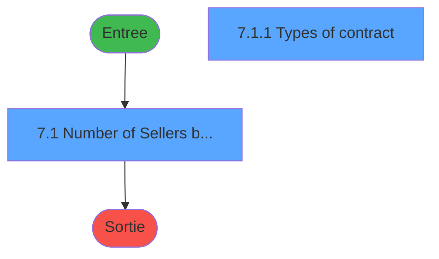
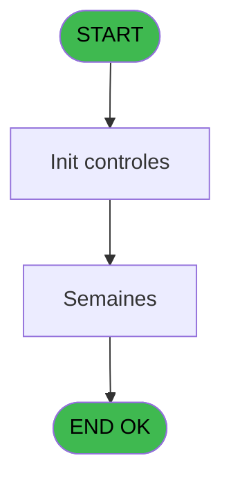
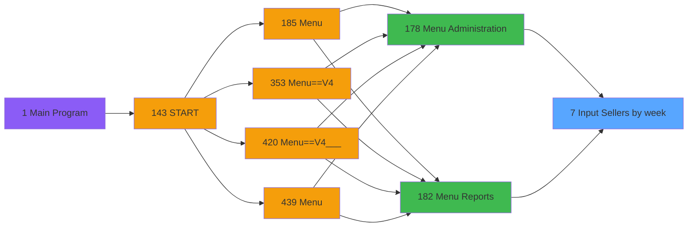

# PVE IDE 7 - Input Sellers by week

> **Analyse**: Phases 1-4 2026-02-03 00:55 -> 00:56 (38s) | Assemblage 00:56
> **Pipeline**: V7.2 Enrichi
> **Structure**: 4 onglets (Resume | Ecrans | Donnees | Connexions)

<!-- TAB:Resume -->

## 1. FICHE D'IDENTITE

| Attribut | Valeur |
|----------|--------|
| Projet | PVE |
| IDE Position | 7 |
| Nom Programme | Input Sellers by week |
| Fichier source | `Prg_7.xml` |
| Domaine metier | General |
| Taches | 3 (2 ecrans visibles) |
| Tables modifiees | 0 |
| Programmes appeles | 0 |

## 2. DESCRIPTION FONCTIONNELLE

**Input Sellers by week** assure la gestion complete de ce processus, accessible depuis [Menu Administration (IDE 178)](PVE-IDE-178.md), [Menu Reports (IDE 182)](PVE-IDE-182.md).

Le flux de traitement s'organise en **1 blocs fonctionnels** :

- **Traitement** (3 taches) : traitements metier divers

## 3. BLOCS FONCTIONNELS

### 3.1 Traitement (3 taches)

Traitements internes.

---

#### 7 - Packages sales online [[ECRAN]](#ecran-t1)

**Role** : Traitement : Packages sales online.
**Ecran** : 809 x 394 DLU (MDI) | [Voir mockup](#ecran-t1)

---

#### 7.1 - Number of Sellers by Week [[ECRAN]](#ecran-t2)

**Role** : Traitement : Number of Sellers by Week.
**Ecran** : 768 x 217 DLU (MDI) | [Voir mockup](#ecran-t2)
**Variables liees** : B (V Year/Week), C (V Week affichage)

---

#### 7.1.1 - Types of contract [[ECRAN]](#ecran-t3)

**Role** : Traitement : Types of contract.
**Ecran** : 396 x 279 DLU (Modal) | [Voir mockup](#ecran-t3)

## 5. REGLES METIER

*(Aucune regle metier identifiee)*

## 6. CONTEXTE

- **Appele par**: [Menu Administration (IDE 178)](PVE-IDE-178.md), [Menu Reports (IDE 182)](PVE-IDE-182.md)
- **Appelle**: 0 programmes | **Tables**: 3 (W:0 R:2 L:1) | **Taches**: 3 | **Expressions**: 7

<!-- TAB:Ecrans -->

## 8. ECRANS

### 8.1 Forms visibles (2 / 3)

| # | Position | Tache | Nom | Type | Largeur | Hauteur | Bloc |
|---|----------|-------|-----|------|---------|---------|------|
| 1 | 7.1 | 7.1 | Number of Sellers by Week | MDI | 768 | 217 | Traitement |
| 2 | 7.1.1 | 7.1.1 | Types of contract | Modal | 396 | 279 | Traitement |

### 8.2 Mockups Ecrans

---

#### 7.1 - Number of Sellers by Week
**Tache** : [7.1](#t2) | **Type** : MDI | **Dimensions** : 768 x 217 DLU
**Bloc** : Traitement | **Titre IDE** : Number of Sellers by Week

<!-- FORM-DATA:
{
    "width":  768,
    "vFactor":  8,
    "type":  "MDI",
    "hFactor":  8,
    "controls":  [
                     {
                         "x":  40,
                         "type":  "label",
                         "var":  "",
                         "y":  29,
                         "w":  131,
                         "fmt":  "",
                         "name":  "",
                         "h":  10,
                         "color":  "183",
                         "text":  "Week starting on",
                         "parent":  null
                     },
                     {
                         "x":  0,
                         "type":  "label",
                         "var":  "",
                         "y":  0,
                         "w":  765,
                         "fmt":  "",
                         "name":  "",
                         "h":  25,
                         "color":  "182",
                         "text":  "",
                         "parent":  null
                     },
                     {
                         "x":  18,
                         "type":  "label",
                         "var":  "",
                         "y":  9,
                         "w":  420,
                         "fmt":  "",
                         "name":  "",
                         "h":  7,
                         "color":  "186",
                         "text":  "Choose the week to input",
                         "parent":  2
                     },
                     {
                         "x":  23,
                         "type":  "table",
                         "var":  "",
                         "name":  "",
                         "titleH":  12,
                         "color":  "110",
                         "w":  203,
                         "y":  40,
                         "fmt":  "",
                         "parent":  null,
                         "text":  "",
                         "rowH":  17,
                         "h":  150,
                         "cols":  [
                                      {
                                          "title":  "",
                                          "layer":  1,
                                          "w":  198
                                      }
                                  ],
                         "rows":  1
                     },
                     {
                         "x":  195,
                         "type":  "label",
                         "var":  "",
                         "y":  41,
                         "w":  18,
                         "fmt":  "",
                         "name":  "",
                         "h":  11,
                         "color":  "144",
                         "text":  "ü",
                         "parent":  5
                     },
                     {
                         "x":  0,
                         "type":  "label",
                         "var":  "",
                         "y":  196,
                         "w":  765,
                         "fmt":  "",
                         "name":  "",
                         "h":  20,
                         "color":  "6",
                         "text":  "",
                         "parent":  null
                     },
                     {
                         "x":  26,
                         "type":  "edit",
                         "var":  "",
                         "y":  41,
                         "w":  165,
                         "fmt":  "",
                         "name":  "V Week affichage",
                         "h":  11,
                         "color":  "146",
                         "text":  "",
                         "parent":  5
                     },
                     {
                         "x":  705,
                         "type":  "image",
                         "var":  "",
                         "y":  2,
                         "w":  60,
                         "fmt":  "",
                         "name":  "",
                         "h":  22,
                         "color":  "",
                         "text":  "",
                         "parent":  2
                     },
                     {
                         "x":  225,
                         "type":  "button",
                         "var":  "",
                         "y":  40,
                         "w":  48,
                         "fmt":  "ñ",
                         "name":  "",
                         "h":  74,
                         "color":  "",
                         "text":  "",
                         "parent":  null
                     },
                     {
                         "x":  225,
                         "type":  "button",
                         "var":  "",
                         "y":  115,
                         "w":  48,
                         "fmt":  "ò",
                         "name":  "",
                         "h":  76,
                         "color":  "",
                         "text":  "",
                         "parent":  null
                     },
                     {
                         "x":  654,
                         "type":  "button",
                         "var":  "",
                         "y":  198,
                         "w":  109,
                         "fmt":  "\u0026Exit",
                         "name":  "",
                         "h":  17,
                         "color":  "",
                         "text":  "",
                         "parent":  null
                     }
                 ],
    "taskId":  "7.1",
    "height":  217
}
-->

<strong>Champs : 1 champs</strong>

| Pos (x,y) | Nom | Variable | Type |
|-----------|-----|----------|------|
| 26,41 | V Week affichage | - | edit |

<strong>Boutons : 3 boutons</strong>

| Bouton | Pos (x,y) | Action |
|--------|-----------|--------|
| ñ | 225,40 | Bouton fonctionnel |
| ò | 225,115 | Bouton fonctionnel |
| Exit | 654,198 | Quitte le programme |

---

#### 7.1.1 - Types of contract
**Tache** : [7.1.1](#t3) | **Type** : Modal | **Dimensions** : 396 x 279 DLU
**Bloc** : Traitement | **Titre IDE** : Types of contract

<!-- FORM-DATA:
{
    "width":  396,
    "vFactor":  8,
    "type":  "Modal",
    "hFactor":  4,
    "controls":  [
                     {
                         "x":  246,
                         "type":  "label",
                         "var":  "",
                         "y":  4,
                         "w":  103,
                         "fmt":  "",
                         "name":  "",
                         "h":  17,
                         "color":  "183",
                         "text":  "Number of sellers",
                         "parent":  null
                     },
                     {
                         "x":  46,
                         "type":  "label",
                         "var":  "",
                         "y":  5,
                         "w":  72,
                         "fmt":  "",
                         "name":  "",
                         "h":  17,
                         "color":  "183",
                         "text":  "Contract type",
                         "parent":  null
                     },
                     {
                         "x":  37,
                         "type":  "table",
                         "var":  "",
                         "name":  "",
                         "titleH":  12,
                         "color":  "110",
                         "w":  331,
                         "y":  24,
                         "fmt":  "",
                         "parent":  null,
                         "text":  "",
                         "rowH":  28,
                         "h":  169,
                         "cols":  [
                                      {
                                          "title":  "",
                                          "layer":  1,
                                          "w":  203
                                      },
                                      {
                                          "title":  "",
                                          "layer":  2,
                                          "w":  113
                                      }
                                  ],
                         "rows":  2
                     },
                     {
                         "x":  224,
                         "type":  "label",
                         "var":  "",
                         "y":  25,
                         "w":  14,
                         "fmt":  "",
                         "name":  "",
                         "h":  24,
                         "color":  "144",
                         "text":  "ü",
                         "parent":  3
                     },
                     {
                         "x":  40,
                         "type":  "edit",
                         "var":  "",
                         "y":  25,
                         "w":  179,
                         "fmt":  "",
                         "name":  "",
                         "h":  24,
                         "color":  "148",
                         "text":  "",
                         "parent":  3
                     },
                     {
                         "x":  242,
                         "type":  "edit",
                         "var":  "",
                         "y":  25,
                         "w":  107,
                         "fmt":  "",
                         "name":  "",
                         "h":  24,
                         "color":  "148",
                         "text":  "",
                         "parent":  3
                     },
                     {
                         "x":  356,
                         "type":  "button",
                         "var":  "",
                         "y":  107,
                         "w":  33,
                         "fmt":  "ò",
                         "name":  "",
                         "h":  88,
                         "color":  "",
                         "text":  "",
                         "parent":  null
                     },
                     {
                         "x":  356,
                         "type":  "button",
                         "var":  "",
                         "y":  25,
                         "w":  33,
                         "fmt":  "ñ",
                         "name":  "",
                         "h":  82,
                         "color":  "",
                         "text":  "",
                         "parent":  null
                     }
                 ],
    "taskId":  "7.1.1",
    "height":  279
}
-->

<strong>Champs : 2 champs</strong>

| Pos (x,y) | Nom | Variable | Type |
|-----------|-----|----------|------|
| 40,25 | (sans nom) | - | edit |
| 242,25 | (sans nom) | - | edit |

<strong>Boutons : 2 boutons</strong>

| Bouton | Pos (x,y) | Action |
|--------|-----------|--------|
| ò | 356,107 | Bouton fonctionnel |
| ñ | 356,25 | Bouton fonctionnel |

## 9. NAVIGATION

### 9.1 Enchainement des ecrans

**Detail par enchainement :**

| Depuis | Action | Vers | Retour |
|--------|--------|------|--------|

### 9.3 Structure hierarchique (3 taches)

| Position | Tache | Type | Dimensions | Bloc |
|----------|-------|------|------------|------|
| **7.1** | [**Packages sales online** (7)](#t1) [mockup](#ecran-t1) | MDI | 809x394 | Traitement |
| 7.1.1 | [Number of Sellers by Week (7.1)](#t2) [mockup](#ecran-t2) | MDI | 768x217 | |
| 7.1.2 | [Types of contract (7.1.1)](#t3) [mockup](#ecran-t3) | Modal | 396x279 | |

### 9.4 Algorigramme

> **Legende**: Vert = START/END OK | Rouge = END KO | Bleu = Decisions
> *Algorigramme auto-genere. Utiliser `/algorigramme` pour une synthese metier detaillee.*

<!-- TAB:Donnees -->

## 10. TABLES

### Tables utilisees (3)

| ID | Nom | Description | Type | R | W | L | Usages |
|----|-----|-------------|------|---|---|---|--------|
| 381 | pv_days |  | DB | R |   |   | 1 |
| 385 | pv_equipment |  | DB | R |   |   | 1 |
| 408 | pv_status |  | DB |   |   | L | 1 |

### Colonnes par table (1 / 2 tables avec colonnes identifiees)

Table 381 - pv_days (R) - 1 usages

*Table utilisee uniquement en Link ou aucune colonne Real identifiee dans le DataView.*

Table 385 - pv_equipment (R) - 1 usages

| Lettre | Variable | Acces | Type |
|--------|----------|-------|------|
| A | v.visible 1 | R | Logical |
| B | V Year/Week | R | Numeric |
| C | V Week affichage | R | Alpha |

## 11. VARIABLES

### 11.1 Variables de session (3)

Variables persistantes pendant toute la session.

| Lettre | Nom | Type | Usage dans |
|--------|-----|------|-----------|
| A | v.no exit | Logical | 1x session |
| B | V Year/Week | Numeric | 2x session |
| C | V Week affichage | Alpha | [7.1](#t2) |

## 12. EXPRESSIONS

**7 / 7 expressions decodees (100%)**

### 12.1 Repartition par type

| Type | Expressions | Regles |
|------|-------------|--------|
| CALCULATION | 1 | 0 |
| DATE | 2 | 0 |
| CAST_LOGIQUE | 2 | 0 |
| CONDITION | 1 | 0 |
| OTHER | 1 | 0 |

### 12.2 Expressions cles par type

#### CALCULATION (1 expressions)

| Type | IDE | Expression | Regle |
|------|-----|------------|-------|
| CALCULATION | 2 | `V Week affichage [C]*100+[D]` | - |

#### DATE (2 expressions)

| Type | IDE | Expression | Regle |
|------|-----|------------|-------|
| DATE | 3 | `'Monday '&DStr (V Year/Week [B],'DD/MM/YYYY')` | - |
| DATE | 1 | `Date ()` | - |

#### CAST_LOGIQUE (2 expressions)

| Type | IDE | Expression | Regle |
|------|-----|------------|-------|
| CAST_LOGIQUE | 5 | `'FALSE'LOG` | - |
| CAST_LOGIQUE | 4 | `'TRUE'LOG` | - |

#### CONDITION (1 expressions)

| Type | IDE | Expression | Regle |
|------|-----|------------|-------|
| CONDITION | 6 | `DOW (V Year/Week [B])=2` | - |

#### OTHER (1 expressions)

| Type | IDE | Expression | Regle |
|------|-----|------------|-------|
| OTHER | 7 | `v.no exit [A]` | - |

<!-- TAB:Connexions -->

## 13. GRAPHE D'APPELS

### 13.1 Chaine depuis Main (Callers)

Main -> ... -> [Menu Administration (IDE 178)](PVE-IDE-178.md) -> **Input Sellers by week (IDE 7)**

Main -> ... -> [Menu Reports (IDE 182)](PVE-IDE-182.md) -> **Input Sellers by week (IDE 7)**

### 13.2 Callers

| IDE | Nom Programme | Nb Appels |
|-----|---------------|-----------|
| [178](PVE-IDE-178.md) | Menu Administration | 1 |
| [182](PVE-IDE-182.md) | Menu Reports | 1 |

### 13.3 Callees (programmes appeles)

### 13.4 Detail Callees avec contexte

| IDE | Nom Programme | Appels | Contexte |
|-----|---------------|--------|----------|
| - | (aucun) | - | - |

## 14. RECOMMANDATIONS MIGRATION

### 14.1 Profil du programme

| Metrique | Valeur | Impact migration |
|----------|--------|-----------------|
| Lignes de logique | 31 | Programme compact |
| Expressions | 7 | Peu de logique |
| Tables WRITE | 0 | Impact faible |
| Sous-programmes | 0 | Peu de dependances |
| Ecrans visibles | 2 | Quelques ecrans |
| Code desactive | 0% (0 / 31) | Code sain |
| Regles metier | 0 | Pas de regle identifiee |

### 14.2 Plan de migration par bloc

#### Traitement (3 taches: 3 ecrans, 0 traitement)

- **Strategie** : 3 composant(s) UI (Razor/React) avec formulaires et validation.
- Decomposer les taches en services unitaires testables.

### 14.3 Dependances critiques

| Dependance | Type | Appels | Impact |
|------------|------|--------|--------|

---
*Spec DETAILED generee par Pipeline V7.2 - 2026-02-03 00:56*
