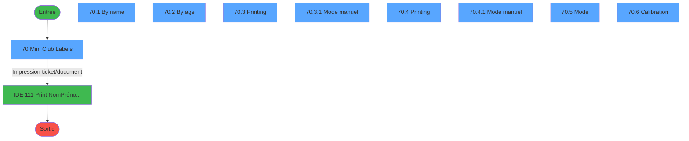
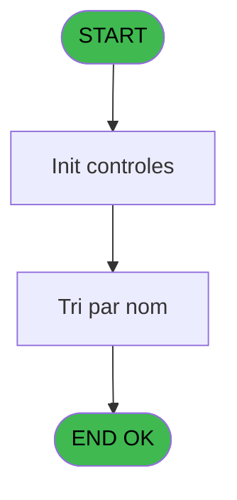
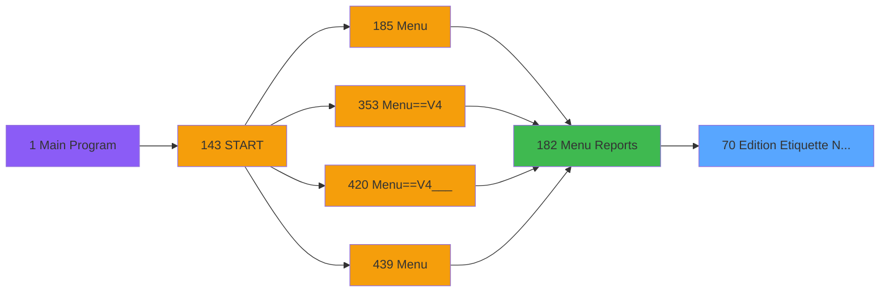

# PVE IDE 70 - Edition Etiquette NomPrénomAge

> **Analyse**: Phases 1-4 2026-02-03 09:07 -> 09:07 (20s) | Assemblage 09:07
> **Pipeline**: V7.2 Enrichi
> **Structure**: 4 onglets (Resume | Ecrans | Donnees | Connexions)

<!-- TAB:Resume -->

## 1. FICHE D'IDENTITE

| Attribut | Valeur |
|----------|--------|
| Projet | PVE |
| IDE Position | 70 |
| Nom Programme | Edition Etiquette NomPrénomAge |
| Fichier source | `Prg_70.xml` |
| Domaine metier | Impression |
| Taches | 10 (9 ecrans visibles) |
| Tables modifiees | 0 |
| Programmes appeles | 1 |

## 2. DESCRIPTION FONCTIONNELLE

**Edition Etiquette NomPrénomAge** assure la gestion complete de ce processus, accessible depuis [Menu Reports (IDE 182)](PVE-IDE-182.md).

Le flux de traitement s'organise en **2 blocs fonctionnels** :

- **Traitement** (8 taches) : traitements metier divers
- **Impression** (2 taches) : generation de tickets et documents

Detail : phases du traitement

#### Phase 1 : Traitement (8 taches)

- **70** - Mini Club Labels **[[ECRAN]](#ecran-t1)**
- **70.1** - By name **[[ECRAN]](#ecran-t2)**
- **70.2** - By age **[[ECRAN]](#ecran-t3)**
- **70.3.1** - Mode manuel **[[ECRAN]](#ecran-t5)**
- **70.4.1** - Mode manuel **[[ECRAN]](#ecran-t7)**
- **70.5** - Mode **[[ECRAN]](#ecran-t8)**
- **70.6** - Calibration **[[ECRAN]](#ecran-t9)**
- **70.6.1** - Calibration

#### Phase 2 : Impression (2 taches)

- **70.3** - Printing **[[ECRAN]](#ecran-t4)**
- **70.4** - Printing **[[ECRAN]](#ecran-t6)**

Delegue a : [Print NomPrénomAge sur TLP2824 (IDE 111)](PVE-IDE-111.md)

## 3. BLOCS FONCTIONNELS

### 3.1 Traitement (8 taches)

Traitements internes.

---

#### 70 - Mini Club Labels [[ECRAN]](#ecran-t1)

**Role** : Tache d'orchestration : point d'entree du programme (8 sous-taches). Coordonne l'enchainement des traitements.
**Ecran** : 400 x 0 DLU (MDI) | [Voir mockup](#ecran-t1)

7 sous-taches directes

| Tache | Nom | Bloc |
|-------|-----|------|
| [70.1](#t2) | By name **[[ECRAN]](#ecran-t2)** | Traitement |
| [70.2](#t3) | By age **[[ECRAN]](#ecran-t3)** | Traitement |
| [70.3.1](#t5) | Mode manuel **[[ECRAN]](#ecran-t5)** | Traitement |
| [70.4.1](#t7) | Mode manuel **[[ECRAN]](#ecran-t7)** | Traitement |
| [70.5](#t8) | Mode **[[ECRAN]](#ecran-t8)** | Traitement |
| [70.6](#t9) | Calibration **[[ECRAN]](#ecran-t9)** | Traitement |
| [70.6.1](#t10) | Calibration | Traitement |

**Variables liees** : M (V.Date age mini), D (Age mini), F (Date mini)

---

#### 70.1 - By name [[ECRAN]](#ecran-t2)

**Role** : Traitement : By name.
**Ecran** : 400 x 0 DLU (MDI) | [Voir mockup](#ecran-t2)

---

#### 70.2 - By age [[ECRAN]](#ecran-t3)

**Role** : Traitement : By age.
**Ecran** : 400 x 0 DLU (MDI) | [Voir mockup](#ecran-t3)

---

#### 70.3.1 - Mode manuel [[ECRAN]](#ecran-t5)

**Role** : Traitement : Mode manuel.
**Ecran** : 400 x 40 DLU (MDI) | [Voir mockup](#ecran-t5)
**Variables liees** : A (Mode manuel)

---

#### 70.4.1 - Mode manuel [[ECRAN]](#ecran-t7)

**Role** : Traitement : Mode manuel.
**Ecran** : 400 x 40 DLU (MDI) | [Voir mockup](#ecran-t7)
**Variables liees** : A (Mode manuel)

---

#### 70.5 - Mode [[ECRAN]](#ecran-t8)

**Role** : Traitement : Mode.
**Ecran** : 400 x 40 DLU (MDI) | [Voir mockup](#ecran-t8)
**Variables liees** : A (Mode manuel)

---

#### 70.6 - Calibration [[ECRAN]](#ecran-t9)

**Role** : Traitement : Calibration.
**Ecran** : 640 x 0 DLU (MDI) | [Voir mockup](#ecran-t9)

---

#### 70.6.1 - Calibration

**Role** : Traitement : Calibration.

### 3.2 Impression (2 taches)

Generation des documents et tickets.

---

#### 70.3 - Printing [[ECRAN]](#ecran-t4)

**Role** : Generation du document : Printing.
**Ecran** : 400 x 0 DLU (MDI) | [Voir mockup](#ecran-t4)
**Delegue a** : [Print NomPrénomAge sur TLP2824 (IDE 111)](PVE-IDE-111.md)

---

#### 70.4 - Printing [[ECRAN]](#ecran-t6)

**Role** : Generation du document : Printing.
**Ecran** : 400 x 0 DLU (MDI) | [Voir mockup](#ecran-t6)
**Delegue a** : [Print NomPrénomAge sur TLP2824 (IDE 111)](PVE-IDE-111.md)

## 5. REGLES METIER

*(Aucune regle metier identifiee)*

## 6. CONTEXTE

- **Appele par**: [Menu Reports (IDE 182)](PVE-IDE-182.md)
- **Appelle**: 1 programmes | **Tables**: 3 (W:0 R:1 L:2) | **Taches**: 10 | **Expressions**: 18

<!-- TAB:Ecrans -->

## 8. ECRANS

### 8.1 Forms visibles (9 / 10)

| # | Position | Tache | Nom | Type | Largeur | Hauteur | Bloc |
|---|----------|-------|-----|------|---------|---------|------|
| 1 | 70 | 70 | Mini Club Labels | MDI | 400 | 0 | Traitement |
| 2 | 70.1 | 70.1 | By name | MDI | 400 | 0 | Traitement |
| 3 | 70.2 | 70.2 | By age | MDI | 400 | 0 | Traitement |
| 4 | 70.3 | 70.3 | Printing | MDI | 400 | 0 | Impression |
| 5 | 70.3.1 | 70.3.1 | Mode manuel | MDI | 400 | 40 | Traitement |
| 6 | 70.4 | 70.4 | Printing | MDI | 400 | 0 | Impression |
| 7 | 70.4.1 | 70.4.1 | Mode manuel | MDI | 400 | 40 | Traitement |
| 8 | 70.5 | 70.5 | Mode | MDI | 400 | 40 | Traitement |
| 9 | 70.6 | 70.6 | Calibration | MDI | 640 | 0 | Traitement |

### 8.2 Mockups Ecrans

---

#### 70 - Mini Club Labels
**Tache** : [70](#t1) | **Type** : MDI | **Dimensions** : 400 x 0 DLU
**Bloc** : Traitement | **Titre IDE** : Mini Club Labels

<!-- FORM-DATA:
{
    "width":  400,
    "vFactor":  8,
    "type":  "MDI",
    "hFactor":  4,
    "controls":  [
                     {
                         "x":  109,
                         "type":  "label",
                         "var":  "",
                         "y":  36,
                         "w":  182,
                         "fmt":  "",
                         "name":  "",
                         "h":  120,
                         "color":  "182",
                         "text":  "",
                         "parent":  null
                     },
                     {
                         "x":  122,
                         "type":  "label",
                         "var":  "",
                         "y":  47,
                         "w":  86,
                         "fmt":  "",
                         "name":  "",
                         "h":  12,
                         "color":  "182",
                         "text":  "Mini age",
                         "parent":  null
                     },
                     {
                         "x":  122,
                         "type":  "label",
                         "var":  "",
                         "y":  64,
                         "w":  86,
                         "fmt":  "",
                         "name":  "",
                         "h":  12,
                         "color":  "182",
                         "text":  "Maxi age",
                         "parent":  null
                     },
                     {
                         "x":  122,
                         "type":  "label",
                         "var":  "",
                         "y":  81,
                         "w":  86,
                         "fmt":  "",
                         "name":  "",
                         "h":  12,
                         "color":  "182",
                         "text":  "Mini date",
                         "parent":  null
                     },
                     {
                         "x":  122,
                         "type":  "label",
                         "var":  "",
                         "y":  98,
                         "w":  86,
                         "fmt":  "",
                         "name":  "",
                         "h":  12,
                         "color":  "182",
                         "text":  "Maxi date",
                         "parent":  null
                     },
                     {
                         "x":  122,
                         "type":  "label",
                         "var":  "",
                         "y":  115,
                         "w":  86,
                         "fmt":  "",
                         "name":  "",
                         "h":  12,
                         "color":  "182",
                         "text":  "Sort",
                         "parent":  null
                     },
                     {
                         "x":  122,
                         "type":  "label",
                         "var":  "",
                         "y":  132,
                         "w":  86,
                         "fmt":  "",
                         "name":  "",
                         "h":  12,
                         "color":  "182",
                         "text":  "Number of copies",
                         "parent":  null
                     },
                     {
                         "x":  13,
                         "type":  "label",
                         "var":  "",
                         "y":  179,
                         "w":  375,
                         "fmt":  "",
                         "name":  "",
                         "h":  20,
                         "color":  "182",
                         "text":  "",
                         "parent":  null
                     },
                     {
                         "x":  214,
                         "type":  "edit",
                         "var":  "",
                         "y":  47,
                         "w":  18,
                         "fmt":  "2Z",
                         "name":  "Age mini",
                         "h":  12,
                         "color":  "110",
                         "text":  "",
                         "parent":  null
                     },
                     {
                         "x":  214,
                         "type":  "edit",
                         "var":  "",
                         "y":  64,
                         "w":  18,
                         "fmt":  "2Z",
                         "name":  "Age maxi",
                         "h":  12,
                         "color":  "110",
                         "text":  "",
                         "parent":  null
                     },
                     {
                         "x":  214,
                         "type":  "edit",
                         "var":  "",
                         "y":  81,
                         "w":  55,
                         "fmt":  "",
                         "name":  "Date mini",
                         "h":  12,
                         "color":  "110",
                         "text":  "",
                         "parent":  null
                     },
                     {
                         "x":  214,
                         "type":  "edit",
                         "var":  "",
                         "y":  98,
                         "w":  55,
                         "fmt":  "",
                         "name":  "Date maxi",
                         "h":  12,
                         "color":  "110",
                         "text":  "",
                         "parent":  null
                     },
                     {
                         "x":  214,
                         "type":  "combobox",
                         "var":  "",
                         "y":  115,
                         "w":  55,
                         "fmt":  "",
                         "name":  "Tri",
                         "h":  12,
                         "color":  "110",
                         "text":  "",
                         "parent":  null
                     },
                     {
                         "x":  214,
                         "type":  "edit",
                         "var":  "",
                         "y":  132,
                         "w":  18,
                         "fmt":  "",
                         "name":  "Nombre de copies",
                         "h":  12,
                         "color":  "110",
                         "text":  "",
                         "parent":  null
                     },
                     {
                         "x":  19,
                         "type":  "button",
                         "var":  "",
                         "y":  182,
                         "w":  56,
                         "fmt":  "Search",
                         "name":  "RECHERCHE",
                         "h":  14,
                         "color":  "",
                         "text":  "",
                         "parent":  null
                     },
                     {
                         "x":  13,
                         "type":  "edit",
                         "var":  "",
                         "y":  6,
                         "w":  375,
                         "fmt":  "30",
                         "name":  "",
                         "h":  12,
                         "color":  "188",
                         "text":  "",
                         "parent":  null
                     },
                     {
                         "x":  19,
                         "type":  "button",
                         "var":  "",
                         "y":  36,
                         "w":  56,
                         "fmt":  "Calibration",
                         "name":  "",
                         "h":  14,
                         "color":  "",
                         "text":  "",
                         "parent":  null
                     },
                     {
                         "x":  327,
                         "type":  "button",
                         "var":  "",
                         "y":  182,
                         "w":  56,
                         "fmt":  "Quitter",
                         "name":  "",
                         "h":  14,
                         "color":  "",
                         "text":  "",
                         "parent":  null
                     }
                 ],
    "taskId":  "70",
    "height":  0
}
-->

<strong>Champs : 7 champs</strong>

| Pos (x,y) | Nom | Variable | Type |
|-----------|-----|----------|------|
| 214,47 | Age mini | - | edit |
| 214,64 | Age maxi | - | edit |
| 214,81 | Date mini | - | edit |
| 214,98 | Date maxi | - | edit |
| 214,115 | Tri | - | combobox |
| 214,132 | Nombre de copies | - | edit |
| 13,6 | 30 | - | edit |

<strong>Boutons : 3 boutons</strong>

| Bouton | Pos (x,y) | Action |
|--------|-----------|--------|
| Search | 19,182 | Ouvre la selection |
| Calibration | 19,36 | Bouton fonctionnel |
| Quitter | 327,182 | Quitte le programme |

---

#### 70.1 - By name
**Tache** : [70.1](#t2) | **Type** : MDI | **Dimensions** : 400 x 0 DLU
**Bloc** : Traitement | **Titre IDE** : By name

<!-- FORM-DATA:
{
    "width":  400,
    "vFactor":  8,
    "type":  "MDI",
    "hFactor":  4,
    "controls":  [
                     {
                         "x":  5,
                         "type":  "label",
                         "var":  "",
                         "y":  7,
                         "w":  48,
                         "fmt":  "",
                         "name":  "",
                         "h":  10,
                         "color":  "183",
                         "text":  "A partir de",
                         "parent":  null
                     },
                     {
                         "x":  86,
                         "type":  "label",
                         "var":  "",
                         "y":  7,
                         "w":  23,
                         "fmt":  "",
                         "name":  "",
                         "h":  10,
                         "color":  "183",
                         "text":  "ans",
                         "parent":  null
                     },
                     {
                         "x":  115,
                         "type":  "label",
                         "var":  "",
                         "y":  7,
                         "w":  48,
                         "fmt":  "",
                         "name":  "",
                         "h":  10,
                         "color":  "183",
                         "text":  "Jusqu\u0027à",
                         "parent":  null
                     },
                     {
                         "x":  197,
                         "type":  "label",
                         "var":  "",
                         "y":  7,
                         "w":  23,
                         "fmt":  "",
                         "name":  "",
                         "h":  10,
                         "color":  "183",
                         "text":  "ans",
                         "parent":  null
                     },
                     {
                         "x":  6,
                         "type":  "label",
                         "var":  "",
                         "y":  22,
                         "w":  201,
                         "fmt":  "",
                         "name":  "",
                         "h":  10,
                         "color":  "183",
                         "text":  "Nom",
                         "parent":  null
                     },
                     {
                         "x":  210,
                         "type":  "label",
                         "var":  "",
                         "y":  22,
                         "w":  122,
                         "fmt":  "",
                         "name":  "",
                         "h":  10,
                         "color":  "183",
                         "text":  "Prénom",
                         "parent":  null
                     },
                     {
                         "x":  335,
                         "type":  "label",
                         "var":  "",
                         "y":  22,
                         "w":  28,
                         "fmt":  "",
                         "name":  "",
                         "h":  10,
                         "color":  "183",
                         "text":  "Age",
                         "parent":  null
                     },
                     {
                         "x":  4,
                         "type":  "label",
                         "var":  "",
                         "y":  170,
                         "w":  73,
                         "fmt":  "",
                         "name":  "",
                         "h":  8,
                         "color":  "183",
                         "text":  "Début séjour",
                         "parent":  null
                     },
                     {
                         "x":  252,
                         "type":  "label",
                         "var":  "",
                         "y":  170,
                         "w":  60,
                         "fmt":  "",
                         "name":  "",
                         "h":  8,
                         "color":  "183",
                         "text":  "Fin séjour",
                         "parent":  null
                     },
                     {
                         "x":  3,
                         "type":  "label",
                         "var":  "",
                         "y":  179,
                         "w":  375,
                         "fmt":  "",
                         "name":  "",
                         "h":  20,
                         "color":  "182",
                         "text":  "",
                         "parent":  null
                     },
                     {
                         "x":  6,
                         "type":  "label",
                         "var":  "",
                         "y":  182,
                         "w":  81,
                         "fmt":  "",
                         "name":  "",
                         "h":  14,
                         "color":  "182",
                         "text":  "Date naissance",
                         "parent":  null
                     },
                     {
                         "x":  4,
                         "type":  "table",
                         "var":  "",
                         "name":  "",
                         "titleH":  12,
                         "color":  "190",
                         "w":  383,
                         "y":  32,
                         "fmt":  "",
                         "parent":  null,
                         "text":  "",
                         "rowH":  12,
                         "h":  133,
                         "cols":  [
                                      {
                                          "title":  "",
                                          "layer":  1,
                                          "w":  204
                                      },
                                      {
                                          "title":  "",
                                          "layer":  2,
                                          "w":  125
                                      },
                                      {
                                          "title":  "",
                                          "layer":  3,
                                          "w":  31
                                      }
                                  ],
                         "rows":  3
                     },
                     {
                         "x":  6,
                         "type":  "edit",
                         "var":  "",
                         "y":  34,
                         "w":  201,
                         "fmt":  "",
                         "name":  "CTRL_001",
                         "h":  10,
                         "color":  "190",
                         "text":  "",
                         "parent":  17
                     },
                     {
                         "x":  210,
                         "type":  "edit",
                         "var":  "",
                         "y":  34,
                         "w":  122,
                         "fmt":  "",
                         "name":  "CTRL_002",
                         "h":  10,
                         "color":  "190",
                         "text":  "",
                         "parent":  17
                     },
                     {
                         "x":  90,
                         "type":  "edit",
                         "var":  "",
                         "y":  182,
                         "w":  63,
                         "fmt":  "",
                         "name":  "CTRL_003",
                         "h":  14,
                         "color":  "191",
                         "text":  "",
                         "parent":  null
                     },
                     {
                         "x":  78,
                         "type":  "edit",
                         "var":  "",
                         "y":  170,
                         "w":  63,
                         "fmt":  "",
                         "name":  "",
                         "h":  10,
                         "color":  "110",
                         "text":  "",
                         "parent":  null
                     },
                     {
                         "x":  313,
                         "type":  "edit",
                         "var":  "",
                         "y":  170,
                         "w":  63,
                         "fmt":  "",
                         "name":  "",
                         "h":  10,
                         "color":  "110",
                         "text":  "",
                         "parent":  null
                     },
                     {
                         "x":  59,
                         "type":  "edit",
                         "var":  "",
                         "y":  7,
                         "w":  21,
                         "fmt":  "2Z",
                         "name":  "",
                         "h":  10,
                         "color":  "183",
                         "text":  "",
                         "parent":  null
                     },
                     {
                         "x":  169,
                         "type":  "edit",
                         "var":  "",
                         "y":  7,
                         "w":  21,
                         "fmt":  "2Z",
                         "name":  "",
                         "h":  10,
                         "color":  "183",
                         "text":  "",
                         "parent":  null
                     },
                     {
                         "x":  335,
                         "type":  "edit",
                         "var":  "",
                         "y":  34,
                         "w":  28,
                         "fmt":  "2",
                         "name":  "",
                         "h":  10,
                         "color":  "190",
                         "text":  "",
                         "parent":  17
                     },
                     {
                         "x":  160,
                         "type":  "button",
                         "var":  "",
                         "y":  182,
                         "w":  48,
                         "fmt":  "Etiquette",
                         "name":  "",
                         "h":  14,
                         "color":  "",
                         "text":  "",
                         "parent":  null
                     },
                     {
                         "x":  218,
                         "type":  "button",
                         "var":  "",
                         "y":  182,
                         "w":  100,
                         "fmt":  "Toutes les étiquettes",
                         "name":  "",
                         "h":  14,
                         "color":  "",
                         "text":  "",
                         "parent":  null
                     },
                     {
                         "x":  328,
                         "type":  "button",
                         "var":  "",
                         "y":  182,
                         "w":  48,
                         "fmt":  "Quitter",
                         "name":  "",
                         "h":  14,
                         "color":  "",
                         "text":  "",
                         "parent":  null
                     }
                 ],
    "taskId":  "70.1",
    "height":  0
}
-->

<strong>Champs : 8 champs</strong>

| Pos (x,y) | Nom | Variable | Type |
|-----------|-----|----------|------|
| 6,34 | CTRL_001 | - | edit |
| 210,34 | CTRL_002 | - | edit |
| 90,182 | CTRL_003 | - | edit |
| 78,170 | (sans nom) | - | edit |
| 313,170 | (sans nom) | - | edit |
| 59,7 | 2Z | - | edit |
| 169,7 | 2Z | - | edit |
| 335,34 | 2 | - | edit |

<strong>Boutons : 3 boutons</strong>

| Bouton | Pos (x,y) | Action |
|--------|-----------|--------|
| Etiquette | 160,182 | Bouton fonctionnel |
| Toutes les étiquettes | 218,182 | Bouton fonctionnel |
| Quitter | 328,182 | Quitte le programme |

---

#### 70.2 - By age
**Tache** : [70.2](#t3) | **Type** : MDI | **Dimensions** : 400 x 0 DLU
**Bloc** : Traitement | **Titre IDE** : By age

<!-- FORM-DATA:
{
    "width":  400,
    "vFactor":  8,
    "type":  "MDI",
    "hFactor":  4,
    "controls":  [
                     {
                         "x":  9,
                         "type":  "label",
                         "var":  "",
                         "y":  7,
                         "w":  48,
                         "fmt":  "",
                         "name":  "",
                         "h":  10,
                         "color":  "183",
                         "text":  "A partir de",
                         "parent":  null
                     },
                     {
                         "x":  90,
                         "type":  "label",
                         "var":  "",
                         "y":  7,
                         "w":  23,
                         "fmt":  "",
                         "name":  "",
                         "h":  10,
                         "color":  "183",
                         "text":  "ans",
                         "parent":  null
                     },
                     {
                         "x":  119,
                         "type":  "label",
                         "var":  "",
                         "y":  7,
                         "w":  48,
                         "fmt":  "",
                         "name":  "",
                         "h":  10,
                         "color":  "183",
                         "text":  "Jusqu\u0027à",
                         "parent":  null
                     },
                     {
                         "x":  201,
                         "type":  "label",
                         "var":  "",
                         "y":  7,
                         "w":  23,
                         "fmt":  "",
                         "name":  "",
                         "h":  10,
                         "color":  "183",
                         "text":  "ans",
                         "parent":  null
                     },
                     {
                         "x":  6,
                         "type":  "label",
                         "var":  "",
                         "y":  23,
                         "w":  200,
                         "fmt":  "",
                         "name":  "",
                         "h":  10,
                         "color":  "183",
                         "text":  "Nom",
                         "parent":  null
                     },
                     {
                         "x":  210,
                         "type":  "label",
                         "var":  "",
                         "y":  23,
                         "w":  121,
                         "fmt":  "",
                         "name":  "",
                         "h":  10,
                         "color":  "183",
                         "text":  "Prénom",
                         "parent":  null
                     },
                     {
                         "x":  336,
                         "type":  "label",
                         "var":  "",
                         "y":  23,
                         "w":  26,
                         "fmt":  "",
                         "name":  "",
                         "h":  10,
                         "color":  "183",
                         "text":  "Age",
                         "parent":  null
                     },
                     {
                         "x":  4,
                         "type":  "label",
                         "var":  "",
                         "y":  171,
                         "w":  73,
                         "fmt":  "",
                         "name":  "",
                         "h":  8,
                         "color":  "183",
                         "text":  "Début séjour",
                         "parent":  null
                     },
                     {
                         "x":  252,
                         "type":  "label",
                         "var":  "",
                         "y":  171,
                         "w":  60,
                         "fmt":  "",
                         "name":  "",
                         "h":  8,
                         "color":  "183",
                         "text":  "Fin séjour",
                         "parent":  null
                     },
                     {
                         "x":  4,
                         "type":  "label",
                         "var":  "",
                         "y":  180,
                         "w":  375,
                         "fmt":  "",
                         "name":  "",
                         "h":  20,
                         "color":  "182",
                         "text":  "",
                         "parent":  null
                     },
                     {
                         "x":  6,
                         "type":  "label",
                         "var":  "",
                         "y":  183,
                         "w":  81,
                         "fmt":  "",
                         "name":  "",
                         "h":  14,
                         "color":  "182",
                         "text":  "Date naissance",
                         "parent":  null
                     },
                     {
                         "x":  4,
                         "type":  "table",
                         "var":  "",
                         "name":  "",
                         "titleH":  12,
                         "color":  "190",
                         "w":  378,
                         "y":  33,
                         "fmt":  "",
                         "parent":  null,
                         "text":  "",
                         "rowH":  12,
                         "h":  133,
                         "cols":  [
                                      {
                                          "title":  "",
                                          "layer":  1,
                                          "w":  204
                                      },
                                      {
                                          "title":  "",
                                          "layer":  2,
                                          "w":  125
                                      },
                                      {
                                          "title":  "",
                                          "layer":  3,
                                          "w":  31
                                      }
                                  ],
                         "rows":  3
                     },
                     {
                         "x":  6,
                         "type":  "edit",
                         "var":  "",
                         "y":  36,
                         "w":  200,
                         "fmt":  "",
                         "name":  "CTRL_001",
                         "h":  10,
                         "color":  "190",
                         "text":  "",
                         "parent":  17
                     },
                     {
                         "x":  210,
                         "type":  "edit",
                         "var":  "",
                         "y":  36,
                         "w":  121,
                         "fmt":  "",
                         "name":  "CTRL_002",
                         "h":  10,
                         "color":  "190",
                         "text":  "",
                         "parent":  17
                     },
                     {
                         "x":  90,
                         "type":  "edit",
                         "var":  "",
                         "y":  183,
                         "w":  63,
                         "fmt":  "",
                         "name":  "CTRL_003",
                         "h":  14,
                         "color":  "191",
                         "text":  "",
                         "parent":  null
                     },
                     {
                         "x":  78,
                         "type":  "edit",
                         "var":  "",
                         "y":  171,
                         "w":  63,
                         "fmt":  "",
                         "name":  "",
                         "h":  10,
                         "color":  "110",
                         "text":  "",
                         "parent":  null
                     },
                     {
                         "x":  313,
                         "type":  "edit",
                         "var":  "",
                         "y":  171,
                         "w":  63,
                         "fmt":  "",
                         "name":  "",
                         "h":  10,
                         "color":  "110",
                         "text":  "",
                         "parent":  null
                     },
                     {
                         "x":  63,
                         "type":  "edit",
                         "var":  "",
                         "y":  7,
                         "w":  21,
                         "fmt":  "2Z",
                         "name":  "",
                         "h":  10,
                         "color":  "183",
                         "text":  "",
                         "parent":  null
                     },
                     {
                         "x":  173,
                         "type":  "edit",
                         "var":  "",
                         "y":  7,
                         "w":  21,
                         "fmt":  "2Z",
                         "name":  "",
                         "h":  10,
                         "color":  "183",
                         "text":  "",
                         "parent":  null
                     },
                     {
                         "x":  336,
                         "type":  "edit",
                         "var":  "",
                         "y":  36,
                         "w":  26,
                         "fmt":  "2",
                         "name":  "",
                         "h":  10,
                         "color":  "190",
                         "text":  "",
                         "parent":  17
                     },
                     {
                         "x":  160,
                         "type":  "button",
                         "var":  "",
                         "y":  183,
                         "w":  48,
                         "fmt":  "Etiquette",
                         "name":  "",
                         "h":  14,
                         "color":  "",
                         "text":  "",
                         "parent":  null
                     },
                     {
                         "x":  218,
                         "type":  "button",
                         "var":  "",
                         "y":  183,
                         "w":  100,
                         "fmt":  "Toutes les étiquettes",
                         "name":  "",
                         "h":  14,
                         "color":  "",
                         "text":  "",
                         "parent":  null
                     },
                     {
                         "x":  328,
                         "type":  "button",
                         "var":  "",
                         "y":  183,
                         "w":  48,
                         "fmt":  "Quitter",
                         "name":  "",
                         "h":  14,
                         "color":  "",
                         "text":  "",
                         "parent":  null
                     }
                 ],
    "taskId":  "70.2",
    "height":  0
}
-->

<strong>Champs : 8 champs</strong>

| Pos (x,y) | Nom | Variable | Type |
|-----------|-----|----------|------|
| 6,36 | CTRL_001 | - | edit |
| 210,36 | CTRL_002 | - | edit |
| 90,183 | CTRL_003 | - | edit |
| 78,171 | (sans nom) | - | edit |
| 313,171 | (sans nom) | - | edit |
| 63,7 | 2Z | - | edit |
| 173,7 | 2Z | - | edit |
| 336,36 | 2 | - | edit |

<strong>Boutons : 3 boutons</strong>

| Bouton | Pos (x,y) | Action |
|--------|-----------|--------|
| Etiquette | 160,183 | Bouton fonctionnel |
| Toutes les étiquettes | 218,183 | Bouton fonctionnel |
| Quitter | 328,183 | Quitte le programme |

---

#### 70.3 - Printing
**Tache** : [70.3](#t4) | **Type** : MDI | **Dimensions** : 400 x 0 DLU
**Bloc** : Impression | **Titre IDE** : Printing

<!-- FORM-DATA:
{
    "width":  400,
    "vFactor":  8,
    "type":  "MDI",
    "hFactor":  4,
    "controls":  [
                     {
                         "x":  9,
                         "type":  "label",
                         "var":  "",
                         "y":  7,
                         "w":  48,
                         "fmt":  "",
                         "name":  "",
                         "h":  10,
                         "color":  "183",
                         "text":  "A partir de",
                         "parent":  null
                     },
                     {
                         "x":  90,
                         "type":  "label",
                         "var":  "",
                         "y":  7,
                         "w":  23,
                         "fmt":  "",
                         "name":  "",
                         "h":  10,
                         "color":  "183",
                         "text":  "ans",
                         "parent":  null
                     },
                     {
                         "x":  119,
                         "type":  "label",
                         "var":  "",
                         "y":  7,
                         "w":  48,
                         "fmt":  "",
                         "name":  "",
                         "h":  10,
                         "color":  "183",
                         "text":  "Jusqu\u0027à",
                         "parent":  null
                     },
                     {
                         "x":  201,
                         "type":  "label",
                         "var":  "",
                         "y":  7,
                         "w":  23,
                         "fmt":  "",
                         "name":  "",
                         "h":  10,
                         "color":  "183",
                         "text":  "ans",
                         "parent":  null
                     },
                     {
                         "x":  10,
                         "type":  "label",
                         "var":  "",
                         "y":  23,
                         "w":  200,
                         "fmt":  "",
                         "name":  "",
                         "h":  10,
                         "color":  "183",
                         "text":  "Nom",
                         "parent":  null
                     },
                     {
                         "x":  215,
                         "type":  "label",
                         "var":  "",
                         "y":  23,
                         "w":  121,
                         "fmt":  "",
                         "name":  "",
                         "h":  10,
                         "color":  "183",
                         "text":  "Prénom",
                         "parent":  null
                     },
                     {
                         "x":  340,
                         "type":  "label",
                         "var":  "",
                         "y":  23,
                         "w":  26,
                         "fmt":  "",
                         "name":  "",
                         "h":  10,
                         "color":  "183",
                         "text":  "Age",
                         "parent":  null
                     },
                     {
                         "x":  8,
                         "type":  "label",
                         "var":  "",
                         "y":  178,
                         "w":  375,
                         "fmt":  "",
                         "name":  "",
                         "h":  20,
                         "color":  "182",
                         "text":  "",
                         "parent":  null
                     },
                     {
                         "x":  10,
                         "type":  "label",
                         "var":  "",
                         "y":  181,
                         "w":  81,
                         "fmt":  "",
                         "name":  "",
                         "h":  14,
                         "color":  "182",
                         "text":  "Date naissance",
                         "parent":  null
                     },
                     {
                         "x":  8,
                         "type":  "table",
                         "var":  "",
                         "name":  "",
                         "titleH":  12,
                         "color":  "190",
                         "w":  376,
                         "y":  34,
                         "fmt":  "",
                         "parent":  null,
                         "text":  "",
                         "rowH":  12,
                         "h":  136,
                         "cols":  [
                                      {
                                          "title":  "",
                                          "layer":  1,
                                          "w":  204
                                      },
                                      {
                                          "title":  "",
                                          "layer":  2,
                                          "w":  125
                                      },
                                      {
                                          "title":  "",
                                          "layer":  3,
                                          "w":  31
                                      }
                                  ],
                         "rows":  3
                     },
                     {
                         "x":  63,
                         "type":  "edit",
                         "var":  "",
                         "y":  7,
                         "w":  21,
                         "fmt":  "2Z",
                         "name":  "",
                         "h":  10,
                         "color":  "183",
                         "text":  "",
                         "parent":  null
                     },
                     {
                         "x":  173,
                         "type":  "edit",
                         "var":  "",
                         "y":  7,
                         "w":  21,
                         "fmt":  "2Z",
                         "name":  "",
                         "h":  10,
                         "color":  "183",
                         "text":  "",
                         "parent":  null
                     },
                     {
                         "x":  10,
                         "type":  "edit",
                         "var":  "",
                         "y":  36,
                         "w":  200,
                         "fmt":  "",
                         "name":  "",
                         "h":  10,
                         "color":  "190",
                         "text":  "",
                         "parent":  13
                     },
                     {
                         "x":  215,
                         "type":  "edit",
                         "var":  "",
                         "y":  36,
                         "w":  121,
                         "fmt":  "",
                         "name":  "",
                         "h":  10,
                         "color":  "190",
                         "text":  "",
                         "parent":  13
                     },
                     {
                         "x":  340,
                         "type":  "edit",
                         "var":  "",
                         "y":  36,
                         "w":  26,
                         "fmt":  "2",
                         "name":  "",
                         "h":  10,
                         "color":  "190",
                         "text":  "",
                         "parent":  13
                     },
                     {
                         "x":  94,
                         "type":  "edit",
                         "var":  "",
                         "y":  181,
                         "w":  63,
                         "fmt":  "",
                         "name":  "",
                         "h":  14,
                         "color":  "191",
                         "text":  "",
                         "parent":  null
                     }
                 ],
    "taskId":  "70.3",
    "height":  0
}
-->

<strong>Champs : 6 champs</strong>

| Pos (x,y) | Nom | Variable | Type |
|-----------|-----|----------|------|
| 63,7 | 2Z | - | edit |
| 173,7 | 2Z | - | edit |
| 10,36 | (sans nom) | - | edit |
| 215,36 | (sans nom) | - | edit |
| 340,36 | 2 | - | edit |
| 94,181 | (sans nom) | - | edit |

---

#### 70.3.1 - Mode manuel
**Tache** : [70.3.1](#t5) | **Type** : MDI | **Dimensions** : 400 x 40 DLU
**Bloc** : Traitement | **Titre IDE** : Mode manuel

<!-- FORM-DATA:
{
    "width":  400,
    "vFactor":  8,
    "type":  "MDI",
    "hFactor":  4,
    "controls":  [
                     {
                         "x":  292,
                         "type":  "button",
                         "var":  "",
                         "y":  13,
                         "w":  77,
                         "fmt":  "Stop",
                         "name":  "Stop",
                         "h":  14,
                         "color":  "",
                         "text":  "",
                         "parent":  null
                     },
                     {
                         "x":  32,
                         "type":  "button",
                         "var":  "",
                         "y":  13,
                         "w":  77,
                         "fmt":  "Continue",
                         "name":  "",
                         "h":  14,
                         "color":  "",
                         "text":  "",
                         "parent":  null
                     }
                 ],
    "taskId":  "70.3.1",
    "height":  40
}
-->

<strong>Boutons : 2 boutons</strong>

| Bouton | Pos (x,y) | Action |
|--------|-----------|--------|
| Stop | 292,13 | Bouton fonctionnel |
| Continue | 32,13 | Bouton fonctionnel |

---

#### 70.4 - Printing
**Tache** : [70.4](#t6) | **Type** : MDI | **Dimensions** : 400 x 0 DLU
**Bloc** : Impression | **Titre IDE** : Printing

<!-- FORM-DATA:
{
    "width":  400,
    "vFactor":  8,
    "type":  "MDI",
    "hFactor":  4,
    "controls":  [
                     {
                         "x":  9,
                         "type":  "label",
                         "var":  "",
                         "y":  7,
                         "w":  48,
                         "fmt":  "",
                         "name":  "",
                         "h":  10,
                         "color":  "183",
                         "text":  "A partir de",
                         "parent":  null
                     },
                     {
                         "x":  90,
                         "type":  "label",
                         "var":  "",
                         "y":  7,
                         "w":  23,
                         "fmt":  "",
                         "name":  "",
                         "h":  10,
                         "color":  "183",
                         "text":  "ans",
                         "parent":  null
                     },
                     {
                         "x":  119,
                         "type":  "label",
                         "var":  "",
                         "y":  7,
                         "w":  48,
                         "fmt":  "",
                         "name":  "",
                         "h":  10,
                         "color":  "183",
                         "text":  "Jusqu\u0027à",
                         "parent":  null
                     },
                     {
                         "x":  201,
                         "type":  "label",
                         "var":  "",
                         "y":  7,
                         "w":  23,
                         "fmt":  "",
                         "name":  "",
                         "h":  10,
                         "color":  "183",
                         "text":  "ans",
                         "parent":  null
                     },
                     {
                         "x":  10,
                         "type":  "label",
                         "var":  "",
                         "y":  23,
                         "w":  200,
                         "fmt":  "",
                         "name":  "",
                         "h":  10,
                         "color":  "62",
                         "text":  "Nom",
                         "parent":  null
                     },
                     {
                         "x":  215,
                         "type":  "label",
                         "var":  "",
                         "y":  23,
                         "w":  121,
                         "fmt":  "",
                         "name":  "",
                         "h":  10,
                         "color":  "62",
                         "text":  "Prénom",
                         "parent":  null
                     },
                     {
                         "x":  340,
                         "type":  "label",
                         "var":  "",
                         "y":  23,
                         "w":  26,
                         "fmt":  "",
                         "name":  "",
                         "h":  10,
                         "color":  "62",
                         "text":  "Age",
                         "parent":  null
                     },
                     {
                         "x":  8,
                         "type":  "label",
                         "var":  "",
                         "y":  178,
                         "w":  377,
                         "fmt":  "",
                         "name":  "",
                         "h":  20,
                         "color":  "182",
                         "text":  "",
                         "parent":  null
                     },
                     {
                         "x":  10,
                         "type":  "label",
                         "var":  "",
                         "y":  181,
                         "w":  81,
                         "fmt":  "",
                         "name":  "",
                         "h":  14,
                         "color":  "182",
                         "text":  "Date naissance",
                         "parent":  null
                     },
                     {
                         "x":  8,
                         "type":  "table",
                         "var":  "",
                         "name":  "",
                         "titleH":  12,
                         "color":  "190",
                         "w":  376,
                         "y":  22,
                         "fmt":  "",
                         "parent":  null,
                         "text":  "",
                         "rowH":  12,
                         "h":  155,
                         "cols":  [
                                      {
                                          "title":  "",
                                          "layer":  1,
                                          "w":  204
                                      },
                                      {
                                          "title":  "",
                                          "layer":  2,
                                          "w":  125
                                      },
                                      {
                                          "title":  "",
                                          "layer":  3,
                                          "w":  31
                                      }
                                  ],
                         "rows":  3
                     },
                     {
                         "x":  63,
                         "type":  "edit",
                         "var":  "",
                         "y":  7,
                         "w":  21,
                         "fmt":  "2Z",
                         "name":  "",
                         "h":  10,
                         "color":  "183",
                         "text":  "",
                         "parent":  null
                     },
                     {
                         "x":  173,
                         "type":  "edit",
                         "var":  "",
                         "y":  7,
                         "w":  21,
                         "fmt":  "2Z",
                         "name":  "",
                         "h":  10,
                         "color":  "183",
                         "text":  "",
                         "parent":  null
                     },
                     {
                         "x":  10,
                         "type":  "edit",
                         "var":  "",
                         "y":  24,
                         "w":  200,
                         "fmt":  "",
                         "name":  "",
                         "h":  10,
                         "color":  "190",
                         "text":  "",
                         "parent":  13
                     },
                     {
                         "x":  215,
                         "type":  "edit",
                         "var":  "",
                         "y":  24,
                         "w":  121,
                         "fmt":  "",
                         "name":  "",
                         "h":  10,
                         "color":  "190",
                         "text":  "",
                         "parent":  13
                     },
                     {
                         "x":  340,
                         "type":  "edit",
                         "var":  "",
                         "y":  24,
                         "w":  26,
                         "fmt":  "2",
                         "name":  "",
                         "h":  10,
                         "color":  "190",
                         "text":  "",
                         "parent":  13
                     },
                     {
                         "x":  94,
                         "type":  "edit",
                         "var":  "",
                         "y":  181,
                         "w":  63,
                         "fmt":  "",
                         "name":  "",
                         "h":  14,
                         "color":  "191",
                         "text":  "",
                         "parent":  null
                     }
                 ],
    "taskId":  "70.4",
    "height":  0
}
-->

<strong>Champs : 6 champs</strong>

| Pos (x,y) | Nom | Variable | Type |
|-----------|-----|----------|------|
| 63,7 | 2Z | - | edit |
| 173,7 | 2Z | - | edit |
| 10,24 | (sans nom) | - | edit |
| 215,24 | (sans nom) | - | edit |
| 340,24 | 2 | - | edit |
| 94,181 | (sans nom) | - | edit |

---

#### 70.4.1 - Mode manuel
**Tache** : [70.4.1](#t7) | **Type** : MDI | **Dimensions** : 400 x 40 DLU
**Bloc** : Traitement | **Titre IDE** : Mode manuel

<!-- FORM-DATA:
{
    "width":  400,
    "vFactor":  8,
    "type":  "MDI",
    "hFactor":  4,
    "controls":  [
                     {
                         "x":  292,
                         "type":  "button",
                         "var":  "",
                         "y":  13,
                         "w":  77,
                         "fmt":  "Stop",
                         "name":  "Stop",
                         "h":  14,
                         "color":  "",
                         "text":  "",
                         "parent":  null
                     },
                     {
                         "x":  32,
                         "type":  "button",
                         "var":  "",
                         "y":  13,
                         "w":  77,
                         "fmt":  "Continue",
                         "name":  "",
                         "h":  14,
                         "color":  "",
                         "text":  "",
                         "parent":  null
                     }
                 ],
    "taskId":  "70.4.1",
    "height":  40
}
-->

<strong>Boutons : 2 boutons</strong>

| Bouton | Pos (x,y) | Action |
|--------|-----------|--------|
| Stop | 292,13 | Bouton fonctionnel |
| Continue | 32,13 | Bouton fonctionnel |

---

#### 70.5 - Mode
**Tache** : [70.5](#t8) | **Type** : MDI | **Dimensions** : 400 x 40 DLU
**Bloc** : Traitement | **Titre IDE** : Mode

<!-- FORM-DATA:
{
    "width":  400,
    "vFactor":  8,
    "type":  "MDI",
    "hFactor":  4,
    "controls":  [
                     {
                         "x":  19,
                         "type":  "button",
                         "var":  "",
                         "y":  15,
                         "w":  56,
                         "fmt":  "MANU",
                         "name":  "MANU",
                         "h":  14,
                         "color":  "",
                         "text":  "",
                         "parent":  null
                     },
                     {
                         "x":  326,
                         "type":  "button",
                         "var":  "",
                         "y":  15,
                         "w":  56,
                         "fmt":  "AUTO",
                         "name":  "AUTO",
                         "h":  14,
                         "color":  "",
                         "text":  "",
                         "parent":  null
                     }
                 ],
    "taskId":  "70.5",
    "height":  40
}
-->

<strong>Boutons : 2 boutons</strong>

| Bouton | Pos (x,y) | Action |
|--------|-----------|--------|
| MANU | 19,15 | Bouton fonctionnel |
| AUTO | 326,15 | Bouton fonctionnel |

---

#### 70.6 - Calibration
**Tache** : [70.6](#t9) | **Type** : MDI | **Dimensions** : 640 x 0 DLU
**Bloc** : Traitement | **Titre IDE** : Calibration

<!-- FORM-DATA:
{
    "width":  640,
    "vFactor":  8,
    "type":  "MDI",
    "hFactor":  8,
    "controls":  [
                     {
                         "x":  82,
                         "type":  "label",
                         "var":  "",
                         "y":  49,
                         "w":  476,
                         "fmt":  "",
                         "name":  "",
                         "h":  65,
                         "color":  "",
                         "text":  "",
                         "parent":  null
                     },
                     {
                         "x":  205,
                         "type":  "label",
                         "var":  "",
                         "y":  68,
                         "w":  231,
                         "fmt":  "",
                         "name":  "",
                         "h":  14,
                         "color":  "",
                         "text":  "Label Calibration",
                         "parent":  1
                     },
                     {
                         "x":  212,
                         "type":  "checkbox",
                         "var":  "",
                         "y":  89,
                         "w":  216,
                         "fmt":  "",
                         "name":  "Confirmation",
                         "h":  14,
                         "color":  "",
                         "text":  " Confirmation",
                         "parent":  null
                     },
                     {
                         "x":  398,
                         "type":  "button",
                         "var":  "",
                         "y":  137,
                         "w":  160,
                         "fmt":  "",
                         "name":  "Bouton Confirmation",
                         "h":  14,
                         "color":  "",
                         "text":  "",
                         "parent":  null
                     },
                     {
                         "x":  82,
                         "type":  "button",
                         "var":  "",
                         "y":  137,
                         "w":  160,
                         "fmt":  "Exit",
                         "name":  "",
                         "h":  14,
                         "color":  "",
                         "text":  "",
                         "parent":  null
                     }
                 ],
    "taskId":  "70.6",
    "height":  0
}
-->

<strong>Champs : 1 champs</strong>

| Pos (x,y) | Nom | Variable | Type |
|-----------|-----|----------|------|
| 212,89 | Confirmation | - | checkbox |

<strong>Boutons : 2 boutons</strong>

| Bouton | Pos (x,y) | Action |
|--------|-----------|--------|
| Confirmation | 398,137 | Valide la saisie et enregistre |
| Exit | 82,137 | Quitte le programme |

## 9. NAVIGATION

### 9.1 Enchainement des ecrans

**Detail par enchainement :**

| Depuis | Action | Vers | Retour |
|--------|--------|------|--------|
| Mini Club Labels | Impression ticket/document | [Print NomPrénomAge sur TLP2824 (IDE 111)](PVE-IDE-111.md) | Retour ecran |

### 9.3 Structure hierarchique (10 taches)

| Position | Tache | Type | Dimensions | Bloc |
|----------|-------|------|------------|------|
| **70.1** | [**Mini Club Labels** (70)](#t1) [mockup](#ecran-t1) | MDI | 400x0 | Traitement |
| 70.1.1 | [By name (70.1)](#t2) [mockup](#ecran-t2) | MDI | 400x0 | |
| 70.1.2 | [By age (70.2)](#t3) [mockup](#ecran-t3) | MDI | 400x0 | |
| 70.1.3 | [Mode manuel (70.3.1)](#t5) [mockup](#ecran-t5) | MDI | 400x40 | |
| 70.1.4 | [Mode manuel (70.4.1)](#t7) [mockup](#ecran-t7) | MDI | 400x40 | |
| 70.1.5 | [Mode (70.5)](#t8) [mockup](#ecran-t8) | MDI | 400x40 | |
| 70.1.6 | [Calibration (70.6)](#t9) [mockup](#ecran-t9) | MDI | 640x0 | |
| 70.1.7 | [Calibration (70.6.1)](#t10) | MDI | - | |
| **70.2** | [**Printing** (70.3)](#t4) [mockup](#ecran-t4) | MDI | 400x0 | Impression |
| 70.2.1 | [Printing (70.4)](#t6) [mockup](#ecran-t6) | MDI | 400x0 | |

### 9.4 Algorigramme

> **Legende**: Vert = START/END OK | Rouge = END KO | Bleu = Decisions
> *Algorigramme auto-genere. Utiliser `/algorigramme` pour une synthese metier detaillee.*

<!-- TAB:Donnees -->

## 10. TABLES

### Tables utilisees (3)

| ID | Nom | Description | Type | R | W | L | Usages |
|----|-----|-------------|------|---|---|---|--------|
| 30 | gm-recherche_____gmr | Index de recherche | DB | R |   |   | 4 |
| 31 | gm-complet_______gmc |  | DB |   |   | L | 4 |
| 34 | hebergement______heb | Hebergement (chambres) | DB |   |   | L | 4 |

### Colonnes par table (1 / 1 tables avec colonnes identifiees)

Table 30 - gm-recherche_____gmr (R) - 4 usages

| Lettre | Variable | Acces | Type |
|--------|----------|-------|------|
| A | Curseur | R | Logical |
| B | V.age | R | Numeric |

## 11. VARIABLES

### 11.1 Variables de session (2)

Variables persistantes pendant toute la session.

| Lettre | Nom | Type | Usage dans |
|--------|-----|------|-----------|
| M | V.Date age mini | Date | - |
| N | V.Date age maxi | Date | - |

### 11.2 Autres (12)

Variables diverses.

| Lettre | Nom | Type | Usage dans |
|--------|-----|------|-----------|
| A | Mode manuel | Logical | - |
| B | Flag fin édition | Logical | - |
| C | Flag existe | Logical | 1x refs |
| D | Age mini | Numeric | [70](#t1) |
| E | Age maxi | Numeric | 3x refs |
| F | Date mini | Date | [70](#t1) |
| G | Date maxi | Date | 2x refs |
| H | Tri | Alpha | 4x refs |
| I | Edition tranche nom | Logical | 1x refs |
| J | Edition tranche age | Logical | 2x refs |
| K | Nombre de copies | Numeric | - |
| L | RECHERCHE | Alpha | - |

## 12. EXPRESSIONS

**18 / 18 expressions decodees (100%)**

### 12.1 Repartition par type

| Type | Expressions | Regles |
|------|-------------|--------|
| CONSTANTE | 3 | 0 |
| DATE | 2 | 0 |
| REFERENCE_VG | 1 | 0 |
| CONDITION | 10 | 0 |
| NEGATION | 1 | 0 |
| CAST_LOGIQUE | 1 | 0 |

### 12.2 Expressions cles par type

#### CONSTANTE (3 expressions)

| Type | IDE | Expression | Regle |
|------|-----|------------|-------|
| CONSTANTE | 15 | `'Search'` | - |
| CONSTANTE | 11 | `1` | - |
| CONSTANTE | 7 | `'N'` | - |

#### DATE (2 expressions)

| Type | IDE | Expression | Regle |
|------|-----|------------|-------|
| DATE | 18 | `AddDate(Date(),-(Age maxi [E]),0,0)` | - |
| DATE | 17 | `AddDate(Date(),-(Age mini [D]),0,0)` | - |

#### REFERENCE_VG (1 expressions)

| Type | IDE | Expression | Regle |
|------|-----|------------|-------|
| REFERENCE_VG | 1 | `VG2` | - |

#### CONDITION (10 expressions)

| Type | IDE | Expression | Regle |
|------|-----|------------|-------|
| CONDITION | 10 | `Age maxi [E]<Age mini [D]` | - |
| CONDITION | 9 | `Age maxi [E]>17` | - |
| CONDITION | 12 | `Date mini [F]=0` | - |
| CONDITION | 14 | `Date mini [F]>Date maxi [G]` | - |
| CONDITION | 13 | `Date maxi [G]=0` | - |
| ... | | *+5 autres* | |

#### NEGATION (1 expressions)

| Type | IDE | Expression | Regle |
|------|-----|------------|-------|
| NEGATION | 6 | `NOT (Flag existe [C])` | - |

#### CAST_LOGIQUE (1 expressions)

| Type | IDE | Expression | Regle |
|------|-----|------------|-------|
| CAST_LOGIQUE | 16 | `'FALSE'LOG` | - |

<!-- TAB:Connexions -->

## 13. GRAPHE D'APPELS

### 13.1 Chaine depuis Main (Callers)

Main -> ... -> [Menu Reports (IDE 182)](PVE-IDE-182.md) -> **Edition Etiquette NomPrénomAge (IDE 70)**

### 13.2 Callers

| IDE | Nom Programme | Nb Appels |
|-----|---------------|-----------|
| [182](PVE-IDE-182.md) | Menu Reports | 1 |

### 13.3 Callees (programmes appeles)

### 13.4 Detail Callees avec contexte

| IDE | Nom Programme | Appels | Contexte |
|-----|---------------|--------|----------|
| [111](PVE-IDE-111.md) | Print NomPrénomAge sur TLP2824 | 4 | Impression ticket/document |

## 14. RECOMMANDATIONS MIGRATION

### 14.1 Profil du programme

| Metrique | Valeur | Impact migration |
|----------|--------|-----------------|
| Lignes de logique | 221 | Taille moyenne |
| Expressions | 18 | Peu de logique |
| Tables WRITE | 0 | Impact faible |
| Sous-programmes | 1 | Peu de dependances |
| Ecrans visibles | 9 | Interface complexe multi-ecrans |
| Code desactive | 0% (0 / 221) | Code sain |
| Regles metier | 0 | Pas de regle identifiee |

### 14.2 Plan de migration par bloc

#### Traitement (8 taches: 7 ecrans, 1 traitement)

- **Strategie** : Orchestrateur avec 7 ecrans (Razor/React) et 1 traitements backend (services).
- Les ecrans deviennent des composants UI, les traitements invisibles deviennent des services injectables.
- 1 sous-programme(s) a migrer ou a reutiliser depuis les services existants.
- Decomposer les taches en services unitaires testables.

#### Impression (2 taches: 2 ecrans, 0 traitement)

- **Strategie** : Templates HTML -> PDF via wkhtmltopdf ou Puppeteer.
- `PrintService` injectable avec choix imprimante

### 14.3 Dependances critiques

| Dependance | Type | Appels | Impact |
|------------|------|--------|--------|
| [Print NomPrénomAge sur TLP2824 (IDE 111)](PVE-IDE-111.md) | Sous-programme | 4x | **CRITIQUE** - Impression ticket/document |

---
*Spec DETAILED generee par Pipeline V7.2 - 2026-02-03 09:07*
