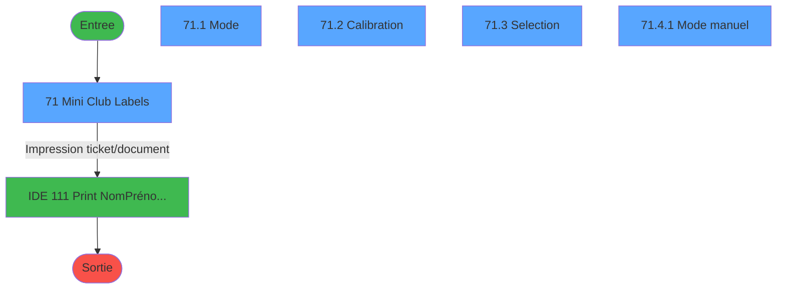
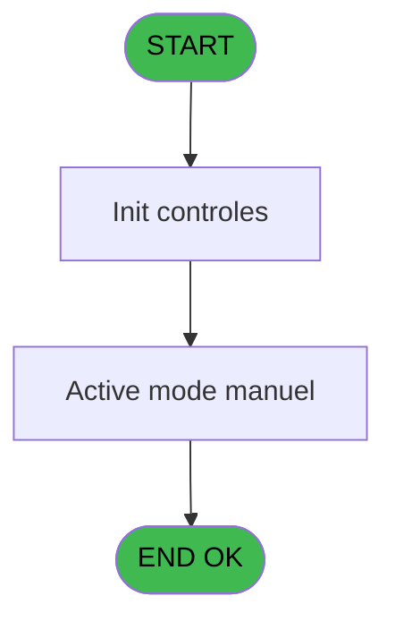
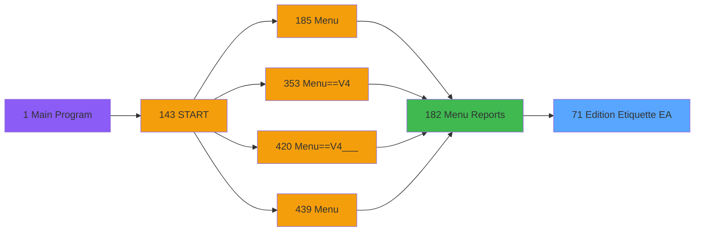

# PVE IDE 71 - Edition Etiquette (EA)

> **Analyse**: Phases 1-4 2026-02-03 09:07 -> 09:08 (21s) | Assemblage 09:08
> **Pipeline**: V7.2 Enrichi
> **Structure**: 4 onglets (Resume | Ecrans | Donnees | Connexions)

<!-- TAB:Resume -->

## 1. FICHE D'IDENTITE

| Attribut | Valeur |
|----------|--------|
| Projet | PVE |
| IDE Position | 71 |
| Nom Programme | Edition Etiquette (EA) |
| Fichier source | `Prg_71.xml` |
| Domaine metier | Impression |
| Taches | 8 (5 ecrans visibles) |
| Tables modifiees | 0 |
| Programmes appeles | 1 |

## 2. DESCRIPTION FONCTIONNELLE

**Edition Etiquette (EA)** assure la gestion complete de ce processus, accessible depuis [Menu Reports (IDE 182)](PVE-IDE-182.md).

Le flux de traitement s'organise en **2 blocs fonctionnels** :

- **Traitement** (5 taches) : traitements metier divers
- **Consultation** (3 taches) : ecrans de recherche, selection et consultation

Detail : phases du traitement

#### Phase 1 : Traitement (5 taches)

- **71** - Mini Club Labels **[[ECRAN]](#ecran-t1)**
- **71.1** - Mode **[[ECRAN]](#ecran-t2)**
- **71.2** - Calibration **[[ECRAN]](#ecran-t3)**
- **71.2.1** - Calibration
- **71.4.1** - Mode manuel **[[ECRAN]](#ecran-t7)**

#### Phase 2 : Consultation (3 taches)

- **71.3** - Selection **[[ECRAN]](#ecran-t5)**
- **71.4** - Selection **[[ECRAN]](#ecran-t6)**
- **71.5** - Selection **[[ECRAN]](#ecran-t8)**

## 3. BLOCS FONCTIONNELS

### 3.1 Traitement (5 taches)

Traitements internes.

---

#### 71 - Mini Club Labels [[ECRAN]](#ecran-t1)

**Role** : Traitement : Mini Club Labels.
**Ecran** : 361 x 222 DLU (Type6) | [Voir mockup](#ecran-t1)

4 sous-taches directes

| Tache | Nom | Bloc |
|-------|-----|------|
| [71.1](#t2) | Mode **[[ECRAN]](#ecran-t2)** | Traitement |
| [71.2](#t3) | Calibration **[[ECRAN]](#ecran-t3)** | Traitement |
| [71.2.1](#t4) | Calibration | Traitement |
| [71.4.1](#t7) | Mode manuel **[[ECRAN]](#ecran-t7)** | Traitement |

**Variables liees** : M (V.Date age mini), D (Age mini), F (Date mini)

---

#### 71.1 - Mode [[ECRAN]](#ecran-t2)

**Role** : Traitement : Mode.
**Ecran** : 400 x 40 DLU (MDI) | [Voir mockup](#ecran-t2)
**Variables liees** : A (Mode manuel)

---

#### 71.2 - Calibration [[ECRAN]](#ecran-t3)

**Role** : Traitement : Calibration.
**Ecran** : 640 x 0 DLU (MDI) | [Voir mockup](#ecran-t3)

---

#### 71.2.1 - Calibration

**Role** : Traitement : Calibration.

---

#### 71.4.1 - Mode manuel [[ECRAN]](#ecran-t7)

**Role** : Traitement : Mode manuel.
**Ecran** : 400 x 40 DLU (MDI) | [Voir mockup](#ecran-t7)
**Variables liees** : A (Mode manuel)

### 3.2 Consultation (3 taches)

Ecrans de recherche et consultation.

---

#### 71.3 - Selection [[ECRAN]](#ecran-t5)

**Role** : Selection par l'operateur : Selection.
**Ecran** : 590 x 302 DLU (Type6) | [Voir mockup](#ecran-t5)

---

#### 71.4 - Selection [[ECRAN]](#ecran-t6)

**Role** : Selection par l'operateur : Selection.
**Ecran** : 393 x 140 DLU | [Voir mockup](#ecran-t6)

---

#### 71.5 - Selection [[ECRAN]](#ecran-t8)

**Role** : Selection par l'operateur : Selection.
**Ecran** : 590 x 302 DLU (Type6) | [Voir mockup](#ecran-t8)

## 5. REGLES METIER

*(Aucune regle metier identifiee)*

## 6. CONTEXTE

- **Appele par**: [Menu Reports (IDE 182)](PVE-IDE-182.md)
- **Appelle**: 1 programmes | **Tables**: 1 (W:0 R:1 L:0) | **Taches**: 8 | **Expressions**: 14

<!-- TAB:Ecrans -->

## 8. ECRANS

### 8.1 Forms visibles (5 / 8)

| # | Position | Tache | Nom | Type | Largeur | Hauteur | Bloc |
|---|----------|-------|-----|------|---------|---------|------|
| 1 | 71 | 71 | Mini Club Labels | Type6 | 361 | 222 | Traitement |
| 2 | 71.1 | 71.1 | Mode | MDI | 400 | 40 | Traitement |
| 3 | 71.2 | 71.2 | Calibration | MDI | 640 | 0 | Traitement |
| 4 | 71.3 | 71.3 | Selection | Type6 | 590 | 302 | Consultation |
| 5 | 71.4.1 | 71.4.1 | Mode manuel | MDI | 400 | 40 | Traitement |

### 8.2 Mockups Ecrans

---

#### 71 - Mini Club Labels
**Tache** : [71](#t1) | **Type** : Type6 | **Dimensions** : 361 x 222 DLU
**Bloc** : Traitement | **Titre IDE** : Mini Club Labels

<!-- FORM-DATA:
{
    "width":  361,
    "vFactor":  8,
    "type":  "Type6",
    "hFactor":  4,
    "controls":  [
                     {
                         "x":  105,
                         "type":  "label",
                         "var":  "",
                         "y":  49,
                         "w":  86,
                         "fmt":  "",
                         "name":  "",
                         "h":  16,
                         "color":  "183",
                         "text":  "Mini age",
                         "parent":  null
                     },
                     {
                         "x":  105,
                         "type":  "label",
                         "var":  "",
                         "y":  68,
                         "w":  86,
                         "fmt":  "",
                         "name":  "",
                         "h":  16,
                         "color":  "183",
                         "text":  "Maxi age",
                         "parent":  null
                     },
                     {
                         "x":  105,
                         "type":  "label",
                         "var":  "",
                         "y":  87,
                         "w":  86,
                         "fmt":  "",
                         "name":  "",
                         "h":  16,
                         "color":  "183",
                         "text":  "Mini date",
                         "parent":  null
                     },
                     {
                         "x":  105,
                         "type":  "label",
                         "var":  "",
                         "y":  106,
                         "w":  86,
                         "fmt":  "",
                         "name":  "",
                         "h":  16,
                         "color":  "183",
                         "text":  "Maxi date",
                         "parent":  null
                     },
                     {
                         "x":  105,
                         "type":  "label",
                         "var":  "",
                         "y":  125,
                         "w":  76,
                         "fmt":  "",
                         "name":  "",
                         "h":  16,
                         "color":  "183",
                         "text":  "Easy Arrival",
                         "parent":  null
                     },
                     {
                         "x":  105,
                         "type":  "label",
                         "var":  "",
                         "y":  144,
                         "w":  86,
                         "fmt":  "",
                         "name":  "",
                         "h":  16,
                         "color":  "183",
                         "text":  "Sort",
                         "parent":  null
                     },
                     {
                         "x":  105,
                         "type":  "label",
                         "var":  "",
                         "y":  163,
                         "w":  86,
                         "fmt":  "",
                         "name":  "",
                         "h":  16,
                         "color":  "183",
                         "text":  "Number of copies",
                         "parent":  null
                     },
                     {
                         "x":  0,
                         "type":  "label",
                         "var":  "",
                         "y":  1,
                         "w":  360,
                         "fmt":  "",
                         "name":  "",
                         "h":  42,
                         "color":  "182",
                         "text":  "",
                         "parent":  null
                     },
                     {
                         "x":  1,
                         "type":  "label",
                         "var":  "",
                         "y":  186,
                         "w":  358,
                         "fmt":  "",
                         "name":  "",
                         "h":  34,
                         "color":  "183",
                         "text":  "",
                         "parent":  null
                     },
                     {
                         "x":  196,
                         "type":  "edit",
                         "var":  "",
                         "y":  49,
                         "w":  18,
                         "fmt":  "2Z",
                         "name":  "Age mini",
                         "h":  16,
                         "color":  "110",
                         "text":  "",
                         "parent":  null
                     },
                     {
                         "x":  196,
                         "type":  "edit",
                         "var":  "",
                         "y":  68,
                         "w":  18,
                         "fmt":  "2Z",
                         "name":  "Age maxi",
                         "h":  16,
                         "color":  "110",
                         "text":  "",
                         "parent":  null
                     },
                     {
                         "x":  196,
                         "type":  "edit",
                         "var":  "",
                         "y":  87,
                         "w":  59,
                         "fmt":  "",
                         "name":  "Date mini",
                         "h":  16,
                         "color":  "110",
                         "text":  "",
                         "parent":  null
                     },
                     {
                         "x":  196,
                         "type":  "edit",
                         "var":  "",
                         "y":  106,
                         "w":  59,
                         "fmt":  "",
                         "name":  "Date maxi",
                         "h":  16,
                         "color":  "110",
                         "text":  "",
                         "parent":  null
                     },
                     {
                         "x":  196,
                         "type":  "combobox",
                         "var":  "",
                         "y":  144,
                         "w":  56,
                         "fmt":  "",
                         "name":  "Tri",
                         "h":  16,
                         "color":  "110",
                         "text":  "1,2",
                         "parent":  null
                     },
                     {
                         "x":  196,
                         "type":  "edit",
                         "var":  "",
                         "y":  163,
                         "w":  18,
                         "fmt":  "",
                         "name":  "Nombre de copies",
                         "h":  16,
                         "color":  "110",
                         "text":  "",
                         "parent":  null
                     },
                     {
                         "x":  7,
                         "type":  "edit",
                         "var":  "",
                         "y":  18,
                         "w":  216,
                         "fmt":  "30",
                         "name":  "",
                         "h":  10,
                         "color":  "186",
                         "text":  "",
                         "parent":  13
                     },
                     {
                         "x":  185,
                         "type":  "button",
                         "var":  "",
                         "y":  191,
                         "w":  72,
                         "fmt":  "Calibration",
                         "name":  "",
                         "h":  28,
                         "color":  "",
                         "text":  "",
                         "parent":  null
                     },
                     {
                         "x":  196,
                         "type":  "combobox",
                         "var":  "",
                         "y":  125,
                         "w":  147,
                         "fmt":  "",
                         "name":  "v Filtre ECI",
                         "h":  16,
                         "color":  "110",
                         "text":  "1,2,3,4,5,6",
                         "parent":  null
                     },
                     {
                         "x":  309,
                         "type":  "image",
                         "var":  "",
                         "y":  6,
                         "w":  48,
                         "fmt":  "",
                         "name":  "",
                         "h":  36,
                         "color":  "",
                         "text":  "",
                         "parent":  13
                     },
                     {
                         "x":  2,
                         "type":  "button",
                         "var":  "",
                         "y":  191,
                         "w":  68,
                         "fmt":  "\u0026Exit",
                         "name":  "",
                         "h":  28,
                         "color":  "",
                         "text":  "",
                         "parent":  null
                     },
                     {
                         "x":  290,
                         "type":  "button",
                         "var":  "",
                         "y":  191,
                         "w":  68,
                         "fmt":  "\u0026Search",
                         "name":  "RECHERCHE",
                         "h":  28,
                         "color":  "",
                         "text":  "",
                         "parent":  null
                     }
                 ],
    "taskId":  "71",
    "height":  222
}
-->

<strong>Champs : 8 champs</strong>

| Pos (x,y) | Nom | Variable | Type |
|-----------|-----|----------|------|
| 196,49 | Age mini | - | edit |
| 196,68 | Age maxi | - | edit |
| 196,87 | Date mini | - | edit |
| 196,106 | Date maxi | - | edit |
| 196,144 | Tri | - | combobox |
| 196,163 | Nombre de copies | - | edit |
| 7,18 | 30 | - | edit |
| 196,125 | v Filtre ECI | - | combobox |

<strong>Boutons : 3 boutons</strong>

| Bouton | Pos (x,y) | Action |
|--------|-----------|--------|
| Calibration | 185,191 | Bouton fonctionnel |
| Exit | 2,191 | Quitte le programme |
| Search | 290,191 | Ouvre la selection |

---

#### 71.1 - Mode
**Tache** : [71.1](#t2) | **Type** : MDI | **Dimensions** : 400 x 40 DLU
**Bloc** : Traitement | **Titre IDE** : Mode

<!-- FORM-DATA:
{
    "width":  400,
    "vFactor":  8,
    "type":  "MDI",
    "hFactor":  4,
    "controls":  [
                     {
                         "x":  19,
                         "type":  "button",
                         "var":  "",
                         "y":  15,
                         "w":  56,
                         "fmt":  "MANU",
                         "name":  "MANU",
                         "h":  14,
                         "color":  "",
                         "text":  "",
                         "parent":  null
                     },
                     {
                         "x":  326,
                         "type":  "button",
                         "var":  "",
                         "y":  15,
                         "w":  56,
                         "fmt":  "AUTO",
                         "name":  "AUTO",
                         "h":  14,
                         "color":  "",
                         "text":  "",
                         "parent":  null
                     }
                 ],
    "taskId":  "71.1",
    "height":  40
}
-->

<strong>Boutons : 2 boutons</strong>

| Bouton | Pos (x,y) | Action |
|--------|-----------|--------|
| MANU | 19,15 | Bouton fonctionnel |
| AUTO | 326,15 | Bouton fonctionnel |

---

#### 71.2 - Calibration
**Tache** : [71.2](#t3) | **Type** : MDI | **Dimensions** : 640 x 0 DLU
**Bloc** : Traitement | **Titre IDE** : Calibration

<!-- FORM-DATA:
{
    "width":  640,
    "vFactor":  8,
    "type":  "MDI",
    "hFactor":  8,
    "controls":  [
                     {
                         "x":  82,
                         "type":  "label",
                         "var":  "",
                         "y":  49,
                         "w":  476,
                         "fmt":  "",
                         "name":  "",
                         "h":  65,
                         "color":  "",
                         "text":  "",
                         "parent":  null
                     },
                     {
                         "x":  205,
                         "type":  "label",
                         "var":  "",
                         "y":  68,
                         "w":  231,
                         "fmt":  "",
                         "name":  "",
                         "h":  14,
                         "color":  "",
                         "text":  "Label Calibration",
                         "parent":  1
                     },
                     {
                         "x":  212,
                         "type":  "checkbox",
                         "var":  "",
                         "y":  89,
                         "w":  216,
                         "fmt":  "",
                         "name":  "Confirmation",
                         "h":  14,
                         "color":  "",
                         "text":  " Confirmation",
                         "parent":  null
                     },
                     {
                         "x":  398,
                         "type":  "button",
                         "var":  "",
                         "y":  137,
                         "w":  160,
                         "fmt":  "",
                         "name":  "Bouton Confirmation",
                         "h":  14,
                         "color":  "",
                         "text":  "",
                         "parent":  null
                     },
                     {
                         "x":  82,
                         "type":  "button",
                         "var":  "",
                         "y":  137,
                         "w":  160,
                         "fmt":  "Exit",
                         "name":  "",
                         "h":  14,
                         "color":  "",
                         "text":  "",
                         "parent":  null
                     }
                 ],
    "taskId":  "71.2",
    "height":  0
}
-->

<strong>Champs : 1 champs</strong>

| Pos (x,y) | Nom | Variable | Type |
|-----------|-----|----------|------|
| 212,89 | Confirmation | - | checkbox |

<strong>Boutons : 2 boutons</strong>

| Bouton | Pos (x,y) | Action |
|--------|-----------|--------|
| Confirmation | 398,137 | Valide la saisie et enregistre |
| Exit | 82,137 | Quitte le programme |

---

#### 71.3 - Selection
**Tache** : [71.3](#t5) | **Type** : Type6 | **Dimensions** : 590 x 302 DLU
**Bloc** : Consultation | **Titre IDE** : Selection

<!-- FORM-DATA:
{
    "width":  590,
    "vFactor":  8,
    "type":  "Type6",
    "hFactor":  4,
    "controls":  [
                     {
                         "x":  43,
                         "type":  "label",
                         "var":  "",
                         "y":  1,
                         "w":  179,
                         "fmt":  "",
                         "name":  "",
                         "h":  10,
                         "color":  "187",
                         "text":  "records were selected between",
                         "parent":  null
                     },
                     {
                         "x":  251,
                         "type":  "label",
                         "var":  "",
                         "y":  1,
                         "w":  10,
                         "fmt":  "",
                         "name":  "",
                         "h":  10,
                         "color":  "187",
                         "text":  "-",
                         "parent":  null
                     },
                     {
                         "x":  287,
                         "type":  "label",
                         "var":  "",
                         "y":  1,
                         "w":  65,
                         "fmt":  "",
                         "name":  "",
                         "h":  10,
                         "color":  "187",
                         "text":  "years old",
                         "parent":  null
                     },
                     {
                         "x":  5,
                         "type":  "label",
                         "var":  "",
                         "y":  17,
                         "w":  201,
                         "fmt":  "",
                         "name":  "",
                         "h":  10,
                         "color":  "187",
                         "text":  "Name",
                         "parent":  null
                     },
                     {
                         "x":  209,
                         "type":  "label",
                         "var":  "",
                         "y":  17,
                         "w":  122,
                         "fmt":  "",
                         "name":  "",
                         "h":  10,
                         "color":  "187",
                         "text":  "First Name",
                         "parent":  null
                     },
                     {
                         "x":  334,
                         "type":  "label",
                         "var":  "",
                         "y":  17,
                         "w":  28,
                         "fmt":  "",
                         "name":  "",
                         "h":  10,
                         "color":  "187",
                         "text":  "Age",
                         "parent":  null
                     },
                     {
                         "x":  370,
                         "type":  "label",
                         "var":  "",
                         "y":  17,
                         "w":  60,
                         "fmt":  "",
                         "name":  "",
                         "h":  10,
                         "color":  "187",
                         "text":  "Birth date",
                         "parent":  null
                     },
                     {
                         "x":  437,
                         "type":  "label",
                         "var":  "",
                         "y":  17,
                         "w":  60,
                         "fmt":  "",
                         "name":  "",
                         "h":  10,
                         "color":  "187",
                         "text":  "Start date",
                         "parent":  null
                     },
                     {
                         "x":  508,
                         "type":  "label",
                         "var":  "",
                         "y":  17,
                         "w":  60,
                         "fmt":  "",
                         "name":  "",
                         "h":  10,
                         "color":  "187",
                         "text":  "End date",
                         "parent":  null
                     },
                     {
                         "x":  2,
                         "type":  "table",
                         "var":  "",
                         "name":  "",
                         "titleH":  12,
                         "color":  "190",
                         "w":  586,
                         "y":  27,
                         "fmt":  "",
                         "parent":  null,
                         "text":  "",
                         "rowH":  17,
                         "h":  239,
                         "cols":  [
                                      {
                                          "title":  "",
                                          "layer":  1,
                                          "w":  204
                                      },
                                      {
                                          "title":  "",
                                          "layer":  2,
                                          "w":  125
                                      },
                                      {
                                          "title":  "",
                                          "layer":  3,
                                          "w":  31
                                      },
                                      {
                                          "title":  "",
                                          "layer":  4,
                                          "w":  70
                                      },
                                      {
                                          "title":  "",
                                          "layer":  5,
                                          "w":  70
                                      },
                                      {
                                          "title":  "",
                                          "layer":  6,
                                          "w":  70
                                      }
                                  ],
                         "rows":  6
                     },
                     {
                         "x":  2,
                         "type":  "label",
                         "var":  "",
                         "y":  265,
                         "w":  585,
                         "fmt":  "",
                         "name":  "",
                         "h":  35,
                         "color":  "183",
                         "text":  "",
                         "parent":  null
                     },
                     {
                         "x":  4,
                         "type":  "edit",
                         "var":  "",
                         "y":  1,
                         "w":  32,
                         "fmt":  "6Z",
                         "name":  "v Nbre enregistrements",
                         "h":  10,
                         "color":  "187",
                         "text":  "",
                         "parent":  null
                     },
                     {
                         "x":  223,
                         "type":  "edit",
                         "var":  "",
                         "y":  1,
                         "w":  21,
                         "fmt":  "2Z",
                         "name":  "Age mini",
                         "h":  10,
                         "color":  "187",
                         "text":  "",
                         "parent":  null
                     },
                     {
                         "x":  261,
                         "type":  "edit",
                         "var":  "",
                         "y":  1,
                         "w":  21,
                         "fmt":  "2Z",
                         "name":  "Age maxi",
                         "h":  10,
                         "color":  "187",
                         "text":  "",
                         "parent":  null
                     },
                     {
                         "x":  4,
                         "type":  "edit",
                         "var":  "",
                         "y":  33,
                         "w":  192,
                         "fmt":  "",
                         "name":  "CTRL_001",
                         "h":  8,
                         "color":  "190",
                         "text":  "",
                         "parent":  13
                     },
                     {
                         "x":  208,
                         "type":  "edit",
                         "var":  "",
                         "y":  33,
                         "w":  128,
                         "fmt":  "",
                         "name":  "CTRL_002",
                         "h":  8,
                         "color":  "190",
                         "text":  "",
                         "parent":  13
                     },
                     {
                         "x":  334,
                         "type":  "edit",
                         "var":  "",
                         "y":  33,
                         "w":  11,
                         "fmt":  "2",
                         "name":  "gmr_age_num",
                         "h":  8,
                         "color":  "190",
                         "text":  "",
                         "parent":  13
                     },
                     {
                         "x":  366,
                         "type":  "edit",
                         "var":  "",
                         "y":  33,
                         "w":  66,
                         "fmt":  "##/##/####",
                         "name":  "CTRL_003",
                         "h":  8,
                         "color":  "190",
                         "text":  "",
                         "parent":  13
                     },
                     {
                         "x":  436,
                         "type":  "edit",
                         "var":  "",
                         "y":  33,
                         "w":  66,
                         "fmt":  "##/##/####",
                         "name":  "",
                         "h":  8,
                         "color":  "190",
                         "text":  "",
                         "parent":  13
                     },
                     {
                         "x":  506,
                         "type":  "edit",
                         "var":  "",
                         "y":  33,
                         "w":  66,
                         "fmt":  "##/##/####",
                         "name":  "",
                         "h":  8,
                         "color":  "190",
                         "text":  "",
                         "parent":  13
                     },
                     {
                         "x":  6,
                         "type":  "button",
                         "var":  "",
                         "y":  270,
                         "w":  68,
                         "fmt":  "\u0026Exit",
                         "name":  "",
                         "h":  28,
                         "color":  "",
                         "text":  "",
                         "parent":  null
                     },
                     {
                         "x":  399,
                         "type":  "button",
                         "var":  "",
                         "y":  270,
                         "w":  81,
                         "fmt":  "Print one label",
                         "name":  "b.Edition 1 Etiquette",
                         "h":  28,
                         "color":  "",
                         "text":  "",
                         "parent":  null
                     },
                     {
                         "x":  484,
                         "type":  "button",
                         "var":  "",
                         "y":  270,
                         "w":  100,
                         "fmt":  "Print all labels",
                         "name":  "b.Edition Toutes Etiquettes",
                         "h":  28,
                         "color":  "",
                         "text":  "",
                         "parent":  null
                     }
                 ],
    "taskId":  "71.3",
    "height":  302
}
-->

<strong>Champs : 9 champs</strong>

| Pos (x,y) | Nom | Variable | Type |
|-----------|-----|----------|------|
| 4,1 | v Nbre enregistrements | - | edit |
| 223,1 | Age mini | - | edit |
| 261,1 | Age maxi | - | edit |
| 4,33 | CTRL_001 | - | edit |
| 208,33 | CTRL_002 | - | edit |
| 334,33 | gmr_age_num | - | edit |
| 366,33 | CTRL_003 | - | edit |
| 436,33 | ##/##/#### | - | edit |
| 506,33 | ##/##/#### | - | edit |

<strong>Boutons : 3 boutons</strong>

| Bouton | Pos (x,y) | Action |
|--------|-----------|--------|
| Exit | 6,270 | Quitte le programme |
| Print one label | 399,270 | Appel [Print NomPrénomAge sur TLP2824 (IDE 111)](PVE-IDE-111.md) |
| Print all labels | 484,270 | Appel [Print NomPrénomAge sur TLP2824 (IDE 111)](PVE-IDE-111.md) |

---

#### 71.4.1 - Mode manuel
**Tache** : [71.4.1](#t7) | **Type** : MDI | **Dimensions** : 400 x 40 DLU
**Bloc** : Traitement | **Titre IDE** : Mode manuel

<!-- FORM-DATA:
{
    "width":  400,
    "vFactor":  8,
    "type":  "MDI",
    "hFactor":  4,
    "controls":  [
                     {
                         "x":  292,
                         "type":  "button",
                         "var":  "",
                         "y":  13,
                         "w":  77,
                         "fmt":  "Stop",
                         "name":  "Stop",
                         "h":  14,
                         "color":  "",
                         "text":  "",
                         "parent":  null
                     },
                     {
                         "x":  32,
                         "type":  "button",
                         "var":  "",
                         "y":  13,
                         "w":  77,
                         "fmt":  "Continue",
                         "name":  "",
                         "h":  14,
                         "color":  "",
                         "text":  "",
                         "parent":  null
                     }
                 ],
    "taskId":  "71.4.1",
    "height":  40
}
-->

<strong>Boutons : 2 boutons</strong>

| Bouton | Pos (x,y) | Action |
|--------|-----------|--------|
| Stop | 292,13 | Bouton fonctionnel |
| Continue | 32,13 | Bouton fonctionnel |

## 9. NAVIGATION

### 9.1 Enchainement des ecrans

**Detail par enchainement :**

| Depuis | Action | Vers | Retour |
|--------|--------|------|--------|
| Mini Club Labels | Impression ticket/document | [Print NomPrénomAge sur TLP2824 (IDE 111)](PVE-IDE-111.md) | Retour ecran |

### 9.3 Structure hierarchique (8 taches)

| Position | Tache | Type | Dimensions | Bloc |
|----------|-------|------|------------|------|
| **71.1** | [**Mini Club Labels** (71)](#t1) [mockup](#ecran-t1) | Type6 | 361x222 | Traitement |
| 71.1.1 | [Mode (71.1)](#t2) [mockup](#ecran-t2) | MDI | 400x40 | |
| 71.1.2 | [Calibration (71.2)](#t3) [mockup](#ecran-t3) | MDI | 640x0 | |
| 71.1.3 | [Calibration (71.2.1)](#t4) | MDI | - | |
| 71.1.4 | [Mode manuel (71.4.1)](#t7) [mockup](#ecran-t7) | MDI | 400x40 | |
| **71.2** | [**Selection** (71.3)](#t5) [mockup](#ecran-t5) | Type6 | 590x302 | Consultation |
| 71.2.1 | [Selection (71.4)](#t6) [mockup](#ecran-t6) | - | 393x140 | |
| 71.2.2 | [Selection (71.5)](#t8) [mockup](#ecran-t8) | Type6 | 590x302 | |

### 9.4 Algorigramme

> **Legende**: Vert = START/END OK | Rouge = END KO | Bleu = Decisions
> *Algorigramme auto-genere. Utiliser `/algorigramme` pour une synthese metier detaillee.*

<!-- TAB:Donnees -->

## 10. TABLES

### Tables utilisees (1)

| ID | Nom | Description | Type | R | W | L | Usages |
|----|-----|-------------|------|---|---|---|--------|
| 805 | vente_par_moyen_paiement | Donnees de ventes | DB | R |   |   | 3 |

### Colonnes par table (1 / 1 tables avec colonnes identifiees)

Table 805 - vente_par_moyen_paiement (R) - 3 usages

| Lettre | Variable | Acces | Type |
|--------|----------|-------|------|
| A | gmc_societe | R | Unicode |
| B | gmc_compte | R | Numeric |
| C | gmc_filiation_compte | R | Numeric |
| D | gmc_nom_complet | R | Unicode |
| E | gmc_prenom_complet | R | Unicode |
| F | gmc_date_naissance | R | Alpha |
| G | gmr_age_num | R | Numeric |
| H | gmr_debut_sejour | R | Alpha |
| I | gmr_fin_sejour | R | Alpha |
| J | heb_nom_logement | R | Alpha |
| K | b.Edition 1 Etiquette | R | Alpha |
| L | b.Edition Toutes Etiquettes | R | Alpha |
| M | Lien 60 | R | Logical |
| N | Lien 61 | R | Logical |
| O | Lien 62 | R | Logical |

## 11. VARIABLES

### 11.1 Variables de session (4)

Variables persistantes pendant toute la session.

| Lettre | Nom | Type | Usage dans |
|--------|-----|------|-----------|
| M | V.Date age mini | Date | - |
| N | V.Date age maxi | Date | - |
| O | v Filtre ECI | Alpha | - |
| P | v Nbre enregistrements | Numeric | 2x session |

### 11.2 Autres (12)

Variables diverses.

| Lettre | Nom | Type | Usage dans |
|--------|-----|------|-----------|
| A | Mode manuel | Logical | - |
| B | Flag fin édition | Logical | - |
| C | Flag existe | Logical | - |
| D | Age mini | Numeric | [71](#t1) |
| E | Age maxi | Numeric | 2x refs |
| F | Date mini | Date | [71](#t1) |
| G | Date maxi | Date | 2x refs |
| H | Tri | Alpha | - |
| I | Edition tranche nom | Logical | - |
| J | Edition tranche age | Logical | - |
| K | Nombre de copies | Numeric | - |
| L | RECHERCHE | Alpha | - |

Toutes les 16 variables (liste complete)

| Cat | Lettre | Nom Variable | Type |
|-----|--------|--------------|------|
| V. | **M** | V.Date age mini | Date |
| V. | **N** | V.Date age maxi | Date |
| V. | **O** | v Filtre ECI | Alpha |
| V. | **P** | v Nbre enregistrements | Numeric |
| Autre | **A** | Mode manuel | Logical |
| Autre | **B** | Flag fin édition | Logical |
| Autre | **C** | Flag existe | Logical |
| Autre | **D** | Age mini | Numeric |
| Autre | **E** | Age maxi | Numeric |
| Autre | **F** | Date mini | Date |
| Autre | **G** | Date maxi | Date |
| Autre | **H** | Tri | Alpha |
| Autre | **I** | Edition tranche nom | Logical |
| Autre | **J** | Edition tranche age | Logical |
| Autre | **K** | Nombre de copies | Numeric |
| Autre | **L** | RECHERCHE | Alpha |

## 12. EXPRESSIONS

**14 / 14 expressions decodees (100%)**

### 12.1 Repartition par type

| Type | Expressions | Regles |
|------|-------------|--------|
| CONSTANTE | 5 | 0 |
| CONDITION | 8 | 0 |
| CAST_LOGIQUE | 1 | 0 |

### 12.2 Expressions cles par type

#### CONSTANTE (5 expressions)

| Type | IDE | Expression | Regle |
|------|-----|------------|-------|
| CONSTANTE | 7 | `1` | - |
| CONSTANTE | 11 | `'Search'` | - |
| CONSTANTE | 3 | `'1'` | - |
| CONSTANTE | 1 | `'1'` | - |
| CONSTANTE | 2 | `'Mini Club Labels'` | - |

#### CONDITION (8 expressions)

| Type | IDE | Expression | Regle |
|------|-----|------------|-------|
| CONDITION | 10 | `Date mini [F]>Date maxi [G]` | - |
| CONDITION | 9 | `Date maxi [G]=0` | - |
| CONDITION | 14 | `v Nbre enregistrements [P]=0` | - |
| CONDITION | 13 | `v Nbre enregistrements [P]>0` | - |
| CONDITION | 5 | `Age maxi [E]>17` | - |
| ... | | *+3 autres* | |

#### CAST_LOGIQUE (1 expressions)

| Type | IDE | Expression | Regle |
|------|-----|------------|-------|
| CAST_LOGIQUE | 12 | `'FALSE'LOG` | - |

<!-- TAB:Connexions -->

## 13. GRAPHE D'APPELS

### 13.1 Chaine depuis Main (Callers)

Main -> ... -> [Menu Reports (IDE 182)](PVE-IDE-182.md) -> **Edition Etiquette (EA) (IDE 71)**

### 13.2 Callers

| IDE | Nom Programme | Nb Appels |
|-----|---------------|-----------|
| [182](PVE-IDE-182.md) | Menu Reports | 1 |

### 13.3 Callees (programmes appeles)

### 13.4 Detail Callees avec contexte

| IDE | Nom Programme | Appels | Contexte |
|-----|---------------|--------|----------|
| [111](PVE-IDE-111.md) | Print NomPrénomAge sur TLP2824 | 2 | Impression ticket/document |

## 14. RECOMMANDATIONS MIGRATION

### 14.1 Profil du programme

| Metrique | Valeur | Impact migration |
|----------|--------|-----------------|
| Lignes de logique | 218 | Taille moyenne |
| Expressions | 14 | Peu de logique |
| Tables WRITE | 0 | Impact faible |
| Sous-programmes | 1 | Peu de dependances |
| Ecrans visibles | 5 | Quelques ecrans |
| Code desactive | 0% (0 / 218) | Code sain |
| Regles metier | 0 | Pas de regle identifiee |

### 14.2 Plan de migration par bloc

#### Traitement (5 taches: 4 ecrans, 1 traitement)

- **Strategie** : Orchestrateur avec 4 ecrans (Razor/React) et 1 traitements backend (services).
- Les ecrans deviennent des composants UI, les traitements invisibles deviennent des services injectables.
- 1 sous-programme(s) a migrer ou a reutiliser depuis les services existants.
- Decomposer les taches en services unitaires testables.

#### Consultation (3 taches: 3 ecrans, 0 traitement)

- **Strategie** : Composants de recherche/selection en modales.
- 3 ecrans : Selection, Selection, Selection

### 14.3 Dependances critiques

| Dependance | Type | Appels | Impact |
|------------|------|--------|--------|
| [Print NomPrénomAge sur TLP2824 (IDE 111)](PVE-IDE-111.md) | Sous-programme | 2x | Haute - Impression ticket/document |

---
*Spec DETAILED generee par Pipeline V7.2 - 2026-02-03 09:08*
