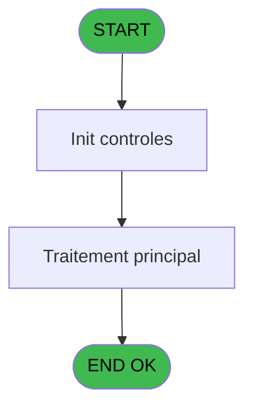
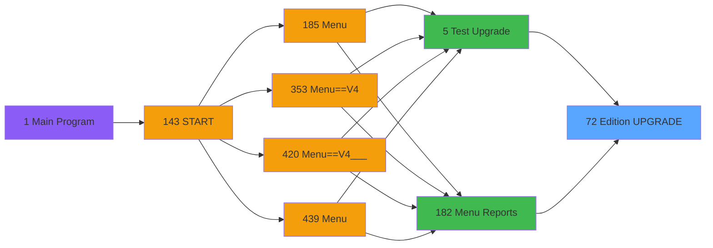
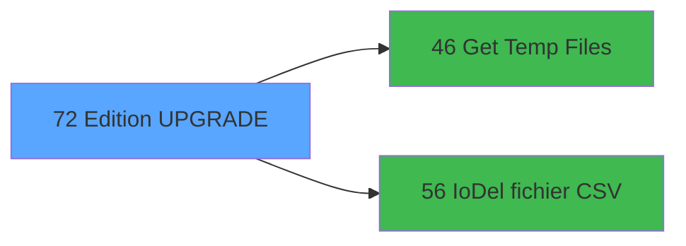

# PVE IDE 72 - Edition UPGRADE

> **Analyse**: Phases 1-4 2026-02-03 09:08 -> 09:08 (22s) | Assemblage 09:08
> **Pipeline**: V7.2 Enrichi
> **Structure**: 4 onglets (Resume | Ecrans | Donnees | Connexions)

<!-- TAB:Resume -->

## 1. FICHE D'IDENTITE

| Attribut | Valeur |
|----------|--------|
| Projet | PVE |
| IDE Position | 72 |
| Nom Programme | Edition UPGRADE |
| Fichier source | `Prg_72.xml` |
| Domaine metier | Impression |
| Taches | 2 (0 ecrans visibles) |
| Tables modifiees | 0 |
| Programmes appeles | 2 |

## 2. DESCRIPTION FONCTIONNELLE

**Edition UPGRADE** assure la gestion complete de ce processus, accessible depuis [Test Upgrade (IDE 5)](PVE-IDE-5.md), [Menu Reports (IDE 182)](PVE-IDE-182.md).

Le flux de traitement s'organise en **2 blocs fonctionnels** :

- **Traitement** (1 tache) : traitements metier divers
- **Impression** (1 tache) : generation de tickets et documents

**Logique metier** : 1 regles identifiees couvrant conditions metier.

Detail : phases du traitement

#### Phase 1 : Impression (1 tache)

- **72** - Edition UPGRADE

#### Phase 2 : Traitement (1 tache)

- **72.1** - Lines

Delegue a : [Get Temp Files (IDE 46)](PVE-IDE-46.md), [IoDel fichier CSV (IDE 56)](PVE-IDE-56.md)

## 3. BLOCS FONCTIONNELS

### 3.1 Impression (1 tache)

Generation des documents et tickets.

---

#### 72 - Edition UPGRADE

**Role** : Generation du document : Edition UPGRADE.

### 3.2 Traitement (1 tache)

Traitements internes.

---

#### 72.1 - Lines

**Role** : Traitement : Lines.
**Delegue a** : [Get Temp Files (IDE 46)](PVE-IDE-46.md), [IoDel fichier CSV (IDE 56)](PVE-IDE-56.md)

## 5. REGLES METIER

1 regles identifiees:

### Autres (1 regles)

#### [RM-001] Condition toujours fausse (flag inactif)

| Element | Detail |
|---------|--------|
| **Condition** | `P.I Flag clôture service [H]` |
| **Si vrai** | 'FALSE'LOG |
| **Si faux** | GetParam ('Output')<>'Extraction') |
| **Variables** | H (P.I Flag clôture service) |
| **Expression source** | Expression 15 : `IF(P.I Flag clôture service [H],'FALSE'LOG,GetParam ('Output` |
| **Exemple** | Si P.I Flag clôture service [H] → 'FALSE'LOG. Sinon → GetParam ('Output')<>'Extraction') |

## 6. CONTEXTE

- **Appele par**: [Test Upgrade (IDE 5)](PVE-IDE-5.md), [Menu Reports (IDE 182)](PVE-IDE-182.md)
- **Appelle**: 2 programmes | **Tables**: 5 (W:0 R:1 L:4) | **Taches**: 2 | **Expressions**: 25

<!-- TAB:Ecrans -->

## 8. ECRANS

*(Programme sans ecran visible)*

## 9. NAVIGATION

### 9.3 Structure hierarchique (2 taches)

| Position | Tache | Type | Dimensions | Bloc |
|----------|-------|------|------------|------|
| **72.1** | [**Edition UPGRADE** (72)](#t1) | MDI | - | Impression |
| **72.2** | [**Lines** (72.1)](#t2) | MDI | - | Traitement |

### 9.4 Algorigramme

> **Legende**: Vert = START/END OK | Rouge = END KO | Bleu = Decisions
> *Algorigramme auto-genere. Utiliser `/algorigramme` pour une synthese metier detaillee.*

<!-- TAB:Donnees -->

## 10. TABLES

### Tables utilisees (5)

| ID | Nom | Description | Type | R | W | L | Usages |
|----|-----|-------------|------|---|---|---|--------|
| 380 | pv_day_modes |  | DB | R |   |   | 1 |
| 523 | synthese_garanties | Depots et garanties | TMP |   |   | L | 1 |
| 1468 | Table_1468 |  | MEM |   |   | L | 1 |
| 1469 | Table_1469 |  | MEM |   |   | L | 1 |
| 1471 | Table_1471 |  | MEM |   |   | L | 1 |

### Colonnes par table (1 / 1 tables avec colonnes identifiees)

Table 380 - pv_day_modes (R) - 1 usages

| Lettre | Variable | Acces | Type |
|--------|----------|-------|------|
| A | v.classification existe? | R | Logical |
| B | v.price difference | R | Numeric |
| C | v.Total Difference | R | Numeric |
| D | V Extract Line | R | Alpha |

## 11. VARIABLES

### 11.1 Parametres entrants (9)

Variables recues du programme appelant ([Test Upgrade (IDE 5)](PVE-IDE-5.md)).

| Lettre | Nom | Type | Usage dans |
|--------|-----|------|-----------|
| A | P.i. Village Name | Alpha | - |
| B | P.i. Currency | Alpha | - |
| C | P.i. Masque | Alpha | - |
| D | P.i. Masque sans Z | Alpha | - |
| E | P.i. Decimales | Numeric | - |
| F | P i.Date mini | Date | 2x parametre entrant |
| G | P i.Date maxi | Date | 2x parametre entrant |
| H | P.I Flag clôture service | Logical | 5x parametre entrant |
| I | P.i Service (facultatif) | Unicode | 2x parametre entrant |

### 11.2 Variables de session (15)

Variables persistantes pendant toute la session.

| Lettre | Nom | Type | Usage dans |
|--------|-----|------|-----------|
| J | v.NomFichier_Pdf | Alpha | 3x session |
| K | v.NomFichierPDF Archivage | Alpha | 1x session |
| L | v.NomFichier_Csv | Alpha | 2x session |
| M | v.NomFichier csv Archivage | Alpha | - |
| N | V is item selected | Logical | 3x session |
| O | V Total General | Numeric | - |
| P | V.Total General HT | Numeric | - |
| Q | V.Total General TTC | Numeric | - |
| R | V.Total General TVA | Numeric | - |
| S | V Total Cost | Numeric | - |
| T | V Item Customer selected | Logical | 1x session |
| U | V Item Package selected | Logical | 1x session |
| V | V Item Account selected | Logical | 1x session |
| W | v.start | Time | - |
| X | v.end | Time | - |

Toutes les 24 variables (liste complete)

| Cat | Lettre | Nom Variable | Type |
|-----|--------|--------------|------|
| P0 | **A** | P.i. Village Name | Alpha |
| P0 | **B** | P.i. Currency | Alpha |
| P0 | **C** | P.i. Masque | Alpha |
| P0 | **D** | P.i. Masque sans Z | Alpha |
| P0 | **E** | P.i. Decimales | Numeric |
| P0 | **F** | P i.Date mini | Date |
| P0 | **G** | P i.Date maxi | Date |
| P0 | **H** | P.I Flag clôture service | Logical |
| P0 | **I** | P.i Service (facultatif) | Unicode |
| V. | **J** | v.NomFichier_Pdf | Alpha |
| V. | **K** | v.NomFichierPDF Archivage | Alpha |
| V. | **L** | v.NomFichier_Csv | Alpha |
| V. | **M** | v.NomFichier csv Archivage | Alpha |
| V. | **N** | V is item selected | Logical |
| V. | **O** | V Total General | Numeric |
| V. | **P** | V.Total General HT | Numeric |
| V. | **Q** | V.Total General TTC | Numeric |
| V. | **R** | V.Total General TVA | Numeric |
| V. | **S** | V Total Cost | Numeric |
| V. | **T** | V Item Customer selected | Logical |
| V. | **U** | V Item Package selected | Logical |
| V. | **V** | V Item Account selected | Logical |
| V. | **W** | v.start | Time |
| V. | **X** | v.end | Time |

## 12. EXPRESSIONS

**25 / 25 expressions decodees (100%)**

### 12.1 Repartition par type

| Type | Expressions | Regles |
|------|-------------|--------|
| CAST_LOGIQUE | 3 | 5 |
| CONCATENATION | 4 | 0 |
| OTHER | 9 | 0 |
| NEGATION | 3 | 0 |
| CONDITION | 2 | 0 |
| STRING | 4 | 0 |

### 12.2 Expressions cles par type

#### CAST_LOGIQUE (3 expressions)

| Type | IDE | Expression | Regle |
|------|-----|------------|-------|
| CAST_LOGIQUE | 15 | `IF(P.I Flag clôture service [H],'FALSE'LOG,GetParam ('Output')<>'Extraction')` | [RM-001](#rm-RM-001) |
| CAST_LOGIQUE | 18 | `'FALSE'LOG` | - |
| CAST_LOGIQUE | 8 | `'TRUE'LOG` | - |

#### CONCATENATION (4 expressions)

| Type | IDE | Expression | Regle |
|------|-----|------------|-------|
| CONCATENATION | 9 | `Translate ('%club_exportdata%')&Trim (GetParam ('VILLAGECODE'))&Trim (GetParam ('SERVICE'))&'_EDITION_UPGRADE_'&DStr (P i.Date mini [F],'YYYYMMDD')&'_'&DStr (P i.Date maxi [G],'YYYYMMDD')&'.csv'` | - |
| CONCATENATION | 10 | `Translate ('%club_exportdata%')&'ArchivagePOS\'&Trim (GetParam ('VILLAGECODE'))&Trim (GetParam ('SERVICE'))&'_EDITION_UPGRADE_'&DStr (P i.Date mini [F],'YYYYMMDD')&'_'&DStr (P i.Date maxi [G],'YYYYMMDD')&'.csv'` | - |
| CONCATENATION | 1 | `Translate ('%club_exportdata%')&Trim (GetParam ('VILLAGECODE'))&Trim (GetParam ('SERVICE'))&'_EDITION_UPGRADE_'&DStr (Date(),'YYYYMMDD')&'_'&TStr (Time(),'HHMMSS')&'.Pdf'` | - |
| CONCATENATION | 2 | `Translate ('%club_exportdata%')&'ArchivagePOS\'&Trim (GetParam ('VILLAGECODE'))&Trim (GetParam ('SERVICE'))&'_EDITION_UPGRADE_'&DStr (Date(),'YYYYMMDD')&'_'&TStr (Time(),'HHMMSS')&'.Pdf'` | - |

#### OTHER (9 expressions)

| Type | IDE | Expression | Regle |
|------|-----|------------|-------|
| OTHER | 22 | `P.I Flag clôture service [H]` | - |
| OTHER | 20 | `FileDelete(v.NomFichier_Pdf [J])` | - |
| OTHER | 25 | `P.I Flag clôture service [H]` | - |
| OTHER | 24 | `SetParam('SERVICE',P.i Service (facultatif) [I])` | - |
| OTHER | 17 | `GetParam ('SERVICE')` | - |
| ... | | *+4 autres* | |

#### NEGATION (3 expressions)

| Type | IDE | Expression | Regle |
|------|-----|------------|-------|
| NEGATION | 21 | `NOT (GetParam ('Output')='Printer')` | - |
| NEGATION | 19 | `NOT (V Item Customer selected [T]) OR NOT (V Item Package selected [U]) OR NOT (V Item Account selected [V])` | - |
| NEGATION | 4 | `NOT (V is item selected [N]) AND NOT(P.I Flag clôture service [H])` | - |

#### CONDITION (2 expressions)

| Type | IDE | Expression | Regle |
|------|-----|------------|-------|
| CONDITION | 23 | `Trim(P.i Service (facultatif) [I])=''` | - |
| CONDITION | 16 | `GetParam ('Output')='Extraction'` | - |

#### STRING (4 expressions)

| Type | IDE | Expression | Regle |
|------|-----|------------|-------|
| STRING | 13 | `FileExist(Trim(v.NomFichier_Pdf [J]))` | - |
| STRING | 14 | `FileExist(Trim(v.NomFichier_Csv [L]))` | - |
| STRING | 11 | `FileCopy (Trim(v.NomFichier_Pdf [J]),Trim(v.NomFichierPDF Archivage [K]))` | - |
| STRING | 12 | `FileCopy (Trim(v.NomFichier_Csv [L]),Trim(v.NomFichier csv Archi... [M]))` | - |

### 12.3 Toutes les expressions (25)

Voir les 25 expressions

#### CAST_LOGIQUE (3)

| IDE | Expression Decodee |
|-----|-------------------|
| 15 | `IF(P.I Flag clôture service [H],'FALSE'LOG,GetParam ('Output')<>'Extraction')` |
| 8 | `'TRUE'LOG` |
| 18 | `'FALSE'LOG` |

#### CONCATENATION (4)

| IDE | Expression Decodee |
|-----|-------------------|
| 1 | `Translate ('%club_exportdata%')&Trim (GetParam ('VILLAGECODE'))&Trim (GetParam ('SERVICE'))&'_EDITION_UPGRADE_'&DStr (Date(),'YYYYMMDD')&'_'&TStr (Time(),'HHMMSS')&'.Pdf'` |
| 2 | `Translate ('%club_exportdata%')&'ArchivagePOS\'&Trim (GetParam ('VILLAGECODE'))&Trim (GetParam ('SERVICE'))&'_EDITION_UPGRADE_'&DStr (Date(),'YYYYMMDD')&'_'&TStr (Time(),'HHMMSS')&'.Pdf'` |
| 9 | `Translate ('%club_exportdata%')&Trim (GetParam ('VILLAGECODE'))&Trim (GetParam ('SERVICE'))&'_EDITION_UPGRADE_'&DStr (P i.Date mini [F],'YYYYMMDD')&'_'&DStr (P i.Date maxi [G],'YYYYMMDD')&'.csv'` |
| 10 | `Translate ('%club_exportdata%')&'ArchivagePOS\'&Trim (GetParam ('VILLAGECODE'))&Trim (GetParam ('SERVICE'))&'_EDITION_UPGRADE_'&DStr (P i.Date mini [F],'YYYYMMDD')&'_'&DStr (P i.Date maxi [G],'YYYYMMDD')&'.csv'` |

#### OTHER (9)

| IDE | Expression Decodee |
|-----|-------------------|
| 3 | `SetCrsr (2)` |
| 5 | `V is item selected [N]` |
| 6 | `V is item selected [N] AND NOT(P.I Flag clôture service [H])` |
| 7 | `SetCrsr (1)` |
| 17 | `GetParam ('SERVICE')` |
| 20 | `FileDelete(v.NomFichier_Pdf [J])` |
| 22 | `P.I Flag clôture service [H]` |
| 24 | `SetParam('SERVICE',P.i Service (facultatif) [I])` |
| 25 | `P.I Flag clôture service [H]` |

#### NEGATION (3)

| IDE | Expression Decodee |
|-----|-------------------|
| 4 | `NOT (V is item selected [N]) AND NOT(P.I Flag clôture service [H])` |
| 19 | `NOT (V Item Customer selected [T]) OR NOT (V Item Package selected [U]) OR NOT (V Item Account selected [V])` |
| 21 | `NOT (GetParam ('Output')='Printer')` |

#### CONDITION (2)

| IDE | Expression Decodee |
|-----|-------------------|
| 16 | `GetParam ('Output')='Extraction'` |
| 23 | `Trim(P.i Service (facultatif) [I])=''` |

#### STRING (4)

| IDE | Expression Decodee |
|-----|-------------------|
| 11 | `FileCopy (Trim(v.NomFichier_Pdf [J]),Trim(v.NomFichierPDF Archivage [K]))` |
| 12 | `FileCopy (Trim(v.NomFichier_Csv [L]),Trim(v.NomFichier csv Archi... [M]))` |
| 13 | `FileExist(Trim(v.NomFichier_Pdf [J]))` |
| 14 | `FileExist(Trim(v.NomFichier_Csv [L]))` |

<!-- TAB:Connexions -->

## 13. GRAPHE D'APPELS

### 13.1 Chaine depuis Main (Callers)

Main -> ... -> [Test Upgrade (IDE 5)](PVE-IDE-5.md) -> **Edition UPGRADE (IDE 72)**

Main -> ... -> [Menu Reports (IDE 182)](PVE-IDE-182.md) -> **Edition UPGRADE (IDE 72)**

### 13.2 Callers

| IDE | Nom Programme | Nb Appels |
|-----|---------------|-----------|
| [5](PVE-IDE-5.md) | Test Upgrade | 1 |
| [182](PVE-IDE-182.md) | Menu Reports | 1 |

### 13.3 Callees (programmes appeles)

### 13.4 Detail Callees avec contexte

| IDE | Nom Programme | Appels | Contexte |
|-----|---------------|--------|----------|
| [46](PVE-IDE-46.md) | Get Temp Files | 1 | Recuperation donnees |
| [56](PVE-IDE-56.md) | IoDel fichier CSV | 1 | Sous-programme |

## 14. RECOMMANDATIONS MIGRATION

### 14.1 Profil du programme

| Metrique | Valeur | Impact migration |
|----------|--------|-----------------|
| Lignes de logique | 138 | Programme compact |
| Expressions | 25 | Peu de logique |
| Tables WRITE | 0 | Impact faible |
| Sous-programmes | 2 | Peu de dependances |
| Ecrans visibles | 0 | Ecran unique ou traitement batch |
| Code desactive | 0% (0 / 138) | Code sain |
| Regles metier | 1 | Quelques regles a preserver |

### 14.2 Plan de migration par bloc

#### Impression (1 tache: 0 ecran, 1 traitement)

- **Strategie** : Templates HTML -> PDF via wkhtmltopdf ou Puppeteer.
- `PrintService` injectable avec choix imprimante

#### Traitement (1 tache: 0 ecran, 1 traitement)

- **Strategie** : 1 service(s) backend injectable(s) (Domain Services).
- 2 sous-programme(s) a migrer ou a reutiliser depuis les services existants.
- Decomposer les taches en services unitaires testables.

### 14.3 Dependances critiques

| Dependance | Type | Appels | Impact |
|------------|------|--------|--------|
| [IoDel fichier CSV (IDE 56)](PVE-IDE-56.md) | Sous-programme | 1x | Normale - Sous-programme |
| [Get Temp Files (IDE 46)](PVE-IDE-46.md) | Sous-programme | 1x | Normale - Recuperation donnees |

---
*Spec DETAILED generee par Pipeline V7.2 - 2026-02-03 09:08*
