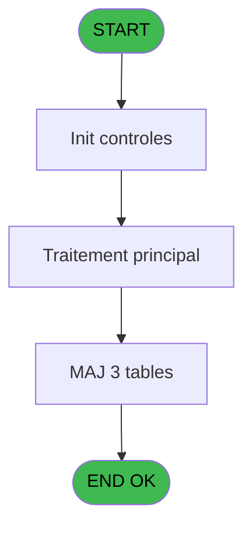
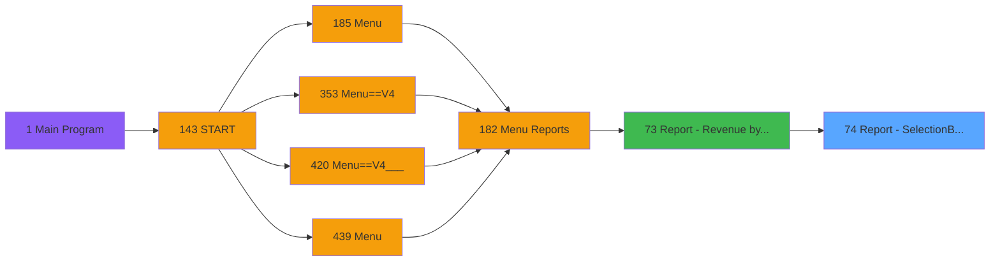

# PVE IDE 74 - Report - Selection/By Product

> **Analyse**: Phases 1-4 2026-02-03 09:09 -> 09:10 (29s) | Assemblage 09:10
> **Pipeline**: V7.2 Enrichi
> **Structure**: 4 onglets (Resume | Ecrans | Donnees | Connexions)

<!-- TAB:Resume -->

## 1. FICHE D'IDENTITE

| Attribut | Valeur |
|----------|--------|
| Projet | PVE |
| IDE Position | 74 |
| Nom Programme | Report - Selection/By Product |
| Fichier source | `Prg_74.xml` |
| Domaine metier | Consultation |
| Taches | 12 (0 ecrans visibles) |
| Tables modifiees | 3 |
| Programmes appeles | 0 |

## 2. DESCRIPTION FONCTIONNELLE

**Report - Selection/By Product** assure la gestion complete de ce processus, accessible depuis [Report - Revenue by product (IDE 73)](PVE-IDE-73.md).

Le flux de traitement s'organise en **3 blocs fonctionnels** :

- **Traitement** (8 taches) : traitements metier divers
- **Calcul** (3 taches) : calculs de montants, stocks ou compteurs
- **Consultation** (1 tache) : ecrans de recherche, selection et consultation

**Donnees modifiees** : 3 tables en ecriture (update_table_codes_log, Table_1461, Table_1628).

**Logique metier** : 1 regles identifiees couvrant conditions metier.

Detail : phases du traitement

#### Phase 1 : Consultation (1 tache)

- **74** - SELECTION

#### Phase 2 : Calcul (3 taches)

- **74.1** - Selection compta
- **74.3** - Selection compta
- **74.5** - ==> nouveau prog : calcul taxe

#### Phase 3 : Traitement (8 taches)

- **74.1.1** - Temp generation
- **74.1.1.1** - Temp generation
- **74.1.2** - Movements
- **74.2** - Temp generation GP
- **74.3.1** - Temp generation
- **74.3.1.1** - Temp generation
- **74.3.2** - Movements
- **74.4** - Temp generation GP

#### Tables impactees

| Table | Operations | Role metier |
|-------|-----------|-------------|
| Table_1461 | **W** (4 usages) |  |
| update_table_codes_log | **W** (2 usages) |  |
| Table_1628 | **W** (1 usages) |  |

## 3. BLOCS FONCTIONNELS

### 3.1 Consultation (1 tache)

Ecrans de recherche et consultation.

---

#### 74 - SELECTION

**Role** : Selection par l'operateur : SELECTION.

### 3.2 Calcul (3 taches)

Calculs metier : montants, stocks, compteurs.

---

#### 74.1 - Selection compta

**Role** : Selection par l'operateur : Selection compta.

---

#### 74.3 - Selection compta

**Role** : Selection par l'operateur : Selection compta.

---

#### 74.5 - ==> nouveau prog : calcul taxe

**Role** : Calcul : ==> nouveau prog : calcul taxe.
**Variables liees** : Q (v.taxes total à calculer), R (v.montant taxes), S (v.taxes multiples)

### 3.3 Traitement (8 taches)

Traitements internes.

---

#### 74.1.1 - Temp generation

**Role** : Traitement : Temp generation.

---

#### 74.1.1.1 - Temp generation

**Role** : Traitement : Temp generation.

---

#### 74.1.2 - Movements

**Role** : Traitement : Movements.

---

#### 74.2 - Temp generation GP

**Role** : Traitement : Temp generation GP.

---

#### 74.3.1 - Temp generation

**Role** : Traitement : Temp generation.

---

#### 74.3.1.1 - Temp generation

**Role** : Traitement : Temp generation.

---

#### 74.3.2 - Movements

**Role** : Traitement : Movements.

---

#### 74.4 - Temp generation GP

**Role** : Traitement : Temp generation GP.

## 5. REGLES METIER

1 regles identifiees:

### Autres (1 regles)

#### [RM-001] Si [BD] AND [AH]<>[BE] alors 0 sinon [AF])

| Element | Detail |
|---------|--------|
| **Condition** | `[BD] AND [AH]<>[BE]` |
| **Si vrai** | 0 |
| **Si faux** | [AF]) |
| **Expression source** | Expression 29 : `IF([BD] AND [AH]<>[BE],0,[AF])` |
| **Exemple** | Si [BD] AND [AH]<>[BE] → 0. Sinon → [AF]) |

## 6. CONTEXTE

- **Appele par**: [Report - Revenue by product (IDE 73)](PVE-IDE-73.md)
- **Appelle**: 0 programmes | **Tables**: 9 (W:3 R:3 L:4) | **Taches**: 12 | **Expressions**: 29

<!-- TAB:Ecrans -->

## 8. ECRANS

*(Programme sans ecran visible)*

## 9. NAVIGATION

### 9.3 Structure hierarchique (12 taches)

| Position | Tache | Type | Dimensions | Bloc |
|----------|-------|------|------------|------|
| **74.1** | [**SELECTION** (74)](#t1) | MDI | - | Consultation |
| **74.2** | [**Selection compta** (74.1)](#t2) | MDI | - | Calcul |
| 74.2.1 | [Selection compta (74.3)](#t7) | MDI | - | |
| 74.2.2 | [==> nouveau prog : calcul taxe (74.5)](#t12) | - | - | |
| **74.3** | [**Temp generation** (74.1.1)](#t3) | MDI | - | Traitement |
| 74.3.1 | [Temp generation (74.1.1.1)](#t4) | MDI | - | |
| 74.3.2 | [Movements (74.1.2)](#t5) | MDI | - | |
| 74.3.3 | [Temp generation GP (74.2)](#t6) | MDI | - | |
| 74.3.4 | [Temp generation (74.3.1)](#t8) | MDI | - | |
| 74.3.5 | [Temp generation (74.3.1.1)](#t9) | MDI | - | |
| 74.3.6 | [Movements (74.3.2)](#t10) | MDI | - | |
| 74.3.7 | [Temp generation GP (74.4)](#t11) | MDI | - | |

### 9.4 Algorigramme

> **Legende**: Vert = START/END OK | Rouge = END KO | Bleu = Decisions
> *Algorigramme auto-genere. Utiliser `/algorigramme` pour une synthese metier detaillee.*

<!-- TAB:Donnees -->

## 10. TABLES

### Tables utilisees (9)

| ID | Nom | Description | Type | R | W | L | Usages |
|----|-----|-------------|------|---|---|---|--------|
| 379 | pv_customer_temp |  | DB | R |   |   | 1 |
| 403 | pv_sellers |  | DB |   |   | L | 1 |
| 413 | pv_tva |  | DB |   |   | L | 1 |
| 523 | synthese_garanties | Depots et garanties | TMP | R |   |   | 2 |
| 524 | update_table_codes_log |  | TMP |   | **W** |   | 2 |
| 762 | pv_mvt_stock_tempo | Table temporaire ecran | DB | R |   | L | 3 |
| 1461 | Table_1461 |  | MEM |   | **W** |   | 4 |
| 1471 | Table_1471 |  | MEM |   |   | L | 1 |
| 1628 | Table_1628 |  | MEM |   | **W** |   | 1 |

### Colonnes par table (3 / 6 tables avec colonnes identifiees)

Table 379 - pv_customer_temp (R) - 1 usages

| Lettre | Variable | Acces | Type |
|--------|----------|-------|------|
| A | P. Date mini | R | Date |
| B | P. Date Maxi | R | Date |
| C | P. Decimales | R | Numeric |
| D | P. Item selected | R | Logical |
| E | P. Total General | R | Numeric |
| F | P. D or C or P or L or V | R | Alpha |
| G | P. avec Cost | R | Logical |
| H | P. Total Cost | R | Numeric |
| I | P. Cat mini | R | Numeric |
| J | P. Cat Maxi | R | Numeric |
| K | P.Lieu Mini | R | Alpha |
| L | P.Lieu Maxi | R | Alpha |
| M | P.Vendeur mini | R | Alpha |
| N | P.Vendeur maxi | R | Alpha |
| O | P.Revenue HT | R | Numeric |
| P | P.Revenue TTC | R | Numeric |
| Q | v.taxes total à calculer | R | Numeric |
| R | v.montant taxes | R | Numeric |
| S | v.taxes multiples | R | Logical |
| T | V. cpk_quantity | R | Numeric |
| U | V Product | R | Numeric |

Table 523 - synthese_garanties (R) - 2 usages

*Table utilisee uniquement en Link ou aucune colonne Real identifiee dans le DataView.*

Table 524 - update_table_codes_log (**W**) - 2 usages

*Table utilisee uniquement en Link ou aucune colonne Real identifiee dans le DataView.*

Table 762 - pv_mvt_stock_tempo (R/L) - 3 usages

*Table utilisee uniquement en Link ou aucune colonne Real identifiee dans le DataView.*

Table 1461 - Table_1461 (**W**) - 4 usages

| Lettre | Variable | Acces | Type |
|--------|----------|-------|------|
| A | P(0) Refund | W | Logical |
| B | V Montant HT ou TTC | W | Numeric |
| C | V.Montant HT | W | Numeric |
| D | V.Montant TTC | W | Numeric |
| E | V.Prepaid HT ou TTC | W | Numeric |
| F | V.Prepaid HT | W | Numeric |
| G | V.Prepaid TTC | W | Numeric |

Table 1628 - Table_1628 (**W**) - 1 usages

| Lettre | Variable | Acces | Type |
|--------|----------|-------|------|
| A | P.i.cat | W | Numeric |
| B | P.i.subcat | W | Numeric |
| C | P.i.sub subcat | W | Numeric |
| D | P.o.taxes additionelles total | W | Numeric |

## 11. VARIABLES

### 11.1 Parametres entrants (16)

Variables recues du programme appelant ([Report - Revenue by product (IDE 73)](PVE-IDE-73.md)).

| Lettre | Nom | Type | Usage dans |
|--------|-----|------|-----------|
| A | P. Date mini | Date | 1x parametre entrant |
| B | P. Date Maxi | Date | 1x parametre entrant |
| C | P. Decimales | Numeric | - |
| D | P. Item selected | Logical | - |
| E | P. Total General | Numeric | - |
| F | P. D or C or P or L or V | Alpha | - |
| G | P. avec Cost | Logical | - |
| H | P. Total Cost | Numeric | - |
| I | P. Cat mini | Numeric | 1x parametre entrant |
| J | P. Cat Maxi | Numeric | 1x parametre entrant |
| K | P.Lieu Mini | Alpha | - |
| L | P.Lieu Maxi | Alpha | - |
| M | P.Vendeur mini | Alpha | - |
| N | P.Vendeur maxi | Alpha | - |
| O | P.Revenue HT | Numeric | - |
| P | P.Revenue TTC | Numeric | - |

### 11.2 Variables de session (5)

Variables persistantes pendant toute la session.

| Lettre | Nom | Type | Usage dans |
|--------|-----|------|-----------|
| Q | v.taxes total à calculer | Numeric | 1x session |
| R | v.montant taxes | Numeric | - |
| S | v.taxes multiples | Logical | 2x session |
| T | V. cpk_quantity | Numeric | 3x session |
| U | V Product | Numeric | 3x session |

Toutes les 21 variables (liste complete)

| Cat | Lettre | Nom Variable | Type |
|-----|--------|--------------|------|
| P0 | **A** | P. Date mini | Date |
| P0 | **B** | P. Date Maxi | Date |
| P0 | **C** | P. Decimales | Numeric |
| P0 | **D** | P. Item selected | Logical |
| P0 | **E** | P. Total General | Numeric |
| P0 | **F** | P. D or C or P or L or V | Alpha |
| P0 | **G** | P. avec Cost | Logical |
| P0 | **H** | P. Total Cost | Numeric |
| P0 | **I** | P. Cat mini | Numeric |
| P0 | **J** | P. Cat Maxi | Numeric |
| P0 | **K** | P.Lieu Mini | Alpha |
| P0 | **L** | P.Lieu Maxi | Alpha |
| P0 | **M** | P.Vendeur mini | Alpha |
| P0 | **N** | P.Vendeur maxi | Alpha |
| P0 | **O** | P.Revenue HT | Numeric |
| P0 | **P** | P.Revenue TTC | Numeric |
| V. | **Q** | v.taxes total à calculer | Numeric |
| V. | **R** | v.montant taxes | Numeric |
| V. | **S** | v.taxes multiples | Logical |
| V. | **T** | V. cpk_quantity | Numeric |
| V. | **U** | V Product | Numeric |

## 12. EXPRESSIONS

**29 / 29 expressions decodees (100%)**

### 12.1 Repartition par type

| Type | Expressions | Regles |
|------|-------------|--------|
| CALCULATION | 2 | 0 |
| CONDITION | 6 | 5 |
| CONSTANTE | 2 | 0 |
| FORMAT | 2 | 0 |
| OTHER | 13 | 0 |
| CAST_LOGIQUE | 2 | 0 |
| REFERENCE_VG | 1 | 0 |
| NEGATION | 1 | 0 |

### 12.2 Expressions cles par type

#### CALCULATION (2 expressions)

| Type | IDE | Expression | Regle |
|------|-----|------------|-------|
| CALCULATION | 27 | `[AC]+[AB]` | - |
| CALCULATION | 7 | `V. cpk_quantity [T]*10^4+V Product [U]*100+[V]` | - |

#### CONDITION (6 expressions)

| Type | IDE | Expression | Regle |
|------|-----|------------|-------|
| CONDITION | 29 | `IF([BD] AND [AH]<>[BE],0,[AF])` | [RM-001](#rm-RM-001) |
| CONDITION | 14 | `Trim([Z])<>'GIFT PASS' AND Trim([Z])<>'RESORT CREDIT'` | - |
| CONDITION | 16 | `Trim([Z])='RESORT CREDIT' OR Trim([Z])='GIFT PASS'` | - |
| CONDITION | 15 | `[X]<>0` | - |
| CONDITION | 12 | `CndRange(P. Cat mini [I]<>0,P. Cat mini [I])` | - |
| ... | | *+1 autres* | |

#### CONSTANTE (2 expressions)

| Type | IDE | Expression | Regle |
|------|-----|------------|-------|
| CONSTANTE | 25 | `'P'` | - |
| CONSTANTE | 24 | `0` | - |

#### FORMAT (2 expressions)

| Type | IDE | Expression | Regle |
|------|-----|------------|-------|
| FORMAT | 4 | `DStr(P. Date Maxi [B],'YYYYMMDD')` | - |
| FORMAT | 3 | `DStr(P. Date mini [A],'YYYYMMDD')` | - |

#### OTHER (13 expressions)

| Type | IDE | Expression | Regle |
|------|-----|------------|-------|
| OTHER | 19 | `[V]` | - |
| OTHER | 18 | `V Product [U]` | - |
| OTHER | 17 | `V. cpk_quantity [T]` | - |
| OTHER | 26 | `v.taxes multiples [S]` | - |
| OTHER | 23 | `[AB]` | - |
| ... | | *+8 autres* | |

#### CAST_LOGIQUE (2 expressions)

| Type | IDE | Expression | Regle |
|------|-----|------------|-------|
| CAST_LOGIQUE | 28 | `'FALSE'LOG` | - |
| CAST_LOGIQUE | 11 | `'TRUE'LOG` | - |

#### REFERENCE_VG (1 expressions)

| Type | IDE | Expression | Regle |
|------|-----|------------|-------|
| REFERENCE_VG | 20 | `VG113` | - |

#### NEGATION (1 expressions)

| Type | IDE | Expression | Regle |
|------|-----|------------|-------|
| NEGATION | 22 | `NOT VG113` | - |

### 12.3 Toutes les expressions (29)

Voir les 29 expressions

#### CALCULATION (2)

| IDE | Expression Decodee |
|-----|-------------------|
| 7 | `V. cpk_quantity [T]*10^4+V Product [U]*100+[V]` |
| 27 | `[AC]+[AB]` |

#### CONDITION (6)

| IDE | Expression Decodee |
|-----|-------------------|
| 29 | `IF([BD] AND [AH]<>[BE],0,[AF])` |
| 12 | `CndRange(P. Cat mini [I]<>0,P. Cat mini [I])` |
| 13 | `CndRange(P. Cat Maxi [J]<>0,P. Cat Maxi [J])` |
| 15 | `[X]<>0` |
| 14 | `Trim([Z])<>'GIFT PASS' AND Trim([Z])<>'RESORT CREDIT'` |
| 16 | `Trim([Z])='RESORT CREDIT' OR Trim([Z])='GIFT PASS'` |

#### CONSTANTE (2)

| IDE | Expression Decodee |
|-----|-------------------|
| 24 | `0` |
| 25 | `'P'` |

#### FORMAT (2)

| IDE | Expression Decodee |
|-----|-------------------|
| 3 | `DStr(P. Date mini [A],'YYYYMMDD')` |
| 4 | `DStr(P. Date Maxi [B],'YYYYMMDD')` |

#### OTHER (13)

| IDE | Expression Decodee |
|-----|-------------------|
| 1 | `GetParam ('SERVICE')` |
| 2 | `v.taxes total à calculer [Q]` |
| 5 | `V. cpk_quantity [T]` |
| 6 | `V Product [U]` |
| 8 | `v.taxes multiples [S]` |
| 9 | `[AR]` |
| 10 | `[V]` |
| 17 | `V. cpk_quantity [T]` |
| 18 | `V Product [U]` |
| 19 | `[V]` |
| 21 | `VG113 AND NOT [AE]` |
| 23 | `[AB]` |
| 26 | `v.taxes multiples [S]` |

#### CAST_LOGIQUE (2)

| IDE | Expression Decodee |
|-----|-------------------|
| 11 | `'TRUE'LOG` |
| 28 | `'FALSE'LOG` |

#### REFERENCE_VG (1)

| IDE | Expression Decodee |
|-----|-------------------|
| 20 | `VG113` |

#### NEGATION (1)

| IDE | Expression Decodee |
|-----|-------------------|
| 22 | `NOT VG113` |

<!-- TAB:Connexions -->

## 13. GRAPHE D'APPELS

### 13.1 Chaine depuis Main (Callers)

Main -> ... -> [Report - Revenue by product (IDE 73)](PVE-IDE-73.md) -> **Report - Selection/By Product (IDE 74)**

### 13.2 Callers

| IDE | Nom Programme | Nb Appels |
|-----|---------------|-----------|
| [73](PVE-IDE-73.md) | Report - Revenue by product | 1 |

### 13.3 Callees (programmes appeles)

### 13.4 Detail Callees avec contexte

| IDE | Nom Programme | Appels | Contexte |
|-----|---------------|--------|----------|
| - | (aucun) | - | - |

## 14. RECOMMANDATIONS MIGRATION

### 14.1 Profil du programme

| Metrique | Valeur | Impact migration |
|----------|--------|-----------------|
| Lignes de logique | 501 | Programme volumineux |
| Expressions | 29 | Peu de logique |
| Tables WRITE | 3 | Impact modere |
| Sous-programmes | 0 | Peu de dependances |
| Ecrans visibles | 0 | Ecran unique ou traitement batch |
| Code desactive | 1.6% (8 / 501) | Code sain |
| Regles metier | 1 | Quelques regles a preserver |

### 14.2 Plan de migration par bloc

#### Consultation (1 tache: 0 ecran, 1 traitement)

- **Strategie** : Composants de recherche/selection en modales.

#### Calcul (3 taches: 0 ecran, 3 traitements)

- **Strategie** : Services de calcul purs (Domain Services).
- Migrer la logique de calcul (stock, compteurs, montants)

#### Traitement (8 taches: 0 ecran, 8 traitements)

- **Strategie** : 8 service(s) backend injectable(s) (Domain Services).
- Decomposer les taches en services unitaires testables.

### 14.3 Dependances critiques

| Dependance | Type | Appels | Impact |
|------------|------|--------|--------|
| update_table_codes_log | Table WRITE (Temp) | 2x | Schema + repository |
| Table_1461 | Table WRITE (Memory) | 4x | Schema + repository |
| Table_1628 | Table WRITE (Memory) | 1x | Schema + repository |

---
*Spec DETAILED generee par Pipeline V7.2 - 2026-02-03 09:10*
