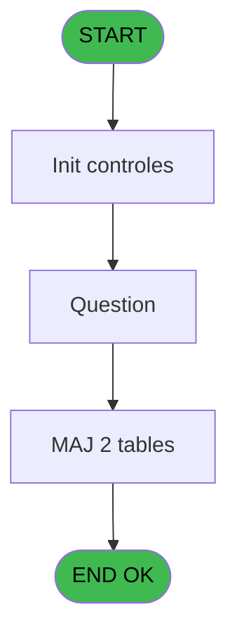
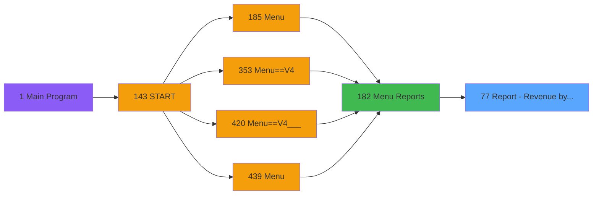
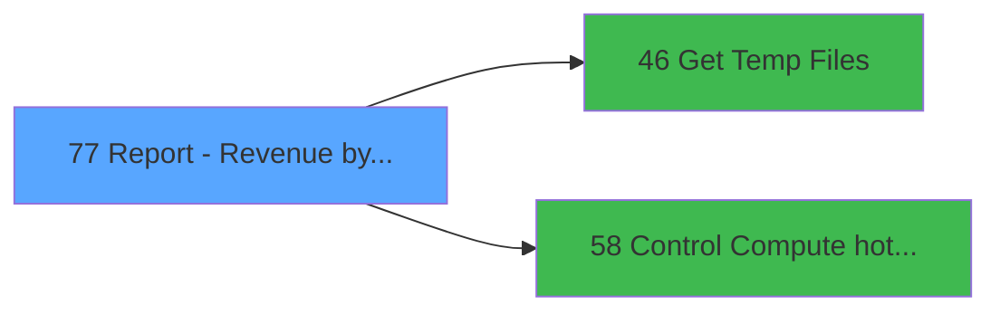

# PVE IDE 77 - Report - Revenue by Place

> **Analyse**: Phases 1-4 2026-02-03 09:11 -> 09:11 (19s) | Assemblage 09:11
> **Pipeline**: V7.2 Enrichi
> **Structure**: 4 onglets (Resume | Ecrans | Donnees | Connexions)

<!-- TAB:Resume -->

## 1. FICHE D'IDENTITE

| Attribut | Valeur |
|----------|--------|
| Projet | PVE |
| IDE Position | 77 |
| Nom Programme | Report - Revenue by Place |
| Fichier source | `Prg_77.xml` |
| Domaine metier | General |
| Taches | 8 (1 ecrans visibles) |
| Tables modifiees | 2 |
| Programmes appeles | 2 |

## 2. DESCRIPTION FONCTIONNELLE

**Report - Revenue by Place** assure la gestion complete de ce processus, accessible depuis [Menu Reports (IDE 182)](PVE-IDE-182.md).

Le flux de traitement s'organise en **4 blocs fonctionnels** :

- **Traitement** (4 taches) : traitements metier divers
- **Creation** (2 taches) : insertion d'enregistrements en base (mouvements, prestations)
- **Saisie** (1 tache) : ecrans de saisie utilisateur (formulaires, champs, donnees)
- **Impression** (1 tache) : generation de tickets et documents

**Donnees modifiees** : 2 tables en ecriture (synthese_garanties, Table_1471).

Detail : phases du traitement

#### Phase 1 : Traitement (4 taches)

- **77** - Report - Revenue by place **[[ECRAN]](#ecran-t1)**
- **77.1.1** - Lines **[[ECRAN]](#ecran-t3)**
- **77.1.2** - Lines **[[ECRAN]](#ecran-t5)**
- **77.2** - Question **[[ECRAN]](#ecran-t8)**

Delegue a : [Get Temp Files (IDE 46)](PVE-IDE-46.md), [Control & Compute hotel days (IDE 58)](PVE-IDE-58.md)

#### Phase 2 : Impression (1 tache)

- **77.1** - Print

#### Phase 3 : Creation (2 taches)

- **77.1.1.1** - Creation
- **77.1.3.1** - Creation

#### Phase 4 : Saisie (1 tache)

- **77.1.3** - Verif ventes periode

#### Tables impactees

| Table | Operations | Role metier |
|-------|-----------|-------------|
| Table_1471 | **W**/L (3 usages) |  |
| synthese_garanties | **W** (2 usages) | Depots et garanties |

## 3. BLOCS FONCTIONNELS

### 3.1 Traitement (4 taches)

Traitements internes.

---

#### 77 - Report - Revenue by place [[ECRAN]](#ecran-t1)

**Role** : Traitement : Report - Revenue by place.
**Ecran** : 312 x 57 DLU (MDI) | [Voir mockup](#ecran-t1)

3 sous-taches directes

| Tache | Nom | Bloc |
|-------|-----|------|
| [77.1.1](#t3) | Lines **[[ECRAN]](#ecran-t3)** | Traitement |
| [77.1.2](#t5) | Lines **[[ECRAN]](#ecran-t5)** | Traitement |
| [77.2](#t8) | Question **[[ECRAN]](#ecran-t8)** | Traitement |

**Delegue a** : [Get Temp Files (IDE 46)](PVE-IDE-46.md), [Control & Compute hotel days (IDE 58)](PVE-IDE-58.md)

---

#### 77.1.1 - Lines [[ECRAN]](#ecran-t3)

**Role** : Traitement : Lines.
**Ecran** : 773 x 264 DLU (MDI) | [Voir mockup](#ecran-t3)
**Delegue a** : [Get Temp Files (IDE 46)](PVE-IDE-46.md), [Control & Compute hotel days (IDE 58)](PVE-IDE-58.md)

---

#### 77.1.2 - Lines [[ECRAN]](#ecran-t5)

**Role** : Traitement : Lines.
**Ecran** : 773 x 264 DLU (MDI) | [Voir mockup](#ecran-t5)
**Delegue a** : [Get Temp Files (IDE 46)](PVE-IDE-46.md), [Control & Compute hotel days (IDE 58)](PVE-IDE-58.md)

---

#### 77.2 - Question [[ECRAN]](#ecran-t8)

**Role** : Traitement : Question.
**Ecran** : 638 x 223 DLU | [Voir mockup](#ecran-t8)
**Delegue a** : [Get Temp Files (IDE 46)](PVE-IDE-46.md), [Control & Compute hotel days (IDE 58)](PVE-IDE-58.md)

### 3.2 Impression (1 tache)

Generation des documents et tickets.

---

#### 77.1 - Print

**Role** : Generation du document : Print.

### 3.3 Creation (2 taches)

Insertion de nouveaux enregistrements en base.

---

#### 77.1.1.1 - Creation

**Role** : Creation d'enregistrement : Creation.

---

#### 77.1.3.1 - Creation

**Role** : Creation d'enregistrement : Creation.

### 3.4 Saisie (1 tache)

Ce bloc traite la saisie des donnees de la transaction.

---

#### 77.1.3 - Verif ventes periode

**Role** : Saisie des donnees : Verif ventes periode.

## 5. REGLES METIER

*(Aucune regle metier identifiee)*

## 6. CONTEXTE

- **Appele par**: [Menu Reports (IDE 182)](PVE-IDE-182.md)
- **Appelle**: 2 programmes | **Tables**: 8 (W:2 R:2 L:6) | **Taches**: 8 | **Expressions**: 4

<!-- TAB:Ecrans -->

## 8. ECRANS

### 8.1 Forms visibles (1 / 8)

| # | Position | Tache | Nom | Type | Largeur | Hauteur | Bloc |
|---|----------|-------|-----|------|---------|---------|------|
| 1 | 77.2 | 77.2 | Question | Type0 | 638 | 223 | Traitement |

### 8.2 Mockups Ecrans

---

#### 77.2 - Question
**Tache** : [77.2](#t8) | **Type** : Type0 | **Dimensions** : 638 x 223 DLU
**Bloc** : Traitement | **Titre IDE** : Question

<!-- FORM-DATA:
{
    "width":  638,
    "vFactor":  8,
    "type":  "Type0",
    "hFactor":  4,
    "controls":  [
                     {
                         "x":  5,
                         "type":  "label",
                         "var":  "",
                         "y":  43,
                         "w":  222,
                         "fmt":  "",
                         "name":  "",
                         "h":  130,
                         "color":  "183",
                         "text":  "",
                         "parent":  null
                     },
                     {
                         "x":  231,
                         "type":  "label",
                         "var":  "",
                         "y":  43,
                         "w":  150,
                         "fmt":  "",
                         "name":  "",
                         "h":  130,
                         "color":  "183",
                         "text":  "",
                         "parent":  null
                     },
                     {
                         "x":  386,
                         "type":  "label",
                         "var":  "",
                         "y":  43,
                         "w":  250,
                         "fmt":  "",
                         "name":  "",
                         "h":  130,
                         "color":  "183",
                         "text":  "",
                         "parent":  null
                     },
                     {
                         "x":  262,
                         "type":  "label",
                         "var":  "",
                         "y":  49,
                         "w":  62,
                         "fmt":  "",
                         "name":  "",
                         "h":  15,
                         "color":  "187",
                         "text":  "Output",
                         "parent":  2
                     },
                     {
                         "x":  7,
                         "type":  "label",
                         "var":  "",
                         "y":  50,
                         "w":  215,
                         "fmt":  "",
                         "name":  "",
                         "h":  10,
                         "color":  "187",
                         "text":  "Select the accounting period you want to print",
                         "parent":  null
                     },
                     {
                         "x":  12,
                         "type":  "label",
                         "var":  "",
                         "y":  66,
                         "w":  51,
                         "fmt":  "",
                         "name":  "",
                         "h":  12,
                         "color":  "183",
                         "text":  "Date min",
                         "parent":  null
                     },
                     {
                         "x":  12,
                         "type":  "label",
                         "var":  "",
                         "y":  90,
                         "w":  51,
                         "fmt":  "",
                         "name":  "",
                         "h":  12,
                         "color":  "183",
                         "text":  "Date max",
                         "parent":  null
                     },
                     {
                         "x":  5,
                         "type":  "label",
                         "var":  "",
                         "y":  179,
                         "w":  631,
                         "fmt":  "",
                         "name":  "",
                         "h":  43,
                         "color":  "183",
                         "text":  "",
                         "parent":  null
                     },
                     {
                         "x":  1,
                         "type":  "label",
                         "var":  "",
                         "y":  1,
                         "w":  635,
                         "fmt":  "",
                         "name":  "",
                         "h":  41,
                         "color":  "182",
                         "text":  "",
                         "parent":  null
                     },
                     {
                         "x":  14,
                         "type":  "label",
                         "var":  "",
                         "y":  17,
                         "w":  243,
                         "fmt":  "",
                         "name":  "",
                         "h":  10,
                         "color":  "186",
                         "text":  "Accounting period and print options",
                         "parent":  11
                     },
                     {
                         "x":  65,
                         "type":  "edit",
                         "var":  "",
                         "y":  66,
                         "w":  73,
                         "fmt":  "",
                         "name":  "P Date mini",
                         "h":  12,
                         "color":  "110",
                         "text":  "",
                         "parent":  null
                     },
                     {
                         "x":  65,
                         "type":  "edit",
                         "var":  "",
                         "y":  90,
                         "w":  73,
                         "fmt":  "",
                         "name":  "P Date maxi",
                         "h":  12,
                         "color":  "110",
                         "text":  "",
                         "parent":  null
                     },
                     {
                         "x":  236,
                         "type":  "listbox",
                         "var":  "",
                         "y":  73,
                         "w":  133,
                         "fmt":  "",
                         "name":  "V Printer/Extract",
                         "h":  32,
                         "color":  "110",
                         "text":  "Printer,Extraction",
                         "parent":  2
                     },
                     {
                         "x":  409,
                         "type":  "radio",
                         "var":  "",
                         "y":  60,
                         "w":  162,
                         "fmt":  "",
                         "name":  "vChoix Edition",
                         "h":  98,
                         "color":  "183",
                         "text":  "1 Total,2 Total per category,3  Total per sub category,4  Total per product,5  Detail on the selected period",
                         "parent":  null
                     },
                     {
                         "x":  586,
                         "type":  "image",
                         "var":  "",
                         "y":  4,
                         "w":  48,
                         "fmt":  "",
                         "name":  "",
                         "h":  37,
                         "color":  "",
                         "text":  "",
                         "parent":  13
                     },
                     {
                         "x":  13,
                         "type":  "button",
                         "var":  "",
                         "y":  185,
                         "w":  68,
                         "fmt":  "\u0026Cancel",
                         "name":  "",
                         "h":  28,
                         "color":  "",
                         "text":  "",
                         "parent":  10
                     },
                     {
                         "x":  91,
                         "type":  "button",
                         "var":  "",
                         "y":  185,
                         "w":  68,
                         "fmt":  "\u0026Execute",
                         "name":  "",
                         "h":  28,
                         "color":  "",
                         "text":  "",
                         "parent":  10
                     }
                 ],
    "taskId":  "77.2",
    "height":  223
}
-->

<strong>Champs : 2 champs</strong>

| Pos (x,y) | Nom | Variable | Type |
|-----------|-----|----------|------|
| 65,66 | P Date mini | - | edit |
| 65,90 | P Date maxi | - | edit |

<strong>Boutons : 2 boutons</strong>

| Bouton | Pos (x,y) | Action |
|--------|-----------|--------|
| Cancel | 13,185 | Annule et retour au menu |
| Execute | 91,185 | Bouton fonctionnel |

## 9. NAVIGATION

Ecran unique: **Question**

### 9.3 Structure hierarchique (8 taches)

| Position | Tache | Type | Dimensions | Bloc |
|----------|-------|------|------------|------|
| **77.1** | [**Report - Revenue by place** (77)](#t1) [mockup](#ecran-t1) | MDI | 312x57 | Traitement |
| 77.1.1 | [Lines (77.1.1)](#t3) [mockup](#ecran-t3) | MDI | 773x264 | |
| 77.1.2 | [Lines (77.1.2)](#t5) [mockup](#ecran-t5) | MDI | 773x264 | |
| 77.1.3 | [Question (77.2)](#t8) [mockup](#ecran-t8) | - | 638x223 | |
| **77.2** | [**Print** (77.1)](#t2) | MDI | - | Impression |
| **77.3** | [**Creation** (77.1.1.1)](#t4) | - | - | Creation |
| 77.3.1 | [Creation (77.1.3.1)](#t7) | - | - | |
| **77.4** | [**Verif ventes periode** (77.1.3)](#t6) | - | - | Saisie |

### 9.4 Algorigramme

> **Legende**: Vert = START/END OK | Rouge = END KO | Bleu = Decisions
> *Algorigramme auto-genere. Utiliser `/algorigramme` pour une synthese metier detaillee.*

<!-- TAB:Donnees -->

## 10. TABLES

### Tables utilisees (8)

| ID | Nom | Description | Type | R | W | L | Usages |
|----|-----|-------------|------|---|---|---|--------|
| 38 | comptable_gratuite |  | DB | R |   |   | 1 |
| 264 | vente_gratuite | Donnees de ventes | DB |   |   | L | 1 |
| 379 | pv_customer_temp |  | DB | R |   | L | 2 |
| 413 | pv_tva |  | DB |   |   | L | 2 |
| 523 | synthese_garanties | Depots et garanties | TMP |   | **W** |   | 2 |
| 766 | temp_forfait_ski |  | DB |   |   | L | 2 |
| 1468 | Table_1468 |  | MEM |   |   | L | 1 |
| 1471 | Table_1471 |  | MEM |   | **W** | L | 3 |

### Colonnes par table (4 / 4 tables avec colonnes identifiees)

Table 38 - comptable_gratuite (R) - 1 usages

| Lettre | Variable | Acces | Type |
|--------|----------|-------|------|
| A | V.Od Gratuite ? | R | Logical |
| B | V.Vente Gratuite ? | R | Logical |
| C | Mont-TTC | R | Numeric |
| D | Mont-HT | R | Numeric |
| E | Mont-TVA | R | Numeric |
| F | Total Lieux HT | R | Numeric |
| G | Total Lieux TTC | R | Numeric |
| H | Total Lieux TVA | R | Numeric |
| I | Dispatch | R | Numeric |
| J | Total Cat HT | R | Numeric |
| K | Total Cat TTC | R | Numeric |
| L | Total Cat TVA | R | Numeric |
| M | Total Sous_Cat HT | R | Numeric |
| N | Total Sous_Cat TTC | R | Numeric |
| O | Total Sous_Cat TVA | R | Numeric |
| P | Total Produit HT | R | Numeric |
| Q | Total Produit TTC | R | Numeric |
| R | Total Produit TVA | R | Numeric |
| S | Total Final HT | R | Numeric |
| T | Total Final TVA | R | Numeric |
| U | Total FinalTTC | R | Numeric |
| V | v.Ligne | R | Alpha |
| W | v.Entete CSV | R | Logical |
| X | v.montant taxes | R | Numeric |
| Y | v.taxes multiples | R | Logical |

Table 379 - pv_customer_temp (R/L) - 2 usages

| Lettre | Variable | Acces | Type |
|--------|----------|-------|------|
| A | Mont-HT | R | Numeric |
| B | Mont-TVA | R | Numeric |
| C | Total Date_Produit HT | R | Numeric |
| D | Total Date_Produit TTC | R | Numeric |
| E | Total Date_Produit TVA | R | Numeric |
| F | Dispatch | R | Numeric |
| G | Total Final HT | R | Numeric |
| H | Total Final TVA | R | Numeric |
| I | Total FinalTTC | R | Numeric |
| J | v.Ligne | R | Alpha |
| K | v.Entete CSV | R | Logical |
| L | v.montant taxes | R | Numeric |
| M | v.taxes multiples | R | Logical |

Table 523 - synthese_garanties (**W**) - 2 usages

*Table utilisee uniquement en Link ou aucune colonne Real identifiee dans le DataView.*

Table 1471 - Table_1471 (**W**/L) - 3 usages

| Lettre | Variable | Acces | Type |
|--------|----------|-------|------|
| A | v.Mont-TTC | W | Numeric |
| B | v.Total lieu TTC | W | Numeric |

## 11. VARIABLES

### 11.1 Parametres entrants (5)

Variables recues du programme appelant ([Menu Reports (IDE 182)](PVE-IDE-182.md)).

| Lettre | Nom | Type | Usage dans |
|--------|-----|------|-----------|
| A | P. Village Name | Alpha | - |
| B | P. Currency | Alpha | - |
| C | P. Masque | Alpha | - |
| D | P. Masque sans Z | Alpha | - |
| E | P. Decimales | Numeric | - |

### 11.2 Variables de session (11)

Variables persistantes pendant toute la session.

| Lettre | Nom | Type | Usage dans |
|--------|-----|------|-----------|
| F | v Période nombre JH | Numeric | - |
| G | v Jours période | Numeric | - |
| H | v.Dates en anomalie | Unicode | 2x session |
| I | v Date mini | Date | - |
| J | v Date maxi | Date | 1x session |
| K | v.Output | Alpha | - |
| M | v.Execute | Logical | 1x session |
| V | v.Ligne | Alpha | - |
| W | v.Entete CSV | Logical | - |
| X | v.montant taxes | Numeric | - |
| Y | v.taxes multiples | Logical | - |

### 11.3 Autres (9)

Variables diverses.

| Lettre | Nom | Type | Usage dans |
|--------|-----|------|-----------|
| L | vChoix Edition | Alpha | - |
| N | S | Alpha | 2x refs |
| O | Total Sous_Cat TVA | Numeric | - |
| P | Total Produit HT | Numeric | - |
| Q | Total Produit TTC | Numeric | - |
| R | Total Produit TVA | Numeric | - |
| S | Total Final HT | Numeric | - |
| T | Total Final TVA | Numeric | - |
| U | Total FinalTTC | Numeric | - |

Toutes les 25 variables (liste complete)

| Cat | Lettre | Nom Variable | Type |
|-----|--------|--------------|------|
| P0 | **A** | P. Village Name | Alpha |
| P0 | **B** | P. Currency | Alpha |
| P0 | **C** | P. Masque | Alpha |
| P0 | **D** | P. Masque sans Z | Alpha |
| P0 | **E** | P. Decimales | Numeric |
| V. | **F** | v Période nombre JH | Numeric |
| V. | **G** | v Jours période | Numeric |
| V. | **H** | v.Dates en anomalie | Unicode |
| V. | **I** | v Date mini | Date |
| V. | **J** | v Date maxi | Date |
| V. | **K** | v.Output | Alpha |
| V. | **M** | v.Execute | Logical |
| V. | **V** | v.Ligne | Alpha |
| V. | **W** | v.Entete CSV | Logical |
| V. | **X** | v.montant taxes | Numeric |
| V. | **Y** | v.taxes multiples | Logical |
| Autre | **L** | vChoix Edition | Alpha |
| Autre | **N** | S | Alpha |
| Autre | **O** | Total Sous_Cat TVA | Numeric |
| Autre | **P** | Total Produit HT | Numeric |
| Autre | **Q** | Total Produit TTC | Numeric |
| Autre | **R** | Total Produit TVA | Numeric |
| Autre | **S** | Total Final HT | Numeric |
| Autre | **T** | Total Final TVA | Numeric |
| Autre | **U** | Total FinalTTC | Numeric |

## 12. EXPRESSIONS

**4 / 4 expressions decodees (100%)**

### 12.1 Repartition par type

| Type | Expressions | Regles |
|------|-------------|--------|
| CONDITION | 2 | 0 |
| CALCULATION | 1 | 0 |
| REFERENCE_VG | 1 | 0 |

### 12.2 Expressions cles par type

#### CONDITION (2 expressions)

| Type | IDE | Expression | Regle |
|------|-----|------------|-------|
| CONDITION | 4 | `v.Dates en anomalie [H]<>''` | - |
| CONDITION | 1 | `v Date maxi [J]<>'00/00/0000'DATE AND v.Execute [M]` | - |

#### CALCULATION (1 expressions)

| Type | IDE | Expression | Regle |
|------|-----|------------|-------|
| CALCULATION | 3 | `StrBuild('No HD for @1@: Dispatch and Amount HT/HD will be wrong. Please communicate this information to your Financial Manager.', v.Dates en anomalie [H])` | - |

#### REFERENCE_VG (1 expressions)

| Type | IDE | Expression | Regle |
|------|-----|------------|-------|
| REFERENCE_VG | 2 | `VG37` | - |

<!-- TAB:Connexions -->

## 13. GRAPHE D'APPELS

### 13.1 Chaine depuis Main (Callers)

Main -> ... -> [Menu Reports (IDE 182)](PVE-IDE-182.md) -> **Report - Revenue by Place (IDE 77)**

### 13.2 Callers

| IDE | Nom Programme | Nb Appels |
|-----|---------------|-----------|
| [182](PVE-IDE-182.md) | Menu Reports | 1 |

### 13.3 Callees (programmes appeles)

### 13.4 Detail Callees avec contexte

| IDE | Nom Programme | Appels | Contexte |
|-----|---------------|--------|----------|
| [46](PVE-IDE-46.md) | Get Temp Files | 1 | Recuperation donnees |
| [58](PVE-IDE-58.md) | Control & Compute hotel days | 1 | Sous-programme |

## 14. RECOMMANDATIONS MIGRATION

### 14.1 Profil du programme

| Metrique | Valeur | Impact migration |
|----------|--------|-----------------|
| Lignes de logique | 444 | Taille moyenne |
| Expressions | 4 | Peu de logique |
| Tables WRITE | 2 | Impact faible |
| Sous-programmes | 2 | Peu de dependances |
| Ecrans visibles | 1 | Ecran unique ou traitement batch |
| Code desactive | 0% (0 / 444) | Code sain |
| Regles metier | 0 | Pas de regle identifiee |

### 14.2 Plan de migration par bloc

#### Traitement (4 taches: 4 ecrans, 0 traitement)

- **Strategie** : 4 composant(s) UI (Razor/React) avec formulaires et validation.
- 2 sous-programme(s) a migrer ou a reutiliser depuis les services existants.
- Decomposer les taches en services unitaires testables.

#### Impression (1 tache: 0 ecran, 1 traitement)

- **Strategie** : Templates HTML -> PDF via wkhtmltopdf ou Puppeteer.
- `PrintService` injectable avec choix imprimante

#### Creation (2 taches: 0 ecran, 2 traitements)

- **Strategie** : Repository pattern avec Entity Framework Core.
- Insertion via `IRepository<T>.CreateAsync()`

#### Saisie (1 tache: 0 ecran, 1 traitement)

- **Strategie** : Formulaire React/Blazor avec validation Zod/FluentValidation.
- Validation temps reel cote client + serveur

### 14.3 Dependances critiques

| Dependance | Type | Appels | Impact |
|------------|------|--------|--------|
| synthese_garanties | Table WRITE (Temp) | 2x | Schema + repository |
| Table_1471 | Table WRITE (Memory) | 1x | Schema + repository |
| [Control & Compute hotel days (IDE 58)](PVE-IDE-58.md) | Sous-programme | 1x | Normale - Sous-programme |
| [Get Temp Files (IDE 46)](PVE-IDE-46.md) | Sous-programme | 1x | Normale - Recuperation donnees |

---
*Spec DETAILED generee par Pipeline V7.2 - 2026-02-03 09:11*
