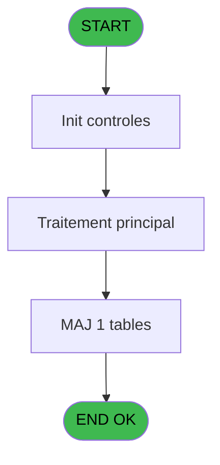
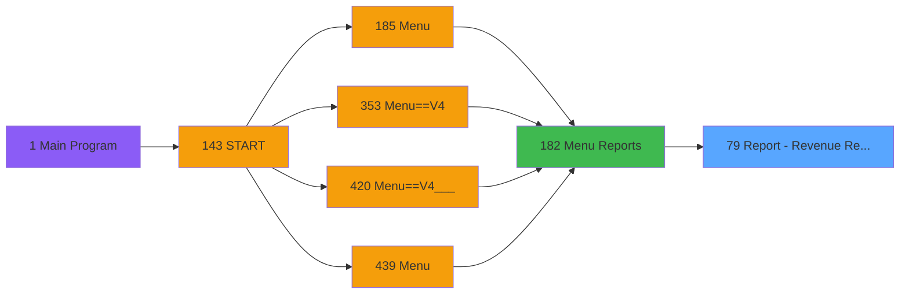
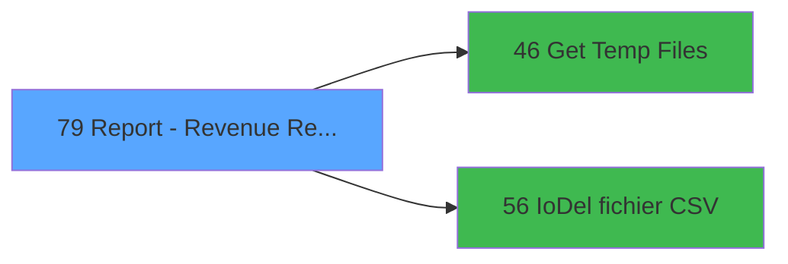

# PVE IDE 79 - Report - Revenue Ref. To Sell

> **Analyse**: Phases 1-4 2026-02-03 09:12 -> 09:12 (19s) | Assemblage 09:12
> **Pipeline**: V7.2 Enrichi
> **Structure**: 4 onglets (Resume | Ecrans | Donnees | Connexions)

<!-- TAB:Resume -->

## 1. FICHE D'IDENTITE

| Attribut | Valeur |
|----------|--------|
| Projet | PVE |
| IDE Position | 79 |
| Nom Programme | Report - Revenue Ref. To Sell |
| Fichier source | `Prg_79.xml` |
| Domaine metier | General |
| Taches | 6 (0 ecrans visibles) |
| Tables modifiees | 1 |
| Programmes appeles | 2 |

## 2. DESCRIPTION FONCTIONNELLE

**Report - Revenue Ref. To Sell** assure la gestion complete de ce processus, accessible depuis [Menu Reports (IDE 182)](PVE-IDE-182.md).

Le flux de traitement s'organise en **3 blocs fonctionnels** :

- **Impression** (3 taches) : generation de tickets et documents
- **Traitement** (2 taches) : traitements metier divers
- **Consultation** (1 tache) : ecrans de recherche, selection et consultation

**Donnees modifiees** : 1 tables en ecriture (logement_par_village).

**Logique metier** : 1 regles identifiees couvrant conditions metier.

Detail : phases du traitement

#### Phase 1 : Impression (3 taches)

- **79** - Print Cancelation **[[ECRAN]](#ecran-t1)**
- **79.1** - Print
- **79.1.2** - Printing

#### Phase 2 : Consultation (1 tache)

- **79.1.1** - SELECTION **[[ECRAN]](#ecran-t3)**

Delegue a : [Get Temp Files (IDE 46)](PVE-IDE-46.md)

#### Phase 3 : Traitement (2 taches)

- **79.1.1.1** - Temp generation
- **79.1.2.1** - Discount line

Delegue a : [Get Temp Files (IDE 46)](PVE-IDE-46.md), [IoDel fichier CSV (IDE 56)](PVE-IDE-56.md)

#### Tables impactees

| Table | Operations | Role metier |
|-------|-----------|-------------|
| logement_par_village | R/**W** (2 usages) |  |

## 3. BLOCS FONCTIONNELS

### 3.1 Impression (3 taches)

Generation des documents et tickets.

---

#### 79 - Print Cancelation [[ECRAN]](#ecran-t1)

**Role** : Generation du document : Print Cancelation.
**Ecran** : 312 x 173 DLU (MDI) | [Voir mockup](#ecran-t1)

---

#### 79.1 - Print

**Role** : Generation du document : Print.

---

#### 79.1.2 - Printing

**Role** : Generation du document : Printing.

### 3.2 Consultation (1 tache)

Ecrans de recherche et consultation.

---

#### 79.1.1 - SELECTION [[ECRAN]](#ecran-t3)

**Role** : Selection par l'operateur : SELECTION.
**Ecran** : 618 x 0 DLU (MDI) | [Voir mockup](#ecran-t3)

### 3.3 Traitement (2 taches)

Traitements internes.

---

#### 79.1.1.1 - Temp generation

**Role** : Traitement : Temp generation.
**Delegue a** : [Get Temp Files (IDE 46)](PVE-IDE-46.md), [IoDel fichier CSV (IDE 56)](PVE-IDE-56.md)

---

#### 79.1.2.1 - Discount line

**Role** : Traitement : Discount line.
**Delegue a** : [Get Temp Files (IDE 46)](PVE-IDE-46.md), [IoDel fichier CSV (IDE 56)](PVE-IDE-56.md)

## 5. REGLES METIER

1 regles identifiees:

### Autres (1 regles)

#### [RM-001] Traitement si VG37 est renseigne

| Element | Detail |
|---------|--------|
| **Condition** | `VG37<>''` |
| **Si vrai** | VG37 |
| **Si faux** | ';') |
| **Expression source** | Expression 2 : `IF(VG37<>'',VG37,';')` |
| **Exemple** | Si VG37<>'' → VG37. Sinon → ';') |

## 6. CONTEXTE

- **Appele par**: [Menu Reports (IDE 182)](PVE-IDE-182.md)
- **Appelle**: 2 programmes | **Tables**: 5 (W:1 R:2 L:3) | **Taches**: 6 | **Expressions**: 6

<!-- TAB:Ecrans -->

## 8. ECRANS

*(Programme sans ecran visible)*

## 9. NAVIGATION

### 9.3 Structure hierarchique (6 taches)

| Position | Tache | Type | Dimensions | Bloc |
|----------|-------|------|------------|------|
| **79.1** | [**Print Cancelation** (79)](#t1) [mockup](#ecran-t1) | MDI | 312x173 | Impression |
| 79.1.1 | [Print (79.1)](#t2) | MDI | - | |
| 79.1.2 | [Printing (79.1.2)](#t5) | MDI | - | |
| **79.2** | [**SELECTION** (79.1.1)](#t3) [mockup](#ecran-t3) | MDI | 618x0 | Consultation |
| **79.3** | [**Temp generation** (79.1.1.1)](#t4) | MDI | - | Traitement |
| 79.3.1 | [Discount line (79.1.2.1)](#t6) | MDI | - | |

### 9.4 Algorigramme

> **Legende**: Vert = START/END OK | Rouge = END KO | Bleu = Decisions
> *Algorigramme auto-genere. Utiliser `/algorigramme` pour une synthese metier detaillee.*

<!-- TAB:Donnees -->

## 10. TABLES

### Tables utilisees (5)

| ID | Nom | Description | Type | R | W | L | Usages |
|----|-----|-------------|------|---|---|---|--------|
| 30 | gm-recherche_____gmr | Index de recherche | DB | R |   |   | 1 |
| 528 | logement_par_village |  | TMP | R | **W** |   | 2 |
| 765 | tranche_age |  | DB |   |   | L | 1 |
| 1468 | Table_1468 |  | MEM |   |   | L | 1 |
| 1471 | Table_1471 |  | MEM |   |   | L | 1 |

### Colonnes par table (1 / 2 tables avec colonnes identifiees)

Table 30 - gm-recherche_____gmr (R) - 1 usages

*Table utilisee uniquement en Link ou aucune colonne Real identifiee dans le DataView.*

Table 528 - logement_par_village (R/**W**) - 2 usages

| Lettre | Variable | Acces | Type |
|--------|----------|-------|------|
| A | P. Village name | W | Alpha |

## 11. VARIABLES

### 11.1 Parametres entrants (7)

Variables recues du programme appelant ([Menu Reports (IDE 182)](PVE-IDE-182.md)).

| Lettre | Nom | Type | Usage dans |
|--------|-----|------|-----------|
| A | P. Village name | Alpha | - |
| B | P. Currency | Alpha | - |
| C | P. Amount format | Alpha | - |
| D | P. Amount format sans Z | Alpha | - |
| E | P. Decimales | Numeric | - |
| F | P.Date Mini | Date | 1x parametre entrant |
| G | P.Date Maxi | Date | 2x parametre entrant |

### 11.2 Variables de session (1)

Variables persistantes pendant toute la session.

| Lettre | Nom | Type | Usage dans |
|--------|-----|------|-----------|
| I | v.NomFichierPdf | Alpha | 1x session |

### 11.3 Autres (1)

Variables diverses.

| Lettre | Nom | Type | Usage dans |
|--------|-----|------|-----------|
| H | S | Alpha | 2x refs |

## 12. EXPRESSIONS

**6 / 6 expressions decodees (100%)**

### 12.1 Repartition par type

| Type | Expressions | Regles |
|------|-------------|--------|
| CONDITION | 3 | 5 |
| FORMAT | 1 | 0 |
| CONCATENATION | 1 | 0 |
| STRING | 1 | 0 |

### 12.2 Expressions cles par type

#### CONDITION (3 expressions)

| Type | IDE | Expression | Regle |
|------|-----|------------|-------|
| CONDITION | 2 | `IF(VG37<>'',VG37,';')` | [RM-001](#rm-RM-001) |
| CONDITION | 6 | `GetParam ('Output')='Extraction'` | - |
| CONDITION | 1 | `P.Date Maxi [G]<>'00/00/0000'DATE` | - |

#### FORMAT (1 expressions)

| Type | IDE | Expression | Regle |
|------|-----|------------|-------|
| FORMAT | 3 | `GetParam ('SERVICE')&'-'&DStr(P.Date Mini [F],'DD/MM/YYYY')&'-'&DStr(P.Date Maxi [G],'DD/MM/YYYY')` | - |

#### CONCATENATION (1 expressions)

| Type | IDE | Expression | Regle |
|------|-----|------------|-------|
| CONCATENATION | 4 | `Translate ('%club_exportdata%')&Trim (GetParam ('VILLAGECODE'))&Trim (GetParam ('SERVICE'))&'_REFUSAL_TO_SELL_'&DStr (Date(),'YYYYMMDD')&'_'&TStr (Time(),'HHMMSS')&'.Pdf'` | - |

#### STRING (1 expressions)

| Type | IDE | Expression | Regle |
|------|-----|------------|-------|
| STRING | 5 | `FileDelete (Trim(v.NomFichierPdf [I]))` | - |

<!-- TAB:Connexions -->

## 13. GRAPHE D'APPELS

### 13.1 Chaine depuis Main (Callers)

Main -> ... -> [Menu Reports (IDE 182)](PVE-IDE-182.md) -> **Report - Revenue Ref. To Sell (IDE 79)**

### 13.2 Callers

| IDE | Nom Programme | Nb Appels |
|-----|---------------|-----------|
| [182](PVE-IDE-182.md) | Menu Reports | 1 |

### 13.3 Callees (programmes appeles)

### 13.4 Detail Callees avec contexte

| IDE | Nom Programme | Appels | Contexte |
|-----|---------------|--------|----------|
| [46](PVE-IDE-46.md) | Get Temp Files | 1 | Recuperation donnees |
| [56](PVE-IDE-56.md) | IoDel fichier CSV | 1 | Sous-programme |

## 14. RECOMMANDATIONS MIGRATION

### 14.1 Profil du programme

| Metrique | Valeur | Impact migration |
|----------|--------|-----------------|
| Lignes de logique | 133 | Programme compact |
| Expressions | 6 | Peu de logique |
| Tables WRITE | 1 | Impact faible |
| Sous-programmes | 2 | Peu de dependances |
| Ecrans visibles | 0 | Ecran unique ou traitement batch |
| Code desactive | 0.8% (1 / 133) | Code sain |
| Regles metier | 1 | Quelques regles a preserver |

### 14.2 Plan de migration par bloc

#### Impression (3 taches: 1 ecran, 2 traitements)

- **Strategie** : Templates HTML -> PDF via wkhtmltopdf ou Puppeteer.
- `PrintService` injectable avec choix imprimante

#### Consultation (1 tache: 1 ecran, 0 traitement)

- **Strategie** : Composants de recherche/selection en modales.
- 1 ecran : SELECTION

#### Traitement (2 taches: 0 ecran, 2 traitements)

- **Strategie** : 2 service(s) backend injectable(s) (Domain Services).
- 2 sous-programme(s) a migrer ou a reutiliser depuis les services existants.
- Decomposer les taches en services unitaires testables.

### 14.3 Dependances critiques

| Dependance | Type | Appels | Impact |
|------------|------|--------|--------|
| logement_par_village | Table WRITE (Temp) | 1x | Schema + repository |
| [IoDel fichier CSV (IDE 56)](PVE-IDE-56.md) | Sous-programme | 1x | Normale - Sous-programme |
| [Get Temp Files (IDE 46)](PVE-IDE-46.md) | Sous-programme | 1x | Normale - Recuperation donnees |

---
*Spec DETAILED generee par Pipeline V7.2 - 2026-02-03 09:12*
