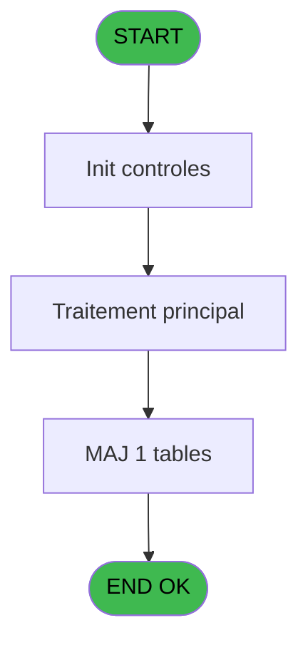
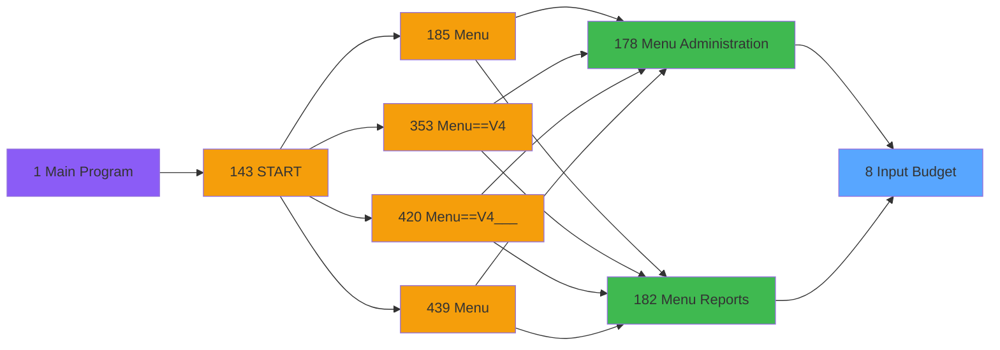

# PVE IDE 8 - Input Budget

> **Analyse**: Phases 1-4 2026-02-03 00:56 -> 00:56 (39s) | Assemblage 00:56
> **Pipeline**: V7.2 Enrichi
> **Structure**: 4 onglets (Resume | Ecrans | Donnees | Connexions)

<!-- TAB:Resume -->

## 1. FICHE D'IDENTITE

| Attribut | Valeur |
|----------|--------|
| Projet | PVE |
| IDE Position | 8 |
| Nom Programme | Input Budget |
| Fichier source | `Prg_8.xml` |
| Domaine metier | General |
| Taches | 1 (1 ecrans visibles) |
| Tables modifiees | 1 |
| Programmes appeles | 1 |

## 2. DESCRIPTION FONCTIONNELLE

**Input Budget** assure la gestion complete de ce processus, accessible depuis [Menu Administration (IDE 178)](PVE-IDE-178.md), [Menu Reports (IDE 182)](PVE-IDE-182.md).

Le flux de traitement s'organise en **1 blocs fonctionnels** :

- **Traitement** (1 tache) : traitements metier divers

**Donnees modifiees** : 1 tables en ecriture (pv_classification).

**Logique metier** : 1 regles identifiees couvrant conditions metier.

## 3. BLOCS FONCTIONNELS

### 3.1 Traitement (1 tache)

Traitements internes.

---

#### 8 - Budget [[ECRAN]](#ecran-t1)

**Role** : Consultation/chargement : Budget.
**Ecran** : 540 x 307 DLU (MDI) | [Voir mockup](#ecran-t1)
**Delegue a** : [Action Cancel Query (IDE 302)](PVE-IDE-302.md)

## 5. REGLES METIER

1 regles identifiees:

### Autres (1 regles)

#### [RM-001] Si P. M(odif) ou Q(uery) [A]='M' alors 'M'MODE sinon 'E'MODE)

| Element | Detail |
|---------|--------|
| **Condition** | `P. M(odif) ou Q(uery) [A]='M'` |
| **Si vrai** | 'M'MODE |
| **Si faux** | 'E'MODE) |
| **Variables** | A (P. M(odif) ou Q(uery)) |
| **Expression source** | Expression 10 : `IF (P. M(odif) ou Q(uery) [A]='M','M'MODE,'E'MODE)` |
| **Exemple** | Si P. M(odif) ou Q(uery) [A]='M' → 'M'MODE. Sinon → 'E'MODE) |

## 6. CONTEXTE

- **Appele par**: [Menu Administration (IDE 178)](PVE-IDE-178.md), [Menu Reports (IDE 182)](PVE-IDE-182.md)
- **Appelle**: 1 programmes | **Tables**: 1 (W:1 R:0 L:0) | **Taches**: 1 | **Expressions**: 11

<!-- TAB:Ecrans -->

## 8. ECRANS

### 8.1 Forms visibles (1 / 1)

| # | Position | Tache | Nom | Type | Largeur | Hauteur | Bloc |
|---|----------|-------|-----|------|---------|---------|------|
| 1 | 8 | 8 | Budget | MDI | 540 | 307 | Traitement |

### 8.2 Mockups Ecrans

---

#### 8 - Budget
**Tache** : [8](#t1) | **Type** : MDI | **Dimensions** : 540 x 307 DLU
**Bloc** : Traitement | **Titre IDE** : Budget

<!-- FORM-DATA:
{
    "width":  540,
    "vFactor":  8,
    "type":  "MDI",
    "hFactor":  4,
    "controls":  [
                     {
                         "x":  40,
                         "type":  "label",
                         "var":  "",
                         "y":  63,
                         "w":  87,
                         "fmt":  "",
                         "name":  "",
                         "h":  13,
                         "color":  "183",
                         "text":  "Revenue per HD",
                         "parent":  null
                     },
                     {
                         "x":  190,
                         "type":  "label",
                         "var":  "",
                         "y":  63,
                         "w":  96,
                         "fmt":  "",
                         "name":  "",
                         "h":  13,
                         "color":  "183",
                         "text":  "Hotel Days",
                         "parent":  null
                     },
                     {
                         "x":  356,
                         "type":  "label",
                         "var":  "",
                         "y":  63,
                         "w":  92,
                         "fmt":  "",
                         "name":  "",
                         "h":  13,
                         "color":  "183",
                         "text":  "Global Revenue",
                         "parent":  null
                     },
                     {
                         "x":  40,
                         "type":  "label",
                         "var":  "",
                         "y":  124,
                         "w":  87,
                         "fmt":  "",
                         "name":  "",
                         "h":  13,
                         "color":  "183",
                         "text":  "Cost per HD",
                         "parent":  null
                     },
                     {
                         "x":  356,
                         "type":  "label",
                         "var":  "",
                         "y":  124,
                         "w":  96,
                         "fmt":  "",
                         "name":  "",
                         "h":  13,
                         "color":  "183",
                         "text":  "Global Cost",
                         "parent":  null
                     },
                     {
                         "x":  40,
                         "type":  "label",
                         "var":  "",
                         "y":  188,
                         "w":  107,
                         "fmt":  "",
                         "name":  "",
                         "h":  13,
                         "color":  "183",
                         "text":  "Gross Margin Rate",
                         "parent":  null
                     },
                     {
                         "x":  356,
                         "type":  "label",
                         "var":  "",
                         "y":  188,
                         "w":  87,
                         "fmt":  "",
                         "name":  "",
                         "h":  13,
                         "color":  "183",
                         "text":  "Gross Margin",
                         "parent":  null
                     },
                     {
                         "x":  1,
                         "type":  "label",
                         "var":  "",
                         "y":  0,
                         "w":  539,
                         "fmt":  "",
                         "name":  "",
                         "h":  42,
                         "color":  "182",
                         "text":  "",
                         "parent":  null
                     },
                     {
                         "x":  14,
                         "type":  "label",
                         "var":  "",
                         "y":  15,
                         "w":  272,
                         "fmt":  "",
                         "name":  "",
                         "h":  10,
                         "color":  "186",
                         "text":  "Input seasonal budget",
                         "parent":  20
                     },
                     {
                         "x":  0,
                         "type":  "label",
                         "var":  "",
                         "y":  272,
                         "w":  540,
                         "fmt":  "",
                         "name":  "",
                         "h":  35,
                         "color":  "6",
                         "text":  "",
                         "parent":  null
                     },
                     {
                         "x":  38,
                         "type":  "edit",
                         "var":  "",
                         "y":  79,
                         "w":  125,
                         "fmt":  "10.2C",
                         "name":  "",
                         "h":  24,
                         "color":  "110",
                         "text":  "",
                         "parent":  null
                     },
                     {
                         "x":  186,
                         "type":  "edit",
                         "var":  "",
                         "y":  79,
                         "w":  125,
                         "fmt":  "#9C",
                         "name":  "",
                         "h":  24,
                         "color":  "110",
                         "text":  "",
                         "parent":  null
                     },
                     {
                         "x":  38,
                         "type":  "edit",
                         "var":  "",
                         "y":  140,
                         "w":  125,
                         "fmt":  "10.2C",
                         "name":  "",
                         "h":  24,
                         "color":  "110",
                         "text":  "",
                         "parent":  null
                     },
                     {
                         "x":  490,
                         "type":  "image",
                         "var":  "",
                         "y":  4,
                         "w":  48,
                         "fmt":  "",
                         "name":  "",
                         "h":  37,
                         "color":  "",
                         "text":  "",
                         "parent":  20
                     },
                     {
                         "x":  137,
                         "type":  "edit",
                         "var":  "",
                         "y":  63,
                         "w":  25,
                         "fmt":  "3",
                         "name":  "",
                         "h":  13,
                         "color":  "183",
                         "text":  "",
                         "parent":  null
                     },
                     {
                         "x":  460,
                         "type":  "edit",
                         "var":  "",
                         "y":  63,
                         "w":  25,
                         "fmt":  "3",
                         "name":  "",
                         "h":  13,
                         "color":  "183",
                         "text":  "",
                         "parent":  null
                     },
                     {
                         "x":  354,
                         "type":  "edit",
                         "var":  "",
                         "y":  79,
                         "w":  138,
                         "fmt":  "10C",
                         "name":  "",
                         "h":  24,
                         "color":  "144",
                         "text":  "",
                         "parent":  null
                     },
                     {
                         "x":  137,
                         "type":  "edit",
                         "var":  "",
                         "y":  124,
                         "w":  25,
                         "fmt":  "3",
                         "name":  "",
                         "h":  13,
                         "color":  "183",
                         "text":  "",
                         "parent":  null
                     },
                     {
                         "x":  460,
                         "type":  "edit",
                         "var":  "",
                         "y":  124,
                         "w":  25,
                         "fmt":  "3",
                         "name":  "",
                         "h":  13,
                         "color":  "183",
                         "text":  "",
                         "parent":  null
                     },
                     {
                         "x":  354,
                         "type":  "edit",
                         "var":  "",
                         "y":  140,
                         "w":  138,
                         "fmt":  "10C",
                         "name":  "",
                         "h":  24,
                         "color":  "144",
                         "text":  "",
                         "parent":  null
                     },
                     {
                         "x":  460,
                         "type":  "edit",
                         "var":  "",
                         "y":  188,
                         "w":  25,
                         "fmt":  "3",
                         "name":  "",
                         "h":  13,
                         "color":  "183",
                         "text":  "",
                         "parent":  null
                     },
                     {
                         "x":  38,
                         "type":  "edit",
                         "var":  "",
                         "y":  204,
                         "w":  125,
                         "fmt":  "8.2C",
                         "name":  "",
                         "h":  24,
                         "color":  "144",
                         "text":  "",
                         "parent":  null
                     },
                     {
                         "x":  354,
                         "type":  "edit",
                         "var":  "",
                         "y":  204,
                         "w":  138,
                         "fmt":  "10C",
                         "name":  "",
                         "h":  24,
                         "color":  "144",
                         "text":  "",
                         "parent":  null
                     },
                     {
                         "x":  462,
                         "type":  "button",
                         "var":  "",
                         "y":  278,
                         "w":  77,
                         "fmt":  "\u0026Exit",
                         "name":  "",
                         "h":  28,
                         "color":  "",
                         "text":  "",
                         "parent":  null
                     }
                 ],
    "taskId":  "8",
    "height":  307
}
-->

<strong>Champs : 12 champs</strong>

| Pos (x,y) | Nom | Variable | Type |
|-----------|-----|----------|------|
| 38,79 | 10.2C | - | edit |
| 186,79 | #9C | - | edit |
| 38,140 | 10.2C | - | edit |
| 137,63 | 3 | - | edit |
| 460,63 | 3 | - | edit |
| 354,79 | 10C | - | edit |
| 137,124 | 3 | - | edit |
| 460,124 | 3 | - | edit |
| 354,140 | 10C | - | edit |
| 460,188 | 3 | - | edit |
| 38,204 | 8.2C | - | edit |
| 354,204 | 10C | - | edit |

<strong>Boutons : 1 boutons</strong>

| Bouton | Pos (x,y) | Action |
|--------|-----------|--------|
| Exit | 462,278 | Quitte le programme |

## 9. NAVIGATION

Ecran unique: **Budget**

### 9.3 Structure hierarchique (1 tache)

| Position | Tache | Type | Dimensions | Bloc |
|----------|-------|------|------------|------|
| **8.1** | [**Budget** (8)](#t1) [mockup](#ecran-t1) | MDI | 540x307 | Traitement |

### 9.4 Algorigramme

> **Legende**: Vert = START/END OK | Rouge = END KO | Bleu = Decisions
> *Algorigramme auto-genere. Utiliser `/algorigramme` pour une synthese metier detaillee.*

<!-- TAB:Donnees -->

## 10. TABLES

### Tables utilisees (1)

| ID | Nom | Description | Type | R | W | L | Usages |
|----|-----|-------------|------|---|---|---|--------|
| 376 | pv_classification |  | DB |   | **W** |   | 1 |

### Colonnes par table (0 / 1 tables avec colonnes identifiees)

Table 376 - pv_classification (**W**) - 1 usages

*Table utilisee uniquement en Link ou aucune colonne Real identifiee dans le DataView.*

## 11. VARIABLES

*(Programme sans variables locales mappees)*

## 12. EXPRESSIONS

**11 / 11 expressions decodees (100%)**

### 12.1 Repartition par type

| Type | Expressions | Regles |
|------|-------------|--------|
| CALCULATION | 3 | 0 |
| CALCUL | 1 | 0 |
| CONDITION | 2 | 5 |
| CONSTANTE | 1 | 0 |
| DATE | 1 | 0 |
| OTHER | 2 | 0 |
| REFERENCE_VG | 1 | 0 |

### 12.2 Expressions cles par type

#### CALCULATION (3 expressions)

| Type | IDE | Expression | Regle |
|------|-----|------------|-------|
| CALCULATION | 7 | `[D]*[E]-[F]*[E]` | - |
| CALCULATION | 6 | `[F]*[E]` | - |
| CALCULATION | 5 | `[D]*[E]` | - |

#### CALCUL (1 expressions)

| Type | IDE | Expression | Regle |
|------|-----|------------|-------|
| CALCUL | 8 | `([D]*[E]-[F]*[E])*100/([D]*[E])` | - |

#### CONDITION (2 expressions)

| Type | IDE | Expression | Regle |
|------|-----|------------|-------|
| CONDITION | 10 | `IF (P. M(odif) ou Q(uery) [A]='M','M'MODE,'E'MODE)` | [RM-001](#rm-RM-001) |
| CONDITION | 11 | `Stat (0,'C'MODE) AND P. M(odif) ou Q(uery) [A]='Q'` | - |

#### CONSTANTE (1 expressions)

| Type | IDE | Expression | Regle |
|------|-----|------------|-------|
| CONSTANTE | 2 | `1` | - |

#### DATE (1 expressions)

| Type | IDE | Expression | Regle |
|------|-----|------------|-------|
| DATE | 3 | `Date ()*10^5+Time ()` | - |

#### OTHER (2 expressions)

| Type | IDE | Expression | Regle |
|------|-----|------------|-------|
| OTHER | 9 | `GetParam ('CURRENCYVALUE')` | - |
| OTHER | 1 | `GetParam ('SERVICE')` | - |

#### REFERENCE_VG (1 expressions)

| Type | IDE | Expression | Regle |
|------|-----|------------|-------|
| REFERENCE_VG | 4 | `VG1` | - |

<!-- TAB:Connexions -->

## 13. GRAPHE D'APPELS

### 13.1 Chaine depuis Main (Callers)

Main -> ... -> [Menu Administration (IDE 178)](PVE-IDE-178.md) -> **Input Budget (IDE 8)**

Main -> ... -> [Menu Reports (IDE 182)](PVE-IDE-182.md) -> **Input Budget (IDE 8)**

### 13.2 Callers

| IDE | Nom Programme | Nb Appels |
|-----|---------------|-----------|
| [178](PVE-IDE-178.md) | Menu Administration | 1 |
| [182](PVE-IDE-182.md) | Menu Reports | 1 |

### 13.3 Callees (programmes appeles)

### 13.4 Detail Callees avec contexte

| IDE | Nom Programme | Appels | Contexte |
|-----|---------------|--------|----------|
| [302](PVE-IDE-302.md) | Action Cancel Query | 1 | Sous-programme |

## 14. RECOMMANDATIONS MIGRATION

### 14.1 Profil du programme

| Metrique | Valeur | Impact migration |
|----------|--------|-----------------|
| Lignes de logique | 13 | Programme compact |
| Expressions | 11 | Peu de logique |
| Tables WRITE | 1 | Impact faible |
| Sous-programmes | 1 | Peu de dependances |
| Ecrans visibles | 1 | Ecran unique ou traitement batch |
| Code desactive | 0% (0 / 13) | Code sain |
| Regles metier | 1 | Quelques regles a preserver |

### 14.2 Plan de migration par bloc

#### Traitement (1 tache: 1 ecran, 0 traitement)

- **Strategie** : 1 composant(s) UI (Razor/React) avec formulaires et validation.
- 1 sous-programme(s) a migrer ou a reutiliser depuis les services existants.
- Decomposer les taches en services unitaires testables.

### 14.3 Dependances critiques

| Dependance | Type | Appels | Impact |
|------------|------|--------|--------|
| pv_classification | Table WRITE (Database) | 1x | Schema + repository |
| [Action Cancel Query (IDE 302)](PVE-IDE-302.md) | Sous-programme | 1x | Normale - Sous-programme |

---
*Spec DETAILED generee par Pipeline V7.2 - 2026-02-03 00:57*
