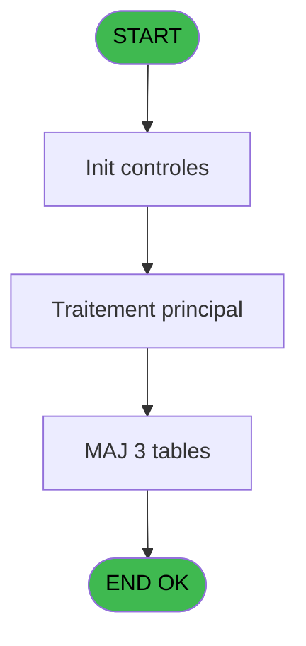
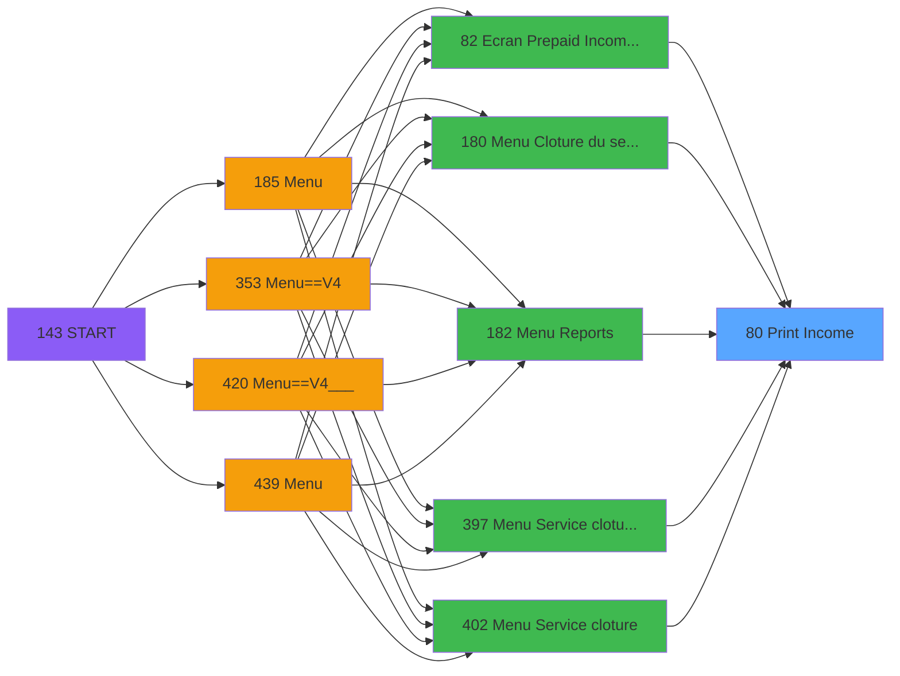
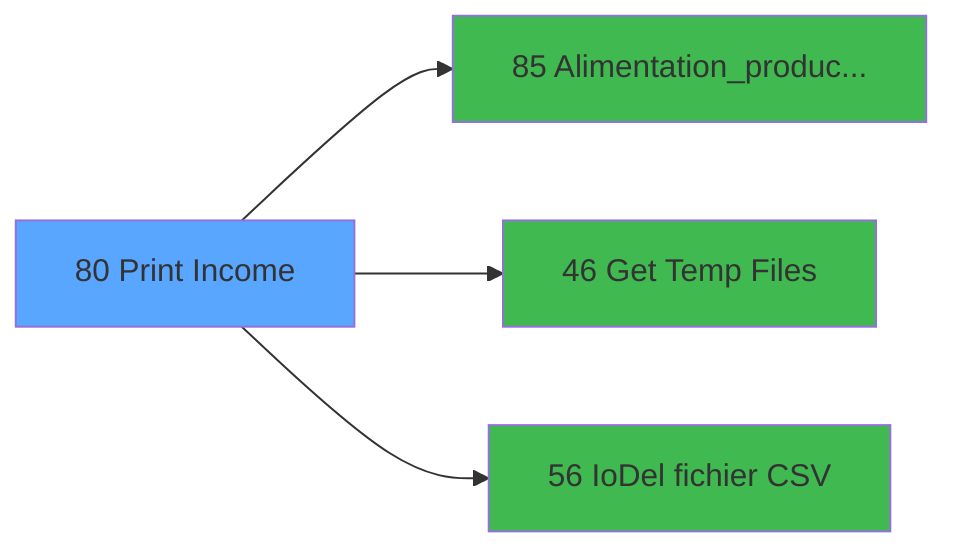

# PVE IDE 80 - Print Income

> **Analyse**: Phases 1-4 2026-02-03 09:12 -> 09:13 (20s) | Assemblage 09:13
> **Pipeline**: V7.2 Enrichi
> **Structure**: 4 onglets (Resume | Ecrans | Donnees | Connexions)

<!-- TAB:Resume -->

## 1. FICHE D'IDENTITE

| Attribut | Valeur |
|----------|--------|
| Projet | PVE |
| IDE Position | 80 |
| Nom Programme | Print Income |
| Fichier source | `Prg_80.xml` |
| Domaine metier | Impression |
| Taches | 14 (1 ecrans visibles) |
| Tables modifiees | 3 |
| Programmes appeles | 3 |

## 2. DESCRIPTION FONCTIONNELLE

**Print Income** assure la gestion complete de ce processus, accessible depuis [Menu Cloture du service (IDE 180)](PVE-IDE-180.md), [Menu Reports (IDE 182)](PVE-IDE-182.md), [Ecran Prepaid Income GEST (IDE 82)](PVE-IDE-82.md), [Menu Service cloture v2 (IDE 397)](PVE-IDE-397.md), [Menu Service cloture (IDE 402)](PVE-IDE-402.md).

Le flux de traitement s'organise en **4 blocs fonctionnels** :

- **Traitement** (9 taches) : traitements metier divers
- **Impression** (3 taches) : generation de tickets et documents
- **Consultation** (1 tache) : ecrans de recherche, selection et consultation
- **Calcul** (1 tache) : calculs de montants, stocks ou compteurs

**Donnees modifiees** : 3 tables en ecriture (pv_statustemp, synthese_garanties, Table_1629).

**Logique metier** : 1 regles identifiees couvrant conditions metier.

Detail : phases du traitement

#### Phase 1 : Impression (3 taches)

- **80** - Print ca **[[ECRAN]](#ecran-t1)**
- **80.1** - Print
- **80.1.2** - Printing

#### Phase 2 : Consultation (1 tache)

- **80.1.1** - SELECTION **[[ECRAN]](#ecran-t3)**

Delegue a : [Get Temp Files (IDE 46)](PVE-IDE-46.md)

#### Phase 3 : Calcul (1 tache)

- **80.1.1.1** - Selection compta **[[ECRAN]](#ecran-t4)**

#### Phase 4 : Traitement (9 taches)

- **80.1.1.1.1** - Temp generation
- **80.1.1.2** - Temp generation
- **80.1.2.1** - product_price **[[ECRAN]](#ecran-t8)**
- **80.1.2.2** - Package line **[[ECRAN]](#ecran-t9)**
- **80.1.2.3** - Package line
- **80.1.2.1.1** - product_price **[[ECRAN]](#ecran-t13)**
- **80.1.1.3** - Temp generation
- **80.1.2.2.1** - Récup taux et montant Taxes
- **80.1.2.4** - Récupération libellé Taxes add

Delegue a : [Alimentation_product_price (IDE 85)](PVE-IDE-85.md), [Get Temp Files (IDE 46)](PVE-IDE-46.md), [IoDel fichier CSV (IDE 56)](PVE-IDE-56.md)

#### Tables impactees

| Table | Operations | Role metier |
|-------|-----------|-------------|
| pv_statustemp | **W**/L (6 usages) |  |
| synthese_garanties | **W** (1 usages) | Depots et garanties |
| Table_1629 | **W** (1 usages) |  |

## 3. BLOCS FONCTIONNELS

### 3.1 Impression (3 taches)

Generation des documents et tickets.

---

#### 80 - Print ca [[ECRAN]](#ecran-t1)

**Role** : Generation du document : Print ca.
**Ecran** : 312 x 173 DLU (MDI) | [Voir mockup](#ecran-t1)

---

#### 80.1 - Print

**Role** : Generation du document : Print.

---

#### 80.1.2 - Printing

**Role** : Generation du document : Printing.

### 3.2 Consultation (1 tache)

Ecrans de recherche et consultation.

---

#### 80.1.1 - SELECTION [[ECRAN]](#ecran-t3)

**Role** : Selection par l'operateur : SELECTION.
**Ecran** : 93 x 61 DLU (MDI) | [Voir mockup](#ecran-t3)

### 3.3 Calcul (1 tache)

Calculs metier : montants, stocks, compteurs.

---

#### 80.1.1.1 - Selection compta [[ECRAN]](#ecran-t4)

**Role** : Selection par l'operateur : Selection compta.
**Ecran** : 471 x 28 DLU (MDI) | [Voir mockup](#ecran-t4)

### 3.4 Traitement (9 taches)

Traitements internes.

---

#### 80.1.1.1.1 - Temp generation

**Role** : Traitement : Temp generation.
**Delegue a** : [Alimentation_product_price (IDE 85)](PVE-IDE-85.md), [Get Temp Files (IDE 46)](PVE-IDE-46.md), [IoDel fichier CSV (IDE 56)](PVE-IDE-56.md)

---

#### 80.1.1.2 - Temp generation

**Role** : Traitement : Temp generation.
**Delegue a** : [Alimentation_product_price (IDE 85)](PVE-IDE-85.md), [Get Temp Files (IDE 46)](PVE-IDE-46.md), [IoDel fichier CSV (IDE 56)](PVE-IDE-56.md)

---

#### 80.1.2.1 - product_price [[ECRAN]](#ecran-t8)

**Role** : Traitement : product_price.
**Ecran** : 694 x 489 DLU | [Voir mockup](#ecran-t8)
**Delegue a** : [Alimentation_product_price (IDE 85)](PVE-IDE-85.md), [Get Temp Files (IDE 46)](PVE-IDE-46.md), [IoDel fichier CSV (IDE 56)](PVE-IDE-56.md)

---

#### 80.1.2.2 - Package line [[ECRAN]](#ecran-t9)

**Role** : Traitement : Package line.
**Ecran** : 635 x 0 DLU (MDI) | [Voir mockup](#ecran-t9)
**Delegue a** : [Alimentation_product_price (IDE 85)](PVE-IDE-85.md), [Get Temp Files (IDE 46)](PVE-IDE-46.md), [IoDel fichier CSV (IDE 56)](PVE-IDE-56.md)

---

#### 80.1.2.3 - Package line

**Role** : Traitement : Package line.
**Delegue a** : [Alimentation_product_price (IDE 85)](PVE-IDE-85.md), [Get Temp Files (IDE 46)](PVE-IDE-46.md), [IoDel fichier CSV (IDE 56)](PVE-IDE-56.md)

---

#### 80.1.2.1.1 - product_price [[ECRAN]](#ecran-t13)

**Role** : Traitement : product_price.
**Ecran** : 694 x 476 DLU | [Voir mockup](#ecran-t13)
**Delegue a** : [Alimentation_product_price (IDE 85)](PVE-IDE-85.md), [Get Temp Files (IDE 46)](PVE-IDE-46.md), [IoDel fichier CSV (IDE 56)](PVE-IDE-56.md)

---

#### 80.1.1.3 - Temp generation

**Role** : Traitement : Temp generation.
**Delegue a** : [Alimentation_product_price (IDE 85)](PVE-IDE-85.md), [Get Temp Files (IDE 46)](PVE-IDE-46.md), [IoDel fichier CSV (IDE 56)](PVE-IDE-56.md)

---

#### 80.1.2.2.1 - Récup taux et montant Taxes

**Role** : Calcul : Récup taux et montant Taxes.
**Delegue a** : [Alimentation_product_price (IDE 85)](PVE-IDE-85.md), [Get Temp Files (IDE 46)](PVE-IDE-46.md), [IoDel fichier CSV (IDE 56)](PVE-IDE-56.md)

---

#### 80.1.2.4 - Récupération libellé Taxes add

**Role** : Traitement : Récupération libellé Taxes add.
**Delegue a** : [Alimentation_product_price (IDE 85)](PVE-IDE-85.md), [Get Temp Files (IDE 46)](PVE-IDE-46.md), [IoDel fichier CSV (IDE 56)](PVE-IDE-56.md)

## 5. REGLES METIER

1 regles identifiees:

### Autres (1 regles)

#### [RM-001] Traitement si VG37 est renseigne

| Element | Detail |
|---------|--------|
| **Condition** | `VG37<>''` |
| **Si vrai** | VG37 |
| **Si faux** | ';') |
| **Expression source** | Expression 1 : `IF(VG37<>'',VG37,';')` |
| **Exemple** | Si VG37<>'' → VG37. Sinon → ';') |

## 6. CONTEXTE

- **Appele par**: [Menu Cloture du service (IDE 180)](PVE-IDE-180.md), [Menu Reports (IDE 182)](PVE-IDE-182.md), [Ecran Prepaid Income GEST (IDE 82)](PVE-IDE-82.md), [Menu Service cloture v2 (IDE 397)](PVE-IDE-397.md), [Menu Service cloture (IDE 402)](PVE-IDE-402.md)
- **Appelle**: 3 programmes | **Tables**: 17 (W:3 R:5 L:12) | **Taches**: 14 | **Expressions**: 10

<!-- TAB:Ecrans -->

## 8. ECRANS

### 8.1 Forms visibles (1 / 14)

| # | Position | Tache | Nom | Type | Largeur | Hauteur | Bloc |
|---|----------|-------|-----|------|---------|---------|------|
| 1 | 80.1.2.1 | 80.1.2.1 | product_price | Type0 | 694 | 489 | Traitement |

### 8.2 Mockups Ecrans

---

#### 80.1.2.1 - product_price
**Tache** : [80.1.2.1](#t8) | **Type** : Type0 | **Dimensions** : 694 x 489 DLU
**Bloc** : Traitement | **Titre IDE** : product_price

<!-- FORM-DATA:
{
    "width":  694,
    "vFactor":  8,
    "type":  "Type0",
    "hFactor":  4,
    "controls":  [
                     {
                         "x":  8,
                         "type":  "table",
                         "var":  "",
                         "name":  "",
                         "titleH":  12,
                         "color":  "",
                         "w":  681,
                         "y":  8,
                         "fmt":  "",
                         "parent":  null,
                         "text":  "",
                         "rowH":  13,
                         "h":  454,
                         "cols":  [
                                      {
                                          "title":  "Seminar Name",
                                          "layer":  1,
                                          "w":  122
                                      },
                                      {
                                          "title":  "Service",
                                          "layer":  2,
                                          "w":  47
                                      },
                                      {
                                          "title":  "Cat",
                                          "layer":  3,
                                          "w":  63
                                      },
                                      {
                                          "title":  "Sub Cat",
                                          "layer":  4,
                                          "w":  63
                                      },
                                      {
                                          "title":  "Product",
                                          "layer":  5,
                                          "w":  63
                                      },
                                      {
                                          "title":  "Label",
                                          "layer":  6,
                                          "w":  122
                                      },
                                      {
                                          "title":  "Regular Unit Price",
                                          "layer":  7,
                                          "w":  106
                                      },
                                      {
                                          "title":  "Unit Price",
                                          "layer":  8,
                                          "w":  77
                                      }
                                  ],
                         "rows":  8
                     },
                     {
                         "x":  12,
                         "type":  "edit",
                         "var":  "",
                         "y":  23,
                         "w":  115,
                         "fmt":  "",
                         "name":  "prp_seminar_name",
                         "h":  10,
                         "color":  "",
                         "text":  "",
                         "parent":  1
                     },
                     {
                         "x":  134,
                         "type":  "edit",
                         "var":  "",
                         "y":  23,
                         "w":  26,
                         "fmt":  "",
                         "name":  "prp_service",
                         "h":  10,
                         "color":  "",
                         "text":  "",
                         "parent":  1
                     },
                     {
                         "x":  181,
                         "type":  "edit",
                         "var":  "",
                         "y":  23,
                         "w":  56,
                         "fmt":  "",
                         "name":  "prp_cat",
                         "h":  10,
                         "color":  "",
                         "text":  "",
                         "parent":  1
                     },
                     {
                         "x":  244,
                         "type":  "edit",
                         "var":  "",
                         "y":  23,
                         "w":  56,
                         "fmt":  "",
                         "name":  "prp_sub_cat",
                         "h":  10,
                         "color":  "",
                         "text":  "",
                         "parent":  1
                     },
                     {
                         "x":  307,
                         "type":  "edit",
                         "var":  "",
                         "y":  23,
                         "w":  56,
                         "fmt":  "",
                         "name":  "prp_product",
                         "h":  10,
                         "color":  "",
                         "text":  "",
                         "parent":  1
                     },
                     {
                         "x":  370,
                         "type":  "edit",
                         "var":  "",
                         "y":  23,
                         "w":  115,
                         "fmt":  "",
                         "name":  "label",
                         "h":  10,
                         "color":  "",
                         "text":  "",
                         "parent":  1
                     },
                     {
                         "x":  492,
                         "type":  "edit",
                         "var":  "",
                         "y":  23,
                         "w":  99,
                         "fmt":  "",
                         "name":  "prix_de_vente",
                         "h":  10,
                         "color":  "",
                         "text":  "",
                         "parent":  1
                     },
                     {
                         "x":  598,
                         "type":  "edit",
                         "var":  "",
                         "y":  23,
                         "w":  70,
                         "fmt":  "",
                         "name":  "prp_unit_price",
                         "h":  10,
                         "color":  "",
                         "text":  "",
                         "parent":  1
                     },
                     {
                         "x":  8,
                         "type":  "button",
                         "var":  "",
                         "y":  466,
                         "w":  181,
                         "fmt":  "Validate / Continue",
                         "name":  "v.Bouton Valider/continuer",
                         "h":  20,
                         "color":  "",
                         "text":  "",
                         "parent":  null
                     },
                     {
                         "x":  508,
                         "type":  "button",
                         "var":  "",
                         "y":  466,
                         "w":  181,
                         "fmt":  "Cancel",
                         "name":  "",
                         "h":  20,
                         "color":  "",
                         "text":  "",
                         "parent":  null
                     }
                 ],
    "taskId":  "80.1.2.1",
    "height":  489
}
-->

<strong>Champs : 8 champs</strong>

| Pos (x,y) | Nom | Variable | Type |
|-----------|-----|----------|------|
| 12,23 | prp_seminar_name | - | edit |
| 134,23 | prp_service | - | edit |
| 181,23 | prp_cat | - | edit |
| 244,23 | prp_sub_cat | - | edit |
| 307,23 | prp_product | - | edit |
| 370,23 | label | - | edit |
| 492,23 | prix_de_vente | - | edit |
| 598,23 | prp_unit_price | - | edit |

<strong>Boutons : 2 boutons</strong>

| Bouton | Pos (x,y) | Action |
|--------|-----------|--------|
| Validate / Continue | 8,466 | Valide la saisie et enregistre |
| Cancel | 508,466 | Annule et retour au menu |

## 9. NAVIGATION

Ecran unique: **product_price**

### 9.3 Structure hierarchique (14 taches)

| Position | Tache | Type | Dimensions | Bloc |
|----------|-------|------|------------|------|
| **80.1** | [**Print ca** (80)](#t1) [mockup](#ecran-t1) | MDI | 312x173 | Impression |
| 80.1.1 | [Print (80.1)](#t2) | MDI | - | |
| 80.1.2 | [Printing (80.1.2)](#t7) | MDI | - | |
| **80.2** | [**SELECTION** (80.1.1)](#t3) [mockup](#ecran-t3) | MDI | 93x61 | Consultation |
| **80.3** | [**Selection compta** (80.1.1.1)](#t4) [mockup](#ecran-t4) | MDI | 471x28 | Calcul |
| **80.4** | [**Temp generation** (80.1.1.1.1)](#t5) | MDI | - | Traitement |
| 80.4.1 | [Temp generation (80.1.1.2)](#t6) | MDI | - | |
| 80.4.2 | [product_price (80.1.2.1)](#t8) [mockup](#ecran-t8) | - | 694x489 | |
| 80.4.3 | [Package line (80.1.2.2)](#t9) [mockup](#ecran-t9) | MDI | 635x0 | |
| 80.4.4 | [Package line (80.1.2.3)](#t10) | MDI | - | |
| 80.4.5 | [product_price (80.1.2.1.1)](#t13) [mockup](#ecran-t13) | - | 694x476 | |
| 80.4.6 | [Temp generation (80.1.1.3)](#t20) | MDI | - | |
| 80.4.7 | [Récup taux et montant Taxes (80.1.2.2.1)](#t27) | - | - | |
| 80.4.8 | [Récupération libellé Taxes add (80.1.2.4)](#t28) | - | - | |

### 9.4 Algorigramme

> **Legende**: Vert = START/END OK | Rouge = END KO | Bleu = Decisions
> *Algorigramme auto-genere. Utiliser `/algorigramme` pour une synthese metier detaillee.*

<!-- TAB:Donnees -->

## 10. TABLES

### Tables utilisees (17)

| ID | Nom | Description | Type | R | W | L | Usages |
|----|-----|-------------|------|---|---|---|--------|
| 36 | client_gm |  | DB | R |   |   | 1 |
| 39 | depot_garantie___dga | Depots et garanties | DB | R |   |   | 1 |
| 67 | tables___________tab |  | DB | R |   |   | 1 |
| 379 | pv_customer_temp |  | DB |   |   | L | 3 |
| 382 | pv_discount_reasons |  | DB |   |   | L | 1 |
| 400 | pv_cust_rentals |  | DB |   |   | L | 3 |
| 403 | pv_sellers |  | DB | R |   | L | 3 |
| 522 | pv_statustemp |  | TMP |   | **W** | L | 6 |
| 523 | synthese_garanties | Depots et garanties | TMP |   | **W** |   | 1 |
| 637 | tempo_zone_secteur | Table temporaire ecran | DB |   |   | L | 4 |
| 765 | tranche_age |  | DB |   |   | L | 2 |
| 766 | temp_forfait_ski |  | DB |   |   | L | 2 |
| 1468 | Table_1468 |  | MEM |   |   | L | 1 |
| 1471 | Table_1471 |  | MEM |   |   | L | 3 |
| 1629 | Table_1629 |  | MEM |   | **W** |   | 1 |
| 1670 | Table_1670 |  | MEM |   |   | L | 3 |
| 1690 | Table_1690 |  | MEM | R |   | L | 3 |

### Colonnes par table (12 / 8 tables avec colonnes identifiees)

Table 36 - client_gm (R) - 1 usages

| Lettre | Variable | Acces | Type |
|--------|----------|-------|------|
| A | v.Article créé manuellement? | R | Logical |
| B | v.Service coché? | R | Logical |
| C | v.montant taxes | R | Numeric |
| D | v.taxes multiples | R | Logical |
| E | v.nombre de taxes suppl (hors T | R | Numeric |
| F | v.montant de la ligne | R | Numeric |

Table 39 - depot_garantie___dga (R) - 1 usages

| Lettre | Variable | Acces | Type |
|--------|----------|-------|------|
| A | V.Taux TVA | R | Numeric |
| B | V.Montant TVA | R | Numeric |
| C | V.Taux_taxe_suppl_1 | R | Numeric |
| D | V.Montant_taxe_suppl_1 | R | Numeric |
| E | V.Taux_taxe_suppl_2 | R | Numeric |
| F | V.Montant_taxe_suppl_2 | R | Numeric |
| G | V.Taux_taxe_suppl_3 | R | Numeric |
| H | V.Montant_taxe_suppl_3 | R | Numeric |
| I | V.Taux_taxe_suppl_4 | R | Numeric |
| J | V.Montant_taxe_suppl_4 | R | Numeric |
| K | V.Taux_taxe_suppl_5 | R | Numeric |
| L | V.Montant_taxe_suppl_5 | R | Numeric |
| M | v.Montant TTC de la ligne | R | Numeric |
| N | v.Montant HT de la ligne | R | Numeric |
| O | v.Somme_des_taxes_suppl | R | Numeric |
| P | v.Service coché? | R | Logical |
| Q | Total Prepaid TTC | R | Numeric |
| R | Total Prepaid Ht | R | Numeric |
| S | Total Prepaid TVA | R | Numeric |
| T | Total Prepaid M&E TTC | R | Numeric |
| U | Total Prepaid M&E Ht | R | Numeric |
| V | Total Prepaid M&E TVA | R | Numeric |
| W | Total Gift Pass TTC | R | Numeric |
| X | Total Gift Pass Ht | R | Numeric |
| Y | Total Gift Pass TVA | R | Numeric |
| Z | Total Paiement Ttc | R | Numeric |
| BA | Total Paiement Ht | R | Numeric |
| BB | Total Paiement Tva | R | Numeric |
| BC | Total Paiement Add Tax | R | Numeric |
| BD | Total Date Ttc | R | Numeric |
| BE | Total Date Ht | R | Numeric |
| BF | Total Date Tva | R | Numeric |
| BG | Total Date Add Tax | R | Numeric |
| BH | Total Général Ttc | R | Numeric |
| BI | Total Général Ht | R | Numeric |
| BJ | Total Général Tva | R | Numeric |
| BK | Total Général Add Tax | R | Numeric |
| BL | Total Mobility-TTC | R | Numeric |
| BM | Total Mobility-HT | R | Numeric |
| BN | v.Gestion des tabulations Exctr | R | Unicode |
| BO | V Adhérent | R | Alpha |

Table 67 - tables___________tab (R) - 1 usages

| Lettre | Variable | Acces | Type |
|--------|----------|-------|------|
| A | v.Service coché? | R | Logical |
| B | v.pca_price_TTC | R | Numeric |
| C | v.pca_HT | R | Numeric |
| D | v.pca_TVA | R | Numeric |
| E | Total Prepaid TTC | R | Numeric |
| F | Total Prepaid Ht | R | Numeric |
| G | Total Prepaid TVA | R | Numeric |
| H | Total Gift Pass TTC | R | Numeric |
| I | Total Gift Pass Ht | R | Numeric |
| J | Total Gift Pass TVA | R | Numeric |
| K | Total Paiement Ttc | R | Numeric |
| L | Total Paiement Ht | R | Numeric |
| M | Total Paiement Tva | R | Numeric |
| N | Total Général Ttc | R | Numeric |
| O | Total Général Ht | R | Numeric |
| P | Total Général Tva | R | Numeric |
| Q | Total Mobility-TTC | R | Numeric |
| R | Total Mobility-HT | R | Numeric |
| S | Total Trie 1 TTC | R | Numeric |
| T | Total Trie 1 Ht | R | Numeric |
| U | Total Trie 1 TVA | R | Numeric |
| V | Total Service TTC | R | Numeric |
| W | Total Service Ht | R | Numeric |
| X | Total Service TVA | R | Numeric |
| Y | V Adhérent | R | Alpha |
| Z | V.Service pour Rupture | R | Unicode |
| BA | V.Concaténation pour Trie | R | Unicode |
| BB | V.Rupture pour Trie | R | Unicode |
| BC | V.Libellé Rupture pour Trie | R | Unicode |

Table 403 - pv_sellers (R/L) - 3 usages

| Lettre | Variable | Acces | Type |
|--------|----------|-------|------|
| A | P.i. Seminar Name | R | Unicode |
| B | v.Service coché? | R | Logical |
| C | v.Bouton Valider/continuer | R | Unicode |

Table 522 - pv_statustemp (**W**/L) - 6 usages

| Lettre | Variable | Acces | Type |
|--------|----------|-------|------|
| A | v.Cas EXCHANGE materiel | W | Logical |
| B | v.Cas EXCHANGE mat+dur | W | Logical |
| C | v.Prix pour EXCH mat+dur | W | Numeric |

Table 523 - synthese_garanties (**W**) - 1 usages

*Table utilisee uniquement en Link ou aucune colonne Real identifiee dans le DataView.*

Table 1629 - Table_1629 (**W**) - 1 usages

| Lettre | Variable | Acces | Type |
|--------|----------|-------|------|
| A | Pi.table | W | Alpha |
| B | Pi.Service | W | Unicode |
| C | Pi.package_id (out) | W | Numeric |
| D | Pi.Montant TTC | W | Numeric |
| E | Po.Taux Tva | W | Numeric |
| F | Po.Montant Tva | W | Numeric |
| G | Po.Taux taxe_1 | W | Numeric |
| H | Po.Montant taxe_1 | W | Numeric |
| I | Po.Taux taxe_2 | W | Numeric |
| J | Po.Montant taxe_2 | W | Numeric |
| K | Po.Taux taxe_3 | W | Numeric |
| L | Po.Montant taxe_3 | W | Numeric |
| M | Po.Taux taxe_4 | W | Numeric |
| N | Po.Montant taxe_4 | W | Numeric |
| O | Po.Taux taxe_5 | W | Numeric |
| P | Po.Montant taxe_5 | W | Numeric |
| Q | Po.Montant_HT | W | Numeric |

Table 1690 - Table_1690 (R/L) - 3 usages

| Lettre | Variable | Acces | Type |
|--------|----------|-------|------|
| A | Pi.table | R | Alpha |

## 11. VARIABLES

### 11.1 Parametres entrants (11)

Variables recues du programme appelant ([Menu Cloture du service (IDE 180)](PVE-IDE-180.md)).

| Lettre | Nom | Type | Usage dans |
|--------|-----|------|-----------|
| A | P. Masque | Alpha | - |
| B | P. Masque sans Z | Alpha | - |
| C | P. Date mini | Date | 1x parametre entrant |
| D | P. Date maxi | Date | 1x parametre entrant |
| E | P.Filtre PREPAID ? | Logical | 1x parametre entrant |
| F | P.Village | Alpha | - |
| G | P.I Flag clôture service | Logical | - |
| H | P.Only Manual Prepaid? | Logical | 1x parametre entrant |
| I | P.i. Order | Unicode | 1x parametre entrant |
| J | P.i. Seminar Name | Unicode | 2x parametre entrant |
| K | P.i. Nombre Services concerné | Numeric | - |

### 11.2 Variables de session (9)

Variables persistantes pendant toute la session.

| Lettre | Nom | Type | Usage dans |
|--------|-----|------|-----------|
| M | v.NomFichier brut | Alpha | 2x session |
| N | v.NomFichierPDF | Alpha | - |
| O | v.NomFichierPDF Archivage | Alpha | - |
| P | v.Nomfichier csv | Alpha | - |
| Q | v.NomFichier csv Archivage | Alpha | - |
| R | v.cas Séminaire? | Logical | - |
| S | v.All services? | Logical | - |
| BN | v.Gestion des tabulations Exctr | Unicode | - |
| BO | V Adhérent | Alpha | - |

### 11.3 Autres (21)

Variables diverses.

| Lettre | Nom | Type | Usage dans |
|--------|-----|------|-----------|
| L | Separateur | Alpha | 4x refs |
| T | Total Prepaid M&E TTC | Numeric | 1x refs |
| U | Total Prepaid M&E Ht | Numeric | - |
| V | Total Prepaid M&E TVA | Numeric | - |
| W | Total Gift Pass TTC | Numeric | - |
| X | Total Gift Pass Ht | Numeric | - |
| Y | Total Gift Pass TVA | Numeric | - |
| Z | Total Paiement Ttc | Numeric | - |
| BA | Total Paiement Ht | Numeric | - |
| BB | Total Paiement Tva | Numeric | - |
| BC | Total Paiement Add Tax | Numeric | - |
| BD | Total Date Ttc | Numeric | - |
| BE | Total Date Ht | Numeric | - |
| BF | Total Date Tva | Numeric | - |
| BG | Total Date Add Tax | Numeric | - |
| BH | Total Général Ttc | Numeric | - |
| BI | Total Général Ht | Numeric | - |
| BJ | Total Général Tva | Numeric | - |
| BK | Total Général Add Tax | Numeric | - |
| BL | Total Mobility-TTC | Numeric | - |
| BM | Total Mobility-HT | Numeric | - |

Toutes les 41 variables (liste complete)

| Cat | Lettre | Nom Variable | Type |
|-----|--------|--------------|------|
| P0 | **A** | P. Masque | Alpha |
| P0 | **B** | P. Masque sans Z | Alpha |
| P0 | **C** | P. Date mini | Date |
| P0 | **D** | P. Date maxi | Date |
| P0 | **E** | P.Filtre PREPAID ? | Logical |
| P0 | **F** | P.Village | Alpha |
| P0 | **G** | P.I Flag clôture service | Logical |
| P0 | **H** | P.Only Manual Prepaid? | Logical |
| P0 | **I** | P.i. Order | Unicode |
| P0 | **J** | P.i. Seminar Name | Unicode |
| P0 | **K** | P.i. Nombre Services concerné | Numeric |
| V. | **M** | v.NomFichier brut | Alpha |
| V. | **N** | v.NomFichierPDF | Alpha |
| V. | **O** | v.NomFichierPDF Archivage | Alpha |
| V. | **P** | v.Nomfichier csv | Alpha |
| V. | **Q** | v.NomFichier csv Archivage | Alpha |
| V. | **R** | v.cas Séminaire? | Logical |
| V. | **S** | v.All services? | Logical |
| V. | **BN** | v.Gestion des tabulations Exctr | Unicode |
| V. | **BO** | V Adhérent | Alpha |
| Autre | **L** | Separateur | Alpha |
| Autre | **T** | Total Prepaid M&E TTC | Numeric |
| Autre | **U** | Total Prepaid M&E Ht | Numeric |
| Autre | **V** | Total Prepaid M&E TVA | Numeric |
| Autre | **W** | Total Gift Pass TTC | Numeric |
| Autre | **X** | Total Gift Pass Ht | Numeric |
| Autre | **Y** | Total Gift Pass TVA | Numeric |
| Autre | **Z** | Total Paiement Ttc | Numeric |
| Autre | **BA** | Total Paiement Ht | Numeric |
| Autre | **BB** | Total Paiement Tva | Numeric |
| Autre | **BC** | Total Paiement Add Tax | Numeric |
| Autre | **BD** | Total Date Ttc | Numeric |
| Autre | **BE** | Total Date Ht | Numeric |
| Autre | **BF** | Total Date Tva | Numeric |
| Autre | **BG** | Total Date Add Tax | Numeric |
| Autre | **BH** | Total Général Ttc | Numeric |
| Autre | **BI** | Total Général Ht | Numeric |
| Autre | **BJ** | Total Général Tva | Numeric |
| Autre | **BK** | Total Général Add Tax | Numeric |
| Autre | **BL** | Total Mobility-TTC | Numeric |
| Autre | **BM** | Total Mobility-HT | Numeric |

## 12. EXPRESSIONS

**10 / 10 expressions decodees (100%)**

### 12.1 Repartition par type

| Type | Expressions | Regles |
|------|-------------|--------|
| CONDITION | 4 | 5 |
| CONCATENATION | 4 | 0 |
| STRING | 2 | 0 |

### 12.2 Expressions cles par type

#### CONDITION (4 expressions)

| Type | IDE | Expression | Regle |
|------|-----|------------|-------|
| CONDITION | 1 | `IF(VG37<>'',VG37,';')` | [RM-001](#rm-RM-001) |
| CONDITION | 9 | `VG127 AND Trim(P.i. Seminar Name [J])<>''` | - |
| CONDITION | 6 | `(GetParam ('Output')='Extraction') AND FileExist (Trim(v.NomFichier brut [M]))` | - |
| CONDITION | 10 | `Total Prepaid M&E TTC [T]>1` | - |

#### CONCATENATION (4 expressions)

| Type | IDE | Expression | Regle |
|------|-----|------------|-------|
| CONCATENATION | 4 | `Translate ('%club_exportdata%')&'ArchivagePOS\'&
Trim(Separateur [L])&'.Pdf'` | - |
| CONCATENATION | 8 | `Translate('%club_exportdata%')&'ArchivagePos\'&
Trim (Separateur [L])&'.csv'` | - |
| CONCATENATION | 2 | `Trim (GetParam ('VILLAGECODE'))&
Trim (GetParam ('SERVICE'))&
'_Income_'&
IF(P.Only Manual Prepaid? [H],'MANUAL_','')&
IF(P.Filtre PREPAID ? [E],'PREPAID','')&
IF(Trim(P.i. Seminar Name [J])<>'',Trim(P.i. Seminar Name [J]),'')&
IF(Trim(P.i. Seminar Name [J])<>'',P.i. Order [I],'')&
DStr (P. Date mini [C],'YYYYMMDD')&'_'&DStr (P. Date maxi [D],'YYYYMMDD')` | - |
| CONCATENATION | 3 | `Translate ('%club_exportdata%')&
Trim(Separateur [L])&'.Pdf'` | - |

#### STRING (2 expressions)

| Type | IDE | Expression | Regle |
|------|-----|------------|-------|
| STRING | 7 | `Translate('%club_exportdata%')&
Trim (Separateur [L])&'.csv'` | - |
| STRING | 5 | `FileDelete (Trim(v.NomFichier brut [M]))` | - |

<!-- TAB:Connexions -->

## 13. GRAPHE D'APPELS

### 13.1 Chaine depuis Main (Callers)

Main -> ... -> [Menu Cloture du service (IDE 180)](PVE-IDE-180.md) -> **Print Income (IDE 80)**

Main -> ... -> [Menu Reports (IDE 182)](PVE-IDE-182.md) -> **Print Income (IDE 80)**

Main -> ... -> [Ecran Prepaid Income GEST (IDE 82)](PVE-IDE-82.md) -> **Print Income (IDE 80)**

Main -> ... -> [Menu Service cloture v2 (IDE 397)](PVE-IDE-397.md) -> **Print Income (IDE 80)**

Main -> ... -> [Menu Service cloture (IDE 402)](PVE-IDE-402.md) -> **Print Income (IDE 80)**

### 13.2 Callers

| IDE | Nom Programme | Nb Appels |
|-----|---------------|-----------|
| [180](PVE-IDE-180.md) | Menu Cloture du service | 2 |
| [182](PVE-IDE-182.md) | Menu Reports | 2 |
| [82](PVE-IDE-82.md) | Ecran Prepaid Income GEST | 1 |
| [397](PVE-IDE-397.md) | Menu Service cloture v2 | 1 |
| [402](PVE-IDE-402.md) | Menu Service cloture | 1 |

### 13.3 Callees (programmes appeles)

### 13.4 Detail Callees avec contexte

| IDE | Nom Programme | Appels | Contexte |
|-----|---------------|--------|----------|
| [85](PVE-IDE-85.md) | Alimentation_product_price | 2 | Sous-programme |
| [46](PVE-IDE-46.md) | Get Temp Files | 1 | Recuperation donnees |
| [56](PVE-IDE-56.md) | IoDel fichier CSV | 1 | Sous-programme |

## 14. RECOMMANDATIONS MIGRATION

### 14.1 Profil du programme

| Metrique | Valeur | Impact migration |
|----------|--------|-----------------|
| Lignes de logique | 1030 | Programme volumineux |
| Expressions | 10 | Peu de logique |
| Tables WRITE | 3 | Impact modere |
| Sous-programmes | 3 | Peu de dependances |
| Ecrans visibles | 1 | Ecran unique ou traitement batch |
| Code desactive | 2.6% (27 / 1030) | Code sain |
| Regles metier | 1 | Quelques regles a preserver |

### 14.2 Plan de migration par bloc

#### Impression (3 taches: 1 ecran, 2 traitements)

- **Strategie** : Templates HTML -> PDF via wkhtmltopdf ou Puppeteer.
- `PrintService` injectable avec choix imprimante

#### Consultation (1 tache: 1 ecran, 0 traitement)

- **Strategie** : Composants de recherche/selection en modales.
- 1 ecran : SELECTION

#### Calcul (1 tache: 1 ecran, 0 traitement)

- **Strategie** : Services de calcul purs (Domain Services).
- Migrer la logique de calcul (stock, compteurs, montants)

#### Traitement (9 taches: 3 ecrans, 6 traitements)

- **Strategie** : Orchestrateur avec 3 ecrans (Razor/React) et 6 traitements backend (services).
- Les ecrans deviennent des composants UI, les traitements invisibles deviennent des services injectables.
- 3 sous-programme(s) a migrer ou a reutiliser depuis les services existants.
- Decomposer les taches en services unitaires testables.

### 14.3 Dependances critiques

| Dependance | Type | Appels | Impact |
|------------|------|--------|--------|
| pv_statustemp | Table WRITE (Temp) | 3x | Schema + repository |
| synthese_garanties | Table WRITE (Temp) | 1x | Schema + repository |
| Table_1629 | Table WRITE (Memory) | 1x | Schema + repository |
| [Alimentation_product_price (IDE 85)](PVE-IDE-85.md) | Sous-programme | 2x | Haute - Sous-programme |
| [IoDel fichier CSV (IDE 56)](PVE-IDE-56.md) | Sous-programme | 1x | Normale - Sous-programme |
| [Get Temp Files (IDE 46)](PVE-IDE-46.md) | Sous-programme | 1x | Normale - Recuperation donnees |

---
*Spec DETAILED generee par Pipeline V7.2 - 2026-02-03 09:13*
