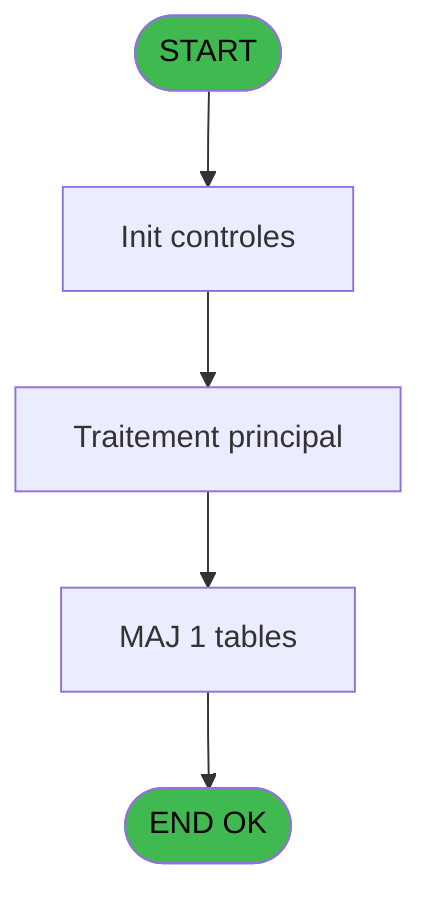
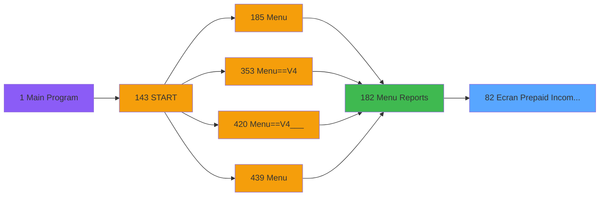
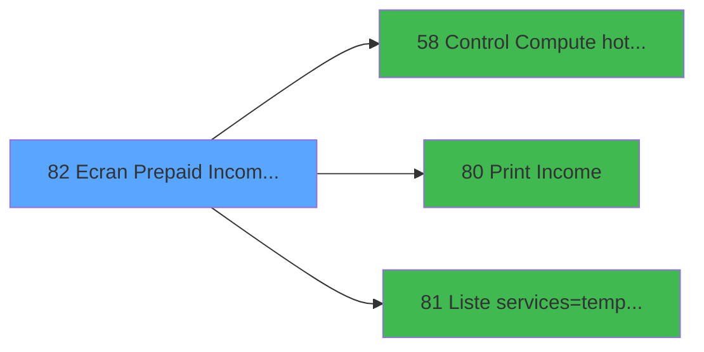

# PVE IDE 82 - Ecran Prepaid Income GEST

> **Analyse**: Phases 1-4 2026-02-03 09:13 -> 09:14 (20s) | Assemblage 09:14
> **Pipeline**: V7.2 Enrichi
> **Structure**: 4 onglets (Resume | Ecrans | Donnees | Connexions)

<!-- TAB:Resume -->

## 1. FICHE D'IDENTITE

| Attribut | Valeur |
|----------|--------|
| Projet | PVE |
| IDE Position | 82 |
| Nom Programme | Ecran Prepaid Income GEST |
| Fichier source | `Prg_82.xml` |
| Domaine metier | General |
| Taches | 1 (1 ecrans visibles) |
| Tables modifiees | 1 |
| Programmes appeles | 3 |

## 2. DESCRIPTION FONCTIONNELLE

**Ecran Prepaid Income GEST** assure la gestion complete de ce processus, accessible depuis [Menu Reports (IDE 182)](PVE-IDE-182.md).

Le flux de traitement s'organise en **1 blocs fonctionnels** :

- **Consultation** (1 tache) : ecrans de recherche, selection et consultation

**Donnees modifiees** : 1 tables en ecriture (tempo_zone_secteur).

**Logique metier** : 3 regles identifiees couvrant conditions metier.

## 3. BLOCS FONCTIONNELS

### 3.1 Consultation (1 tache)

Ecrans de recherche et consultation.

---

#### 82 - Dates selection [[ECRAN]](#ecran-t1)

**Role** : Selection par l'operateur : Dates selection.
**Ecran** : 442 x 224 DLU (Type6) | [Voir mockup](#ecran-t1)
**Variables liees** : F (P.Output Selection), V (V Dates en anomalie)

## 5. REGLES METIER

3 regles identifiees:

### Autres (3 regles)

#### [RM-001] Si V Output [W]='00/00/0000'DATE alors V Dates en anomalie [V] sinon V Output [W])

| Element | Detail |
|---------|--------|
| **Condition** | `V Output [W]='00/00/0000'DATE` |
| **Si vrai** | V Dates en anomalie [V] |
| **Si faux** | V Output [W]) |
| **Variables** | V (V Dates en anomalie), W (V Output) |
| **Expression source** | Expression 4 : `IF (V Output [W]='00/00/0000'DATE,V Dates en anomalie [V],V ` |
| **Exemple** | Si V Output [W]='00/00/0000'DATE → V Dates en anomalie [V]. Sinon → V Output [W]) |
| **Impact** | [82 - Dates selection](#t1) |

#### [RM-002] Si [AD] alors 'TOUS' sinon '')

| Element | Detail |
|---------|--------|
| **Condition** | `[AD]` |
| **Si vrai** | 'TOUS' |
| **Si faux** | '') |
| **Expression source** | Expression 22 : `IF([AD],'TOUS','')` |
| **Exemple** | Si [AD] → 'TOUS'. Sinon → '') |

#### [RM-003] Si [AK] alors [AE]-1 sinon [AE]+1)

| Element | Detail |
|---------|--------|
| **Condition** | `[AK]` |
| **Si vrai** | [AE]-1 |
| **Si faux** | [AE]+1) |
| **Expression source** | Expression 31 : `IF([AK],[AE]-1,[AE]+1)` |
| **Exemple** | Si [AK] → [AE]-1. Sinon → [AE]+1) |

## 6. CONTEXTE

- **Appele par**: [Menu Reports (IDE 182)](PVE-IDE-182.md)
- **Appelle**: 3 programmes | **Tables**: 1 (W:1 R:0 L:0) | **Taches**: 1 | **Expressions**: 34

<!-- TAB:Ecrans -->

## 8. ECRANS

### 8.1 Forms visibles (1 / 1)

| # | Position | Tache | Nom | Type | Largeur | Hauteur | Bloc |
|---|----------|-------|-----|------|---------|---------|------|
| 1 | 82 | 82 | Dates selection | Type6 | 442 | 224 | Consultation |

### 8.2 Mockups Ecrans

---

#### 82 - Dates selection
**Tache** : [82](#t1) | **Type** : Type6 | **Dimensions** : 442 x 224 DLU
**Bloc** : Consultation | **Titre IDE** : Dates selection

<!-- FORM-DATA:
{
    "width":  442,
    "vFactor":  8,
    "type":  "Type6",
    "hFactor":  4,
    "controls":  [
                     {
                         "x":  4,
                         "type":  "label",
                         "var":  "",
                         "y":  42,
                         "w":  222,
                         "fmt":  "",
                         "name":  "",
                         "h":  60,
                         "color":  "183",
                         "text":  "",
                         "parent":  null
                     },
                     {
                         "x":  230,
                         "type":  "label",
                         "var":  "",
                         "y":  42,
                         "w":  206,
                         "fmt":  "",
                         "name":  "",
                         "h":  130,
                         "color":  "183",
                         "text":  "",
                         "parent":  null
                     },
                     {
                         "x":  6,
                         "type":  "label",
                         "var":  "",
                         "y":  49,
                         "w":  215,
                         "fmt":  "",
                         "name":  "",
                         "h":  10,
                         "color":  "187",
                         "text":  "Select the accounting period you want to print",
                         "parent":  null
                     },
                     {
                         "x":  11,
                         "type":  "label",
                         "var":  "",
                         "y":  65,
                         "w":  48,
                         "fmt":  "",
                         "name":  "",
                         "h":  12,
                         "color":  "183",
                         "text":  "Date min",
                         "parent":  null
                     },
                     {
                         "x":  11,
                         "type":  "label",
                         "var":  "",
                         "y":  81,
                         "w":  51,
                         "fmt":  "",
                         "name":  "",
                         "h":  12,
                         "color":  "183",
                         "text":  "Date max",
                         "parent":  null
                     },
                     {
                         "x":  5,
                         "type":  "label",
                         "var":  "",
                         "y":  102,
                         "w":  222,
                         "fmt":  "",
                         "name":  "",
                         "h":  70,
                         "color":  "183",
                         "text":  "",
                         "parent":  null
                     },
                     {
                         "x":  37,
                         "type":  "label",
                         "var":  "",
                         "y":  108,
                         "w":  158,
                         "fmt":  "",
                         "name":  "",
                         "h":  15,
                         "color":  "187",
                         "text":  "Seminar",
                         "parent":  8
                     },
                     {
                         "x":  14,
                         "type":  "label",
                         "var":  "",
                         "y":  130,
                         "w":  62,
                         "fmt":  "",
                         "name":  "",
                         "h":  12,
                         "color":  "183",
                         "text":  "Seminar :",
                         "parent":  null
                     },
                     {
                         "x":  14,
                         "type":  "label",
                         "var":  "",
                         "y":  150,
                         "w":  54,
                         "fmt":  "",
                         "name":  "",
                         "h":  12,
                         "color":  "183",
                         "text":  "Order :",
                         "parent":  null
                     },
                     {
                         "x":  4,
                         "type":  "label",
                         "var":  "",
                         "y":  176,
                         "w":  433,
                         "fmt":  "",
                         "name":  "",
                         "h":  43,
                         "color":  "183",
                         "text":  "",
                         "parent":  null
                     },
                     {
                         "x":  0,
                         "type":  "label",
                         "var":  "",
                         "y":  0,
                         "w":  438,
                         "fmt":  "",
                         "name":  "",
                         "h":  41,
                         "color":  "182",
                         "text":  "",
                         "parent":  null
                     },
                     {
                         "x":  13,
                         "type":  "label",
                         "var":  "",
                         "y":  16,
                         "w":  243,
                         "fmt":  "",
                         "name":  "",
                         "h":  10,
                         "color":  "186",
                         "text":  "Accounting period and print options",
                         "parent":  13
                     },
                     {
                         "x":  260,
                         "type":  "label",
                         "var":  "",
                         "y":  173,
                         "w":  129,
                         "fmt":  "",
                         "name":  "",
                         "h":  15,
                         "color":  "187",
                         "text":  "Output",
                         "parent":  null
                     },
                     {
                         "x":  235,
                         "type":  "table",
                         "var":  "",
                         "name":  "",
                         "titleH":  12,
                         "color":  "",
                         "w":  184,
                         "y":  50,
                         "fmt":  "",
                         "parent":  null,
                         "text":  "",
                         "rowH":  12,
                         "h":  116,
                         "cols":  [
                                      {
                                          "title":  "         Service",
                                          "layer":  1,
                                          "w":  166
                                      }
                                  ],
                         "rows":  1
                     },
                     {
                         "x":  64,
                         "type":  "edit",
                         "var":  "",
                         "y":  65,
                         "w":  73,
                         "fmt":  "",
                         "name":  "",
                         "h":  12,
                         "color":  "110",
                         "text":  "",
                         "parent":  null
                     },
                     {
                         "x":  64,
                         "type":  "edit",
                         "var":  "",
                         "y":  81,
                         "w":  73,
                         "fmt":  "",
                         "name":  "",
                         "h":  12,
                         "color":  "110",
                         "text":  "",
                         "parent":  null
                     },
                     {
                         "x":  12,
                         "type":  "button",
                         "var":  "",
                         "y":  182,
                         "w":  68,
                         "fmt":  "\u0026Cancel",
                         "name":  "",
                         "h":  28,
                         "color":  "",
                         "text":  "",
                         "parent":  12
                     },
                     {
                         "x":  90,
                         "type":  "button",
                         "var":  "",
                         "y":  182,
                         "w":  68,
                         "fmt":  "\u0026Execute",
                         "name":  "",
                         "h":  28,
                         "color":  "",
                         "text":  "",
                         "parent":  12
                     },
                     {
                         "x":  375,
                         "type":  "image",
                         "var":  "",
                         "y":  3,
                         "w":  48,
                         "fmt":  "",
                         "name":  "",
                         "h":  37,
                         "color":  "",
                         "text":  "",
                         "parent":  15
                     },
                     {
                         "x":  258,
                         "type":  "listbox",
                         "var":  "",
                         "y":  189,
                         "w":  133,
                         "fmt":  "",
                         "name":  "V Printer/Extract_0001",
                         "h":  32,
                         "color":  "110",
                         "text":  "Printer,Extraction",
                         "parent":  null
                     },
                     {
                         "x":  82,
                         "type":  "combobox",
                         "var":  "",
                         "y":  131,
                         "w":  134,
                         "fmt":  "",
                         "name":  "V Seminaire",
                         "h":  12,
                         "color":  "",
                         "text":  "\\",
                         "parent":  null
                     },
                     {
                         "x":  82,
                         "type":  "combobox",
                         "var":  "",
                         "y":  151,
                         "w":  134,
                         "fmt":  "",
                         "name":  "V.Ordre_Tri",
                         "h":  12,
                         "color":  "",
                         "text":  "D,P,I,C",
                         "parent":  null
                     },
                     {
                         "x":  254,
                         "type":  "edit",
                         "var":  "",
                         "y":  65,
                         "w":  123,
                         "fmt":  "",
                         "name":  "tul_libelle",
                         "h":  8,
                         "color":  "110",
                         "text":  "",
                         "parent":  17
                     },
                     {
                         "x":  239,
                         "type":  "checkbox",
                         "var":  "",
                         "y":  65,
                         "w":  16,
                         "fmt":  "",
                         "name":  "TUL MARQUEUR",
                         "h":  9,
                         "color":  "110",
                         "text":  "",
                         "parent":  17
                     },
                     {
                         "x":  238,
                         "type":  "checkbox",
                         "var":  "",
                         "y":  53,
                         "w":  12,
                         "fmt":  "",
                         "name":  "V.Tous/(Aucun)?_0001",
                         "h":  9,
                         "color":  "110",
                         "text":  "",
                         "parent":  null
                     }
                 ],
    "taskId":  "82",
    "height":  224
}
-->

<strong>Champs : 7 champs</strong>

| Pos (x,y) | Nom | Variable | Type |
|-----------|-----|----------|------|
| 64,65 | (sans nom) | - | edit |
| 64,81 | (sans nom) | - | edit |
| 82,131 | V Seminaire | - | combobox |
| 82,151 | V.Ordre_Tri | - | combobox |
| 254,65 | tul_libelle | - | edit |
| 239,65 | TUL MARQUEUR | - | checkbox |
| 238,53 | V.Tous/(Aucun)?_0001 | - | checkbox |

<strong>Boutons : 2 boutons</strong>

| Bouton | Pos (x,y) | Action |
|--------|-----------|--------|
| Cancel | 12,182 | Annule et retour au menu |
| Execute | 90,182 | Bouton fonctionnel |

## 9. NAVIGATION

Ecran unique: **Dates selection**

### 9.3 Structure hierarchique (1 tache)

| Position | Tache | Type | Dimensions | Bloc |
|----------|-------|------|------------|------|
| **82.1** | [**Dates selection** (82)](#t1) [mockup](#ecran-t1) | Type6 | 442x224 | Consultation |

### 9.4 Algorigramme

> **Legende**: Vert = START/END OK | Rouge = END KO | Bleu = Decisions
> *Algorigramme auto-genere. Utiliser `/algorigramme` pour une synthese metier detaillee.*

<!-- TAB:Donnees -->

## 10. TABLES

### Tables utilisees (1)

| ID | Nom | Description | Type | R | W | L | Usages |
|----|-----|-------------|------|---|---|---|--------|
| 637 | tempo_zone_secteur | Table temporaire ecran | DB |   | **W** |   | 1 |

### Colonnes par table (1 / 1 tables avec colonnes identifiees)

Table 637 - tempo_zone_secteur (**W**) - 1 usages

| Lettre | Variable | Acces | Type |
|--------|----------|-------|------|
| A | P. Date mini | W | Date |
| B | P. Date Maxi | W | Date |
| C | P. Contrôle HD? | W | Logical |
| D | P. Période nombre JH | W | Numeric |
| E | P. Jours Période | W | Numeric |
| F | P.Output Selection | W | Alpha |
| G | P.Before Tax/Tax Included | W | Alpha |
| H | P.Visible Tax? | W | Logical |
| I | P.Execute Print Report? | W | Logical |
| J | P.Categorie Visible? | W | Logical |
| K | P.Catéorie Mini | W | Numeric |
| L | P.Catéorie Maxi | W | Numeric |
| M | P. Discount&Free Visible? | W | Logical |
| N | P. Choix Discount,Free | W | Numeric |
| O | P.o.Ordre_Tri | W | Unicode |
| P | P.o.Seminaire | W | Unicode |
| Q | V Date mini | W | Date |
| R | V Date maxi | W | Date |
| S | V Discount/FoC | W | Numeric |
| T | v.Amount format | W | Alpha |
| U | v.Amount format sans Z | W | Alpha |
| V | V Dates en anomalie | W | Unicode |
| W | V Output | W | Alpha |
| X | V Tax | W | Alpha |
| Y | V.Tous/(Aucun)? | W | Logical |
| Z | V.Nombre de Services cochés | W | Numeric |
| BA | CHG_REASON_tul_marqueur | W | Numeric |
| BB | CHG_PRV_tul_marqueur | W | Logical |
| BC | CHG_REASON_V.Tous/(Aucun)? | W | Numeric |
| BD | CHG_PRV_V.Tous/(Aucun)? | W | Logical |

## 11. VARIABLES

### 11.1 Parametres entrants (16)

Variables recues du programme appelant ([Menu Reports (IDE 182)](PVE-IDE-182.md)).

| Lettre | Nom | Type | Usage dans |
|--------|-----|------|-----------|
| A | P. Date mini | Date | - |
| B | P. Date Maxi | Date | - |
| C | P. Contrôle HD? | Logical | 1x parametre entrant |
| D | P. Période nombre JH | Numeric | - |
| E | P. Jours Période | Numeric | 1x parametre entrant |
| F | P.Output Selection | Alpha | [82](#t1) |
| G | P.Before Tax/Tax Included | Alpha | - |
| H | P.Visible Tax? | Logical | - |
| I | P.Execute Print Report? | Logical | - |
| J | P.Categorie Visible? | Logical | - |
| K | P.Catéorie Mini | Numeric | - |
| L | P.Catéorie Maxi | Numeric | - |
| M | P. Discount&Free Visible? | Logical | - |
| N | P. Choix Discount,Free | Numeric | - |
| O | P.o.Ordre_Tri | Unicode | 2x parametre entrant |
| P | P.o.Seminaire | Unicode | 2x parametre entrant |

### 11.2 Variables de session (10)

Variables persistantes pendant toute la session.

| Lettre | Nom | Type | Usage dans |
|--------|-----|------|-----------|
| Q | V Date mini | Date | - |
| R | V Date maxi | Date | - |
| S | V Discount/FoC | Numeric | - |
| T | v.Amount format | Alpha | - |
| U | v.Amount format sans Z | Alpha | - |
| V | V Dates en anomalie | Unicode | [82](#t1) |
| W | V Output | Alpha | 3x session |
| X | V Tax | Alpha | - |
| Y | V.Tous/(Aucun)? | Logical | 1x session |
| Z | V.Nombre de Services cochés | Numeric | - |

### 11.3 Autres (4)

Variables diverses.

| Lettre | Nom | Type | Usage dans |
|--------|-----|------|-----------|
| BA | CHG_REASON_tul_marqueur | Numeric | - |
| BB | CHG_PRV_tul_marqueur | Logical | - |
| BC | CHG_REASON_V.Tous/(Aucun)? | Numeric | - |
| BD | CHG_PRV_V.Tous/(Aucun)? | Logical | - |

Toutes les 30 variables (liste complete)

| Cat | Lettre | Nom Variable | Type |
|-----|--------|--------------|------|
| P0 | **A** | P. Date mini | Date |
| P0 | **B** | P. Date Maxi | Date |
| P0 | **C** | P. Contrôle HD? | Logical |
| P0 | **D** | P. Période nombre JH | Numeric |
| P0 | **E** | P. Jours Période | Numeric |
| P0 | **F** | P.Output Selection | Alpha |
| P0 | **G** | P.Before Tax/Tax Included | Alpha |
| P0 | **H** | P.Visible Tax? | Logical |
| P0 | **I** | P.Execute Print Report? | Logical |
| P0 | **J** | P.Categorie Visible? | Logical |
| P0 | **K** | P.Catéorie Mini | Numeric |
| P0 | **L** | P.Catéorie Maxi | Numeric |
| P0 | **M** | P. Discount&Free Visible? | Logical |
| P0 | **N** | P. Choix Discount,Free | Numeric |
| P0 | **O** | P.o.Ordre_Tri | Unicode |
| P0 | **P** | P.o.Seminaire | Unicode |
| V. | **Q** | V Date mini | Date |
| V. | **R** | V Date maxi | Date |
| V. | **S** | V Discount/FoC | Numeric |
| V. | **T** | v.Amount format | Alpha |
| V. | **U** | v.Amount format sans Z | Alpha |
| V. | **V** | V Dates en anomalie | Unicode |
| V. | **W** | V Output | Alpha |
| V. | **X** | V Tax | Alpha |
| V. | **Y** | V.Tous/(Aucun)? | Logical |
| V. | **Z** | V.Nombre de Services cochés | Numeric |
| Autre | **BA** | CHG_REASON_tul_marqueur | Numeric |
| Autre | **BB** | CHG_PRV_tul_marqueur | Logical |
| Autre | **BC** | CHG_REASON_V.Tous/(Aucun)? | Numeric |
| Autre | **BD** | CHG_PRV_V.Tous/(Aucun)? | Logical |

## 12. EXPRESSIONS

**34 / 34 expressions decodees (100%)**

### 12.1 Repartition par type

| Type | Expressions | Regles |
|------|-------------|--------|
| CONDITION | 10 | 3 |
| CALCULATION | 2 | 0 |
| CONSTANTE | 8 | 0 |
| DATE | 1 | 0 |
| OTHER | 8 | 0 |
| CAST_LOGIQUE | 2 | 0 |
| REFERENCE_VG | 1 | 0 |
| FORMAT | 1 | 0 |
| STRING | 1 | 0 |

### 12.2 Expressions cles par type

#### CONDITION (10 expressions)

| Type | IDE | Expression | Regle |
|------|-----|------------|-------|
| CONDITION | 31 | `IF([AK],[AE]-1,[AE]+1)` | [RM-003](#rm-RM-003) |
| CONDITION | 4 | `IF (V Output [W]='00/00/0000'DATE,V Dates en anomalie [V],V Output [W])` | [RM-001](#rm-RM-001) |
| CONDITION | 22 | `IF([AD],'TOUS','')` | [RM-002](#rm-RM-002) |
| CONDITION | 19 | `Trim(P.o.Seminaire [P])<>''` | - |
| CONDITION | 20 | `Trim(P.o.Seminaire [P])<>'' AND P.o.Ordre_Tri [O]=''` | - |
| ... | | *+5 autres* | |

#### CALCULATION (2 expressions)

| Type | IDE | Expression | Regle |
|------|-----|------------|-------|
| CALCULATION | 25 | `Left (Trim (V.Tous/(Aucun)? [Y]),Len (Trim (V.Tous/(Aucun)? [Y]))-1)` | - |
| CALCULATION | 9 | `StrBuild('No HD for @1@: Dispatch and Amount HT/HD will be wrong. Please communicate this information to your Financial Manager.', [AA])` | - |

#### CONSTANTE (8 expressions)

| Type | IDE | Expression | Regle |
|------|-----|------------|-------|
| CONSTANTE | 27 | `'VSERV'` | - |
| CONSTANTE | 26 | `'O'` | - |
| CONSTANTE | 29 | `'Date'` | - |
| CONSTANTE | 28 | `''` | - |
| CONSTANTE | 2 | `'Printer'` | - |
| ... | | *+3 autres* | |

#### DATE (1 expressions)

| Type | IDE | Expression | Regle |
|------|-----|------------|-------|
| DATE | 3 | `Date ()` | - |

#### OTHER (8 expressions)

| Type | IDE | Expression | Regle |
|------|-----|------------|-------|
| OTHER | 18 | `ASCIIChr(33)` | - |
| OTHER | 14 | `[AC]` | - |
| OTHER | 24 | `GetParam ('AMOUNTFORMAT')` | - |
| OTHER | 23 | `GetParam ('HEADERLINE02')` | - |
| OTHER | 7 | `V Output [W]` | - |
| ... | | *+3 autres* | |

#### CAST_LOGIQUE (2 expressions)

| Type | IDE | Expression | Regle |
|------|-----|------------|-------|
| CAST_LOGIQUE | 16 | `'TRUE'LOG` | - |
| CAST_LOGIQUE | 15 | `'FALSE'LOG` | - |

#### REFERENCE_VG (1 expressions)

| Type | IDE | Expression | Regle |
|------|-----|------------|-------|
| REFERENCE_VG | 21 | `VG1` | - |

#### FORMAT (1 expressions)

| Type | IDE | Expression | Regle |
|------|-----|------------|-------|
| FORMAT | 32 | `'      '&Str([AE],'3')&' Service'&IF([AE]>1,'s','')` | - |

#### STRING (1 expressions)

| Type | IDE | Expression | Regle |
|------|-----|------------|-------|
| STRING | 34 | `SetParam ('Output',Trim(P.Output Selection [F]))` | - |

### 12.3 Toutes les expressions (34)

Voir les 34 expressions

#### CONDITION (10)

| IDE | Expression Decodee |
|-----|-------------------|
| 5 | `V Output [W]='00/00/0000'DATE OR V Output [W]<V Dates en anomalie [V]` |
| 4 | `IF (V Output [W]='00/00/0000'DATE,V Dates en anomalie [V],V Output [W])` |
| 22 | `IF([AD],'TOUS','')` |
| 31 | `IF([AK],[AE]-1,[AE]+1)` |
| 10 | `P. Jours Période [E]=0` |
| 11 | `[AA]<>''` |
| 33 | `[AE]=0` |
| 19 | `Trim(P.o.Seminaire [P])<>''` |
| 20 | `Trim(P.o.Seminaire [P])<>'' AND P.o.Ordre_Tri [O]=''` |
| 30 | `Trim(P.o.Ordre_Tri [O])=''` |

#### CALCULATION (2)

| IDE | Expression Decodee |
|-----|-------------------|
| 9 | `StrBuild('No HD for @1@: Dispatch and Amount HT/HD will be wrong. Please communicate this information to your Financial Manager.', [AA])` |
| 25 | `Left (Trim (V.Tous/(Aucun)? [Y]),Len (Trim (V.Tous/(Aucun)? [Y]))-1)` |

#### CONSTANTE (8)

| IDE | Expression Decodee |
|-----|-------------------|
| 1 | `'Before tax'` |
| 2 | `'Printer'` |
| 8 | `0` |
| 17 | `'C'` |
| 26 | `'O'` |
| 27 | `'VSERV'` |
| 28 | `''` |
| 29 | `'Date'` |

#### DATE (1)

| IDE | Expression Decodee |
|-----|-------------------|
| 3 | `Date ()` |

#### OTHER (8)

| IDE | Expression Decodee |
|-----|-------------------|
| 6 | `V Dates en anomalie [V]` |
| 7 | `V Output [W]` |
| 12 | `P. Contrôle HD? [C]` |
| 13 | `[AB]` |
| 14 | `[AC]` |
| 18 | `ASCIIChr(33)` |
| 23 | `GetParam ('HEADERLINE02')` |
| 24 | `GetParam ('AMOUNTFORMAT')` |

#### CAST_LOGIQUE (2)

| IDE | Expression Decodee |
|-----|-------------------|
| 15 | `'FALSE'LOG` |
| 16 | `'TRUE'LOG` |

#### REFERENCE_VG (1)

| IDE | Expression Decodee |
|-----|-------------------|
| 21 | `VG1` |

#### FORMAT (1)

| IDE | Expression Decodee |
|-----|-------------------|
| 32 | `'      '&Str([AE],'3')&' Service'&IF([AE]>1,'s','')` |

#### STRING (1)

| IDE | Expression Decodee |
|-----|-------------------|
| 34 | `SetParam ('Output',Trim(P.Output Selection [F]))` |

<!-- TAB:Connexions -->

## 13. GRAPHE D'APPELS

### 13.1 Chaine depuis Main (Callers)

Main -> ... -> [Menu Reports (IDE 182)](PVE-IDE-182.md) -> **Ecran Prepaid Income GEST (IDE 82)**

### 13.2 Callers

| IDE | Nom Programme | Nb Appels |
|-----|---------------|-----------|
| [182](PVE-IDE-182.md) | Menu Reports | 1 |

### 13.3 Callees (programmes appeles)

### 13.4 Detail Callees avec contexte

| IDE | Nom Programme | Appels | Contexte |
|-----|---------------|--------|----------|
| [58](PVE-IDE-58.md) | Control & Compute hotel days | 1 | Sous-programme |
| [80](PVE-IDE-80.md) | Print Income | 1 | Impression ticket/document |
| [81](PVE-IDE-81.md) | Liste services=>tempo_userlist | 1 | Configuration impression |

## 14. RECOMMANDATIONS MIGRATION

### 14.1 Profil du programme

| Metrique | Valeur | Impact migration |
|----------|--------|-----------------|
| Lignes de logique | 81 | Programme compact |
| Expressions | 34 | Peu de logique |
| Tables WRITE | 1 | Impact faible |
| Sous-programmes | 3 | Peu de dependances |
| Ecrans visibles | 1 | Ecran unique ou traitement batch |
| Code desactive | 0% (0 / 81) | Code sain |
| Regles metier | 3 | Quelques regles a preserver |

### 14.2 Plan de migration par bloc

#### Consultation (1 tache: 1 ecran, 0 traitement)

- **Strategie** : Composants de recherche/selection en modales.
- 1 ecran : Dates selection

### 14.3 Dependances critiques

| Dependance | Type | Appels | Impact |
|------------|------|--------|--------|
| tempo_zone_secteur | Table WRITE (Database) | 1x | Schema + repository |
| [Liste services=>tempo_userlist (IDE 81)](PVE-IDE-81.md) | Sous-programme | 1x | Normale - Configuration impression |
| [Print Income (IDE 80)](PVE-IDE-80.md) | Sous-programme | 1x | Normale - Impression ticket/document |
| [Control & Compute hotel days (IDE 58)](PVE-IDE-58.md) | Sous-programme | 1x | Normale - Sous-programme |

---
*Spec DETAILED generee par Pipeline V7.2 - 2026-02-03 09:14*
