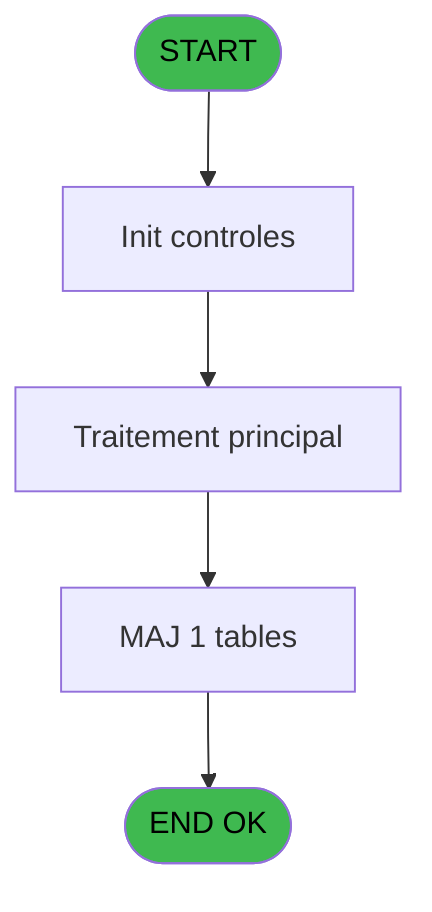
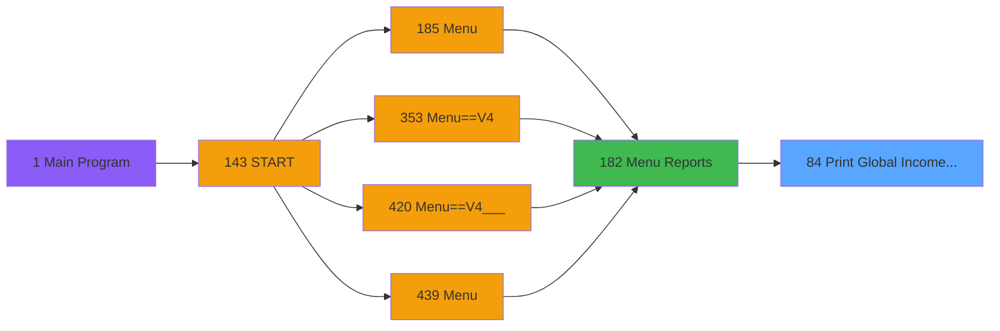

# PVE IDE 84 - Print Global Income All Servic

> **Analyse**: Phases 1-4 2026-02-03 09:14 -> 09:15 (20s) | Assemblage 09:15
> **Pipeline**: V7.2 Enrichi
> **Structure**: 4 onglets (Resume | Ecrans | Donnees | Connexions)

<!-- TAB:Resume -->

## 1. FICHE D'IDENTITE

| Attribut | Valeur |
|----------|--------|
| Projet | PVE |
| IDE Position | 84 |
| Nom Programme | Print Global Income All Servic |
| Fichier source | `Prg_84.xml` |
| Domaine metier | Impression |
| Taches | 13 (0 ecrans visibles) |
| Tables modifiees | 1 |
| Programmes appeles | 1 |

## 2. DESCRIPTION FONCTIONNELLE

**Print Global Income All Servic** assure la gestion complete de ce processus, accessible depuis [Menu Reports (IDE 182)](PVE-IDE-182.md).

Le flux de traitement s'organise en **4 blocs fonctionnels** :

- **Traitement** (7 taches) : traitements metier divers
- **Impression** (4 taches) : generation de tickets et documents
- **Consultation** (1 tache) : ecrans de recherche, selection et consultation
- **Calcul** (1 tache) : calculs de montants, stocks ou compteurs

**Donnees modifiees** : 1 tables en ecriture (Table_1461).

Detail : phases du traitement

#### Phase 1 : Impression (4 taches)

- **84** - Print Global Income Tout servi **[[ECRAN]](#ecran-t1)**
- **84.1** - Print
- **84.1.2** - EDITION
- **84.1.2.1.2** - Print Totaux

#### Phase 2 : Consultation (1 tache)

- **84.1.1** - SELECTION

Delegue a : [Get Temp Files (IDE 46)](PVE-IDE-46.md)

#### Phase 3 : Calcul (1 tache)

- **84.1.1.1** - Selection compta

#### Phase 4 : Traitement (7 taches)

- **84.1.1.1.1** - Temp generation
- **84.1.1.1.1.1** - Temp generation
- **84.1.1.2** - Temp generation GP
- **84.1.2.1** - Lines
- **84.1.2.1.1** - Total
- **84.1.2.1.2.1** - Read Total
- **84.1.2.1.2.2** - Refund

Delegue a : [Get Temp Files (IDE 46)](PVE-IDE-46.md)

#### Tables impactees

| Table | Operations | Role metier |
|-------|-----------|-------------|
| Table_1461 | R/**W**/L (7 usages) |  |

## 3. BLOCS FONCTIONNELS

### 3.1 Impression (4 taches)

Generation des documents et tickets.

---

#### 84 - Print Global Income Tout servi [[ECRAN]](#ecran-t1)

**Role** : Generation du document : Print Global Income Tout servi.
**Ecran** : 312 x 173 DLU (MDI) | [Voir mockup](#ecran-t1)

3 sous-taches directes

| Tache | Nom | Bloc |
|-------|-----|------|
| [84.1](#t2) | Print | Impression |
| [84.1.2](#t8) | EDITION | Impression |
| [84.1.2.1.2](#t11) | Print Totaux | Impression |

**Variables liees** : E (V Mode Global / Détail)

---

#### 84.1 - Print

**Role** : Generation du document : Print.

---

#### 84.1.2 - EDITION

**Role** : Generation du document : EDITION.

---

#### 84.1.2.1.2 - Print Totaux

**Role** : Generation du document : Print Totaux.

### 3.2 Consultation (1 tache)

Ecrans de recherche et consultation.

---

#### 84.1.1 - SELECTION

**Role** : Selection par l'operateur : SELECTION.

### 3.3 Calcul (1 tache)

Calculs metier : montants, stocks, compteurs.

---

#### 84.1.1.1 - Selection compta

**Role** : Selection par l'operateur : Selection compta.

### 3.4 Traitement (7 taches)

Traitements internes.

---

#### 84.1.1.1.1 - Temp generation

**Role** : Traitement : Temp generation.
**Delegue a** : [Get Temp Files (IDE 46)](PVE-IDE-46.md)

---

#### 84.1.1.1.1.1 - Temp generation

**Role** : Traitement : Temp generation.
**Delegue a** : [Get Temp Files (IDE 46)](PVE-IDE-46.md)

---

#### 84.1.1.2 - Temp generation GP

**Role** : Traitement : Temp generation GP.
**Delegue a** : [Get Temp Files (IDE 46)](PVE-IDE-46.md)

---

#### 84.1.2.1 - Lines

**Role** : Traitement : Lines.
**Delegue a** : [Get Temp Files (IDE 46)](PVE-IDE-46.md)

---

#### 84.1.2.1.1 - Total

**Role** : Traitement : Total.
**Variables liees** : G (V Montant total tiket Ttc), H (V Montant total tiket HT), I (V Montant total tiket TVA), J (V.Total PREPAID), K (V.Total PREPAID Ht)
**Delegue a** : [Get Temp Files (IDE 46)](PVE-IDE-46.md)

---

#### 84.1.2.1.2.1 - Read Total

**Role** : Traitement : Read Total.
**Variables liees** : G (V Montant total tiket Ttc), H (V Montant total tiket HT), I (V Montant total tiket TVA), J (V.Total PREPAID), K (V.Total PREPAID Ht)
**Delegue a** : [Get Temp Files (IDE 46)](PVE-IDE-46.md)

---

#### 84.1.2.1.2.2 - Refund

**Role** : Traitement : Refund.
**Delegue a** : [Get Temp Files (IDE 46)](PVE-IDE-46.md)

## 5. REGLES METIER

*(Aucune regle metier identifiee)*

## 6. CONTEXTE

- **Appele par**: [Menu Reports (IDE 182)](PVE-IDE-182.md)
- **Appelle**: 1 programmes | **Tables**: 6 (W:1 R:4 L:4) | **Taches**: 13 | **Expressions**: 3

<!-- TAB:Ecrans -->

## 8. ECRANS

*(Programme sans ecran visible)*

## 9. NAVIGATION

### 9.3 Structure hierarchique (13 taches)

| Position | Tache | Type | Dimensions | Bloc |
|----------|-------|------|------------|------|
| **84.1** | [**Print Global Income Tout servi** (84)](#t1) [mockup](#ecran-t1) | MDI | 312x173 | Impression |
| 84.1.1 | [Print (84.1)](#t2) | MDI | - | |
| 84.1.2 | [EDITION (84.1.2)](#t8) | MDI | - | |
| 84.1.3 | [Print Totaux (84.1.2.1.2)](#t11) | MDI | - | |
| **84.2** | [**SELECTION** (84.1.1)](#t3) | MDI | - | Consultation |
| **84.3** | [**Selection compta** (84.1.1.1)](#t4) | MDI | - | Calcul |
| **84.4** | [**Temp generation** (84.1.1.1.1)](#t5) | MDI | - | Traitement |
| 84.4.1 | [Temp generation (84.1.1.1.1.1)](#t6) | MDI | - | |
| 84.4.2 | [Temp generation GP (84.1.1.2)](#t7) | MDI | - | |
| 84.4.3 | [Lines (84.1.2.1)](#t9) | MDI | - | |
| 84.4.4 | [Total (84.1.2.1.1)](#t10) | MDI | - | |
| 84.4.5 | [Read Total (84.1.2.1.2.1)](#t12) | MDI | - | |
| 84.4.6 | [Refund (84.1.2.1.2.2)](#t13) | MDI | - | |

### 9.4 Algorigramme

> **Legende**: Vert = START/END OK | Rouge = END KO | Bleu = Decisions
> *Algorigramme auto-genere. Utiliser `/algorigramme` pour une synthese metier detaillee.*

<!-- TAB:Donnees -->

## 10. TABLES

### Tables utilisees (6)

| ID | Nom | Description | Type | R | W | L | Usages |
|----|-----|-------------|------|---|---|---|--------|
| 67 | tables___________tab |  | DB | R |   |   | 1 |
| 379 | pv_customer_temp |  | DB | R |   | L | 2 |
| 413 | pv_tva |  | DB |   |   | L | 1 |
| 523 | synthese_garanties | Depots et garanties | TMP | R |   |   | 1 |
| 1461 | Table_1461 |  | MEM | R | **W** | L | 7 |
| 1471 | Table_1471 |  | MEM |   |   | L | 1 |

### Colonnes par table (4 / 4 tables avec colonnes identifiees)

Table 67 - tables___________tab (R) - 1 usages

| Lettre | Variable | Acces | Type |
|--------|----------|-------|------|
| A | V.Total Category | R | Numeric |
| B | V.Total Category Ht | R | Numeric |
| C | V.Total Category Tva | R | Numeric |
| D | V.Total General | R | Numeric |
| E | V.Total General Ht | R | Numeric |
| F | V.Total General Tva | R | Numeric |
| G | V.Total Service | R | Numeric |
| H | V.Total Service Ht | R | Numeric |
| I | V.Total Service Tva | R | Numeric |
| J | V.Total PREPAID | R | Numeric |
| K | V.Total PREPAID Ht | R | Numeric |
| L | V.Total Local | R | Numeric |
| M | V.Total Local Ht | R | Numeric |

Table 379 - pv_customer_temp (R/L) - 2 usages

| Lettre | Variable | Acces | Type |
|--------|----------|-------|------|
| A | v.montant taxes | R | Numeric |
| B | v.taxes multiples | R | Logical |

Table 523 - synthese_garanties (R) - 1 usages

| Lettre | Variable | Acces | Type |
|--------|----------|-------|------|
| A | V.Montant Ht | R | Numeric |
| B | V.Montant Tva | R | Numeric |
| C | V.Taux de TVA | R | Numeric |
| D | V.Montant Prepaid Ht | R | Numeric |
| E | V.Montant Prepaid Tva | R | Numeric |
| F | V.Taux de TVA Prepaid | R | Numeric |
| G | V Montant total tiket Ttc | R | Numeric |
| H | V Montant total tiket HT | R | Numeric |
| I | V Montant total tiket TVA | R | Numeric |

Table 1461 - Table_1461 (R/**W**/L) - 7 usages

| Lettre | Variable | Acces | Type |
|--------|----------|-------|------|
| A | p. refund | W | Logical |
| B | v.Mont Gift Pass | W | Numeric |
| C | Total Location Tva | W | Numeric |
| D | Total General Ttc | W | Numeric |
| E | Total General Ht | W | Numeric |
| F | Total General Tva | W | Numeric |

## 11. VARIABLES

### 11.1 Parametres entrants (4)

Variables recues du programme appelant ([Menu Reports (IDE 182)](PVE-IDE-182.md)).

| Lettre | Nom | Type | Usage dans |
|--------|-----|------|-----------|
| A | P. Masque | Alpha | - |
| B | P. Masque sans Z | Alpha | - |
| C | P. ou V Date mini | Date | - |
| D | P. ou VDate maxi | Date | 1x parametre entrant |

### 11.2 Variables de session (9)

Variables persistantes pendant toute la session.

| Lettre | Nom | Type | Usage dans |
|--------|-----|------|-----------|
| E | V Mode Global / Détail | Alpha | - |
| F | v.NomFichierPdf | Alpha | - |
| G | V Montant total tiket Ttc | Numeric | - |
| H | V Montant total tiket HT | Numeric | - |
| I | V Montant total tiket TVA | Numeric | - |
| J | V.Total PREPAID | Numeric | - |
| K | V.Total PREPAID Ht | Numeric | - |
| L | V.Total Local | Numeric | - |
| M | V.Total Local Ht | Numeric | - |

## 12. EXPRESSIONS

**3 / 3 expressions decodees (100%)**

### 12.1 Repartition par type

| Type | Expressions | Regles |
|------|-------------|--------|
| CONDITION | 1 | 0 |
| CONSTANTE | 1 | 0 |
| CONCATENATION | 1 | 0 |

### 12.2 Expressions cles par type

#### CONDITION (1 expressions)

| Type | IDE | Expression | Regle |
|------|-----|------------|-------|
| CONDITION | 1 | `P. ou VDate maxi [D]<>'00/00/0000'DATE` | - |

#### CONSTANTE (1 expressions)

| Type | IDE | Expression | Regle |
|------|-----|------------|-------|
| CONSTANTE | 2 | `'D'` | - |

#### CONCATENATION (1 expressions)

| Type | IDE | Expression | Regle |
|------|-----|------------|-------|
| CONCATENATION | 3 | `Translate ('%club_exportdata%')&Trim (GetParam ('VILLAGECODE'))&Trim (GetParam ('SERVICE'))&'_GLOBAL_INCOME_ALL_SERVICES_'&DStr (Date(),'YYYYMMDD')&'_'&TStr (Time(),'HHMMSS')&'.Pdf'` | - |

<!-- TAB:Connexions -->

## 13. GRAPHE D'APPELS

### 13.1 Chaine depuis Main (Callers)

Main -> ... -> [Menu Reports (IDE 182)](PVE-IDE-182.md) -> **Print Global Income All Servic (IDE 84)**

### 13.2 Callers

| IDE | Nom Programme | Nb Appels |
|-----|---------------|-----------|
| [182](PVE-IDE-182.md) | Menu Reports | 1 |

### 13.3 Callees (programmes appeles)

### 13.4 Detail Callees avec contexte

| IDE | Nom Programme | Appels | Contexte |
|-----|---------------|--------|----------|
| [46](PVE-IDE-46.md) | Get Temp Files | 1 | Recuperation donnees |

## 14. RECOMMANDATIONS MIGRATION

### 14.1 Profil du programme

| Metrique | Valeur | Impact migration |
|----------|--------|-----------------|
| Lignes de logique | 352 | Taille moyenne |
| Expressions | 3 | Peu de logique |
| Tables WRITE | 1 | Impact faible |
| Sous-programmes | 1 | Peu de dependances |
| Ecrans visibles | 0 | Ecran unique ou traitement batch |
| Code desactive | 0% (0 / 352) | Code sain |
| Regles metier | 0 | Pas de regle identifiee |

### 14.2 Plan de migration par bloc

#### Impression (4 taches: 1 ecran, 3 traitements)

- **Strategie** : Templates HTML -> PDF via wkhtmltopdf ou Puppeteer.
- `PrintService` injectable avec choix imprimante

#### Consultation (1 tache: 0 ecran, 1 traitement)

- **Strategie** : Composants de recherche/selection en modales.

#### Calcul (1 tache: 0 ecran, 1 traitement)

- **Strategie** : Services de calcul purs (Domain Services).
- Migrer la logique de calcul (stock, compteurs, montants)

#### Traitement (7 taches: 0 ecran, 7 traitements)

- **Strategie** : 7 service(s) backend injectable(s) (Domain Services).
- 1 sous-programme(s) a migrer ou a reutiliser depuis les services existants.
- Decomposer les taches en services unitaires testables.

### 14.3 Dependances critiques

| Dependance | Type | Appels | Impact |
|------------|------|--------|--------|
| Table_1461 | Table WRITE (Memory) | 3x | Schema + repository |
| [Get Temp Files (IDE 46)](PVE-IDE-46.md) | Sous-programme | 1x | Normale - Recuperation donnees |

---
*Spec DETAILED generee par Pipeline V7.2 - 2026-02-03 09:15*
