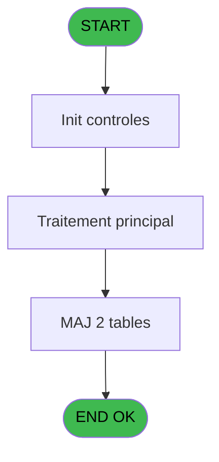
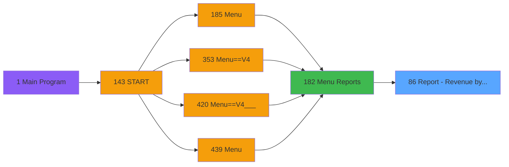
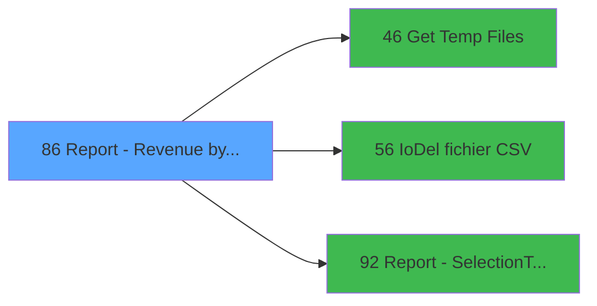

# PVE IDE 86 - Report - Revenue by Day

> **Analyse**: Phases 1-4 2026-02-03 09:15 -> 09:16 (20s) | Assemblage 09:16
> **Pipeline**: V7.2 Enrichi
> **Structure**: 4 onglets (Resume | Ecrans | Donnees | Connexions)

<!-- TAB:Resume -->

## 1. FICHE D'IDENTITE

| Attribut | Valeur |
|----------|--------|
| Projet | PVE |
| IDE Position | 86 |
| Nom Programme | Report - Revenue by Day |
| Fichier source | `Prg_86.xml` |
| Domaine metier | General |
| Taches | 16 (0 ecrans visibles) |
| Tables modifiees | 2 |
| Programmes appeles | 3 |

## 2. DESCRIPTION FONCTIONNELLE

**Report - Revenue by Day** assure la gestion complete de ce processus, accessible depuis [Menu Reports (IDE 182)](PVE-IDE-182.md).

Le flux de traitement s'organise en **5 blocs fonctionnels** :

- **Traitement** (9 taches) : traitements metier divers
- **Impression** (3 taches) : generation de tickets et documents
- **Consultation** (2 taches) : ecrans de recherche, selection et consultation
- **Calcul** (1 tache) : calculs de montants, stocks ou compteurs
- **Creation** (1 tache) : insertion d'enregistrements en base (mouvements, prestations)

**Donnees modifiees** : 2 tables en ecriture (logement_par_village, Table_1461).

Detail : phases du traitement

#### Phase 1 : Traitement (9 taches)

- **86** - (sans nom) **[[ECRAN]](#ecran-t1)**
- **86.1.1.1** - Lines **[[ECRAN]](#ecran-t4)**
- **86.1.1.1.1** - Total
- **86.1.1.1.2.1** - Refund
- **86.1.2.1.1** - Temp generation
- **86.1.2.2** - Temp generation
- **86.1.2.3** - Temp generation
- **86.1.2.4** - Lecture pour Cumul
- **86.2** - Budget HD

Delegue a : [Get Temp Files (IDE 46)](PVE-IDE-46.md), [IoDel fichier CSV (IDE 56)](PVE-IDE-56.md)

#### Phase 2 : Impression (3 taches)

- **86.1** - Print
- **86.1.1** - EDITION
- **86.1.1.1.2** - Print Totaux

#### Phase 3 : Creation (1 tache)

- **86.1.1.2** - Creation Hd a Zero

#### Phase 4 : Consultation (2 taches)

- **86.1.1.2.1** - Recherche
- **86.1.2** - SELECTION

Delegue a : [Get Temp Files (IDE 46)](PVE-IDE-46.md), [Report - Selection/Tempo (IDE 92)](PVE-IDE-92.md)

#### Phase 5 : Calcul (1 tache)

- **86.1.2.1** - Selection compta

#### Tables impactees

| Table | Operations | Role metier |
|-------|-----------|-------------|
| Table_1461 | R/**W**/L (5 usages) |  |
| logement_par_village | R/**W** (4 usages) |  |

## 3. BLOCS FONCTIONNELS

### 3.1 Traitement (9 taches)

Traitements internes.

---

#### 86 - (sans nom) [[ECRAN]](#ecran-t1)

**Role** : Tache d'orchestration : point d'entree du programme (9 sous-taches). Coordonne l'enchainement des traitements.
**Ecran** : 312 x 57 DLU (MDI) | [Voir mockup](#ecran-t1)

8 sous-taches directes

| Tache | Nom | Bloc |
|-------|-----|------|
| [86.1.1.1](#t4) | Lines **[[ECRAN]](#ecran-t4)** | Traitement |
| [86.1.1.1.1](#t5) | Total | Traitement |
| [86.1.1.1.2.1](#t7) | Refund | Traitement |
| [86.1.2.1.1](#t12) | Temp generation | Traitement |
| [86.1.2.2](#t13) | Temp generation | Traitement |
| [86.1.2.3](#t14) | Temp generation | Traitement |
| [86.1.2.4](#t15) | Lecture pour Cumul | Traitement |
| [86.2](#t16) | Budget HD | Traitement |

**Delegue a** : [Get Temp Files (IDE 46)](PVE-IDE-46.md), [IoDel fichier CSV (IDE 56)](PVE-IDE-56.md)

---

#### 86.1.1.1 - Lines [[ECRAN]](#ecran-t4)

**Role** : Traitement : Lines.
**Ecran** : 298 x 195 DLU (MDI) | [Voir mockup](#ecran-t4)
**Delegue a** : [Get Temp Files (IDE 46)](PVE-IDE-46.md), [IoDel fichier CSV (IDE 56)](PVE-IDE-56.md)

---

#### 86.1.1.1.1 - Total

**Role** : Traitement : Total.
**Variables liees** : O (V Total Regular Gift Pass Ttc), P (V Total Regular Gift Pass Tva), Q (V Total Discount Gift Pass Ht), R (V Total Discount Gift Pass Ttc), S (V Total Discount Gift Pass Tva)
**Delegue a** : [Get Temp Files (IDE 46)](PVE-IDE-46.md), [IoDel fichier CSV (IDE 56)](PVE-IDE-56.md)

---

#### 86.1.1.1.2.1 - Refund

**Role** : Traitement : Refund.
**Delegue a** : [Get Temp Files (IDE 46)](PVE-IDE-46.md), [IoDel fichier CSV (IDE 56)](PVE-IDE-56.md)

---

#### 86.1.2.1.1 - Temp generation

**Role** : Traitement : Temp generation.
**Delegue a** : [Get Temp Files (IDE 46)](PVE-IDE-46.md), [IoDel fichier CSV (IDE 56)](PVE-IDE-56.md)

---

#### 86.1.2.2 - Temp generation

**Role** : Traitement : Temp generation.
**Delegue a** : [Get Temp Files (IDE 46)](PVE-IDE-46.md), [IoDel fichier CSV (IDE 56)](PVE-IDE-56.md)

---

#### 86.1.2.3 - Temp generation

**Role** : Traitement : Temp generation.
**Delegue a** : [Get Temp Files (IDE 46)](PVE-IDE-46.md), [IoDel fichier CSV (IDE 56)](PVE-IDE-56.md)

---

#### 86.1.2.4 - Lecture pour Cumul

**Role** : Traitement : Lecture pour Cumul.
**Delegue a** : [Get Temp Files (IDE 46)](PVE-IDE-46.md), [IoDel fichier CSV (IDE 56)](PVE-IDE-56.md)

---

#### 86.2 - Budget HD

**Role** : Consultation/chargement : Budget HD.
**Variables liees** : M (V Budget per HD)
**Delegue a** : [Get Temp Files (IDE 46)](PVE-IDE-46.md), [IoDel fichier CSV (IDE 56)](PVE-IDE-56.md)

### 3.2 Impression (3 taches)

Generation des documents et tickets.

---

#### 86.1 - Print

**Role** : Generation du document : Print.

---

#### 86.1.1 - EDITION

**Role** : Generation du document : EDITION.

---

#### 86.1.1.1.2 - Print Totaux

**Role** : Generation du document : Print Totaux.

### 3.3 Creation (1 tache)

Insertion de nouveaux enregistrements en base.

---

#### 86.1.1.2 - Creation Hd a Zero

**Role** : Creation d'enregistrement : Creation Hd a Zero.

### 3.4 Consultation (2 taches)

Ecrans de recherche et consultation.

---

#### 86.1.1.2.1 - Recherche

**Role** : Traitement : Recherche.
**Delegue a** : [Report - Selection/Tempo (IDE 92)](PVE-IDE-92.md)

---

#### 86.1.2 - SELECTION

**Role** : Selection par l'operateur : SELECTION.
**Delegue a** : [Report - Selection/Tempo (IDE 92)](PVE-IDE-92.md)

### 3.5 Calcul (1 tache)

Calculs metier : montants, stocks, compteurs.

---

#### 86.1.2.1 - Selection compta

**Role** : Selection par l'operateur : Selection compta.
**Delegue a** : [Report - Selection/Tempo (IDE 92)](PVE-IDE-92.md)

## 5. REGLES METIER

*(Aucune regle metier identifiee)*

## 6. CONTEXTE

- **Appele par**: [Menu Reports (IDE 182)](PVE-IDE-182.md)
- **Appelle**: 3 programmes | **Tables**: 14 (W:2 R:6 L:10) | **Taches**: 16 | **Expressions**: 6

<!-- TAB:Ecrans -->

## 8. ECRANS

*(Programme sans ecran visible)*

## 9. NAVIGATION

### 9.3 Structure hierarchique (16 taches)

| Position | Tache | Type | Dimensions | Bloc |
|----------|-------|------|------------|------|
| **86.1** | [**(sans nom)** (86)](#t1) [mockup](#ecran-t1) | MDI | 312x57 | Traitement |
| 86.1.1 | [Lines (86.1.1.1)](#t4) [mockup](#ecran-t4) | MDI | 298x195 | |
| 86.1.2 | [Total (86.1.1.1.1)](#t5) | MDI | - | |
| 86.1.3 | [Refund (86.1.1.1.2.1)](#t7) | MDI | - | |
| 86.1.4 | [Temp generation (86.1.2.1.1)](#t12) | MDI | - | |
| 86.1.5 | [Temp generation (86.1.2.2)](#t13) | - | - | |
| 86.1.6 | [Temp generation (86.1.2.3)](#t14) | - | - | |
| 86.1.7 | [Lecture pour Cumul (86.1.2.4)](#t15) | - | - | |
| 86.1.8 | [Budget HD (86.2)](#t16) | MDI | - | |
| **86.2** | [**Print** (86.1)](#t2) | MDI | - | Impression |
| 86.2.1 | [EDITION (86.1.1)](#t3) | MDI | - | |
| 86.2.2 | [Print Totaux (86.1.1.1.2)](#t6) | MDI | - | |
| **86.3** | [**Creation Hd a Zero** (86.1.1.2)](#t8) | - | - | Creation |
| **86.4** | [**Recherche** (86.1.1.2.1)](#t9) | - | - | Consultation |
| 86.4.1 | [SELECTION (86.1.2)](#t10) | MDI | - | |
| **86.5** | [**Selection compta** (86.1.2.1)](#t11) | MDI | - | Calcul |

### 9.4 Algorigramme

> **Legende**: Vert = START/END OK | Rouge = END KO | Bleu = Decisions
> *Algorigramme auto-genere. Utiliser `/algorigramme` pour une synthese metier detaillee.*

<!-- TAB:Donnees -->

## 10. TABLES

### Tables utilisees (14)

| ID | Nom | Description | Type | R | W | L | Usages |
|----|-----|-------------|------|---|---|---|--------|
| 30 | gm-recherche_____gmr | Index de recherche | DB |   |   | L | 1 |
| 31 | gm-complet_______gmc |  | DB |   |   | L | 1 |
| 38 | comptable_gratuite |  | DB |   |   | L | 1 |
| 376 | pv_classification |  | DB | R |   |   | 1 |
| 386 | ski_frame |  | DB |   |   | L | 1 |
| 392 | pv_invoicehistoline | Historique / journal | DB | R |   | L | 2 |
| 403 | pv_sellers |  | DB |   |   | L | 1 |
| 420 | req_dispatch |  | DB |   |   | L | 1 |
| 523 | synthese_garanties | Depots et garanties | TMP | R |   |   | 1 |
| 528 | logement_par_village |  | TMP | R | **W** |   | 4 |
| 763 | pv_inv_stock | Articles et stock | DB | R |   |   | 1 |
| 1461 | Table_1461 |  | MEM | R | **W** | L | 5 |
| 1468 | Table_1468 |  | MEM |   |   | L | 1 |
| 1471 | Table_1471 |  | MEM |   |   | L | 1 |

### Colonnes par table (5 / 6 tables avec colonnes identifiees)

Table 376 - pv_classification (R) - 1 usages

*Table utilisee uniquement en Link ou aucune colonne Real identifiee dans le DataView.*

Table 392 - pv_invoicehistoline (R/L) - 2 usages

| Lettre | Variable | Acces | Type |
|--------|----------|-------|------|
| A | P Date Min | R | Date |
| B | P Date Max | R | Date |
| C | vLien Global Ca Not Prepaid | R | Logical |
| D | vLien Global Ca Prepaid | R | Logical |

Table 523 - synthese_garanties (R) - 1 usages

*Table utilisee uniquement en Link ou aucune colonne Real identifiee dans le DataView.*

Table 528 - logement_par_village (R/**W**) - 4 usages

| Lettre | Variable | Acces | Type |
|--------|----------|-------|------|
| A | P. Village Name | W | Alpha |

Table 763 - pv_inv_stock (R) - 1 usages

| Lettre | Variable | Acces | Type |
|--------|----------|-------|------|
| A | T.Gratuite | R | Logical |
| B | T.Credit conso | R | Logical |

Table 1461 - Table_1461 (R/**W**/L) - 5 usages

| Lettre | Variable | Acces | Type |
|--------|----------|-------|------|
| A | V Date | W | Date |
| B | Total Date | W | Numeric |
| C | Total Date HT | W | Numeric |
| D | Total Date TTC | W | Numeric |
| E | Total Date TVA | W | Numeric |
| F | Total Date PREPAID OR NOT | W | Numeric |
| G | Total PREPAID OR NOT HT | W | Numeric |
| H | Total PREPAID OR NOT TTC | W | Numeric |
| I | Total PREPAID OR NOT TVA | W | Numeric |
| J | Total Days Prepaid | W | Numeric |
| K | Total Days Not Prepaid | W | Numeric |
| L | Total Days Général | W | Numeric |
| M | V derniereDate Traitée | W | Date |
| N | V Date en cours | W | Date |
| O | V Iteration Creation | W | Numeric |

## 11. VARIABLES

### 11.1 Parametres entrants (10)

Variables recues du programme appelant ([Menu Reports (IDE 182)](PVE-IDE-182.md)).

| Lettre | Nom | Type | Usage dans |
|--------|-----|------|-----------|
| A | P. Village Name | Alpha | - |
| B | P. Currency | Alpha | - |
| C | P. Masque | Alpha | - |
| D | P. Masque sans Z | Alpha | - |
| E | P. Decimales | Numeric | - |
| F | P. Contôle HD | Logical | - |
| G | P. Pèriode Nombre JH | Numeric | - |
| H | P. Jours Pèriode | Numeric | - |
| I | P. Date Mini | Date | - |
| J | P. Date Maxi | Date | 1x parametre entrant |

### 11.2 Variables de session (7)

Variables persistantes pendant toute la session.

| Lettre | Nom | Type | Usage dans |
|--------|-----|------|-----------|
| M | V Budget per HD | Numeric | - |
| N | v.NomFichierPDF | Alpha | 1x session |
| O | V Total Regular Gift Pass Ttc | Numeric | - |
| P | V Total Regular Gift Pass Tva | Numeric | - |
| Q | V Total Discount Gift Pass Ht | Numeric | - |
| R | V Total Discount Gift Pass Ttc | Numeric | - |
| S | V Total Discount Gift Pass Tva | Numeric | - |

### 11.3 Autres (2)

Variables diverses.

| Lettre | Nom | Type | Usage dans |
|--------|-----|------|-----------|
| K | Param Mode Global / Détail | Alpha | - |
| L | S | Alpha | 1x refs |

Toutes les 19 variables (liste complete)

| Cat | Lettre | Nom Variable | Type |
|-----|--------|--------------|------|
| P0 | **A** | P. Village Name | Alpha |
| P0 | **B** | P. Currency | Alpha |
| P0 | **C** | P. Masque | Alpha |
| P0 | **D** | P. Masque sans Z | Alpha |
| P0 | **E** | P. Decimales | Numeric |
| P0 | **F** | P. Contôle HD | Logical |
| P0 | **G** | P. Pèriode Nombre JH | Numeric |
| P0 | **H** | P. Jours Pèriode | Numeric |
| P0 | **I** | P. Date Mini | Date |
| P0 | **J** | P. Date Maxi | Date |
| V. | **M** | V Budget per HD | Numeric |
| V. | **N** | v.NomFichierPDF | Alpha |
| V. | **O** | V Total Regular Gift Pass Ttc | Numeric |
| V. | **P** | V Total Regular Gift Pass Tva | Numeric |
| V. | **Q** | V Total Discount Gift Pass Ht | Numeric |
| V. | **R** | V Total Discount Gift Pass Ttc | Numeric |
| V. | **S** | V Total Discount Gift Pass Tva | Numeric |
| Autre | **K** | Param Mode Global / Détail | Alpha |
| Autre | **L** | S | Alpha |

## 12. EXPRESSIONS

**6 / 6 expressions decodees (100%)**

### 12.1 Repartition par type

| Type | Expressions | Regles |
|------|-------------|--------|
| CONDITION | 2 | 0 |
| CONSTANTE | 1 | 0 |
| CONCATENATION | 1 | 0 |
| REFERENCE_VG | 1 | 0 |
| STRING | 1 | 0 |

### 12.2 Expressions cles par type

#### CONDITION (2 expressions)

| Type | IDE | Expression | Regle |
|------|-----|------------|-------|
| CONDITION | 6 | `GetParam ('Output')='Extraction'` | - |
| CONDITION | 2 | `P. Date Maxi [J]<>'00/00/0000'DATE` | - |

#### CONSTANTE (1 expressions)

| Type | IDE | Expression | Regle |
|------|-----|------------|-------|
| CONSTANTE | 3 | `'D'` | - |

#### CONCATENATION (1 expressions)

| Type | IDE | Expression | Regle |
|------|-----|------------|-------|
| CONCATENATION | 1 | `Translate ('%club_exportdata%')&Trim (GetParam ('VILLAGECODE'))&Trim (GetParam ('SERVICE'))&'_REVENUE_BY_DAY_'&DStr (Date(),'YYYYMMDD')&'_'&TStr (Time(),'HHMMSS')&'.Pdf'` | - |

#### REFERENCE_VG (1 expressions)

| Type | IDE | Expression | Regle |
|------|-----|------------|-------|
| REFERENCE_VG | 4 | `VG37` | - |

#### STRING (1 expressions)

| Type | IDE | Expression | Regle |
|------|-----|------------|-------|
| STRING | 5 | `FileDelete (Trim(v.NomFichierPDF [N]))` | - |

<!-- TAB:Connexions -->

## 13. GRAPHE D'APPELS

### 13.1 Chaine depuis Main (Callers)

Main -> ... -> [Menu Reports (IDE 182)](PVE-IDE-182.md) -> **Report - Revenue by Day (IDE 86)**

### 13.2 Callers

| IDE | Nom Programme | Nb Appels |
|-----|---------------|-----------|
| [182](PVE-IDE-182.md) | Menu Reports | 1 |

### 13.3 Callees (programmes appeles)

### 13.4 Detail Callees avec contexte

| IDE | Nom Programme | Appels | Contexte |
|-----|---------------|--------|----------|
| [46](PVE-IDE-46.md) | Get Temp Files | 1 | Recuperation donnees |
| [56](PVE-IDE-56.md) | IoDel fichier CSV | 1 | Sous-programme |
| [92](PVE-IDE-92.md) | Report - Selection/Tempo | 1 | Selection/consultation |

## 14. RECOMMANDATIONS MIGRATION

### 14.1 Profil du programme

| Metrique | Valeur | Impact migration |
|----------|--------|-----------------|
| Lignes de logique | 528 | Programme volumineux |
| Expressions | 6 | Peu de logique |
| Tables WRITE | 2 | Impact faible |
| Sous-programmes | 3 | Peu de dependances |
| Ecrans visibles | 0 | Ecran unique ou traitement batch |
| Code desactive | 0.6% (3 / 528) | Code sain |
| Regles metier | 0 | Pas de regle identifiee |

### 14.2 Plan de migration par bloc

#### Traitement (9 taches: 2 ecrans, 7 traitements)

- **Strategie** : Orchestrateur avec 2 ecrans (Razor/React) et 7 traitements backend (services).
- Les ecrans deviennent des composants UI, les traitements invisibles deviennent des services injectables.
- 3 sous-programme(s) a migrer ou a reutiliser depuis les services existants.
- Decomposer les taches en services unitaires testables.

#### Impression (3 taches: 0 ecran, 3 traitements)

- **Strategie** : Templates HTML -> PDF via wkhtmltopdf ou Puppeteer.
- `PrintService` injectable avec choix imprimante

#### Creation (1 tache: 0 ecran, 1 traitement)

- **Strategie** : Repository pattern avec Entity Framework Core.
- Insertion via `IRepository<T>.CreateAsync()`

#### Consultation (2 taches: 0 ecran, 2 traitements)

- **Strategie** : Composants de recherche/selection en modales.

#### Calcul (1 tache: 0 ecran, 1 traitement)

- **Strategie** : Services de calcul purs (Domain Services).
- Migrer la logique de calcul (stock, compteurs, montants)

### 14.3 Dependances critiques

| Dependance | Type | Appels | Impact |
|------------|------|--------|--------|
| logement_par_village | Table WRITE (Temp) | 3x | Schema + repository |
| Table_1461 | Table WRITE (Memory) | 1x | Schema + repository |
| [Report - Selection/Tempo (IDE 92)](PVE-IDE-92.md) | Sous-programme | 1x | Normale - Selection/consultation |
| [IoDel fichier CSV (IDE 56)](PVE-IDE-56.md) | Sous-programme | 1x | Normale - Sous-programme |
| [Get Temp Files (IDE 46)](PVE-IDE-46.md) | Sous-programme | 1x | Normale - Recuperation donnees |

---
*Spec DETAILED generee par Pipeline V7.2 - 2026-02-03 09:16*
