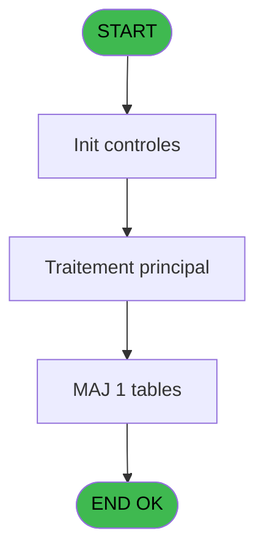
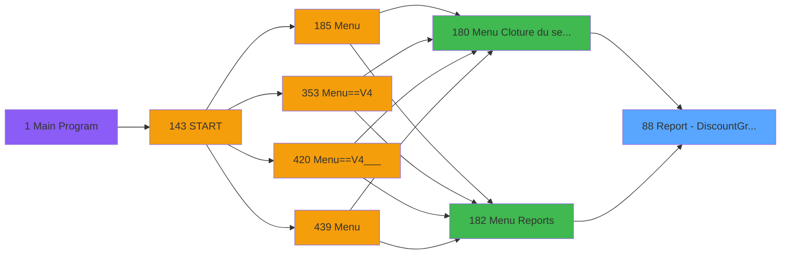
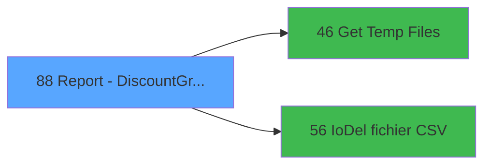

# PVE IDE 88 - Report - Discount&Gratuit-719

> **Analyse**: Phases 1-4 2026-02-03 09:16 -> 09:17 (20s) | Assemblage 09:17
> **Pipeline**: V7.2 Enrichi
> **Structure**: 4 onglets (Resume | Ecrans | Donnees | Connexions)

<!-- TAB:Resume -->

## 1. FICHE D'IDENTITE

| Attribut | Valeur |
|----------|--------|
| Projet | PVE |
| IDE Position | 88 |
| Nom Programme | Report - Discount&Gratuit-719 |
| Fichier source | `Prg_88.xml` |
| Domaine metier | General |
| Taches | 11 (0 ecrans visibles) |
| Tables modifiees | 1 |
| Programmes appeles | 2 |

## 2. DESCRIPTION FONCTIONNELLE

**Report - Discount&Gratuit-719** assure la gestion complete de ce processus, accessible depuis [Menu Cloture du service (IDE 180)](PVE-IDE-180.md), [Menu Reports (IDE 182)](PVE-IDE-182.md).

Le flux de traitement s'organise en **4 blocs fonctionnels** :

- **Traitement** (5 taches) : traitements metier divers
- **Impression** (3 taches) : generation de tickets et documents
- **Calcul** (2 taches) : calculs de montants, stocks ou compteurs
- **Consultation** (1 tache) : ecrans de recherche, selection et consultation

**Donnees modifiees** : 1 tables en ecriture (logement_par_village).

Detail : phases du traitement

#### Phase 1 : Impression (3 taches)

- **88** - Print Discounts **[[ECRAN]](#ecran-t1)**
- **88.1** - Print
- **88.1.1** - Printing

#### Phase 2 : Traitement (5 taches)

- **88.1.1.1** - Discount line **[[ECRAN]](#ecran-t4)**
- **88.1.2.2.1** - Temp generation
- **88.1.2.3** - Temp generation
- **88.1.2.4** - Temp generation
- **88.1.3** - EXISTE Enregistrement

Delegue a : [Get Temp Files (IDE 46)](PVE-IDE-46.md), [IoDel fichier CSV (IDE 56)](PVE-IDE-56.md)

#### Phase 3 : Consultation (1 tache)

- **88.1.2** - SELECTION **[[ECRAN]](#ecran-t5)**

Delegue a : [Get Temp Files (IDE 46)](PVE-IDE-46.md)

#### Phase 4 : Calcul (2 taches)

- **88.1.2.1** - Selection compta
- **88.1.2.2** - Selection compta

#### Tables impactees

| Table | Operations | Role metier |
|-------|-----------|-------------|
| logement_par_village | R/**W**/L (5 usages) |  |

## 3. BLOCS FONCTIONNELS

### 3.1 Impression (3 taches)

Generation des documents et tickets.

---

#### 88 - Print Discounts [[ECRAN]](#ecran-t1)

**Role** : Generation du document : Print Discounts.
**Ecran** : 803 x 317 DLU (MDI) | [Voir mockup](#ecran-t1)

---

#### 88.1 - Print

**Role** : Generation du document : Print.

---

#### 88.1.1 - Printing

**Role** : Generation du document : Printing.

### 3.2 Traitement (5 taches)

Traitements internes.

---

#### 88.1.1.1 - Discount line [[ECRAN]](#ecran-t4)

**Role** : Traitement : Discount line.
**Ecran** : 1107 x 0 DLU (MDI) | [Voir mockup](#ecran-t4)
**Variables liees** : K (P Discount & Free of Charge), V (V Total Discount Gift Pass Ht), W (V Total Discount Gift Pass Ttc), X (V Total Discount Gift Pass Tva)
**Delegue a** : [Get Temp Files (IDE 46)](PVE-IDE-46.md), [IoDel fichier CSV (IDE 56)](PVE-IDE-56.md)

---

#### 88.1.2.2.1 - Temp generation

**Role** : Traitement : Temp generation.
**Delegue a** : [Get Temp Files (IDE 46)](PVE-IDE-46.md), [IoDel fichier CSV (IDE 56)](PVE-IDE-56.md)

---

#### 88.1.2.3 - Temp generation

**Role** : Traitement : Temp generation.
**Delegue a** : [Get Temp Files (IDE 46)](PVE-IDE-46.md), [IoDel fichier CSV (IDE 56)](PVE-IDE-56.md)

---

#### 88.1.2.4 - Temp generation

**Role** : Traitement : Temp generation.
**Delegue a** : [Get Temp Files (IDE 46)](PVE-IDE-46.md), [IoDel fichier CSV (IDE 56)](PVE-IDE-56.md)

---

#### 88.1.3 - EXISTE Enregistrement

**Role** : Traitement : EXISTE Enregistrement.
**Delegue a** : [Get Temp Files (IDE 46)](PVE-IDE-46.md), [IoDel fichier CSV (IDE 56)](PVE-IDE-56.md)

### 3.3 Consultation (1 tache)

Ecrans de recherche et consultation.

---

#### 88.1.2 - SELECTION [[ECRAN]](#ecran-t5)

**Role** : Selection par l'operateur : SELECTION.
**Ecran** : 1194 x 0 DLU (MDI) | [Voir mockup](#ecran-t5)

### 3.4 Calcul (2 taches)

Calculs metier : montants, stocks, compteurs.

---

#### 88.1.2.1 - Selection compta

**Role** : Selection par l'operateur : Selection compta.

---

#### 88.1.2.2 - Selection compta

**Role** : Selection par l'operateur : Selection compta.

## 5. REGLES METIER

*(Aucune regle metier identifiee)*

## 6. CONTEXTE

- **Appele par**: [Menu Cloture du service (IDE 180)](PVE-IDE-180.md), [Menu Reports (IDE 182)](PVE-IDE-182.md)
- **Appelle**: 2 programmes | **Tables**: 14 (W:1 R:4 L:11) | **Taches**: 11 | **Expressions**: 7

<!-- TAB:Ecrans -->

## 8. ECRANS

*(Programme sans ecran visible)*

## 9. NAVIGATION

### 9.3 Structure hierarchique (11 taches)

| Position | Tache | Type | Dimensions | Bloc |
|----------|-------|------|------------|------|
| **88.1** | [**Print Discounts** (88)](#t1) [mockup](#ecran-t1) | MDI | 803x317 | Impression |
| 88.1.1 | [Print (88.1)](#t2) | MDI | - | |
| 88.1.2 | [Printing (88.1.1)](#t3) | MDI | - | |
| **88.2** | [**Discount line** (88.1.1.1)](#t4) [mockup](#ecran-t4) | MDI | 1107x0 | Traitement |
| 88.2.1 | [Temp generation (88.1.2.2.1)](#t8) | MDI | - | |
| 88.2.2 | [Temp generation (88.1.2.3)](#t9) | - | - | |
| 88.2.3 | [Temp generation (88.1.2.4)](#t10) | - | - | |
| 88.2.4 | [EXISTE Enregistrement (88.1.3)](#t11) | - | - | |
| **88.3** | [**SELECTION** (88.1.2)](#t5) [mockup](#ecran-t5) | MDI | 1194x0 | Consultation |
| **88.4** | [**Selection compta** (88.1.2.1)](#t6) | MDI | - | Calcul |
| 88.4.1 | [Selection compta (88.1.2.2)](#t7) | MDI | - | |

### 9.4 Algorigramme

> **Legende**: Vert = START/END OK | Rouge = END KO | Bleu = Decisions
> *Algorigramme auto-genere. Utiliser `/algorigramme` pour une synthese metier detaillee.*

<!-- TAB:Donnees -->

## 10. TABLES

### Tables utilisees (14)

| ID | Nom | Description | Type | R | W | L | Usages |
|----|-----|-------------|------|---|---|---|--------|
| 30 | gm-recherche_____gmr | Index de recherche | DB |   |   | L | 1 |
| 31 | gm-complet_______gmc |  | DB |   |   | L | 1 |
| 38 | comptable_gratuite |  | DB |   |   | L | 1 |
| 379 | pv_customer_temp |  | DB | R |   |   | 1 |
| 386 | ski_frame |  | DB |   |   | L | 1 |
| 403 | pv_sellers |  | DB |   |   | L | 1 |
| 413 | pv_tva |  | DB |   |   | L | 1 |
| 420 | req_dispatch |  | DB |   |   | L | 1 |
| 523 | synthese_garanties | Depots et garanties | TMP | R |   |   | 2 |
| 528 | logement_par_village |  | TMP | R | **W** | L | 5 |
| 763 | pv_inv_stock | Articles et stock | DB | R |   |   | 1 |
| 765 | tranche_age |  | DB |   |   | L | 1 |
| 1468 | Table_1468 |  | MEM |   |   | L | 1 |
| 1471 | Table_1471 |  | MEM |   |   | L | 1 |

### Colonnes par table (4 / 4 tables avec colonnes identifiees)

Table 379 - pv_customer_temp (R) - 1 usages

| Lettre | Variable | Acces | Type |
|--------|----------|-------|------|
| A | v.LabelAafficher | R | Unicode |
| B | v pv_discount_tva | R | Numeric |
| C | v_pv_%_tva | R | Numeric |
| D | V.Regular_price Ht | R | Numeric |
| E | V.Regular_price Ttc | R | Numeric |
| F | V.Regular_price Tva | R | Numeric |
| G | V.Discounted price Ht | R | Numeric |
| H | V.Discounted price Ttc | R | Numeric |
| I | V.Discounted price Tva | R | Numeric |
| J | V.Total CA Ht | R | Numeric |
| K | V.Total CA Ttc | R | Numeric |
| L | V.Total CA Tva | R | Numeric |
| M | V.Total regular HT | R | Numeric |
| N | V.Total regular Ttc | R | Numeric |
| O | V.Total regular Tva | R | Numeric |
| P | V.Total discounted HT | R | Numeric |
| Q | V.Total discounted Ttc | R | Numeric |
| R | V.Total discounted Tva | R | Numeric |
| S | V Total Regular Gift Pass Ht | R | Numeric |
| T | V Total Regular Gift Pass Ttc | R | Numeric |
| U | V Total Regular Gift Pass Tva | R | Numeric |
| V | V Total Discount Gift Pass Ht | R | Numeric |
| W | V Total Discount Gift Pass Ttc | R | Numeric |
| X | V Total Discount Gift Pass Tva | R | Numeric |

Table 523 - synthese_garanties (R) - 2 usages

*Table utilisee uniquement en Link ou aucune colonne Real identifiee dans le DataView.*

Table 528 - logement_par_village (R/**W**/L) - 5 usages

| Lettre | Variable | Acces | Type |
|--------|----------|-------|------|
| A | P. Village name | W | Alpha |

Table 763 - pv_inv_stock (R) - 1 usages

| Lettre | Variable | Acces | Type |
|--------|----------|-------|------|
| A | T.Gratuite | R | Logical |
| B | T.Credit conso | R | Logical |
| C | v.montant taxes | R | Numeric |
| D | v.taxes multiples | R | Logical |

## 11. VARIABLES

### 11.1 Parametres entrants (13)

Variables recues du programme appelant ([Menu Cloture du service (IDE 180)](PVE-IDE-180.md)).

| Lettre | Nom | Type | Usage dans |
|--------|-----|------|-----------|
| A | P. Village name | Alpha | - |
| B | P. Currency | Alpha | - |
| C | P. Amount format | Alpha | - |
| D | P. Amount format sans Z | Alpha | - |
| E | P. Decimales | Numeric | - |
| F | P. HD Contrôle | Logical | - |
| G | P Période nombre JH | Numeric | - |
| H | P Jours Période | Numeric | - |
| I | P Date mini | Date | 4x parametre entrant |
| J | P Date maxi | Date | 5x parametre entrant |
| K | P Discount & Free of Charge | Numeric | - |
| L | P.I Flag Cloture Service | Logical | - |
| M | P.Inclure Giftpass dans grat.? | Logical | - |

### 11.2 Variables de session (11)

Variables persistantes pendant toute la session.

| Lettre | Nom | Type | Usage dans |
|--------|-----|------|-----------|
| N | v.Separateur | Alpha | - |
| O | v.Flag Getparam Extraction | Logical | - |
| P | v.NomFichierPDF | Alpha | - |
| Q | v.NomFichierPDF Archivage | Alpha | - |
| R | v.NomFichierCSV | Alpha | - |
| S | v.NomFichierCSV Archivage | Alpha | - |
| T | V Total Regular Gift Pass Ttc | Numeric | - |
| U | V Total Regular Gift Pass Tva | Numeric | - |
| V | V Total Discount Gift Pass Ht | Numeric | - |
| W | V Total Discount Gift Pass Ttc | Numeric | - |
| X | V Total Discount Gift Pass Tva | Numeric | - |

Toutes les 24 variables (liste complete)

| Cat | Lettre | Nom Variable | Type |
|-----|--------|--------------|------|
| P0 | **A** | P. Village name | Alpha |
| P0 | **B** | P. Currency | Alpha |
| P0 | **C** | P. Amount format | Alpha |
| P0 | **D** | P. Amount format sans Z | Alpha |
| P0 | **E** | P. Decimales | Numeric |
| P0 | **F** | P. HD Contrôle | Logical |
| P0 | **G** | P Période nombre JH | Numeric |
| P0 | **H** | P Jours Période | Numeric |
| P0 | **I** | P Date mini | Date |
| P0 | **J** | P Date maxi | Date |
| P0 | **K** | P Discount & Free of Charge | Numeric |
| P0 | **L** | P.I Flag Cloture Service | Logical |
| P0 | **M** | P.Inclure Giftpass dans grat.? | Logical |
| V. | **N** | v.Separateur | Alpha |
| V. | **O** | v.Flag Getparam Extraction | Logical |
| V. | **P** | v.NomFichierPDF | Alpha |
| V. | **Q** | v.NomFichierPDF Archivage | Alpha |
| V. | **R** | v.NomFichierCSV | Alpha |
| V. | **S** | v.NomFichierCSV Archivage | Alpha |
| V. | **T** | V Total Regular Gift Pass Ttc | Numeric |
| V. | **U** | V Total Regular Gift Pass Tva | Numeric |
| V. | **V** | V Total Discount Gift Pass Ht | Numeric |
| V. | **W** | V Total Discount Gift Pass Ttc | Numeric |
| V. | **X** | V Total Discount Gift Pass Tva | Numeric |

## 12. EXPRESSIONS

**7 / 7 expressions decodees (100%)**

### 12.1 Repartition par type

| Type | Expressions | Regles |
|------|-------------|--------|
| CONDITION | 2 | 0 |
| CONCATENATION | 4 | 0 |
| REFERENCE_VG | 1 | 0 |

### 12.2 Expressions cles par type

#### CONDITION (2 expressions)

| Type | IDE | Expression | Regle |
|------|-----|------------|-------|
| CONDITION | 7 | `GetParam ('Output')='Extraction'` | - |
| CONDITION | 1 | `P Date maxi [J]<>'00/00/0000'DATE` | - |

#### CONCATENATION (4 expressions)

| Type | IDE | Expression | Regle |
|------|-----|------------|-------|
| CONCATENATION | 3 | `Translate ('%club_exportdata%')&Trim (GetParam ('VILLAGECODE'))&Trim (GetParam ('SERVICE'))&'_Total_Discount&FreeOfCharge_'&DStr (P Date mini [I],'YYYYMMDD')&'_'&DStr (P Date maxi [J],'YYYYMMDD')&'.Pdf'` | - |
| CONCATENATION | 4 | `Translate ('%club_exportdata%')&'ArchivagePos\'&
Trim (GetParam ('VILLAGECODE'))&
Trim (GetParam ('SERVICE'))&
'_Total_discount_gratuities_'&
DStr (P Date mini [I],'YYYYMMDD')&'_'&DStr (P Date maxi [J],'YYYYMMDD')&'.Pdf'` | - |
| CONCATENATION | 5 | `Translate('%club_exportdata%')&Trim (GetParam ('VILLAGECODE'))&
Trim (GetParam ('SERVICE'))&
CASE(P Discount & Free of C... [K],1,'_Discount',2,'_FreeOfCharge','_Discount&FreeOfCharge')&
DStr (P Date mini [I],'YYYYMMDD')&'_'&DStr (P Date maxi [J],'YYYYMMDD')&'.csv'` | - |
| CONCATENATION | 6 | `Translate('%club_exportdata%')&'ArchivagePos\'&
Trim (GetParam ('VILLAGECODE'))&
Trim (GetParam ('SERVICE'))&CASE(P Discount & Free of C... [K],1,'_Discount',2,'_FreeOfCharge','_Discount&FreeOfCharge')&
DStr (P Date mini [I],'YYYYMMDD')&'_'&DStr (P Date maxi [J],'YYYYMMDD')&'.csv'` | - |

#### REFERENCE_VG (1 expressions)

| Type | IDE | Expression | Regle |
|------|-----|------------|-------|
| REFERENCE_VG | 2 | `VG37` | - |

<!-- TAB:Connexions -->

## 13. GRAPHE D'APPELS

### 13.1 Chaine depuis Main (Callers)

Main -> ... -> [Menu Cloture du service (IDE 180)](PVE-IDE-180.md) -> **Report - Discount&Gratuit-719 (IDE 88)**

Main -> ... -> [Menu Reports (IDE 182)](PVE-IDE-182.md) -> **Report - Discount&Gratuit-719 (IDE 88)**

### 13.2 Callers

| IDE | Nom Programme | Nb Appels |
|-----|---------------|-----------|
| [180](PVE-IDE-180.md) | Menu Cloture du service | 1 |
| [182](PVE-IDE-182.md) | Menu Reports | 1 |

### 13.3 Callees (programmes appeles)

### 13.4 Detail Callees avec contexte

| IDE | Nom Programme | Appels | Contexte |
|-----|---------------|--------|----------|
| [46](PVE-IDE-46.md) | Get Temp Files | 1 | Recuperation donnees |
| [56](PVE-IDE-56.md) | IoDel fichier CSV | 1 | Sous-programme |

## 14. RECOMMANDATIONS MIGRATION

### 14.1 Profil du programme

| Metrique | Valeur | Impact migration |
|----------|--------|-----------------|
| Lignes de logique | 503 | Programme volumineux |
| Expressions | 7 | Peu de logique |
| Tables WRITE | 1 | Impact faible |
| Sous-programmes | 2 | Peu de dependances |
| Ecrans visibles | 0 | Ecran unique ou traitement batch |
| Code desactive | 0% (0 / 503) | Code sain |
| Regles metier | 0 | Pas de regle identifiee |

### 14.2 Plan de migration par bloc

#### Impression (3 taches: 1 ecran, 2 traitements)

- **Strategie** : Templates HTML -> PDF via wkhtmltopdf ou Puppeteer.
- `PrintService` injectable avec choix imprimante

#### Traitement (5 taches: 1 ecran, 4 traitements)

- **Strategie** : Orchestrateur avec 1 ecrans (Razor/React) et 4 traitements backend (services).
- Les ecrans deviennent des composants UI, les traitements invisibles deviennent des services injectables.
- 2 sous-programme(s) a migrer ou a reutiliser depuis les services existants.
- Decomposer les taches en services unitaires testables.

#### Consultation (1 tache: 1 ecran, 0 traitement)

- **Strategie** : Composants de recherche/selection en modales.
- 1 ecran : SELECTION

#### Calcul (2 taches: 0 ecran, 2 traitements)

- **Strategie** : Services de calcul purs (Domain Services).
- Migrer la logique de calcul (stock, compteurs, montants)

### 14.3 Dependances critiques

| Dependance | Type | Appels | Impact |
|------------|------|--------|--------|
| logement_par_village | Table WRITE (Temp) | 3x | Schema + repository |
| [IoDel fichier CSV (IDE 56)](PVE-IDE-56.md) | Sous-programme | 1x | Normale - Sous-programme |
| [Get Temp Files (IDE 46)](PVE-IDE-46.md) | Sous-programme | 1x | Normale - Recuperation donnees |

---
*Spec DETAILED generee par Pipeline V7.2 - 2026-02-03 09:17*
