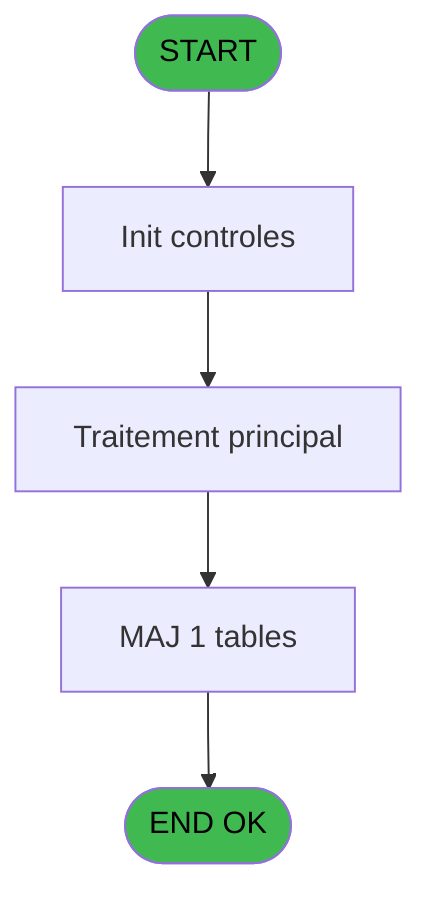
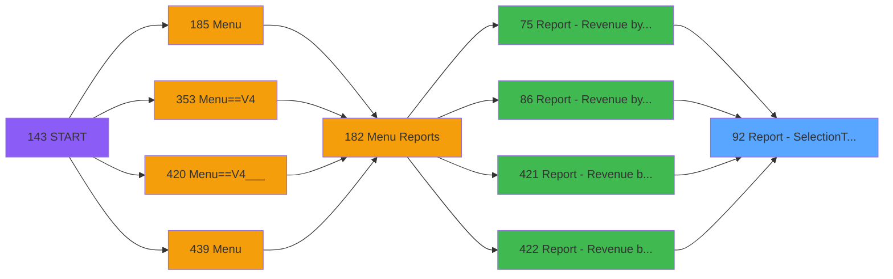

# PVE IDE 92 - Report - Selection/Tempo

> **Analyse**: Phases 1-4 2026-02-03 09:18 -> 09:18 (19s) | Assemblage 09:18
> **Pipeline**: V7.2 Enrichi
> **Structure**: 4 onglets (Resume | Ecrans | Donnees | Connexions)

<!-- TAB:Resume -->

## 1. FICHE D'IDENTITE

| Attribut | Valeur |
|----------|--------|
| Projet | PVE |
| IDE Position | 92 |
| Nom Programme | Report - Selection/Tempo |
| Fichier source | `Prg_92.xml` |
| Domaine metier | Consultation |
| Taches | 7 (0 ecrans visibles) |
| Tables modifiees | 1 |
| Programmes appeles | 0 |

## 2. DESCRIPTION FONCTIONNELLE

**Report - Selection/Tempo** assure la gestion complete de ce processus, accessible depuis [Report - Revenue by Category (IDE 75)](PVE-IDE-75.md), [Report - Revenue by Day (IDE 86)](PVE-IDE-86.md), [Report - Revenue by Place *NU* (IDE 421)](PVE-IDE-421.md), [Report - Revenue by Seller *NU (IDE 422)](PVE-IDE-422.md).

Le flux de traitement s'organise en **3 blocs fonctionnels** :

- **Traitement** (5 taches) : traitements metier divers
- **Consultation** (1 tache) : ecrans de recherche, selection et consultation
- **Calcul** (1 tache) : calculs de montants, stocks ou compteurs

**Donnees modifiees** : 1 tables en ecriture (Table_1461).

**Logique metier** : 1 regles identifiees couvrant conditions metier.

Detail : phases du traitement

#### Phase 1 : Consultation (1 tache)

- **92** - SELECTION **[[ECRAN]](#ecran-t1)**

#### Phase 2 : Calcul (1 tache)

- **92.1** - Selection compta

#### Phase 3 : Traitement (5 taches)

- **92.1.1** - Temp generation
- **92.1.1.1** - Temp generation
- **92.1.2** - Movements
- **92.2** - Temp generation
- **92.2.1** - Temp generation

#### Tables impactees

| Table | Operations | Role metier |
|-------|-----------|-------------|
| Table_1461 | **W** (4 usages) |  |

## 3. BLOCS FONCTIONNELS

### 3.1 Consultation (1 tache)

Ecrans de recherche et consultation.

---

#### 92 - SELECTION [[ECRAN]](#ecran-t1)

**Role** : Selection par l'operateur : SELECTION.
**Ecran** : 278 x 320 DLU (MDI) | [Voir mockup](#ecran-t1)

### 3.2 Calcul (1 tache)

Calculs metier : montants, stocks, compteurs.

---

#### 92.1 - Selection compta

**Role** : Selection par l'operateur : Selection compta.

### 3.3 Traitement (5 taches)

Traitements internes.

---

#### 92.1.1 - Temp generation

**Role** : Traitement : Temp generation.

---

#### 92.1.1.1 - Temp generation

**Role** : Traitement : Temp generation.

---

#### 92.1.2 - Movements

**Role** : Traitement : Movements.

---

#### 92.2 - Temp generation

**Role** : Traitement : Temp generation.

---

#### 92.2.1 - Temp generation

**Role** : Traitement : Temp generation.

## 5. REGLES METIER

1 regles identifiees:

### Autres (1 regles)

#### [RM-001] Traitement si P. D or C or P or L or V [F]='L',[AJ] est renseigne

| Element | Detail |
|---------|--------|
| **Condition** | `P. D or C or P or L or V [F]='L'` |
| **Si vrai** | [AJ]<>'' |
| **Si faux** | IF(P. D or C or P or L or V [F]='V',[AK]<>'','TRUE'LOG)) |
| **Variables** | F (P. D or C or P or L or V) |
| **Expression source** | Expression 8 : `IF(P. D or C or P or L or V [F]='L',[AJ]<>'',IF(P. D or C or` |
| **Exemple** | Si P. D or C or P or L or V [F]='L' → [AJ]<>''. Sinon → IF(P. D or C or P or L or V [F]='V',[AK]<>'','TRUE'LOG)) |

## 6. CONTEXTE

- **Appele par**: [Report - Revenue by Category (IDE 75)](PVE-IDE-75.md), [Report - Revenue by Day (IDE 86)](PVE-IDE-86.md), [Report - Revenue by Place *NU* (IDE 421)](PVE-IDE-421.md), [Report - Revenue by Seller *NU (IDE 422)](PVE-IDE-422.md)
- **Appelle**: 0 programmes | **Tables**: 7 (W:1 R:3 L:4) | **Taches**: 7 | **Expressions**: 18

<!-- TAB:Ecrans -->

## 8. ECRANS

*(Programme sans ecran visible)*

## 9. NAVIGATION

### 9.3 Structure hierarchique (7 taches)

| Position | Tache | Type | Dimensions | Bloc |
|----------|-------|------|------------|------|
| **92.1** | [**SELECTION** (92)](#t1) [mockup](#ecran-t1) | MDI | 278x320 | Consultation |
| **92.2** | [**Selection compta** (92.1)](#t2) | MDI | - | Calcul |
| **92.3** | [**Temp generation** (92.1.1)](#t3) | MDI | - | Traitement |
| 92.3.1 | [Temp generation (92.1.1.1)](#t4) | MDI | - | |
| 92.3.2 | [Movements (92.1.2)](#t5) | MDI | - | |
| 92.3.3 | [Temp generation (92.2)](#t6) | MDI | - | |
| 92.3.4 | [Temp generation (92.2.1)](#t7) | MDI | - | |

### 9.4 Algorigramme

> **Legende**: Vert = START/END OK | Rouge = END KO | Bleu = Decisions
> *Algorigramme auto-genere. Utiliser `/algorigramme` pour une synthese metier detaillee.*

<!-- TAB:Donnees -->

## 10. TABLES

### Tables utilisees (7)

| ID | Nom | Description | Type | R | W | L | Usages |
|----|-----|-------------|------|---|---|---|--------|
| 379 | pv_customer_temp |  | DB | R |   |   | 1 |
| 403 | pv_sellers |  | DB |   |   | L | 1 |
| 413 | pv_tva |  | DB |   |   | L | 1 |
| 523 | synthese_garanties | Depots et garanties | TMP | R |   |   | 1 |
| 762 | pv_mvt_stock_tempo | Table temporaire ecran | DB | R |   | L | 2 |
| 1461 | Table_1461 |  | MEM |   | **W** |   | 4 |
| 1471 | Table_1471 |  | MEM |   |   | L | 1 |

### Colonnes par table (2 / 4 tables avec colonnes identifiees)

Table 379 - pv_customer_temp (R) - 1 usages

| Lettre | Variable | Acces | Type |
|--------|----------|-------|------|
| A | P. Date mini | R | Date |
| B | P. Date Maxi | R | Date |
| C | P. Decimales | R | Numeric |
| D | P. Item selected | R | Logical |
| E | P. Total General | R | Numeric |
| F | P. D or C or P or L or V | R | Alpha |
| G | P. avec Cost | R | Logical |
| H | P. Total Cost | R | Numeric |
| I | P. Total Revenue HT | R | Numeric |
| J | P. Total Revenue TTC | R | Numeric |
| K | P. Total Revenue VAT | R | Numeric |
| L | V Product | R | Numeric |
| M | v.montant taxes | R | Numeric |
| N | v.taxes multiples | R | Logical |

Table 523 - synthese_garanties (R) - 1 usages

*Table utilisee uniquement en Link ou aucune colonne Real identifiee dans le DataView.*

Table 762 - pv_mvt_stock_tempo (R/L) - 2 usages

*Table utilisee uniquement en Link ou aucune colonne Real identifiee dans le DataView.*

Table 1461 - Table_1461 (**W**) - 4 usages

| Lettre | Variable | Acces | Type |
|--------|----------|-------|------|
| A | P(0) Refund | W | Logical |
| B | V Montant HT ou TTC | W | Numeric |
| C | V.Montant HT | W | Numeric |
| D | V.Montant TTC | W | Numeric |
| E | V.Montant VAT | W | Numeric |
| F | V.Montant prepaid HT ou TTC | W | Numeric |
| G | V.Montant prepaid HT | W | Numeric |
| H | V.Montant prepaid TTC | W | Numeric |
| I | V.Montant prepaid VAT | W | Numeric |

## 11. VARIABLES

### 11.1 Parametres entrants (11)

Variables recues du programme appelant ([Report - Revenue by Category (IDE 75)](PVE-IDE-75.md)).

| Lettre | Nom | Type | Usage dans |
|--------|-----|------|-----------|
| A | P. Date mini | Date | 1x parametre entrant |
| B | P. Date Maxi | Date | 1x parametre entrant |
| C | P. Decimales | Numeric | - |
| D | P. Item selected | Logical | - |
| E | P. Total General | Numeric | - |
| F | P. D or C or P or L or V | Alpha | 1x parametre entrant |
| G | P. avec Cost | Logical | - |
| H | P. Total Cost | Numeric | - |
| I | P. Total Revenue HT | Numeric | - |
| J | P. Total Revenue TTC | Numeric | - |
| K | P. Total Revenue VAT | Numeric | - |

### 11.2 Variables de session (3)

Variables persistantes pendant toute la session.

| Lettre | Nom | Type | Usage dans |
|--------|-----|------|-----------|
| L | V Product | Numeric | - |
| M | v.montant taxes | Numeric | - |
| N | v.taxes multiples | Logical | 3x session |

## 12. EXPRESSIONS

**18 / 18 expressions decodees (100%)**

### 12.1 Repartition par type

| Type | Expressions | Regles |
|------|-------------|--------|
| CALCULATION | 1 | 0 |
| CAST_LOGIQUE | 3 | 5 |
| CONSTANTE | 2 | 0 |
| FORMAT | 3 | 0 |
| OTHER | 7 | 0 |
| REFERENCE_VG | 1 | 0 |
| CONDITION | 1 | 0 |

### 12.2 Expressions cles par type

#### CALCULATION (1 expressions)

| Type | IDE | Expression | Regle |
|------|-----|------------|-------|
| CALCULATION | 4 | `[O]*10^4+[P]*100+[Q]` | - |

#### CAST_LOGIQUE (3 expressions)

| Type | IDE | Expression | Regle |
|------|-----|------------|-------|
| CAST_LOGIQUE | 8 | `IF(P. D or C or P or L or V [F]='L',[AJ]<>'',IF(P. D or C or P or L or V [F]='V',[AK]<>'','TRUE'LOG))` | [RM-001](#rm-RM-001) |
| CAST_LOGIQUE | 16 | `'FALSE'LOG` | - |
| CAST_LOGIQUE | 7 | `'TRUE'LOG` | - |

#### CONSTANTE (2 expressions)

| Type | IDE | Expression | Regle |
|------|-----|------------|-------|
| CONSTANTE | 15 | `0` | - |
| CONSTANTE | 13 | `'P'` | - |

#### FORMAT (3 expressions)

| Type | IDE | Expression | Regle |
|------|-----|------------|-------|
| FORMAT | 18 | `Str(v.taxes multiples [N],'10P0')&'=>'&Str([AW],'N9.2')&' '&IF([AX],'OUI','NON')` | - |
| FORMAT | 11 | `DStr(P. Date Maxi [B],'YYYYMMDD')` | - |
| FORMAT | 10 | `DStr(P. Date mini [A],'YYYYMMDD')` | - |

#### OTHER (7 expressions)

| Type | IDE | Expression | Regle |
|------|-----|------------|-------|
| OTHER | 6 | `[AL]` | - |
| OTHER | 9 | `[Q]` | - |
| OTHER | 14 | `v.taxes multiples [N]` | - |
| OTHER | 5 | `v.taxes multiples [N]` | - |
| OTHER | 1 | `GetParam ('SERVICE')` | - |
| ... | | *+2 autres* | |

#### REFERENCE_VG (1 expressions)

| Type | IDE | Expression | Regle |
|------|-----|------------|-------|
| REFERENCE_VG | 17 | `VG113` | - |

#### CONDITION (1 expressions)

| Type | IDE | Expression | Regle |
|------|-----|------------|-------|
| CONDITION | 12 | `Trim([U])<>'GIFT PASS' AND Trim([U])<>'RESORT CREDIT'` | - |

<!-- TAB:Connexions -->

## 13. GRAPHE D'APPELS

### 13.1 Chaine depuis Main (Callers)

Main -> ... -> [Report - Revenue by Category (IDE 75)](PVE-IDE-75.md) -> **Report - Selection/Tempo (IDE 92)**

Main -> ... -> [Report - Revenue by Day (IDE 86)](PVE-IDE-86.md) -> **Report - Selection/Tempo (IDE 92)**

Main -> ... -> [Report - Revenue by Place *NU* (IDE 421)](PVE-IDE-421.md) -> **Report - Selection/Tempo (IDE 92)**

Main -> ... -> [Report - Revenue by Seller *NU (IDE 422)](PVE-IDE-422.md) -> **Report - Selection/Tempo (IDE 92)**

### 13.2 Callers

| IDE | Nom Programme | Nb Appels |
|-----|---------------|-----------|
| [75](PVE-IDE-75.md) | Report - Revenue by Category | 1 |
| [86](PVE-IDE-86.md) | Report - Revenue by Day | 1 |
| [421](PVE-IDE-421.md) | Report - Revenue by Place *NU* | 1 |
| [422](PVE-IDE-422.md) | Report - Revenue by Seller *NU | 1 |

### 13.3 Callees (programmes appeles)

### 13.4 Detail Callees avec contexte

| IDE | Nom Programme | Appels | Contexte |
|-----|---------------|--------|----------|
| - | (aucun) | - | - |

## 14. RECOMMANDATIONS MIGRATION

### 14.1 Profil du programme

| Metrique | Valeur | Impact migration |
|----------|--------|-----------------|
| Lignes de logique | 369 | Taille moyenne |
| Expressions | 18 | Peu de logique |
| Tables WRITE | 1 | Impact faible |
| Sous-programmes | 0 | Peu de dependances |
| Ecrans visibles | 0 | Ecran unique ou traitement batch |
| Code desactive | 3.5% (13 / 369) | Code sain |
| Regles metier | 1 | Quelques regles a preserver |

### 14.2 Plan de migration par bloc

#### Consultation (1 tache: 1 ecran, 0 traitement)

- **Strategie** : Composants de recherche/selection en modales.
- 1 ecran : SELECTION

#### Calcul (1 tache: 0 ecran, 1 traitement)

- **Strategie** : Services de calcul purs (Domain Services).
- Migrer la logique de calcul (stock, compteurs, montants)

#### Traitement (5 taches: 0 ecran, 5 traitements)

- **Strategie** : 5 service(s) backend injectable(s) (Domain Services).
- Decomposer les taches en services unitaires testables.

### 14.3 Dependances critiques

| Dependance | Type | Appels | Impact |
|------------|------|--------|--------|
| Table_1461 | Table WRITE (Memory) | 4x | Schema + repository |

---
*Spec DETAILED generee par Pipeline V7.2 - 2026-02-03 09:18*
