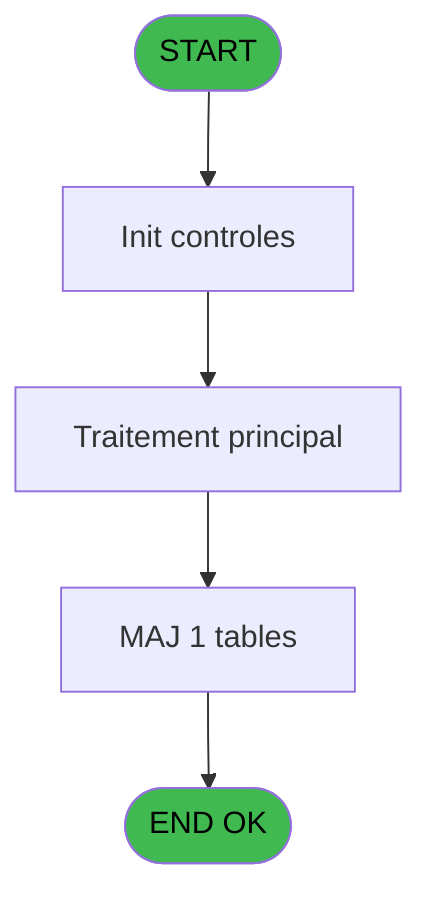
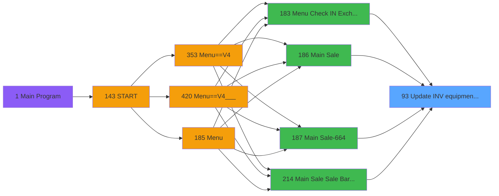

# PVE IDE 93 - Update INV equipment status

> **Analyse**: Phases 1-4 2026-02-03 09:19 -> 09:19 (19s) | Assemblage 09:19
> **Pipeline**: V7.2 Enrichi
> **Structure**: 4 onglets (Resume | Ecrans | Donnees | Connexions)

<!-- TAB:Resume -->

## 1. FICHE D'IDENTITE

| Attribut | Valeur |
|----------|--------|
| Projet | PVE |
| IDE Position | 93 |
| Nom Programme | Update INV equipment status |
| Fichier source | `Prg_93.xml` |
| Domaine metier | General |
| Taches | 1 (0 ecrans visibles) |
| Tables modifiees | 1 |
| Programmes appeles | 0 |

## 2. DESCRIPTION FONCTIONNELLE

**Update INV equipment status** assure la gestion complete de ce processus, accessible depuis [Main Sale (IDE 186)](PVE-IDE-186.md), [Main Sale-664 (IDE 187)](PVE-IDE-187.md), [Main Sale Sale Bar Code (IDE 214)](PVE-IDE-214.md), [Main Sale (IDE 363)](PVE-IDE-363.md), [Main Sale-664 (IDE 364)](PVE-IDE-364.md), [Main Sale (IDE 440)](PVE-IDE-440.md), [Main Sale ===V4 Booking ACTUEL (IDE 417)](PVE-IDE-417.md), [Main Sale ===V4 (IDE 0)](PVE-IDE-0.md), [Main Sale ===V4 bck (IDE 352)](PVE-IDE-352.md), [Main Sale ===V4 (IDE 354)](PVE-IDE-354.md), [Main Sale ===V4 (IDE 359)](PVE-IDE-359.md), [Menu Main (TPE) (IDE 403)](PVE-IDE-403.md), [Main Sale ===V4 (IDE 409)](PVE-IDE-409.md), [Main Sale ===V4 (IDE 415)](PVE-IDE-415.md), [Menu Check IN / Exchange (IDE 183)](PVE-IDE-183.md), [Menu Check IN / Exchange V4 (IDE 401)](PVE-IDE-401.md), [Menu Check IN / Exchange (IDE 410)](PVE-IDE-410.md).

Le flux de traitement s'organise en **1 blocs fonctionnels** :

- **Traitement** (1 tache) : traitements metier divers

**Donnees modifiees** : 1 tables en ecriture (pv_equipment_inventory).

## 3. BLOCS FONCTIONNELS

### 3.1 Traitement (1 tache)

Traitements internes.

---

#### 93 - update equipment status

**Role** : Traitement : update equipment status.
**Variables liees** : B (p.status)

## 5. REGLES METIER

*(Aucune regle metier identifiee)*

## 6. CONTEXTE

- **Appele par**: [Main Sale (IDE 186)](PVE-IDE-186.md), [Main Sale-664 (IDE 187)](PVE-IDE-187.md), [Main Sale Sale Bar Code (IDE 214)](PVE-IDE-214.md), [Main Sale (IDE 363)](PVE-IDE-363.md), [Main Sale-664 (IDE 364)](PVE-IDE-364.md), [Main Sale (IDE 440)](PVE-IDE-440.md), [Main Sale ===V4 Booking ACTUEL (IDE 417)](PVE-IDE-417.md), [Main Sale ===V4 (IDE 0)](PVE-IDE-0.md), [Main Sale ===V4 bck (IDE 352)](PVE-IDE-352.md), [Main Sale ===V4 (IDE 354)](PVE-IDE-354.md), [Main Sale ===V4 (IDE 359)](PVE-IDE-359.md), [Menu Main (TPE) (IDE 403)](PVE-IDE-403.md), [Main Sale ===V4 (IDE 409)](PVE-IDE-409.md), [Main Sale ===V4 (IDE 415)](PVE-IDE-415.md), [Menu Check IN / Exchange (IDE 183)](PVE-IDE-183.md), [Menu Check IN / Exchange V4 (IDE 401)](PVE-IDE-401.md), [Menu Check IN / Exchange (IDE 410)](PVE-IDE-410.md)
- **Appelle**: 0 programmes | **Tables**: 1 (W:1 R:0 L:0) | **Taches**: 1 | **Expressions**: 6

<!-- TAB:Ecrans -->

## 8. ECRANS

*(Programme sans ecran visible)*

## 9. NAVIGATION

### 9.3 Structure hierarchique (1 tache)

| Position | Tache | Type | Dimensions | Bloc |
|----------|-------|------|------------|------|
| **93.1** | [**update equipment status** (93)](#t1) | MDI | - | Traitement |

### 9.4 Algorigramme

> **Legende**: Vert = START/END OK | Rouge = END KO | Bleu = Decisions
> *Algorigramme auto-genere. Utiliser `/algorigramme` pour une synthese metier detaillee.*

<!-- TAB:Donnees -->

## 10. TABLES

### Tables utilisees (1)

| ID | Nom | Description | Type | R | W | L | Usages |
|----|-----|-------------|------|---|---|---|--------|
| 389 | pv_equipment_inventory |  | DB |   | **W** |   | 1 |

### Colonnes par table (1 / 1 tables avec colonnes identifiees)

Table 389 - pv_equipment_inventory (**W**) - 1 usages

| Lettre | Variable | Acces | Type |
|--------|----------|-------|------|
| A | p.serial | W | Alpha |
| B | p.status | W | Alpha |

## 11. VARIABLES

### 11.1 Parametres entrants (2)

Variables recues du programme appelant ([Main Sale (IDE 186)](PVE-IDE-186.md)).

| Lettre | Nom | Type | Usage dans |
|--------|-----|------|-----------|
| A | p.serial | Alpha | 1x parametre entrant |
| B | p.status | Alpha | 1x parametre entrant |

## 12. EXPRESSIONS

**6 / 6 expressions decodees (100%)**

### 12.1 Repartition par type

| Type | Expressions | Regles |
|------|-------------|--------|
| DATE | 1 | 0 |
| OTHER | 4 | 0 |
| REFERENCE_VG | 1 | 0 |

### 12.2 Expressions cles par type

#### DATE (1 expressions)

| Type | IDE | Expression | Regle |
|------|-----|------------|-------|
| DATE | 4 | `Date ()` | - |

#### OTHER (4 expressions)

| Type | IDE | Expression | Regle |
|------|-----|------------|-------|
| OTHER | 3 | `p.status [B]` | - |
| OTHER | 5 | `Time ()` | - |
| OTHER | 1 | `GetParam ('SERVICE')` | - |
| OTHER | 2 | `p.serial [A]` | - |

#### REFERENCE_VG (1 expressions)

| Type | IDE | Expression | Regle |
|------|-----|------------|-------|
| REFERENCE_VG | 6 | `VG1` | - |

<!-- TAB:Connexions -->

## 13. GRAPHE D'APPELS

### 13.1 Chaine depuis Main (Callers)

Main -> ... -> [Main Sale (IDE 186)](PVE-IDE-186.md) -> **Update INV equipment status (IDE 93)**

Main -> ... -> [Main Sale-664 (IDE 187)](PVE-IDE-187.md) -> **Update INV equipment status (IDE 93)**

Main -> ... -> [Main Sale Sale Bar Code (IDE 214)](PVE-IDE-214.md) -> **Update INV equipment status (IDE 93)**

Main -> ... -> [Main Sale (IDE 363)](PVE-IDE-363.md) -> **Update INV equipment status (IDE 93)**

Main -> ... -> [Main Sale-664 (IDE 364)](PVE-IDE-364.md) -> **Update INV equipment status (IDE 93)**

Main -> ... -> [Main Sale (IDE 440)](PVE-IDE-440.md) -> **Update INV equipment status (IDE 93)**

Main -> ... -> [Main Sale ===V4 Booking ACTUEL (IDE 417)](PVE-IDE-417.md) -> **Update INV equipment status (IDE 93)**

Main -> ... -> [Main Sale ===V4 (IDE 0)](PVE-IDE-0.md) -> **Update INV equipment status (IDE 93)**

Main -> ... -> [Main Sale ===V4 bck (IDE 352)](PVE-IDE-352.md) -> **Update INV equipment status (IDE 93)**

Main -> ... -> [Main Sale ===V4 (IDE 354)](PVE-IDE-354.md) -> **Update INV equipment status (IDE 93)**

Main -> ... -> [Main Sale ===V4 (IDE 359)](PVE-IDE-359.md) -> **Update INV equipment status (IDE 93)**

Main -> ... -> [Menu Main (TPE) (IDE 403)](PVE-IDE-403.md) -> **Update INV equipment status (IDE 93)**

Main -> ... -> [Main Sale ===V4 (IDE 409)](PVE-IDE-409.md) -> **Update INV equipment status (IDE 93)**

Main -> ... -> [Main Sale ===V4 (IDE 415)](PVE-IDE-415.md) -> **Update INV equipment status (IDE 93)**

Main -> ... -> [Menu Check IN / Exchange (IDE 183)](PVE-IDE-183.md) -> **Update INV equipment status (IDE 93)**

Main -> ... -> [Menu Check IN / Exchange V4 (IDE 401)](PVE-IDE-401.md) -> **Update INV equipment status (IDE 93)**

Main -> ... -> [Menu Check IN / Exchange (IDE 410)](PVE-IDE-410.md) -> **Update INV equipment status (IDE 93)**

### 13.2 Callers

| IDE | Nom Programme | Nb Appels |
|-----|---------------|-----------|
| [186](PVE-IDE-186.md) | Main Sale | 7 |
| [187](PVE-IDE-187.md) | Main Sale-664 | 7 |
| [214](PVE-IDE-214.md) | Main Sale Sale Bar Code | 6 |
| [363](PVE-IDE-363.md) | Main Sale | 6 |
| [364](PVE-IDE-364.md) | Main Sale-664 | 6 |
| [440](PVE-IDE-440.md) | Main Sale | 6 |
| [417](PVE-IDE-417.md) | Main Sale ===V4 Booking ACTUEL | 5 |
| [0](PVE-IDE-0.md) | Main Sale ===V4 | 4 |
| [352](PVE-IDE-352.md) | Main Sale ===V4 bck | 4 |
| [354](PVE-IDE-354.md) | Main Sale ===V4 | 4 |
| [359](PVE-IDE-359.md) | Main Sale ===V4 | 4 |
| [403](PVE-IDE-403.md) | Menu Main (TPE) | 4 |
| [409](PVE-IDE-409.md) | Main Sale ===V4 | 4 |
| [415](PVE-IDE-415.md) | Main Sale ===V4 | 4 |
| [183](PVE-IDE-183.md) | Menu Check IN / Exchange | 3 |
| [401](PVE-IDE-401.md) | Menu Check IN / Exchange V4 | 3 |
| [410](PVE-IDE-410.md) | Menu Check IN / Exchange | 3 |

### 13.3 Callees (programmes appeles)

### 13.4 Detail Callees avec contexte

| IDE | Nom Programme | Appels | Contexte |
|-----|---------------|--------|----------|
| - | (aucun) | - | - |

## 14. RECOMMANDATIONS MIGRATION

### 14.1 Profil du programme

| Metrique | Valeur | Impact migration |
|----------|--------|-----------------|
| Lignes de logique | 14 | Programme compact |
| Expressions | 6 | Peu de logique |
| Tables WRITE | 1 | Impact faible |
| Sous-programmes | 0 | Peu de dependances |
| Ecrans visibles | 0 | Ecran unique ou traitement batch |
| Code desactive | 0% (0 / 14) | Code sain |
| Regles metier | 0 | Pas de regle identifiee |

### 14.2 Plan de migration par bloc

#### Traitement (1 tache: 0 ecran, 1 traitement)

- **Strategie** : 1 service(s) backend injectable(s) (Domain Services).
- Decomposer les taches en services unitaires testables.

### 14.3 Dependances critiques

| Dependance | Type | Appels | Impact |
|------------|------|--------|--------|
| pv_equipment_inventory | Table WRITE (Database) | 1x | Schema + repository |

---
*Spec DETAILED generee par Pipeline V7.2 - 2026-02-03 09:19*
