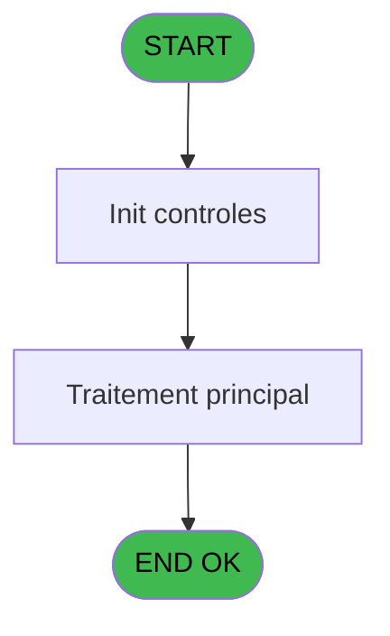

# PVE IDE 94 - Calcul - skier type

> **Analyse**: Phases 1-4 2026-02-03 09:19 -> 09:19 (20s) | Assemblage 09:19
> **Pipeline**: V7.2 Enrichi
> **Structure**: 4 onglets (Resume | Ecrans | Donnees | Connexions)

<!-- TAB:Resume -->

## 1. FICHE D'IDENTITE

| Attribut | Valeur |
|----------|--------|
| Projet | PVE |
| IDE Position | 94 |
| Nom Programme | Calcul - skier type |
| Fichier source | `Prg_94.xml` |
| Domaine metier | General |
| Taches | 2 (0 ecrans visibles) |
| Tables modifiees | 0 |
| Programmes appeles | 0 |
| :warning: Statut | **ORPHELIN_POTENTIEL** |

## 2. DESCRIPTION FONCTIONNELLE

**Calcul - skier type** assure la gestion complete de ce processus.

Le flux de traitement s'organise en **1 blocs fonctionnels** :

- **Traitement** (2 taches) : traitements metier divers

**Logique metier** : 1 regles identifiees couvrant conditions metier.

## 3. BLOCS FONCTIONNELS

### 3.1 Traitement (2 taches)

Traitements internes.

---

#### 94 - Weight ranges [[ECRAN]](#ecran-t1)

**Role** : Traitement : Weight ranges.
**Ecran** : 780 x 320 DLU (MDI) | [Voir mockup](#ecran-t1)
**Variables liees** : A (p.i.Weight)

---

#### 94.1 - GET skier code

**Role** : Consultation/chargement : GET skier code.
**Variables liees** : D (p.i.Skier type), E (p.o.Skier code)

## 5. REGLES METIER

1 regles identifiees:

### Autres (1 regles)

#### [RM-001] Si [K]=[P] alors [I] sinon IF ([K]>[P],[N],[I]))

| Element | Detail |
|---------|--------|
| **Condition** | `[K]=[P]` |
| **Si vrai** | [I] |
| **Si faux** | IF ([K]>[P],[N],[I])) |
| **Expression source** | Expression 4 : `IF ([K]=[P],[I],IF ([K]>[P],[N],[I]))` |
| **Exemple** | Si [K]=[P] → [I]. Sinon → IF ([K]>[P],[N],[I])) |

## 6. CONTEXTE

- **Appele par**: (aucun)
- **Appelle**: 0 programmes | **Tables**: 1 (W:0 R:1 L:0) | **Taches**: 2 | **Expressions**: 12

<!-- TAB:Ecrans -->

## 8. ECRANS

*(Programme sans ecran visible)*

## 9. NAVIGATION

### 9.3 Structure hierarchique (2 taches)

| Position | Tache | Type | Dimensions | Bloc |
|----------|-------|------|------------|------|
| **94.1** | [**Weight ranges** (94)](#t1) [mockup](#ecran-t1) | MDI | 780x320 | Traitement |
| 94.1.1 | [GET skier code (94.1)](#t2) | MDI | - | |

### 9.4 Algorigramme

> **Legende**: Vert = START/END OK | Rouge = END KO | Bleu = Decisions
> *Algorigramme auto-genere. Utiliser `/algorigramme` pour une synthese metier detaillee.*

<!-- TAB:Donnees -->

## 10. TABLES

### Tables utilisees (1)

| ID | Nom | Description | Type | R | W | L | Usages |
|----|-----|-------------|------|---|---|---|--------|
| 375 | pv_cat |  | DB | R |   |   | 2 |

### Colonnes par table (1 / 1 tables avec colonnes identifiees)

Table 375 - pv_cat (R) - 2 usages

| Lettre | Variable | Acces | Type |
|--------|----------|-------|------|
| A | p.i.Weight | R | Alpha |
| B | p.i.Height | R | Alpha |
| C | p.i.Age | R | Numeric |
| D | p.i.Skier type | R | Alpha |
| E | p.o.Skier code | R | Alpha |
| F | v.order | R | Numeric |

## 11. VARIABLES

### 11.1 Parametres entrants (5)

Variables recues en parametre.

| Lettre | Nom | Type | Usage dans |
|--------|-----|------|-----------|
| A | p.i.Weight | Alpha | 1x parametre entrant |
| B | p.i.Height | Alpha | 1x parametre entrant |
| C | p.i.Age | Numeric | 2x parametre entrant |
| D | p.i.Skier type | Alpha | 3x parametre entrant |
| E | p.o.Skier code | Alpha | - |

### 11.2 Variables de session (1)

Variables persistantes pendant toute la session.

| Lettre | Nom | Type | Usage dans |
|--------|-----|------|-----------|
| F | v.order | Numeric | 3x session |

## 12. EXPRESSIONS

**12 / 12 expressions decodees (100%)**

### 12.1 Repartition par type

| Type | Expressions | Regles |
|------|-------------|--------|
| CALCULATION | 3 | 0 |
| CONDITION | 6 | 5 |
| OTHER | 3 | 0 |

### 12.2 Expressions cles par type

#### CALCULATION (3 expressions)

| Type | IDE | Expression | Regle |
|------|-----|------------|-------|
| CALCULATION | 10 | `v.order [F]-1` | - |
| CALCULATION | 8 | `v.order [F]+2` | - |
| CALCULATION | 5 | `v.order [F]+1` | - |

#### CONDITION (6 expressions)

| Type | IDE | Expression | Regle |
|------|-----|------------|-------|
| CONDITION | 4 | `IF ([K]=[P],[I],IF ([K]>[P],[N],[I]))` | [RM-001](#rm-RM-001) |
| CONDITION | 11 | `p.i.Age [C]>49` | - |
| CONDITION | 12 | `p.i.Age [C]<10` | - |
| CONDITION | 9 | `p.i.Skier type [D]='III' AND [K]>'C'` | - |
| CONDITION | 6 | `p.i.Skier type [D]='II'` | - |
| ... | | *+1 autres* | |

#### OTHER (3 expressions)

| Type | IDE | Expression | Regle |
|------|-----|------------|-------|
| OTHER | 3 | `p.i.Height [B]` | - |
| OTHER | 2 | `p.i.Weight [A]` | - |
| OTHER | 1 | `GetParam ('SERVICE')` | - |

<!-- TAB:Connexions -->

## 13. GRAPHE D'APPELS

### 13.1 Chaine depuis Main (Callers)

**Chemin**: (pas de callers directs)

### 13.2 Callers

| IDE | Nom Programme | Nb Appels |
|-----|---------------|-----------|
| - | (aucun) | - |

### 13.3 Callees (programmes appeles)

### 13.4 Detail Callees avec contexte

| IDE | Nom Programme | Appels | Contexte |
|-----|---------------|--------|----------|
| - | (aucun) | - | - |

## 14. RECOMMANDATIONS MIGRATION

### 14.1 Profil du programme

| Metrique | Valeur | Impact migration |
|----------|--------|-----------------|
| Lignes de logique | 46 | Programme compact |
| Expressions | 12 | Peu de logique |
| Tables WRITE | 0 | Impact faible |
| Sous-programmes | 0 | Peu de dependances |
| Ecrans visibles | 0 | Ecran unique ou traitement batch |
| Code desactive | 0% (0 / 46) | Code sain |
| Regles metier | 1 | Quelques regles a preserver |

### 14.2 Plan de migration par bloc

#### Traitement (2 taches: 1 ecran, 1 traitement)

- **Strategie** : Orchestrateur avec 1 ecrans (Razor/React) et 1 traitements backend (services).
- Les ecrans deviennent des composants UI, les traitements invisibles deviennent des services injectables.
- Decomposer les taches en services unitaires testables.

### 14.3 Dependances critiques

| Dependance | Type | Appels | Impact |
|------------|------|--------|--------|

---
*Spec DETAILED generee par Pipeline V7.2 - 2026-02-03 09:19*
