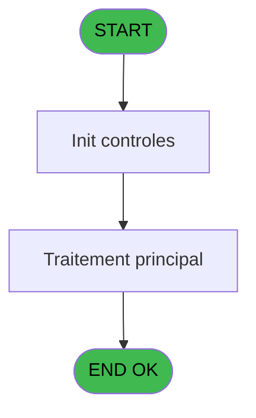
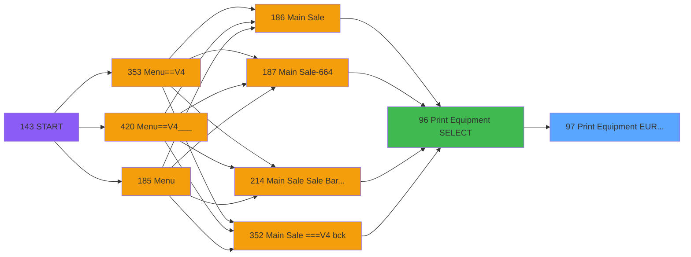

# PVE IDE 97 - Print Equipment EUR/ASIE

> **Analyse**: Phases 1-4 2026-02-03 09:21 -> 09:21 (21s) | Assemblage 09:21
> **Pipeline**: V7.2 Enrichi
> **Structure**: 4 onglets (Resume | Ecrans | Donnees | Connexions)

<!-- TAB:Resume -->

## 1. FICHE D'IDENTITE

| Attribut | Valeur |
|----------|--------|
| Projet | PVE |
| IDE Position | 97 |
| Nom Programme | Print Equipment EUR/ASIE |
| Fichier source | `Prg_97.xml` |
| Domaine metier | Impression |
| Taches | 4 (0 ecrans visibles) |
| Tables modifiees | 0 |
| Programmes appeles | 0 |

## 2. DESCRIPTION FONCTIONNELLE

**Print Equipment EUR/ASIE** assure la gestion complete de ce processus, accessible depuis [Print Equipment SELECT (IDE 96)](PVE-IDE-96.md).

Le flux de traitement s'organise en **2 blocs fonctionnels** :

- **Traitement** (2 taches) : traitements metier divers
- **Impression** (2 taches) : generation de tickets et documents

Detail : phases du traitement

#### Phase 1 : Impression (2 taches)

- **97** - Print Invoice **[[ECRAN]](#ecran-t1)**
- **97.2** - EDITION

#### Phase 2 : Traitement (2 taches)

- **97.1** - PARAMETERS
- **97.2.1** - Ski Shoes Name **[[ECRAN]](#ecran-t4)**

## 3. BLOCS FONCTIONNELS

### 3.1 Impression (2 taches)

Generation des documents et tickets.

---

#### 97 - Print Invoice [[ECRAN]](#ecran-t1)

**Role** : Generation du document : Print Invoice.
**Ecran** : 640 x 0 DLU (MDI) | [Voir mockup](#ecran-t1)
**Variables liees** : I (PrintAgainExecution), J (PrintAgainPreview), K (PrintAgainCopy)

---

#### 97.2 - EDITION

**Role** : Generation du document : EDITION.

### 3.2 Traitement (2 taches)

Traitements internes.

---

#### 97.1 - PARAMETERS

**Role** : Traitement : PARAMETERS.

---

#### 97.2.1 - Ski Shoes Name [[ECRAN]](#ecran-t4)

**Role** : Traitement : Ski Shoes Name.
**Ecran** : 920 x 0 DLU (MDI) | [Voir mockup](#ecran-t4)

## 5. REGLES METIER

*(Aucune regle metier identifiee)*

## 6. CONTEXTE

- **Appele par**: [Print Equipment SELECT (IDE 96)](PVE-IDE-96.md)
- **Appelle**: 0 programmes | **Tables**: 6 (W:0 R:2 L:4) | **Taches**: 4 | **Expressions**: 13

<!-- TAB:Ecrans -->

## 8. ECRANS

*(Programme sans ecran visible)*

## 9. NAVIGATION

### 9.3 Structure hierarchique (4 taches)

| Position | Tache | Type | Dimensions | Bloc |
|----------|-------|------|------------|------|
| **97.1** | [**Print Invoice** (97)](#t1) [mockup](#ecran-t1) | MDI | 640x0 | Impression |
| 97.1.1 | [EDITION (97.2)](#t3) | MDI | - | |
| **97.2** | [**PARAMETERS** (97.1)](#t2) | MDI | - | Traitement |
| 97.2.1 | [Ski Shoes Name (97.2.1)](#t4) [mockup](#ecran-t4) | MDI | 920x0 | |

### 9.4 Algorigramme

> **Legende**: Vert = START/END OK | Rouge = END KO | Bleu = Decisions
> *Algorigramme auto-genere. Utiliser `/algorigramme` pour une synthese metier detaillee.*

<!-- TAB:Donnees -->

## 10. TABLES

### Tables utilisees (6)

| ID | Nom | Description | Type | R | W | L | Usages |
|----|-----|-------------|------|---|---|---|--------|
| 31 | gm-complet_______gmc |  | DB | R |   |   | 1 |
| 34 | hebergement______heb | Hebergement (chambres) | DB | R |   |   | 1 |
| 382 | pv_discount_reasons |  | DB |   |   | L | 1 |
| 404 | pv_sellers_by_week |  | DB |   |   | L | 1 |
| 419 | realise_articles_caution | Articles et stock | DB |   |   | L | 1 |
| 533 | cumul_mvt_stock_histo | Articles et stock | TMP |   |   | L | 1 |

### Colonnes par table (1 / 2 tables avec colonnes identifiees)

Table 31 - gm-complet_______gmc (R) - 1 usages

*Table utilisee uniquement en Link ou aucune colonne Real identifiee dans le DataView.*

Table 34 - hebergement______heb (R) - 1 usages

*Table utilisee uniquement en Link ou aucune colonne Real identifiee dans le DataView.*

## 11. VARIABLES

### 11.1 Autres (22)

Variables diverses.

| Lettre | Nom | Type | Usage dans |
|--------|-----|------|-----------|
| A | Param XcustId | Numeric | - |
| B | Param All Account | Logical | - |
| C | Param All Société | Alpha | - |
| D | Param All Compte | Numeric | - |
| E | VillageCode | Alpha | - |
| F | AmountFormat | Alpha | 1x refs |
| G | VatValue | Numeric | 1x refs |
| H | Currency | Alpha | 1x refs |
| I | PrintAgainExecution | Logical | - |
| J | PrintAgainPreview | Logical | - |
| K | PrintAgainCopy | Numeric | - |
| L | ExistHistoric | Logical | - |
| M | HeaderLine01 | Alpha | 1x refs |
| N | HeaderLine02 | Alpha | 1x refs |
| O | HeaderLine03 | Alpha | 1x refs |
| P | HeaderLine04 | Alpha | 1x refs |
| Q | HeaderLine05 | Alpha | 1x refs |
| R | HeaderLine06 | Alpha | 1x refs |
| S | HeaderLine07 | Alpha | 1x refs |
| T | HeaderLine08 | Alpha | 1x refs |
| U | HeaderLine09 | Alpha | 1x refs |
| V | HeaderLine10 | Alpha | 1x refs |

Toutes les 22 variables (liste complete)

| Cat | Lettre | Nom Variable | Type |
|-----|--------|--------------|------|
| Autre | **A** | Param XcustId | Numeric |
| Autre | **B** | Param All Account | Logical |
| Autre | **C** | Param All Société | Alpha |
| Autre | **D** | Param All Compte | Numeric |
| Autre | **E** | VillageCode | Alpha |
| Autre | **F** | AmountFormat | Alpha |
| Autre | **G** | VatValue | Numeric |
| Autre | **H** | Currency | Alpha |
| Autre | **I** | PrintAgainExecution | Logical |
| Autre | **J** | PrintAgainPreview | Logical |
| Autre | **K** | PrintAgainCopy | Numeric |
| Autre | **L** | ExistHistoric | Logical |
| Autre | **M** | HeaderLine01 | Alpha |
| Autre | **N** | HeaderLine02 | Alpha |
| Autre | **O** | HeaderLine03 | Alpha |
| Autre | **P** | HeaderLine04 | Alpha |
| Autre | **Q** | HeaderLine05 | Alpha |
| Autre | **R** | HeaderLine06 | Alpha |
| Autre | **S** | HeaderLine07 | Alpha |
| Autre | **T** | HeaderLine08 | Alpha |
| Autre | **U** | HeaderLine09 | Alpha |
| Autre | **V** | HeaderLine10 | Alpha |

## 12. EXPRESSIONS

**13 / 13 expressions decodees (100%)**

### 12.1 Repartition par type

| Type | Expressions | Regles |
|------|-------------|--------|
| CALCULATION | 1 | 0 |
| OTHER | 12 | 0 |

### 12.2 Expressions cles par type

#### CALCULATION (1 expressions)

| Type | IDE | Expression | Regle |
|------|-----|------------|-------|
| CALCULATION | 2 | `1*GetParam ('VATVALUE')` | - |

#### OTHER (12 expressions)

| Type | IDE | Expression | Regle |
|------|-----|------------|-------|
| OTHER | 10 | `GetParam ('HEADERLINE07')` | - |
| OTHER | 9 | `GetParam ('HEADERLINE06')` | - |
| OTHER | 8 | `GetParam ('HEADERLINE05')` | - |
| OTHER | 13 | `GetParam ('HEADERLINE10')` | - |
| OTHER | 12 | `GetParam ('HEADERLINE09')` | - |
| ... | | *+7 autres* | |

<!-- TAB:Connexions -->

## 13. GRAPHE D'APPELS

### 13.1 Chaine depuis Main (Callers)

Main -> ... -> [Print Equipment SELECT (IDE 96)](PVE-IDE-96.md) -> **Print Equipment EUR/ASIE (IDE 97)**

### 13.2 Callers

| IDE | Nom Programme | Nb Appels |
|-----|---------------|-----------|
| [96](PVE-IDE-96.md) | Print Equipment SELECT | 1 |

### 13.3 Callees (programmes appeles)

### 13.4 Detail Callees avec contexte

| IDE | Nom Programme | Appels | Contexte |
|-----|---------------|--------|----------|
| - | (aucun) | - | - |

## 14. RECOMMANDATIONS MIGRATION

### 14.1 Profil du programme

| Metrique | Valeur | Impact migration |
|----------|--------|-----------------|
| Lignes de logique | 98 | Programme compact |
| Expressions | 13 | Peu de logique |
| Tables WRITE | 0 | Impact faible |
| Sous-programmes | 0 | Peu de dependances |
| Ecrans visibles | 0 | Ecran unique ou traitement batch |
| Code desactive | 0% (0 / 98) | Code sain |
| Regles metier | 0 | Pas de regle identifiee |

### 14.2 Plan de migration par bloc

#### Impression (2 taches: 1 ecran, 1 traitement)

- **Strategie** : Templates HTML -> PDF via wkhtmltopdf ou Puppeteer.
- `PrintService` injectable avec choix imprimante

#### Traitement (2 taches: 1 ecran, 1 traitement)

- **Strategie** : Orchestrateur avec 1 ecrans (Razor/React) et 1 traitements backend (services).
- Les ecrans deviennent des composants UI, les traitements invisibles deviennent des services injectables.
- Decomposer les taches en services unitaires testables.

### 14.3 Dependances critiques

| Dependance | Type | Appels | Impact |
|------------|------|--------|--------|

---
*Spec DETAILED generee par Pipeline V7.2 - 2026-02-03 09:21*
