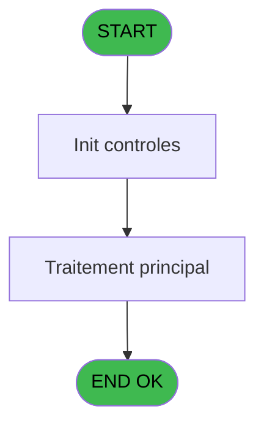
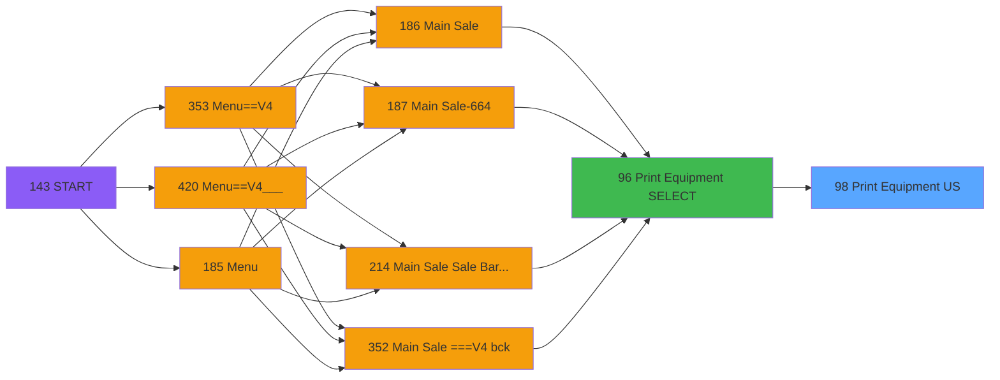

# PVE IDE 98 - Print Equipment US

> **Analyse**: Phases 1-4 2026-02-03 09:21 -> 09:21 (20s) | Assemblage 09:21
> **Pipeline**: V7.2 Enrichi
> **Structure**: 4 onglets (Resume | Ecrans | Donnees | Connexions)

<!-- TAB:Resume -->

## 1. FICHE D'IDENTITE

| Attribut | Valeur |
|----------|--------|
| Projet | PVE |
| IDE Position | 98 |
| Nom Programme | Print Equipment US |
| Fichier source | `Prg_98.xml` |
| Domaine metier | Impression |
| Taches | 3 (0 ecrans visibles) |
| Tables modifiees | 0 |
| Programmes appeles | 1 |

## 2. DESCRIPTION FONCTIONNELLE

**Print Equipment US** assure la gestion complete de ce processus, accessible depuis [Print Equipment SELECT (IDE 96)](PVE-IDE-96.md).

Le flux de traitement s'organise en **2 blocs fonctionnels** :

- **Impression** (2 taches) : generation de tickets et documents
- **Traitement** (1 tache) : traitements metier divers

**Logique metier** : 1 regles identifiees couvrant conditions metier.

Detail : phases du traitement

#### Phase 1 : Impression (2 taches)

- **98** - Print Invoice **[[ECRAN]](#ecran-t1)**
- **98.1** - EDITION

#### Phase 2 : Traitement (1 tache)

- **98.1.1** - Ski Shoes Name **[[ECRAN]](#ecran-t3)**

## 3. BLOCS FONCTIONNELS

### 3.1 Impression (2 taches)

Generation des documents et tickets.

---

#### 98 - Print Invoice [[ECRAN]](#ecran-t1)

**Role** : Generation du document : Print Invoice.
**Ecran** : 640 x 0 DLU (MDI) | [Voir mockup](#ecran-t1)

---

#### 98.1 - EDITION

**Role** : Generation du document : EDITION.

### 3.2 Traitement (1 tache)

Traitements internes.

---

#### 98.1.1 - Ski Shoes Name [[ECRAN]](#ecran-t3)

**Role** : Traitement : Ski Shoes Name.
**Ecran** : 920 x 0 DLU (MDI) | [Voir mockup](#ecran-t3)

## 5. REGLES METIER

1 regles identifiees:

### Autres (1 regles)

#### [RM-001] Si {1 alors 2} sinon '1'INDEX,'2'INDEX)

| Element | Detail |
|---------|--------|
| **Condition** | `{1` |
| **Si vrai** | 2} |
| **Si faux** | '1'INDEX,'2'INDEX) |
| **Expression source** | Expression 1 : `IF ({1,2},'1'INDEX,'2'INDEX)` |
| **Exemple** | Si {1 → 2}. Sinon → '1'INDEX,'2'INDEX) |

## 6. CONTEXTE

- **Appele par**: [Print Equipment SELECT (IDE 96)](PVE-IDE-96.md)
- **Appelle**: 1 programmes | **Tables**: 6 (W:0 R:2 L:4) | **Taches**: 3 | **Expressions**: 4

<!-- TAB:Ecrans -->

## 8. ECRANS

*(Programme sans ecran visible)*

## 9. NAVIGATION

### 9.3 Structure hierarchique (3 taches)

| Position | Tache | Type | Dimensions | Bloc |
|----------|-------|------|------------|------|
| **98.1** | [**Print Invoice** (98)](#t1) [mockup](#ecran-t1) | MDI | 640x0 | Impression |
| 98.1.1 | [EDITION (98.1)](#t2) | MDI | - | |
| **98.2** | [**Ski Shoes Name** (98.1.1)](#t3) [mockup](#ecran-t3) | MDI | 920x0 | Traitement |

### 9.4 Algorigramme

> **Legende**: Vert = START/END OK | Rouge = END KO | Bleu = Decisions
> *Algorigramme auto-genere. Utiliser `/algorigramme` pour une synthese metier detaillee.*

<!-- TAB:Donnees -->

## 10. TABLES

### Tables utilisees (6)

| ID | Nom | Description | Type | R | W | L | Usages |
|----|-----|-------------|------|---|---|---|--------|
| 382 | pv_discount_reasons |  | DB | R |   |   | 1 |
| 389 | pv_equipment_inventory |  | DB |   |   | L | 1 |
| 400 | pv_cust_rentals |  | DB |   |   | L | 1 |
| 404 | pv_sellers_by_week |  | DB | R |   |   | 1 |
| 419 | realise_articles_caution | Articles et stock | DB |   |   | L | 1 |
| 533 | cumul_mvt_stock_histo | Articles et stock | TMP |   |   | L | 1 |

### Colonnes par table (2 / 2 tables avec colonnes identifiees)

Table 382 - pv_discount_reasons (R) - 1 usages

*Table utilisee uniquement en Link ou aucune colonne Real identifiee dans le DataView.*

Table 404 - pv_sellers_by_week (R) - 1 usages

| Lettre | Variable | Acces | Type |
|--------|----------|-------|------|
| A | PackageToPrint | R | Logical |
| B | v.binding setting | R | Numeric |

## 11. VARIABLES

### 11.1 Autres (4)

Variables diverses.

| Lettre | Nom | Type | Usage dans |
|--------|-----|------|-----------|
| A | Param XcustId | Numeric | - |
| B | Param All Account | Logical | - |
| C | Param All Société | Alpha | - |
| D | Param All Compte | Numeric | - |

## 12. EXPRESSIONS

**4 / 4 expressions decodees (100%)**

### 12.1 Repartition par type

| Type | Expressions | Regles |
|------|-------------|--------|
| CONDITION | 1 | 5 |
| OTHER | 3 | 0 |

### 12.2 Expressions cles par type

#### CONDITION (1 expressions)

| Type | IDE | Expression | Regle |
|------|-----|------------|-------|
| CONDITION | 1 | `IF ({1,2},'1'INDEX,'2'INDEX)` | [RM-001](#rm-RM-001) |

#### OTHER (3 expressions)

| Type | IDE | Expression | Regle |
|------|-----|------------|-------|
| OTHER | 4 | `CndRange (NOT ({1,2}),{1,1})` | - |
| OTHER | 3 | `CndRange ({1,2},{1,4})` | - |
| OTHER | 2 | `CndRange ({1,2},{1,3})` | - |

<!-- TAB:Connexions -->

## 13. GRAPHE D'APPELS

### 13.1 Chaine depuis Main (Callers)

Main -> ... -> [Print Equipment SELECT (IDE 96)](PVE-IDE-96.md) -> **Print Equipment US (IDE 98)**

### 13.2 Callers

| IDE | Nom Programme | Nb Appels |
|-----|---------------|-----------|
| [96](PVE-IDE-96.md) | Print Equipment SELECT | 1 |

### 13.3 Callees (programmes appeles)

### 13.4 Detail Callees avec contexte

| IDE | Nom Programme | Appels | Contexte |
|-----|---------------|--------|----------|
| [95](PVE-IDE-95.md) | Calcul - binding setting | 1 | Calcul de donnees |

## 14. RECOMMANDATIONS MIGRATION

### 14.1 Profil du programme

| Metrique | Valeur | Impact migration |
|----------|--------|-----------------|
| Lignes de logique | 55 | Programme compact |
| Expressions | 4 | Peu de logique |
| Tables WRITE | 0 | Impact faible |
| Sous-programmes | 1 | Peu de dependances |
| Ecrans visibles | 0 | Ecran unique ou traitement batch |
| Code desactive | 0% (0 / 55) | Code sain |
| Regles metier | 1 | Quelques regles a preserver |

### 14.2 Plan de migration par bloc

#### Impression (2 taches: 1 ecran, 1 traitement)

- **Strategie** : Templates HTML -> PDF via wkhtmltopdf ou Puppeteer.
- `PrintService` injectable avec choix imprimante

#### Traitement (1 tache: 1 ecran, 0 traitement)

- **Strategie** : 1 composant(s) UI (Razor/React) avec formulaires et validation.
- 1 sous-programme(s) a migrer ou a reutiliser depuis les services existants.
- Decomposer les taches en services unitaires testables.

### 14.3 Dependances critiques

| Dependance | Type | Appels | Impact |
|------------|------|--------|--------|
| [Calcul - binding setting (IDE 95)](PVE-IDE-95.md) | Sous-programme | 1x | Normale - Calcul de donnees |

---
*Spec DETAILED generee par Pipeline V7.2 - 2026-02-03 09:21*
