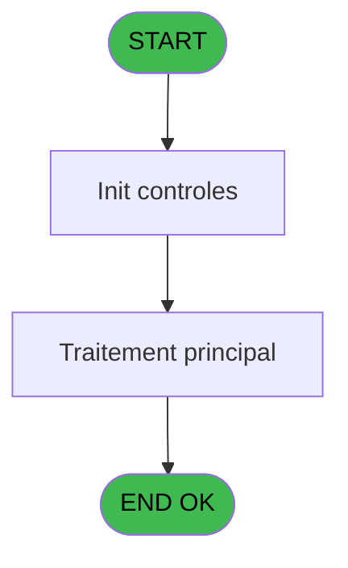
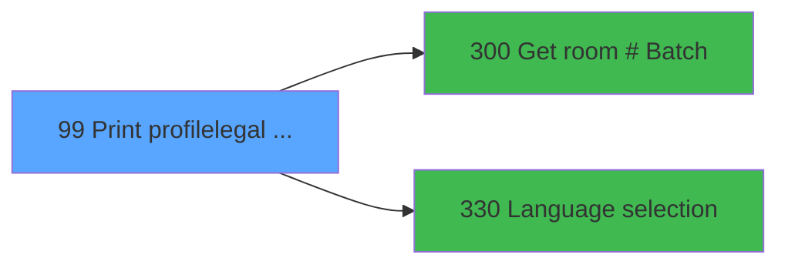

# PVE IDE 99 - Print profile/legal form

> **Analyse**: Phases 1-4 2026-02-03 09:22 -> 09:22 (19s) | Assemblage 09:22
> **Pipeline**: V7.2 Enrichi
> **Structure**: 4 onglets (Resume | Ecrans | Donnees | Connexions)

<!-- TAB:Resume -->

## 1. FICHE D'IDENTITE

| Attribut | Valeur |
|----------|--------|
| Projet | PVE |
| IDE Position | 99 |
| Nom Programme | Print profile/legal form |
| Fichier source | `Prg_99.xml` |
| Domaine metier | Impression |
| Taches | 5 (1 ecrans visibles) |
| Tables modifiees | 0 |
| Programmes appeles | 2 |

## 2. DESCRIPTION FONCTIONNELLE

**Print profile/legal form** assure la gestion complete de ce processus, accessible depuis [Menu Main (TPE) (IDE 403)](PVE-IDE-403.md).

Le flux de traitement s'organise en **2 blocs fonctionnels** :

- **Impression** (3 taches) : generation de tickets et documents
- **Traitement** (2 taches) : traitements metier divers

Detail : phases du traitement

#### Phase 1 : Impression (3 taches)

- **99** - Printing **[[ECRAN]](#ecran-t1)**
- **99.2** - EDITION
- **99.2.1** - EDITION

#### Phase 2 : Traitement (2 taches)

- **99.1** - PARAMETERS
- **99.2.1.1** - Ski Shoes Name **[[ECRAN]](#ecran-t5)**

Delegue a : [Get room # (Batch) (IDE 300)](PVE-IDE-300.md)

## 3. BLOCS FONCTIONNELS

### 3.1 Impression (3 taches)

Generation des documents et tickets.

---

#### 99 - Printing [[ECRAN]](#ecran-t1)

**Role** : Generation du document : Printing.
**Ecran** : 640 x 71 DLU (MDI) | [Voir mockup](#ecran-t1)

---

#### 99.2 - EDITION

**Role** : Generation du document : EDITION.

---

#### 99.2.1 - EDITION

**Role** : Generation du document : EDITION.

### 3.2 Traitement (2 taches)

Traitements internes.

---

#### 99.1 - PARAMETERS

**Role** : Traitement : PARAMETERS.
**Delegue a** : [Get room # (Batch) (IDE 300)](PVE-IDE-300.md)

---

#### 99.2.1.1 - Ski Shoes Name [[ECRAN]](#ecran-t5)

**Role** : Traitement : Ski Shoes Name.
**Ecran** : 297 x 83 DLU (MDI) | [Voir mockup](#ecran-t5)
**Delegue a** : [Get room # (Batch) (IDE 300)](PVE-IDE-300.md)

## 5. REGLES METIER

*(Aucune regle metier identifiee)*

## 6. CONTEXTE

- **Appele par**: [Menu Main (TPE) (IDE 403)](PVE-IDE-403.md)
- **Appelle**: 2 programmes | **Tables**: 5 (W:0 R:3 L:3) | **Taches**: 5 | **Expressions**: 9

<!-- TAB:Ecrans -->

## 8. ECRANS

### 8.1 Forms visibles (1 / 5)

| # | Position | Tache | Nom | Type | Largeur | Hauteur | Bloc |
|---|----------|-------|-----|------|---------|---------|------|
| 1 | 99 | 99 | Printing | MDI | 640 | 71 | Impression |

### 8.2 Mockups Ecrans

---

#### 99 - Printing
**Tache** : [99](#t1) | **Type** : MDI | **Dimensions** : 640 x 71 DLU
**Bloc** : Impression | **Titre IDE** : Printing

<!-- FORM-DATA:
{
    "width":  640,
    "vFactor":  8,
    "type":  "MDI",
    "hFactor":  8,
    "controls":  [
                     {
                         "x":  172,
                         "type":  "label",
                         "var":  "",
                         "y":  28,
                         "w":  296,
                         "fmt":  "",
                         "name":  "",
                         "h":  14,
                         "color":  "183",
                         "text":  "Legal form",
                         "parent":  null
                     }
                 ],
    "taskId":  "99",
    "height":  71
}
-->

## 9. NAVIGATION

Ecran unique: **Printing**

### 9.3 Structure hierarchique (5 taches)

| Position | Tache | Type | Dimensions | Bloc |
|----------|-------|------|------------|------|
| **99.1** | [**Printing** (99)](#t1) [mockup](#ecran-t1) | MDI | 640x71 | Impression |
| 99.1.1 | [EDITION (99.2)](#t3) | MDI | - | |
| 99.1.2 | [EDITION (99.2.1)](#t4) | MDI | - | |
| **99.2** | [**PARAMETERS** (99.1)](#t2) | MDI | - | Traitement |
| 99.2.1 | [Ski Shoes Name (99.2.1.1)](#t5) [mockup](#ecran-t5) | MDI | 297x83 | |

### 9.4 Algorigramme

> **Legende**: Vert = START/END OK | Rouge = END KO | Bleu = Decisions
> *Algorigramme auto-genere. Utiliser `/algorigramme` pour une synthese metier detaillee.*

<!-- TAB:Donnees -->

## 10. TABLES

### Tables utilisees (5)

| ID | Nom | Description | Type | R | W | L | Usages |
|----|-----|-------------|------|---|---|---|--------|
| 31 | gm-complet_______gmc |  | DB | R |   |   | 1 |
| 382 | pv_discount_reasons |  | DB | R |   | L | 2 |
| 400 | pv_cust_rentals |  | DB | R |   |   | 1 |
| 418 | pv_years |  | DB |   |   | L | 1 |
| 808 | Selection des noms a supprimer |  | DB |   |   | L | 1 |

### Colonnes par table (2 / 3 tables avec colonnes identifiees)

Table 31 - gm-complet_______gmc (R) - 1 usages

| Lettre | Variable | Acces | Type |
|--------|----------|-------|------|
| A | CautionExist | R | Logical |
| B | v.room number | R | Alpha |

Table 382 - pv_discount_reasons (R/L) - 2 usages

*Table utilisee uniquement en Link ou aucune colonne Real identifiee dans le DataView.*

Table 400 - pv_cust_rentals (R) - 1 usages

| Lettre | Variable | Acces | Type |
|--------|----------|-------|------|
| A | Param XCust Id | R | Numeric |

## 11. VARIABLES

### 11.1 Variables de session (1)

Variables persistantes pendant toute la session.

| Lettre | Nom | Type | Usage dans |
|--------|-----|------|-----------|
| B | v.language | Alpha | - |

### 11.2 Autres (11)

Variables diverses.

| Lettre | Nom | Type | Usage dans |
|--------|-----|------|-----------|
| A | Param XCust Id | Numeric | - |
| C | HeaderLine01 | Alpha | 1x refs |
| D | HeaderLine02 | Alpha | 1x refs |
| E | HeaderLine03 | Alpha | 1x refs |
| F | HeaderLine04 | Alpha | 1x refs |
| G | HeaderLine05 | Alpha | 1x refs |
| H | HeaderLine06 | Alpha | 1x refs |
| I | HeaderLine07 | Alpha | 1x refs |
| J | HeaderLine08 | Alpha | 1x refs |
| K | HeaderLine09 | Alpha | 1x refs |
| L | HeaderLine10 | Alpha | - |

## 12. EXPRESSIONS

**9 / 9 expressions decodees (100%)**

### 12.1 Repartition par type

| Type | Expressions | Regles |
|------|-------------|--------|
| OTHER | 9 | 0 |

### 12.2 Expressions cles par type

#### OTHER (9 expressions)

| Type | IDE | Expression | Regle |
|------|-----|------------|-------|
| OTHER | 7 | `GetParam ('HEADERLINE07')` | - |
| OTHER | 6 | `GetParam ('HEADERLINE06')` | - |
| OTHER | 9 | `GetParam ('HEADERLINE09')` | - |
| OTHER | 8 | `GetParam ('HEADERLINE08')` | - |
| OTHER | 5 | `GetParam ('HEADERLINE05')` | - |
| ... | | *+4 autres* | |

<!-- TAB:Connexions -->

## 13. GRAPHE D'APPELS

### 13.1 Chaine depuis Main (Callers)

Main -> ... -> [Menu Main (TPE) (IDE 403)](PVE-IDE-403.md) -> **Print profile/legal form (IDE 99)**

### 13.2 Callers

| IDE | Nom Programme | Nb Appels |
|-----|---------------|-----------|
| [403](PVE-IDE-403.md) | Menu Main (TPE) | 1 |

### 13.3 Callees (programmes appeles)

### 13.4 Detail Callees avec contexte

| IDE | Nom Programme | Appels | Contexte |
|-----|---------------|--------|----------|
| [300](PVE-IDE-300.md) | Get room # (Batch) | 1 | Recuperation donnees |
| [330](PVE-IDE-330.md) | Language selection | 1 | Selection/consultation |

## 14. RECOMMANDATIONS MIGRATION

### 14.1 Profil du programme

| Metrique | Valeur | Impact migration |
|----------|--------|-----------------|
| Lignes de logique | 134 | Programme compact |
| Expressions | 9 | Peu de logique |
| Tables WRITE | 0 | Impact faible |
| Sous-programmes | 2 | Peu de dependances |
| Ecrans visibles | 1 | Ecran unique ou traitement batch |
| Code desactive | 0% (0 / 134) | Code sain |
| Regles metier | 0 | Pas de regle identifiee |

### 14.2 Plan de migration par bloc

#### Impression (3 taches: 1 ecran, 2 traitements)

- **Strategie** : Templates HTML -> PDF via wkhtmltopdf ou Puppeteer.
- `PrintService` injectable avec choix imprimante

#### Traitement (2 taches: 1 ecran, 1 traitement)

- **Strategie** : Orchestrateur avec 1 ecrans (Razor/React) et 1 traitements backend (services).
- Les ecrans deviennent des composants UI, les traitements invisibles deviennent des services injectables.
- 2 sous-programme(s) a migrer ou a reutiliser depuis les services existants.
- Decomposer les taches en services unitaires testables.

### 14.3 Dependances critiques

| Dependance | Type | Appels | Impact |
|------------|------|--------|--------|
| [Language selection (IDE 330)](PVE-IDE-330.md) | Sous-programme | 1x | Normale - Selection/consultation |
| [Get room # (Batch) (IDE 300)](PVE-IDE-300.md) | Sous-programme | 1x | Normale - Recuperation donnees |

---
*Spec DETAILED generee par Pipeline V7.2 - 2026-02-03 09:22*
