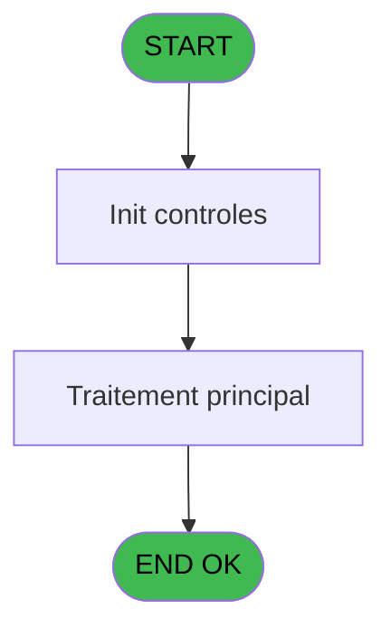
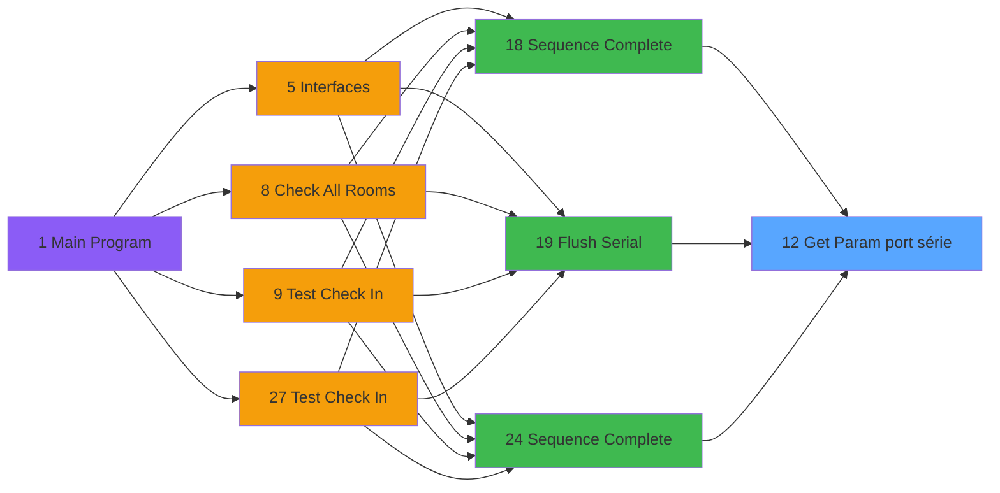

# QUA IDE 12 - Get Param port série

> **Analyse**: Phases 1-4 2026-02-03 20:17 -> 20:17 (13s) | Assemblage 20:17
> **Pipeline**: V7.2 Enrichi
> **Structure**: 4 onglets (Resume | Ecrans | Donnees | Connexions)

<!-- TAB:Resume -->

## 1. FICHE D'IDENTITE

| Attribut | Valeur |
|----------|--------|
| Projet | QUA |
| IDE Position | 12 |
| Nom Programme | Get Param port série |
| Fichier source | `Prg_12.xml` |
| Dossier IDE | Port |
| Taches | 1 (0 ecrans visibles) |
| Tables modifiees | 0 |
| Programmes appeles | 0 |

## 2. DESCRIPTION FONCTIONNELLE

**Get Param port série** assure la gestion complete de ce processus, accessible depuis [Sequence Complete (IDE 18)](QUA-IDE-18.md), [Flush Serial (IDE 19)](QUA-IDE-19.md), [Sequence Complete (IDE 24)](QUA-IDE-24.md).

Le flux de traitement s'organise en **1 blocs fonctionnels** :

- **Traitement** (1 tache) : traitements metier divers

## 3. BLOCS FONCTIONNELS

### 3.1 Traitement (1 tache)

Traitements internes.

---

#### 12 - Get Param port série

**Role** : Consultation/chargement : Get Param port série.
**Variables liees** : A (Prm - Port)

## 5. REGLES METIER

*(Aucune regle metier identifiee)*

## 6. CONTEXTE

- **Appele par**: [Sequence Complete (IDE 18)](QUA-IDE-18.md), [Flush Serial (IDE 19)](QUA-IDE-19.md), [Sequence Complete (IDE 24)](QUA-IDE-24.md)
- **Appelle**: 0 programmes | **Tables**: 1 (W:0 R:1 L:0) | **Taches**: 1 | **Expressions**: 6

<!-- TAB:Ecrans -->

## 8. ECRANS

*(Programme sans ecran visible)*

## 9. NAVIGATION

### 9.3 Structure hierarchique (1 tache)

| Position | Tache | Type | Dimensions | Bloc |
|----------|-------|------|------------|------|
| **12.1** | [**Get Param port série** (12)](#t1) | MDI | - | Traitement |

### 9.4 Algorigramme

> **Legende**: Vert = START/END OK | Rouge = END KO | Bleu = Decisions
> *Algorigramme auto-genere. Utiliser `/algorigramme` pour une synthese metier detaillee.*

<!-- TAB:Donnees -->

## 10. TABLES

### Tables utilisees (1)

| ID | Nom | Description | Type | R | W | L | Usages |
|----|-----|-------------|------|---|---|---|--------|
| 706 | parametre_port_serie |  | DB | R |   |   | 1 |

### Colonnes par table (1 / 1 tables avec colonnes identifiees)

Table 706 - parametre_port_serie (R) - 1 usages

| Lettre | Variable | Acces | Type |
|--------|----------|-------|------|
| A | Prm - Port | R | Numeric |
| B | Prm - Vitesse | R | Numeric |
| C | Prm - Parite | R | Alpha |
| D | Prm - Nbr Stop | R | Alpha |
| E | Prm - Nbr Donnees | R | Alpha |

## 11. VARIABLES

### 11.1 Autres (5)

Variables diverses.

| Lettre | Nom | Type | Usage dans |
|--------|-----|------|-----------|
| A | Prm - Port | Numeric | - |
| B | Prm - Vitesse | Numeric | - |
| C | Prm - Parite | Alpha | - |
| D | Prm - Nbr Stop | Alpha | - |
| E | Prm - Nbr Donnees | Alpha | - |

## 12. EXPRESSIONS

**6 / 6 expressions decodees (100%)**

### 12.1 Repartition par type

| Type | Expressions | Regles |
|------|-------------|--------|
| CONSTANTE | 1 | 0 |
| OTHER | 3 | 0 |
| STRING | 2 | 0 |

### 12.2 Expressions cles par type

#### CONSTANTE (1 expressions)

| Type | IDE | Expression | Regle |
|------|-----|------------|-------|
| CONSTANTE | 1 | `'QUA'` | - |

#### OTHER (3 expressions)

| Type | IDE | Expression | Regle |
|------|-----|------------|-------|
| OTHER | 5 | `[J]` | - |
| OTHER | 4 | `[H]` | - |
| OTHER | 2 | `[M]` | - |

#### STRING (2 expressions)

| Type | IDE | Expression | Regle |
|------|-----|------------|-------|
| STRING | 6 | `Str ([I],'1')` | - |
| STRING | 3 | `Val ([G],'5')` | - |

<!-- TAB:Connexions -->

## 13. GRAPHE D'APPELS

### 13.1 Chaine depuis Main (Callers)

Main -> ... -> [Sequence Complete (IDE 18)](QUA-IDE-18.md) -> **Get Param port série (IDE 12)**

Main -> ... -> [Flush Serial (IDE 19)](QUA-IDE-19.md) -> **Get Param port série (IDE 12)**

Main -> ... -> [Sequence Complete (IDE 24)](QUA-IDE-24.md) -> **Get Param port série (IDE 12)**

### 13.2 Callers

| IDE | Nom Programme | Nb Appels |
|-----|---------------|-----------|
| [18](QUA-IDE-18.md) | Sequence Complete | 1 |
| [19](QUA-IDE-19.md) | Flush Serial | 1 |
| [24](QUA-IDE-24.md) | Sequence Complete | 1 |

### 13.3 Callees (programmes appeles)

### 13.4 Detail Callees avec contexte

| IDE | Nom Programme | Appels | Contexte |
|-----|---------------|--------|----------|
| - | (aucun) | - | - |

## 14. RECOMMANDATIONS MIGRATION

### 14.1 Profil du programme

| Metrique | Valeur | Impact migration |
|----------|--------|-----------------|
| Lignes de logique | 20 | Programme compact |
| Expressions | 6 | Peu de logique |
| Tables WRITE | 0 | Impact faible |
| Sous-programmes | 0 | Peu de dependances |
| Ecrans visibles | 0 | Ecran unique ou traitement batch |
| Code desactive | 0% (0 / 20) | Code sain |
| Regles metier | 0 | Pas de regle identifiee |

### 14.2 Plan de migration par bloc

#### Traitement (1 tache: 0 ecran, 1 traitement)

- **Strategie** : 1 service(s) backend injectable(s) (Domain Services).
- Decomposer les taches en services unitaires testables.

### 14.3 Dependances critiques

| Dependance | Type | Appels | Impact |
|------------|------|--------|--------|

---
*Spec DETAILED generee par Pipeline V7.2 - 2026-02-03 20:17*
