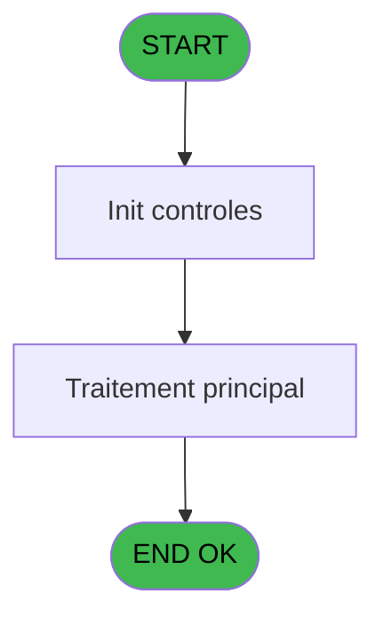
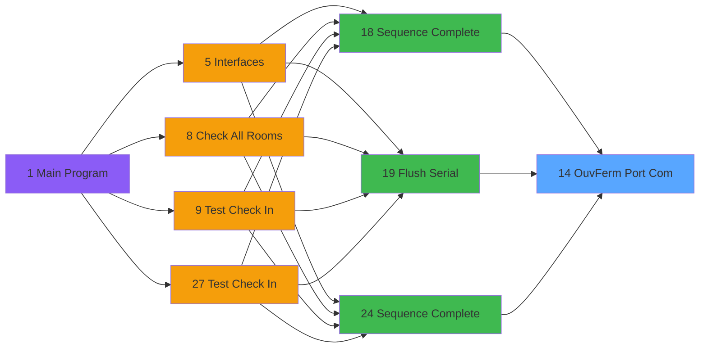

# QUA IDE 14 - Ouv/Ferm Port Com

> **Analyse**: Phases 1-4 2026-02-03 20:18 -> 20:18 (15s) | Assemblage 20:18
> **Pipeline**: V7.2 Enrichi
> **Structure**: 4 onglets (Resume | Ecrans | Donnees | Connexions)

<!-- TAB:Resume -->

## 1. FICHE D'IDENTITE

| Attribut | Valeur |
|----------|--------|
| Projet | QUA |
| IDE Position | 14 |
| Nom Programme | Ouv/Ferm Port Com |
| Fichier source | `Prg_14.xml` |
| Dossier IDE | Port |
| Taches | 1 (0 ecrans visibles) |
| Tables modifiees | 0 |
| Programmes appeles | 0 |

## 2. DESCRIPTION FONCTIONNELLE

**Ouv/Ferm Port Com** assure la gestion complete de ce processus, accessible depuis [Sequence Complete (IDE 18)](QUA-IDE-18.md), [Flush Serial (IDE 19)](QUA-IDE-19.md), [Sequence Complete (IDE 24)](QUA-IDE-24.md).

Le flux de traitement s'organise en **1 blocs fonctionnels** :

- **Traitement** (1 tache) : traitements metier divers

## 3. BLOCS FONCTIONNELS

### 3.1 Traitement (1 tache)

Traitements internes.

---

#### 14 - Ouv/Ferm Port Com

**Role** : Traitement : Ouv/Ferm Port Com.
**Variables liees** : B (Prm - p.Port)

## 5. REGLES METIER

*(Aucune regle metier identifiee)*

## 6. CONTEXTE

- **Appele par**: [Sequence Complete (IDE 18)](QUA-IDE-18.md), [Flush Serial (IDE 19)](QUA-IDE-19.md), [Sequence Complete (IDE 24)](QUA-IDE-24.md)
- **Appelle**: 0 programmes | **Tables**: 0 (W:0 R:0 L:0) | **Taches**: 1 | **Expressions**: 7

<!-- TAB:Ecrans -->

## 8. ECRANS

*(Programme sans ecran visible)*

## 9. NAVIGATION

### 9.3 Structure hierarchique (1 tache)

| Position | Tache | Type | Dimensions | Bloc |
|----------|-------|------|------------|------|
| **14.1** | [**Ouv/Ferm Port Com** (14)](#t1) | MDI | - | Traitement |

### 9.4 Algorigramme

> **Legende**: Vert = START/END OK | Rouge = END KO | Bleu = Decisions
> *Algorigramme auto-genere. Utiliser `/algorigramme` pour une synthese metier detaillee.*

<!-- TAB:Donnees -->

## 10. TABLES

### Tables utilisees (0)

| ID | Nom | Description | Type | R | W | L | Usages |
|----|-----|-------------|------|---|---|---|--------|

### Colonnes par table (0 / 0 tables avec colonnes identifiees)

## 11. VARIABLES

### 11.1 Autres (7)

Variables diverses.

| Lettre | Nom | Type | Usage dans |
|--------|-----|------|-----------|
| A | Prm - Action | Alpha | 2x refs |
| B | Prm - p.Port | Numeric | - |
| C | Prm - Vitesse | Numeric | - |
| D | Prm - Parite | Alpha | - |
| E | Prm - Bit Arret | Alpha | - |
| F | Prm - Bit Donnees | Alpha | - |
| G | Prm - Statut | Numeric | - |

## 12. EXPRESSIONS

**7 / 7 expressions decodees (100%)**

### 12.1 Repartition par type

| Type | Expressions | Regles |
|------|-------------|--------|
| CONSTANTE | 3 | 0 |
| CONCATENATION | 2 | 0 |
| CONDITION | 2 | 0 |

### 12.2 Expressions cles par type

#### CONSTANTE (3 expressions)

| Type | IDE | Expression | Regle |
|------|-----|------------|-------|
| CONSTANTE | 6 | `'22'` | - |
| CONSTANTE | 3 | `0` | - |
| CONSTANTE | 2 | `'24AAA22222'` | - |

#### CONCATENATION (2 expressions)

| Type | IDE | Expression | Regle |
|------|-----|------------|-------|
| CONCATENATION | 5 | `'@'&Translate('%dll%')&'scomm.dll.sc_close'` | - |
| CONCATENATION | 1 | `'@'&Translate('%dll%')&'scomm.dll.sc_open'` | - |

#### CONDITION (2 expressions)

| Type | IDE | Expression | Regle |
|------|-----|------------|-------|
| CONDITION | 7 | `Prm - Action [A]='F'` | - |
| CONDITION | 4 | `Prm - Action [A]='O'` | - |

<!-- TAB:Connexions -->

## 13. GRAPHE D'APPELS

### 13.1 Chaine depuis Main (Callers)

Main -> ... -> [Sequence Complete (IDE 18)](QUA-IDE-18.md) -> **Ouv/Ferm Port Com (IDE 14)**

Main -> ... -> [Flush Serial (IDE 19)](QUA-IDE-19.md) -> **Ouv/Ferm Port Com (IDE 14)**

Main -> ... -> [Sequence Complete (IDE 24)](QUA-IDE-24.md) -> **Ouv/Ferm Port Com (IDE 14)**

### 13.2 Callers

| IDE | Nom Programme | Nb Appels |
|-----|---------------|-----------|
| [18](QUA-IDE-18.md) | Sequence Complete | 3 |
| [19](QUA-IDE-19.md) | Flush Serial | 3 |
| [24](QUA-IDE-24.md) | Sequence Complete | 3 |

### 13.3 Callees (programmes appeles)

### 13.4 Detail Callees avec contexte

| IDE | Nom Programme | Appels | Contexte |
|-----|---------------|--------|----------|
| - | (aucun) | - | - |

## 14. RECOMMANDATIONS MIGRATION

### 14.1 Profil du programme

| Metrique | Valeur | Impact migration |
|----------|--------|-----------------|
| Lignes de logique | 11 | Programme compact |
| Expressions | 7 | Peu de logique |
| Tables WRITE | 0 | Impact faible |
| Sous-programmes | 0 | Peu de dependances |
| Ecrans visibles | 0 | Ecran unique ou traitement batch |
| Code desactive | 0% (0 / 11) | Code sain |
| Regles metier | 0 | Pas de regle identifiee |

### 14.2 Plan de migration par bloc

#### Traitement (1 tache: 0 ecran, 1 traitement)

- **Strategie** : 1 service(s) backend injectable(s) (Domain Services).
- Decomposer les taches en services unitaires testables.

### 14.3 Dependances critiques

| Dependance | Type | Appels | Impact |
|------------|------|--------|--------|

---
*Spec DETAILED generee par Pipeline V7.2 - 2026-02-03 20:18*
