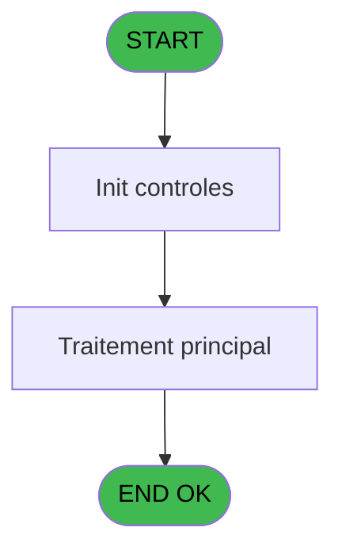
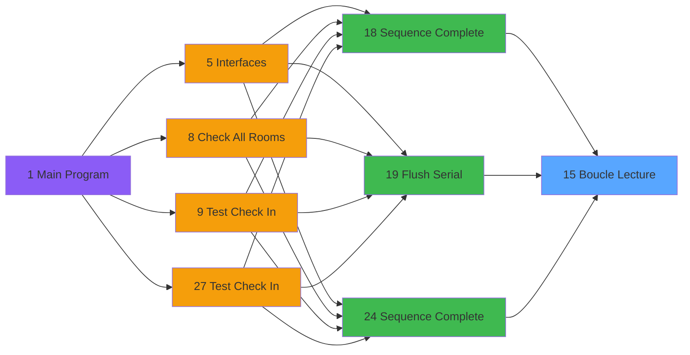

# QUA IDE 15 - Boucle Lecture

> **Analyse**: Phases 1-4 2026-02-03 20:18 -> 20:18 (16s) | Assemblage 20:18
> **Pipeline**: V7.2 Enrichi
> **Structure**: 4 onglets (Resume | Ecrans | Donnees | Connexions)

<!-- TAB:Resume -->

## 1. FICHE D'IDENTITE

| Attribut | Valeur |
|----------|--------|
| Projet | QUA |
| IDE Position | 15 |
| Nom Programme | Boucle Lecture |
| Fichier source | `Prg_15.xml` |
| Dossier IDE | Port |
| Taches | 2 (0 ecrans visibles) |
| Tables modifiees | 0 |
| Programmes appeles | 1 |

## 2. DESCRIPTION FONCTIONNELLE

**Boucle Lecture** assure la gestion complete de ce processus, accessible depuis [Sequence Complete (IDE 18)](QUA-IDE-18.md), [Sequence Complete (IDE 24)](QUA-IDE-24.md), [Flush Serial (IDE 19)](QUA-IDE-19.md).

Le flux de traitement s'organise en **1 blocs fonctionnels** :

- **Traitement** (2 taches) : traitements metier divers

## 3. BLOCS FONCTIONNELS

### 3.1 Traitement (2 taches)

Traitements internes.

---

#### 15 - Boucle Lecture

**Role** : Traitement : Boucle Lecture.
**Variables liees** : L (v. Lecture Terminee), P (v.Buffer Lecture), H (Prm - Lecture Coherente), K (Prm - Type Lecture)
**Delegue a** : [Ecriture Simple (IDE 16)](QUA-IDE-16.md)

---

#### 15.1 - Delay

**Role** : Traitement : Delay.
**Variables liees** : G (Prm - Delay)
**Delegue a** : [Ecriture Simple (IDE 16)](QUA-IDE-16.md)

## 5. REGLES METIER

*(Aucune regle metier identifiee)*

## 6. CONTEXTE

- **Appele par**: [Sequence Complete (IDE 18)](QUA-IDE-18.md), [Sequence Complete (IDE 24)](QUA-IDE-24.md), [Flush Serial (IDE 19)](QUA-IDE-19.md)
- **Appelle**: 1 programmes | **Tables**: 0 (W:0 R:0 L:0) | **Taches**: 2 | **Expressions**: 38

<!-- TAB:Ecrans -->

## 8. ECRANS

*(Programme sans ecran visible)*

## 9. NAVIGATION

### 9.3 Structure hierarchique (2 taches)

| Position | Tache | Type | Dimensions | Bloc |
|----------|-------|------|------------|------|
| **15.1** | [**Boucle Lecture** (15)](#t1) | MDI | - | Traitement |
| 15.1.1 | [Delay (15.1)](#t2) | MDI | - | |

### 9.4 Algorigramme

> **Legende**: Vert = START/END OK | Rouge = END KO | Bleu = Decisions
> *Algorigramme auto-genere. Utiliser `/algorigramme` pour une synthese metier detaillee.*

<!-- TAB:Donnees -->

## 10. TABLES

### Tables utilisees (0)

| ID | Nom | Description | Type | R | W | L | Usages |
|----|-----|-------------|------|---|---|---|--------|

### Colonnes par table (0 / 0 tables avec colonnes identifiees)

## 11. VARIABLES

### 11.1 Variables de session (8)

Variables persistantes pendant toute la session.

| Lettre | Nom | Type | Usage dans |
|--------|-----|------|-----------|
| L | v. Lecture Terminee | Logical | [15](#t1) |
| M | v.Time | Time | 2x session |
| P | v.Buffer Lecture | Alpha | [15](#t1) |
| Q | v.Nb Caracteres Lus | Numeric | 1x session |
| R | v.ACK | Alpha | - |
| S | v.NAK | Alpha | - |
| T | v.STX | Alpha | - |
| U | v.ETX | Alpha | 2x session |

### 11.2 Autres (13)

Variables diverses.

| Lettre | Nom | Type | Usage dans |
|--------|-----|------|-----------|
| A | Prm - Timeout | Numeric | 1x refs |
| B | Prm - Port | Numeric | - |
| C | Prm - Message Lu | Alpha | 3x refs |
| D | Prm - Nb car à lire | Numeric | - |
| E | Prm - Nb car lu | Numeric | 2x refs |
| F | Prm - Statut | Numeric | - |
| G | Prm - Delay | Numeric | - |
| H | Prm - Lecture Coherente | Logical | [15](#t1) |
| I | Prm - Statut ACK Envoyé | Logical | - |
| J | Prm - Log File | Logical | 1x refs |
| K | Prm - Type Lecture | Alpha | - |
| N | Nb Retry | Numeric | - |
| O | Fin Tache | Logical | 3x refs |

Toutes les 21 variables (liste complete)

| Cat | Lettre | Nom Variable | Type |
|-----|--------|--------------|------|
| V. | **L** | v. Lecture Terminee | Logical |
| V. | **M** | v.Time | Time |
| V. | **P** | v.Buffer Lecture | Alpha |
| V. | **Q** | v.Nb Caracteres Lus | Numeric |
| V. | **R** | v.ACK | Alpha |
| V. | **S** | v.NAK | Alpha |
| V. | **T** | v.STX | Alpha |
| V. | **U** | v.ETX | Alpha |
| Autre | **A** | Prm - Timeout | Numeric |
| Autre | **B** | Prm - Port | Numeric |
| Autre | **C** | Prm - Message Lu | Alpha |
| Autre | **D** | Prm - Nb car à lire | Numeric |
| Autre | **E** | Prm - Nb car lu | Numeric |
| Autre | **F** | Prm - Statut | Numeric |
| Autre | **G** | Prm - Delay | Numeric |
| Autre | **H** | Prm - Lecture Coherente | Logical |
| Autre | **I** | Prm - Statut ACK Envoyé | Logical |
| Autre | **J** | Prm - Log File | Logical |
| Autre | **K** | Prm - Type Lecture | Alpha |
| Autre | **N** | Nb Retry | Numeric |
| Autre | **O** | Fin Tache | Logical |

## 12. EXPRESSIONS

**38 / 38 expressions decodees (100%)**

### 12.1 Repartition par type

| Type | Expressions | Regles |
|------|-------------|--------|
| CALCULATION | 2 | 0 |
| CONDITION | 5 | 0 |
| CONSTANTE | 6 | 0 |
| DATE | 1 | 0 |
| OTHER | 17 | 0 |
| CAST_LOGIQUE | 2 | 0 |
| CONCATENATION | 1 | 0 |
| FORMAT | 3 | 0 |
| STRING | 1 | 0 |

### 12.2 Expressions cles par type

#### CALCULATION (2 expressions)

| Type | IDE | Expression | Regle |
|------|-----|------------|-------|
| CALCULATION | 30 | `v.Buffer Lecture [P]+1` | - |
| CALCULATION | 24 | `Prm - Nb car lu [E]+[AA]` | - |

#### CONDITION (5 expressions)

| Type | IDE | Expression | Regle |
|------|-----|------------|-------|
| CONDITION | 23 | `[AA]>0` | - |
| CONDITION | 37 | `[AA]=0` | - |
| CONDITION | 16 | `[AA]>0` | - |
| CONDITION | 32 | `Fin Tache [O] OR Time ()-Prm - Lecture Coherente [H]>=Prm - Timeout [A] OR (NOT(Fin Tache [O]) AND v.Buffer Lecture [P]=4)` | - |
| CONDITION | 15 | `[V]='M'` | - |

#### CONSTANTE (6 expressions)

| Type | IDE | Expression | Regle |
|------|-----|------------|-------|
| CONSTANTE | 33 | `'c:\temp\LogVOD.txt'` | - |
| CONSTANTE | 36 | `'LogVOD'` | - |
| CONSTANTE | 38 | `1` | - |
| CONSTANTE | 3 | `''` | - |
| CONSTANTE | 4 | `0` | - |
| ... | | *+1 autres* | |

#### DATE (1 expressions)

| Type | IDE | Expression | Regle |
|------|-----|------------|-------|
| DATE | 34 | `Date()` | - |

#### OTHER (17 expressions)

| Type | IDE | Expression | Regle |
|------|-----|------------|-------|
| OTHER | 25 | `v.ETX [U]` | - |
| OTHER | 27 | `[Y]` | - |
| OTHER | 20 | `v.ETX [U] AND NOT([Y])` | - |
| OTHER | 21 | `NOT([Y])` | - |
| OTHER | 31 | `Delay(2)` | - |
| ... | | *+12 autres* | |

#### CAST_LOGIQUE (2 expressions)

| Type | IDE | Expression | Regle |
|------|-----|------------|-------|
| CAST_LOGIQUE | 13 | `'TRUE'LOG` | - |
| CAST_LOGIQUE | 5 | `'FALSE'LOG` | - |

#### CONCATENATION (1 expressions)

| Type | IDE | Expression | Regle |
|------|-----|------------|-------|
| CONCATENATION | 10 | `'@'&Translate('%dll%')&'scomm.dll.sc_read'` | - |

#### FORMAT (3 expressions)

| Type | IDE | Expression | Regle |
|------|-----|------------|-------|
| FORMAT | 26 | `(InStr(Trim(Prm - Message Lu [C]),v. Lecture Terminee [L])>0 AND InStr(Trim(Prm - Message Lu [C]),v.Time [M])>0 AND Left(Prm - Message Lu [C],1)=v. Lecture Terminee [L]) OR LoopCounter()=5` | - |
| FORMAT | 17 | `InStr(Trim([Z]),v. Lecture Terminee [L])>0 AND InStr(Trim([Z]),v.Time [M])>0 AND Left([Z],1)=v. Lecture Terminee [L]` | - |
| FORMAT | 14 | `InStr(Trim(Prm - Message Lu [C]),Prm - Log File [J])>0 OR [V]='V'` | - |

#### STRING (1 expressions)

| Type | IDE | Expression | Regle |
|------|-----|------------|-------|
| STRING | 22 | `Left(Prm - Message Lu [C],Prm - Nb car lu [E])&Trim([Z])` | - |

### 12.3 Toutes les expressions (38)

Voir les 38 expressions

#### CALCULATION (2)

| IDE | Expression Decodee |
|-----|-------------------|
| 24 | `Prm - Nb car lu [E]+[AA]` |
| 30 | `v.Buffer Lecture [P]+1` |

#### CONDITION (5)

| IDE | Expression Decodee |
|-----|-------------------|
| 32 | `Fin Tache [O] OR Time ()-Prm - Lecture Coherente [H]>=Prm - Timeout [A] OR (NOT(Fin Tache [O]) AND v.Buffer Lecture [P]=4)` |
| 15 | `[V]='M'` |
| 16 | `[AA]>0` |
| 23 | `[AA]>0` |
| 37 | `[AA]=0` |

#### CONSTANTE (6)

| IDE | Expression Decodee |
|-----|-------------------|
| 3 | `''` |
| 4 | `0` |
| 11 | `'2A2L2'` |
| 33 | `'c:\temp\LogVOD.txt'` |
| 36 | `'LogVOD'` |
| 38 | `1` |

#### DATE (1)

| IDE | Expression Decodee |
|-----|-------------------|
| 34 | `Date()` |

#### OTHER (17)

| IDE | Expression Decodee |
|-----|-------------------|
| 1 | `v.Nb Caracteres Lus [Q]` |
| 2 | `Time ()` |
| 6 | `ASCIIChr (6)` |
| 7 | `ASCIIChr (21)` |
| 8 | `ASCIIChr (2)` |
| 9 | `ASCIIChr (3)` |
| 12 | `IN([V],'A','V')` |
| 18 | `[Z]` |
| 19 | `[AA]` |
| 20 | `v.ETX [U] AND NOT([Y])` |
| 21 | `NOT([Y])` |
| 25 | `v.ETX [U]` |
| 27 | `[Y]` |
| 28 | `Fin Tache [O]` |
| 29 | `NOT(Fin Tache [O])` |
| 31 | `Delay(2)` |
| 35 | `Time()` |

#### CAST_LOGIQUE (2)

| IDE | Expression Decodee |
|-----|-------------------|
| 5 | `'FALSE'LOG` |
| 13 | `'TRUE'LOG` |

#### CONCATENATION (1)

| IDE | Expression Decodee |
|-----|-------------------|
| 10 | `'@'&Translate('%dll%')&'scomm.dll.sc_read'` |

#### FORMAT (3)

| IDE | Expression Decodee |
|-----|-------------------|
| 14 | `InStr(Trim(Prm - Message Lu [C]),Prm - Log File [J])>0 OR [V]='V'` |
| 17 | `InStr(Trim([Z]),v. Lecture Terminee [L])>0 AND InStr(Trim([Z]),v.Time [M])>0 AND Left([Z],1)=v. Lecture Terminee [L]` |
| 26 | `(InStr(Trim(Prm - Message Lu [C]),v. Lecture Terminee [L])>0 AND InStr(Trim(Prm - Message Lu [C]),v.Time [M])>0 AND Left(Prm - Message Lu [C],1)=v. Lecture Terminee [L]) OR LoopCounter()=5` |

#### STRING (1)

| IDE | Expression Decodee |
|-----|-------------------|
| 22 | `Left(Prm - Message Lu [C],Prm - Nb car lu [E])&Trim([Z])` |

<!-- TAB:Connexions -->

## 13. GRAPHE D'APPELS

### 13.1 Chaine depuis Main (Callers)

Main -> ... -> [Sequence Complete (IDE 18)](QUA-IDE-18.md) -> **Boucle Lecture (IDE 15)**

Main -> ... -> [Sequence Complete (IDE 24)](QUA-IDE-24.md) -> **Boucle Lecture (IDE 15)**

Main -> ... -> [Flush Serial (IDE 19)](QUA-IDE-19.md) -> **Boucle Lecture (IDE 15)**

### 13.2 Callers

| IDE | Nom Programme | Nb Appels |
|-----|---------------|-----------|
| [18](QUA-IDE-18.md) | Sequence Complete | 8 |
| [24](QUA-IDE-24.md) | Sequence Complete | 8 |
| [19](QUA-IDE-19.md) | Flush Serial | 1 |

### 13.3 Callees (programmes appeles)

### 13.4 Detail Callees avec contexte

| IDE | Nom Programme | Appels | Contexte |
|-----|---------------|--------|----------|
| [16](QUA-IDE-16.md) | Ecriture Simple | 2 | Sous-programme |

## 14. RECOMMANDATIONS MIGRATION

### 14.1 Profil du programme

| Metrique | Valeur | Impact migration |
|----------|--------|-----------------|
| Lignes de logique | 77 | Programme compact |
| Expressions | 38 | Peu de logique |
| Tables WRITE | 0 | Impact faible |
| Sous-programmes | 1 | Peu de dependances |
| Ecrans visibles | 0 | Ecran unique ou traitement batch |
| Code desactive | 1.3% (1 / 77) | Code sain |
| Regles metier | 0 | Pas de regle identifiee |

### 14.2 Plan de migration par bloc

#### Traitement (2 taches: 0 ecran, 2 traitements)

- **Strategie** : 2 service(s) backend injectable(s) (Domain Services).
- 1 sous-programme(s) a migrer ou a reutiliser depuis les services existants.
- Decomposer les taches en services unitaires testables.

### 14.3 Dependances critiques

| Dependance | Type | Appels | Impact |
|------------|------|--------|--------|
| [Ecriture Simple (IDE 16)](QUA-IDE-16.md) | Sous-programme | 2x | Haute - Sous-programme |

---
*Spec DETAILED generee par Pipeline V7.2 - 2026-02-03 20:18*
