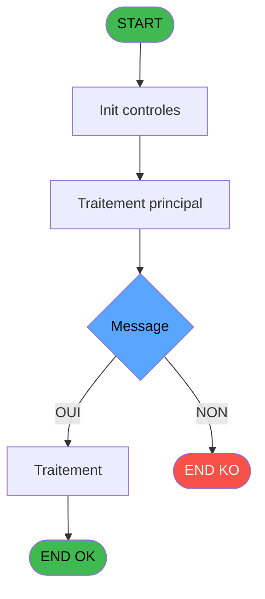
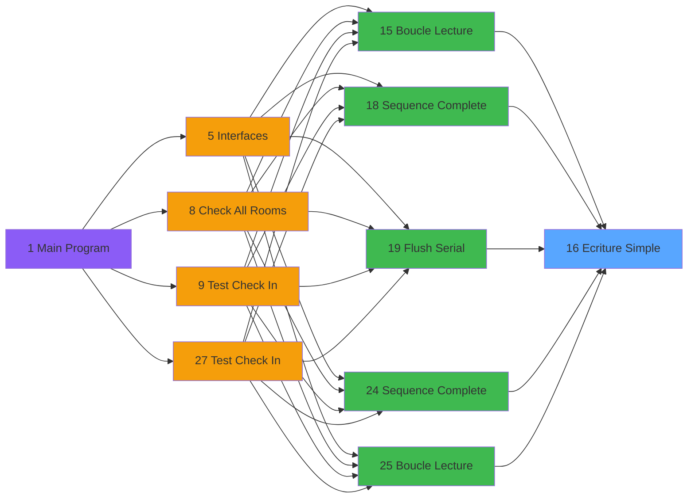

# QUA IDE 16 - Ecriture Simple

> **Analyse**: Phases 1-4 2026-02-03 20:18 -> 20:19 (15s) | Assemblage 20:19
> **Pipeline**: V7.2 Enrichi
> **Structure**: 4 onglets (Resume | Ecrans | Donnees | Connexions)

<!-- TAB:Resume -->

## 1. FICHE D'IDENTITE

| Attribut | Valeur |
|----------|--------|
| Projet | QUA |
| IDE Position | 16 |
| Nom Programme | Ecriture Simple |
| Fichier source | `Prg_16.xml` |
| Dossier IDE | Port |
| Taches | 1 (0 ecrans visibles) |
| Tables modifiees | 0 |
| Programmes appeles | 0 |

## 2. DESCRIPTION FONCTIONNELLE

**Ecriture Simple** assure la gestion complete de ce processus, accessible depuis [Sequence Complete (IDE 18)](QUA-IDE-18.md), [Sequence Complete (IDE 24)](QUA-IDE-24.md), [Boucle Lecture (IDE 15)](QUA-IDE-15.md), [Boucle Lecture (IDE 25)](QUA-IDE-25.md), [Flush Serial (IDE 19)](QUA-IDE-19.md).

Le flux de traitement s'organise en **1 blocs fonctionnels** :

- **Traitement** (1 tache) : traitements metier divers

**Logique metier** : 1 regles identifiees couvrant conditions metier.

## 3. BLOCS FONCTIONNELS

### 3.1 Traitement (1 tache)

Traitements internes.

---

#### 16 - Ecriture Simple

**Role** : Traitement : Ecriture Simple.

## 5. REGLES METIER

1 regles identifiees:

### Autres (1 regles)

#### [RM-001] Si Len(Trim(Prm - Message [B]))<>[F] alors Trim(Prm - Message [B])&' .' sinon Trim(Prm - Message [B]))

| Element | Detail |
|---------|--------|
| **Condition** | `Len(Trim(Prm - Message [B]))<>[F]` |
| **Si vrai** | Trim(Prm - Message [B])&' .' |
| **Si faux** | Trim(Prm - Message [B])) |
| **Variables** | B (Prm - Message) |
| **Expression source** | Expression 3 : `IF(Len(Trim(Prm - Message [B]))<>[F],Trim(Prm - Message [B])` |
| **Exemple** | Si Len(Trim(Prm - Message [B]))<>[F] → Trim(Prm - Message [B])&' .'. Sinon → Trim(Prm - Message [B])) |

## 6. CONTEXTE

- **Appele par**: [Sequence Complete (IDE 18)](QUA-IDE-18.md), [Sequence Complete (IDE 24)](QUA-IDE-24.md), [Boucle Lecture (IDE 15)](QUA-IDE-15.md), [Boucle Lecture (IDE 25)](QUA-IDE-25.md), [Flush Serial (IDE 19)](QUA-IDE-19.md)
- **Appelle**: 0 programmes | **Tables**: 0 (W:0 R:0 L:0) | **Taches**: 1 | **Expressions**: 6

<!-- TAB:Ecrans -->

## 8. ECRANS

*(Programme sans ecran visible)*

## 9. NAVIGATION

### 9.3 Structure hierarchique (1 tache)

| Position | Tache | Type | Dimensions | Bloc |
|----------|-------|------|------------|------|
| **16.1** | [**Ecriture Simple** (16)](#t1) | MDI | - | Traitement |

### 9.4 Algorigramme

> **Legende**: Vert = START/END OK | Rouge = END KO | Bleu = Decisions
> *Algorigramme auto-genere. Utiliser `/algorigramme` pour une synthese metier detaillee.*

<!-- TAB:Donnees -->

## 10. TABLES

### Tables utilisees (0)

| ID | Nom | Description | Type | R | W | L | Usages |
|----|-----|-------------|------|---|---|---|--------|

### Colonnes par table (0 / 0 tables avec colonnes identifiees)

## 11. VARIABLES

### 11.1 Variables de session (1)

Variables persistantes pendant toute la session.

| Lettre | Nom | Type | Usage dans |
|--------|-----|------|-----------|
| E | V - Statut Numerique | Numeric | - |

### 11.2 Autres (4)

Variables diverses.

| Lettre | Nom | Type | Usage dans |
|--------|-----|------|-----------|
| A | Prm - Port | Numeric | - |
| B | Prm - Message | Alpha | 1x refs |
| C | Prm - Taille Message | Numeric | 1x refs |
| D | Prm - Statut Logique | Logical | - |

## 12. EXPRESSIONS

**6 / 6 expressions decodees (100%)**

### 12.1 Repartition par type

| Type | Expressions | Regles |
|------|-------------|--------|
| CONDITION | 2 | 5 |
| CONSTANTE | 1 | 0 |
| CONCATENATION | 1 | 0 |
| OTHER | 1 | 0 |
| CAST_LOGIQUE | 1 | 0 |

### 12.2 Expressions cles par type

#### CONDITION (2 expressions)

| Type | IDE | Expression | Regle |
|------|-----|------------|-------|
| CONDITION | 3 | `IF(Len(Trim(Prm - Message [B]))<>[F],Trim(Prm - Message [B])&' .',Trim(Prm - Message [B]))` | [RM-001](#rm-RM-001) |
| CONDITION | 6 | `Prm - Taille Message [C]=0` | - |

#### CONSTANTE (1 expressions)

| Type | IDE | Expression | Regle |
|------|-----|------------|-------|
| CONSTANTE | 2 | `'2A22'` | - |

#### CONCATENATION (1 expressions)

| Type | IDE | Expression | Regle |
|------|-----|------------|-------|
| CONCATENATION | 1 | `'@'&Translate('%dll%')&'scomm.dll.sc_write'` | - |

#### OTHER (1 expressions)

| Type | IDE | Expression | Regle |
|------|-----|------------|-------|
| OTHER | 4 | `[F]` | - |

#### CAST_LOGIQUE (1 expressions)

| Type | IDE | Expression | Regle |
|------|-----|------------|-------|
| CAST_LOGIQUE | 5 | `'TRUE'LOG` | - |

<!-- TAB:Connexions -->

## 13. GRAPHE D'APPELS

### 13.1 Chaine depuis Main (Callers)

Main -> ... -> [Sequence Complete (IDE 18)](QUA-IDE-18.md) -> **Ecriture Simple (IDE 16)**

Main -> ... -> [Sequence Complete (IDE 24)](QUA-IDE-24.md) -> **Ecriture Simple (IDE 16)**

Main -> ... -> [Boucle Lecture (IDE 15)](QUA-IDE-15.md) -> **Ecriture Simple (IDE 16)**

Main -> ... -> [Boucle Lecture (IDE 25)](QUA-IDE-25.md) -> **Ecriture Simple (IDE 16)**

Main -> ... -> [Flush Serial (IDE 19)](QUA-IDE-19.md) -> **Ecriture Simple (IDE 16)**

### 13.2 Callers

| IDE | Nom Programme | Nb Appels |
|-----|---------------|-----------|
| [18](QUA-IDE-18.md) | Sequence Complete | 5 |
| [24](QUA-IDE-24.md) | Sequence Complete | 5 |
| [15](QUA-IDE-15.md) | Boucle Lecture | 2 |
| [25](QUA-IDE-25.md) | Boucle Lecture | 2 |
| [19](QUA-IDE-19.md) | Flush Serial | 1 |

### 13.3 Callees (programmes appeles)

### 13.4 Detail Callees avec contexte

| IDE | Nom Programme | Appels | Contexte |
|-----|---------------|--------|----------|
| - | (aucun) | - | - |

## 14. RECOMMANDATIONS MIGRATION

### 14.1 Profil du programme

| Metrique | Valeur | Impact migration |
|----------|--------|-----------------|
| Lignes de logique | 9 | Programme compact |
| Expressions | 6 | Peu de logique |
| Tables WRITE | 0 | Impact faible |
| Sous-programmes | 0 | Peu de dependances |
| Ecrans visibles | 0 | Ecran unique ou traitement batch |
| Code desactive | 0% (0 / 9) | Code sain |
| Regles metier | 1 | Quelques regles a preserver |

### 14.2 Plan de migration par bloc

#### Traitement (1 tache: 0 ecran, 1 traitement)

- **Strategie** : 1 service(s) backend injectable(s) (Domain Services).
- Decomposer les taches en services unitaires testables.

### 14.3 Dependances critiques

| Dependance | Type | Appels | Impact |
|------------|------|--------|--------|

---
*Spec DETAILED generee par Pipeline V7.2 - 2026-02-03 20:19*
