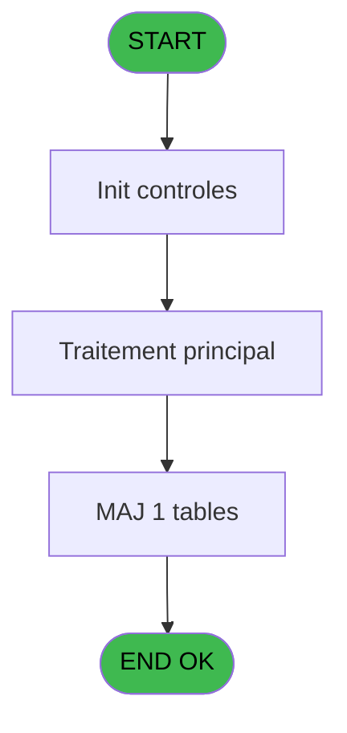

# QUA IDE 17 - Parametrage Port Serie

> **Analyse**: Phases 1-4 2026-02-03 20:19 -> 20:19 (15s) | Assemblage 20:19
> **Pipeline**: V7.2 Enrichi
> **Structure**: 4 onglets (Resume | Ecrans | Donnees | Connexions)

<!-- TAB:Resume -->

## 1. FICHE D'IDENTITE

| Attribut | Valeur |
|----------|--------|
| Projet | QUA |
| IDE Position | 17 |
| Nom Programme | Parametrage Port Serie |
| Fichier source | `Prg_17.xml` |
| Dossier IDE | Port |
| Taches | 1 (1 ecrans visibles) |
| Tables modifiees | 1 |
| Programmes appeles | 0 |
| :warning: Statut | **ORPHELIN_POTENTIEL** |

## 2. DESCRIPTION FONCTIONNELLE

**Parametrage Port Serie** assure la gestion complete de ce processus.

Le flux de traitement s'organise en **1 blocs fonctionnels** :

- **Traitement** (1 tache) : traitements metier divers

**Donnees modifiees** : 1 tables en ecriture (parametre_port_serie).

## 3. BLOCS FONCTIONNELS

### 3.1 Traitement (1 tache)

Traitements internes.

---

#### 17 - Parametrage Port Serie [[ECRAN]](#ecran-t1)

**Role** : Traitement : Parametrage Port Serie.
**Ecran** : 204 x 135 DLU | [Voir mockup](#ecran-t1)

## 5. REGLES METIER

*(Aucune regle metier identifiee)*

## 6. CONTEXTE

- **Appele par**: (aucun)
- **Appelle**: 0 programmes | **Tables**: 1 (W:1 R:0 L:0) | **Taches**: 1 | **Expressions**: 1

<!-- TAB:Ecrans -->

## 8. ECRANS

### 8.1 Forms visibles (1 / 1)

| # | Position | Tache | Nom | Type | Largeur | Hauteur | Bloc |
|---|----------|-------|-----|------|---------|---------|------|
| 1 | 17 | 17 | Parametrage Port Serie | Type0 | 204 | 135 | Traitement |

### 8.2 Mockups Ecrans

---

#### 17 - Parametrage Port Serie
**Tache** : [17](#t1) | **Type** : Type0 | **Dimensions** : 204 x 135 DLU
**Bloc** : Traitement | **Titre IDE** : Parametrage Port Serie

<!-- FORM-DATA:
{
    "width":  204,
    "vFactor":  8,
    "type":  "Type0",
    "hFactor":  4,
    "controls":  [
                     {
                         "x":  36,
                         "type":  "label",
                         "var":  "",
                         "y":  16,
                         "w":  48,
                         "fmt":  "",
                         "name":  "",
                         "h":  9,
                         "color":  "",
                         "text":  "Port",
                         "parent":  null
                     },
                     {
                         "x":  36,
                         "type":  "label",
                         "var":  "",
                         "y":  32,
                         "w":  48,
                         "fmt":  "",
                         "name":  "",
                         "h":  9,
                         "color":  "",
                         "text":  "Vitesse",
                         "parent":  null
                     },
                     {
                         "x":  36,
                         "type":  "label",
                         "var":  "",
                         "y":  48,
                         "w":  48,
                         "fmt":  "",
                         "name":  "",
                         "h":  9,
                         "color":  "",
                         "text":  "Parité",
                         "parent":  null
                     },
                     {
                         "x":  36,
                         "type":  "label",
                         "var":  "",
                         "y":  64,
                         "w":  48,
                         "fmt":  "",
                         "name":  "",
                         "h":  9,
                         "color":  "",
                         "text":  "Bit donnée",
                         "parent":  null
                     },
                     {
                         "x":  36,
                         "type":  "label",
                         "var":  "",
                         "y":  80,
                         "w":  48,
                         "fmt":  "",
                         "name":  "",
                         "h":  9,
                         "color":  "",
                         "text":  "Bit d\u0027arrêt",
                         "parent":  null
                     },
                     {
                         "x":  112,
                         "type":  "edit",
                         "var":  "",
                         "y":  16,
                         "w":  56,
                         "fmt":  "",
                         "name":  "com",
                         "h":  10,
                         "color":  "",
                         "text":  "",
                         "parent":  null
                     },
                     {
                         "x":  112,
                         "type":  "combobox",
                         "var":  "",
                         "y":  32,
                         "w":  56,
                         "fmt":  "",
                         "name":  "baud",
                         "h":  12,
                         "color":  "",
                         "text":  "1200,1800,2400,4800,7200,9600,14400,19200,38400,57600",
                         "parent":  null
                     },
                     {
                         "x":  112,
                         "type":  "combobox",
                         "var":  "",
                         "y":  48,
                         "w":  56,
                         "fmt":  "",
                         "name":  "parite",
                         "h":  12,
                         "color":  "",
                         "text":  "N,O,E,M,S",
                         "parent":  null
                     },
                     {
                         "x":  112,
                         "type":  "combobox",
                         "var":  "",
                         "y":  64,
                         "w":  56,
                         "fmt":  "",
                         "name":  "data_bit",
                         "h":  12,
                         "color":  "",
                         "text":  "7,8",
                         "parent":  null
                     },
                     {
                         "x":  112,
                         "type":  "combobox",
                         "var":  "",
                         "y":  80,
                         "w":  56,
                         "fmt":  "",
                         "name":  "stop_bit",
                         "h":  12,
                         "color":  "",
                         "text":  "0,1,2",
                         "parent":  null
                     },
                     {
                         "x":  19,
                         "type":  "button",
                         "var":  "",
                         "y":  112,
                         "w":  64,
                         "fmt":  "Valider",
                         "name":  "",
                         "h":  14,
                         "color":  "",
                         "text":  "",
                         "parent":  null
                     },
                     {
                         "x":  121,
                         "type":  "button",
                         "var":  "",
                         "y":  113,
                         "w":  64,
                         "fmt":  "Quitter",
                         "name":  "",
                         "h":  14,
                         "color":  "",
                         "text":  "",
                         "parent":  null
                     }
                 ],
    "taskId":  "17",
    "height":  135
}
-->

<strong>Champs : 5 champs</strong>

| Pos (x,y) | Nom | Variable | Type |
|-----------|-----|----------|------|
| 112,16 | com | - | edit |
| 112,32 | baud | - | combobox |
| 112,48 | parite | - | combobox |
| 112,64 | data_bit | - | combobox |
| 112,80 | stop_bit | - | combobox |

<strong>Boutons : 2 boutons</strong>

| Bouton | Pos (x,y) | Action |
|--------|-----------|--------|
| Valider | 19,112 | Valide la saisie et enregistre |
| Quitter | 121,113 | Quitte le programme |

## 9. NAVIGATION

Ecran unique: **Parametrage Port Serie**

### 9.3 Structure hierarchique (1 tache)

| Position | Tache | Type | Dimensions | Bloc |
|----------|-------|------|------------|------|
| **17.1** | [**Parametrage Port Serie** (17)](#t1) [mockup](#ecran-t1) | - | 204x135 | Traitement |

### 9.4 Algorigramme

> **Legende**: Vert = START/END OK | Rouge = END KO | Bleu = Decisions
> *Algorigramme auto-genere. Utiliser `/algorigramme` pour une synthese metier detaillee.*

<!-- TAB:Donnees -->

## 10. TABLES

### Tables utilisees (1)

| ID | Nom | Description | Type | R | W | L | Usages |
|----|-----|-------------|------|---|---|---|--------|
| 706 | parametre_port_serie |  | DB |   | **W** |   | 1 |

### Colonnes par table (0 / 1 tables avec colonnes identifiees)

Table 706 - parametre_port_serie (**W**) - 1 usages

*Table utilisee uniquement en Link ou aucune colonne Real identifiee dans le DataView.*

## 11. VARIABLES

*(Programme sans variables locales mappees)*

## 12. EXPRESSIONS

**1 / 1 expressions decodees (100%)**

### 12.1 Repartition par type

| Type | Expressions | Regles |
|------|-------------|--------|
| CONSTANTE | 1 | 0 |

### 12.2 Expressions cles par type

#### CONSTANTE (1 expressions)

| Type | IDE | Expression | Regle |
|------|-----|------------|-------|
| CONSTANTE | 1 | `'QUA'` | - |

<!-- TAB:Connexions -->

## 13. GRAPHE D'APPELS

### 13.1 Chaine depuis Main (Callers)

**Chemin**: (pas de callers directs)

### 13.2 Callers

| IDE | Nom Programme | Nb Appels |
|-----|---------------|-----------|
| - | (aucun) | - |

### 13.3 Callees (programmes appeles)

### 13.4 Detail Callees avec contexte

| IDE | Nom Programme | Appels | Contexte |
|-----|---------------|--------|----------|
| - | (aucun) | - | - |

## 14. RECOMMANDATIONS MIGRATION

### 14.1 Profil du programme

| Metrique | Valeur | Impact migration |
|----------|--------|-----------------|
| Lignes de logique | 7 | Programme compact |
| Expressions | 1 | Peu de logique |
| Tables WRITE | 1 | Impact faible |
| Sous-programmes | 0 | Peu de dependances |
| Ecrans visibles | 1 | Ecran unique ou traitement batch |
| Code desactive | 0% (0 / 7) | Code sain |
| Regles metier | 0 | Pas de regle identifiee |

### 14.2 Plan de migration par bloc

#### Traitement (1 tache: 1 ecran, 0 traitement)

- **Strategie** : 1 composant(s) UI (Razor/React) avec formulaires et validation.
- Decomposer les taches en services unitaires testables.

### 14.3 Dependances critiques

| Dependance | Type | Appels | Impact |
|------------|------|--------|--------|
| parametre_port_serie | Table WRITE (Database) | 1x | Schema + repository |

---
*Spec DETAILED generee par Pipeline V7.2 - 2026-02-03 20:19*
