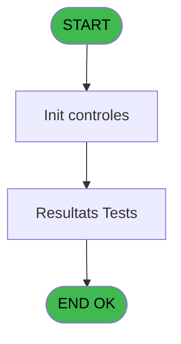
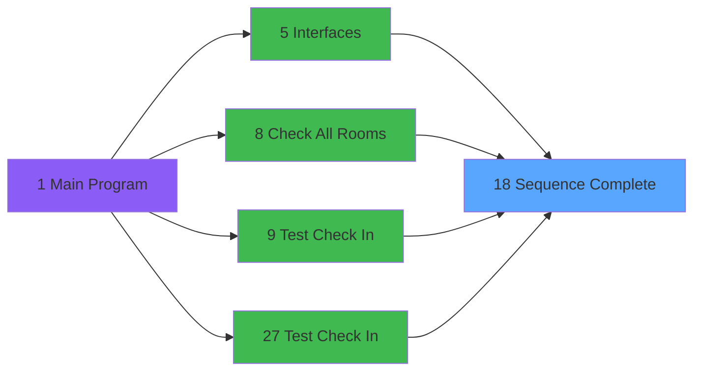
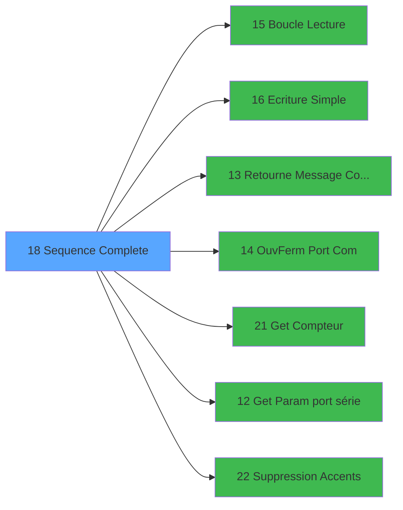

# QUA IDE 18 - Sequence Complete

> **Analyse**: Phases 1-4 2026-02-03 20:19 -> 20:19 (15s) | Assemblage 20:19
> **Pipeline**: V7.2 Enrichi
> **Structure**: 4 onglets (Resume | Ecrans | Donnees | Connexions)

<!-- TAB:Resume -->

## 1. FICHE D'IDENTITE

| Attribut | Valeur |
|----------|--------|
| Projet | QUA |
| IDE Position | 18 |
| Nom Programme | Sequence Complete |
| Fichier source | `Prg_18.xml` |
| Dossier IDE | Port |
| Taches | 2 (1 ecrans visibles) |
| Tables modifiees | 0 |
| Programmes appeles | 7 |

## 2. DESCRIPTION FONCTIONNELLE

**Sequence Complete** assure la gestion complete de ce processus, accessible depuis [Interfaces (IDE 5)](QUA-IDE-5.md), [Check All Rooms (IDE 8)](QUA-IDE-8.md), [Test Check In (IDE 9)](QUA-IDE-9.md), [Test Check In (IDE 27)](QUA-IDE-27.md).

Le flux de traitement s'organise en **1 blocs fonctionnels** :

- **Traitement** (2 taches) : traitements metier divers

## 3. BLOCS FONCTIONNELS

### 3.1 Traitement (2 taches)

Traitements internes.

---

#### 18 - Sequence Complete [[ECRAN]](#ecran-t1)

**Role** : Traitement : Sequence Complete.
**Ecran** : 215 x 42 DLU | [Voir mockup](#ecran-t1)
**Variables liees** : T (Prm - Statut Sequence)
**Delegue a** : [Boucle Lecture (IDE 15)](QUA-IDE-15.md), [Ecriture Simple (IDE 16)](QUA-IDE-16.md), [Retourne Message Complet (IDE 13)](QUA-IDE-13.md)

---

#### 18.1 - Resultats Tests [[ECRAN]](#ecran-t2)

**Role** : Verification : Resultats Tests.
**Ecran** : 706 x 358 DLU | [Voir mockup](#ecran-t2)
**Delegue a** : [Boucle Lecture (IDE 15)](QUA-IDE-15.md), [Ecriture Simple (IDE 16)](QUA-IDE-16.md), [Retourne Message Complet (IDE 13)](QUA-IDE-13.md)

## 5. REGLES METIER

*(Aucune regle metier identifiee)*

## 6. CONTEXTE

- **Appele par**: [Interfaces (IDE 5)](QUA-IDE-5.md), [Check All Rooms (IDE 8)](QUA-IDE-8.md), [Test Check In (IDE 9)](QUA-IDE-9.md), [Test Check In (IDE 27)](QUA-IDE-27.md)
- **Appelle**: 7 programmes | **Tables**: 0 (W:0 R:0 L:0) | **Taches**: 2 | **Expressions**: 55

<!-- TAB:Ecrans -->

## 8. ECRANS

### 8.1 Forms visibles (1 / 2)

| # | Position | Tache | Nom | Type | Largeur | Hauteur | Bloc |
|---|----------|-------|-----|------|---------|---------|------|
| 1 | 18.1 | 18.1 | Resultats Tests | Type0 | 706 | 358 | Traitement |

### 8.2 Mockups Ecrans

---

#### 18.1 - Resultats Tests
**Tache** : [18.1](#t2) | **Type** : Type0 | **Dimensions** : 706 x 358 DLU
**Bloc** : Traitement | **Titre IDE** : Resultats Tests

<!-- FORM-DATA:
{
    "width":  706,
    "vFactor":  8,
    "type":  "Type0",
    "hFactor":  4,
    "controls":  [
                     {
                         "x":  4,
                         "type":  "label",
                         "var":  "",
                         "y":  16,
                         "w":  77,
                         "fmt":  "",
                         "name":  "",
                         "h":  9,
                         "color":  "",
                         "text":  "Prm - Num Chambre",
                         "parent":  null
                     },
                     {
                         "x":  4,
                         "type":  "label",
                         "var":  "",
                         "y":  32,
                         "w":  59,
                         "fmt":  "",
                         "name":  "",
                         "h":  9,
                         "color":  "",
                         "text":  "Prm - Compte 1",
                         "parent":  null
                     },
                     {
                         "x":  4,
                         "type":  "label",
                         "var":  "",
                         "y":  48,
                         "w":  48,
                         "fmt":  "",
                         "name":  "",
                         "h":  9,
                         "color":  "",
                         "text":  "Prm - Nom 1",
                         "parent":  null
                     },
                     {
                         "x":  4,
                         "type":  "label",
                         "var":  "",
                         "y":  64,
                         "w":  59,
                         "fmt":  "",
                         "name":  "",
                         "h":  9,
                         "color":  "",
                         "text":  "Prm - Compte 2",
                         "parent":  null
                     },
                     {
                         "x":  4,
                         "type":  "label",
                         "var":  "",
                         "y":  80,
                         "w":  48,
                         "fmt":  "",
                         "name":  "",
                         "h":  9,
                         "color":  "",
                         "text":  "Prm - Nom 2",
                         "parent":  null
                     },
                     {
                         "x":  4,
                         "type":  "label",
                         "var":  "",
                         "y":  112,
                         "w":  84,
                         "fmt":  "",
                         "name":  "",
                         "h":  9,
                         "color":  "",
                         "text":  "Prm - Check Out Emis",
                         "parent":  null
                     },
                     {
                         "x":  4,
                         "type":  "label",
                         "var":  "",
                         "y":  128,
                         "w":  78,
                         "fmt":  "",
                         "name":  "",
                         "h":  9,
                         "color":  "",
                         "text":  "Prm - ACK CO Reçu",
                         "parent":  null
                     },
                     {
                         "x":  4,
                         "type":  "label",
                         "var":  "",
                         "y":  144,
                         "w":  78,
                         "fmt":  "",
                         "name":  "",
                         "h":  9,
                         "color":  "",
                         "text":  "Prm - VER CO Reçu",
                         "parent":  null
                     },
                     {
                         "x":  4,
                         "type":  "label",
                         "var":  "",
                         "y":  160,
                         "w":  78,
                         "fmt":  "",
                         "name":  "",
                         "h":  9,
                         "color":  "",
                         "text":  "Prm - Check In Emis",
                         "parent":  null
                     },
                     {
                         "x":  4,
                         "type":  "label",
                         "var":  "",
                         "y":  176,
                         "w":  74,
                         "fmt":  "",
                         "name":  "",
                         "h":  9,
                         "color":  "",
                         "text":  "Prm - ACK CI Reçu",
                         "parent":  null
                     },
                     {
                         "x":  4,
                         "type":  "label",
                         "var":  "",
                         "y":  192,
                         "w":  74,
                         "fmt":  "",
                         "name":  "",
                         "h":  9,
                         "color":  "",
                         "text":  "Prm - VER CI Reçu",
                         "parent":  null
                     },
                     {
                         "x":  4,
                         "type":  "label",
                         "var":  "",
                         "y":  208,
                         "w":  62,
                         "fmt":  "",
                         "name":  "",
                         "h":  9,
                         "color":  "",
                         "text":  "Prm - Stat Reçu",
                         "parent":  null
                     },
                     {
                         "x":  4,
                         "type":  "label",
                         "var":  "",
                         "y":  224,
                         "w":  78,
                         "fmt":  "",
                         "name":  "",
                         "h":  9,
                         "color":  "",
                         "text":  "Prm - ACK Stat Emis",
                         "parent":  null
                     },
                     {
                         "x":  4,
                         "type":  "label",
                         "var":  "",
                         "y":  240,
                         "w":  65,
                         "fmt":  "",
                         "name":  "",
                         "h":  9,
                         "color":  "",
                         "text":  "Prm - Info 1 Emis",
                         "parent":  null
                     },
                     {
                         "x":  4,
                         "type":  "label",
                         "var":  "",
                         "y":  256,
                         "w":  87,
                         "fmt":  "",
                         "name":  "",
                         "h":  9,
                         "color":  "",
                         "text":  "Prm - ACK Info 1 Reçu",
                         "parent":  null
                     },
                     {
                         "x":  4,
                         "type":  "label",
                         "var":  "",
                         "y":  272,
                         "w":  65,
                         "fmt":  "",
                         "name":  "",
                         "h":  9,
                         "color":  "",
                         "text":  "Prm - Info 2 Emis",
                         "parent":  null
                     },
                     {
                         "x":  4,
                         "type":  "label",
                         "var":  "",
                         "y":  288,
                         "w":  87,
                         "fmt":  "",
                         "name":  "",
                         "h":  9,
                         "color":  "",
                         "text":  "Prm - ACK Info 2 Reçu",
                         "parent":  null
                     },
                     {
                         "x":  4,
                         "type":  "label",
                         "var":  "",
                         "y":  96,
                         "w":  64,
                         "fmt":  "",
                         "name":  "",
                         "h":  9,
                         "color":  "",
                         "text":  "Statut Ouverture",
                         "parent":  null
                     },
                     {
                         "x":  4,
                         "type":  "label",
                         "var":  "",
                         "y":  304,
                         "w":  64,
                         "fmt":  "",
                         "name":  "",
                         "h":  9,
                         "color":  "",
                         "text":  "Statut Fermeture",
                         "parent":  null
                     },
                     {
                         "x":  4,
                         "type":  "label",
                         "var":  "",
                         "y":  320,
                         "w":  87,
                         "fmt":  "",
                         "name":  "",
                         "h":  9,
                         "color":  "",
                         "text":  "Prm - Statut Sequence",
                         "parent":  null
                     },
                     {
                         "x":  4,
                         "type":  "edit",
                         "var":  "",
                         "y":  0,
                         "w":  9,
                         "fmt":  "",
                         "name":  "Texte",
                         "h":  10,
                         "color":  "",
                         "text":  "",
                         "parent":  null
                     },
                     {
                         "x":  103,
                         "type":  "edit",
                         "var":  "",
                         "y":  16,
                         "w":  37,
                         "fmt":  "",
                         "name":  "Prm - Num Chambre",
                         "h":  10,
                         "color":  "",
                         "text":  "",
                         "parent":  null
                     },
                     {
                         "x":  103,
                         "type":  "edit",
                         "var":  "",
                         "y":  32,
                         "w":  42,
                         "fmt":  "",
                         "name":  "Prm - Compte 1",
                         "h":  10,
                         "color":  "",
                         "text":  "",
                         "parent":  null
                     },
                     {
                         "x":  103,
                         "type":  "edit",
                         "var":  "",
                         "y":  48,
                         "w":  283,
                         "fmt":  "",
                         "name":  "Prm - Nom 1",
                         "h":  10,
                         "color":  "",
                         "text":  "",
                         "parent":  null
                     },
                     {
                         "x":  396,
                         "type":  "edit",
                         "var":  "",
                         "y":  48,
                         "w":  283,
                         "fmt":  "",
                         "name":  "v.Nom",
                         "h":  10,
                         "color":  "",
                         "text":  "",
                         "parent":  null
                     },
                     {
                         "x":  103,
                         "type":  "edit",
                         "var":  "",
                         "y":  64,
                         "w":  42,
                         "fmt":  "",
                         "name":  "Prm - Compte 2",
                         "h":  10,
                         "color":  "",
                         "text":  "",
                         "parent":  null
                     },
                     {
                         "x":  103,
                         "type":  "edit",
                         "var":  "",
                         "y":  80,
                         "w":  283,
                         "fmt":  "",
                         "name":  "Prm - Nom 2",
                         "h":  10,
                         "color":  "",
                         "text":  "",
                         "parent":  null
                     },
                     {
                         "x":  103,
                         "type":  "edit",
                         "var":  "",
                         "y":  96,
                         "w":  31,
                         "fmt":  "5",
                         "name":  "Statut Ouverture",
                         "h":  10,
                         "color":  "",
                         "text":  "",
                         "parent":  null
                     },
                     {
                         "x":  103,
                         "type":  "edit",
                         "var":  "",
                         "y":  112,
                         "w":  31,
                         "fmt":  "",
                         "name":  "Prm - Check Out Emis",
                         "h":  10,
                         "color":  "",
                         "text":  "",
                         "parent":  null
                     },
                     {
                         "x":  136,
                         "type":  "edit",
                         "var":  "",
                         "y":  112,
                         "w":  480,
                         "fmt":  "",
                         "name":  "Message CO",
                         "h":  10,
                         "color":  "",
                         "text":  "",
                         "parent":  null
                     },
                     {
                         "x":  103,
                         "type":  "edit",
                         "var":  "",
                         "y":  128,
                         "w":  31,
                         "fmt":  "",
                         "name":  "Prm - ACK CO Reçu",
                         "h":  10,
                         "color":  "",
                         "text":  "",
                         "parent":  null
                     },
                     {
                         "x":  103,
                         "type":  "edit",
                         "var":  "",
                         "y":  144,
                         "w":  31,
                         "fmt":  "",
                         "name":  "Prm - VER CO Reçu",
                         "h":  10,
                         "color":  "",
                         "text":  "",
                         "parent":  null
                     },
                     {
                         "x":  136,
                         "type":  "edit",
                         "var":  "",
                         "y":  144,
                         "w":  480,
                         "fmt":  "",
                         "name":  "Message VER CO_0001",
                         "h":  10,
                         "color":  "",
                         "text":  "",
                         "parent":  null
                     },
                     {
                         "x":  103,
                         "type":  "edit",
                         "var":  "",
                         "y":  160,
                         "w":  31,
                         "fmt":  "",
                         "name":  "Prm - Check In Emis",
                         "h":  10,
                         "color":  "",
                         "text":  "",
                         "parent":  null
                     },
                     {
                         "x":  136,
                         "type":  "edit",
                         "var":  "",
                         "y":  160,
                         "w":  480,
                         "fmt":  "",
                         "name":  "Message CI_0001",
                         "h":  10,
                         "color":  "",
                         "text":  "",
                         "parent":  null
                     },
                     {
                         "x":  103,
                         "type":  "edit",
                         "var":  "",
                         "y":  176,
                         "w":  31,
                         "fmt":  "",
                         "name":  "Prm - ACK CI Reçu",
                         "h":  10,
                         "color":  "",
                         "text":  "",
                         "parent":  null
                     },
                     {
                         "x":  103,
                         "type":  "edit",
                         "var":  "",
                         "y":  192,
                         "w":  31,
                         "fmt":  "",
                         "name":  "Prm - VER CI Reçu",
                         "h":  10,
                         "color":  "",
                         "text":  "",
                         "parent":  null
                     },
                     {
                         "x":  136,
                         "type":  "edit",
                         "var":  "",
                         "y":  192,
                         "w":  480,
                         "fmt":  "",
                         "name":  "Message VER CI_0001",
                         "h":  10,
                         "color":  "",
                         "text":  "",
                         "parent":  null
                     },
                     {
                         "x":  103,
                         "type":  "edit",
                         "var":  "",
                         "y":  208,
                         "w":  31,
                         "fmt":  "",
                         "name":  "Prm - Stat Reçu",
                         "h":  10,
                         "color":  "",
                         "text":  "",
                         "parent":  null
                     },
                     {
                         "x":  136,
                         "type":  "edit",
                         "var":  "",
                         "y":  208,
                         "w":  480,
                         "fmt":  "",
                         "name":  "Message STAT_0001",
                         "h":  10,
                         "color":  "",
                         "text":  "",
                         "parent":  null
                     },
                     {
                         "x":  103,
                         "type":  "edit",
                         "var":  "",
                         "y":  224,
                         "w":  31,
                         "fmt":  "",
                         "name":  "Prm - ACK Stat Emis",
                         "h":  10,
                         "color":  "",
                         "text":  "",
                         "parent":  null
                     },
                     {
                         "x":  103,
                         "type":  "edit",
                         "var":  "",
                         "y":  240,
                         "w":  31,
                         "fmt":  "",
                         "name":  "Prm - Info 1 Emis",
                         "h":  10,
                         "color":  "",
                         "text":  "",
                         "parent":  null
                     },
                     {
                         "x":  136,
                         "type":  "edit",
                         "var":  "",
                         "y":  240,
                         "w":  480,
                         "fmt":  "",
                         "name":  "Message Info1_0001",
                         "h":  10,
                         "color":  "",
                         "text":  "",
                         "parent":  null
                     },
                     {
                         "x":  103,
                         "type":  "edit",
                         "var":  "",
                         "y":  256,
                         "w":  31,
                         "fmt":  "",
                         "name":  "Prm - ACK Info 1 Reçu",
                         "h":  10,
                         "color":  "",
                         "text":  "",
                         "parent":  null
                     },
                     {
                         "x":  103,
                         "type":  "edit",
                         "var":  "",
                         "y":  272,
                         "w":  31,
                         "fmt":  "",
                         "name":  "Prm - Info 2 Emis",
                         "h":  10,
                         "color":  "",
                         "text":  "",
                         "parent":  null
                     },
                     {
                         "x":  136,
                         "type":  "edit",
                         "var":  "",
                         "y":  272,
                         "w":  480,
                         "fmt":  "",
                         "name":  "Message Info2_0001",
                         "h":  10,
                         "color":  "",
                         "text":  "",
                         "parent":  null
                     },
                     {
                         "x":  103,
                         "type":  "edit",
                         "var":  "",
                         "y":  288,
                         "w":  31,
                         "fmt":  "",
                         "name":  "Prm - ACK Info 2 Reçu",
                         "h":  10,
                         "color":  "",
                         "text":  "",
                         "parent":  null
                     },
                     {
                         "x":  103,
                         "type":  "edit",
                         "var":  "",
                         "y":  304,
                         "w":  31,
                         "fmt":  "5",
                         "name":  "Statut Fermeture",
                         "h":  10,
                         "color":  "",
                         "text":  "",
                         "parent":  null
                     },
                     {
                         "x":  103,
                         "type":  "edit",
                         "var":  "",
                         "y":  320,
                         "w":  31,
                         "fmt":  "",
                         "name":  "Prm - Statut Sequence",
                         "h":  10,
                         "color":  "",
                         "text":  "",
                         "parent":  null
                     },
                     {
                         "x":  325,
                         "type":  "button",
                         "var":  "",
                         "y":  336,
                         "w":  56,
                         "fmt":  "Quitter",
                         "name":  "",
                         "h":  14,
                         "color":  "",
                         "text":  "",
                         "parent":  null
                     }
                 ],
    "taskId":  "18.1",
    "height":  358
}
-->

<strong>Champs : 29 champs</strong>

| Pos (x,y) | Nom | Variable | Type |
|-----------|-----|----------|------|
| 4,0 | Texte | - | edit |
| 103,16 | Prm - Num Chambre | - | edit |
| 103,32 | Prm - Compte 1 | - | edit |
| 103,48 | Prm - Nom 1 | - | edit |
| 396,48 | v.Nom | - | edit |
| 103,64 | Prm - Compte 2 | - | edit |
| 103,80 | Prm - Nom 2 | - | edit |
| 103,96 | Statut Ouverture | - | edit |
| 103,112 | Prm - Check Out Emis | - | edit |
| 136,112 | Message CO | - | edit |
| 103,128 | Prm - ACK CO Reçu | - | edit |
| 103,144 | Prm - VER CO Reçu | - | edit |
| 136,144 | Message VER CO_0001 | - | edit |
| 103,160 | Prm - Check In Emis | - | edit |
| 136,160 | Message CI_0001 | - | edit |
| 103,176 | Prm - ACK CI Reçu | - | edit |
| 103,192 | Prm - VER CI Reçu | - | edit |
| 136,192 | Message VER CI_0001 | - | edit |
| 103,208 | Prm - Stat Reçu | - | edit |
| 136,208 | Message STAT_0001 | - | edit |
| 103,224 | Prm - ACK Stat Emis | - | edit |
| 103,240 | Prm - Info 1 Emis | - | edit |
| 136,240 | Message Info1_0001 | - | edit |
| 103,256 | Prm - ACK Info 1 Reçu | - | edit |
| 103,272 | Prm - Info 2 Emis | - | edit |
| 136,272 | Message Info2_0001 | - | edit |
| 103,288 | Prm - ACK Info 2 Reçu | - | edit |
| 103,304 | Statut Fermeture | - | edit |
| 103,320 | Prm - Statut Sequence | - | edit |

<strong>Boutons : 1 boutons</strong>

| Bouton | Pos (x,y) | Action |
|--------|-----------|--------|
| Quitter | 325,336 | Quitte le programme |

## 9. NAVIGATION

Ecran unique: **Resultats Tests**

### 9.3 Structure hierarchique (2 taches)

| Position | Tache | Type | Dimensions | Bloc |
|----------|-------|------|------------|------|
| **18.1** | [**Sequence Complete** (18)](#t1) [mockup](#ecran-t1) | - | 215x42 | Traitement |
| 18.1.1 | [Resultats Tests (18.1)](#t2) [mockup](#ecran-t2) | - | 706x358 | |

### 9.4 Algorigramme

> **Legende**: Vert = START/END OK | Rouge = END KO | Bleu = Decisions
> *Algorigramme auto-genere. Utiliser `/algorigramme` pour une synthese metier detaillee.*

<!-- TAB:Donnees -->

## 10. TABLES

### Tables utilisees (0)

| ID | Nom | Description | Type | R | W | L | Usages |
|----|-----|-------------|------|---|---|---|--------|

### Colonnes par table (0 / 0 tables avec colonnes identifiees)

## 11. VARIABLES

### 11.1 Variables de session (7)

Variables persistantes pendant toute la session.

| Lettre | Nom | Type | Usage dans |
|--------|-----|------|-----------|
| BH | v.ACK | Alpha | 4x session |
| BI | v.NAK | Alpha | - |
| BJ | v.ETX | Alpha | - |
| BK | v.STX | Alpha | 1x session |
| BW | v. Taille Message | Numeric | - |
| BX | v.Num Chambre | Alpha | - |
| BY | v.Nom | Alpha | - |

### 11.2 Autres (45)

Variables diverses.

| Lettre | Nom | Type | Usage dans |
|--------|-----|------|-----------|
| A | Prm - Num Chambre | Alpha | - |
| B | Prm - Compte 1 | Numeric | - |
| C | Prm - Nom 1 | Alpha | - |
| D | Prm - Langue 1 | Alpha | - |
| E | Prm - Compte 2 | Numeric | - |
| F | Prm - Nom 2 | Alpha | - |
| G | Prm - Langue 2 | Alpha | - |
| H | Prm - Check Out Emis | Logical | - |
| I | Prm - ACK CO Reçu | Logical | - |
| J | Prm - VER CO Reçu | Logical | 2x refs |
| K | Prm - Check In Emis | Logical | - |
| L | Prm - ACK CI Reçu | Logical | 1x refs |
| M | Prm - VER CI Reçu | Logical | - |
| N | Prm - Stat Reçu | Logical | - |
| O | Prm - ACK Stat Emis | Logical | - |
| P | Prm - Info 1 Emis | Logical | - |
| Q | Prm - ACK Info 1 Reçu | Logical | - |
| R | Prm - Info 2 Emis | Logical | 4x refs |
| S | Prm - ACK Info 2 Reçu | Logical | 1x refs |
| T | Prm - Statut Sequence | Logical | - |
| U | Prm - Log File | Logical | - |
| V | Prm - Test Mode | Logical | - |
| W | Prm - Sans Check Out | Logical | - |
| X | Port COM | Numeric | - |
| Y | Vitesse | Numeric | - |
| Z | Parite | Alpha | - |
| BA | Bit Arret | Alpha | 1x refs |
| BB | Bit Donnee | Alpha | 1x refs |
| BC | Version | Alpha | 2x refs |
| BD | Windows Handle | Numeric | 6x refs |
| BE | Magic Windows Handle | Numeric | 4x refs |
| BF | Statut Ouverture | Numeric | 2x refs |
| BG | Statut Fermeture | Numeric | - |
| BL | Message CO | Alpha | 1x refs |
| BM | Message VER CO | Alpha | 1x refs |
| BN | Message CI | Alpha | - |
| BO | Message VER CI | Alpha | - |
| BP | Message STAT | Alpha | - |
| BQ | Message Info1 | Alpha | 3x refs |
| BR | Message Info2 | Alpha | 2x refs |
| BS | Message Lu | Alpha | 1x refs |
| BT | Compteur Message | Alpha | 3x refs |
| BU | Nb Car Lus | Numeric | - |
| BV | Nb Msg Info | Numeric | - |
| BZ | Ligne Log | Alpha | - |

Toutes les 52 variables (liste complete)

| Cat | Lettre | Nom Variable | Type |
|-----|--------|--------------|------|
| V. | **BH** | v.ACK | Alpha |
| V. | **BI** | v.NAK | Alpha |
| V. | **BJ** | v.ETX | Alpha |
| V. | **BK** | v.STX | Alpha |
| V. | **BW** | v. Taille Message | Numeric |
| V. | **BX** | v.Num Chambre | Alpha |
| V. | **BY** | v.Nom | Alpha |
| Autre | **A** | Prm - Num Chambre | Alpha |
| Autre | **B** | Prm - Compte 1 | Numeric |
| Autre | **C** | Prm - Nom 1 | Alpha |
| Autre | **D** | Prm - Langue 1 | Alpha |
| Autre | **E** | Prm - Compte 2 | Numeric |
| Autre | **F** | Prm - Nom 2 | Alpha |
| Autre | **G** | Prm - Langue 2 | Alpha |
| Autre | **H** | Prm - Check Out Emis | Logical |
| Autre | **I** | Prm - ACK CO Reçu | Logical |
| Autre | **J** | Prm - VER CO Reçu | Logical |
| Autre | **K** | Prm - Check In Emis | Logical |
| Autre | **L** | Prm - ACK CI Reçu | Logical |
| Autre | **M** | Prm - VER CI Reçu | Logical |
| Autre | **N** | Prm - Stat Reçu | Logical |
| Autre | **O** | Prm - ACK Stat Emis | Logical |
| Autre | **P** | Prm - Info 1 Emis | Logical |
| Autre | **Q** | Prm - ACK Info 1 Reçu | Logical |
| Autre | **R** | Prm - Info 2 Emis | Logical |
| Autre | **S** | Prm - ACK Info 2 Reçu | Logical |
| Autre | **T** | Prm - Statut Sequence | Logical |
| Autre | **U** | Prm - Log File | Logical |
| Autre | **V** | Prm - Test Mode | Logical |
| Autre | **W** | Prm - Sans Check Out | Logical |
| Autre | **X** | Port COM | Numeric |
| Autre | **Y** | Vitesse | Numeric |
| Autre | **Z** | Parite | Alpha |
| Autre | **BA** | Bit Arret | Alpha |
| Autre | **BB** | Bit Donnee | Alpha |
| Autre | **BC** | Version | Alpha |
| Autre | **BD** | Windows Handle | Numeric |
| Autre | **BE** | Magic Windows Handle | Numeric |
| Autre | **BF** | Statut Ouverture | Numeric |
| Autre | **BG** | Statut Fermeture | Numeric |
| Autre | **BL** | Message CO | Alpha |
| Autre | **BM** | Message VER CO | Alpha |
| Autre | **BN** | Message CI | Alpha |
| Autre | **BO** | Message VER CI | Alpha |
| Autre | **BP** | Message STAT | Alpha |
| Autre | **BQ** | Message Info1 | Alpha |
| Autre | **BR** | Message Info2 | Alpha |
| Autre | **BS** | Message Lu | Alpha |
| Autre | **BT** | Compteur Message | Alpha |
| Autre | **BU** | Nb Car Lus | Numeric |
| Autre | **BV** | Nb Msg Info | Numeric |
| Autre | **BZ** | Ligne Log | Alpha |

## 12. EXPRESSIONS

**55 / 55 expressions decodees (100%)**

### 12.1 Repartition par type

| Type | Expressions | Regles |
|------|-------------|--------|
| CALCULATION | 1 | 0 |
| CONSTANTE | 15 | 0 |
| FORMAT | 12 | 0 |
| OTHER | 19 | 0 |
| CONCATENATION | 3 | 0 |
| CAST_LOGIQUE | 1 | 0 |
| CONDITION | 4 | 0 |

### 12.2 Expressions cles par type

#### CALCULATION (1 expressions)

| Type | IDE | Expression | Regle |
|------|-----|------------|-------|
| CALCULATION | 51 | `Left(Prm - VER CO Reçu [J],Len(Trim(Prm - VER CO Reçu [J]))-1)` | - |

#### CONSTANTE (15 expressions)

| Type | IDE | Expression | Regle |
|------|-----|------------|-------|
| CONSTANTE | 49 | `2` | - |
| CONSTANTE | 48 | `'C:\temp\LogVOD_Err.txt'` | - |
| CONSTANTE | 47 | `'C:\temp\LogVOD.txt'` | - |
| CONSTANTE | 50 | `400` | - |
| CONSTANTE | 54 | `'M'` | - |
| ... | | *+10 autres* | |

#### FORMAT (12 expressions)

| Type | IDE | Expression | Regle |
|------|-----|------------|-------|
| FORMAT | 30 | `InStr(Windows Handle [BD],'VER')>0` | - |
| FORMAT | 23 | `InStr(Version [BC],'VER')>0` | - |
| FORMAT | 45 | `DStr(Date(),'DD/MM/YYYY')&'-'&TStr(Time(),'HH:MM:SS')&'-'&Trim(Bit Donnee [BB])&'-ACK Received:'&IF([AX],'OK','NOK')` | - |
| FORMAT | 42 | `MID(Magic Windows Handle [BE],2,4)&'9999INFO'&Prm - VER CO Reçu [J]&Str([AG],'10P0')&[AH]&'N     NN'&Message CO [BL]&'Y0  '&Prm - Info 2 Emis [R]` | - |
| FORMAT | 37 | `MID(Magic Windows Handle [BE],2,4)&IF(v.ACK [BH]=2,'0001','9999')&'INFO'&Message Info1 [BQ]&Str([AE],'10P0')&Message Lu [BS]&'N     NN'&v.STX [BK]&'Y0  '&Prm - Info 2 Emis [R]` | - |
| ... | | *+7 autres* | |

#### OTHER (19 expressions)

| Type | IDE | Expression | Regle |
|------|-----|------------|-------|
| OTHER | 32 | `[AP]` | - |
| OTHER | 34 | `[AQ]` | - |
| OTHER | 28 | `[AM]` | - |
| OTHER | 29 | `[AN]` | - |
| OTHER | 36 | `[AR]` | - |
| ... | | *+14 autres* | |

#### CONCATENATION (3 expressions)

| Type | IDE | Expression | Regle |
|------|-----|------------|-------|
| CONCATENATION | 26 | `Statut Ouverture [BF]&'9999CHKI'&Message Info1 [BQ]&Prm - Info 2 Emis [R]` | - |
| CONCATENATION | 12 | `Statut Ouverture [BF]&'9999CHKO'&Message Info1 [BQ]&Prm - Info 2 Emis [R]` | - |
| CONCATENATION | 7 | `'@'&Translate('%dll%')&'scomm.dll.sc_init'` | - |

#### CAST_LOGIQUE (1 expressions)

| Type | IDE | Expression | Regle |
|------|-----|------------|-------|
| CAST_LOGIQUE | 16 | `'TRUE'LOG` | - |

#### CONDITION (4 expressions)

| Type | IDE | Expression | Regle |
|------|-----|------------|-------|
| CONDITION | 41 | `[AV] AND v.ACK [BH]=2` | - |
| CONDITION | 44 | `[AX] AND v.ACK [BH]=2` | - |
| CONDITION | 17 | `Left(Prm - ACK Info 2 Reçu [S],1)=Prm - ACK CI Reçu [L]` | - |
| CONDITION | 39 | `[AV] AND v.ACK [BH]=1` | - |

### 12.3 Toutes les expressions (55)

Voir les 55 expressions

#### CALCULATION (1)

| IDE | Expression Decodee |
|-----|-------------------|
| 51 | `Left(Prm - VER CO Reçu [J],Len(Trim(Prm - VER CO Reçu [J]))-1)` |

#### CONSTANTE (15)

| IDE | Expression Decodee |
|-----|-------------------|
| 1 | `1` |
| 8 | `'4A4'` |
| 9 | `'F'` |
| 10 | `'O'` |
| 14 | `5` |
| 15 | `1` |
| 21 | `15` |
| 22 | `50` |
| 47 | `'C:\temp\LogVOD.txt'` |
| 48 | `'C:\temp\LogVOD_Err.txt'` |
| 49 | `2` |
| 50 | `400` |
| 52 | `'V'` |
| 53 | `'A'` |
| 54 | `'M'` |

#### FORMAT (12)

| IDE | Expression Decodee |
|-----|-------------------|
| 19 | `DStr(Date(),'DD/MM/YYYY')&'-'&TStr(Time(),'HH:MM:SS')&'-'&Left([AZ],Compteur Message [BT])&'-Msg Size:'&Trim(Str(Compteur Message [BT],'4'))&'-ACK Received:'&IF([AL],'OK','NOK')` |
| 24 | `DStr(Date(),'DD/MM/YYYY')&'-'&TStr(Time(),'HH:MM:SS')&'-'&Trim(Version [BC])&'-ACK Sent:'&IF([AO],'OK','NOK')` |
| 27 | `DStr(Date(),'DD/MM/YYYY')&'-'&TStr(Time(),'HH:MM:SS')&'-'&Left([AD],Compteur Message [BT])&'-Msg Size:'&Trim(Str(Compteur Message [BT],'4'))&'-ACK Received:'&IF([AN],'OK','NOK')` |
| 31 | `DStr(Date(),'DD/MM/YYYY')&'-'&TStr(Time(),'HH:MM:SS')&'-'&Trim(Windows Handle [BD])&'-ACK Sent:'&IF([AP],'OK','NOK')` |
| 35 | `DStr(Date(),'DD/MM/YYYY')&'-'&TStr(Time(),'HH:MM:SS')&'-'&Trim(Magic Windows Handle [BE])&'-ACK Sent:'&IF([AR],'OK','NOK')` |
| 40 | `DStr(Date(),'DD/MM/YYYY')&'-'&TStr(Time(),'HH:MM:SS')&'-'&Left(Bit Arret [BA],Compteur Message [BT])&'-Msg SIze:'&Trim(Str(Compteur Message [BT],'4'))&'-ACK Received:'&IF([AV],'OK','NOK')` |
| 45 | `DStr(Date(),'DD/MM/YYYY')&'-'&TStr(Time(),'HH:MM:SS')&'-'&Trim(Bit Donnee [BB])&'-ACK Received:'&IF([AX],'OK','NOK')` |
| 23 | `InStr(Version [BC],'VER')>0` |
| 30 | `InStr(Windows Handle [BD],'VER')>0` |
| 33 | `InStr(Magic Windows Handle [BE],'STAT')>0` |
| 37 | `MID(Magic Windows Handle [BE],2,4)&IF(v.ACK [BH]=2,'0001','9999')&'INFO'&Message Info1 [BQ]&Str([AE],'10P0')&Message Lu [BS]&'N     NN'&v.STX [BK]&'Y0  '&Prm - Info 2 Emis [R]` |
| 42 | `MID(Magic Windows Handle [BE],2,4)&'9999INFO'&Prm - VER CO Reçu [J]&Str([AG],'10P0')&[AH]&'N     NN'&Message CO [BL]&'Y0  '&Prm - Info 2 Emis [R]` |

#### OTHER (19)

| IDE | Expression Decodee |
|-----|-------------------|
| 2 | `ASCIIChr (6)` |
| 3 | `ASCIIChr (21)` |
| 4 | `ASCIIChr (3)` |
| 5 | `ASCIIChr (2)` |
| 6 | `WinHWND (0)` |
| 11 | `NOT(Message Info2 [BR])` |
| 13 | `[AK]` |
| 18 | `Message VER CO [BM]` |
| 20 | `[AL]` |
| 25 | `[AO] OR Message Info2 [BR]` |
| 28 | `[AM]` |
| 29 | `[AN]` |
| 32 | `[AP]` |
| 34 | `[AQ]` |
| 36 | `[AR]` |
| 38 | `[AU]` |
| 43 | `[AW]` |
| 46 | `[AY]` |
| 55 | `NOT([AV])` |

#### CONCATENATION (3)

| IDE | Expression Decodee |
|-----|-------------------|
| 7 | `'@'&Translate('%dll%')&'scomm.dll.sc_init'` |
| 12 | `Statut Ouverture [BF]&'9999CHKO'&Message Info1 [BQ]&Prm - Info 2 Emis [R]` |
| 26 | `Statut Ouverture [BF]&'9999CHKI'&Message Info1 [BQ]&Prm - Info 2 Emis [R]` |

#### CAST_LOGIQUE (1)

| IDE | Expression Decodee |
|-----|-------------------|
| 16 | `'TRUE'LOG` |

#### CONDITION (4)

| IDE | Expression Decodee |
|-----|-------------------|
| 17 | `Left(Prm - ACK Info 2 Reçu [S],1)=Prm - ACK CI Reçu [L]` |
| 39 | `[AV] AND v.ACK [BH]=1` |
| 41 | `[AV] AND v.ACK [BH]=2` |
| 44 | `[AX] AND v.ACK [BH]=2` |

<!-- TAB:Connexions -->

## 13. GRAPHE D'APPELS

### 13.1 Chaine depuis Main (Callers)

Main -> ... -> [Interfaces (IDE 5)](QUA-IDE-5.md) -> **Sequence Complete (IDE 18)**

Main -> ... -> [Check All Rooms (IDE 8)](QUA-IDE-8.md) -> **Sequence Complete (IDE 18)**

Main -> ... -> [Test Check In (IDE 9)](QUA-IDE-9.md) -> **Sequence Complete (IDE 18)**

Main -> ... -> [Test Check In (IDE 27)](QUA-IDE-27.md) -> **Sequence Complete (IDE 18)**

### 13.2 Callers

| IDE | Nom Programme | Nb Appels |
|-----|---------------|-----------|
| [5](QUA-IDE-5.md) | Interfaces | 1 |
| [8](QUA-IDE-8.md) | Check All Rooms | 1 |
| [9](QUA-IDE-9.md) | Test Check In | 1 |
| [27](QUA-IDE-27.md) | Test Check In | 1 |

### 13.3 Callees (programmes appeles)

### 13.4 Detail Callees avec contexte

| IDE | Nom Programme | Appels | Contexte |
|-----|---------------|--------|----------|
| [15](QUA-IDE-15.md) | Boucle Lecture | 8 | Sous-programme |
| [16](QUA-IDE-16.md) | Ecriture Simple | 5 | Sous-programme |
| [13](QUA-IDE-13.md) | Retourne Message Complet | 4 | Sous-programme |
| [14](QUA-IDE-14.md) | Ouv/Ferm Port Com | 3 | Sous-programme |
| [21](QUA-IDE-21.md) | Get Compteur | 2 | Recuperation donnees |
| [12](QUA-IDE-12.md) | Get Param port série | 1 | Recuperation donnees |
| [22](QUA-IDE-22.md) | Suppression Accents | 1 | Sous-programme |

## 14. RECOMMANDATIONS MIGRATION

### 14.1 Profil du programme

| Metrique | Valeur | Impact migration |
|----------|--------|-----------------|
| Lignes de logique | 214 | Taille moyenne |
| Expressions | 55 | Logique moderee |
| Tables WRITE | 0 | Impact faible |
| Sous-programmes | 7 | Dependances moderees |
| Ecrans visibles | 1 | Ecran unique ou traitement batch |
| Code desactive | 0% (0 / 214) | Code sain |
| Regles metier | 0 | Pas de regle identifiee |

### 14.2 Plan de migration par bloc

#### Traitement (2 taches: 2 ecrans, 0 traitement)

- **Strategie** : 2 composant(s) UI (Razor/React) avec formulaires et validation.
- 7 sous-programme(s) a migrer ou a reutiliser depuis les services existants.
- Decomposer les taches en services unitaires testables.

### 14.3 Dependances critiques

| Dependance | Type | Appels | Impact |
|------------|------|--------|--------|
| [Boucle Lecture (IDE 15)](QUA-IDE-15.md) | Sous-programme | 8x | **CRITIQUE** - Sous-programme |
| [Ecriture Simple (IDE 16)](QUA-IDE-16.md) | Sous-programme | 5x | **CRITIQUE** - Sous-programme |
| [Retourne Message Complet (IDE 13)](QUA-IDE-13.md) | Sous-programme | 4x | **CRITIQUE** - Sous-programme |
| [Ouv/Ferm Port Com (IDE 14)](QUA-IDE-14.md) | Sous-programme | 3x | **CRITIQUE** - Sous-programme |
| [Get Compteur (IDE 21)](QUA-IDE-21.md) | Sous-programme | 2x | Haute - Recuperation donnees |
| [Suppression Accents (IDE 22)](QUA-IDE-22.md) | Sous-programme | 1x | Normale - Sous-programme |
| [Get Param port série (IDE 12)](QUA-IDE-12.md) | Sous-programme | 1x | Normale - Recuperation donnees |

---
*Spec DETAILED generee par Pipeline V7.2 - 2026-02-03 20:19*
