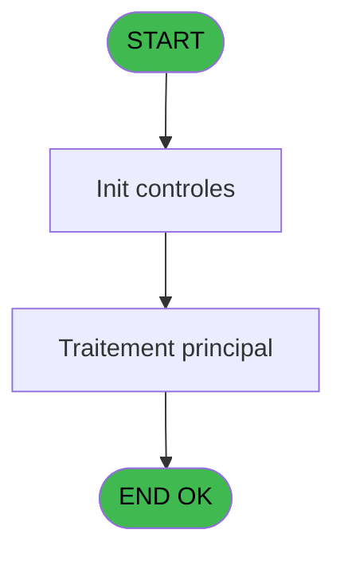
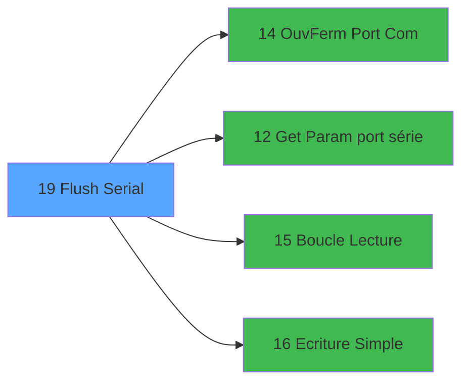

# QUA IDE 19 - Flush Serial

> **Analyse**: Phases 1-4 2026-02-03 20:20 -> 20:20 (14s) | Assemblage 20:20
> **Pipeline**: V7.2 Enrichi
> **Structure**: 4 onglets (Resume | Ecrans | Donnees | Connexions)

<!-- TAB:Resume -->

## 1. FICHE D'IDENTITE

| Attribut | Valeur |
|----------|--------|
| Projet | QUA |
| IDE Position | 19 |
| Nom Programme | Flush Serial |
| Fichier source | `Prg_19.xml` |
| Dossier IDE | Port |
| Taches | 1 (1 ecrans visibles) |
| Tables modifiees | 0 |
| Programmes appeles | 4 |
| :warning: Statut | **ORPHELIN_POTENTIEL** |

## 2. DESCRIPTION FONCTIONNELLE

**Flush Serial** assure la gestion complete de ce processus.

Le flux de traitement s'organise en **1 blocs fonctionnels** :

- **Traitement** (1 tache) : traitements metier divers

## 3. BLOCS FONCTIONNELS

### 3.1 Traitement (1 tache)

Traitements internes.

---

#### 19 - Flush Serial [[ECRAN]](#ecran-t1)

**Role** : Traitement : Flush Serial.
**Ecran** : 750 x 242 DLU | [Voir mockup](#ecran-t1)
**Delegue a** : [Ouv/Ferm Port Com (IDE 14)](QUA-IDE-14.md), [Get Param port série (IDE 12)](QUA-IDE-12.md), [Boucle Lecture (IDE 15)](QUA-IDE-15.md)

## 5. REGLES METIER

*(Aucune regle metier identifiee)*

## 6. CONTEXTE

- **Appele par**: (aucun)
- **Appelle**: 4 programmes | **Tables**: 0 (W:0 R:0 L:0) | **Taches**: 1 | **Expressions**: 14

<!-- TAB:Ecrans -->

## 8. ECRANS

### 8.1 Forms visibles (1 / 1)

| # | Position | Tache | Nom | Type | Largeur | Hauteur | Bloc |
|---|----------|-------|-----|------|---------|---------|------|
| 1 | 19 | 19 | Flush Serial | Type0 | 750 | 242 | Traitement |

### 8.2 Mockups Ecrans

---

#### 19 - Flush Serial
**Tache** : [19](#t1) | **Type** : Type0 | **Dimensions** : 750 x 242 DLU
**Bloc** : Traitement | **Titre IDE** : Flush Serial

<!-- FORM-DATA:
{
    "width":  750,
    "vFactor":  8,
    "type":  "Type0",
    "hFactor":  4,
    "controls":  [
                     {
                         "x":  33,
                         "type":  "table",
                         "var":  "",
                         "name":  "",
                         "titleH":  12,
                         "color":  "",
                         "w":  684,
                         "y":  8,
                         "fmt":  "",
                         "parent":  null,
                         "text":  "",
                         "rowH":  13,
                         "h":  224,
                         "cols":  [
                                      {
                                          "title":  "v.Nb Car",
                                          "layer":  1,
                                          "w":  37
                                      },
                                      {
                                          "title":  "v.Message Lu",
                                          "layer":  2,
                                          "w":  627
                                      }
                                  ],
                         "rows":  2
                     },
                     {
                         "x":  37,
                         "type":  "edit",
                         "var":  "",
                         "y":  23,
                         "w":  18,
                         "fmt":  "",
                         "name":  "v.Nb Car",
                         "h":  10,
                         "color":  "",
                         "text":  "",
                         "parent":  35
                     },
                     {
                         "x":  74,
                         "type":  "edit",
                         "var":  "",
                         "y":  23,
                         "w":  620,
                         "fmt":  "",
                         "name":  "v.Message Lu",
                         "h":  10,
                         "color":  "",
                         "text":  "",
                         "parent":  35
                     }
                 ],
    "taskId":  "19",
    "height":  242
}
-->

<strong>Champs : 2 champs</strong>

| Pos (x,y) | Nom | Variable | Type |
|-----------|-----|----------|------|
| 37,23 | v.Nb Car | - | edit |
| 74,23 | v.Message Lu | - | edit |

## 9. NAVIGATION

Ecran unique: **Flush Serial**

### 9.3 Structure hierarchique (1 tache)

| Position | Tache | Type | Dimensions | Bloc |
|----------|-------|------|------------|------|
| **19.1** | [**Flush Serial** (19)](#t1) [mockup](#ecran-t1) | - | 750x242 | Traitement |

### 9.4 Algorigramme

> **Legende**: Vert = START/END OK | Rouge = END KO | Bleu = Decisions
> *Algorigramme auto-genere. Utiliser `/algorigramme` pour une synthese metier detaillee.*

<!-- TAB:Donnees -->

## 10. TABLES

### Tables utilisees (0)

| ID | Nom | Description | Type | R | W | L | Usages |
|----|-----|-------------|------|---|---|---|--------|

### Colonnes par table (0 / 0 tables avec colonnes identifiees)

## 11. VARIABLES

### 11.1 Variables de session (6)

Variables persistantes pendant toute la session.

| Lettre | Nom | Type | Usage dans |
|--------|-----|------|-----------|
| K | v.ACK | Alpha | - |
| L | v.NAK | Alpha | - |
| M | v.ETX | Alpha | - |
| N | v.STX | Alpha | - |
| O | v.Message Lu | Alpha | - |
| P | v.Nb Car | Numeric | - |

### 11.2 Autres (10)

Variables diverses.

| Lettre | Nom | Type | Usage dans |
|--------|-----|------|-----------|
| A | Port COM | Numeric | - |
| B | Vitesse | Numeric | - |
| C | Parite | Alpha | - |
| D | Bit Arret | Alpha | - |
| E | Bit Donnee | Alpha | - |
| F | Version | Alpha | - |
| G | Windows Handle | Numeric | - |
| H | Magic Windows Handle | Numeric | - |
| I | Statut Ouverture | Numeric | - |
| J | Statut Fermeture | Numeric | - |

Toutes les 16 variables (liste complete)

| Cat | Lettre | Nom Variable | Type |
|-----|--------|--------------|------|
| V. | **K** | v.ACK | Alpha |
| V. | **L** | v.NAK | Alpha |
| V. | **M** | v.ETX | Alpha |
| V. | **N** | v.STX | Alpha |
| V. | **O** | v.Message Lu | Alpha |
| V. | **P** | v.Nb Car | Numeric |
| Autre | **A** | Port COM | Numeric |
| Autre | **B** | Vitesse | Numeric |
| Autre | **C** | Parite | Alpha |
| Autre | **D** | Bit Arret | Alpha |
| Autre | **E** | Bit Donnee | Alpha |
| Autre | **F** | Version | Alpha |
| Autre | **G** | Windows Handle | Numeric |
| Autre | **H** | Magic Windows Handle | Numeric |
| Autre | **I** | Statut Ouverture | Numeric |
| Autre | **J** | Statut Fermeture | Numeric |

## 12. EXPRESSIONS

**14 / 14 expressions decodees (100%)**

### 12.1 Repartition par type

| Type | Expressions | Regles |
|------|-------------|--------|
| CONSTANTE | 7 | 0 |
| OTHER | 5 | 0 |
| CONCATENATION | 1 | 0 |
| CONDITION | 1 | 0 |

### 12.2 Expressions cles par type

#### CONSTANTE (7 expressions)

| Type | IDE | Expression | Regle |
|------|-----|------------|-------|
| CONSTANTE | 11 | `2` | - |
| CONSTANTE | 12 | `400` | - |
| CONSTANTE | 14 | `'V'` | - |
| CONSTANTE | 10 | `'O'` | - |
| CONSTANTE | 1 | `1` | - |
| ... | | *+2 autres* | |

#### OTHER (5 expressions)

| Type | IDE | Expression | Regle |
|------|-----|------------|-------|
| OTHER | 5 | `ASCIIChr (2)` | - |
| OTHER | 6 | `WinHWND (0)` | - |
| OTHER | 4 | `ASCIIChr (3)` | - |
| OTHER | 2 | `ASCIIChr (6)` | - |
| OTHER | 3 | `ASCIIChr (21)` | - |

#### CONCATENATION (1 expressions)

| Type | IDE | Expression | Regle |
|------|-----|------------|-------|
| CONCATENATION | 7 | `'@'&Translate('%dll%')&'scomm.dll.sc_init'` | - |

#### CONDITION (1 expressions)

| Type | IDE | Expression | Regle |
|------|-----|------------|-------|
| CONDITION | 13 | `Counter(0)=1000` | - |

<!-- TAB:Connexions -->

## 13. GRAPHE D'APPELS

### 13.1 Chaine depuis Main (Callers)

**Chemin**: (pas de callers directs)

### 13.2 Callers

| IDE | Nom Programme | Nb Appels |
|-----|---------------|-----------|
| - | (aucun) | - |

### 13.3 Callees (programmes appeles)

### 13.4 Detail Callees avec contexte

| IDE | Nom Programme | Appels | Contexte |
|-----|---------------|--------|----------|
| [14](QUA-IDE-14.md) | Ouv/Ferm Port Com | 3 | Sous-programme |
| [12](QUA-IDE-12.md) | Get Param port série | 1 | Recuperation donnees |
| [15](QUA-IDE-15.md) | Boucle Lecture | 1 | Sous-programme |
| [16](QUA-IDE-16.md) | Ecriture Simple | 1 | Sous-programme |

## 14. RECOMMANDATIONS MIGRATION

### 14.1 Profil du programme

| Metrique | Valeur | Impact migration |
|----------|--------|-----------------|
| Lignes de logique | 45 | Programme compact |
| Expressions | 14 | Peu de logique |
| Tables WRITE | 0 | Impact faible |
| Sous-programmes | 4 | Peu de dependances |
| Ecrans visibles | 1 | Ecran unique ou traitement batch |
| Code desactive | 0% (0 / 45) | Code sain |
| Regles metier | 0 | Pas de regle identifiee |

### 14.2 Plan de migration par bloc

#### Traitement (1 tache: 1 ecran, 0 traitement)

- **Strategie** : 1 composant(s) UI (Razor/React) avec formulaires et validation.
- 4 sous-programme(s) a migrer ou a reutiliser depuis les services existants.
- Decomposer les taches en services unitaires testables.

### 14.3 Dependances critiques

| Dependance | Type | Appels | Impact |
|------------|------|--------|--------|
| [Ouv/Ferm Port Com (IDE 14)](QUA-IDE-14.md) | Sous-programme | 3x | **CRITIQUE** - Sous-programme |
| [Ecriture Simple (IDE 16)](QUA-IDE-16.md) | Sous-programme | 1x | Normale - Sous-programme |
| [Boucle Lecture (IDE 15)](QUA-IDE-15.md) | Sous-programme | 1x | Normale - Sous-programme |
| [Get Param port série (IDE 12)](QUA-IDE-12.md) | Sous-programme | 1x | Normale - Recuperation donnees |

---
*Spec DETAILED generee par Pipeline V7.2 - 2026-02-03 20:20*
