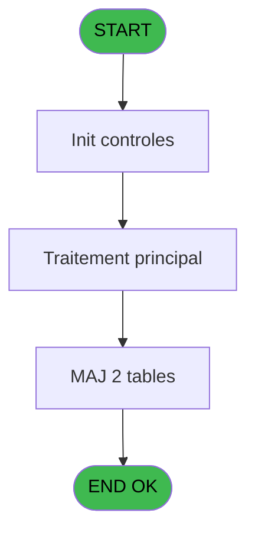
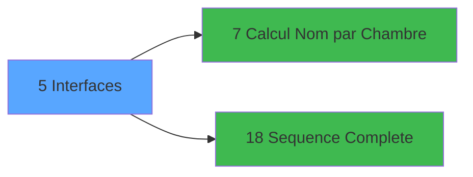

# QUA IDE 5 - Interfaces

> **Analyse**: Phases 1-4 2026-02-03 20:15 -> 20:15 (13s) | Assemblage 20:15
> **Pipeline**: V7.2 Enrichi
> **Structure**: 4 onglets (Resume | Ecrans | Donnees | Connexions)

<!-- TAB:Resume -->

## 1. FICHE D'IDENTITE

| Attribut | Valeur |
|----------|--------|
| Projet | QUA |
| IDE Position | 5 |
| Nom Programme | Interfaces |
| Fichier source | `Prg_5.xml` |
| Dossier IDE | Interfaces |
| Taches | 6 (1 ecrans visibles) |
| Tables modifiees | 2 |
| Programmes appeles | 2 |

## 2. DESCRIPTION FONCTIONNELLE

**Interfaces** assure la gestion complete de ce processus, accessible depuis [Main Program (IDE 1)](QUA-IDE-1.md).

Le flux de traitement s'organise en **2 blocs fonctionnels** :

- **Traitement** (5 taches) : traitements metier divers
- **Validation** (1 tache) : controles et verifications de coherence

**Donnees modifiees** : 2 tables en ecriture (heure_de_passage_inform, vente_par_moyen_paiement).

**Logique metier** : 1 regles identifiees couvrant conditions metier.

Detail : phases du traitement

#### Phase 1 : Traitement (5 taches)

- **5** - Interfaces **[[ECRAN]](#ecran-t1)**
- **5.1.1** - Maj Demandes Quadriga
- **5.2** - Attente 10
- **5.3** - Mise a Jour Log Passage
- **5.4** - Lecture Parametres Generaux

Delegue a : [Sequence Complete (IDE 18)](QUA-IDE-18.md)

#### Phase 2 : Validation (1 tache)

- **5.1** - Verif Demandes Quadriga **[[ECRAN]](#ecran-t2)**

#### Tables impactees

| Table | Operations | Role metier |
|-------|-----------|-------------|
| heure_de_passage_inform | **W** (1 usages) |  |
| vente_par_moyen_paiement | **W** (1 usages) | Donnees de ventes |

## 3. BLOCS FONCTIONNELS

### 3.1 Traitement (5 taches)

Traitements internes.

---

#### 5 - Interfaces [[ECRAN]](#ecran-t1)

**Role** : Traitement : Interfaces.
**Ecran** : 784 x 130 DLU | [Voir mockup](#ecran-t1)

4 sous-taches directes

| Tache | Nom | Bloc |
|-------|-----|------|
| [5.1.1](#t3) | Maj Demandes Quadriga | Traitement |
| [5.2](#t4) | Attente 10 | Traitement |
| [5.3](#t5) | Mise a Jour Log Passage | Traitement |
| [5.4](#t6) | Lecture Parametres Generaux | Traitement |

**Delegue a** : [Sequence Complete (IDE 18)](QUA-IDE-18.md)

---

#### 5.1.1 - Maj Demandes Quadriga

**Role** : Traitement : Maj Demandes Quadriga.
**Delegue a** : [Sequence Complete (IDE 18)](QUA-IDE-18.md)

---

#### 5.2 - Attente 10

**Role** : Traitement : Attente 10.
**Delegue a** : [Sequence Complete (IDE 18)](QUA-IDE-18.md)

---

#### 5.3 - Mise a Jour Log Passage

**Role** : Traitement : Mise a Jour Log Passage.
**Delegue a** : [Sequence Complete (IDE 18)](QUA-IDE-18.md)

---

#### 5.4 - Lecture Parametres Generaux

**Role** : Traitement : Lecture Parametres Generaux.
**Delegue a** : [Sequence Complete (IDE 18)](QUA-IDE-18.md)

### 3.2 Validation (1 tache)

Controles de coherence : 1 tache verifie les donnees et conditions.

---

#### 5.1 - Verif Demandes Quadriga [[ECRAN]](#ecran-t2)

**Role** : Verification : Verif Demandes Quadriga.
**Ecran** : 120 x 195 DLU | [Voir mockup](#ecran-t2)

## 5. REGLES METIER

1 regles identifiees:

### Autres (1 regles)

#### [RM-001] Si v. Nb Boucles [D]=9999999999 alors 1 sinon v. Nb Boucles [D]+1)

| Element | Detail |
|---------|--------|
| **Condition** | `v. Nb Boucles [D]=9999999999` |
| **Si vrai** | 1 |
| **Si faux** | v. Nb Boucles [D]+1) |
| **Variables** | D (v. Nb Boucles) |
| **Expression source** | Expression 5 : `IF(v. Nb Boucles [D]=9999999999,1,v. Nb Boucles [D]+1)` |
| **Exemple** | Si v. Nb Boucles [D]=9999999999 → 1. Sinon → v. Nb Boucles [D]+1) |

## 6. CONTEXTE

- **Appele par**: [Main Program (IDE 1)](QUA-IDE-1.md)
- **Appelle**: 2 programmes | **Tables**: 3 (W:2 R:1 L:0) | **Taches**: 6 | **Expressions**: 13

<!-- TAB:Ecrans -->

## 8. ECRANS

### 8.1 Forms visibles (1 / 6)

| # | Position | Tache | Nom | Type | Largeur | Hauteur | Bloc |
|---|----------|-------|-----|------|---------|---------|------|
| 1 | 5 | 5 | Interfaces | Type0 | 784 | 130 | Traitement |

### 8.2 Mockups Ecrans

---

#### 5 - Interfaces
**Tache** : [5](#t1) | **Type** : Type0 | **Dimensions** : 784 x 130 DLU
**Bloc** : Traitement | **Titre IDE** : Interfaces

<!-- FORM-DATA:
{
    "width":  784,
    "vFactor":  8,
    "type":  "Type0",
    "hFactor":  8,
    "controls":  [
                     {
                         "x":  579,
                         "type":  "label",
                         "var":  "",
                         "y":  1,
                         "w":  200,
                         "fmt":  "",
                         "name":  "",
                         "h":  8,
                         "color":  "143",
                         "text":  "V.1.10 du 11/12/2014",
                         "parent":  null
                     },
                     {
                         "x":  248,
                         "type":  "label",
                         "var":  "",
                         "y":  8,
                         "w":  290,
                         "fmt":  "",
                         "name":  "",
                         "h":  8,
                         "color":  "7",
                         "text":  "POOLING V.O.D.",
                         "parent":  null
                     },
                     {
                         "x":  14,
                         "type":  "line",
                         "var":  "",
                         "y":  26,
                         "w":  757,
                         "fmt":  "",
                         "name":  "",
                         "h":  0,
                         "color":  "",
                         "text":  "",
                         "parent":  null
                     },
                     {
                         "x":  15,
                         "type":  "label",
                         "var":  "",
                         "y":  33,
                         "w":  754,
                         "fmt":  "",
                         "name":  "",
                         "h":  64,
                         "color":  "",
                         "text":  "",
                         "parent":  null
                     },
                     {
                         "x":  26,
                         "type":  "label",
                         "var":  "",
                         "y":  36,
                         "w":  72,
                         "fmt":  "",
                         "name":  "",
                         "h":  8,
                         "color":  "",
                         "text":  "Boucles",
                         "parent":  6
                     },
                     {
                         "x":  26,
                         "type":  "label",
                         "var":  "",
                         "y":  46,
                         "w":  120,
                         "fmt":  "",
                         "name":  "",
                         "h":  8,
                         "color":  "",
                         "text":  "Debut Session",
                         "parent":  6
                     },
                     {
                         "x":  26,
                         "type":  "label",
                         "var":  "",
                         "y":  56,
                         "w":  167,
                         "fmt":  "",
                         "name":  "",
                         "h":  8,
                         "color":  "",
                         "text":  "Nombre Demandes",
                         "parent":  6
                     },
                     {
                         "x":  6,
                         "type":  "label",
                         "var":  "",
                         "y":  103,
                         "w":  773,
                         "fmt":  "",
                         "name":  "",
                         "h":  23,
                         "color":  "",
                         "text":  "",
                         "parent":  null
                     },
                     {
                         "x":  26,
                         "type":  "label",
                         "var":  "",
                         "y":  69,
                         "w":  167,
                         "fmt":  "",
                         "name":  "",
                         "h":  8,
                         "color":  "",
                         "text":  "Demandes Réussies",
                         "parent":  6
                     },
                     {
                         "x":  26,
                         "type":  "label",
                         "var":  "",
                         "y":  82,
                         "w":  167,
                         "fmt":  "",
                         "name":  "",
                         "h":  8,
                         "color":  "",
                         "text":  "Demandes Echouées",
                         "parent":  6
                     },
                     {
                         "x":  10,
                         "type":  "image",
                         "var":  "",
                         "y":  1,
                         "w":  72,
                         "fmt":  "",
                         "name":  "",
                         "h":  25,
                         "color":  "",
                         "text":  "",
                         "parent":  null
                     },
                     {
                         "x":  173,
                         "type":  "edit",
                         "var":  "",
                         "y":  34,
                         "w":  176,
                         "fmt":  "",
                         "name":  "v. Nb Boucles",
                         "h":  8,
                         "color":  "",
                         "text":  "",
                         "parent":  6
                     },
                     {
                         "x":  562,
                         "type":  "edit",
                         "var":  "",
                         "y":  34,
                         "w":  200,
                         "fmt":  "30",
                         "name":  "",
                         "h":  8,
                         "color":  "152",
                         "text":  "",
                         "parent":  6
                     },
                     {
                         "x":  247,
                         "type":  "edit",
                         "var":  "",
                         "y":  44,
                         "w":  120,
                         "fmt":  "",
                         "name":  "v.Date Lancement",
                         "h":  8,
                         "color":  "",
                         "text":  "",
                         "parent":  6
                     },
                     {
                         "x":  373,
                         "type":  "edit",
                         "var":  "",
                         "y":  44,
                         "w":  98,
                         "fmt":  "",
                         "name":  "v.Heure Lancement",
                         "h":  8,
                         "color":  "",
                         "text":  "",
                         "parent":  6
                     },
                     {
                         "x":  562,
                         "type":  "edit",
                         "var":  "",
                         "y":  44,
                         "w":  200,
                         "fmt":  "30",
                         "name":  "",
                         "h":  8,
                         "color":  "152",
                         "text":  "",
                         "parent":  6
                     },
                     {
                         "x":  201,
                         "type":  "edit",
                         "var":  "",
                         "y":  56,
                         "w":  155,
                         "fmt":  "",
                         "name":  "v.Nb Transactions",
                         "h":  8,
                         "color":  "",
                         "text":  "",
                         "parent":  6
                     },
                     {
                         "x":  201,
                         "type":  "edit",
                         "var":  "",
                         "y":  69,
                         "w":  155,
                         "fmt":  "",
                         "name":  "v.Nb Transactions Validée_0001",
                         "h":  8,
                         "color":  "",
                         "text":  "",
                         "parent":  6
                     },
                     {
                         "x":  201,
                         "type":  "edit",
                         "var":  "",
                         "y":  82,
                         "w":  155,
                         "fmt":  "",
                         "name":  "v.Nb Transactions Echouée_0001",
                         "h":  8,
                         "color":  "",
                         "text":  "",
                         "parent":  6
                     },
                     {
                         "x":  14,
                         "type":  "button",
                         "var":  "",
                         "y":  106,
                         "w":  177,
                         "fmt":  "\u0026Quitter Pooling",
                         "name":  "",
                         "h":  18,
                         "color":  "",
                         "text":  "",
                         "parent":  62
                     },
                     {
                         "x":  198,
                         "type":  "button",
                         "var":  "",
                         "y":  106,
                         "w":  177,
                         "fmt":  "Quitter \u0026Traitement",
                         "name":  "b. Quitter Traitement",
                         "h":  18,
                         "color":  "",
                         "text":  "",
                         "parent":  62
                     }
                 ],
    "taskId":  "5",
    "height":  130
}
-->

<strong>Champs : 8 champs</strong>

| Pos (x,y) | Nom | Variable | Type |
|-----------|-----|----------|------|
| 173,34 | v. Nb Boucles | - | edit |
| 562,34 | 30 | - | edit |
| 247,44 | v.Date Lancement | - | edit |
| 373,44 | v.Heure Lancement | - | edit |
| 562,44 | 30 | - | edit |
| 201,56 | v.Nb Transactions | - | edit |
| 201,69 | v.Nb Transactions Validée_0001 | - | edit |
| 201,82 | v.Nb Transactions Echouée_0001 | - | edit |

<strong>Boutons : 2 boutons</strong>

| Bouton | Pos (x,y) | Action |
|--------|-----------|--------|
| Quitter Pooling | 14,106 | Quitte le programme |
| Quitter Traitement | 198,106 | Quitte le programme |

## 9. NAVIGATION

Ecran unique: **Interfaces**

### 9.3 Structure hierarchique (6 taches)

| Position | Tache | Type | Dimensions | Bloc |
|----------|-------|------|------------|------|
| **5.1** | [**Interfaces** (5)](#t1) [mockup](#ecran-t1) | - | 784x130 | Traitement |
| 5.1.1 | [Maj Demandes Quadriga (5.1.1)](#t3) | - | - | |
| 5.1.2 | [Attente 10 (5.2)](#t4) | - | - | |
| 5.1.3 | [Mise a Jour Log Passage (5.3)](#t5) | - | - | |
| 5.1.4 | [Lecture Parametres Generaux (5.4)](#t6) | - | - | |
| **5.2** | [**Verif Demandes Quadriga** (5.1)](#t2) [mockup](#ecran-t2) | - | 120x195 | Validation |

### 9.4 Algorigramme

> **Legende**: Vert = START/END OK | Rouge = END KO | Bleu = Decisions
> *Algorigramme auto-genere. Utiliser `/algorigramme` pour une synthese metier detaillee.*

<!-- TAB:Donnees -->

## 10. TABLES

### Tables utilisees (3)

| ID | Nom | Description | Type | R | W | L | Usages |
|----|-----|-------------|------|---|---|---|--------|
| 464 | heure_de_passage_inform |  | DB |   | **W** |   | 1 |
| 707 | parametre_generaux |  | DB | R |   |   | 1 |
| 805 | vente_par_moyen_paiement | Donnees de ventes | DB |   | **W** |   | 1 |

### Colonnes par table (2 / 3 tables avec colonnes identifiees)

Table 464 - heure_de_passage_inform (**W**) - 1 usages

| Lettre | Variable | Acces | Type |
|--------|----------|-------|------|
| B | v.Heure Lancement | W | Time |
| C | v. Heure Arrêt | W | Time |
| H | v.Heure Debut Exclusion | W | Time |
| I | v.Heure Fin Exclusion | W | Time |

Table 707 - parametre_generaux (R) - 1 usages

*Table utilisee uniquement en Link ou aucune colonne Real identifiee dans le DataView.*

Table 805 - vente_par_moyen_paiement (**W**) - 1 usages

| Lettre | Variable | Acces | Type |
|--------|----------|-------|------|
| A | quc_num_chambre | W | Unicode |
| B | quc_date_demande | W | Alpha |
| C | quc_heure_demande | W | Alpha |
| D | Nom | W | Alpha |
| E | Compte | W | Numeric |
| F | Langue | W | Alpha |
| G | Statut Sequence | W | Logical |

## 11. VARIABLES

### 11.1 Variables de session (10)

Variables persistantes pendant toute la session.

| Lettre | Nom | Type | Usage dans |
|--------|-----|------|-----------|
| A | v.Date Lancement | Date | - |
| B | v.Heure Lancement | Time | - |
| C | v. Heure Arrêt | Time | 3x session |
| D | v. Nb Boucles | Numeric | 1x session |
| E | v.Nb Transactions | Numeric | - |
| F | v.Nb Transactions Validées | Numeric | - |
| G | v.Nb Transactions Echouées | Numeric | - |
| H | v.Heure Debut Exclusion | Time | - |
| I | v.Heure Fin Exclusion | Time | 2x session |
| J | v.Fin Tâche | Logical | - |

## 12. EXPRESSIONS

**13 / 13 expressions decodees (100%)**

### 12.1 Repartition par type

| Type | Expressions | Regles |
|------|-------------|--------|
| CONDITION | 1 | 5 |
| DATE | 1 | 0 |
| OTHER | 5 | 0 |
| CAST_LOGIQUE | 2 | 0 |
| STRING | 3 | 0 |
| CONCATENATION | 1 | 0 |

### 12.2 Expressions cles par type

#### CONDITION (1 expressions)

| Type | IDE | Expression | Regle |
|------|-----|------------|-------|
| CONDITION | 5 | `IF(v. Nb Boucles [D]=9999999999,1,v. Nb Boucles [D]+1)` | [RM-001](#rm-RM-001) |

#### DATE (1 expressions)

| Type | IDE | Expression | Regle |
|------|-----|------------|-------|
| DATE | 2 | `Date()` | - |

#### OTHER (5 expressions)

| Type | IDE | Expression | Regle |
|------|-----|------------|-------|
| OTHER | 8 | `NOT(v.Heure Fin Exclusion [I])` | - |
| OTHER | 12 | `NOT(Range(Time(),[K],[L]))` | - |
| OTHER | 7 | `Range(Time(),v. Heure Arrêt [C],AddTime(v. Heure Arrêt [C],0,15,0))` | - |
| OTHER | 1 | `v.Heure Fin Exclusion [I]` | - |
| OTHER | 3 | `Time()` | - |

#### CAST_LOGIQUE (2 expressions)

| Type | IDE | Expression | Regle |
|------|-----|------------|-------|
| CAST_LOGIQUE | 11 | `'TRUE'LOG` | - |
| CAST_LOGIQUE | 6 | `'TRUE'LOG` | - |

#### STRING (3 expressions)

| Type | IDE | Expression | Regle |
|------|-----|------------|-------|
| STRING | 10 | `'Système relance à '&TStr (AddTime (v. Heure Arrêt [C],0,10,0),'HH:MM')` | - |
| STRING | 9 | `'Système s''arrête à '&TStr (v. Heure Arrêt [C],'HH:MM')` | - |
| STRING | 4 | `TVal (INIGet ('[MAGIC_LOGICAL_NAMES]club_pool_stop'),'HH:MM')` | - |

#### CONCATENATION (1 expressions)

| Type | IDE | Expression | Regle |
|------|-----|------------|-------|
| CONCATENATION | 13 | `'V '&Trim(VG1)&MlsTrans(' du ')&Trim(VG2)` | - |

<!-- TAB:Connexions -->

## 13. GRAPHE D'APPELS

### 13.1 Chaine depuis Main (Callers)

Main -> ... -> [Main Program (IDE 1)](QUA-IDE-1.md) -> **Interfaces (IDE 5)**

### 13.2 Callers

| IDE | Nom Programme | Nb Appels |
|-----|---------------|-----------|
| [1](QUA-IDE-1.md) | Main Program | 1 |

### 13.3 Callees (programmes appeles)

### 13.4 Detail Callees avec contexte

| IDE | Nom Programme | Appels | Contexte |
|-----|---------------|--------|----------|
| [7](QUA-IDE-7.md) | Calcul Nom par Chambre | 1 | Calcul de donnees |
| [18](QUA-IDE-18.md) | Sequence Complete | 1 | Sous-programme |

## 14. RECOMMANDATIONS MIGRATION

### 14.1 Profil du programme

| Metrique | Valeur | Impact migration |
|----------|--------|-----------------|
| Lignes de logique | 108 | Programme compact |
| Expressions | 13 | Peu de logique |
| Tables WRITE | 2 | Impact faible |
| Sous-programmes | 2 | Peu de dependances |
| Ecrans visibles | 1 | Ecran unique ou traitement batch |
| Code desactive | 0.9% (1 / 108) | Code sain |
| Regles metier | 1 | Quelques regles a preserver |

### 14.2 Plan de migration par bloc

#### Traitement (5 taches: 1 ecran, 4 traitements)

- **Strategie** : Orchestrateur avec 1 ecrans (Razor/React) et 4 traitements backend (services).
- Les ecrans deviennent des composants UI, les traitements invisibles deviennent des services injectables.
- 2 sous-programme(s) a migrer ou a reutiliser depuis les services existants.
- Decomposer les taches en services unitaires testables.

#### Validation (1 tache: 1 ecran, 0 traitement)

- **Strategie** : FluentValidation avec validators specifiques.
- Chaque tache de validation -> un validator injectable

### 14.3 Dependances critiques

| Dependance | Type | Appels | Impact |
|------------|------|--------|--------|
| heure_de_passage_inform | Table WRITE (Database) | 1x | Schema + repository |
| vente_par_moyen_paiement | Table WRITE (Database) | 1x | Schema + repository |
| [Sequence Complete (IDE 18)](QUA-IDE-18.md) | Sous-programme | 1x | Normale - Sous-programme |
| [Calcul Nom par Chambre (IDE 7)](QUA-IDE-7.md) | Sous-programme | 1x | Normale - Calcul de donnees |

---
*Spec DETAILED generee par Pipeline V7.2 - 2026-02-03 20:15*
