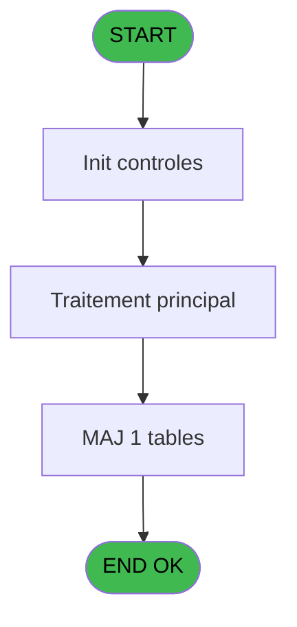
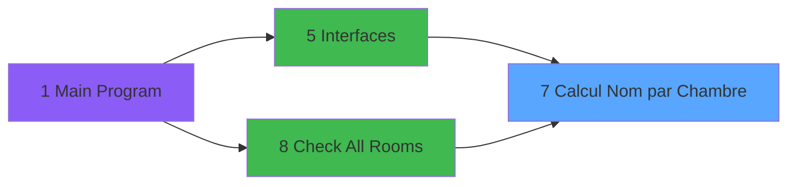

# QUA IDE 7 - Calcul Nom par Chambre

> **Analyse**: Phases 1-4 2026-02-03 20:15 -> 20:16 (14s) | Assemblage 20:16
> **Pipeline**: V7.2 Enrichi
> **Structure**: 4 onglets (Resume | Ecrans | Donnees | Connexions)

<!-- TAB:Resume -->

## 1. FICHE D'IDENTITE

| Attribut | Valeur |
|----------|--------|
| Projet | QUA |
| IDE Position | 7 |
| Nom Programme | Calcul Nom par Chambre |
| Fichier source | `Prg_7.xml` |
| Dossier IDE | Interfaces |
| Taches | 2 (0 ecrans visibles) |
| Tables modifiees | 1 |
| Programmes appeles | 0 |

## 2. DESCRIPTION FONCTIONNELLE

**Calcul Nom par Chambre** assure la gestion complete de ce processus, accessible depuis [Interfaces (IDE 5)](QUA-IDE-5.md), [Check All Rooms (IDE 8)](QUA-IDE-8.md).

Le flux de traitement s'organise en **1 blocs fonctionnels** :

- **Calcul** (2 taches) : calculs de montants, stocks ou compteurs

**Donnees modifiees** : 1 tables en ecriture (histoticket_dat).

## 3. BLOCS FONCTIONNELS

### 3.1 Calcul (2 taches)

Calculs metier : montants, stocks, compteurs.

---

#### 7 - Calcul Nom par Chambre [[ECRAN]](#ecran-t1)

**Role** : Calcul : Calcul Nom par Chambre.
**Ecran** : 442 x 297 DLU | [Voir mockup](#ecran-t1)
**Variables liees** : A (Prm - Chambre)

---

#### 7.1 - Calcul Chaine

**Role** : Calcul : Calcul Chaine.

## 5. REGLES METIER

*(Aucune regle metier identifiee)*

## 6. CONTEXTE

- **Appele par**: [Interfaces (IDE 5)](QUA-IDE-5.md), [Check All Rooms (IDE 8)](QUA-IDE-8.md)
- **Appelle**: 0 programmes | **Tables**: 5 (W:1 R:0 L:4) | **Taches**: 2 | **Expressions**: 19

<!-- TAB:Ecrans -->

## 8. ECRANS

*(Programme sans ecran visible)*

## 9. NAVIGATION

### 9.3 Structure hierarchique (2 taches)

| Position | Tache | Type | Dimensions | Bloc |
|----------|-------|------|------------|------|
| **7.1** | [**Calcul Nom par Chambre** (7)](#t1) [mockup](#ecran-t1) | - | 442x297 | Calcul |
| 7.1.1 | [Calcul Chaine (7.1)](#t2) | - | - | |

### 9.4 Algorigramme

> **Legende**: Vert = START/END OK | Rouge = END KO | Bleu = Decisions
> *Algorigramme auto-genere. Utiliser `/algorigramme` pour une synthese metier detaillee.*

<!-- TAB:Donnees -->

## 10. TABLES

### Tables utilisees (5)

| ID | Nom | Description | Type | R | W | L | Usages |
|----|-----|-------------|------|---|---|---|--------|
| 1 | histoticket_dat | Historique / journal | DB |   | **W** |   | 2 |
| 30 | gm-recherche_____gmr | Index de recherche | DB |   |   | L | 1 |
| 31 | gm-complet_______gmc |  | DB |   |   | L | 1 |
| 34 | hebergement______heb | Hebergement (chambres) | DB |   |   | L | 1 |
| 130 | fichier_langue |  | DB |   |   | L | 1 |

### Colonnes par table (2 / 1 tables avec colonnes identifiees)

Table 1 - histoticket_dat (**W**) - 2 usages

| Lettre | Variable | Acces | Type |
|--------|----------|-------|------|
| A | Prm - Chambre | W | Unicode |
| B | Prm - Nom | W | Alpha |
| C | Prm - Compte | W | Numeric |
| D | Prm - Langue | W | Alpha |
| E | Nom 3 | W | Alpha |
| F | Prenom 3 | W | Alpha |

## 11. VARIABLES

### 11.1 Autres (6)

Variables diverses.

| Lettre | Nom | Type | Usage dans |
|--------|-----|------|-----------|
| A | Prm - Chambre | Unicode | [7](#t1) |
| B | Prm - Nom | Alpha | - |
| C | Prm - Compte | Numeric | 1x refs |
| D | Prm - Langue | Alpha | 2x refs |
| E | Nom 3 | Alpha | 1x refs |
| F | Prenom 3 | Alpha | - |

## 12. EXPRESSIONS

**19 / 19 expressions decodees (100%)**

### 12.1 Repartition par type

| Type | Expressions | Regles |
|------|-------------|--------|
| CONSTANTE | 3 | 0 |
| DATE | 2 | 0 |
| OTHER | 12 | 0 |
| CONDITION | 1 | 0 |
| STRING | 1 | 0 |

### 12.2 Expressions cles par type

#### CONSTANTE (3 expressions)

| Type | IDE | Expression | Regle |
|------|-----|------------|-------|
| CONSTANTE | 18 | `' '` | - |
| CONSTANTE | 2 | `'P'` | - |
| CONSTANTE | 1 | `'H'` | - |

#### DATE (2 expressions)

| Type | IDE | Expression | Regle |
|------|-----|------------|-------|
| DATE | 4 | `Date()+1` | - |
| DATE | 3 | `Date()` | - |

#### OTHER (12 expressions)

| Type | IDE | Expression | Regle |
|------|-----|------------|-------|
| OTHER | 13 | `[X]` | - |
| OTHER | 12 | `[S]` | - |
| OTHER | 11 | `[AE]` | - |
| OTHER | 19 | `Counter(0)` | - |
| OTHER | 16 | `NOT(ExpCalc('13'EXP))` | - |
| ... | | *+7 autres* | |

#### CONDITION (1 expressions)

| Type | IDE | Expression | Regle |
|------|-----|------------|-------|
| CONDITION | 15 | `Counter(0)>0 AND Prm - Langue [D]<>0` | - |

#### STRING (1 expressions)

| Type | IDE | Expression | Regle |
|------|-----|------------|-------|
| STRING | 17 | `'Room '&Trim(Prm - Chambre [A])` | - |

<!-- TAB:Connexions -->

## 13. GRAPHE D'APPELS

### 13.1 Chaine depuis Main (Callers)

Main -> ... -> [Interfaces (IDE 5)](QUA-IDE-5.md) -> **Calcul Nom par Chambre (IDE 7)**

Main -> ... -> [Check All Rooms (IDE 8)](QUA-IDE-8.md) -> **Calcul Nom par Chambre (IDE 7)**

### 13.2 Callers

| IDE | Nom Programme | Nb Appels |
|-----|---------------|-----------|
| [5](QUA-IDE-5.md) | Interfaces | 1 |
| [8](QUA-IDE-8.md) | Check All Rooms | 1 |

### 13.3 Callees (programmes appeles)

### 13.4 Detail Callees avec contexte

| IDE | Nom Programme | Appels | Contexte |
|-----|---------------|--------|----------|
| - | (aucun) | - | - |

## 14. RECOMMANDATIONS MIGRATION

### 14.1 Profil du programme

| Metrique | Valeur | Impact migration |
|----------|--------|-----------------|
| Lignes de logique | 107 | Programme compact |
| Expressions | 19 | Peu de logique |
| Tables WRITE | 1 | Impact faible |
| Sous-programmes | 0 | Peu de dependances |
| Ecrans visibles | 0 | Ecran unique ou traitement batch |
| Code desactive | 0% (0 / 107) | Code sain |
| Regles metier | 0 | Pas de regle identifiee |

### 14.2 Plan de migration par bloc

#### Calcul (2 taches: 1 ecran, 1 traitement)

- **Strategie** : Services de calcul purs (Domain Services).
- Migrer la logique de calcul (stock, compteurs, montants)

### 14.3 Dependances critiques

| Dependance | Type | Appels | Impact |
|------------|------|--------|--------|
| histoticket_dat | Table WRITE (Database) | 2x | Schema + repository |

---
*Spec DETAILED generee par Pipeline V7.2 - 2026-02-03 20:16*
