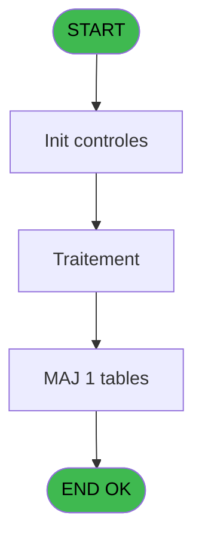
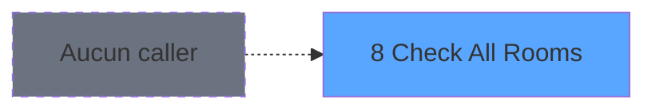
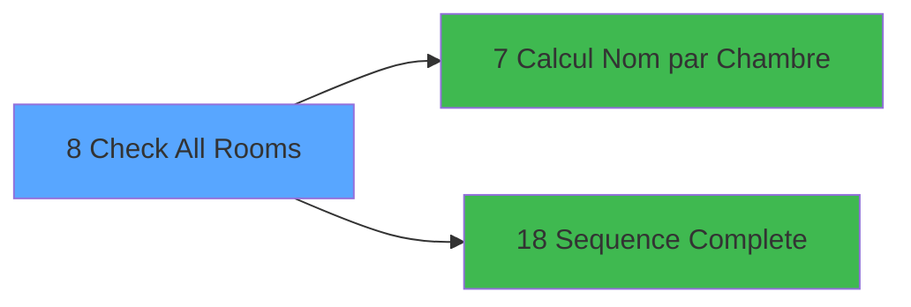

# QUA IDE 8 - Check All Rooms

> **Analyse**: Phases 1-4 2026-02-03 20:16 -> 20:16 (15s) | Assemblage 20:16
> **Pipeline**: V7.2 Enrichi
> **Structure**: 4 onglets (Resume | Ecrans | Donnees | Connexions)

<!-- TAB:Resume -->

## 1. FICHE D'IDENTITE

| Attribut | Valeur |
|----------|--------|
| Projet | QUA |
| IDE Position | 8 |
| Nom Programme | Check All Rooms |
| Fichier source | `Prg_8.xml` |
| Dossier IDE | Interfaces |
| Taches | 3 (1 ecrans visibles) |
| Tables modifiees | 1 |
| Programmes appeles | 2 |
| :warning: Statut | **ORPHELIN_POTENTIEL** |

## 2. DESCRIPTION FONCTIONNELLE

**Check All Rooms** assure la gestion complete de ce processus.

Le flux de traitement s'organise en **2 blocs fonctionnels** :

- **Traitement** (2 taches) : traitements metier divers
- **Creation** (1 tache) : insertion d'enregistrements en base (mouvements, prestations)

**Donnees modifiees** : 1 tables en ecriture (temp_affec_chambre).

Detail : phases du traitement

#### Phase 1 : Traitement (2 taches)

- **8.1** - Check All Rooms
- **8** - Check All Rooms **[[ECRAN]](#ecran-t2)**

Delegue a : [Sequence Complete (IDE 18)](QUA-IDE-18.md)

#### Phase 2 : Creation (1 tache)

- **8.1.1** - Creation Demande si Erreur

#### Tables impactees

| Table | Operations | Role metier |
|-------|-----------|-------------|
| temp_affec_chambre | **W** (1 usages) |  |

## 3. BLOCS FONCTIONNELS

### 3.1 Traitement (2 taches)

Traitements internes.

---

#### 8.1 - Check All Rooms

**Role** : Traitement : Check All Rooms.
**Delegue a** : [Sequence Complete (IDE 18)](QUA-IDE-18.md)

---

#### 8 - Check All Rooms [[ECRAN]](#ecran-t2)

**Role** : Traitement : Check All Rooms.
**Ecran** : 430 x 77 DLU | [Voir mockup](#ecran-t2)
**Delegue a** : [Sequence Complete (IDE 18)](QUA-IDE-18.md)

### 3.2 Creation (1 tache)

Insertion de nouveaux enregistrements en base.

---

#### 8.1.1 - Creation Demande si Erreur

**Role** : Creation d'enregistrement : Creation Demande si Erreur.

## 5. REGLES METIER

*(Aucune regle metier identifiee)*

## 6. CONTEXTE

- **Appele par**: (aucun)
- **Appelle**: 2 programmes | **Tables**: 3 (W:1 R:1 L:1) | **Taches**: 3 | **Expressions**: 19

<!-- TAB:Ecrans -->

## 8. ECRANS

### 8.1 Forms visibles (1 / 3)

| # | Position | Tache | Nom | Type | Largeur | Hauteur | Bloc |
|---|----------|-------|-----|------|---------|---------|------|
| 1 | 8.1 | 8 | Check All Rooms | Type0 | 430 | 77 | Traitement |

### 8.2 Mockups Ecrans

---

#### 8.1 - Check All Rooms
**Tache** : [8](#t2) | **Type** : Type0 | **Dimensions** : 430 x 77 DLU
**Bloc** : Traitement | **Titre IDE** : Check All Rooms

<!-- FORM-DATA:
{
    "width":  430,
    "vFactor":  8,
    "type":  "Type0",
    "hFactor":  4,
    "controls":  [
                     {
                         "x":  17,
                         "type":  "label",
                         "var":  "",
                         "y":  24,
                         "w":  141,
                         "fmt":  "",
                         "name":  "",
                         "h":  9,
                         "color":  "",
                         "text":  "Ouverture de la chambre",
                         "parent":  null
                     },
                     {
                         "x":  240,
                         "type":  "label",
                         "var":  "",
                         "y":  24,
                         "w":  60,
                         "fmt":  "",
                         "name":  "",
                         "h":  9,
                         "color":  "",
                         "text":  "à la chambre",
                         "parent":  null
                     },
                     {
                         "x":  17,
                         "type":  "checkbox",
                         "var":  "",
                         "y":  8,
                         "w":  152,
                         "fmt":  "",
                         "name":  "Sans Check-Out",
                         "h":  12,
                         "color":  "",
                         "text":  "Uniquement les Présents",
                         "parent":  null
                     },
                     {
                         "x":  165,
                         "type":  "edit",
                         "var":  "",
                         "y":  24,
                         "w":  56,
                         "fmt":  "",
                         "name":  "Nb de Chambres",
                         "h":  10,
                         "color":  "",
                         "text":  "",
                         "parent":  null
                     },
                     {
                         "x":  308,
                         "type":  "edit",
                         "var":  "",
                         "y":  24,
                         "w":  56,
                         "fmt":  "",
                         "name":  "Chambre Fin",
                         "h":  10,
                         "color":  "",
                         "text":  "",
                         "parent":  null
                     },
                     {
                         "x":  17,
                         "type":  "button",
                         "var":  "",
                         "y":  56,
                         "w":  68,
                         "fmt":  "\u0026Lancer",
                         "name":  "",
                         "h":  14,
                         "color":  "",
                         "text":  "",
                         "parent":  null
                     },
                     {
                         "x":  345,
                         "type":  "button",
                         "var":  "",
                         "y":  56,
                         "w":  68,
                         "fmt":  "\u0026Quitter",
                         "name":  "",
                         "h":  14,
                         "color":  "",
                         "text":  "",
                         "parent":  null
                     }
                 ],
    "taskId":  "8.1",
    "height":  77
}
-->

<strong>Champs : 3 champs</strong>

| Pos (x,y) | Nom | Variable | Type |
|-----------|-----|----------|------|
| 17,8 | Sans Check-Out | - | checkbox |
| 165,24 | Nb de Chambres | - | edit |
| 308,24 | Chambre Fin | - | edit |

<strong>Boutons : 2 boutons</strong>

| Bouton | Pos (x,y) | Action |
|--------|-----------|--------|
| Lancer | 17,56 | Bouton fonctionnel |
| Quitter | 345,56 | Quitte le programme |

## 9. NAVIGATION

Ecran unique: **Check All Rooms**

### 9.3 Structure hierarchique (3 taches)

| Position | Tache | Type | Dimensions | Bloc |
|----------|-------|------|------------|------|
| **8.1** | [**Check All Rooms** (8.1)](#t1) | - | - | Traitement |
| 8.1.1 | [Check All Rooms (8)](#t2) [mockup](#ecran-t2) | - | 430x77 | |
| **8.2** | [**Creation Demande si Erreur** (8.1.1)](#t3) | - | - | Creation |

### 9.4 Algorigramme

> **Legende**: Vert = START/END OK | Rouge = END KO | Bleu = Decisions
> *Algorigramme auto-genere. Utiliser `/algorigramme` pour une synthese metier detaillee.*

<!-- TAB:Donnees -->

## 10. TABLES

### Tables utilisees (3)

| ID | Nom | Description | Type | R | W | L | Usages |
|----|-----|-------------|------|---|---|---|--------|
| 103 | logement_client__loc |  | DB | R |   |   | 1 |
| 779 | temp_affec_chambre |  | DB |   | **W** |   | 1 |
| 805 | vente_par_moyen_paiement | Donnees de ventes | DB |   |   | L | 1 |

### Colonnes par table (2 / 2 tables avec colonnes identifiees)

Table 103 - logement_client__loc (R) - 1 usages

| Lettre | Variable | Acces | Type |
|--------|----------|-------|------|
| A | Nom | R | Alpha |
| B | Compte | R | Numeric |
| C | Langue | R | Alpha |
| D | Statut Sequence | R | Logical |
| E | Lancement Sequence | R | Logical |

Table 779 - temp_affec_chambre (**W**) - 1 usages

| Lettre | Variable | Acces | Type |
|--------|----------|-------|------|
| C | Chambre Début | W | Unicode |
| D | Chambre Fin | W | Unicode |

## 11. VARIABLES

### 11.1 Autres (5)

Variables diverses.

| Lettre | Nom | Type | Usage dans |
|--------|-----|------|-----------|
| A | Nom | Alpha | 1x refs |
| B | Compte | Numeric | - |
| C | Langue | Alpha | 1x refs |
| D | Statut Sequence | Logical | 2x refs |
| E | Lancement Sequence | Logical | - |

## 12. EXPRESSIONS

**19 / 19 expressions decodees (100%)**

### 12.1 Repartition par type

| Type | Expressions | Regles |
|------|-------------|--------|
| CALCULATION | 1 | 0 |
| CONSTANTE | 3 | 0 |
| DATE | 1 | 0 |
| CAST_LOGIQUE | 2 | 0 |
| OTHER | 9 | 0 |
| CONDITION | 3 | 0 |

### 12.2 Expressions cles par type

#### CALCULATION (1 expressions)

| Type | IDE | Expression | Regle |
|------|-----|------------|-------|
| CALCULATION | 10 | `DbDel('{1,-1}'DSOURCE,'')` | - |

#### CONSTANTE (3 expressions)

| Type | IDE | Expression | Regle |
|------|-----|------------|-------|
| CONSTANTE | 5 | `' '` | - |
| CONSTANTE | 4 | `0` | - |
| CONSTANTE | 3 | `''` | - |

#### DATE (1 expressions)

| Type | IDE | Expression | Regle |
|------|-----|------------|-------|
| DATE | 7 | `Date()` | - |

#### CAST_LOGIQUE (2 expressions)

| Type | IDE | Expression | Regle |
|------|-----|------------|-------|
| CAST_LOGIQUE | 13 | `'FALSE'LOG` | - |
| CAST_LOGIQUE | 6 | `'TRUE'LOG` | - |

#### OTHER (9 expressions)

| Type | IDE | Expression | Regle |
|------|-----|------------|-------|
| OTHER | 17 | `[AB]` | - |
| OTHER | 16 | `Langue [C]` | - |
| OTHER | 19 | `Delay(10)` | - |
| OTHER | 18 | `NOT([V])` | - |
| OTHER | 15 | `Statut Sequence [D]` | - |
| ... | | *+4 autres* | |

#### CONDITION (3 expressions)

| Type | IDE | Expression | Regle |
|------|-----|------------|-------|
| CONDITION | 2 | `CndRange(Trim({1,3})<>'',{1,3})` | - |
| CONDITION | 1 | `CndRange(Trim({1,2})<>'',{1,2})` | - |
| CONDITION | 11 | `Statut Sequence [D]=0` | - |

<!-- TAB:Connexions -->

## 13. GRAPHE D'APPELS

### 13.1 Chaine depuis Main (Callers)

**Chemin**: (pas de callers directs)

### 13.2 Callers

| IDE | Nom Programme | Nb Appels |
|-----|---------------|-----------|
| - | (aucun) | - |

### 13.3 Callees (programmes appeles)

### 13.4 Detail Callees avec contexte

| IDE | Nom Programme | Appels | Contexte |
|-----|---------------|--------|----------|
| [7](QUA-IDE-7.md) | Calcul Nom par Chambre | 1 | Calcul de donnees |
| [18](QUA-IDE-18.md) | Sequence Complete | 1 | Sous-programme |

## 14. RECOMMANDATIONS MIGRATION

### 14.1 Profil du programme

| Metrique | Valeur | Impact migration |
|----------|--------|-----------------|
| Lignes de logique | 71 | Programme compact |
| Expressions | 19 | Peu de logique |
| Tables WRITE | 1 | Impact faible |
| Sous-programmes | 2 | Peu de dependances |
| Ecrans visibles | 1 | Ecran unique ou traitement batch |
| Code desactive | 0% (0 / 71) | Code sain |
| Regles metier | 0 | Pas de regle identifiee |

### 14.2 Plan de migration par bloc

#### Traitement (2 taches: 1 ecran, 1 traitement)

- **Strategie** : Orchestrateur avec 1 ecrans (Razor/React) et 1 traitements backend (services).
- Les ecrans deviennent des composants UI, les traitements invisibles deviennent des services injectables.
- 2 sous-programme(s) a migrer ou a reutiliser depuis les services existants.
- Decomposer les taches en services unitaires testables.

#### Creation (1 tache: 0 ecran, 1 traitement)

- **Strategie** : Repository pattern avec Entity Framework Core.
- Insertion via `IRepository<T>.CreateAsync()`

### 14.3 Dependances critiques

| Dependance | Type | Appels | Impact |
|------------|------|--------|--------|
| temp_affec_chambre | Table WRITE (Database) | 1x | Schema + repository |
| [Sequence Complete (IDE 18)](QUA-IDE-18.md) | Sous-programme | 1x | Normale - Sous-programme |
| [Calcul Nom par Chambre (IDE 7)](QUA-IDE-7.md) | Sous-programme | 1x | Normale - Calcul de donnees |

---
*Spec DETAILED generee par Pipeline V7.2 - 2026-02-03 20:16*
