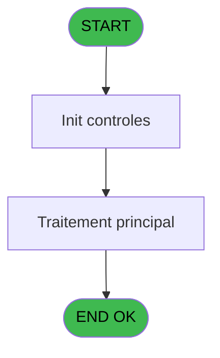

# QUA IDE 9 - Test Check In

> **Analyse**: Phases 1-4 2026-02-03 20:16 -> 20:16 (14s) | Assemblage 20:16
> **Pipeline**: V7.2 Enrichi
> **Structure**: 4 onglets (Resume | Ecrans | Donnees | Connexions)

<!-- TAB:Resume -->

## 1. FICHE D'IDENTITE

| Attribut | Valeur |
|----------|--------|
| Projet | QUA |
| IDE Position | 9 |
| Nom Programme | Test Check In |
| Fichier source | `Prg_9.xml` |
| Dossier IDE | Interfaces |
| Taches | 1 (1 ecrans visibles) |
| Tables modifiees | 0 |
| Programmes appeles | 1 |
| :warning: Statut | **ORPHELIN_POTENTIEL** |

## 2. DESCRIPTION FONCTIONNELLE

**Test Check In** assure la gestion complete de ce processus.

Le flux de traitement s'organise en **1 blocs fonctionnels** :

- **Traitement** (1 tache) : traitements metier divers

## 3. BLOCS FONCTIONNELS

### 3.1 Traitement (1 tache)

Traitements internes.

---

#### 9 - Test Check In [[ECRAN]](#ecran-t1)

**Role** : Verification : Test Check In.
**Ecran** : 606 x 116 DLU | [Voir mockup](#ecran-t1)
**Variables liees** : A (Sans Check out)
**Delegue a** : [Sequence Complete (IDE 18)](QUA-IDE-18.md)

## 5. REGLES METIER

*(Aucune regle metier identifiee)*

## 6. CONTEXTE

- **Appele par**: (aucun)
- **Appelle**: 1 programmes | **Tables**: 0 (W:0 R:0 L:0) | **Taches**: 1 | **Expressions**: 3

<!-- TAB:Ecrans -->

## 8. ECRANS

### 8.1 Forms visibles (1 / 1)

| # | Position | Tache | Nom | Type | Largeur | Hauteur | Bloc |
|---|----------|-------|-----|------|---------|---------|------|
| 1 | 9 | 9 | Test Check In | Type0 | 606 | 116 | Traitement |

### 8.2 Mockups Ecrans

---

#### 9 - Test Check In
**Tache** : [9](#t1) | **Type** : Type0 | **Dimensions** : 606 x 116 DLU
**Bloc** : Traitement | **Titre IDE** : Test Check In

<!-- FORM-DATA:
{
    "width":  606,
    "vFactor":  8,
    "type":  "Type0",
    "hFactor":  4,
    "controls":  [
                     {
                         "x":  12,
                         "type":  "label",
                         "var":  "",
                         "y":  24,
                         "w":  55,
                         "fmt":  "",
                         "name":  "",
                         "h":  12,
                         "color":  "",
                         "text":  "Num Chambre",
                         "parent":  null
                     },
                     {
                         "x":  12,
                         "type":  "label",
                         "var":  "",
                         "y":  40,
                         "w":  55,
                         "fmt":  "",
                         "name":  "",
                         "h":  12,
                         "color":  "",
                         "text":  "Compte 1",
                         "parent":  null
                     },
                     {
                         "x":  12,
                         "type":  "label",
                         "var":  "",
                         "y":  72,
                         "w":  55,
                         "fmt":  "",
                         "name":  "",
                         "h":  9,
                         "color":  "",
                         "text":  "Compte 2",
                         "parent":  null
                     },
                     {
                         "x":  86,
                         "type":  "edit",
                         "var":  "",
                         "y":  24,
                         "w":  42,
                         "fmt":  "",
                         "name":  "Num Chambre",
                         "h":  12,
                         "color":  "",
                         "text":  "",
                         "parent":  null
                     },
                     {
                         "x":  86,
                         "type":  "edit",
                         "var":  "",
                         "y":  40,
                         "w":  88,
                         "fmt":  "",
                         "name":  "Compte 1",
                         "h":  12,
                         "color":  "",
                         "text":  "",
                         "parent":  null
                     },
                     {
                         "x":  184,
                         "type":  "edit",
                         "var":  "",
                         "y":  40,
                         "w":  283,
                         "fmt":  "",
                         "name":  "Nom 1",
                         "h":  12,
                         "color":  "",
                         "text":  "",
                         "parent":  null
                     },
                     {
                         "x":  480,
                         "type":  "combobox",
                         "var":  "",
                         "y":  40,
                         "w":  116,
                         "fmt":  "",
                         "name":  "Langue 1",
                         "h":  12,
                         "color":  "",
                         "text":  "E,G,F,I,S",
                         "parent":  null
                     },
                     {
                         "x":  86,
                         "type":  "edit",
                         "var":  "",
                         "y":  72,
                         "w":  88,
                         "fmt":  "",
                         "name":  "Compte 2",
                         "h":  10,
                         "color":  "",
                         "text":  "",
                         "parent":  null
                     },
                     {
                         "x":  184,
                         "type":  "edit",
                         "var":  "",
                         "y":  72,
                         "w":  283,
                         "fmt":  "",
                         "name":  "Nom 2",
                         "h":  10,
                         "color":  "",
                         "text":  "",
                         "parent":  null
                     },
                     {
                         "x":  480,
                         "type":  "combobox",
                         "var":  "",
                         "y":  72,
                         "w":  116,
                         "fmt":  "",
                         "name":  "Langue 2_0001",
                         "h":  12,
                         "color":  "",
                         "text":  "E,G,F,I,S",
                         "parent":  null
                     },
                     {
                         "x":  273,
                         "type":  "button",
                         "var":  "",
                         "y":  96,
                         "w":  60,
                         "fmt":  "Lancer",
                         "name":  "Bt Lancer",
                         "h":  14,
                         "color":  "",
                         "text":  "",
                         "parent":  null
                     }
                 ],
    "taskId":  "9",
    "height":  116
}
-->

<strong>Champs : 7 champs</strong>

| Pos (x,y) | Nom | Variable | Type |
|-----------|-----|----------|------|
| 86,24 | Num Chambre | - | edit |
| 86,40 | Compte 1 | - | edit |
| 184,40 | Nom 1 | - | edit |
| 480,40 | Langue 1 | - | combobox |
| 86,72 | Compte 2 | - | edit |
| 184,72 | Nom 2 | - | edit |
| 480,72 | Langue 2_0001 | - | combobox |

<strong>Boutons : 1 boutons</strong>

| Bouton | Pos (x,y) | Action |
|--------|-----------|--------|
| Lancer | 273,96 | Bouton fonctionnel |

## 9. NAVIGATION

Ecran unique: **Test Check In**

### 9.3 Structure hierarchique (1 tache)

| Position | Tache | Type | Dimensions | Bloc |
|----------|-------|------|------------|------|
| **9.1** | [**Test Check In** (9)](#t1) [mockup](#ecran-t1) | - | 606x116 | Traitement |

### 9.4 Algorigramme

> **Legende**: Vert = START/END OK | Rouge = END KO | Bleu = Decisions
> *Algorigramme auto-genere. Utiliser `/algorigramme` pour une synthese metier detaillee.*

<!-- TAB:Donnees -->

## 10. TABLES

### Tables utilisees (0)

| ID | Nom | Description | Type | R | W | L | Usages |
|----|-----|-------------|------|---|---|---|--------|

### Colonnes par table (0 / 0 tables avec colonnes identifiees)

## 11. VARIABLES

### 11.1 Autres (8)

Variables diverses.

| Lettre | Nom | Type | Usage dans |
|--------|-----|------|-----------|
| A | Sans Check out | Logical | - |
| B | Num Chambre | Alpha | - |
| C | Compte 1 | Numeric | - |
| D | Nom 1 | Alpha | - |
| E | Langue 1 | Alpha | - |
| F | Compte 2 | Numeric | - |
| G | Nom 2 | Alpha | - |
| H | Langue 2 | Alpha | - |

## 12. EXPRESSIONS

**3 / 3 expressions decodees (100%)**

### 12.1 Repartition par type

| Type | Expressions | Regles |
|------|-------------|--------|
| CAST_LOGIQUE | 2 | 0 |
| CONDITION | 1 | 0 |

### 12.2 Expressions cles par type

#### CAST_LOGIQUE (2 expressions)

| Type | IDE | Expression | Regle |
|------|-----|------------|-------|
| CAST_LOGIQUE | 3 | `'FALSE'LOG` | - |
| CAST_LOGIQUE | 1 | `'TRUE'LOG` | - |

#### CONDITION (1 expressions)

| Type | IDE | Expression | Regle |
|------|-----|------------|-------|
| CONDITION | 2 | `Trim([J])<>'' AND [AE]<>0 AND Trim([AF])<>''` | - |

<!-- TAB:Connexions -->

## 13. GRAPHE D'APPELS

### 13.1 Chaine depuis Main (Callers)

**Chemin**: (pas de callers directs)

### 13.2 Callers

| IDE | Nom Programme | Nb Appels |
|-----|---------------|-----------|
| - | (aucun) | - |

### 13.3 Callees (programmes appeles)

### 13.4 Detail Callees avec contexte

| IDE | Nom Programme | Appels | Contexte |
|-----|---------------|--------|----------|
| [18](QUA-IDE-18.md) | Sequence Complete | 1 | Sous-programme |

## 14. RECOMMANDATIONS MIGRATION

### 14.1 Profil du programme

| Metrique | Valeur | Impact migration |
|----------|--------|-----------------|
| Lignes de logique | 10 | Programme compact |
| Expressions | 3 | Peu de logique |
| Tables WRITE | 0 | Impact faible |
| Sous-programmes | 1 | Peu de dependances |
| Ecrans visibles | 1 | Ecran unique ou traitement batch |
| Code desactive | 0% (0 / 10) | Code sain |
| Regles metier | 0 | Pas de regle identifiee |

### 14.2 Plan de migration par bloc

#### Traitement (1 tache: 1 ecran, 0 traitement)

- **Strategie** : 1 composant(s) UI (Razor/React) avec formulaires et validation.
- 1 sous-programme(s) a migrer ou a reutiliser depuis les services existants.
- Decomposer les taches en services unitaires testables.

### 14.3 Dependances critiques

| Dependance | Type | Appels | Impact |
|------------|------|--------|--------|
| [Sequence Complete (IDE 18)](QUA-IDE-18.md) | Sous-programme | 1x | Normale - Sous-programme |

---
*Spec DETAILED generee par Pipeline V7.2 - 2026-02-03 20:16*
