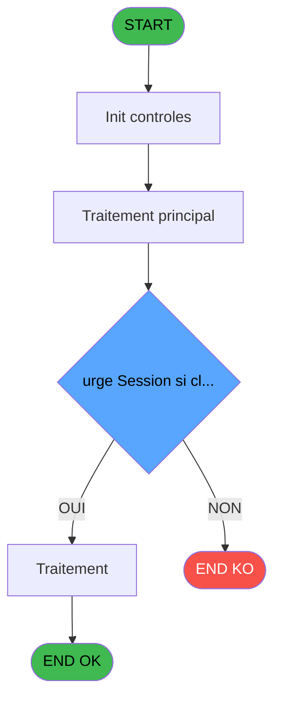
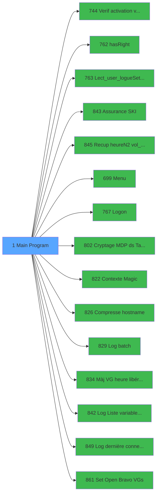

# REF IDE 1 - Main Program

> **Analyse**: Phases 1-4 2026-02-03 00:49 -> 00:50 (42s) | Assemblage 00:50
> **Pipeline**: V7.2 Enrichi
> **Structure**: 4 onglets (Resume | Ecrans | Donnees | Connexions)

<!-- TAB:Resume -->

## 1. FICHE D'IDENTITE

| Attribut | Valeur |
|----------|--------|
| Projet | REF |
| IDE Position | 1 |
| Nom Programme | Main Program |
| Fichier source | `Prg_1.xml` |
| Domaine metier | General |
| Taches | 2 (1 ecrans visibles) |
| Tables modifiees | 0 |
| Programmes appeles | 15 |
| :warning: Statut | **ORPHELIN_POTENTIEL** |

## 2. DESCRIPTION FONCTIONNELLE

**Main Program** assure la gestion complete de ce processus.

Le flux de traitement s'organise en **1 blocs fonctionnels** :

- **Traitement** (2 taches) : traitements metier divers

**Logique metier** : 2 regles identifiees couvrant conditions metier, valeurs par defaut.

## 3. BLOCS FONCTIONNELS

### 3.1 Traitement (2 taches)

Traitements internes.

---

#### 1 - REF [[ECRAN]](#ecran-t1)

**Role** : Traitement interne.
**Ecran** : 320 x 200 DLU (Type11) | [Voir mockup](#ecran-t1)

---

#### 1.1 - (sans nom)

**Role** : Traitement interne.
**Delegue a** : [hasRight (IDE 762)](REF-IDE-762.md), [Lect_user_logue/Set terminal (IDE 763)](REF-IDE-763.md), [Assurance SKI (IDE 843)](REF-IDE-843.md)

## 5. REGLES METIER

2 regles identifiees:

### Autres (2 regles)

#### [RM-001] Valeur par defaut si Translate('%club_hostname%') est vide

| Element | Detail |
|---------|--------|
| **Condition** | `Translate('%club_hostname%')=''` |
| **Si vrai** | OSEnvGet('COMPUTERNAME') |
| **Si faux** | Translate('%club_hostname%')) |
| **Expression source** | Expression 65 : `IF(Translate('%club_hostname%')='', OSEnvGet('COMPUTERNAME')` |
| **Exemple** | Si Translate('%club_hostname%')='' → OSEnvGet('COMPUTERNAME'). Sinon → Translate('%club_hostname%')) |

#### [RM-002] Si [EP]='\' alors Trim([EN]) sinon Trim([EN])&'\')

| Element | Detail |
|---------|--------|
| **Condition** | `[EP]='\'` |
| **Si vrai** | Trim([EN]) |
| **Si faux** | Trim([EN])&'\') |
| **Expression source** | Expression 99 : `IF([EP]='\',Trim([EN]),Trim([EN])&'\')` |
| **Exemple** | Si [EP]='\' → Trim([EN]). Sinon → Trim([EN])&'\') |

## 6. CONTEXTE

- **Appele par**: (aucun)
- **Appelle**: 15 programmes | **Tables**: 2 (W:0 R:1 L:1) | **Taches**: 2 | **Expressions**: 100

<!-- TAB:Ecrans -->

## 8. ECRANS

### 8.1 Forms visibles (1 / 2)

| # | Position | Tache | Nom | Type | Largeur | Hauteur | Bloc |
|---|----------|-------|-----|------|---------|---------|------|
| 1 | 1 | 1 | REF | Type11 | 320 | 200 | Traitement |

### 8.2 Mockups Ecrans

## 9. NAVIGATION

Ecran unique: **REF**

### 9.3 Structure hierarchique (2 taches)

| Position | Tache | Type | Dimensions | Bloc |
|----------|-------|------|------------|------|
| **1.1** | [**REF** (1)](#t1) [mockup](#ecran-t1) | Type11 | 320x200 | Traitement |
| 1.1.1 | [(sans nom) (1.1)](#t2) | - | - | |

### 9.4 Algorigramme

> **Legende**: Vert = START/END OK | Rouge = END KO | Bleu = Decisions
> *Algorigramme auto-genere. Utiliser `/algorigramme` pour une synthese metier detaillee.*

<!-- TAB:Donnees -->

## 10. TABLES

### Tables utilisees (2)

| ID | Nom | Description | Type | R | W | L | Usages |
|----|-----|-------------|------|---|---|---|--------|
| 113 | tables_village |  | DB | R |   |   | 1 |
| 922 | view_arrivees_retours |  | DB |   |   | L | 1 |

### Colonnes par table (1 / 1 tables avec colonnes identifiees)

Table 113 - tables_village (R) - 1 usages

| Lettre | Variable | Acces | Type |
|--------|----------|-------|------|
| A | p.i.Societe | R | Unicode |
| B | p.i.Date vol | R | Date |
| C | p.i.Code vol | R | Unicode |
| D | p.i.Sens | R | Unicode |
| E | p.o.Durée transfert heure | R | Numeric |

## 11. VARIABLES

### 11.1 Parametres entrants (21)

Variables recues en parametre.

| Lettre | Nom | Type | Usage dans |
|--------|-----|------|-----------|
| CT | p.i.Heure départ village | Alpha | 1x parametre entrant |
| CW | P.Compte | Numeric | 1x parametre entrant |
| CX | P.Filiation | Numeric | - |
| DA | P.Compte | Numeric | 1x parametre entrant |
| DB | P.Filiation | Numeric | - |
| DD | P.Heure (N2) | Numeric | - |
| DE | P.Heure (N2) | Numeric | - |
| DF | P.Heure (HH:MM:SS) | Time | - |
| DG | P.Societe | Unicode | - |
| DH | P.Compte | Numeric | 1x parametre entrant |
| DI | P.Filiation | Numeric | - |
| DJ | P.Aller\Retour | Unicode | - |
| DK | P.Vol | Unicode | - |
| DM | P.Societe | Unicode | - |
| DN | P.Compte | Numeric | 1x parametre entrant |
| DO | P.Filiation | Numeric | - |
| DP | P.Aller\Retour | Unicode | - |
| DQ | P.Vol | Unicode | - |
| DR | P.Heure N2 (opt 1). | Numeric | - |
| DS | P.Heure Time (opt 2) | Time | - |
| DZ | P.i.o.Chemin à terminer par \ | Unicode | - |

### 11.2 Variables de session (6)

Variables persistantes pendant toute la session.

| Lettre | Nom | Type | Usage dans |
|--------|-----|------|-----------|
| CV | V.Chemin\Fichier | Unicode | - |
| CY | v.PREPAID\LOCAL | Unicode | - |
| CZ | v.Num_souscription | Unicode | 1x session |
| DC | v.Num_souscription | Unicode | 1x session |
| DL | v.Heure N2 | Numeric | 1x session |
| DY | v.Durée transfert heure | Numeric | 1x session |

### 11.3 Variables globales (68)

Variables globales partagees entre programmes.

| Lettre | Nom | Type | Usage dans |
|--------|-----|------|-----------|
| A | VG.LOGIN | Unicode | 4x variable globale |
| B | VG.USER | Unicode | - |
| C | VG.Login OK ? | Logical | 1x variable globale |
| D | VG.DROIT PVE INPUT ? | Logical | - |
| E | VG.DATACACHING ACTIF? | Logical | - |
| F | VG.DROIT DEVELOPPEUR ? | Logical | 1x variable globale |
| G | VG.EFFECTIF ACTIF ? | Logical | - |
| H | VG.EFFECTIF ACTIF 2.0 ? | Logical | - |
| I | VG.EFFECTIF ACTIF 3.0 ? | Logical | - |
| J | VG.COMPTE CASH ACTIF  ? | Logical | - |
| K | VG.SUIVI CA HORS PLACEACTIF  ? | Logical | - |
| L | VG.TRANSFERT ACTIF | Logical | - |
| M | VG.TRANSFERT v2 ACTIF | Logical | 3x variable globale |
| N | VG.CORRESPITTIVI ACTIF ? | Logical | - |
| O | VG. CC SUR CMPTE SPEC. ACTIF | Logical | - |
| P | VG.GIFT PASS 2.0 ACTIF ? | Logical | - |
| Q | VG.LIEU SEJOUR DEFAUT | Alpha | - |
| R | VG.NB LIEU SEJOUR | Numeric | - |
| S | VG.INTF BOUTIQUE V2 | Logical | - |
| T | VG.LEX V2.00 | Logical | - |
| U | VG.RESORT CREDIT | Logical | - |
| V | VG.CRYPTAGE | Logical | 1x variable globale |
| W | VG.AnnulationGiftPass | Logical | - |
| X | VG.USER RFI / RESPONSABLE RECEP | Logical | - |
| Y | VG.GROUPE | Unicode | - |
| Z | VG.WINTER VILLAGE | Logical | - |
| BA | VG.ADAPTATION GIFT PASS | Logical | 1x variable globale |
| BB | VG.MAILS GRAPHIQUES | Logical | 1x variable globale |
| BC | VG.HOSTNAME AU LIEU DE TERM | Logical | - |
| BD | VG.Purge répertoire APPDATA\MSE | Logical | - |
| BE | VG.Pseudo terminal | Numeric | - |
| BF | VG.Pilotage Hebdo V3 | Logical | - |
| BG | VG.Garantie Cross Border V2 | Logical | - |
| BH | VG.INTERFACES OPEN BRAVO | Logical | - |
| BI | VG.OPEN BRAVO WS DATE FORMAT | Unicode | - |
| BJ | VG.OPEN BRAVO WS USERNAME | Unicode | - |
| BK | VG.OPEN BRAVO WS PASSWORD | Unicode | - |
| BL | VG.OPEN BRAVO WS EMAIL ALERT | Unicode | - |
| BM | VG.OPEN BRAVO WS URL API | Unicode | - |
| BN | VG.OPEN BRAVO WS PROXY ADRESS | Unicode | - |
| BO | VG.OPEN BRAVO MONO BOUTIQUE | Unicode | - |
| BP | VG.INTERFACES TPE OMNICANAL | Logical | - |
| BQ | VG.ETIS HOUSEKEEPING | Logical | - |
| BR | VG SUPPORT (Tablette,WorkStatio | Alpha | - |
| BS | VG Envoi Mail paiement VAD | Logical | - |
| BT | VG.Force Office 365 Web | Logical | - |
| BU | VG.Purge Session si cloture Man | Logical | - |
| BV | VG.Par heure libération chambre | Time | - |
| BW | VG.Verification PLBS par PES | Logical | - |
| BX | VG.Stock par détail new version | Logical | - |
| BY | VG.Decrementer Repas GE | Logical | - |
| BZ | VG.Gestion Garantie API CM | Logical | - |
| CA | VG. Recap Fin mois Vill 1.00 | Logical | - |
| CB | VG. Ski0Souci INS2.00 | Logical | - |
| CC | VG. Numérotation Maximale compt | Numeric | - |
| CD | VG.Securisation TPE | Logical | - |
| CE | VG. Interface Room Checking v1 | Logical | - |
| CF | VG.Garantie sans bloc. de fonds | Logical | - |
| CG | VG.Reçu Loi AGEC | Logical | 3x variable globale |
| CH | VG.Gift Pass par personne | Logical | - |
| CI | VG.Blocage envoi JH vers OB | Logical | - |
| CJ | VG.Extented URL VAD | Logical | - |
| CK | VG.Great Member Revamped | Logical | - |
| CL | VG.ECI En cours de séjour | Logical | - |
| CM | VG. Interface OpenBravo 3 | Logical | - |
| CN | VG. Interface Galaxy Grece | Logical | - |
| CO | VG. SEM 1.00 M&E | Logical | 1x variable globale |
| CP | VG. Arrival Room Status 1.00 | Logical | - |

### 11.4 Autres (12)

Variables diverses.

| Lettre | Nom | Type | Usage dans |
|--------|-----|------|-----------|
| CQ | i.Nouveau numéro terminal | Numeric | 1x refs |
| CR | o.Host sur 3 | Alpha | - |
| CS | i.Code TPE | Unicode | 1x refs |
| CU | >Type_ERR | Unicode | - |
| DT | Est sur ce vol? | Logical | - |
| DU | i.Societe | Unicode | - |
| DV | i.Date vol | Date | - |
| DW | i.Vol | Unicode | - |
| DX | i.Sens | Unicode | - |
| EA | Longeur | Numeric | 1x refs |
| EB | Dernier caractère | Unicode | - |
| EC | Test dernier = \ | Logical | - |

Toutes les 107 variables (liste complete)

| Cat | Lettre | Nom Variable | Type |
|-----|--------|--------------|------|
| P0 | **CT** | p.i.Heure départ village | Alpha |
| P0 | **CW** | P.Compte | Numeric |
| P0 | **CX** | P.Filiation | Numeric |
| P0 | **DA** | P.Compte | Numeric |
| P0 | **DB** | P.Filiation | Numeric |
| P0 | **DD** | P.Heure (N2) | Numeric |
| P0 | **DE** | P.Heure (N2) | Numeric |
| P0 | **DF** | P.Heure (HH:MM:SS) | Time |
| P0 | **DG** | P.Societe | Unicode |
| P0 | **DH** | P.Compte | Numeric |
| P0 | **DI** | P.Filiation | Numeric |
| P0 | **DJ** | P.Aller\Retour | Unicode |
| P0 | **DK** | P.Vol | Unicode |
| P0 | **DM** | P.Societe | Unicode |
| P0 | **DN** | P.Compte | Numeric |
| P0 | **DO** | P.Filiation | Numeric |
| P0 | **DP** | P.Aller\Retour | Unicode |
| P0 | **DQ** | P.Vol | Unicode |
| P0 | **DR** | P.Heure N2 (opt 1). | Numeric |
| P0 | **DS** | P.Heure Time (opt 2) | Time |
| P0 | **DZ** | P.i.o.Chemin à terminer par \ | Unicode |
| V. | **CV** | V.Chemin\Fichier | Unicode |
| V. | **CY** | v.PREPAID\LOCAL | Unicode |
| V. | **CZ** | v.Num_souscription | Unicode |
| V. | **DC** | v.Num_souscription | Unicode |
| V. | **DL** | v.Heure N2 | Numeric |
| V. | **DY** | v.Durée transfert heure | Numeric |
| VG | **A** | VG.LOGIN | Unicode |
| VG | **B** | VG.USER | Unicode |
| VG | **C** | VG.Login OK ? | Logical |
| VG | **D** | VG.DROIT PVE INPUT ? | Logical |
| VG | **E** | VG.DATACACHING ACTIF? | Logical |
| VG | **F** | VG.DROIT DEVELOPPEUR ? | Logical |
| VG | **G** | VG.EFFECTIF ACTIF ? | Logical |
| VG | **H** | VG.EFFECTIF ACTIF 2.0 ? | Logical |
| VG | **I** | VG.EFFECTIF ACTIF 3.0 ? | Logical |
| VG | **J** | VG.COMPTE CASH ACTIF  ? | Logical |
| VG | **K** | VG.SUIVI CA HORS PLACEACTIF  ? | Logical |
| VG | **L** | VG.TRANSFERT ACTIF | Logical |
| VG | **M** | VG.TRANSFERT v2 ACTIF | Logical |
| VG | **N** | VG.CORRESPITTIVI ACTIF ? | Logical |
| VG | **O** | VG. CC SUR CMPTE SPEC. ACTIF | Logical |
| VG | **P** | VG.GIFT PASS 2.0 ACTIF ? | Logical |
| VG | **Q** | VG.LIEU SEJOUR DEFAUT | Alpha |
| VG | **R** | VG.NB LIEU SEJOUR | Numeric |
| VG | **S** | VG.INTF BOUTIQUE V2 | Logical |
| VG | **T** | VG.LEX V2.00 | Logical |
| VG | **U** | VG.RESORT CREDIT | Logical |
| VG | **V** | VG.CRYPTAGE | Logical |
| VG | **W** | VG.AnnulationGiftPass | Logical |
| VG | **X** | VG.USER RFI / RESPONSABLE RECEP | Logical |
| VG | **Y** | VG.GROUPE | Unicode |
| VG | **Z** | VG.WINTER VILLAGE | Logical |
| VG | **BA** | VG.ADAPTATION GIFT PASS | Logical |
| VG | **BB** | VG.MAILS GRAPHIQUES | Logical |
| VG | **BC** | VG.HOSTNAME AU LIEU DE TERM | Logical |
| VG | **BD** | VG.Purge répertoire APPDATA\MSE | Logical |
| VG | **BE** | VG.Pseudo terminal | Numeric |
| VG | **BF** | VG.Pilotage Hebdo V3 | Logical |
| VG | **BG** | VG.Garantie Cross Border V2 | Logical |
| VG | **BH** | VG.INTERFACES OPEN BRAVO | Logical |
| VG | **BI** | VG.OPEN BRAVO WS DATE FORMAT | Unicode |
| VG | **BJ** | VG.OPEN BRAVO WS USERNAME | Unicode |
| VG | **BK** | VG.OPEN BRAVO WS PASSWORD | Unicode |
| VG | **BL** | VG.OPEN BRAVO WS EMAIL ALERT | Unicode |
| VG | **BM** | VG.OPEN BRAVO WS URL API | Unicode |
| VG | **BN** | VG.OPEN BRAVO WS PROXY ADRESS | Unicode |
| VG | **BO** | VG.OPEN BRAVO MONO BOUTIQUE | Unicode |
| VG | **BP** | VG.INTERFACES TPE OMNICANAL | Logical |
| VG | **BQ** | VG.ETIS HOUSEKEEPING | Logical |
| VG | **BR** | VG SUPPORT (Tablette,WorkStatio | Alpha |
| VG | **BS** | VG Envoi Mail paiement VAD | Logical |
| VG | **BT** | VG.Force Office 365 Web | Logical |
| VG | **BU** | VG.Purge Session si cloture Man | Logical |
| VG | **BV** | VG.Par heure libération chambre | Time |
| VG | **BW** | VG.Verification PLBS par PES | Logical |
| VG | **BX** | VG.Stock par détail new version | Logical |
| VG | **BY** | VG.Decrementer Repas GE | Logical |
| VG | **BZ** | VG.Gestion Garantie API CM | Logical |
| VG | **CA** | VG. Recap Fin mois Vill 1.00 | Logical |
| VG | **CB** | VG. Ski0Souci INS2.00 | Logical |
| VG | **CC** | VG. Numérotation Maximale compt | Numeric |
| VG | **CD** | VG.Securisation TPE | Logical |
| VG | **CE** | VG. Interface Room Checking v1 | Logical |
| VG | **CF** | VG.Garantie sans bloc. de fonds | Logical |
| VG | **CG** | VG.Reçu Loi AGEC | Logical |
| VG | **CH** | VG.Gift Pass par personne | Logical |
| VG | **CI** | VG.Blocage envoi JH vers OB | Logical |
| VG | **CJ** | VG.Extented URL VAD | Logical |
| VG | **CK** | VG.Great Member Revamped | Logical |
| VG | **CL** | VG.ECI En cours de séjour | Logical |
| VG | **CM** | VG. Interface OpenBravo 3 | Logical |
| VG | **CN** | VG. Interface Galaxy Grece | Logical |
| VG | **CO** | VG. SEM 1.00 M&E | Logical |
| VG | **CP** | VG. Arrival Room Status 1.00 | Logical |
| Autre | **CQ** | i.Nouveau numéro terminal | Numeric |
| Autre | **CR** | o.Host sur 3 | Alpha |
| Autre | **CS** | i.Code TPE | Unicode |
| Autre | **CU** | >Type_ERR | Unicode |
| Autre | **DT** | Est sur ce vol? | Logical |
| Autre | **DU** | i.Societe | Unicode |
| Autre | **DV** | i.Date vol | Date |
| Autre | **DW** | i.Vol | Unicode |
| Autre | **DX** | i.Sens | Unicode |
| Autre | **EA** | Longeur | Numeric |
| Autre | **EB** | Dernier caractère | Unicode |
| Autre | **EC** | Test dernier = \ | Logical |

## 12. EXPRESSIONS

**100 / 100 expressions decodees (100%)**

### 12.1 Repartition par type

| Type | Expressions | Regles |
|------|-------------|--------|
| CALCULATION | 3 | 0 |
| FORMAT | 4 | 0 |
| CONDITION | 12 | 2 |
| CONCATENATION | 1 | 0 |
| CONSTANTE | 51 | 0 |
| OTHER | 15 | 0 |
| CAST_LOGIQUE | 3 | 0 |
| NEGATION | 1 | 0 |
| STRING | 10 | 0 |

### 12.2 Expressions cles par type

#### CALCULATION (3 expressions)

| Type | IDE | Expression | Regle |
|------|-----|------------|-------|
| CALCULATION | 80 | `'VG.LOGIN [A]'VAR-1` | - |
| CALCULATION | 59 | `CallProg ('{805,-1}'PROG)` | - |
| CALCULATION | 41 | `CallProg ('{800,-1}'PROG)` | - |

#### FORMAT (4 expressions)

| Type | IDE | Expression | Regle |
|------|-----|------------|-------|
| FORMAT | 86 | `TVal(Str(i.Nouveau numéro terminal [CQ],'2'),'HH')` | - |
| FORMAT | 89 | `Val(TStr(p.i.Heure départ village [CT],'HH'),'2')` | - |
| FORMAT | 88 | `TVal(Str(i.Code TPE [CS]+1,'2'),'HH')` | - |
| FORMAT | 42 | `StrBuild('Error # @1@, dbms @2@, message @3@', Str(ErrDbmsCode (), 'N10'), ErrDatabaseName (), ErrDbmsMessage ())` | - |

#### CONDITION (12 expressions)

| Type | IDE | Expression | Regle |
|------|-----|------------|-------|
| CONDITION | 99 | `IF([EP]='\',Trim([EN]),Trim([EN])&'\')` | [RM-002](#rm-RM-002) |
| CONDITION | 65 | `IF(Translate('%club_hostname%')='', OSEnvGet('COMPUTERNAME'), Translate('%club_hostname%'))` | [RM-001](#rm-RM-001) |
| CONDITION | 98 | `[EP]='\'` | - |
| CONDITION | 64 | `Translate('%club_mobility%')='Y'` | - |
| CONDITION | 40 | `Trim(VG.Garantie sans bloc.... [CF])<>'LOCK'` | - |
| ... | | *+7 autres* | |

#### CONCATENATION (1 expressions)

| Type | IDE | Expression | Regle |
|------|-----|------------|-------|
| CONCATENATION | 82 | `CASE(Trim(VG. SEM 1.00 M&E [CO]),
'PREPAID',Trim(VG. SEM 1.00 M&E [CO]),
'','NO',
Trim (VG. SEM 1.00 M&E [CO])&' - '&Trim(VG. Arrival Room Statu... [CP]))` | - |

#### CONSTANTE (51 expressions)

| Type | IDE | Expression | Regle |
|------|-----|------------|-------|
| CONSTANTE | 39 | `'WIN'` | - |
| CONSTANTE | 38 | `'TRA'` | - |
| CONSTANTE | 37 | `'T2H'` | - |
| CONSTANTE | 48 | `'YYYY-MM-DD'` | - |
| CONSTANTE | 47 | `''` | - |
| ... | | *+46 autres* | |

#### OTHER (15 expressions)

| Type | IDE | Expression | Regle |
|------|-----|------------|-------|
| OTHER | 85 | `VG.Blocage envoi JH ve... [CI]` | - |
| OTHER | 70 | `VG.TRANSFERT v2 ACTIF [M]` | - |
| OTHER | 68 | `StrBuild('Error @1@', ErrMagicName ())` | - |
| OTHER | 87 | `P.Compte [DH]` | - |
| OTHER | 94 | `Translate('%club_user%')` | - |
| ... | | *+10 autres* | |

#### CAST_LOGIQUE (3 expressions)

| Type | IDE | Expression | Regle |
|------|-----|------------|-------|
| CAST_LOGIQUE | 54 | `INIPut('[MAGIC_LOGICAL_NAMES]term='&GetShortHostname (),'FALSE'LOG)` | - |
| CAST_LOGIQUE | 45 | `'TRUE'LOG` | - |
| CAST_LOGIQUE | 4 | `CallProg(ProgIdx('hasRight','TRUE'LOG),VG.LOGIN [A],'INPUTHD')` | - |

#### NEGATION (1 expressions)

| Type | IDE | Expression | Regle |
|------|-----|------------|-------|
| NEGATION | 50 | `NOT IsMobileClient () AND FileExist ('%club_ip_command%purge_mse.cmd')` | - |

#### STRING (10 expressions)

| Type | IDE | Expression | Regle |
|------|-----|------------|-------|
| STRING | 83 | `Trim(v.Heure N2 [DL])` | - |
| STRING | 79 | `Trim(VG.Reçu Loi AGEC [CG])` | - |
| STRING | 96 | `Len(Trim([EN]))` | - |
| STRING | 100 | `Trim([EN])` | - |
| STRING | 97 | `MID(Trim([EN]),Len(Trim([EN])),1)` | - |
| ... | | *+5 autres* | |

### 12.3 Toutes les expressions (100)

Voir les 100 expressions

#### CALCULATION (3)

| IDE | Expression Decodee |
|-----|-------------------|
| 41 | `CallProg ('{800,-1}'PROG)` |
| 59 | `CallProg ('{805,-1}'PROG)` |
| 80 | `'VG.LOGIN [A]'VAR-1` |

#### FORMAT (4)

| IDE | Expression Decodee |
|-----|-------------------|
| 88 | `TVal(Str(i.Code TPE [CS]+1,'2'),'HH')` |
| 42 | `StrBuild('Error # @1@, dbms @2@, message @3@', Str(ErrDbmsCode (), 'N10'), ErrDatabaseName (), ErrDbmsMessage ())` |
| 86 | `TVal(Str(i.Nouveau numéro terminal [CQ],'2'),'HH')` |
| 89 | `Val(TStr(p.i.Heure départ village [CT],'HH'),'2')` |

#### CONDITION (12)

| IDE | Expression Decodee |
|-----|-------------------|
| 65 | `IF(Translate('%club_hostname%')='', OSEnvGet('COMPUTERNAME'), Translate('%club_hostname%'))` |
| 69 | `IF(VG.TRANSFERT v2 ACTIF [M],   
     IF(Val(VG.HOSTNAME AU LIEU DE... [BC],'2') =0, 
          [AV], 
          IF ([AV]=0, 
              Val(VG.HOSTNAME AU LIEU DE... [BC], '2')*3600, 
              MIN(Val(VG.HOSTNAME AU LIEU DE... [BC], '2')*3600, [AV])))
    ,'00/00/0000'DATE)` |
| 99 | `IF([EP]='\',Trim([EN]),Trim([EN])&'\')` |
| 1 | `RunMode()<=2 AND NOT IsComponent()` |
| 3 | `RunMode()<=2 AND IsComponent()` |
| 43 | `NOT(VG.CRYPTAGE [V]) AND Translate('%RunMode%')='B'` |
| 62 | `[AR]<>'TB' AND [AR]<>'WS'` |
| 64 | `Translate('%club_mobility%')='Y'` |
| 98 | `[EP]='\'` |
| 40 | `Trim(VG.Garantie sans bloc.... [CF])<>'LOCK'` |
| 93 | `VG.TRANSFERT v2 ACTIF [M] AND Trim(v.Durée transfert heure [DY])<>''` |
| 95 | `Trim(VG.LOGIN [A])=''` |

#### CONCATENATION (1)

| IDE | Expression Decodee |
|-----|-------------------|
| 82 | `CASE(Trim(VG. SEM 1.00 M&E [CO]),
'PREPAID',Trim(VG. SEM 1.00 M&E [CO]),
'','NO',
Trim (VG. SEM 1.00 M&E [CO])&' - '&Trim(VG. Arrival Room Statu... [CP]))` |

#### CONSTANTE (51)

| IDE | Expression Decodee |
|-----|-------------------|
| 5 | `'1.00'` |
| 6 | `'2.00'` |
| 7 | `'3.00'` |
| 8 | `'4.00'` |
| 9 | `'AFB'` |
| 10 | `'AGC'` |
| 11 | `'AGP'` |
| 12 | `'ARS'` |
| 13 | `'BGA'` |
| 14 | `'BJO'` |
| 15 | `'COR'` |
| 16 | `'CRY'` |
| 17 | `'ECI'` |
| 18 | `'ERR'` |
| 19 | `'ETS'` |
| 20 | `'EUV'` |
| 21 | `'FEX'` |
| 22 | `'GAC'` |
| 23 | `'GMR'` |
| 24 | `'GPP'` |
| 25 | `'IGA'` |
| 26 | `'INB'` |
| 27 | `'INS'` |
| 28 | `'IOB'` |
| 29 | `'IRC'` |
| 30 | `'ITO'` |
| 31 | `'MGR'` |
| 32 | `'OFW'` |
| 33 | `'RCR'` |
| 34 | `'SCA'` |
| 35 | `'SEM'` |
| 36 | `'STK'` |
| 37 | `'T2H'` |
| 38 | `'TRA'` |
| 39 | `'WIN'` |
| 44 | `'SUPERVISOR'` |
| 47 | `''` |
| 48 | `'YYYY-MM-DD'` |
| 57 | `'ACCESALL'` |
| 61 | `'WS'` |
| 63 | `'TB'` |
| 66 | `'ERROR'` |
| 67 | `'Error'` |
| 71 | `'ANY_ERR'` |
| 72 | `'DUPL_IDX'` |
| 73 | `'INS-UPD-DE'` |
| 74 | `'LOCK'` |
| 76 | `'txt'` |
| 81 | `99999900` |
| 84 | `'C'` |
| 92 | `0` |

#### OTHER (15)

| IDE | Expression Decodee |
|-----|-------------------|
| 2 | `VG.Login OK ? [C]` |
| 46 | `VG.DROIT DEVELOPPEUR ? [F]` |
| 49 | `[AH]` |
| 51 | `[AD]` |
| 52 | `[AE]` |
| 53 | `[AZ]` |
| 55 | `VG.ADAPTATION GIFT PASS [BA]` |
| 60 | `MID(GetHostName (),5,2)` |
| 68 | `StrBuild('Error @1@', ErrMagicName ())` |
| 70 | `VG.TRANSFERT v2 ACTIF [M]` |
| 85 | `VG.Blocage envoi JH ve... [CI]` |
| 87 | `P.Compte [DH]` |
| 90 | `v.Num_souscription [CZ]` |
| 91 | `Longeur [EA]` |
| 94 | `Translate('%club_user%')` |

#### CAST_LOGIQUE (3)

| IDE | Expression Decodee |
|-----|-------------------|
| 4 | `CallProg(ProgIdx('hasRight','TRUE'LOG),VG.LOGIN [A],'INPUTHD')` |
| 45 | `'TRUE'LOG` |
| 54 | `INIPut('[MAGIC_LOGICAL_NAMES]term='&GetShortHostname (),'FALSE'LOG)` |

#### NEGATION (1)

| IDE | Expression Decodee |
|-----|-------------------|
| 50 | `NOT IsMobileClient () AND FileExist ('%club_ip_command%purge_mse.cmd')` |

#### STRING (10)

| IDE | Expression Decodee |
|-----|-------------------|
| 56 | `Val(MID(VG.MAILS GRAPHIQUES [BB],7,2),'2P0')` |
| 58 | `Right(Trim(OSEnvGet('COMPUTERNAME')), 3)` |
| 75 | `File2Blb(Trim(VG.Reçu Loi AGEC [CG]))` |
| 77 | `FileDelete(Trim(VG.Reçu Loi AGEC [CG]))` |
| 78 | `Trim(VG.Garantie sans bloc.... [CF])` |
| 79 | `Trim(VG.Reçu Loi AGEC [CG])` |
| 83 | `Trim(v.Heure N2 [DL])` |
| 96 | `Len(Trim([EN]))` |
| 97 | `MID(Trim([EN]),Len(Trim([EN])),1)` |
| 100 | `Trim([EN])` |

<!-- TAB:Connexions -->

## 13. GRAPHE D'APPELS

### 13.1 Chaine depuis Main (Callers)

**Chemin**: (pas de callers directs)

### 13.2 Callers

| IDE | Nom Programme | Nb Appels |
|-----|---------------|-----------|
| - | (aucun) | - |

### 13.3 Callees (programmes appeles)

### 13.4 Detail Callees avec contexte

| IDE | Nom Programme | Appels | Contexte |
|-----|---------------|--------|----------|
| [744](REF-IDE-744.md) | Verif activation version | 36 | Controle/validation |
| [762](REF-IDE-762.md) | hasRight | 2 | Sous-programme |
| [763](REF-IDE-763.md) | Lect_user_logue/Set terminal | 2 | Sous-programme |
| [843](REF-IDE-843.md) | Assurance SKI | 2 | Sous-programme |
| [845](REF-IDE-845.md) | Recup heure(N2) vol_compagnie | 2 | Recuperation donnees |
| [699](REF-IDE-699.md) | Menu | 1 | Navigation menu |
| [767](REF-IDE-767.md) | Logon | 1 | Sous-programme |
| [802](REF-IDE-802.md) | Cryptage MDP ds Tables - Once | 1 | Sous-programme |
| [822](REF-IDE-822.md) | Contexte Magic | 1 | Sous-programme |
| [826](REF-IDE-826.md) | Compresse hostname | 1 | Sous-programme |
| [829](REF-IDE-829.md) | Log batch | 1 | Sous-programme |
| [834](REF-IDE-834.md) | Màj VG heure libérat. chambre | 1 | Sous-programme |
| [842](REF-IDE-842.md) | Log Liste variable précédente | 1 | Configuration impression |
| [849](REF-IDE-849.md) | Log dernière connection PMS | 1 | Sous-programme |
| [861](REF-IDE-861.md) | Set Open Bravo VGs | 1 | Ouverture session |

## 14. RECOMMANDATIONS MIGRATION

### 14.1 Profil du programme

| Metrique | Valeur | Impact migration |
|----------|--------|-----------------|
| Lignes de logique | 328 | Taille moyenne |
| Expressions | 100 | Logique moderee |
| Tables WRITE | 0 | Impact faible |
| Sous-programmes | 15 | Forte dependance |
| Ecrans visibles | 1 | Ecran unique ou traitement batch |
| Code desactive | 1.5% (5 / 328) | Code sain |
| Regles metier | 2 | Quelques regles a preserver |

### 14.2 Plan de migration par bloc

#### Traitement (2 taches: 1 ecran, 1 traitement)

- **Strategie** : Orchestrateur avec 1 ecrans (Razor/React) et 1 traitements backend (services).
- Les ecrans deviennent des composants UI, les traitements invisibles deviennent des services injectables.
- 15 sous-programme(s) a migrer ou a reutiliser depuis les services existants.
- Decomposer les taches en services unitaires testables.

### 14.3 Dependances critiques

| Dependance | Type | Appels | Impact |
|------------|------|--------|--------|
| [Verif activation version (IDE 744)](REF-IDE-744.md) | Sous-programme | 36x | **CRITIQUE** - Controle/validation |
| [Assurance SKI (IDE 843)](REF-IDE-843.md) | Sous-programme | 2x | Haute - Sous-programme |
| [Recup heure(N2) vol_compagnie (IDE 845)](REF-IDE-845.md) | Sous-programme | 2x | Haute - Recuperation donnees |
| [hasRight (IDE 762)](REF-IDE-762.md) | Sous-programme | 2x | Haute - Sous-programme |
| [Lect_user_logue/Set terminal (IDE 763)](REF-IDE-763.md) | Sous-programme | 2x | Haute - Sous-programme |
| [Màj VG heure libérat. chambre (IDE 834)](REF-IDE-834.md) | Sous-programme | 1x | Normale - Sous-programme |
| [Log batch (IDE 829)](REF-IDE-829.md) | Sous-programme | 1x | Normale - Sous-programme |
| [Log Liste variable précédente (IDE 842)](REF-IDE-842.md) | Sous-programme | 1x | Normale - Configuration impression |
| [Set Open Bravo VGs (IDE 861)](REF-IDE-861.md) | Sous-programme | 1x | Normale - Ouverture session |
| [Log dernière connection PMS (IDE 849)](REF-IDE-849.md) | Sous-programme | 1x | Normale - Sous-programme |

---
*Spec DETAILED generee par Pipeline V7.2 - 2026-02-03 00:50*
