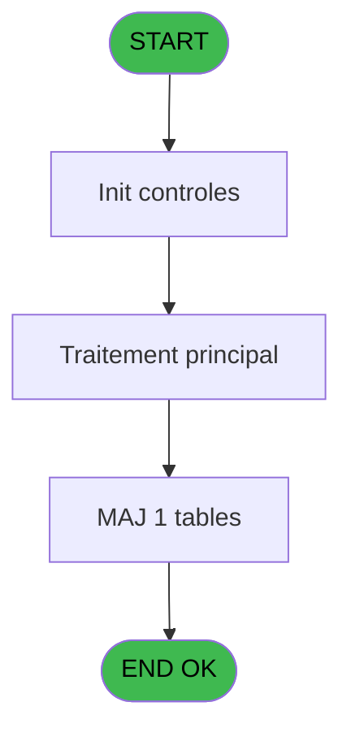

# REF IDE 202 - Browse - plan_comptable_centra

> **Analyse**: Phases 1-4 2026-02-03 10:08 -> 10:08 (17s) | Assemblage 10:08
> **Pipeline**: V7.2 Enrichi
> **Structure**: 4 onglets (Resume | Ecrans | Donnees | Connexions)

<!-- TAB:Resume -->

## 1. FICHE D'IDENTITE

| Attribut | Valeur |
|----------|--------|
| Projet | REF |
| IDE Position | 202 |
| Nom Programme | Browse - plan_comptable_centra |
| Fichier source | `Prg_202.xml` |
| Domaine metier | General |
| Taches | 1 (1 ecrans visibles) |
| Tables modifiees | 1 |
| Programmes appeles | 0 |
| :warning: Statut | **ORPHELIN_POTENTIEL** |

## 2. DESCRIPTION FONCTIONNELLE

**Browse - plan_comptable_centra** assure la gestion complete de ce processus.

Le flux de traitement s'organise en **1 blocs fonctionnels** :

- **Calcul** (1 tache) : calculs de montants, stocks ou compteurs

**Donnees modifiees** : 1 tables en ecriture (plan_comptable_central_histo).

## 3. BLOCS FONCTIONNELS

### 3.1 Calcul (1 tache)

Calculs metier : montants, stocks, compteurs.

---

#### 202 - Browse - plan_comptable_centra [[ECRAN]](#ecran-t1)

**Role** : Traitement : Browse - plan_comptable_centra.
**Ecran** : 2680 x 195 DLU | [Voir mockup](#ecran-t1)

## 5. REGLES METIER

*(Aucune regle metier identifiee)*

## 6. CONTEXTE

- **Appele par**: (aucun)
- **Appelle**: 0 programmes | **Tables**: 1 (W:1 R:0 L:0) | **Taches**: 1 | **Expressions**: 0

<!-- TAB:Ecrans -->

## 8. ECRANS

### 8.1 Forms visibles (1 / 1)

| # | Position | Tache | Nom | Type | Largeur | Hauteur | Bloc |
|---|----------|-------|-----|------|---------|---------|------|
| 1 | 202 | 202 | Browse - plan_comptable_centra | Type0 | 2680 | 195 | Calcul |

### 8.2 Mockups Ecrans

---

#### 202 - Browse - plan_comptable_centra
**Tache** : [202](#t1) | **Type** : Type0 | **Dimensions** : 2680 x 195 DLU
**Bloc** : Calcul | **Titre IDE** : Browse - plan_comptable_centra

<!-- FORM-DATA:
{
    "width":  2680,
    "vFactor":  8,
    "type":  "Type0",
    "hFactor":  4,
    "controls":  [
                     {
                         "x":  8,
                         "type":  "table",
                         "var":  "",
                         "name":  "",
                         "titleH":  12,
                         "color":  "",
                         "w":  2658,
                         "y":  8,
                         "fmt":  "",
                         "parent":  null,
                         "text":  "",
                         "rowH":  13,
                         "h":  182,
                         "cols":  [
                                      {
                                          "title":  "chrono",
                                          "layer":  1,
                                          "w":  68
                                      },
                                      {
                                          "title":  "societe",
                                          "layer":  2,
                                          "w":  30
                                      },
                                      {
                                          "title":  "compte",
                                          "layer":  3,
                                          "w":  39
                                      },
                                      {
                                          "title":  "activite",
                                          "layer":  4,
                                          "w":  30
                                      },
                                      {
                                          "title":  "article",
                                          "layer":  5,
                                          "w":  26
                                      },
                                      {
                                          "title":  "libelle_service",
                                          "layer":  6,
                                          "w":  369
                                      },
                                      {
                                          "title":  "libelle_fra",
                                          "layer":  7,
                                          "w":  727
                                      },
                                      {
                                          "title":  "libelle_ang",
                                          "layer":  8,
                                          "w":  727
                                      },
                                      {
                                          "title":  "compte_produit",
                                          "layer":  9,
                                          "w":  62
                                      },
                                      {
                                          "title":  "compte_charge",
                                          "layer":  10,
                                          "w":  62
                                      },
                                      {
                                          "title":  "compte_financier",
                                          "layer":  11,
                                          "w":  68
                                      },
                                      {
                                          "title":  "compte_bilan",
                                          "layer":  12,
                                          "w":  54
                                      },
                                      {
                                          "title":  "compte_qualification_libre",
                                          "layer":  13,
                                          "w":  101
                                      },
                                      {
                                          "title":  "a_partir_du",
                                          "layer":  14,
                                          "w":  68
                                      },
                                      {
                                          "title":  "date_histo",
                                          "layer":  15,
                                          "w":  68
                                      },
                                      {
                                          "title":  "time_histo",
                                          "layer":  16,
                                          "w":  53
                                      },
                                      {
                                          "title":  "qui_histo",
                                          "layer":  17,
                                          "w":  55
                                      },
                                      {
                                          "title":  "tva",
                                          "layer":  18,
                                          "w":  34
                                      }
                                  ],
                         "rows":  18
                     },
                     {
                         "x":  12,
                         "type":  "edit",
                         "var":  "",
                         "y":  23,
                         "w":  61,
                         "fmt":  "",
                         "name":  "chrono",
                         "h":  10,
                         "color":  "110",
                         "text":  "",
                         "parent":  1
                     },
                     {
                         "x":  80,
                         "type":  "edit",
                         "var":  "",
                         "y":  23,
                         "w":  9,
                         "fmt":  "",
                         "name":  "societe",
                         "h":  10,
                         "color":  "110",
                         "text":  "",
                         "parent":  1
                     },
                     {
                         "x":  110,
                         "type":  "edit",
                         "var":  "",
                         "y":  23,
                         "w":  32,
                         "fmt":  "",
                         "name":  "compte",
                         "h":  10,
                         "color":  "110",
                         "text":  "",
                         "parent":  1
                     },
                     {
                         "x":  149,
                         "type":  "edit",
                         "var":  "",
                         "y":  23,
                         "w":  18,
                         "fmt":  "",
                         "name":  "activite",
                         "h":  10,
                         "color":  "110",
                         "text":  "",
                         "parent":  1
                     },
                     {
                         "x":  179,
                         "type":  "edit",
                         "var":  "",
                         "y":  23,
                         "w":  18,
                         "fmt":  "",
                         "name":  "article",
                         "h":  10,
                         "color":  "110",
                         "text":  "",
                         "parent":  1
                     },
                     {
                         "x":  205,
                         "type":  "edit",
                         "var":  "",
                         "y":  23,
                         "w":  362,
                         "fmt":  "",
                         "name":  "libelle_service",
                         "h":  10,
                         "color":  "110",
                         "text":  "",
                         "parent":  1
                     },
                     {
                         "x":  574,
                         "type":  "edit",
                         "var":  "",
                         "y":  23,
                         "w":  720,
                         "fmt":  "",
                         "name":  "libelle_fra",
                         "h":  10,
                         "color":  "110",
                         "text":  "",
                         "parent":  1
                     },
                     {
                         "x":  1301,
                         "type":  "edit",
                         "var":  "",
                         "y":  23,
                         "w":  720,
                         "fmt":  "",
                         "name":  "libelle_ang",
                         "h":  10,
                         "color":  "110",
                         "text":  "",
                         "parent":  1
                     },
                     {
                         "x":  2028,
                         "type":  "edit",
                         "var":  "",
                         "y":  23,
                         "w":  31,
                         "fmt":  "",
                         "name":  "compte_produit",
                         "h":  10,
                         "color":  "110",
                         "text":  "",
                         "parent":  1
                     },
                     {
                         "x":  2090,
                         "type":  "edit",
                         "var":  "",
                         "y":  23,
                         "w":  31,
                         "fmt":  "",
                         "name":  "compte_charge",
                         "h":  10,
                         "color":  "110",
                         "text":  "",
                         "parent":  1
                     },
                     {
                         "x":  2152,
                         "type":  "edit",
                         "var":  "",
                         "y":  23,
                         "w":  31,
                         "fmt":  "",
                         "name":  "compte_financier",
                         "h":  10,
                         "color":  "110",
                         "text":  "",
                         "parent":  1
                     },
                     {
                         "x":  2220,
                         "type":  "edit",
                         "var":  "",
                         "y":  23,
                         "w":  31,
                         "fmt":  "",
                         "name":  "compte_bilan",
                         "h":  10,
                         "color":  "110",
                         "text":  "",
                         "parent":  1
                     },
                     {
                         "x":  2274,
                         "type":  "edit",
                         "var":  "",
                         "y":  23,
                         "w":  31,
                         "fmt":  "",
                         "name":  "compte_qualification_libre",
                         "h":  10,
                         "color":  "110",
                         "text":  "",
                         "parent":  1
                     },
                     {
                         "x":  2375,
                         "type":  "edit",
                         "var":  "",
                         "y":  23,
                         "w":  61,
                         "fmt":  "",
                         "name":  "a_partir_du",
                         "h":  10,
                         "color":  "110",
                         "text":  "",
                         "parent":  1
                     },
                     {
                         "x":  2443,
                         "type":  "edit",
                         "var":  "",
                         "y":  23,
                         "w":  61,
                         "fmt":  "",
                         "name":  "date_histo",
                         "h":  10,
                         "color":  "110",
                         "text":  "",
                         "parent":  1
                     },
                     {
                         "x":  2511,
                         "type":  "edit",
                         "var":  "",
                         "y":  23,
                         "w":  46,
                         "fmt":  "",
                         "name":  "time_histo",
                         "h":  10,
                         "color":  "110",
                         "text":  "",
                         "parent":  1
                     },
                     {
                         "x":  2564,
                         "type":  "edit",
                         "var":  "",
                         "y":  23,
                         "w":  48,
                         "fmt":  "",
                         "name":  "qui_histo",
                         "h":  10,
                         "color":  "110",
                         "text":  "",
                         "parent":  1
                     },
                     {
                         "x":  2619,
                         "type":  "edit",
                         "var":  "",
                         "y":  23,
                         "w":  27,
                         "fmt":  "",
                         "name":  "tva",
                         "h":  10,
                         "color":  "110",
                         "text":  "",
                         "parent":  1
                     }
                 ],
    "taskId":  "202",
    "height":  195
}
-->

<strong>Champs : 18 champs</strong>

| Pos (x,y) | Nom | Variable | Type |
|-----------|-----|----------|------|
| 12,23 | chrono | - | edit |
| 80,23 | societe | - | edit |
| 110,23 | compte | - | edit |
| 149,23 | activite | - | edit |
| 179,23 | article | - | edit |
| 205,23 | libelle_service | - | edit |
| 574,23 | libelle_fra | - | edit |
| 1301,23 | libelle_ang | - | edit |
| 2028,23 | compte_produit | - | edit |
| 2090,23 | compte_charge | - | edit |
| 2152,23 | compte_financier | - | edit |
| 2220,23 | compte_bilan | - | edit |
| 2274,23 | compte_qualification_libre | - | edit |
| 2375,23 | a_partir_du | - | edit |
| 2443,23 | date_histo | - | edit |
| 2511,23 | time_histo | - | edit |
| 2564,23 | qui_histo | - | edit |
| 2619,23 | tva | - | edit |

## 9. NAVIGATION

Ecran unique: **Browse - plan_comptable_centra**

### 9.3 Structure hierarchique (1 tache)

| Position | Tache | Type | Dimensions | Bloc |
|----------|-------|------|------------|------|
| **202.1** | [**Browse - plan_comptable_centra** (202)](#t1) [mockup](#ecran-t1) | - | 2680x195 | Calcul |

### 9.4 Algorigramme

> **Legende**: Vert = START/END OK | Rouge = END KO | Bleu = Decisions
> *Algorigramme auto-genere. Utiliser `/algorigramme` pour une synthese metier detaillee.*

<!-- TAB:Donnees -->

## 10. TABLES

### Tables utilisees (1)

| ID | Nom | Description | Type | R | W | L | Usages |
|----|-----|-------------|------|---|---|---|--------|
| 210 | plan_comptable_central_histo | Historique / journal | DB |   | **W** |   | 1 |

### Colonnes par table (0 / 1 tables avec colonnes identifiees)

Table 210 - plan_comptable_central_histo (**W**) - 1 usages

*Table utilisee uniquement en Link ou aucune colonne Real identifiee dans le DataView.*

## 11. VARIABLES

*(Programme sans variables locales mappees)*

## 12. EXPRESSIONS

**0 / 0 expressions decodees (0%)**

### 12.1 Repartition par type

| Type | Expressions | Regles |
|------|-------------|--------|

### 12.2 Expressions cles par type

<!-- TAB:Connexions -->

## 13. GRAPHE D'APPELS

### 13.1 Chaine depuis Main (Callers)

**Chemin**: (pas de callers directs)

### 13.2 Callers

| IDE | Nom Programme | Nb Appels |
|-----|---------------|-----------|
| - | (aucun) | - |

### 13.3 Callees (programmes appeles)

### 13.4 Detail Callees avec contexte

| IDE | Nom Programme | Appels | Contexte |
|-----|---------------|--------|----------|
| - | (aucun) | - | - |

## 14. RECOMMANDATIONS MIGRATION

### 14.1 Profil du programme

| Metrique | Valeur | Impact migration |
|----------|--------|-----------------|
| Lignes de logique | 19 | Programme compact |
| Expressions | 0 | Peu de logique |
| Tables WRITE | 1 | Impact faible |
| Sous-programmes | 0 | Peu de dependances |
| Ecrans visibles | 1 | Ecran unique ou traitement batch |
| Code desactive | 0% (0 / 19) | Code sain |
| Regles metier | 0 | Pas de regle identifiee |

### 14.2 Plan de migration par bloc

#### Calcul (1 tache: 1 ecran, 0 traitement)

- **Strategie** : Services de calcul purs (Domain Services).
- Migrer la logique de calcul (stock, compteurs, montants)

### 14.3 Dependances critiques

| Dependance | Type | Appels | Impact |
|------------|------|--------|--------|
| plan_comptable_central_histo | Table WRITE (Database) | 1x | Schema + repository |

---
*Spec DETAILED generee par Pipeline V7.2 - 2026-02-03 10:08*
