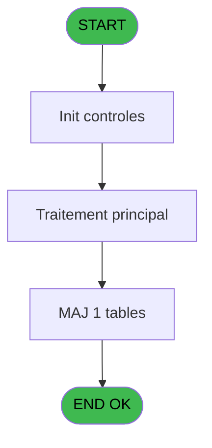

# REF IDE 209 - Browse - comptage_coffre_histo

> **Analyse**: Phases 1-4 2026-02-03 10:11 -> 10:11 (17s) | Assemblage 10:11
> **Pipeline**: V7.2 Enrichi
> **Structure**: 4 onglets (Resume | Ecrans | Donnees | Connexions)

<!-- TAB:Resume -->

## 1. FICHE D'IDENTITE

| Attribut | Valeur |
|----------|--------|
| Projet | REF |
| IDE Position | 209 |
| Nom Programme | Browse - comptage_coffre_histo |
| Fichier source | `Prg_209.xml` |
| Domaine metier | Caisse |
| Taches | 1 (1 ecrans visibles) |
| Tables modifiees | 1 |
| Programmes appeles | 0 |
| :warning: Statut | **ORPHELIN_POTENTIEL** |

## 2. DESCRIPTION FONCTIONNELLE

**Browse - comptage_coffre_histo** assure la gestion complete de ce processus.

Le flux de traitement s'organise en **1 blocs fonctionnels** :

- **Calcul** (1 tache) : calculs de montants, stocks ou compteurs

**Donnees modifiees** : 1 tables en ecriture (comptage_coffre_histo).

## 3. BLOCS FONCTIONNELS

### 3.1 Calcul (1 tache)

Calculs metier : montants, stocks, compteurs.

---

#### 209 - Browse - comptage_coffre_histo [[ECRAN]](#ecran-t1)

**Role** : Traitement : Browse - comptage_coffre_histo.
**Ecran** : 722 x 0 DLU | [Voir mockup](#ecran-t1)

## 5. REGLES METIER

*(Aucune regle metier identifiee)*

## 6. CONTEXTE

- **Appele par**: (aucun)
- **Appelle**: 0 programmes | **Tables**: 1 (W:1 R:0 L:0) | **Taches**: 1 | **Expressions**: 0

<!-- TAB:Ecrans -->

## 8. ECRANS

### 8.1 Forms visibles (1 / 1)

| # | Position | Tache | Nom | Type | Largeur | Hauteur | Bloc |
|---|----------|-------|-----|------|---------|---------|------|
| 1 | 209 | 209 | Browse - comptage_coffre_histo | Type0 | 722 | 0 | Calcul |

### 8.2 Mockups Ecrans

---

#### 209 - Browse - comptage_coffre_histo
**Tache** : [209](#t1) | **Type** : Type0 | **Dimensions** : 722 x 0 DLU
**Bloc** : Calcul | **Titre IDE** : Browse - comptage_coffre_histo

<!-- FORM-DATA:
{
    "width":  722,
    "vFactor":  8,
    "type":  "Type0",
    "hFactor":  4,
    "controls":  [
                     {
                         "x":  8,
                         "type":  "table",
                         "var":  "",
                         "name":  "",
                         "titleH":  12,
                         "color":  "110",
                         "w":  854,
                         "y":  8,
                         "fmt":  "",
                         "parent":  null,
                         "text":  "",
                         "rowH":  13,
                         "h":  182,
                         "cols":  [
                                      {
                                          "title":  "hisuser",
                                          "layer":  1,
                                          "w":  55
                                      },
                                      {
                                          "title":  "hisquand",
                                          "layer":  2,
                                          "w":  38
                                      },
                                      {
                                          "title":  "hischronohisto",
                                          "layer":  3,
                                          "w":  68
                                      },
                                      {
                                          "title":  "hisordre",
                                          "layer":  4,
                                          "w":  33
                                      },
                                      {
                                          "title":  "histype",
                                          "layer":  5,
                                          "w":  30
                                      },
                                      {
                                          "title":  "hislibelle",
                                          "layer":  6,
                                          "w":  100
                                      },
                                      {
                                          "title":  "hisprixunitaire",
                                          "layer":  7,
                                          "w":  87
                                      },
                                      {
                                          "title":  "hisquantite",
                                          "layer":  8,
                                          "w":  44
                                      },
                                      {
                                          "title":  "hismontant",
                                          "layer":  9,
                                          "w":  101
                                      },
                                      {
                                          "title":  "hisdatesaisie",
                                          "layer":  10,
                                          "w":  68
                                      },
                                      {
                                          "title":  "hisheuresaisie",
                                          "layer":  11,
                                          "w":  56
                                      },
                                      {
                                          "title":  "hischronosession",
                                          "layer":  12,
                                          "w":  68
                                      },
                                      {
                                          "title":  "hiscodearticle",
                                          "layer":  13,
                                          "w":  55
                                      },
                                      {
                                          "title":  "hiszoom",
                                          "layer":  14,
                                          "w":  34
                                      }
                                  ],
                         "rows":  14
                     },
                     {
                         "x":  12,
                         "type":  "edit",
                         "var":  "",
                         "y":  23,
                         "w":  48,
                         "fmt":  "",
                         "name":  "hisuser",
                         "h":  10,
                         "color":  "110",
                         "text":  "",
                         "parent":  1
                     },
                     {
                         "x":  67,
                         "type":  "edit",
                         "var":  "",
                         "y":  23,
                         "w":  9,
                         "fmt":  "",
                         "name":  "hisquand",
                         "h":  10,
                         "color":  "110",
                         "text":  "",
                         "parent":  1
                     },
                     {
                         "x":  105,
                         "type":  "edit",
                         "var":  "",
                         "y":  23,
                         "w":  61,
                         "fmt":  "",
                         "name":  "hischronohisto",
                         "h":  10,
                         "color":  "110",
                         "text":  "",
                         "parent":  1
                     },
                     {
                         "x":  173,
                         "type":  "edit",
                         "var":  "",
                         "y":  23,
                         "w":  13,
                         "fmt":  "",
                         "name":  "hisordre",
                         "h":  10,
                         "color":  "110",
                         "text":  "",
                         "parent":  1
                     },
                     {
                         "x":  206,
                         "type":  "edit",
                         "var":  "",
                         "y":  23,
                         "w":  20,
                         "fmt":  "",
                         "name":  "histype",
                         "h":  10,
                         "color":  "110",
                         "text":  "",
                         "parent":  1
                     },
                     {
                         "x":  236,
                         "type":  "edit",
                         "var":  "",
                         "y":  23,
                         "w":  93,
                         "fmt":  "",
                         "name":  "hislibelle",
                         "h":  10,
                         "color":  "110",
                         "text":  "",
                         "parent":  1
                     },
                     {
                         "x":  336,
                         "type":  "edit",
                         "var":  "",
                         "y":  23,
                         "w":  80,
                         "fmt":  "",
                         "name":  "hisprixunitaire",
                         "h":  10,
                         "color":  "110",
                         "text":  "",
                         "parent":  1
                     },
                     {
                         "x":  423,
                         "type":  "edit",
                         "var":  "",
                         "y":  23,
                         "w":  32,
                         "fmt":  "",
                         "name":  "hisquantite",
                         "h":  10,
                         "color":  "110",
                         "text":  "",
                         "parent":  1
                     },
                     {
                         "x":  467,
                         "type":  "edit",
                         "var":  "",
                         "y":  23,
                         "w":  94,
                         "fmt":  "N12.3Z",
                         "name":  "hismontant",
                         "h":  10,
                         "color":  "110",
                         "text":  "",
                         "parent":  1
                     },
                     {
                         "x":  568,
                         "type":  "edit",
                         "var":  "",
                         "y":  23,
                         "w":  61,
                         "fmt":  "",
                         "name":  "hisdatesaisie",
                         "h":  10,
                         "color":  "110",
                         "text":  "",
                         "parent":  1
                     },
                     {
                         "x":  636,
                         "type":  "edit",
                         "var":  "",
                         "y":  23,
                         "w":  46,
                         "fmt":  "",
                         "name":  "hisheuresaisie",
                         "h":  10,
                         "color":  "110",
                         "text":  "",
                         "parent":  1
                     },
                     {
                         "x":  692,
                         "type":  "edit",
                         "var":  "",
                         "y":  23,
                         "w":  61,
                         "fmt":  "",
                         "name":  "hischronosession",
                         "h":  10,
                         "color":  "110",
                         "text":  "",
                         "parent":  1
                     },
                     {
                         "x":  760,
                         "type":  "edit",
                         "var":  "",
                         "y":  23,
                         "w":  32,
                         "fmt":  "",
                         "name":  "hiscodearticle",
                         "h":  10,
                         "color":  "110",
                         "text":  "",
                         "parent":  1
                     },
                     {
                         "x":  815,
                         "type":  "edit",
                         "var":  "",
                         "y":  23,
                         "w":  26,
                         "fmt":  "",
                         "name":  "hiszoom",
                         "h":  10,
                         "color":  "110",
                         "text":  "",
                         "parent":  1
                     }
                 ],
    "taskId":  "209",
    "height":  0
}
-->

<strong>Champs : 14 champs</strong>

| Pos (x,y) | Nom | Variable | Type |
|-----------|-----|----------|------|
| 12,23 | hisuser | - | edit |
| 67,23 | hisquand | - | edit |
| 105,23 | hischronohisto | - | edit |
| 173,23 | hisordre | - | edit |
| 206,23 | histype | - | edit |
| 236,23 | hislibelle | - | edit |
| 336,23 | hisprixunitaire | - | edit |
| 423,23 | hisquantite | - | edit |
| 467,23 | hismontant | - | edit |
| 568,23 | hisdatesaisie | - | edit |
| 636,23 | hisheuresaisie | - | edit |
| 692,23 | hischronosession | - | edit |
| 760,23 | hiscodearticle | - | edit |
| 815,23 | hiszoom | - | edit |

## 9. NAVIGATION

Ecran unique: **Browse - comptage_coffre_histo**

### 9.3 Structure hierarchique (1 tache)

| Position | Tache | Type | Dimensions | Bloc |
|----------|-------|------|------------|------|
| **209.1** | [**Browse - comptage_coffre_histo** (209)](#t1) [mockup](#ecran-t1) | - | 722x0 | Calcul |

### 9.4 Algorigramme

> **Legende**: Vert = START/END OK | Rouge = END KO | Bleu = Decisions
> *Algorigramme auto-genere. Utiliser `/algorigramme` pour une synthese metier detaillee.*

<!-- TAB:Donnees -->

## 10. TABLES

### Tables utilisees (1)

| ID | Nom | Description | Type | R | W | L | Usages |
|----|-----|-------------|------|---|---|---|--------|
| 217 | comptage_coffre_histo | Etat du coffre | DB |   | **W** |   | 1 |

### Colonnes par table (0 / 1 tables avec colonnes identifiees)

Table 217 - comptage_coffre_histo (**W**) - 1 usages

*Table utilisee uniquement en Link ou aucune colonne Real identifiee dans le DataView.*

## 11. VARIABLES

*(Programme sans variables locales mappees)*

## 12. EXPRESSIONS

**0 / 0 expressions decodees (0%)**

### 12.1 Repartition par type

| Type | Expressions | Regles |
|------|-------------|--------|

### 12.2 Expressions cles par type

<!-- TAB:Connexions -->

## 13. GRAPHE D'APPELS

### 13.1 Chaine depuis Main (Callers)

**Chemin**: (pas de callers directs)

### 13.2 Callers

| IDE | Nom Programme | Nb Appels |
|-----|---------------|-----------|
| - | (aucun) | - |

### 13.3 Callees (programmes appeles)

### 13.4 Detail Callees avec contexte

| IDE | Nom Programme | Appels | Contexte |
|-----|---------------|--------|----------|
| - | (aucun) | - | - |

## 14. RECOMMANDATIONS MIGRATION

### 14.1 Profil du programme

| Metrique | Valeur | Impact migration |
|----------|--------|-----------------|
| Lignes de logique | 15 | Programme compact |
| Expressions | 0 | Peu de logique |
| Tables WRITE | 1 | Impact faible |
| Sous-programmes | 0 | Peu de dependances |
| Ecrans visibles | 1 | Ecran unique ou traitement batch |
| Code desactive | 0% (0 / 15) | Code sain |
| Regles metier | 0 | Pas de regle identifiee |

### 14.2 Plan de migration par bloc

#### Calcul (1 tache: 1 ecran, 0 traitement)

- **Strategie** : Services de calcul purs (Domain Services).
- Migrer la logique de calcul (stock, compteurs, montants)

### 14.3 Dependances critiques

| Dependance | Type | Appels | Impact |
|------------|------|--------|--------|
| comptage_coffre_histo | Table WRITE (Database) | 1x | Schema + repository |

---
*Spec DETAILED generee par Pipeline V7.2 - 2026-02-03 10:11*
