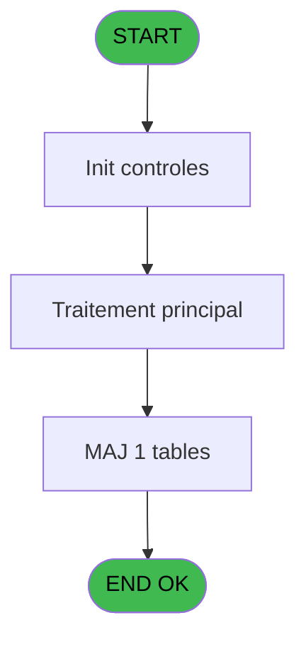
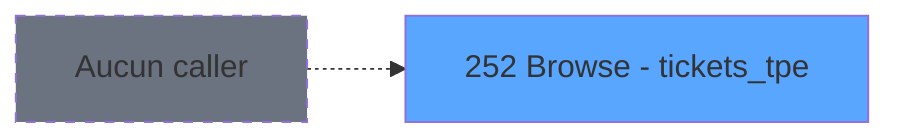

# REF IDE 252 - Browse - tickets_tpe

> **Analyse**: Phases 1-4 2026-02-03 10:32 -> 10:33 (25s) | Assemblage 10:33
> **Pipeline**: V7.2 Enrichi
> **Structure**: 4 onglets (Resume | Ecrans | Donnees | Connexions)

<!-- TAB:Resume -->

## 1. FICHE D'IDENTITE

| Attribut | Valeur |
|----------|--------|
| Projet | REF |
| IDE Position | 252 |
| Nom Programme | Browse - tickets_tpe |
| Fichier source | `Prg_252.xml` |
| Domaine metier | Impression |
| Taches | 1 (1 ecrans visibles) |
| Tables modifiees | 1 |
| Programmes appeles | 0 |
| :warning: Statut | **ORPHELIN_POTENTIEL** |

## 2. DESCRIPTION FONCTIONNELLE

**Browse - tickets_tpe** assure la gestion complete de ce processus.

Le flux de traitement s'organise en **1 blocs fonctionnels** :

- **Impression** (1 tache) : generation de tickets et documents

**Donnees modifiees** : 1 tables en ecriture (tickets_tpe).

## 3. BLOCS FONCTIONNELS

### 3.1 Impression (1 tache)

Generation des documents et tickets.

---

#### 252 - Browse - tickets_tpe [[ECRAN]](#ecran-t1)

**Role** : Generation du document : Browse - tickets_tpe.
**Ecran** : 2158 x 195 DLU | [Voir mockup](#ecran-t1)

## 5. REGLES METIER

*(Aucune regle metier identifiee)*

## 6. CONTEXTE

- **Appele par**: (aucun)
- **Appelle**: 0 programmes | **Tables**: 1 (W:1 R:0 L:0) | **Taches**: 1 | **Expressions**: 0

<!-- TAB:Ecrans -->

## 8. ECRANS

### 8.1 Forms visibles (1 / 1)

| # | Position | Tache | Nom | Type | Largeur | Hauteur | Bloc |
|---|----------|-------|-----|------|---------|---------|------|
| 1 | 252 | 252 | Browse - tickets_tpe | Type0 | 2158 | 195 | Impression |

### 8.2 Mockups Ecrans

---

#### 252 - Browse - tickets_tpe
**Tache** : [252](#t1) | **Type** : Type0 | **Dimensions** : 2158 x 195 DLU
**Bloc** : Impression | **Titre IDE** : Browse - tickets_tpe

<!-- FORM-DATA:
{
    "width":  2158,
    "vFactor":  8,
    "type":  "Type0",
    "hFactor":  4,
    "controls":  [
                     {
                         "x":  8,
                         "type":  "table",
                         "var":  "",
                         "name":  "",
                         "titleH":  12,
                         "color":  "",
                         "w":  2136,
                         "y":  8,
                         "fmt":  "",
                         "parent":  null,
                         "text":  "",
                         "rowH":  13,
                         "h":  182,
                         "cols":  [
                                      {
                                          "title":  "numero_tpe",
                                          "layer":  1,
                                          "w":  48
                                      },
                                      {
                                          "title":  "date_comptable",
                                          "layer":  2,
                                          "w":  68
                                      },
                                      {
                                          "title":  "moyen_de_paiement",
                                          "layer":  3,
                                          "w":  82
                                      },
                                      {
                                          "title":  "ordre_saisie",
                                          "layer":  4,
                                          "w":  48
                                      },
                                      {
                                          "title":  "montant",
                                          "layer":  5,
                                          "w":  92
                                      },
                                      {
                                          "title":  "numero_remise",
                                          "layer":  6,
                                          "w":  189
                                      },
                                      {
                                          "title":  "date_operation_tpe",
                                          "layer":  7,
                                          "w":  77
                                      },
                                      {
                                          "title":  "buffer_libre",
                                          "layer":  8,
                                          "w":  212
                                      },
                                      {
                                          "title":  "service",
                                          "layer":  9,
                                          "w":  33
                                      },
                                      {
                                          "title":  "Vàd",
                                          "layer":  10,
                                          "w":  38
                                      },
                                      {
                                          "title":  "TPE_reel",
                                          "layer":  11,
                                          "w":  122
                                      },
                                      {
                                          "title":  "time_operation_create",
                                          "layer":  12,
                                          "w":  87
                                      },
                                      {
                                          "title":  "date_operation_update",
                                          "layer":  13,
                                          "w":  91
                                      },
                                      {
                                          "title":  "time_operation_update",
                                          "layer":  14,
                                          "w":  90
                                      },
                                      {
                                          "title":  "operateur_create",
                                          "layer":  15,
                                          "w":  68
                                      },
                                      {
                                          "title":  "operateur_update",
                                          "layer":  16,
                                          "w":  70
                                      },
                                      {
                                          "title":  "terminal_create",
                                          "layer":  17,
                                          "w":  61
                                      },
                                      {
                                          "title":  "terminal_update",
                                          "layer":  18,
                                          "w":  63
                                      },
                                      {
                                          "title":  "hostname_create",
                                          "layer":  19,
                                          "w":  290
                                      },
                                      {
                                          "title":  "hostname_update",
                                          "layer":  20,
                                          "w":  290
                                      }
                                  ],
                         "rows":  20
                     },
                     {
                         "x":  12,
                         "type":  "edit",
                         "var":  "",
                         "y":  23,
                         "w":  13,
                         "fmt":  "",
                         "name":  "numero_tpe",
                         "h":  10,
                         "color":  "",
                         "text":  "",
                         "parent":  1
                     },
                     {
                         "x":  60,
                         "type":  "edit",
                         "var":  "",
                         "y":  23,
                         "w":  61,
                         "fmt":  "",
                         "name":  "date_comptable",
                         "h":  10,
                         "color":  "",
                         "text":  "",
                         "parent":  1
                     },
                     {
                         "x":  128,
                         "type":  "edit",
                         "var":  "",
                         "y":  23,
                         "w":  26,
                         "fmt":  "",
                         "name":  "moyen_de_paiement",
                         "h":  10,
                         "color":  "",
                         "text":  "",
                         "parent":  1
                     },
                     {
                         "x":  210,
                         "type":  "edit",
                         "var":  "",
                         "y":  23,
                         "w":  13,
                         "fmt":  "",
                         "name":  "ordre_saisie",
                         "h":  10,
                         "color":  "",
                         "text":  "",
                         "parent":  1
                     },
                     {
                         "x":  258,
                         "type":  "edit",
                         "var":  "",
                         "y":  23,
                         "w":  85,
                         "fmt":  "",
                         "name":  "montant",
                         "h":  10,
                         "color":  "",
                         "text":  "",
                         "parent":  1
                     },
                     {
                         "x":  350,
                         "type":  "edit",
                         "var":  "",
                         "y":  23,
                         "w":  182,
                         "fmt":  "",
                         "name":  "numero_remise",
                         "h":  10,
                         "color":  "",
                         "text":  "",
                         "parent":  1
                     },
                     {
                         "x":  539,
                         "type":  "edit",
                         "var":  "",
                         "y":  23,
                         "w":  61,
                         "fmt":  "",
                         "name":  "date_operation_tpe",
                         "h":  10,
                         "color":  "",
                         "text":  "",
                         "parent":  1
                     },
                     {
                         "x":  616,
                         "type":  "edit",
                         "var":  "",
                         "y":  23,
                         "w":  205,
                         "fmt":  "",
                         "name":  "buffer_libre",
                         "h":  10,
                         "color":  "",
                         "text":  "",
                         "parent":  1
                     },
                     {
                         "x":  828,
                         "type":  "edit",
                         "var":  "",
                         "y":  23,
                         "w":  26,
                         "fmt":  "",
                         "name":  "service",
                         "h":  10,
                         "color":  "",
                         "text":  "",
                         "parent":  1
                     },
                     {
                         "x":  861,
                         "type":  "edit",
                         "var":  "",
                         "y":  23,
                         "w":  31,
                         "fmt":  "",
                         "name":  "Vàd",
                         "h":  10,
                         "color":  "",
                         "text":  "",
                         "parent":  1
                     },
                     {
                         "x":  899,
                         "type":  "edit",
                         "var":  "",
                         "y":  23,
                         "w":  115,
                         "fmt":  "",
                         "name":  "TPE_reel",
                         "h":  10,
                         "color":  "",
                         "text":  "",
                         "parent":  1
                     },
                     {
                         "x":  1021,
                         "type":  "edit",
                         "var":  "",
                         "y":  23,
                         "w":  46,
                         "fmt":  "",
                         "name":  "time_operation_create",
                         "h":  10,
                         "color":  "",
                         "text":  "",
                         "parent":  1
                     },
                     {
                         "x":  1108,
                         "type":  "edit",
                         "var":  "",
                         "y":  23,
                         "w":  61,
                         "fmt":  "",
                         "name":  "date_operation_update",
                         "h":  10,
                         "color":  "",
                         "text":  "",
                         "parent":  1
                     },
                     {
                         "x":  1199,
                         "type":  "edit",
                         "var":  "",
                         "y":  23,
                         "w":  46,
                         "fmt":  "",
                         "name":  "time_operation_update",
                         "h":  10,
                         "color":  "",
                         "text":  "",
                         "parent":  1
                     },
                     {
                         "x":  1289,
                         "type":  "edit",
                         "var":  "",
                         "y":  23,
                         "w":  48,
                         "fmt":  "",
                         "name":  "operateur_create",
                         "h":  10,
                         "color":  "",
                         "text":  "",
                         "parent":  1
                     },
                     {
                         "x":  1357,
                         "type":  "edit",
                         "var":  "",
                         "y":  23,
                         "w":  48,
                         "fmt":  "",
                         "name":  "operateur_update",
                         "h":  10,
                         "color":  "",
                         "text":  "",
                         "parent":  1
                     },
                     {
                         "x":  1427,
                         "type":  "edit",
                         "var":  "",
                         "y":  23,
                         "w":  18,
                         "fmt":  "",
                         "name":  "terminal_create",
                         "h":  10,
                         "color":  "",
                         "text":  "",
                         "parent":  1
                     },
                     {
                         "x":  1488,
                         "type":  "edit",
                         "var":  "",
                         "y":  23,
                         "w":  18,
                         "fmt":  "",
                         "name":  "terminal_update",
                         "h":  10,
                         "color":  "",
                         "text":  "",
                         "parent":  1
                     },
                     {
                         "x":  1551,
                         "type":  "edit",
                         "var":  "",
                         "y":  23,
                         "w":  283,
                         "fmt":  "",
                         "name":  "hostname_create",
                         "h":  10,
                         "color":  "",
                         "text":  "",
                         "parent":  1
                     },
                     {
                         "x":  1841,
                         "type":  "edit",
                         "var":  "",
                         "y":  23,
                         "w":  283,
                         "fmt":  "",
                         "name":  "hostname_update",
                         "h":  10,
                         "color":  "",
                         "text":  "",
                         "parent":  1
                     }
                 ],
    "taskId":  "252",
    "height":  195
}
-->

<strong>Champs : 20 champs</strong>

| Pos (x,y) | Nom | Variable | Type |
|-----------|-----|----------|------|
| 12,23 | numero_tpe | - | edit |
| 60,23 | date_comptable | - | edit |
| 128,23 | moyen_de_paiement | - | edit |
| 210,23 | ordre_saisie | - | edit |
| 258,23 | montant | - | edit |
| 350,23 | numero_remise | - | edit |
| 539,23 | date_operation_tpe | - | edit |
| 616,23 | buffer_libre | - | edit |
| 828,23 | service | - | edit |
| 861,23 | Vàd | - | edit |
| 899,23 | TPE_reel | - | edit |
| 1021,23 | time_operation_create | - | edit |
| 1108,23 | date_operation_update | - | edit |
| 1199,23 | time_operation_update | - | edit |
| 1289,23 | operateur_create | - | edit |
| 1357,23 | operateur_update | - | edit |
| 1427,23 | terminal_create | - | edit |
| 1488,23 | terminal_update | - | edit |
| 1551,23 | hostname_create | - | edit |
| 1841,23 | hostname_update | - | edit |

## 9. NAVIGATION

Ecran unique: **Browse - tickets_tpe**

### 9.3 Structure hierarchique (1 tache)

| Position | Tache | Type | Dimensions | Bloc |
|----------|-------|------|------------|------|
| **252.1** | [**Browse - tickets_tpe** (252)](#t1) [mockup](#ecran-t1) | - | 2158x195 | Impression |

### 9.4 Algorigramme

> **Legende**: Vert = START/END OK | Rouge = END KO | Bleu = Decisions
> *Algorigramme auto-genere. Utiliser `/algorigramme` pour une synthese metier detaillee.*

<!-- TAB:Donnees -->

## 10. TABLES

### Tables utilisees (1)

| ID | Nom | Description | Type | R | W | L | Usages |
|----|-----|-------------|------|---|---|---|--------|
| 260 | tickets_tpe |  | DB |   | **W** |   | 1 |

### Colonnes par table (0 / 1 tables avec colonnes identifiees)

Table 260 - tickets_tpe (**W**) - 1 usages

*Table utilisee uniquement en Link ou aucune colonne Real identifiee dans le DataView.*

## 11. VARIABLES

*(Programme sans variables locales mappees)*

## 12. EXPRESSIONS

**0 / 0 expressions decodees (0%)**

### 12.1 Repartition par type

| Type | Expressions | Regles |
|------|-------------|--------|

### 12.2 Expressions cles par type

<!-- TAB:Connexions -->

## 13. GRAPHE D'APPELS

### 13.1 Chaine depuis Main (Callers)

**Chemin**: (pas de callers directs)

### 13.2 Callers

| IDE | Nom Programme | Nb Appels |
|-----|---------------|-----------|
| - | (aucun) | - |

### 13.3 Callees (programmes appeles)

### 13.4 Detail Callees avec contexte

| IDE | Nom Programme | Appels | Contexte |
|-----|---------------|--------|----------|
| - | (aucun) | - | - |

## 14. RECOMMANDATIONS MIGRATION

### 14.1 Profil du programme

| Metrique | Valeur | Impact migration |
|----------|--------|-----------------|
| Lignes de logique | 21 | Programme compact |
| Expressions | 0 | Peu de logique |
| Tables WRITE | 1 | Impact faible |
| Sous-programmes | 0 | Peu de dependances |
| Ecrans visibles | 1 | Ecran unique ou traitement batch |
| Code desactive | 0% (0 / 21) | Code sain |
| Regles metier | 0 | Pas de regle identifiee |

### 14.2 Plan de migration par bloc

#### Impression (1 tache: 1 ecran, 0 traitement)

- **Strategie** : Templates HTML -> PDF via wkhtmltopdf ou Puppeteer.
- `PrintService` injectable avec choix imprimante

### 14.3 Dependances critiques

| Dependance | Type | Appels | Impact |
|------------|------|--------|--------|
| tickets_tpe | Table WRITE (Database) | 1x | Schema + repository |

---
*Spec DETAILED generee par Pipeline V7.2 - 2026-02-03 10:33*
