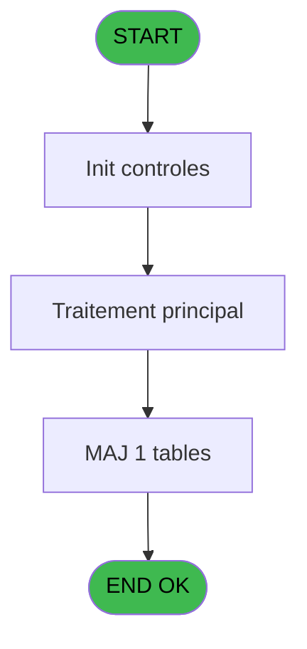

# REF IDE 255 - Browse - vente

> **Analyse**: Phases 1-4 2026-02-03 10:34 -> 10:35 (26s) | Assemblage 10:35
> **Pipeline**: V7.2 Enrichi
> **Structure**: 4 onglets (Resume | Ecrans | Donnees | Connexions)

<!-- TAB:Resume -->

## 1. FICHE D'IDENTITE

| Attribut | Valeur |
|----------|--------|
| Projet | REF |
| IDE Position | 255 |
| Nom Programme | Browse - vente |
| Fichier source | `Prg_255.xml` |
| Domaine metier | Ventes |
| Taches | 1 (1 ecrans visibles) |
| Tables modifiees | 1 |
| Programmes appeles | 0 |
| :warning: Statut | **ORPHELIN_POTENTIEL** |

## 2. DESCRIPTION FONCTIONNELLE

**Browse - vente** assure la gestion complete de ce processus.

Le flux de traitement s'organise en **1 blocs fonctionnels** :

- **Saisie** (1 tache) : ecrans de saisie utilisateur (formulaires, champs, donnees)

**Donnees modifiees** : 1 tables en ecriture (vente).

## 3. BLOCS FONCTIONNELS

### 3.1 Saisie (1 tache)

L'operateur saisit les donnees de la transaction via 1 ecran (Browse - vente).

---

#### 255 - Browse - vente [[ECRAN]](#ecran-t1)

**Role** : Saisie des donnees : Browse - vente.
**Ecran** : 871 x 250 DLU | [Voir mockup](#ecran-t1)

## 5. REGLES METIER

*(Aucune regle metier identifiee)*

## 6. CONTEXTE

- **Appele par**: (aucun)
- **Appelle**: 0 programmes | **Tables**: 1 (W:1 R:0 L:0) | **Taches**: 1 | **Expressions**: 0

<!-- TAB:Ecrans -->

## 8. ECRANS

### 8.1 Forms visibles (1 / 1)

| # | Position | Tache | Nom | Type | Largeur | Hauteur | Bloc |
|---|----------|-------|-----|------|---------|---------|------|
| 1 | 255 | 255 | Browse - vente | Type0 | 871 | 250 | Saisie |

### 8.2 Mockups Ecrans

---

#### 255 - Browse - vente
**Tache** : [255](#t1) | **Type** : Type0 | **Dimensions** : 871 x 250 DLU
**Bloc** : Saisie | **Titre IDE** : Browse - vente

<!-- FORM-DATA:
{
    "width":  871,
    "vFactor":  8,
    "type":  "Type0",
    "hFactor":  4,
    "controls":  [
                     {
                         "x":  8,
                         "type":  "table",
                         "var":  "",
                         "name":  "",
                         "titleH":  12,
                         "color":  "",
                         "w":  5026,
                         "y":  8,
                         "fmt":  "",
                         "parent":  null,
                         "text":  "",
                         "rowH":  13,
                         "h":  182,
                         "cols":  [
                                      {
                                          "title":  "ven_societe",
                                          "layer":  1,
                                          "w":  50
                                      },
                                      {
                                          "title":  "ven_compte_gm",
                                          "layer":  2,
                                          "w":  66
                                      },
                                      {
                                          "title":  "ven_filiation",
                                          "layer":  3,
                                          "w":  48
                                      },
                                      {
                                          "title":  "ven_imputation",
                                          "layer":  4,
                                          "w":  61
                                      },
                                      {
                                          "title":  "ven_sous_imputation",
                                          "layer":  5,
                                          "w":  83
                                      },
                                      {
                                          "title":  "ven_libelle",
                                          "layer":  6,
                                          "w":  122
                                      },
                                      {
                                          "title":  "ven_libelle_supplem_",
                                          "layer":  7,
                                          "w":  122
                                      },
                                      {
                                          "title":  "ven_credit_debit",
                                          "layer":  8,
                                          "w":  66
                                      },
                                      {
                                          "title":  "ven_flag_annulation",
                                          "layer":  9,
                                          "w":  80
                                      },
                                      {
                                          "title":  "ven_code_type",
                                          "layer":  10,
                                          "w":  62
                                      },
                                      {
                                          "title":  "ven_numero_chrono",
                                          "layer":  11,
                                          "w":  82
                                      },
                                      {
                                          "title":  "ven_avec_change",
                                          "layer":  12,
                                          "w":  75
                                      },
                                      {
                                          "title":  "ven_mode_de_paiement",
                                          "layer":  13,
                                          "w":  97
                                      },
                                      {
                                          "title":  "ven_montant",
                                          "layer":  14,
                                          "w":  92
                                      },
                                      {
                                          "title":  "ven_date_comptable",
                                          "layer":  15,
                                          "w":  83
                                      },
                                      {
                                          "title":  "ven_date_d_operation",
                                          "layer":  16,
                                          "w":  89
                                      },
                                      {
                                          "title":  "ven_heure_operation",
                                          "layer":  17,
                                          "w":  84
                                      },
                                      {
                                          "title":  "ven_nbre_d_articles",
                                          "layer":  18,
                                          "w":  80
                                      },
                                      {
                                          "title":  "ven_flag_application",
                                          "layer":  19,
                                          "w":  82
                                      },
                                      {
                                          "title":  "ven_type_transaction",
                                          "layer":  20,
                                          "w":  85
                                      },
                                      {
                                          "title":  "ven_operateur",
                                          "layer":  21,
                                          "w":  58
                                      },
                                      {
                                          "title":  "RowId_263",
                                          "layer":  22,
                                          "w":  58
                                      },
                                      {
                                          "title":  "ven_ref_article",
                                          "layer":  23,
                                          "w":  59
                                      },
                                      {
                                          "title":  "ven_taux_tva",
                                          "layer":  24,
                                          "w":  55
                                      },
                                      {
                                          "title":  "ven_no_facture",
                                          "layer":  25,
                                          "w":  63
                                      },
                                      {
                                          "title":  "ven_service",
                                          "layer":  26,
                                          "w":  50
                                      },
                                      {
                                          "title":  "ven_montant_remise",
                                          "layer":  27,
                                          "w":  82
                                      },
                                      {
                                          "title":  "ven_id_transaction",
                                          "layer":  28,
                                          "w":  189
                                      },
                                      {
                                          "title":  "ven_id_acceptation",
                                          "layer":  29,
                                          "w":  189
                                      },
                                      {
                                          "title":  "ven_free_extra",
                                          "layer":  30,
                                          "w":  60
                                      },
                                      {
                                          "title":  "ven_montant_total_pour free_ext",
                                          "layer":  31,
                                          "w":  128
                                      },
                                      {
                                          "title":  "ven_montant_free_extra",
                                          "layer":  32,
                                          "w":  95
                                      },
                                      {
                                          "title":  "ven_num_terminal_vente",
                                          "layer":  33,
                                          "w":  98
                                      },
                                      {
                                          "title":  "ven_activite_comptable",
                                          "layer":  34,
                                          "w":  94
                                      },
                                      {
                                          "title":  "ven_id_ligne_annulation",
                                          "layer":  35,
                                          "w":  95
                                      },
                                      {
                                          "title":  "ven_num_cheque",
                                          "layer":  36,
                                          "w":  178
                                      },
                                      {
                                          "title":  "ven_type_art",
                                          "layer":  37,
                                          "w":  53
                                      },
                                      {
                                          "title":  "ven_stype_art",
                                          "layer":  38,
                                          "w":  57
                                      },
                                      {
                                          "title":  "ven_login_vendeur",
                                          "layer":  39,
                                          "w":  76
                                      },
                                      {
                                          "title":  "ven_matricule",
                                          "layer":  40,
                                          "w":  178
                                      },
                                      {
                                          "title":  "ven_type_credit",
                                          "layer":  41,
                                          "w":  64
                                      },
                                      {
                                          "title":  "ven_commentaire_annulation",
                                          "layer":  42,
                                          "w":  570
                                      },
                                      {
                                          "title":  "ven_num_tpe",
                                          "layer":  43,
                                          "w":  122
                                      },
                                      {
                                          "title":  "ven_num_ticket",
                                          "layer":  44,
                                          "w":  290
                                      },
                                      {
                                          "title":  "ven_num_ligne",
                                          "layer":  45,
                                          "w":  61
                                      },
                                      {
                                          "title":  "ven_token_id",
                                          "layer":  46,
                                          "w":  189
                                      },
                                      {
                                          "title":  "ven_transaction_id",
                                          "layer":  47,
                                          "w":  189
                                      }
                                  ],
                         "rows":  47
                     },
                     {
                         "x":  12,
                         "type":  "edit",
                         "var":  "",
                         "y":  23,
                         "w":  9,
                         "fmt":  "",
                         "name":  "ven_societe",
                         "h":  10,
                         "color":  "",
                         "text":  "",
                         "parent":  94
                     },
                     {
                         "x":  62,
                         "type":  "edit",
                         "var":  "",
                         "y":  23,
                         "w":  42,
                         "fmt":  "",
                         "name":  "ven_compte_gm",
                         "h":  10,
                         "color":  "",
                         "text":  "",
                         "parent":  94
                     },
                     {
                         "x":  128,
                         "type":  "edit",
                         "var":  "",
                         "y":  23,
                         "w":  18,
                         "fmt":  "",
                         "name":  "ven_filiation",
                         "h":  10,
                         "color":  "",
                         "text":  "",
                         "parent":  94
                     },
                     {
                         "x":  176,
                         "type":  "edit",
                         "var":  "",
                         "y":  23,
                         "w":  51,
                         "fmt":  "",
                         "name":  "ven_imputation",
                         "h":  10,
                         "color":  "",
                         "text":  "",
                         "parent":  94
                     },
                     {
                         "x":  237,
                         "type":  "edit",
                         "var":  "",
                         "y":  23,
                         "w":  18,
                         "fmt":  "",
                         "name":  "ven_sous_imputation",
                         "h":  10,
                         "color":  "",
                         "text":  "",
                         "parent":  94
                     },
                     {
                         "x":  320,
                         "type":  "edit",
                         "var":  "",
                         "y":  23,
                         "w":  115,
                         "fmt":  "",
                         "name":  "ven_libelle",
                         "h":  10,
                         "color":  "",
                         "text":  "",
                         "parent":  94
                     },
                     {
                         "x":  442,
                         "type":  "edit",
                         "var":  "",
                         "y":  23,
                         "w":  115,
                         "fmt":  "",
                         "name":  "ven_libelle_supplem_",
                         "h":  10,
                         "color":  "",
                         "text":  "",
                         "parent":  94
                     },
                     {
                         "x":  564,
                         "type":  "edit",
                         "var":  "",
                         "y":  23,
                         "w":  9,
                         "fmt":  "",
                         "name":  "ven_credit_debit",
                         "h":  10,
                         "color":  "",
                         "text":  "",
                         "parent":  94
                     },
                     {
                         "x":  630,
                         "type":  "edit",
                         "var":  "",
                         "y":  23,
                         "w":  9,
                         "fmt":  "",
                         "name":  "ven_flag_annulation",
                         "h":  10,
                         "color":  "",
                         "text":  "",
                         "parent":  94
                     },
                     {
                         "x":  710,
                         "type":  "edit",
                         "var":  "",
                         "y":  23,
                         "w":  9,
                         "fmt":  "",
                         "name":  "ven_code_type",
                         "h":  10,
                         "color":  "",
                         "text":  "",
                         "parent":  94
                     },
                     {
                         "x":  772,
                         "type":  "edit",
                         "var":  "",
                         "y":  23,
                         "w":  42,
                         "fmt":  "",
                         "name":  "ven_numero_chrono",
                         "h":  10,
                         "color":  "",
                         "text":  "",
                         "parent":  94
                     },
                     {
                         "x":  854,
                         "type":  "edit",
                         "var":  "",
                         "y":  23,
                         "w":  9,
                         "fmt":  "",
                         "name":  "ven_avec_change",
                         "h":  10,
                         "color":  "",
                         "text":  "",
                         "parent":  94
                     },
                     {
                         "x":  929,
                         "type":  "edit",
                         "var":  "",
                         "y":  23,
                         "w":  26,
                         "fmt":  "",
                         "name":  "ven_mode_de_paiement",
                         "h":  10,
                         "color":  "",
                         "text":  "",
                         "parent":  94
                     },
                     {
                         "x":  1026,
                         "type":  "edit",
                         "var":  "",
                         "y":  23,
                         "w":  85,
                         "fmt":  "",
                         "name":  "ven_montant",
                         "h":  10,
                         "color":  "",
                         "text":  "",
                         "parent":  94
                     },
                     {
                         "x":  1118,
                         "type":  "edit",
                         "var":  "",
                         "y":  23,
                         "w":  61,
                         "fmt":  "",
                         "name":  "ven_date_comptable",
                         "h":  10,
                         "color":  "",
                         "text":  "",
                         "parent":  94
                     },
                     {
                         "x":  1201,
                         "type":  "edit",
                         "var":  "",
                         "y":  23,
                         "w":  61,
                         "fmt":  "",
                         "name":  "ven_date_d_operation",
                         "h":  10,
                         "color":  "",
                         "text":  "",
                         "parent":  94
                     },
                     {
                         "x":  1290,
                         "type":  "edit",
                         "var":  "",
                         "y":  23,
                         "w":  46,
                         "fmt":  "",
                         "name":  "ven_heure_operation",
                         "h":  10,
                         "color":  "",
                         "text":  "",
                         "parent":  94
                     },
                     {
                         "x":  1374,
                         "type":  "edit",
                         "var":  "",
                         "y":  23,
                         "w":  18,
                         "fmt":  "",
                         "name":  "ven_nbre_d_articles",
                         "h":  10,
                         "color":  "",
                         "text":  "",
                         "parent":  94
                     },
                     {
                         "x":  1454,
                         "type":  "edit",
                         "var":  "",
                         "y":  23,
                         "w":  9,
                         "fmt":  "",
                         "name":  "ven_flag_application",
                         "h":  10,
                         "color":  "",
                         "text":  "",
                         "parent":  94
                     },
                     {
                         "x":  1536,
                         "type":  "edit",
                         "var":  "",
                         "y":  23,
                         "w":  9,
                         "fmt":  "",
                         "name":  "ven_type_transaction",
                         "h":  10,
                         "color":  "",
                         "text":  "",
                         "parent":  94
                     },
                     {
                         "x":  1621,
                         "type":  "edit",
                         "var":  "",
                         "y":  23,
                         "w":  48,
                         "fmt":  "",
                         "name":  "ven_operateur",
                         "h":  10,
                         "color":  "",
                         "text":  "",
                         "parent":  94
                     },
                     {
                         "x":  1679,
                         "type":  "edit",
                         "var":  "",
                         "y":  23,
                         "w":  51,
                         "fmt":  "",
                         "name":  "RowId_263",
                         "h":  10,
                         "color":  "",
                         "text":  "",
                         "parent":  94
                     },
                     {
                         "x":  1737,
                         "type":  "edit",
                         "var":  "",
                         "y":  23,
                         "w":  51,
                         "fmt":  "",
                         "name":  "ven_ref_article",
                         "h":  10,
                         "color":  "",
                         "text":  "",
                         "parent":  94
                     },
                     {
                         "x":  1796,
                         "type":  "edit",
                         "var":  "",
                         "y":  23,
                         "w":  37,
                         "fmt":  "",
                         "name":  "ven_taux_tva",
                         "h":  10,
                         "color":  "",
                         "text":  "",
                         "parent":  94
                     },
                     {
                         "x":  1851,
                         "type":  "edit",
                         "var":  "",
                         "y":  23,
                         "w":  51,
                         "fmt":  "",
                         "name":  "ven_no_facture",
                         "h":  10,
                         "color":  "",
                         "text":  "",
                         "parent":  94
                     },
                     {
                         "x":  1914,
                         "type":  "edit",
                         "var":  "",
                         "y":  23,
                         "w":  26,
                         "fmt":  "",
                         "name":  "ven_service",
                         "h":  10,
                         "color":  "",
                         "text":  "",
                         "parent":  94
                     },
                     {
                         "x":  1964,
                         "type":  "edit",
                         "var":  "",
                         "y":  23,
                         "w":  75,
                         "fmt":  "",
                         "name":  "ven_montant_remise",
                         "h":  10,
                         "color":  "",
                         "text":  "",
                         "parent":  94
                     },
                     {
                         "x":  2046,
                         "type":  "edit",
                         "var":  "",
                         "y":  23,
                         "w":  182,
                         "fmt":  "",
                         "name":  "ven_id_transaction",
                         "h":  10,
                         "color":  "",
                         "text":  "",
                         "parent":  94
                     },
                     {
                         "x":  2235,
                         "type":  "edit",
                         "var":  "",
                         "y":  23,
                         "w":  182,
                         "fmt":  "",
                         "name":  "ven_id_acceptation",
                         "h":  10,
                         "color":  "",
                         "text":  "",
                         "parent":  94
                     },
                     {
                         "x":  2424,
                         "type":  "edit",
                         "var":  "",
                         "y":  23,
                         "w":  31,
                         "fmt":  "",
                         "name":  "ven_free_extra",
                         "h":  10,
                         "color":  "",
                         "text":  "",
                         "parent":  94
                     },
                     {
                         "x":  2484,
                         "type":  "edit",
                         "var":  "",
                         "y":  23,
                         "w":  75,
                         "fmt":  "",
                         "name":  "ven_montant_total_pour free_ext",
                         "h":  10,
                         "color":  "",
                         "text":  "",
                         "parent":  94
                     },
                     {
                         "x":  2612,
                         "type":  "edit",
                         "var":  "",
                         "y":  23,
                         "w":  75,
                         "fmt":  "",
                         "name":  "ven_montant_free_extra",
                         "h":  10,
                         "color":  "",
                         "text":  "",
                         "parent":  94
                     },
                     {
                         "x":  2707,
                         "type":  "edit",
                         "var":  "",
                         "y":  23,
                         "w":  18,
                         "fmt":  "",
                         "name":  "ven_num_terminal_vente",
                         "h":  10,
                         "color":  "",
                         "text":  "",
                         "parent":  94
                     },
                     {
                         "x":  2805,
                         "type":  "edit",
                         "var":  "",
                         "y":  23,
                         "w":  18,
                         "fmt":  "",
                         "name":  "ven_activite_comptable",
                         "h":  10,
                         "color":  "",
                         "text":  "",
                         "parent":  94
                     },
                     {
                         "x":  2899,
                         "type":  "edit",
                         "var":  "",
                         "y":  23,
                         "w":  51,
                         "fmt":  "",
                         "name":  "ven_id_ligne_annulation",
                         "h":  10,
                         "color":  "",
                         "text":  "",
                         "parent":  94
                     },
                     {
                         "x":  2994,
                         "type":  "edit",
                         "var":  "",
                         "y":  23,
                         "w":  171,
                         "fmt":  "",
                         "name":  "ven_num_cheque",
                         "h":  10,
                         "color":  "",
                         "text":  "",
                         "parent":  94
                     },
                     {
                         "x":  3172,
                         "type":  "edit",
                         "var":  "",
                         "y":  23,
                         "w":  37,
                         "fmt":  "",
                         "name":  "ven_type_art",
                         "h":  10,
                         "color":  "",
                         "text":  "",
                         "parent":  94
                     },
                     {
                         "x":  3225,
                         "type":  "edit",
                         "var":  "",
                         "y":  23,
                         "w":  37,
                         "fmt":  "",
                         "name":  "ven_stype_art",
                         "h":  10,
                         "color":  "",
                         "text":  "",
                         "parent":  94
                     },
                     {
                         "x":  3282,
                         "type":  "edit",
                         "var":  "",
                         "y":  23,
                         "w":  48,
                         "fmt":  "",
                         "name":  "ven_login_vendeur",
                         "h":  10,
                         "color":  "",
                         "text":  "",
                         "parent":  94
                     },
                     {
                         "x":  3358,
                         "type":  "edit",
                         "var":  "",
                         "y":  23,
                         "w":  171,
                         "fmt":  "",
                         "name":  "ven_matricule",
                         "h":  10,
                         "color":  "",
                         "text":  "",
                         "parent":  94
                     },
                     {
                         "x":  3536,
                         "type":  "edit",
                         "var":  "",
                         "y":  23,
                         "w":  14,
                         "fmt":  "",
                         "name":  "ven_type_credit",
                         "h":  10,
                         "color":  "",
                         "text":  "",
                         "parent":  94
                     },
                     {
                         "x":  3600,
                         "type":  "edit",
                         "var":  "",
                         "y":  23,
                         "w":  563,
                         "fmt":  "",
                         "name":  "ven_commentaire_annulation",
                         "h":  10,
                         "color":  "",
                         "text":  "",
                         "parent":  94
                     },
                     {
                         "x":  4170,
                         "type":  "edit",
                         "var":  "",
                         "y":  23,
                         "w":  115,
                         "fmt":  "",
                         "name":  "ven_num_tpe",
                         "h":  10,
                         "color":  "",
                         "text":  "",
                         "parent":  94
                     },
                     {
                         "x":  4292,
                         "type":  "edit",
                         "var":  "",
                         "y":  23,
                         "w":  283,
                         "fmt":  "",
                         "name":  "ven_num_ticket",
                         "h":  10,
                         "color":  "",
                         "text":  "",
                         "parent":  94
                     },
                     {
                         "x":  4582,
                         "type":  "edit",
                         "var":  "",
                         "y":  23,
                         "w":  22,
                         "fmt":  "",
                         "name":  "ven_num_ligne",
                         "h":  10,
                         "color":  "",
                         "text":  "",
                         "parent":  94
                     },
                     {
                         "x":  4643,
                         "type":  "edit",
                         "var":  "",
                         "y":  23,
                         "w":  182,
                         "fmt":  "",
                         "name":  "ven_token_id",
                         "h":  10,
                         "color":  "",
                         "text":  "",
                         "parent":  94
                     },
                     {
                         "x":  4832,
                         "type":  "edit",
                         "var":  "",
                         "y":  23,
                         "w":  182,
                         "fmt":  "",
                         "name":  "ven_transaction_id",
                         "h":  10,
                         "color":  "",
                         "text":  "",
                         "parent":  94
                     }
                 ],
    "taskId":  "255",
    "height":  250
}
-->

<strong>Champs : 47 champs</strong>

| Pos (x,y) | Nom | Variable | Type |
|-----------|-----|----------|------|
| 12,23 | ven_societe | - | edit |
| 62,23 | ven_compte_gm | - | edit |
| 128,23 | ven_filiation | - | edit |
| 176,23 | ven_imputation | - | edit |
| 237,23 | ven_sous_imputation | - | edit |
| 320,23 | ven_libelle | - | edit |
| 442,23 | ven_libelle_supplem_ | - | edit |
| 564,23 | ven_credit_debit | - | edit |
| 630,23 | ven_flag_annulation | - | edit |
| 710,23 | ven_code_type | - | edit |
| 772,23 | ven_numero_chrono | - | edit |
| 854,23 | ven_avec_change | - | edit |
| 929,23 | ven_mode_de_paiement | - | edit |
| 1026,23 | ven_montant | - | edit |
| 1118,23 | ven_date_comptable | - | edit |
| 1201,23 | ven_date_d_operation | - | edit |
| 1290,23 | ven_heure_operation | - | edit |
| 1374,23 | ven_nbre_d_articles | - | edit |
| 1454,23 | ven_flag_application | - | edit |
| 1536,23 | ven_type_transaction | - | edit |
| 1621,23 | ven_operateur | - | edit |
| 1679,23 | RowId_263 | - | edit |
| 1737,23 | ven_ref_article | - | edit |
| 1796,23 | ven_taux_tva | - | edit |
| 1851,23 | ven_no_facture | - | edit |
| 1914,23 | ven_service | - | edit |
| 1964,23 | ven_montant_remise | - | edit |
| 2046,23 | ven_id_transaction | - | edit |
| 2235,23 | ven_id_acceptation | - | edit |
| 2424,23 | ven_free_extra | - | edit |
| 2484,23 | ven_montant_total_pour free_ext | - | edit |
| 2612,23 | ven_montant_free_extra | - | edit |
| 2707,23 | ven_num_terminal_vente | - | edit |
| 2805,23 | ven_activite_comptable | - | edit |
| 2899,23 | ven_id_ligne_annulation | - | edit |
| 2994,23 | ven_num_cheque | - | edit |
| 3172,23 | ven_type_art | - | edit |
| 3225,23 | ven_stype_art | - | edit |
| 3282,23 | ven_login_vendeur | - | edit |
| 3358,23 | ven_matricule | - | edit |
| 3536,23 | ven_type_credit | - | edit |
| 3600,23 | ven_commentaire_annulation | - | edit |
| 4170,23 | ven_num_tpe | - | edit |
| 4292,23 | ven_num_ticket | - | edit |
| 4582,23 | ven_num_ligne | - | edit |
| 4643,23 | ven_token_id | - | edit |
| 4832,23 | ven_transaction_id | - | edit |

## 9. NAVIGATION

Ecran unique: **Browse - vente**

### 9.3 Structure hierarchique (1 tache)

| Position | Tache | Type | Dimensions | Bloc |
|----------|-------|------|------------|------|
| **255.1** | [**Browse - vente** (255)](#t1) [mockup](#ecran-t1) | - | 871x250 | Saisie |

### 9.4 Algorigramme

> **Legende**: Vert = START/END OK | Rouge = END KO | Bleu = Decisions
> *Algorigramme auto-genere. Utiliser `/algorigramme` pour une synthese metier detaillee.*

<!-- TAB:Donnees -->

## 10. TABLES

### Tables utilisees (1)

| ID | Nom | Description | Type | R | W | L | Usages |
|----|-----|-------------|------|---|---|---|--------|
| 263 | vente | Donnees de ventes | DB |   | **W** |   | 1 |

### Colonnes par table (0 / 1 tables avec colonnes identifiees)

Table 263 - vente (**W**) - 1 usages

*Table utilisee uniquement en Link ou aucune colonne Real identifiee dans le DataView.*

## 11. VARIABLES

*(Programme sans variables locales mappees)*

## 12. EXPRESSIONS

**0 / 0 expressions decodees (0%)**

### 12.1 Repartition par type

| Type | Expressions | Regles |
|------|-------------|--------|

### 12.2 Expressions cles par type

<!-- TAB:Connexions -->

## 13. GRAPHE D'APPELS

### 13.1 Chaine depuis Main (Callers)

**Chemin**: (pas de callers directs)

### 13.2 Callers

| IDE | Nom Programme | Nb Appels |
|-----|---------------|-----------|
| - | (aucun) | - |

### 13.3 Callees (programmes appeles)

### 13.4 Detail Callees avec contexte

| IDE | Nom Programme | Appels | Contexte |
|-----|---------------|--------|----------|
| - | (aucun) | - | - |

## 14. RECOMMANDATIONS MIGRATION

### 14.1 Profil du programme

| Metrique | Valeur | Impact migration |
|----------|--------|-----------------|
| Lignes de logique | 48 | Programme compact |
| Expressions | 0 | Peu de logique |
| Tables WRITE | 1 | Impact faible |
| Sous-programmes | 0 | Peu de dependances |
| Ecrans visibles | 1 | Ecran unique ou traitement batch |
| Code desactive | 0% (0 / 48) | Code sain |
| Regles metier | 0 | Pas de regle identifiee |

### 14.2 Plan de migration par bloc

#### Saisie (1 tache: 1 ecran, 0 traitement)

- **Strategie** : Formulaire React/Blazor avec validation Zod/FluentValidation.
- Reproduire 1 ecran : Browse - vente
- Validation temps reel cote client + serveur

### 14.3 Dependances critiques

| Dependance | Type | Appels | Impact |
|------------|------|--------|--------|
| vente | Table WRITE (Database) | 1x | Schema + repository |

---
*Spec DETAILED generee par Pipeline V7.2 - 2026-02-03 10:35*
