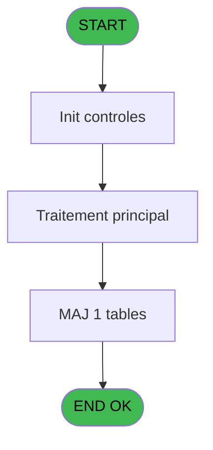

# REF IDE 29 - Browse - personnel_go______go

> **Analyse**: Phases 1-4 2026-02-03 01:15 -> 01:16 (36s) | Assemblage 01:16
> **Pipeline**: V7.2 Enrichi
> **Structure**: 4 onglets (Resume | Ecrans | Donnees | Connexions)

<!-- TAB:Resume -->

## 1. FICHE D'IDENTITE

| Attribut | Valeur |
|----------|--------|
| Projet | REF |
| IDE Position | 29 |
| Nom Programme | Browse - personnel_go______go |
| Fichier source | `Prg_29.xml` |
| Domaine metier | General |
| Taches | 1 (1 ecrans visibles) |
| Tables modifiees | 1 |
| Programmes appeles | 0 |
| :warning: Statut | **ORPHELIN_POTENTIEL** |

## 2. DESCRIPTION FONCTIONNELLE

**Browse - personnel_go______go** assure la gestion complete de ce processus.

Le flux de traitement s'organise en **1 blocs fonctionnels** :

- **Traitement** (1 tache) : traitements metier divers

**Donnees modifiees** : 1 tables en ecriture (personnel_go______go).

## 3. BLOCS FONCTIONNELS

### 3.1 Traitement (1 tache)

Traitements internes.

---

#### 29 - Browse - personnel_go______go [[ECRAN]](#ecran-t1)

**Role** : Traitement : Browse - personnel_go______go.
**Ecran** : 1721 x 480 DLU | [Voir mockup](#ecran-t1)

## 5. REGLES METIER

*(Aucune regle metier identifiee)*

## 6. CONTEXTE

- **Appele par**: (aucun)
- **Appelle**: 0 programmes | **Tables**: 1 (W:1 R:0 L:0) | **Taches**: 1 | **Expressions**: 0

<!-- TAB:Ecrans -->

## 8. ECRANS

### 8.1 Forms visibles (1 / 1)

| # | Position | Tache | Nom | Type | Largeur | Hauteur | Bloc |
|---|----------|-------|-----|------|---------|---------|------|
| 1 | 29 | 29 | Browse - personnel_go______go | Type0 | 1721 | 480 | Traitement |

### 8.2 Mockups Ecrans

---

#### 29 - Browse - personnel_go______go
**Tache** : [29](#t1) | **Type** : Type0 | **Dimensions** : 1721 x 480 DLU
**Bloc** : Traitement | **Titre IDE** : Browse - personnel_go______go

<!-- FORM-DATA:
{
    "width":  1721,
    "vFactor":  8,
    "type":  "Type0",
    "hFactor":  4,
    "controls":  [
                     {
                         "x":  8,
                         "type":  "table",
                         "var":  "",
                         "name":  "",
                         "titleH":  12,
                         "color":  "",
                         "w":  1699,
                         "y":  8,
                         "fmt":  "",
                         "parent":  null,
                         "text":  "",
                         "rowH":  13,
                         "h":  400,
                         "cols":  [
                                      {
                                          "title":  "go_societe",
                                          "layer":  1,
                                          "w":  45
                                      },
                                      {
                                          "title":  "go_compte",
                                          "layer":  2,
                                          "w":  49
                                      },
                                      {
                                          "title":  "go_filiation",
                                          "layer":  3,
                                          "w":  43
                                      },
                                      {
                                          "title":  "go_nom",
                                          "layer":  4,
                                          "w":  94
                                      },
                                      {
                                          "title":  "go_prenom",
                                          "layer":  5,
                                          "w":  66
                                      },
                                      {
                                          "title":  "go_surnom",
                                          "layer":  6,
                                          "w":  66
                                      },
                                      {
                                          "title":  "go_sexe",
                                          "layer":  7,
                                          "w":  35
                                      },
                                      {
                                          "title":  "go_date_naissance",
                                          "layer":  8,
                                          "w":  78
                                      },
                                      {
                                          "title":  "go_age",
                                          "layer":  9,
                                          "w":  32
                                      },
                                      {
                                          "title":  "go_code_service",
                                          "layer":  10,
                                          "w":  69
                                      },
                                      {
                                          "title":  "go_service",
                                          "layer":  11,
                                          "w":  150
                                      },
                                      {
                                          "title":  "go_fonction",
                                          "layer":  12,
                                          "w":  150
                                      },
                                      {
                                          "title":  "go_contrat",
                                          "layer":  13,
                                          "w":  94
                                      },
                                      {
                                          "title":  "go_code_vip",
                                          "layer":  14,
                                          "w":  53
                                      },
                                      {
                                          "title":  "go_nationalite",
                                          "layer":  15,
                                          "w":  56
                                      },
                                      {
                                          "title":  "go_fumeur",
                                          "layer":  16,
                                          "w":  43
                                      },
                                      {
                                          "title":  "go_type_personnel",
                                          "layer":  17,
                                          "w":  75
                                      },
                                      {
                                          "title":  "go_num_club",
                                          "layer":  18,
                                          "w":  58
                                      },
                                      {
                                          "title":  "go_lettre_controle",
                                          "layer":  19,
                                          "w":  71
                                      },
                                      {
                                          "title":  "go_filiation_club",
                                          "layer":  20,
                                          "w":  64
                                      },
                                      {
                                          "title":  "go_date_debut",
                                          "layer":  21,
                                          "w":  68
                                      },
                                      {
                                          "title":  "go_date_fin",
                                          "layer":  22,
                                          "w":  68
                                      },
                                      {
                                          "title":  "go_facturable",
                                          "layer":  23,
                                          "w":  55
                                      },
                                      {
                                          "title":  "go_cat_emploi",
                                          "layer":  24,
                                          "w":  58
                                      },
                                      {
                                          "title":  "go_bsi_ok",
                                          "layer":  25,
                                          "w":  42
                                      }
                                  ],
                         "rows":  25
                     },
                     {
                         "x":  12,
                         "type":  "edit",
                         "var":  "",
                         "y":  23,
                         "w":  9,
                         "fmt":  "",
                         "name":  "go_societe",
                         "h":  10,
                         "color":  "110",
                         "text":  "",
                         "parent":  1
                     },
                     {
                         "x":  57,
                         "type":  "edit",
                         "var":  "",
                         "y":  23,
                         "w":  42,
                         "fmt":  "",
                         "name":  "go_compte",
                         "h":  10,
                         "color":  "110",
                         "text":  "",
                         "parent":  1
                     },
                     {
                         "x":  106,
                         "type":  "edit",
                         "var":  "",
                         "y":  23,
                         "w":  18,
                         "fmt":  "",
                         "name":  "go_filiation",
                         "h":  10,
                         "color":  "110",
                         "text":  "",
                         "parent":  1
                     },
                     {
                         "x":  149,
                         "type":  "edit",
                         "var":  "",
                         "y":  23,
                         "w":  87,
                         "fmt":  "",
                         "name":  "go_nom",
                         "h":  10,
                         "color":  "110",
                         "text":  "",
                         "parent":  1
                     },
                     {
                         "x":  243,
                         "type":  "edit",
                         "var":  "",
                         "y":  23,
                         "w":  59,
                         "fmt":  "",
                         "name":  "go_prenom",
                         "h":  10,
                         "color":  "110",
                         "text":  "",
                         "parent":  1
                     },
                     {
                         "x":  309,
                         "type":  "edit",
                         "var":  "",
                         "y":  23,
                         "w":  59,
                         "fmt":  "",
                         "name":  "go_surnom",
                         "h":  10,
                         "color":  "110",
                         "text":  "",
                         "parent":  1
                     },
                     {
                         "x":  375,
                         "type":  "edit",
                         "var":  "",
                         "y":  23,
                         "w":  9,
                         "fmt":  "",
                         "name":  "go_sexe",
                         "h":  10,
                         "color":  "110",
                         "text":  "",
                         "parent":  1
                     },
                     {
                         "x":  410,
                         "type":  "edit",
                         "var":  "",
                         "y":  23,
                         "w":  61,
                         "fmt":  "",
                         "name":  "go_date_naissance",
                         "h":  10,
                         "color":  "110",
                         "text":  "",
                         "parent":  1
                     },
                     {
                         "x":  488,
                         "type":  "edit",
                         "var":  "",
                         "y":  23,
                         "w":  13,
                         "fmt":  "",
                         "name":  "go_age",
                         "h":  10,
                         "color":  "110",
                         "text":  "",
                         "parent":  1
                     },
                     {
                         "x":  520,
                         "type":  "edit",
                         "var":  "",
                         "y":  23,
                         "w":  14,
                         "fmt":  "",
                         "name":  "go_code_service",
                         "h":  10,
                         "color":  "110",
                         "text":  "",
                         "parent":  1
                     },
                     {
                         "x":  589,
                         "type":  "edit",
                         "var":  "",
                         "y":  23,
                         "w":  143,
                         "fmt":  "",
                         "name":  "go_service",
                         "h":  10,
                         "color":  "110",
                         "text":  "",
                         "parent":  1
                     },
                     {
                         "x":  739,
                         "type":  "edit",
                         "var":  "",
                         "y":  23,
                         "w":  143,
                         "fmt":  "",
                         "name":  "go_fonction",
                         "h":  10,
                         "color":  "110",
                         "text":  "",
                         "parent":  1
                     },
                     {
                         "x":  889,
                         "type":  "edit",
                         "var":  "",
                         "y":  23,
                         "w":  87,
                         "fmt":  "",
                         "name":  "go_contrat",
                         "h":  10,
                         "color":  "110",
                         "text":  "",
                         "parent":  1
                     },
                     {
                         "x":  983,
                         "type":  "edit",
                         "var":  "",
                         "y":  23,
                         "w":  9,
                         "fmt":  "",
                         "name":  "go_code_vip",
                         "h":  10,
                         "color":  "110",
                         "text":  "",
                         "parent":  1
                     },
                     {
                         "x":  1036,
                         "type":  "edit",
                         "var":  "",
                         "y":  23,
                         "w":  14,
                         "fmt":  "",
                         "name":  "go_nationalite",
                         "h":  10,
                         "color":  "110",
                         "text":  "",
                         "parent":  1
                     },
                     {
                         "x":  1092,
                         "type":  "edit",
                         "var":  "",
                         "y":  23,
                         "w":  9,
                         "fmt":  "",
                         "name":  "go_fumeur",
                         "h":  10,
                         "color":  "110",
                         "text":  "",
                         "parent":  1
                     },
                     {
                         "x":  1135,
                         "type":  "edit",
                         "var":  "",
                         "y":  23,
                         "w":  9,
                         "fmt":  "",
                         "name":  "go_type_personnel",
                         "h":  10,
                         "color":  "110",
                         "text":  "",
                         "parent":  1
                     },
                     {
                         "x":  1210,
                         "type":  "edit",
                         "var":  "",
                         "y":  23,
                         "w":  51,
                         "fmt":  "",
                         "name":  "go_num_club",
                         "h":  10,
                         "color":  "110",
                         "text":  "",
                         "parent":  1
                     },
                     {
                         "x":  1268,
                         "type":  "edit",
                         "var":  "",
                         "y":  23,
                         "w":  9,
                         "fmt":  "",
                         "name":  "go_lettre_controle",
                         "h":  10,
                         "color":  "110",
                         "text":  "",
                         "parent":  1
                     },
                     {
                         "x":  1339,
                         "type":  "edit",
                         "var":  "",
                         "y":  23,
                         "w":  18,
                         "fmt":  "",
                         "name":  "go_filiation_club",
                         "h":  10,
                         "color":  "110",
                         "text":  "",
                         "parent":  1
                     },
                     {
                         "x":  1403,
                         "type":  "edit",
                         "var":  "",
                         "y":  23,
                         "w":  61,
                         "fmt":  "",
                         "name":  "go_date_debut",
                         "h":  10,
                         "color":  "110",
                         "text":  "",
                         "parent":  1
                     },
                     {
                         "x":  1471,
                         "type":  "edit",
                         "var":  "",
                         "y":  23,
                         "w":  61,
                         "fmt":  "",
                         "name":  "go_date_fin",
                         "h":  10,
                         "color":  "110",
                         "text":  "",
                         "parent":  1
                     },
                     {
                         "x":  1539,
                         "type":  "edit",
                         "var":  "",
                         "y":  23,
                         "w":  9,
                         "fmt":  "",
                         "name":  "go_facturable",
                         "h":  10,
                         "color":  "110",
                         "text":  "",
                         "parent":  1
                     },
                     {
                         "x":  1594,
                         "type":  "edit",
                         "var":  "",
                         "y":  23,
                         "w":  9,
                         "fmt":  "",
                         "name":  "go_cat_emploi",
                         "h":  10,
                         "color":  "110",
                         "text":  "",
                         "parent":  1
                     },
                     {
                         "x":  1652,
                         "type":  "edit",
                         "var":  "",
                         "y":  23,
                         "w":  31,
                         "fmt":  "",
                         "name":  "go_bsi_ok",
                         "h":  10,
                         "color":  "110",
                         "text":  "",
                         "parent":  1
                     }
                 ],
    "taskId":  "29",
    "height":  480
}
-->

<strong>Champs : 25 champs</strong>

| Pos (x,y) | Nom | Variable | Type |
|-----------|-----|----------|------|
| 12,23 | go_societe | - | edit |
| 57,23 | go_compte | - | edit |
| 106,23 | go_filiation | - | edit |
| 149,23 | go_nom | - | edit |
| 243,23 | go_prenom | - | edit |
| 309,23 | go_surnom | - | edit |
| 375,23 | go_sexe | - | edit |
| 410,23 | go_date_naissance | - | edit |
| 488,23 | go_age | - | edit |
| 520,23 | go_code_service | - | edit |
| 589,23 | go_service | - | edit |
| 739,23 | go_fonction | - | edit |
| 889,23 | go_contrat | - | edit |
| 983,23 | go_code_vip | - | edit |
| 1036,23 | go_nationalite | - | edit |
| 1092,23 | go_fumeur | - | edit |
| 1135,23 | go_type_personnel | - | edit |
| 1210,23 | go_num_club | - | edit |
| 1268,23 | go_lettre_controle | - | edit |
| 1339,23 | go_filiation_club | - | edit |
| 1403,23 | go_date_debut | - | edit |
| 1471,23 | go_date_fin | - | edit |
| 1539,23 | go_facturable | - | edit |
| 1594,23 | go_cat_emploi | - | edit |
| 1652,23 | go_bsi_ok | - | edit |

## 9. NAVIGATION

Ecran unique: **Browse - personnel_go______go**

### 9.3 Structure hierarchique (1 tache)

| Position | Tache | Type | Dimensions | Bloc |
|----------|-------|------|------------|------|
| **29.1** | [**Browse - personnel_go______go** (29)](#t1) [mockup](#ecran-t1) | - | 1721x480 | Traitement |

### 9.4 Algorigramme

> **Legende**: Vert = START/END OK | Rouge = END KO | Bleu = Decisions
> *Algorigramme auto-genere. Utiliser `/algorigramme` pour une synthese metier detaillee.*

<!-- TAB:Donnees -->

## 10. TABLES

### Tables utilisees (1)

| ID | Nom | Description | Type | R | W | L | Usages |
|----|-----|-------------|------|---|---|---|--------|
| 35 | personnel_go______go |  | DB |   | **W** |   | 1 |

### Colonnes par table (0 / 1 tables avec colonnes identifiees)

Table 35 - personnel_go______go (**W**) - 1 usages

*Table utilisee uniquement en Link ou aucune colonne Real identifiee dans le DataView.*

## 11. VARIABLES

*(Programme sans variables locales mappees)*

## 12. EXPRESSIONS

**0 / 0 expressions decodees (0%)**

### 12.1 Repartition par type

| Type | Expressions | Regles |
|------|-------------|--------|

### 12.2 Expressions cles par type

<!-- TAB:Connexions -->

## 13. GRAPHE D'APPELS

### 13.1 Chaine depuis Main (Callers)

**Chemin**: (pas de callers directs)

### 13.2 Callers

| IDE | Nom Programme | Nb Appels |
|-----|---------------|-----------|
| - | (aucun) | - |

### 13.3 Callees (programmes appeles)

### 13.4 Detail Callees avec contexte

| IDE | Nom Programme | Appels | Contexte |
|-----|---------------|--------|----------|
| - | (aucun) | - | - |

## 14. RECOMMANDATIONS MIGRATION

### 14.1 Profil du programme

| Metrique | Valeur | Impact migration |
|----------|--------|-----------------|
| Lignes de logique | 26 | Programme compact |
| Expressions | 0 | Peu de logique |
| Tables WRITE | 1 | Impact faible |
| Sous-programmes | 0 | Peu de dependances |
| Ecrans visibles | 1 | Ecran unique ou traitement batch |
| Code desactive | 0% (0 / 26) | Code sain |
| Regles metier | 0 | Pas de regle identifiee |

### 14.2 Plan de migration par bloc

#### Traitement (1 tache: 1 ecran, 0 traitement)

- **Strategie** : 1 composant(s) UI (Razor/React) avec formulaires et validation.
- Decomposer les taches en services unitaires testables.

### 14.3 Dependances critiques

| Dependance | Type | Appels | Impact |
|------------|------|--------|--------|
| personnel_go______go | Table WRITE (Database) | 1x | Schema + repository |

---
*Spec DETAILED generee par Pipeline V7.2 - 2026-02-03 01:16*
