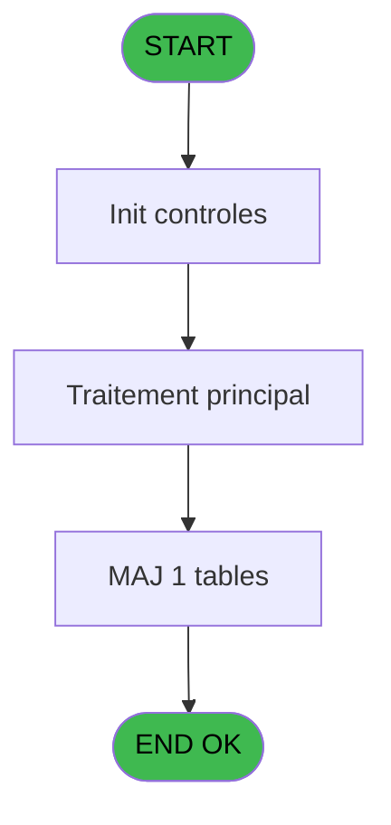

# REF IDE 34 - Browse - comptable________cte

> **Analyse**: Phases 1-4 2026-02-03 01:20 -> 01:20 (33s) | Assemblage 01:20
> **Pipeline**: V7.2 Enrichi
> **Structure**: 4 onglets (Resume | Ecrans | Donnees | Connexions)

<!-- TAB:Resume -->

## 1. FICHE D'IDENTITE

| Attribut | Valeur |
|----------|--------|
| Projet | REF |
| IDE Position | 34 |
| Nom Programme | Browse - comptable________cte |
| Fichier source | `Prg_34.xml` |
| Domaine metier | General |
| Taches | 1 (1 ecrans visibles) |
| Tables modifiees | 1 |
| Programmes appeles | 0 |
| :warning: Statut | **ORPHELIN_POTENTIEL** |

## 2. DESCRIPTION FONCTIONNELLE

**Browse - comptable________cte** assure la gestion complete de ce processus.

Le flux de traitement s'organise en **1 blocs fonctionnels** :

- **Calcul** (1 tache) : calculs de montants, stocks ou compteurs

**Donnees modifiees** : 1 tables en ecriture (comptable________cte).

## 3. BLOCS FONCTIONNELS

### 3.1 Calcul (1 tache)

Calculs metier : montants, stocks, compteurs.

---

#### 34 - Browse - comptable________cte [[ECRAN]](#ecran-t1)

**Role** : Traitement : Browse - comptable________cte.
**Ecran** : 931 x 231 DLU | [Voir mockup](#ecran-t1)

## 5. REGLES METIER

*(Aucune regle metier identifiee)*

## 6. CONTEXTE

- **Appele par**: (aucun)
- **Appelle**: 0 programmes | **Tables**: 1 (W:1 R:0 L:0) | **Taches**: 1 | **Expressions**: 0

<!-- TAB:Ecrans -->

## 8. ECRANS

### 8.1 Forms visibles (1 / 1)

| # | Position | Tache | Nom | Type | Largeur | Hauteur | Bloc |
|---|----------|-------|-----|------|---------|---------|------|
| 1 | 34 | 34 | Browse - comptable________cte | Type0 | 931 | 231 | Calcul |

### 8.2 Mockups Ecrans

---

#### 34 - Browse - comptable________cte
**Tache** : [34](#t1) | **Type** : Type0 | **Dimensions** : 931 x 231 DLU
**Bloc** : Calcul | **Titre IDE** : Browse - comptable________cte

<!-- FORM-DATA:
{
    "width":  931,
    "vFactor":  8,
    "type":  "Type0",
    "hFactor":  4,
    "controls":  [
                     {
                         "x":  8,
                         "type":  "table",
                         "var":  "",
                         "name":  "",
                         "titleH":  12,
                         "color":  "",
                         "w":  4755,
                         "y":  8,
                         "fmt":  "",
                         "parent":  null,
                         "text":  "",
                         "rowH":  13,
                         "h":  182,
                         "cols":  [
                                      {
                                          "title":  "cte_societe",
                                          "layer":  1,
                                          "w":  47
                                      },
                                      {
                                          "title":  "cte_compte_gm",
                                          "layer":  2,
                                          "w":  64
                                      },
                                      {
                                          "title":  "cte_filiation",
                                          "layer":  3,
                                          "w":  46
                                      },
                                      {
                                          "title":  "cte_imputation",
                                          "layer":  4,
                                          "w":  58
                                      },
                                      {
                                          "title":  "cte_sous_imputation",
                                          "layer":  5,
                                          "w":  81
                                      },
                                      {
                                          "title":  "cte_libelle",
                                          "layer":  6,
                                          "w":  122
                                      },
                                      {
                                          "title":  "cte_libelle_supplem_",
                                          "layer":  7,
                                          "w":  122
                                      },
                                      {
                                          "title":  "cte_credit_debit",
                                          "layer":  8,
                                          "w":  64
                                      },
                                      {
                                          "title":  "cte_flag_annulation",
                                          "layer":  9,
                                          "w":  78
                                      },
                                      {
                                          "title":  "cte_code_type",
                                          "layer":  10,
                                          "w":  60
                                      },
                                      {
                                          "title":  "cte_numero_chrono",
                                          "layer":  11,
                                          "w":  79
                                      },
                                      {
                                          "title":  "cte_avec_change",
                                          "layer":  12,
                                          "w":  73
                                      },
                                      {
                                          "title":  "cte_mode_de_paiement",
                                          "layer":  13,
                                          "w":  94
                                      },
                                      {
                                          "title":  "cte_montant",
                                          "layer":  14,
                                          "w":  101
                                      },
                                      {
                                          "title":  "cte_date_comptable",
                                          "layer":  15,
                                          "w":  81
                                      },
                                      {
                                          "title":  "cte_date_d_operation",
                                          "layer":  16,
                                          "w":  86
                                      },
                                      {
                                          "title":  "cte_heure_operation",
                                          "layer":  17,
                                          "w":  82
                                      },
                                      {
                                          "title":  "cte_nbre_d_articles",
                                          "layer":  18,
                                          "w":  78
                                      },
                                      {
                                          "title":  "cte_flag_application",
                                          "layer":  19,
                                          "w":  79
                                      },
                                      {
                                          "title":  "cte_type_transaction",
                                          "layer":  20,
                                          "w":  82
                                      },
                                      {
                                          "title":  "cte_operateur",
                                          "layer":  21,
                                          "w":  56
                                      },
                                      {
                                          "title":  "RowId_40",
                                          "layer":  22,
                                          "w":  58
                                      },
                                      {
                                          "title":  "cte_ref_article",
                                          "layer":  23,
                                          "w":  58
                                      },
                                      {
                                          "title":  "cte_taux_tva",
                                          "layer":  24,
                                          "w":  53
                                      },
                                      {
                                          "title":  "cte_no_facture",
                                          "layer":  25,
                                          "w":  61
                                      },
                                      {
                                          "title":  "cte_service",
                                          "layer":  26,
                                          "w":  47
                                      },
                                      {
                                          "title":  "cte_id_transaction",
                                          "layer":  27,
                                          "w":  189
                                      },
                                      {
                                          "title":  "cte_id_acceptation",
                                          "layer":  28,
                                          "w":  189
                                      },
                                      {
                                          "title":  "cte_free_extra",
                                          "layer":  29,
                                          "w":  58
                                      },
                                      {
                                          "title":  "cte_montant_free_extra",
                                          "layer":  30,
                                          "w":  101
                                      },
                                      {
                                          "title":  "cte_num_terminal_vente",
                                          "layer":  31,
                                          "w":  96
                                      },
                                      {
                                          "title":  "cte_activite_comptable",
                                          "layer":  32,
                                          "w":  91
                                      },
                                      {
                                          "title":  "cte_id_ligne_annulation",
                                          "layer":  33,
                                          "w":  93
                                      },
                                      {
                                          "title":  "cte_num_cheque",
                                          "layer":  34,
                                          "w":  178
                                      },
                                      {
                                          "title":  "cte_type_art",
                                          "layer":  35,
                                          "w":  50
                                      },
                                      {
                                          "title":  "cte_stype_art",
                                          "layer":  36,
                                          "w":  54
                                      },
                                      {
                                          "title":  "cte_login_vendeur",
                                          "layer":  37,
                                          "w":  74
                                      },
                                      {
                                          "title":  "cte_matricule",
                                          "layer":  38,
                                          "w":  178
                                      },
                                      {
                                          "title":  "cte_type_credit",
                                          "layer":  39,
                                          "w":  62
                                      },
                                      {
                                          "title":  "cte_commentaire_annulation",
                                          "layer":  40,
                                          "w":  570
                                      },
                                      {
                                          "title":  "cte_num_tpe",
                                          "layer":  41,
                                          "w":  122
                                      },
                                      {
                                          "title":  "cte_num_ticket",
                                          "layer":  42,
                                          "w":  290
                                      },
                                      {
                                          "title":  "cte_num_ligne",
                                          "layer":  43,
                                          "w":  58
                                      },
                                      {
                                          "title":  "cte_token_id",
                                          "layer":  44,
                                          "w":  185
                                      },
                                      {
                                          "title":  "cte_transaction_id",
                                          "layer":  45,
                                          "w":  189
                                      }
                                  ],
                         "rows":  45
                     },
                     {
                         "x":  12,
                         "type":  "edit",
                         "var":  "",
                         "y":  23,
                         "w":  9,
                         "fmt":  "",
                         "name":  "cte_societe",
                         "h":  10,
                         "color":  "",
                         "text":  "",
                         "parent":  90
                     },
                     {
                         "x":  59,
                         "type":  "edit",
                         "var":  "",
                         "y":  23,
                         "w":  42,
                         "fmt":  "",
                         "name":  "cte_compte_gm",
                         "h":  10,
                         "color":  "",
                         "text":  "",
                         "parent":  90
                     },
                     {
                         "x":  123,
                         "type":  "edit",
                         "var":  "",
                         "y":  23,
                         "w":  18,
                         "fmt":  "",
                         "name":  "cte_filiation",
                         "h":  10,
                         "color":  "",
                         "text":  "",
                         "parent":  90
                     },
                     {
                         "x":  169,
                         "type":  "edit",
                         "var":  "",
                         "y":  23,
                         "w":  51,
                         "fmt":  "",
                         "name":  "cte_imputation",
                         "h":  10,
                         "color":  "",
                         "text":  "",
                         "parent":  90
                     },
                     {
                         "x":  227,
                         "type":  "edit",
                         "var":  "",
                         "y":  23,
                         "w":  18,
                         "fmt":  "",
                         "name":  "cte_sous_imputation",
                         "h":  10,
                         "color":  "",
                         "text":  "",
                         "parent":  90
                     },
                     {
                         "x":  308,
                         "type":  "edit",
                         "var":  "",
                         "y":  23,
                         "w":  115,
                         "fmt":  "",
                         "name":  "cte_libelle",
                         "h":  10,
                         "color":  "",
                         "text":  "",
                         "parent":  90
                     },
                     {
                         "x":  430,
                         "type":  "edit",
                         "var":  "",
                         "y":  23,
                         "w":  115,
                         "fmt":  "",
                         "name":  "cte_libelle_supplem_",
                         "h":  10,
                         "color":  "",
                         "text":  "",
                         "parent":  90
                     },
                     {
                         "x":  552,
                         "type":  "edit",
                         "var":  "",
                         "y":  23,
                         "w":  9,
                         "fmt":  "",
                         "name":  "cte_credit_debit",
                         "h":  10,
                         "color":  "",
                         "text":  "",
                         "parent":  90
                     },
                     {
                         "x":  616,
                         "type":  "edit",
                         "var":  "",
                         "y":  23,
                         "w":  9,
                         "fmt":  "",
                         "name":  "cte_flag_annulation",
                         "h":  10,
                         "color":  "",
                         "text":  "",
                         "parent":  90
                     },
                     {
                         "x":  694,
                         "type":  "edit",
                         "var":  "",
                         "y":  23,
                         "w":  9,
                         "fmt":  "",
                         "name":  "cte_code_type",
                         "h":  10,
                         "color":  "",
                         "text":  "",
                         "parent":  90
                     },
                     {
                         "x":  754,
                         "type":  "edit",
                         "var":  "",
                         "y":  23,
                         "w":  42,
                         "fmt":  "",
                         "name":  "cte_numero_chrono",
                         "h":  10,
                         "color":  "",
                         "text":  "",
                         "parent":  90
                     },
                     {
                         "x":  833,
                         "type":  "edit",
                         "var":  "",
                         "y":  23,
                         "w":  9,
                         "fmt":  "",
                         "name":  "cte_avec_change",
                         "h":  10,
                         "color":  "",
                         "text":  "",
                         "parent":  90
                     },
                     {
                         "x":  906,
                         "type":  "edit",
                         "var":  "",
                         "y":  23,
                         "w":  26,
                         "fmt":  "",
                         "name":  "cte_mode_de_paiement",
                         "h":  10,
                         "color":  "",
                         "text":  "",
                         "parent":  90
                     },
                     {
                         "x":  1000,
                         "type":  "edit",
                         "var":  "",
                         "y":  23,
                         "w":  94,
                         "fmt":  "",
                         "name":  "cte_montant",
                         "h":  10,
                         "color":  "",
                         "text":  "",
                         "parent":  90
                     },
                     {
                         "x":  1101,
                         "type":  "edit",
                         "var":  "",
                         "y":  23,
                         "w":  61,
                         "fmt":  "",
                         "name":  "cte_date_comptable",
                         "h":  10,
                         "color":  "",
                         "text":  "",
                         "parent":  90
                     },
                     {
                         "x":  1182,
                         "type":  "edit",
                         "var":  "",
                         "y":  23,
                         "w":  61,
                         "fmt":  "",
                         "name":  "cte_date_d_operation",
                         "h":  10,
                         "color":  "",
                         "text":  "",
                         "parent":  90
                     },
                     {
                         "x":  1268,
                         "type":  "edit",
                         "var":  "",
                         "y":  23,
                         "w":  46,
                         "fmt":  "",
                         "name":  "cte_heure_operation",
                         "h":  10,
                         "color":  "",
                         "text":  "",
                         "parent":  90
                     },
                     {
                         "x":  1350,
                         "type":  "edit",
                         "var":  "",
                         "y":  23,
                         "w":  18,
                         "fmt":  "",
                         "name":  "cte_nbre_d_articles",
                         "h":  10,
                         "color":  "",
                         "text":  "",
                         "parent":  90
                     },
                     {
                         "x":  1428,
                         "type":  "edit",
                         "var":  "",
                         "y":  23,
                         "w":  9,
                         "fmt":  "",
                         "name":  "cte_flag_application",
                         "h":  10,
                         "color":  "",
                         "text":  "",
                         "parent":  90
                     },
                     {
                         "x":  1507,
                         "type":  "edit",
                         "var":  "",
                         "y":  23,
                         "w":  9,
                         "fmt":  "",
                         "name":  "cte_type_transaction",
                         "h":  10,
                         "color":  "",
                         "text":  "",
                         "parent":  90
                     },
                     {
                         "x":  1589,
                         "type":  "edit",
                         "var":  "",
                         "y":  23,
                         "w":  48,
                         "fmt":  "",
                         "name":  "cte_operateur",
                         "h":  10,
                         "color":  "",
                         "text":  "",
                         "parent":  90
                     },
                     {
                         "x":  1645,
                         "type":  "edit",
                         "var":  "",
                         "y":  23,
                         "w":  51,
                         "fmt":  "",
                         "name":  "RowId_40",
                         "h":  10,
                         "color":  "",
                         "text":  "",
                         "parent":  90
                     },
                     {
                         "x":  1703,
                         "type":  "edit",
                         "var":  "",
                         "y":  23,
                         "w":  51,
                         "fmt":  "",
                         "name":  "cte_ref_article",
                         "h":  10,
                         "color":  "",
                         "text":  "",
                         "parent":  90
                     },
                     {
                         "x":  1761,
                         "type":  "edit",
                         "var":  "",
                         "y":  23,
                         "w":  37,
                         "fmt":  "",
                         "name":  "cte_taux_tva",
                         "h":  10,
                         "color":  "",
                         "text":  "",
                         "parent":  90
                     },
                     {
                         "x":  1814,
                         "type":  "edit",
                         "var":  "",
                         "y":  23,
                         "w":  51,
                         "fmt":  "",
                         "name":  "cte_no_facture",
                         "h":  10,
                         "color":  "",
                         "text":  "",
                         "parent":  90
                     },
                     {
                         "x":  1875,
                         "type":  "edit",
                         "var":  "",
                         "y":  23,
                         "w":  26,
                         "fmt":  "",
                         "name":  "cte_service",
                         "h":  10,
                         "color":  "",
                         "text":  "",
                         "parent":  90
                     },
                     {
                         "x":  1922,
                         "type":  "edit",
                         "var":  "",
                         "y":  23,
                         "w":  182,
                         "fmt":  "",
                         "name":  "cte_id_transaction",
                         "h":  10,
                         "color":  "",
                         "text":  "",
                         "parent":  90
                     },
                     {
                         "x":  2111,
                         "type":  "edit",
                         "var":  "",
                         "y":  23,
                         "w":  182,
                         "fmt":  "",
                         "name":  "cte_id_acceptation",
                         "h":  10,
                         "color":  "",
                         "text":  "",
                         "parent":  90
                     },
                     {
                         "x":  2300,
                         "type":  "edit",
                         "var":  "",
                         "y":  23,
                         "w":  31,
                         "fmt":  "",
                         "name":  "cte_free_extra",
                         "h":  10,
                         "color":  "",
                         "text":  "",
                         "parent":  90
                     },
                     {
                         "x":  2358,
                         "type":  "edit",
                         "var":  "",
                         "y":  23,
                         "w":  94,
                         "fmt":  "",
                         "name":  "cte_montant_free_extra",
                         "h":  10,
                         "color":  "",
                         "text":  "",
                         "parent":  90
                     },
                     {
                         "x":  2459,
                         "type":  "edit",
                         "var":  "",
                         "y":  23,
                         "w":  18,
                         "fmt":  "",
                         "name":  "cte_num_terminal_vente",
                         "h":  10,
                         "color":  "",
                         "text":  "",
                         "parent":  90
                     },
                     {
                         "x":  2555,
                         "type":  "edit",
                         "var":  "",
                         "y":  23,
                         "w":  18,
                         "fmt":  "",
                         "name":  "cte_activite_comptable",
                         "h":  10,
                         "color":  "",
                         "text":  "",
                         "parent":  90
                     },
                     {
                         "x":  2646,
                         "type":  "edit",
                         "var":  "",
                         "y":  23,
                         "w":  51,
                         "fmt":  "",
                         "name":  "cte_id_ligne_annulation",
                         "h":  10,
                         "color":  "",
                         "text":  "",
                         "parent":  90
                     },
                     {
                         "x":  2739,
                         "type":  "edit",
                         "var":  "",
                         "y":  23,
                         "w":  171,
                         "fmt":  "",
                         "name":  "cte_num_cheque",
                         "h":  10,
                         "color":  "",
                         "text":  "",
                         "parent":  90
                     },
                     {
                         "x":  2917,
                         "type":  "edit",
                         "var":  "",
                         "y":  23,
                         "w":  37,
                         "fmt":  "",
                         "name":  "cte_type_art",
                         "h":  10,
                         "color":  "",
                         "text":  "",
                         "parent":  90
                     },
                     {
                         "x":  2967,
                         "type":  "edit",
                         "var":  "",
                         "y":  23,
                         "w":  37,
                         "fmt":  "",
                         "name":  "cte_stype_art",
                         "h":  10,
                         "color":  "",
                         "text":  "",
                         "parent":  90
                     },
                     {
                         "x":  3021,
                         "type":  "edit",
                         "var":  "",
                         "y":  23,
                         "w":  48,
                         "fmt":  "",
                         "name":  "cte_login_vendeur",
                         "h":  10,
                         "color":  "",
                         "text":  "",
                         "parent":  90
                     },
                     {
                         "x":  3095,
                         "type":  "edit",
                         "var":  "",
                         "y":  23,
                         "w":  171,
                         "fmt":  "",
                         "name":  "cte_matricule",
                         "h":  10,
                         "color":  "",
                         "text":  "",
                         "parent":  90
                     },
                     {
                         "x":  3273,
                         "type":  "edit",
                         "var":  "",
                         "y":  23,
                         "w":  14,
                         "fmt":  "",
                         "name":  "cte_type_credit",
                         "h":  10,
                         "color":  "",
                         "text":  "",
                         "parent":  90
                     },
                     {
                         "x":  3335,
                         "type":  "edit",
                         "var":  "",
                         "y":  23,
                         "w":  563,
                         "fmt":  "",
                         "name":  "cte_commentaire_annulation",
                         "h":  10,
                         "color":  "",
                         "text":  "",
                         "parent":  90
                     },
                     {
                         "x":  3905,
                         "type":  "edit",
                         "var":  "",
                         "y":  23,
                         "w":  115,
                         "fmt":  "",
                         "name":  "cte_num_tpe",
                         "h":  10,
                         "color":  "",
                         "text":  "",
                         "parent":  90
                     },
                     {
                         "x":  4027,
                         "type":  "edit",
                         "var":  "",
                         "y":  23,
                         "w":  283,
                         "fmt":  "",
                         "name":  "cte_num_ticket",
                         "h":  10,
                         "color":  "",
                         "text":  "",
                         "parent":  90
                     },
                     {
                         "x":  4317,
                         "type":  "edit",
                         "var":  "",
                         "y":  23,
                         "w":  22,
                         "fmt":  "",
                         "name":  "cte_num_ligne",
                         "h":  10,
                         "color":  "",
                         "text":  "",
                         "parent":  90
                     },
                     {
                         "x":  4375,
                         "type":  "edit",
                         "var":  "",
                         "y":  23,
                         "w":  182,
                         "fmt":  "",
                         "name":  "cte_token_id",
                         "h":  10,
                         "color":  "",
                         "text":  "",
                         "parent":  90
                     },
                     {
                         "x":  4560,
                         "type":  "edit",
                         "var":  "",
                         "y":  23,
                         "w":  182,
                         "fmt":  "",
                         "name":  "cte_transaction_id",
                         "h":  10,
                         "color":  "",
                         "text":  "",
                         "parent":  90
                     }
                 ],
    "taskId":  "34",
    "height":  231
}
-->

<strong>Champs : 45 champs</strong>

| Pos (x,y) | Nom | Variable | Type |
|-----------|-----|----------|------|
| 12,23 | cte_societe | - | edit |
| 59,23 | cte_compte_gm | - | edit |
| 123,23 | cte_filiation | - | edit |
| 169,23 | cte_imputation | - | edit |
| 227,23 | cte_sous_imputation | - | edit |
| 308,23 | cte_libelle | - | edit |
| 430,23 | cte_libelle_supplem_ | - | edit |
| 552,23 | cte_credit_debit | - | edit |
| 616,23 | cte_flag_annulation | - | edit |
| 694,23 | cte_code_type | - | edit |
| 754,23 | cte_numero_chrono | - | edit |
| 833,23 | cte_avec_change | - | edit |
| 906,23 | cte_mode_de_paiement | - | edit |
| 1000,23 | cte_montant | - | edit |
| 1101,23 | cte_date_comptable | - | edit |
| 1182,23 | cte_date_d_operation | - | edit |
| 1268,23 | cte_heure_operation | - | edit |
| 1350,23 | cte_nbre_d_articles | - | edit |
| 1428,23 | cte_flag_application | - | edit |
| 1507,23 | cte_type_transaction | - | edit |
| 1589,23 | cte_operateur | - | edit |
| 1645,23 | RowId_40 | - | edit |
| 1703,23 | cte_ref_article | - | edit |
| 1761,23 | cte_taux_tva | - | edit |
| 1814,23 | cte_no_facture | - | edit |
| 1875,23 | cte_service | - | edit |
| 1922,23 | cte_id_transaction | - | edit |
| 2111,23 | cte_id_acceptation | - | edit |
| 2300,23 | cte_free_extra | - | edit |
| 2358,23 | cte_montant_free_extra | - | edit |
| 2459,23 | cte_num_terminal_vente | - | edit |
| 2555,23 | cte_activite_comptable | - | edit |
| 2646,23 | cte_id_ligne_annulation | - | edit |
| 2739,23 | cte_num_cheque | - | edit |
| 2917,23 | cte_type_art | - | edit |
| 2967,23 | cte_stype_art | - | edit |
| 3021,23 | cte_login_vendeur | - | edit |
| 3095,23 | cte_matricule | - | edit |
| 3273,23 | cte_type_credit | - | edit |
| 3335,23 | cte_commentaire_annulation | - | edit |
| 3905,23 | cte_num_tpe | - | edit |
| 4027,23 | cte_num_ticket | - | edit |
| 4317,23 | cte_num_ligne | - | edit |
| 4375,23 | cte_token_id | - | edit |
| 4560,23 | cte_transaction_id | - | edit |

## 9. NAVIGATION

Ecran unique: **Browse - comptable________cte**

### 9.3 Structure hierarchique (1 tache)

| Position | Tache | Type | Dimensions | Bloc |
|----------|-------|------|------------|------|
| **34.1** | [**Browse - comptable________cte** (34)](#t1) [mockup](#ecran-t1) | - | 931x231 | Calcul |

### 9.4 Algorigramme

> **Legende**: Vert = START/END OK | Rouge = END KO | Bleu = Decisions
> *Algorigramme auto-genere. Utiliser `/algorigramme` pour une synthese metier detaillee.*

<!-- TAB:Donnees -->

## 10. TABLES

### Tables utilisees (1)

| ID | Nom | Description | Type | R | W | L | Usages |
|----|-----|-------------|------|---|---|---|--------|
| 40 | comptable________cte |  | DB |   | **W** |   | 1 |

### Colonnes par table (0 / 1 tables avec colonnes identifiees)

Table 40 - comptable________cte (**W**) - 1 usages

*Table utilisee uniquement en Link ou aucune colonne Real identifiee dans le DataView.*

## 11. VARIABLES

*(Programme sans variables locales mappees)*

## 12. EXPRESSIONS

**0 / 0 expressions decodees (0%)**

### 12.1 Repartition par type

| Type | Expressions | Regles |
|------|-------------|--------|

### 12.2 Expressions cles par type

<!-- TAB:Connexions -->

## 13. GRAPHE D'APPELS

### 13.1 Chaine depuis Main (Callers)

**Chemin**: (pas de callers directs)

### 13.2 Callers

| IDE | Nom Programme | Nb Appels |
|-----|---------------|-----------|
| - | (aucun) | - |

### 13.3 Callees (programmes appeles)

### 13.4 Detail Callees avec contexte

| IDE | Nom Programme | Appels | Contexte |
|-----|---------------|--------|----------|
| - | (aucun) | - | - |

## 14. RECOMMANDATIONS MIGRATION

### 14.1 Profil du programme

| Metrique | Valeur | Impact migration |
|----------|--------|-----------------|
| Lignes de logique | 46 | Programme compact |
| Expressions | 0 | Peu de logique |
| Tables WRITE | 1 | Impact faible |
| Sous-programmes | 0 | Peu de dependances |
| Ecrans visibles | 1 | Ecran unique ou traitement batch |
| Code desactive | 0% (0 / 46) | Code sain |
| Regles metier | 0 | Pas de regle identifiee |

### 14.2 Plan de migration par bloc

#### Calcul (1 tache: 1 ecran, 0 traitement)

- **Strategie** : Services de calcul purs (Domain Services).
- Migrer la logique de calcul (stock, compteurs, montants)

### 14.3 Dependances critiques

| Dependance | Type | Appels | Impact |
|------------|------|--------|--------|
| comptable________cte | Table WRITE (Database) | 1x | Schema + repository |

---
*Spec DETAILED generee par Pipeline V7.2 - 2026-02-03 01:21*
