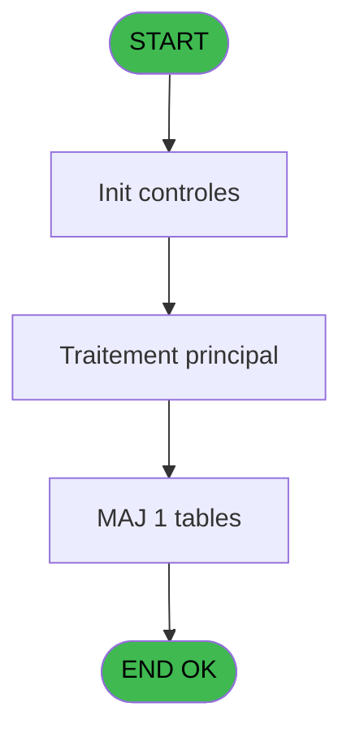

# REF IDE 391 - Browse - pv_package_price

> **Analyse**: Phases 1-4 2026-02-03 11:35 -> 11:35 (20s) | Assemblage 11:35
> **Pipeline**: V7.2 Enrichi
> **Structure**: 4 onglets (Resume | Ecrans | Donnees | Connexions)

<!-- TAB:Resume -->

## 1. FICHE D'IDENTITE

| Attribut | Valeur |
|----------|--------|
| Projet | REF |
| IDE Position | 391 |
| Nom Programme | Browse - pv_package_price |
| Fichier source | `Prg_391.xml` |
| Dossier IDE | General |
| Taches | 1 (1 ecrans visibles) |
| Tables modifiees | 1 |
| Programmes appeles | 0 |
| :warning: Statut | **ORPHELIN_POTENTIEL** |

## 2. DESCRIPTION FONCTIONNELLE

**Browse - pv_package_price** assure la gestion complete de ce processus.

Le flux de traitement s'organise en **1 blocs fonctionnels** :

- **Traitement** (1 tache) : traitements metier divers

**Donnees modifiees** : 1 tables en ecriture (pv_package_price).

## 3. BLOCS FONCTIONNELS

### 3.1 Traitement (1 tache)

Traitements internes.

---

#### 391 - Browse - pv_package_price [[ECRAN]](#ecran-t1)

**Role** : Traitement : Browse - pv_package_price.
**Ecran** : 2136 x 195 DLU | [Voir mockup](#ecran-t1)

## 5. REGLES METIER

*(Aucune regle metier identifiee)*

## 6. CONTEXTE

- **Appele par**: (aucun)
- **Appelle**: 0 programmes | **Tables**: 1 (W:1 R:0 L:0) | **Taches**: 1 | **Expressions**: 0

<!-- TAB:Ecrans -->

## 8. ECRANS

### 8.1 Forms visibles (1 / 1)

| # | Position | Tache | Nom | Type | Largeur | Hauteur | Bloc |
|---|----------|-------|-----|------|---------|---------|------|
| 1 | 391 | 391 | Browse - pv_package_price | Type0 | 2136 | 195 | Traitement |

### 8.2 Mockups Ecrans

---

#### 391 - Browse - pv_package_price
**Tache** : [391](#t1) | **Type** : Type0 | **Dimensions** : 2136 x 195 DLU
**Bloc** : Traitement | **Titre IDE** : Browse - pv_package_price

<!-- FORM-DATA:
{
    "width":  2136,
    "vFactor":  8,
    "type":  "Type0",
    "hFactor":  4,
    "controls":  [
                     {
                         "x":  8,
                         "type":  "table",
                         "var":  "",
                         "name":  "",
                         "titleH":  12,
                         "color":  "",
                         "w":  2114,
                         "y":  8,
                         "fmt":  "",
                         "parent":  null,
                         "text":  "",
                         "rowH":  13,
                         "h":  182,
                         "cols":  [
                                      {
                                          "title":  "cat",
                                          "layer":  1,
                                          "w":  20
                                      },
                                      {
                                          "title":  "sub_cat",
                                          "layer":  2,
                                          "w":  34
                                      },
                                      {
                                          "title":  "prod_id",
                                          "layer":  3,
                                          "w":  31
                                      },
                                      {
                                          "title":  "ordre",
                                          "layer":  4,
                                          "w":  22
                                      },
                                      {
                                          "title":  "label",
                                          "layer":  5,
                                          "w":  122
                                      },
                                      {
                                          "title":  "number_days",
                                          "layer":  6,
                                          "w":  54
                                      },
                                      {
                                          "title":  "prix_de_vente",
                                          "layer":  7,
                                          "w":  106
                                      },
                                      {
                                          "title":  "block_free__",
                                          "layer":  8,
                                          "w":  53
                                      },
                                      {
                                          "title":  "block_discount__",
                                          "layer":  9,
                                          "w":  70
                                      },
                                      {
                                          "title":  "tampon",
                                          "layer":  10,
                                          "w":  49
                                      },
                                      {
                                          "title":  "pv_service",
                                          "layer":  11,
                                          "w":  45
                                      },
                                      {
                                          "title":  "art_code_article",
                                          "layer":  12,
                                          "w":  64
                                      },
                                      {
                                          "title":  "art_prix_achat",
                                          "layer":  13,
                                          "w":  106
                                      },
                                      {
                                          "title":  "art_non_gere_en_stock",
                                          "layer":  14,
                                          "w":  94
                                      },
                                      {
                                          "title":  "art_quantite_en_stock",
                                          "layer":  15,
                                          "w":  88
                                      },
                                      {
                                          "title":  "art_unite_vente",
                                          "layer":  16,
                                          "w":  62
                                      },
                                      {
                                          "title":  "art_tva",
                                          "layer":  17,
                                          "w":  30
                                      },
                                      {
                                          "title":  "art_volume_vendu",
                                          "layer":  18,
                                          "w":  74
                                      },
                                      {
                                          "title":  "art_decimales",
                                          "layer":  19,
                                          "w":  55
                                      },
                                      {
                                          "title":  "art_volume_achat",
                                          "layer":  20,
                                          "w":  73
                                      },
                                      {
                                          "title":  "art_prix_achat_bottle",
                                          "layer":  21,
                                          "w":  106
                                      },
                                      {
                                          "title":  "art_logique_1",
                                          "layer":  22,
                                          "w":  54
                                      },
                                      {
                                          "title":  "art_logique_2",
                                          "layer":  23,
                                          "w":  54
                                      },
                                      {
                                          "title":  "art_actif",
                                          "layer":  24,
                                          "w":  34
                                      },
                                      {
                                          "title":  "art_free_extra",
                                          "layer":  25,
                                          "w":  55
                                      },
                                      {
                                          "title":  "art_sales_place_independant",
                                          "layer":  26,
                                          "w":  114
                                      },
                                      {
                                          "title":  "art_sale_label",
                                          "layer":  27,
                                          "w":  122
                                      },
                                      {
                                          "title":  "id_booker",
                                          "layer":  28,
                                          "w":  58
                                      },
                                      {
                                          "title":  "elligible_credit_go",
                                          "layer":  29,
                                          "w":  70
                                      },
                                      {
                                          "title":  "art_copy_cat_scat",
                                          "layer":  30,
                                          "w":  74
                                      },
                                      {
                                          "title":  "art_nature",
                                          "layer":  31,
                                          "w":  42
                                      },
                                      {
                                          "title":  "art_force_ticket",
                                          "layer":  32,
                                          "w":  62
                                      }
                                  ],
                         "rows":  32
                     },
                     {
                         "x":  12,
                         "type":  "edit",
                         "var":  "",
                         "y":  23,
                         "w":  13,
                         "fmt":  "",
                         "name":  "cat",
                         "h":  10,
                         "color":  "",
                         "text":  "",
                         "parent":  1
                     },
                     {
                         "x":  32,
                         "type":  "edit",
                         "var":  "",
                         "y":  23,
                         "w":  13,
                         "fmt":  "",
                         "name":  "sub_cat",
                         "h":  10,
                         "color":  "",
                         "text":  "",
                         "parent":  1
                     },
                     {
                         "x":  66,
                         "type":  "edit",
                         "var":  "",
                         "y":  23,
                         "w":  13,
                         "fmt":  "",
                         "name":  "prod_id",
                         "h":  10,
                         "color":  "",
                         "text":  "",
                         "parent":  1
                     },
                     {
                         "x":  97,
                         "type":  "edit",
                         "var":  "",
                         "y":  23,
                         "w":  13,
                         "fmt":  "",
                         "name":  "ordre",
                         "h":  10,
                         "color":  "",
                         "text":  "",
                         "parent":  1
                     },
                     {
                         "x":  119,
                         "type":  "edit",
                         "var":  "",
                         "y":  23,
                         "w":  115,
                         "fmt":  "",
                         "name":  "label",
                         "h":  10,
                         "color":  "",
                         "text":  "",
                         "parent":  1
                     },
                     {
                         "x":  241,
                         "type":  "edit",
                         "var":  "",
                         "y":  23,
                         "w":  27,
                         "fmt":  "",
                         "name":  "number_days",
                         "h":  10,
                         "color":  "",
                         "text":  "",
                         "parent":  1
                     },
                     {
                         "x":  295,
                         "type":  "edit",
                         "var":  "",
                         "y":  23,
                         "w":  99,
                         "fmt":  "",
                         "name":  "prix_de_vente",
                         "h":  10,
                         "color":  "",
                         "text":  "",
                         "parent":  1
                     },
                     {
                         "x":  401,
                         "type":  "edit",
                         "var":  "",
                         "y":  23,
                         "w":  31,
                         "fmt":  "",
                         "name":  "block_free__",
                         "h":  10,
                         "color":  "",
                         "text":  "",
                         "parent":  1
                     },
                     {
                         "x":  454,
                         "type":  "edit",
                         "var":  "",
                         "y":  23,
                         "w":  31,
                         "fmt":  "",
                         "name":  "block_discount__",
                         "h":  10,
                         "color":  "",
                         "text":  "",
                         "parent":  1
                     },
                     {
                         "x":  524,
                         "type":  "edit",
                         "var":  "",
                         "y":  23,
                         "w":  42,
                         "fmt":  "",
                         "name":  "tampon",
                         "h":  10,
                         "color":  "",
                         "text":  "",
                         "parent":  1
                     },
                     {
                         "x":  573,
                         "type":  "edit",
                         "var":  "",
                         "y":  23,
                         "w":  26,
                         "fmt":  "",
                         "name":  "pv_service",
                         "h":  10,
                         "color":  "",
                         "text":  "",
                         "parent":  1
                     },
                     {
                         "x":  618,
                         "type":  "edit",
                         "var":  "",
                         "y":  23,
                         "w":  48,
                         "fmt":  "",
                         "name":  "art_code_article",
                         "h":  10,
                         "color":  "",
                         "text":  "",
                         "parent":  1
                     },
                     {
                         "x":  682,
                         "type":  "edit",
                         "var":  "",
                         "y":  23,
                         "w":  99,
                         "fmt":  "",
                         "name":  "art_prix_achat",
                         "h":  10,
                         "color":  "",
                         "text":  "",
                         "parent":  1
                     },
                     {
                         "x":  788,
                         "type":  "edit",
                         "var":  "",
                         "y":  23,
                         "w":  31,
                         "fmt":  "",
                         "name":  "art_non_gere_en_stock",
                         "h":  10,
                         "color":  "",
                         "text":  "",
                         "parent":  1
                     },
                     {
                         "x":  882,
                         "type":  "edit",
                         "var":  "",
                         "y":  23,
                         "w":  80,
                         "fmt":  "",
                         "name":  "art_quantite_en_stock",
                         "h":  10,
                         "color":  "",
                         "text":  "",
                         "parent":  1
                     },
                     {
                         "x":  970,
                         "type":  "edit",
                         "var":  "",
                         "y":  23,
                         "w":  20,
                         "fmt":  "",
                         "name":  "art_unite_vente",
                         "h":  10,
                         "color":  "",
                         "text":  "",
                         "parent":  1
                     },
                     {
                         "x":  1032,
                         "type":  "edit",
                         "var":  "",
                         "y":  23,
                         "w":  22,
                         "fmt":  "",
                         "name":  "art_tva",
                         "h":  10,
                         "color":  "",
                         "text":  "",
                         "parent":  1
                     },
                     {
                         "x":  1062,
                         "type":  "edit",
                         "var":  "",
                         "y":  23,
                         "w":  66,
                         "fmt":  "",
                         "name":  "art_volume_vendu",
                         "h":  10,
                         "color":  "",
                         "text":  "",
                         "parent":  1
                     },
                     {
                         "x":  1136,
                         "type":  "edit",
                         "var":  "",
                         "y":  23,
                         "w":  8,
                         "fmt":  "",
                         "name":  "art_decimales",
                         "h":  10,
                         "color":  "",
                         "text":  "",
                         "parent":  1
                     },
                     {
                         "x":  1191,
                         "type":  "edit",
                         "var":  "",
                         "y":  23,
                         "w":  66,
                         "fmt":  "",
                         "name":  "art_volume_achat",
                         "h":  10,
                         "color":  "",
                         "text":  "",
                         "parent":  1
                     },
                     {
                         "x":  1264,
                         "type":  "edit",
                         "var":  "",
                         "y":  23,
                         "w":  99,
                         "fmt":  "",
                         "name":  "art_prix_achat_bottle",
                         "h":  10,
                         "color":  "",
                         "text":  "",
                         "parent":  1
                     },
                     {
                         "x":  1370,
                         "type":  "edit",
                         "var":  "",
                         "y":  23,
                         "w":  31,
                         "fmt":  "",
                         "name":  "art_logique_1",
                         "h":  10,
                         "color":  "",
                         "text":  "",
                         "parent":  1
                     },
                     {
                         "x":  1424,
                         "type":  "edit",
                         "var":  "",
                         "y":  23,
                         "w":  31,
                         "fmt":  "",
                         "name":  "art_logique_2",
                         "h":  10,
                         "color":  "",
                         "text":  "",
                         "parent":  1
                     },
                     {
                         "x":  1478,
                         "type":  "edit",
                         "var":  "",
                         "y":  23,
                         "w":  9,
                         "fmt":  "",
                         "name":  "art_actif",
                         "h":  10,
                         "color":  "",
                         "text":  "",
                         "parent":  1
                     },
                     {
                         "x":  1512,
                         "type":  "edit",
                         "var":  "",
                         "y":  23,
                         "w":  31,
                         "fmt":  "",
                         "name":  "art_free_extra",
                         "h":  10,
                         "color":  "",
                         "text":  "",
                         "parent":  1
                     },
                     {
                         "x":  1567,
                         "type":  "edit",
                         "var":  "",
                         "y":  23,
                         "w":  31,
                         "fmt":  "",
                         "name":  "art_sales_place_independant",
                         "h":  10,
                         "color":  "",
                         "text":  "",
                         "parent":  1
                     },
                     {
                         "x":  1681,
                         "type":  "edit",
                         "var":  "",
                         "y":  23,
                         "w":  115,
                         "fmt":  "",
                         "name":  "art_sale_label",
                         "h":  10,
                         "color":  "",
                         "text":  "",
                         "parent":  1
                     },
                     {
                         "x":  1803,
                         "type":  "edit",
                         "var":  "",
                         "y":  23,
                         "w":  51,
                         "fmt":  "",
                         "name":  "id_booker",
                         "h":  10,
                         "color":  "",
                         "text":  "",
                         "parent":  1
                     },
                     {
                         "x":  1861,
                         "type":  "edit",
                         "var":  "",
                         "y":  23,
                         "w":  31,
                         "fmt":  "",
                         "name":  "elligible_credit_go",
                         "h":  10,
                         "color":  "",
                         "text":  "",
                         "parent":  1
                     },
                     {
                         "x":  1931,
                         "type":  "edit",
                         "var":  "",
                         "y":  23,
                         "w":  31,
                         "fmt":  "",
                         "name":  "art_copy_cat_scat",
                         "h":  10,
                         "color":  "",
                         "text":  "",
                         "parent":  1
                     },
                     {
                         "x":  2005,
                         "type":  "edit",
                         "var":  "",
                         "y":  23,
                         "w":  9,
                         "fmt":  "",
                         "name":  "art_nature",
                         "h":  10,
                         "color":  "",
                         "text":  "",
                         "parent":  1
                     },
                     {
                         "x":  2047,
                         "type":  "edit",
                         "var":  "",
                         "y":  23,
                         "w":  31,
                         "fmt":  "",
                         "name":  "art_force_ticket",
                         "h":  10,
                         "color":  "",
                         "text":  "",
                         "parent":  1
                     }
                 ],
    "taskId":  "391",
    "height":  195
}
-->

<strong>Champs : 32 champs</strong>

| Pos (x,y) | Nom | Variable | Type |
|-----------|-----|----------|------|
| 12,23 | cat | - | edit |
| 32,23 | sub_cat | - | edit |
| 66,23 | prod_id | - | edit |
| 97,23 | ordre | - | edit |
| 119,23 | label | - | edit |
| 241,23 | number_days | - | edit |
| 295,23 | prix_de_vente | - | edit |
| 401,23 | block_free__ | - | edit |
| 454,23 | block_discount__ | - | edit |
| 524,23 | tampon | - | edit |
| 573,23 | pv_service | - | edit |
| 618,23 | art_code_article | - | edit |
| 682,23 | art_prix_achat | - | edit |
| 788,23 | art_non_gere_en_stock | - | edit |
| 882,23 | art_quantite_en_stock | - | edit |
| 970,23 | art_unite_vente | - | edit |
| 1032,23 | art_tva | - | edit |
| 1062,23 | art_volume_vendu | - | edit |
| 1136,23 | art_decimales | - | edit |
| 1191,23 | art_volume_achat | - | edit |
| 1264,23 | art_prix_achat_bottle | - | edit |
| 1370,23 | art_logique_1 | - | edit |
| 1424,23 | art_logique_2 | - | edit |
| 1478,23 | art_actif | - | edit |
| 1512,23 | art_free_extra | - | edit |
| 1567,23 | art_sales_place_independant | - | edit |
| 1681,23 | art_sale_label | - | edit |
| 1803,23 | id_booker | - | edit |
| 1861,23 | elligible_credit_go | - | edit |
| 1931,23 | art_copy_cat_scat | - | edit |
| 2005,23 | art_nature | - | edit |
| 2047,23 | art_force_ticket | - | edit |

## 9. NAVIGATION

Ecran unique: **Browse - pv_package_price**

### 9.3 Structure hierarchique (1 tache)

| Position | Tache | Type | Dimensions | Bloc |
|----------|-------|------|------------|------|
| **391.1** | [**Browse - pv_package_price** (391)](#t1) [mockup](#ecran-t1) | - | 2136x195 | Traitement |

### 9.4 Algorigramme

> **Legende**: Vert = START/END OK | Rouge = END KO | Bleu = Decisions
> *Algorigramme auto-genere. Utiliser `/algorigramme` pour une synthese metier detaillee.*

<!-- TAB:Donnees -->

## 10. TABLES

### Tables utilisees (1)

| ID | Nom | Description | Type | R | W | L | Usages |
|----|-----|-------------|------|---|---|---|--------|
| 399 | pv_package_price |  | DB |   | **W** |   | 1 |

### Colonnes par table (0 / 1 tables avec colonnes identifiees)

Table 399 - pv_package_price (**W**) - 1 usages

*Table utilisee uniquement en Link ou aucune colonne Real identifiee dans le DataView.*

## 11. VARIABLES

*(Programme sans variables locales mappees)*

## 12. EXPRESSIONS

**0 / 0 expressions decodees (0%)**

### 12.1 Repartition par type

| Type | Expressions | Regles |
|------|-------------|--------|

### 12.2 Expressions cles par type

<!-- TAB:Connexions -->

## 13. GRAPHE D'APPELS

### 13.1 Chaine depuis Main (Callers)

**Chemin**: (pas de callers directs)

### 13.2 Callers

| IDE | Nom Programme | Nb Appels |
|-----|---------------|-----------|
| - | (aucun) | - |

### 13.3 Callees (programmes appeles)

### 13.4 Detail Callees avec contexte

| IDE | Nom Programme | Appels | Contexte |
|-----|---------------|--------|----------|
| - | (aucun) | - | - |

## 14. RECOMMANDATIONS MIGRATION

### 14.1 Profil du programme

| Metrique | Valeur | Impact migration |
|----------|--------|-----------------|
| Lignes de logique | 33 | Programme compact |
| Expressions | 0 | Peu de logique |
| Tables WRITE | 1 | Impact faible |
| Sous-programmes | 0 | Peu de dependances |
| Ecrans visibles | 1 | Ecran unique ou traitement batch |
| Code desactive | 0% (0 / 33) | Code sain |
| Regles metier | 0 | Pas de regle identifiee |

### 14.2 Plan de migration par bloc

#### Traitement (1 tache: 1 ecran, 0 traitement)

- **Strategie** : 1 composant(s) UI (Razor/React) avec formulaires et validation.
- Decomposer les taches en services unitaires testables.

### 14.3 Dependances critiques

| Dependance | Type | Appels | Impact |
|------------|------|--------|--------|
| pv_package_price | Table WRITE (Database) | 1x | Schema + repository |

---
*Spec DETAILED generee par Pipeline V7.2 - 2026-02-03 11:35*
