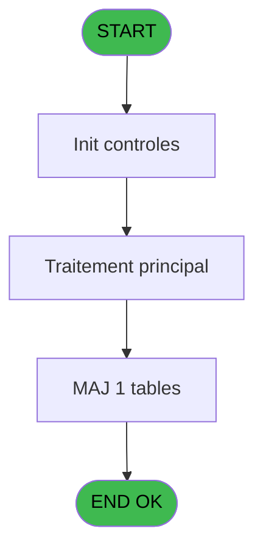

# REF IDE 453 - Browse - trf_transfert_new

> **Analyse**: Phases 1-4 2026-02-03 12:01 -> 12:02 (19s) | Assemblage 12:02
> **Pipeline**: V7.2 Enrichi
> **Structure**: 4 onglets (Resume | Ecrans | Donnees | Connexions)

<!-- TAB:Resume -->

## 1. FICHE D'IDENTITE

| Attribut | Valeur |
|----------|--------|
| Projet | REF |
| IDE Position | 453 |
| Nom Programme | Browse - trf_transfert_new |
| Fichier source | `Prg_453.xml` |
| Dossier IDE | General |
| Taches | 1 (1 ecrans visibles) |
| Tables modifiees | 1 |
| Programmes appeles | 0 |
| :warning: Statut | **ORPHELIN_POTENTIEL** |

## 2. DESCRIPTION FONCTIONNELLE

**Browse - trf_transfert_new** assure la gestion complete de ce processus.

Le flux de traitement s'organise en **1 blocs fonctionnels** :

- **Transfert** (1 tache) : transferts de donnees entre modules ou deversements

**Donnees modifiees** : 1 tables en ecriture (trf_transfert_new).

## 3. BLOCS FONCTIONNELS

### 3.1 Transfert (1 tache)

Transfert de donnees entre modules.

---

#### 453 - Browse - trf_transfert_new [[ECRAN]](#ecran-t1)

**Role** : Transfert de donnees : Browse - trf_transfert_new.
**Ecran** : 496 x 210 DLU | [Voir mockup](#ecran-t1)

## 5. REGLES METIER

*(Aucune regle metier identifiee)*

## 6. CONTEXTE

- **Appele par**: (aucun)
- **Appelle**: 0 programmes | **Tables**: 1 (W:1 R:0 L:0) | **Taches**: 1 | **Expressions**: 0

<!-- TAB:Ecrans -->

## 8. ECRANS

### 8.1 Forms visibles (1 / 1)

| # | Position | Tache | Nom | Type | Largeur | Hauteur | Bloc |
|---|----------|-------|-----|------|---------|---------|------|
| 1 | 453 | 453 | Browse - trf_transfert_new | Type0 | 496 | 210 | Transfert |

### 8.2 Mockups Ecrans

---

#### 453 - Browse - trf_transfert_new
**Tache** : [453](#t1) | **Type** : Type0 | **Dimensions** : 496 x 210 DLU
**Bloc** : Transfert | **Titre IDE** : Browse - trf_transfert_new

<!-- FORM-DATA:
{
    "width":  496,
    "vFactor":  8,
    "type":  "Type0",
    "hFactor":  4,
    "controls":  [
                     {
                         "x":  8,
                         "type":  "table",
                         "var":  "",
                         "name":  "",
                         "titleH":  12,
                         "color":  "110",
                         "w":  985,
                         "y":  8,
                         "fmt":  "",
                         "parent":  null,
                         "text":  "",
                         "rowH":  13,
                         "h":  182,
                         "cols":  [
                                      {
                                          "title":  "trf_societe",
                                          "layer":  1,
                                          "w":  42
                                      },
                                      {
                                          "title":  "trf_compte",
                                          "layer":  2,
                                          "w":  49
                                      },
                                      {
                                          "title":  "trf_filiation",
                                          "layer":  3,
                                          "w":  41
                                      },
                                      {
                                          "title":  "trf_date",
                                          "layer":  4,
                                          "w":  68
                                      },
                                      {
                                          "title":  "trf_heure",
                                          "layer":  5,
                                          "w":  53
                                      },
                                      {
                                          "title":  "trf_code_aer",
                                          "layer":  6,
                                          "w":  51
                                      },
                                      {
                                          "title":  "trf_vol",
                                          "layer":  7,
                                          "w":  66
                                      },
                                      {
                                          "title":  "trf_commentaire",
                                          "layer":  8,
                                          "w":  178
                                      },
                                      {
                                          "title":  "trf_type",
                                          "layer":  9,
                                          "w":  31
                                      },
                                      {
                                          "title":  "trf_sens",
                                          "layer":  10,
                                          "w":  33
                                      },
                                      {
                                          "title":  "trf_compagnie",
                                          "layer":  11,
                                          "w":  61
                                      },
                                      {
                                          "title":  "trf_compagnie_prec",
                                          "layer":  12,
                                          "w":  78
                                      },
                                      {
                                          "title":  "trf_vol_precedent",
                                          "layer":  13,
                                          "w":  70
                                      },
                                      {
                                          "title":  "trf_filler",
                                          "layer":  14,
                                          "w":  44
                                      },
                                      {
                                          "title":  "trf_montant",
                                          "layer":  15,
                                          "w":  101
                                      }
                                  ],
                         "rows":  15
                     },
                     {
                         "x":  12,
                         "type":  "edit",
                         "var":  "",
                         "y":  23,
                         "w":  9,
                         "fmt":  "",
                         "name":  "trf_societe",
                         "h":  10,
                         "color":  "110",
                         "text":  "",
                         "parent":  1
                     },
                     {
                         "x":  54,
                         "type":  "edit",
                         "var":  "",
                         "y":  23,
                         "w":  42,
                         "fmt":  "",
                         "name":  "trf_compte",
                         "h":  10,
                         "color":  "110",
                         "text":  "",
                         "parent":  1
                     },
                     {
                         "x":  103,
                         "type":  "edit",
                         "var":  "",
                         "y":  23,
                         "w":  18,
                         "fmt":  "",
                         "name":  "trf_filiation",
                         "h":  10,
                         "color":  "110",
                         "text":  "",
                         "parent":  1
                     },
                     {
                         "x":  144,
                         "type":  "edit",
                         "var":  "",
                         "y":  23,
                         "w":  61,
                         "fmt":  "",
                         "name":  "trf_date",
                         "h":  10,
                         "color":  "110",
                         "text":  "",
                         "parent":  1
                     },
                     {
                         "x":  212,
                         "type":  "edit",
                         "var":  "",
                         "y":  23,
                         "w":  46,
                         "fmt":  "",
                         "name":  "trf_heure",
                         "h":  10,
                         "color":  "110",
                         "text":  "",
                         "parent":  1
                     },
                     {
                         "x":  265,
                         "type":  "edit",
                         "var":  "",
                         "y":  23,
                         "w":  37,
                         "fmt":  "",
                         "name":  "trf_code_aer",
                         "h":  10,
                         "color":  "110",
                         "text":  "",
                         "parent":  1
                     },
                     {
                         "x":  316,
                         "type":  "edit",
                         "var":  "",
                         "y":  23,
                         "w":  59,
                         "fmt":  "",
                         "name":  "trf_vol",
                         "h":  10,
                         "color":  "110",
                         "text":  "",
                         "parent":  1
                     },
                     {
                         "x":  382,
                         "type":  "edit",
                         "var":  "",
                         "y":  23,
                         "w":  171,
                         "fmt":  "",
                         "name":  "trf_commentaire",
                         "h":  10,
                         "color":  "110",
                         "text":  "",
                         "parent":  1
                     },
                     {
                         "x":  560,
                         "type":  "edit",
                         "var":  "",
                         "y":  23,
                         "w":  14,
                         "fmt":  "",
                         "name":  "trf_type",
                         "h":  10,
                         "color":  "110",
                         "text":  "",
                         "parent":  1
                     },
                     {
                         "x":  591,
                         "type":  "edit",
                         "var":  "",
                         "y":  23,
                         "w":  9,
                         "fmt":  "",
                         "name":  "trf_sens",
                         "h":  10,
                         "color":  "110",
                         "text":  "",
                         "parent":  1
                     },
                     {
                         "x":  624,
                         "type":  "edit",
                         "var":  "",
                         "y":  23,
                         "w":  54,
                         "fmt":  "",
                         "name":  "trf_compagnie",
                         "h":  10,
                         "color":  "110",
                         "text":  "",
                         "parent":  1
                     },
                     {
                         "x":  685,
                         "type":  "edit",
                         "var":  "",
                         "y":  23,
                         "w":  54,
                         "fmt":  "",
                         "name":  "trf_compagnie_prec",
                         "h":  10,
                         "color":  "110",
                         "text":  "",
                         "parent":  1
                     },
                     {
                         "x":  763,
                         "type":  "edit",
                         "var":  "",
                         "y":  23,
                         "w":  59,
                         "fmt":  "",
                         "name":  "trf_vol_precedent",
                         "h":  10,
                         "color":  "110",
                         "text":  "",
                         "parent":  1
                     },
                     {
                         "x":  833,
                         "type":  "edit",
                         "var":  "",
                         "y":  25,
                         "w":  28,
                         "fmt":  "",
                         "name":  "trf_filler",
                         "h":  8,
                         "color":  "110",
                         "text":  "",
                         "parent":  1
                     },
                     {
                         "x":  877,
                         "type":  "edit",
                         "var":  "",
                         "y":  23,
                         "w":  94,
                         "fmt":  "",
                         "name":  "trf_montant",
                         "h":  10,
                         "color":  "110",
                         "text":  "",
                         "parent":  1
                     }
                 ],
    "taskId":  "453",
    "height":  210
}
-->

<strong>Champs : 15 champs</strong>

| Pos (x,y) | Nom | Variable | Type |
|-----------|-----|----------|------|
| 12,23 | trf_societe | - | edit |
| 54,23 | trf_compte | - | edit |
| 103,23 | trf_filiation | - | edit |
| 144,23 | trf_date | - | edit |
| 212,23 | trf_heure | - | edit |
| 265,23 | trf_code_aer | - | edit |
| 316,23 | trf_vol | - | edit |
| 382,23 | trf_commentaire | - | edit |
| 560,23 | trf_type | - | edit |
| 591,23 | trf_sens | - | edit |
| 624,23 | trf_compagnie | - | edit |
| 685,23 | trf_compagnie_prec | - | edit |
| 763,23 | trf_vol_precedent | - | edit |
| 833,25 | trf_filler | - | edit |
| 877,23 | trf_montant | - | edit |

## 9. NAVIGATION

Ecran unique: **Browse - trf_transfert_new**

### 9.3 Structure hierarchique (1 tache)

| Position | Tache | Type | Dimensions | Bloc |
|----------|-------|------|------------|------|
| **453.1** | [**Browse - trf_transfert_new** (453)](#t1) [mockup](#ecran-t1) | - | 496x210 | Transfert |

### 9.4 Algorigramme

> **Legende**: Vert = START/END OK | Rouge = END KO | Bleu = Decisions
> *Algorigramme auto-genere. Utiliser `/algorigramme` pour une synthese metier detaillee.*

<!-- TAB:Donnees -->

## 10. TABLES

### Tables utilisees (1)

| ID | Nom | Description | Type | R | W | L | Usages |
|----|-----|-------------|------|---|---|---|--------|
| 461 | trf_transfert_new |  | DB |   | **W** |   | 1 |

### Colonnes par table (0 / 1 tables avec colonnes identifiees)

Table 461 - trf_transfert_new (**W**) - 1 usages

*Table utilisee uniquement en Link ou aucune colonne Real identifiee dans le DataView.*

## 11. VARIABLES

*(Programme sans variables locales mappees)*

## 12. EXPRESSIONS

**0 / 0 expressions decodees (0%)**

### 12.1 Repartition par type

| Type | Expressions | Regles |
|------|-------------|--------|

### 12.2 Expressions cles par type

<!-- TAB:Connexions -->

## 13. GRAPHE D'APPELS

### 13.1 Chaine depuis Main (Callers)

**Chemin**: (pas de callers directs)

### 13.2 Callers

| IDE | Nom Programme | Nb Appels |
|-----|---------------|-----------|
| - | (aucun) | - |

### 13.3 Callees (programmes appeles)

### 13.4 Detail Callees avec contexte

| IDE | Nom Programme | Appels | Contexte |
|-----|---------------|--------|----------|
| - | (aucun) | - | - |

## 14. RECOMMANDATIONS MIGRATION

### 14.1 Profil du programme

| Metrique | Valeur | Impact migration |
|----------|--------|-----------------|
| Lignes de logique | 16 | Programme compact |
| Expressions | 0 | Peu de logique |
| Tables WRITE | 1 | Impact faible |
| Sous-programmes | 0 | Peu de dependances |
| Ecrans visibles | 1 | Ecran unique ou traitement batch |
| Code desactive | 0% (0 / 16) | Code sain |
| Regles metier | 0 | Pas de regle identifiee |

### 14.2 Plan de migration par bloc

#### Transfert (1 tache: 1 ecran, 0 traitement)

- **Strategie** : Service `ITransfertService` avec logique de deversement.

### 14.3 Dependances critiques

| Dependance | Type | Appels | Impact |
|------------|------|--------|--------|
| trf_transfert_new | Table WRITE (Database) | 1x | Schema + repository |

---
*Spec DETAILED generee par Pipeline V7.2 - 2026-02-03 12:02*
