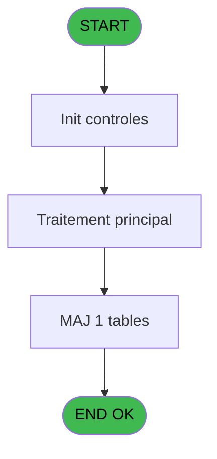
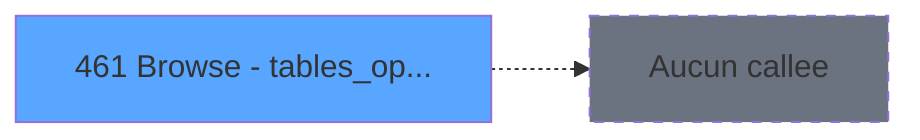

# REF IDE 461 - Browse - tables_operateurs

> **Analyse**: Phases 1-4 2026-02-03 12:05 -> 12:05 (16s) | Assemblage 12:05
> **Pipeline**: V7.2 Enrichi
> **Structure**: 4 onglets (Resume | Ecrans | Donnees | Connexions)

<!-- TAB:Resume -->

## 1. FICHE D'IDENTITE

| Attribut | Valeur |
|----------|--------|
| Projet | REF |
| IDE Position | 461 |
| Nom Programme | Browse - tables_operateurs |
| Fichier source | `Prg_461.xml` |
| Dossier IDE | General |
| Taches | 1 (1 ecrans visibles) |
| Tables modifiees | 1 |
| Programmes appeles | 0 |
| :warning: Statut | **ORPHELIN_POTENTIEL** |

## 2. DESCRIPTION FONCTIONNELLE

**Browse - tables_operateurs** assure la gestion complete de ce processus.

Le flux de traitement s'organise en **1 blocs fonctionnels** :

- **Traitement** (1 tache) : traitements metier divers

**Donnees modifiees** : 1 tables en ecriture (tables_operateurs).

## 3. BLOCS FONCTIONNELS

### 3.1 Traitement (1 tache)

Traitements internes.

---

#### 461 - Browse - tables_operateurs [[ECRAN]](#ecran-t1)

**Role** : Configuration/parametrage : Browse - tables_operateurs.
**Ecran** : 1968 x 195 DLU | [Voir mockup](#ecran-t1)

## 5. REGLES METIER

*(Aucune regle metier identifiee)*

## 6. CONTEXTE

- **Appele par**: (aucun)
- **Appelle**: 0 programmes | **Tables**: 1 (W:1 R:0 L:0) | **Taches**: 1 | **Expressions**: 0

<!-- TAB:Ecrans -->

## 8. ECRANS

### 8.1 Forms visibles (1 / 1)

| # | Position | Tache | Nom | Type | Largeur | Hauteur | Bloc |
|---|----------|-------|-----|------|---------|---------|------|
| 1 | 461 | 461 | Browse - tables_operateurs | Type0 | 1968 | 195 | Traitement |

### 8.2 Mockups Ecrans

---

#### 461 - Browse - tables_operateurs
**Tache** : [461](#t1) | **Type** : Type0 | **Dimensions** : 1968 x 195 DLU
**Bloc** : Traitement | **Titre IDE** : Browse - tables_operateurs

<!-- FORM-DATA:
{
    "width":  1968,
    "vFactor":  8,
    "type":  "Type0",
    "hFactor":  4,
    "controls":  [
                     {
                         "x":  8,
                         "type":  "table",
                         "var":  "",
                         "name":  "",
                         "titleH":  12,
                         "color":  "",
                         "w":  1946,
                         "y":  8,
                         "fmt":  "",
                         "parent":  null,
                         "text":  "",
                         "rowH":  13,
                         "h":  182,
                         "cols":  [
                                      {
                                          "title":  "societe",
                                          "layer":  1,
                                          "w":  30
                                      },
                                      {
                                          "title":  "operateur",
                                          "layer":  2,
                                          "w":  66
                                      },
                                      {
                                          "title":  "nom_complet",
                                          "layer":  3,
                                          "w":  150
                                      },
                                      {
                                          "title":  "code_acces",
                                          "layer":  4,
                                          "w":  50
                                      },
                                      {
                                          "title":  "date_creation",
                                          "layer":  5,
                                          "w":  68
                                      },
                                      {
                                          "title":  "cree_par",
                                          "layer":  6,
                                          "w":  66
                                      },
                                      {
                                          "title":  "derniere_date",
                                          "layer":  7,
                                          "w":  68
                                      },
                                      {
                                          "title":  "derniere_heure",
                                          "layer":  8,
                                          "w":  60
                                      },
                                      {
                                          "title":  "aut_creation",
                                          "layer":  9,
                                          "w":  50
                                      },
                                      {
                                          "title":  "aut_modification",
                                          "layer":  10,
                                          "w":  65
                                      },
                                      {
                                          "title":  "aut_suppression",
                                          "layer":  11,
                                          "w":  65
                                      },
                                      {
                                          "title":  "aut_affectation",
                                          "layer":  12,
                                          "w":  60
                                      },
                                      {
                                          "title":  "aut_supp_periode",
                                          "layer":  13,
                                          "w":  71
                                      },
                                      {
                                          "title":  "aut_prolongation",
                                          "layer":  14,
                                          "w":  66
                                      },
                                      {
                                          "title":  "aut_interruption",
                                          "layer":  15,
                                          "w":  62
                                      },
                                      {
                                          "title":  "aut_avancement",
                                          "layer":  16,
                                          "w":  67
                                      },
                                      {
                                          "title":  "aut_recodification",
                                          "layer":  17,
                                          "w":  70
                                      },
                                      {
                                          "title":  "aut_validation_auto",
                                          "layer":  18,
                                          "w":  78
                                      },
                                      {
                                          "title":  "aut_messagerie",
                                          "layer":  19,
                                          "w":  62
                                      },
                                      {
                                          "title":  "aut_validation",
                                          "layer":  20,
                                          "w":  56
                                      },
                                      {
                                          "title":  "aut_devalidation",
                                          "layer":  21,
                                          "w":  66
                                      },
                                      {
                                          "title":  "aut_immigration",
                                          "layer":  22,
                                          "w":  62
                                      },
                                      {
                                          "title":  "aut_liberation",
                                          "layer":  23,
                                          "w":  54
                                      },
                                      {
                                          "title":  "aut_blocage",
                                          "layer":  24,
                                          "w":  50
                                      },
                                      {
                                          "title":  "aut_statuts",
                                          "layer":  25,
                                          "w":  45
                                      },
                                      {
                                          "title":  "aut_carte_tel",
                                          "layer":  26,
                                          "w":  53
                                      },
                                      {
                                          "title":  "acces_back_front_office",
                                          "layer":  27,
                                          "w":  98
                                      },
                                      {
                                          "title":  "reserve4",
                                          "layer":  28,
                                          "w":  36
                                      },
                                      {
                                          "title":  "reserve5",
                                          "layer":  29,
                                          "w":  36
                                      },
                                      {
                                          "title":  "reserve6",
                                          "layer":  30,
                                          "w":  36
                                      },
                                      {
                                          "title":  "aut_affect_auto",
                                          "layer":  31,
                                          "w":  63
                                      }
                                  ],
                         "rows":  31
                     },
                     {
                         "x":  12,
                         "type":  "edit",
                         "var":  "",
                         "y":  23,
                         "w":  9,
                         "fmt":  "",
                         "name":  "societe",
                         "h":  10,
                         "color":  "110",
                         "text":  "",
                         "parent":  1
                     },
                     {
                         "x":  42,
                         "type":  "edit",
                         "var":  "",
                         "y":  23,
                         "w":  59,
                         "fmt":  "",
                         "name":  "operateur",
                         "h":  10,
                         "color":  "110",
                         "text":  "",
                         "parent":  1
                     },
                     {
                         "x":  108,
                         "type":  "edit",
                         "var":  "",
                         "y":  23,
                         "w":  143,
                         "fmt":  "",
                         "name":  "nom_complet",
                         "h":  10,
                         "color":  "110",
                         "text":  "",
                         "parent":  1
                     },
                     {
                         "x":  258,
                         "type":  "edit",
                         "var":  "",
                         "y":  23,
                         "w":  9,
                         "fmt":  "",
                         "name":  "code_acces",
                         "h":  10,
                         "color":  "110",
                         "text":  "",
                         "parent":  1
                     },
                     {
                         "x":  308,
                         "type":  "edit",
                         "var":  "",
                         "y":  23,
                         "w":  61,
                         "fmt":  "",
                         "name":  "date_creation",
                         "h":  10,
                         "color":  "110",
                         "text":  "",
                         "parent":  1
                     },
                     {
                         "x":  376,
                         "type":  "edit",
                         "var":  "",
                         "y":  23,
                         "w":  59,
                         "fmt":  "",
                         "name":  "cree_par",
                         "h":  10,
                         "color":  "110",
                         "text":  "",
                         "parent":  1
                     },
                     {
                         "x":  442,
                         "type":  "edit",
                         "var":  "",
                         "y":  23,
                         "w":  61,
                         "fmt":  "",
                         "name":  "derniere_date",
                         "h":  10,
                         "color":  "110",
                         "text":  "",
                         "parent":  1
                     },
                     {
                         "x":  510,
                         "type":  "edit",
                         "var":  "",
                         "y":  23,
                         "w":  46,
                         "fmt":  "",
                         "name":  "derniere_heure",
                         "h":  10,
                         "color":  "110",
                         "text":  "",
                         "parent":  1
                     },
                     {
                         "x":  570,
                         "type":  "edit",
                         "var":  "",
                         "y":  23,
                         "w":  9,
                         "fmt":  "",
                         "name":  "aut_creation",
                         "h":  10,
                         "color":  "110",
                         "text":  "",
                         "parent":  1
                     },
                     {
                         "x":  620,
                         "type":  "edit",
                         "var":  "",
                         "y":  23,
                         "w":  9,
                         "fmt":  "",
                         "name":  "aut_modification",
                         "h":  10,
                         "color":  "110",
                         "text":  "",
                         "parent":  1
                     },
                     {
                         "x":  685,
                         "type":  "edit",
                         "var":  "",
                         "y":  23,
                         "w":  9,
                         "fmt":  "",
                         "name":  "aut_suppression",
                         "h":  10,
                         "color":  "110",
                         "text":  "",
                         "parent":  1
                     },
                     {
                         "x":  750,
                         "type":  "edit",
                         "var":  "",
                         "y":  23,
                         "w":  9,
                         "fmt":  "",
                         "name":  "aut_affectation",
                         "h":  10,
                         "color":  "110",
                         "text":  "",
                         "parent":  1
                     },
                     {
                         "x":  810,
                         "type":  "edit",
                         "var":  "",
                         "y":  23,
                         "w":  9,
                         "fmt":  "",
                         "name":  "aut_supp_periode",
                         "h":  10,
                         "color":  "110",
                         "text":  "",
                         "parent":  1
                     },
                     {
                         "x":  881,
                         "type":  "edit",
                         "var":  "",
                         "y":  23,
                         "w":  9,
                         "fmt":  "",
                         "name":  "aut_prolongation",
                         "h":  10,
                         "color":  "110",
                         "text":  "",
                         "parent":  1
                     },
                     {
                         "x":  947,
                         "type":  "edit",
                         "var":  "",
                         "y":  23,
                         "w":  9,
                         "fmt":  "",
                         "name":  "aut_interruption",
                         "h":  10,
                         "color":  "110",
                         "text":  "",
                         "parent":  1
                     },
                     {
                         "x":  1009,
                         "type":  "edit",
                         "var":  "",
                         "y":  23,
                         "w":  9,
                         "fmt":  "",
                         "name":  "aut_avancement",
                         "h":  10,
                         "color":  "110",
                         "text":  "",
                         "parent":  1
                     },
                     {
                         "x":  1076,
                         "type":  "edit",
                         "var":  "",
                         "y":  23,
                         "w":  9,
                         "fmt":  "",
                         "name":  "aut_recodification",
                         "h":  10,
                         "color":  "110",
                         "text":  "",
                         "parent":  1
                     },
                     {
                         "x":  1146,
                         "type":  "edit",
                         "var":  "",
                         "y":  23,
                         "w":  9,
                         "fmt":  "",
                         "name":  "aut_validation_auto",
                         "h":  10,
                         "color":  "110",
                         "text":  "",
                         "parent":  1
                     },
                     {
                         "x":  1224,
                         "type":  "edit",
                         "var":  "",
                         "y":  23,
                         "w":  9,
                         "fmt":  "",
                         "name":  "aut_messagerie",
                         "h":  10,
                         "color":  "110",
                         "text":  "",
                         "parent":  1
                     },
                     {
                         "x":  1286,
                         "type":  "edit",
                         "var":  "",
                         "y":  23,
                         "w":  9,
                         "fmt":  "",
                         "name":  "aut_validation",
                         "h":  10,
                         "color":  "110",
                         "text":  "",
                         "parent":  1
                     },
                     {
                         "x":  1342,
                         "type":  "edit",
                         "var":  "",
                         "y":  23,
                         "w":  9,
                         "fmt":  "",
                         "name":  "aut_devalidation",
                         "h":  10,
                         "color":  "110",
                         "text":  "",
                         "parent":  1
                     },
                     {
                         "x":  1408,
                         "type":  "edit",
                         "var":  "",
                         "y":  23,
                         "w":  9,
                         "fmt":  "",
                         "name":  "aut_immigration",
                         "h":  10,
                         "color":  "110",
                         "text":  "",
                         "parent":  1
                     },
                     {
                         "x":  1470,
                         "type":  "edit",
                         "var":  "",
                         "y":  23,
                         "w":  9,
                         "fmt":  "",
                         "name":  "aut_liberation",
                         "h":  10,
                         "color":  "110",
                         "text":  "",
                         "parent":  1
                     },
                     {
                         "x":  1524,
                         "type":  "edit",
                         "var":  "",
                         "y":  23,
                         "w":  9,
                         "fmt":  "",
                         "name":  "aut_blocage",
                         "h":  10,
                         "color":  "110",
                         "text":  "",
                         "parent":  1
                     },
                     {
                         "x":  1574,
                         "type":  "edit",
                         "var":  "",
                         "y":  23,
                         "w":  9,
                         "fmt":  "",
                         "name":  "aut_statuts",
                         "h":  10,
                         "color":  "110",
                         "text":  "",
                         "parent":  1
                     },
                     {
                         "x":  1619,
                         "type":  "edit",
                         "var":  "",
                         "y":  23,
                         "w":  9,
                         "fmt":  "",
                         "name":  "aut_carte_tel",
                         "h":  10,
                         "color":  "110",
                         "text":  "",
                         "parent":  1
                     },
                     {
                         "x":  1672,
                         "type":  "edit",
                         "var":  "",
                         "y":  23,
                         "w":  9,
                         "fmt":  "",
                         "name":  "acces_back_front_office",
                         "h":  10,
                         "color":  "110",
                         "text":  "",
                         "parent":  1
                     },
                     {
                         "x":  1770,
                         "type":  "edit",
                         "var":  "",
                         "y":  23,
                         "w":  9,
                         "fmt":  "",
                         "name":  "reserve4",
                         "h":  10,
                         "color":  "110",
                         "text":  "",
                         "parent":  1
                     },
                     {
                         "x":  1806,
                         "type":  "edit",
                         "var":  "",
                         "y":  23,
                         "w":  9,
                         "fmt":  "",
                         "name":  "reserve5",
                         "h":  10,
                         "color":  "110",
                         "text":  "",
                         "parent":  1
                     },
                     {
                         "x":  1842,
                         "type":  "edit",
                         "var":  "",
                         "y":  23,
                         "w":  9,
                         "fmt":  "",
                         "name":  "reserve6",
                         "h":  10,
                         "color":  "110",
                         "text":  "",
                         "parent":  1
                     },
                     {
                         "x":  1878,
                         "type":  "edit",
                         "var":  "",
                         "y":  23,
                         "w":  9,
                         "fmt":  "",
                         "name":  "aut_affect_auto",
                         "h":  10,
                         "color":  "110",
                         "text":  "",
                         "parent":  1
                     }
                 ],
    "taskId":  "461",
    "height":  195
}
-->

<strong>Champs : 31 champs</strong>

| Pos (x,y) | Nom | Variable | Type |
|-----------|-----|----------|------|
| 12,23 | societe | - | edit |
| 42,23 | operateur | - | edit |
| 108,23 | nom_complet | - | edit |
| 258,23 | code_acces | - | edit |
| 308,23 | date_creation | - | edit |
| 376,23 | cree_par | - | edit |
| 442,23 | derniere_date | - | edit |
| 510,23 | derniere_heure | - | edit |
| 570,23 | aut_creation | - | edit |
| 620,23 | aut_modification | - | edit |
| 685,23 | aut_suppression | - | edit |
| 750,23 | aut_affectation | - | edit |
| 810,23 | aut_supp_periode | - | edit |
| 881,23 | aut_prolongation | - | edit |
| 947,23 | aut_interruption | - | edit |
| 1009,23 | aut_avancement | - | edit |
| 1076,23 | aut_recodification | - | edit |
| 1146,23 | aut_validation_auto | - | edit |
| 1224,23 | aut_messagerie | - | edit |
| 1286,23 | aut_validation | - | edit |
| 1342,23 | aut_devalidation | - | edit |
| 1408,23 | aut_immigration | - | edit |
| 1470,23 | aut_liberation | - | edit |
| 1524,23 | aut_blocage | - | edit |
| 1574,23 | aut_statuts | - | edit |
| 1619,23 | aut_carte_tel | - | edit |
| 1672,23 | acces_back_front_office | - | edit |
| 1770,23 | reserve4 | - | edit |
| 1806,23 | reserve5 | - | edit |
| 1842,23 | reserve6 | - | edit |
| 1878,23 | aut_affect_auto | - | edit |

## 9. NAVIGATION

Ecran unique: **Browse - tables_operateurs**

### 9.3 Structure hierarchique (1 tache)

| Position | Tache | Type | Dimensions | Bloc |
|----------|-------|------|------------|------|
| **461.1** | [**Browse - tables_operateurs** (461)](#t1) [mockup](#ecran-t1) | - | 1968x195 | Traitement |

### 9.4 Algorigramme

> **Legende**: Vert = START/END OK | Rouge = END KO | Bleu = Decisions
> *Algorigramme auto-genere. Utiliser `/algorigramme` pour une synthese metier detaillee.*

<!-- TAB:Donnees -->

## 10. TABLES

### Tables utilisees (1)

| ID | Nom | Description | Type | R | W | L | Usages |
|----|-----|-------------|------|---|---|---|--------|
| 116 | tables_operateurs |  | DB |   | **W** |   | 1 |

### Colonnes par table (0 / 1 tables avec colonnes identifiees)

Table 116 - tables_operateurs (**W**) - 1 usages

*Table utilisee uniquement en Link ou aucune colonne Real identifiee dans le DataView.*

## 11. VARIABLES

*(Programme sans variables locales mappees)*

## 12. EXPRESSIONS

**0 / 0 expressions decodees (0%)**

### 12.1 Repartition par type

| Type | Expressions | Regles |
|------|-------------|--------|

### 12.2 Expressions cles par type

<!-- TAB:Connexions -->

## 13. GRAPHE D'APPELS

### 13.1 Chaine depuis Main (Callers)

**Chemin**: (pas de callers directs)

### 13.2 Callers

| IDE | Nom Programme | Nb Appels |
|-----|---------------|-----------|
| - | (aucun) | - |

### 13.3 Callees (programmes appeles)

### 13.4 Detail Callees avec contexte

| IDE | Nom Programme | Appels | Contexte |
|-----|---------------|--------|----------|
| - | (aucun) | - | - |

## 14. RECOMMANDATIONS MIGRATION

### 14.1 Profil du programme

| Metrique | Valeur | Impact migration |
|----------|--------|-----------------|
| Lignes de logique | 32 | Programme compact |
| Expressions | 0 | Peu de logique |
| Tables WRITE | 1 | Impact faible |
| Sous-programmes | 0 | Peu de dependances |
| Ecrans visibles | 1 | Ecran unique ou traitement batch |
| Code desactive | 0% (0 / 32) | Code sain |
| Regles metier | 0 | Pas de regle identifiee |

### 14.2 Plan de migration par bloc

#### Traitement (1 tache: 1 ecran, 0 traitement)

- **Strategie** : 1 composant(s) UI (Razor/React) avec formulaires et validation.
- Decomposer les taches en services unitaires testables.

### 14.3 Dependances critiques

| Dependance | Type | Appels | Impact |
|------------|------|--------|--------|
| tables_operateurs | Table WRITE (Database) | 1x | Schema + repository |

---
*Spec DETAILED generee par Pipeline V7.2 - 2026-02-03 12:05*
