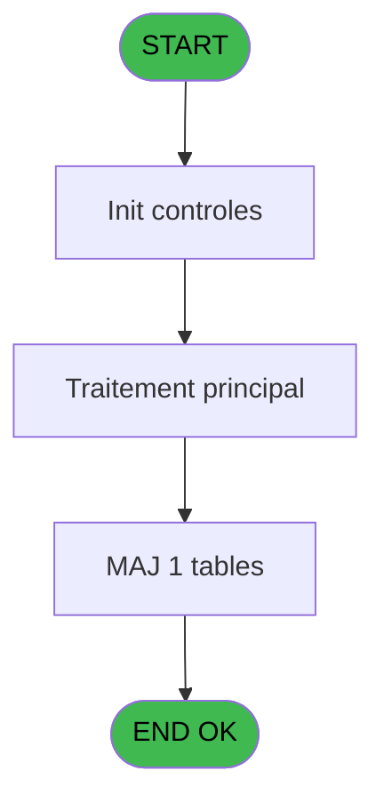

# REF IDE 500 - Browse - pv_parametre_generaux

> **Analyse**: Phases 1-4 2026-02-03 12:19 -> 12:20 (16s) | Assemblage 12:20
> **Pipeline**: V7.2 Enrichi
> **Structure**: 4 onglets (Resume | Ecrans | Donnees | Connexions)

<!-- TAB:Resume -->

## 1. FICHE D'IDENTITE

| Attribut | Valeur |
|----------|--------|
| Projet | REF |
| IDE Position | 500 |
| Nom Programme | Browse - pv_parametre_generaux |
| Fichier source | `Prg_500.xml` |
| Dossier IDE | General |
| Taches | 1 (1 ecrans visibles) |
| Tables modifiees | 1 |
| Programmes appeles | 0 |
| :warning: Statut | **ORPHELIN_POTENTIEL** |

## 2. DESCRIPTION FONCTIONNELLE

**Browse - pv_parametre_generaux** assure la gestion complete de ce processus.

Le flux de traitement s'organise en **1 blocs fonctionnels** :

- **Traitement** (1 tache) : traitements metier divers

**Donnees modifiees** : 1 tables en ecriture (pv_parametre_generaux).

## 3. BLOCS FONCTIONNELS

### 3.1 Traitement (1 tache)

Traitements internes.

---

#### 500 - Browse - pv_parametre_generaux [[ECRAN]](#ecran-t1)

**Role** : Traitement : Browse - pv_parametre_generaux.
**Ecran** : 13171 x 195 DLU | [Voir mockup](#ecran-t1)

## 5. REGLES METIER

*(Aucune regle metier identifiee)*

## 6. CONTEXTE

- **Appele par**: (aucun)
- **Appelle**: 0 programmes | **Tables**: 1 (W:1 R:0 L:0) | **Taches**: 1 | **Expressions**: 0

<!-- TAB:Ecrans -->

## 8. ECRANS

### 8.1 Forms visibles (1 / 1)

| # | Position | Tache | Nom | Type | Largeur | Hauteur | Bloc |
|---|----------|-------|-----|------|---------|---------|------|
| 1 | 500 | 500 | Browse - pv_parametre_generaux | Type0 | 13171 | 195 | Traitement |

### 8.2 Mockups Ecrans

---

#### 500 - Browse - pv_parametre_generaux
**Tache** : [500](#t1) | **Type** : Type0 | **Dimensions** : 13171 x 195 DLU
**Bloc** : Traitement | **Titre IDE** : Browse - pv_parametre_generaux

<!-- FORM-DATA:
{
    "width":  13171,
    "vFactor":  8,
    "type":  "Type0",
    "hFactor":  4,
    "controls":  [
                     {
                         "x":  8,
                         "type":  "table",
                         "var":  "",
                         "name":  "",
                         "titleH":  12,
                         "color":  "",
                         "w":  13149,
                         "y":  8,
                         "fmt":  "",
                         "parent":  null,
                         "text":  "",
                         "rowH":  13,
                         "h":  182,
                         "cols":  [
                                      {
                                          "title":  "societe",
                                          "layer":  1,
                                          "w":  30
                                      },
                                      {
                                          "title":  "default_#_days_auto_gen",
                                          "layer":  2,
                                          "w":  102
                                      },
                                      {
                                          "title":  "geographic_zone",
                                          "layer":  3,
                                          "w":  69
                                      },
                                      {
                                          "title":  "autorise_payment_if_no_guaranty",
                                          "layer":  4,
                                          "w":  130
                                      },
                                      {
                                          "title":  "pms_code_service__nu_",
                                          "layer":  5,
                                          "w":  98
                                      },
                                      {
                                          "title":  "insurance_category_id",
                                          "layer":  6,
                                          "w":  89
                                      },
                                      {
                                          "title":  "password",
                                          "layer":  7,
                                          "w":  39
                                      },
                                      {
                                          "title":  "sales_cancel",
                                          "layer":  8,
                                          "w":  53
                                      },
                                      {
                                          "title":  "vide",
                                          "layer":  9,
                                          "w":  223
                                      },
                                      {
                                          "title":  "pv_service",
                                          "layer":  10,
                                          "w":  45
                                      },
                                      {
                                          "title":  "pg2_display_logo",
                                          "layer":  11,
                                          "w":  69
                                      },
                                      {
                                          "title":  "pg2_logique_1",
                                          "layer":  12,
                                          "w":  59
                                      },
                                      {
                                          "title":  "pg2_logique_2",
                                          "layer":  13,
                                          "w":  59
                                      },
                                      {
                                          "title":  "pg2_logique_3",
                                          "layer":  14,
                                          "w":  59
                                      },
                                      {
                                          "title":  "pg2_logique_4",
                                          "layer":  15,
                                          "w":  59
                                      },
                                      {
                                          "title":  "pg2_logique_5",
                                          "layer":  16,
                                          "w":  59
                                      },
                                      {
                                          "title":  "pg2_logique_6",
                                          "layer":  17,
                                          "w":  59
                                      },
                                      {
                                          "title":  "pg2_logique_7",
                                          "layer":  18,
                                          "w":  59
                                      },
                                      {
                                          "title":  "pg2_logique_8",
                                          "layer":  19,
                                          "w":  59
                                      },
                                      {
                                          "title":  "pg2_logique_9",
                                          "layer":  20,
                                          "w":  59
                                      },
                                      {
                                          "title":  "booker_api_url",
                                          "layer":  21,
                                          "w":  570
                                      },
                                      {
                                          "title":  "proxy_address",
                                          "layer":  22,
                                          "w":  1130
                                      },
                                      {
                                          "title":  "booker_location_id",
                                          "layer":  23,
                                          "w":  75
                                      },
                                      {
                                          "title":  "booker_decalage_horaire",
                                          "layer":  24,
                                          "w":  100
                                      },
                                      {
                                          "title":  "mode_recherche_client",
                                          "layer":  25,
                                          "w":  92
                                      },
                                      {
                                          "title":  "Bestof",
                                          "layer":  26,
                                          "w":  33
                                      },
                                      {
                                          "title":  "book_client_id",
                                          "layer":  27,
                                          "w":  570
                                      },
                                      {
                                          "title":  "book_client_secret",
                                          "layer":  28,
                                          "w":  570
                                      },
                                      {
                                          "title":  "book_username",
                                          "layer":  29,
                                          "w":  570
                                      },
                                      {
                                          "title":  "book_password",
                                          "layer":  30,
                                          "w":  570
                                      },
                                      {
                                          "title":  "book_anonymization",
                                          "layer":  31,
                                          "w":  81
                                      },
                                      {
                                          "title":  "book_payment_name",
                                          "layer":  32,
                                          "w":  570
                                      },
                                      {
                                          "title":  "book_id_special",
                                          "layer":  33,
                                          "w":  178
                                      },
                                      {
                                          "title":  "book_refresh_token",
                                          "layer":  34,
                                          "w":  2810
                                      },
                                      {
                                          "title":  "book_access_token",
                                          "layer":  35,
                                          "w":  2810
                                      },
                                      {
                                          "title":  "book_refresh_token_last_use",
                                          "layer":  36,
                                          "w":  115
                                      },
                                      {
                                          "title":  "book_refresh_token_last_use_tim",
                                          "layer":  37,
                                          "w":  130
                                      },
                                      {
                                          "title":  "book_ocp_apim_subscription_key",
                                          "layer":  38,
                                          "w":  570
                                      },
                                      {
                                          "title":  "book_nb_copie_service_loc",
                                          "layer":  39,
                                          "w":  110
                                      }
                                  ],
                         "rows":  39
                     },
                     {
                         "x":  12,
                         "type":  "edit",
                         "var":  "",
                         "y":  23,
                         "w":  9,
                         "fmt":  "",
                         "name":  "societe",
                         "h":  10,
                         "color":  "",
                         "text":  "",
                         "parent":  1
                     },
                     {
                         "x":  42,
                         "type":  "edit",
                         "var":  "",
                         "y":  23,
                         "w":  13,
                         "fmt":  "",
                         "name":  "default_#_days_auto_gen",
                         "h":  10,
                         "color":  "",
                         "text":  "",
                         "parent":  1
                     },
                     {
                         "x":  144,
                         "type":  "edit",
                         "var":  "",
                         "y":  23,
                         "w":  13,
                         "fmt":  "",
                         "name":  "geographic_zone",
                         "h":  10,
                         "color":  "",
                         "text":  "",
                         "parent":  1
                     },
                     {
                         "x":  213,
                         "type":  "edit",
                         "var":  "",
                         "y":  23,
                         "w":  31,
                         "fmt":  "",
                         "name":  "autorise_payment_if_no_guaranty",
                         "h":  10,
                         "color":  "",
                         "text":  "",
                         "parent":  1
                     },
                     {
                         "x":  343,
                         "type":  "edit",
                         "var":  "",
                         "y":  23,
                         "w":  31,
                         "fmt":  "",
                         "name":  "pms_code_service__nu_",
                         "h":  10,
                         "color":  "",
                         "text":  "",
                         "parent":  1
                     },
                     {
                         "x":  441,
                         "type":  "edit",
                         "var":  "",
                         "y":  23,
                         "w":  13,
                         "fmt":  "",
                         "name":  "insurance_category_id",
                         "h":  10,
                         "color":  "",
                         "text":  "",
                         "parent":  1
                     },
                     {
                         "x":  530,
                         "type":  "edit",
                         "var":  "",
                         "y":  23,
                         "w":  20,
                         "fmt":  "",
                         "name":  "password",
                         "h":  10,
                         "color":  "",
                         "text":  "",
                         "parent":  1
                     },
                     {
                         "x":  569,
                         "type":  "edit",
                         "var":  "",
                         "y":  23,
                         "w":  22,
                         "fmt":  "",
                         "name":  "sales_cancel",
                         "h":  10,
                         "color":  "",
                         "text":  "",
                         "parent":  1
                     },
                     {
                         "x":  622,
                         "type":  "edit",
                         "var":  "",
                         "y":  23,
                         "w":  216,
                         "fmt":  "",
                         "name":  "vide",
                         "h":  10,
                         "color":  "",
                         "text":  "",
                         "parent":  1
                     },
                     {
                         "x":  845,
                         "type":  "edit",
                         "var":  "",
                         "y":  23,
                         "w":  26,
                         "fmt":  "",
                         "name":  "pv_service",
                         "h":  10,
                         "color":  "",
                         "text":  "",
                         "parent":  1
                     },
                     {
                         "x":  890,
                         "type":  "edit",
                         "var":  "",
                         "y":  23,
                         "w":  31,
                         "fmt":  "",
                         "name":  "pg2_display_logo",
                         "h":  10,
                         "color":  "",
                         "text":  "",
                         "parent":  1
                     },
                     {
                         "x":  959,
                         "type":  "edit",
                         "var":  "",
                         "y":  23,
                         "w":  31,
                         "fmt":  "",
                         "name":  "pg2_logique_1",
                         "h":  10,
                         "color":  "",
                         "text":  "",
                         "parent":  1
                     },
                     {
                         "x":  1018,
                         "type":  "edit",
                         "var":  "",
                         "y":  23,
                         "w":  31,
                         "fmt":  "",
                         "name":  "pg2_logique_2",
                         "h":  10,
                         "color":  "",
                         "text":  "",
                         "parent":  1
                     },
                     {
                         "x":  1077,
                         "type":  "edit",
                         "var":  "",
                         "y":  23,
                         "w":  31,
                         "fmt":  "",
                         "name":  "pg2_logique_3",
                         "h":  10,
                         "color":  "",
                         "text":  "",
                         "parent":  1
                     },
                     {
                         "x":  1136,
                         "type":  "edit",
                         "var":  "",
                         "y":  23,
                         "w":  31,
                         "fmt":  "",
                         "name":  "pg2_logique_4",
                         "h":  10,
                         "color":  "",
                         "text":  "",
                         "parent":  1
                     },
                     {
                         "x":  1195,
                         "type":  "edit",
                         "var":  "",
                         "y":  23,
                         "w":  31,
                         "fmt":  "",
                         "name":  "pg2_logique_5",
                         "h":  10,
                         "color":  "",
                         "text":  "",
                         "parent":  1
                     },
                     {
                         "x":  1254,
                         "type":  "edit",
                         "var":  "",
                         "y":  23,
                         "w":  31,
                         "fmt":  "",
                         "name":  "pg2_logique_6",
                         "h":  10,
                         "color":  "",
                         "text":  "",
                         "parent":  1
                     },
                     {
                         "x":  1313,
                         "type":  "edit",
                         "var":  "",
                         "y":  23,
                         "w":  31,
                         "fmt":  "",
                         "name":  "pg2_logique_7",
                         "h":  10,
                         "color":  "",
                         "text":  "",
                         "parent":  1
                     },
                     {
                         "x":  1372,
                         "type":  "edit",
                         "var":  "",
                         "y":  23,
                         "w":  31,
                         "fmt":  "",
                         "name":  "pg2_logique_8",
                         "h":  10,
                         "color":  "",
                         "text":  "",
                         "parent":  1
                     },
                     {
                         "x":  1431,
                         "type":  "edit",
                         "var":  "",
                         "y":  23,
                         "w":  31,
                         "fmt":  "",
                         "name":  "pg2_logique_9",
                         "h":  10,
                         "color":  "",
                         "text":  "",
                         "parent":  1
                     },
                     {
                         "x":  1490,
                         "type":  "edit",
                         "var":  "",
                         "y":  23,
                         "w":  563,
                         "fmt":  "",
                         "name":  "booker_api_url",
                         "h":  10,
                         "color":  "",
                         "text":  "",
                         "parent":  1
                     },
                     {
                         "x":  2060,
                         "type":  "edit",
                         "var":  "",
                         "y":  23,
                         "w":  1123,
                         "fmt":  "",
                         "name":  "proxy_address",
                         "h":  10,
                         "color":  "",
                         "text":  "",
                         "parent":  1
                     },
                     {
                         "x":  3190,
                         "type":  "edit",
                         "var":  "",
                         "y":  23,
                         "w":  51,
                         "fmt":  "",
                         "name":  "booker_location_id",
                         "h":  10,
                         "color":  "",
                         "text":  "",
                         "parent":  1
                     },
                     {
                         "x":  3265,
                         "type":  "edit",
                         "var":  "",
                         "y":  23,
                         "w":  18,
                         "fmt":  "",
                         "name":  "booker_decalage_horaire",
                         "h":  10,
                         "color":  "",
                         "text":  "",
                         "parent":  1
                     },
                     {
                         "x":  3365,
                         "type":  "edit",
                         "var":  "",
                         "y":  23,
                         "w":  22,
                         "fmt":  "",
                         "name":  "mode_recherche_client",
                         "h":  10,
                         "color":  "",
                         "text":  "",
                         "parent":  1
                     },
                     {
                         "x":  3457,
                         "type":  "edit",
                         "var":  "",
                         "y":  23,
                         "w":  26,
                         "fmt":  "",
                         "name":  "Bestof",
                         "h":  10,
                         "color":  "",
                         "text":  "",
                         "parent":  1
                     },
                     {
                         "x":  3490,
                         "type":  "edit",
                         "var":  "",
                         "y":  23,
                         "w":  563,
                         "fmt":  "",
                         "name":  "book_client_id",
                         "h":  10,
                         "color":  "",
                         "text":  "",
                         "parent":  1
                     },
                     {
                         "x":  4060,
                         "type":  "edit",
                         "var":  "",
                         "y":  23,
                         "w":  563,
                         "fmt":  "",
                         "name":  "book_client_secret",
                         "h":  10,
                         "color":  "",
                         "text":  "",
                         "parent":  1
                     },
                     {
                         "x":  4630,
                         "type":  "edit",
                         "var":  "",
                         "y":  23,
                         "w":  563,
                         "fmt":  "",
                         "name":  "book_username",
                         "h":  10,
                         "color":  "",
                         "text":  "",
                         "parent":  1
                     },
                     {
                         "x":  5200,
                         "type":  "edit",
                         "var":  "",
                         "y":  23,
                         "w":  563,
                         "fmt":  "",
                         "name":  "book_password",
                         "h":  10,
                         "color":  "",
                         "text":  "",
                         "parent":  1
                     },
                     {
                         "x":  5770,
                         "type":  "edit",
                         "var":  "",
                         "y":  23,
                         "w":  31,
                         "fmt":  "",
                         "name":  "book_anonymization",
                         "h":  10,
                         "color":  "",
                         "text":  "",
                         "parent":  1
                     },
                     {
                         "x":  5851,
                         "type":  "edit",
                         "var":  "",
                         "y":  23,
                         "w":  563,
                         "fmt":  "",
                         "name":  "book_payment_name",
                         "h":  10,
                         "color":  "",
                         "text":  "",
                         "parent":  1
                     },
                     {
                         "x":  6421,
                         "type":  "edit",
                         "var":  "",
                         "y":  23,
                         "w":  171,
                         "fmt":  "",
                         "name":  "book_id_special",
                         "h":  10,
                         "color":  "",
                         "text":  "",
                         "parent":  1
                     },
                     {
                         "x":  6599,
                         "type":  "edit",
                         "var":  "",
                         "y":  23,
                         "w":  2803,
                         "fmt":  "",
                         "name":  "book_refresh_token",
                         "h":  10,
                         "color":  "",
                         "text":  "",
                         "parent":  1
                     },
                     {
                         "x":  9409,
                         "type":  "edit",
                         "var":  "",
                         "y":  23,
                         "w":  2803,
                         "fmt":  "",
                         "name":  "book_access_token",
                         "h":  10,
                         "color":  "",
                         "text":  "",
                         "parent":  1
                     },
                     {
                         "x":  12219,
                         "type":  "edit",
                         "var":  "",
                         "y":  23,
                         "w":  61,
                         "fmt":  "",
                         "name":  "book_refresh_token_last_use",
                         "h":  10,
                         "color":  "",
                         "text":  "",
                         "parent":  1
                     },
                     {
                         "x":  12334,
                         "type":  "edit",
                         "var":  "",
                         "y":  23,
                         "w":  46,
                         "fmt":  "",
                         "name":  "book_refresh_token_last_use_tim",
                         "h":  10,
                         "color":  "",
                         "text":  "",
                         "parent":  1
                     },
                     {
                         "x":  12464,
                         "type":  "edit",
                         "var":  "",
                         "y":  23,
                         "w":  563,
                         "fmt":  "",
                         "name":  "book_ocp_apim_subscription_key",
                         "h":  10,
                         "color":  "",
                         "text":  "",
                         "parent":  1
                     },
                     {
                         "x":  13034,
                         "type":  "edit",
                         "var":  "",
                         "y":  23,
                         "w":  13,
                         "fmt":  "",
                         "name":  "book_nb_copie_service_loc",
                         "h":  10,
                         "color":  "",
                         "text":  "",
                         "parent":  1
                     }
                 ],
    "taskId":  "500",
    "height":  195
}
-->

<strong>Champs : 39 champs</strong>

| Pos (x,y) | Nom | Variable | Type |
|-----------|-----|----------|------|
| 12,23 | societe | - | edit |
| 42,23 | default_#_days_auto_gen | - | edit |
| 144,23 | geographic_zone | - | edit |
| 213,23 | autorise_payment_if_no_guaranty | - | edit |
| 343,23 | pms_code_service__nu_ | - | edit |
| 441,23 | insurance_category_id | - | edit |
| 530,23 | password | - | edit |
| 569,23 | sales_cancel | - | edit |
| 622,23 | vide | - | edit |
| 845,23 | pv_service | - | edit |
| 890,23 | pg2_display_logo | - | edit |
| 959,23 | pg2_logique_1 | - | edit |
| 1018,23 | pg2_logique_2 | - | edit |
| 1077,23 | pg2_logique_3 | - | edit |
| 1136,23 | pg2_logique_4 | - | edit |
| 1195,23 | pg2_logique_5 | - | edit |
| 1254,23 | pg2_logique_6 | - | edit |
| 1313,23 | pg2_logique_7 | - | edit |
| 1372,23 | pg2_logique_8 | - | edit |
| 1431,23 | pg2_logique_9 | - | edit |
| 1490,23 | booker_api_url | - | edit |
| 2060,23 | proxy_address | - | edit |
| 3190,23 | booker_location_id | - | edit |
| 3265,23 | booker_decalage_horaire | - | edit |
| 3365,23 | mode_recherche_client | - | edit |
| 3457,23 | Bestof | - | edit |
| 3490,23 | book_client_id | - | edit |
| 4060,23 | book_client_secret | - | edit |
| 4630,23 | book_username | - | edit |
| 5200,23 | book_password | - | edit |
| 5770,23 | book_anonymization | - | edit |
| 5851,23 | book_payment_name | - | edit |
| 6421,23 | book_id_special | - | edit |
| 6599,23 | book_refresh_token | - | edit |
| 9409,23 | book_access_token | - | edit |
| 12219,23 | book_refresh_token_last_use | - | edit |
| 12334,23 | book_refresh_token_last_use_tim | - | edit |
| 12464,23 | book_ocp_apim_subscription_key | - | edit |
| 13034,23 | book_nb_copie_service_loc | - | edit |

## 9. NAVIGATION

Ecran unique: **Browse - pv_parametre_generaux**

### 9.3 Structure hierarchique (1 tache)

| Position | Tache | Type | Dimensions | Bloc |
|----------|-------|------|------------|------|
| **500.1** | [**Browse - pv_parametre_generaux** (500)](#t1) [mockup](#ecran-t1) | - | 13171x195 | Traitement |

### 9.4 Algorigramme

> **Legende**: Vert = START/END OK | Rouge = END KO | Bleu = Decisions
> *Algorigramme auto-genere. Utiliser `/algorigramme` pour une synthese metier detaillee.*

<!-- TAB:Donnees -->

## 10. TABLES

### Tables utilisees (1)

| ID | Nom | Description | Type | R | W | L | Usages |
|----|-----|-------------|------|---|---|---|--------|
| 710 | pv_parametre_generaux |  | DB |   | **W** |   | 1 |

### Colonnes par table (0 / 1 tables avec colonnes identifiees)

Table 710 - pv_parametre_generaux (**W**) - 1 usages

*Table utilisee uniquement en Link ou aucune colonne Real identifiee dans le DataView.*

## 11. VARIABLES

*(Programme sans variables locales mappees)*

## 12. EXPRESSIONS

**0 / 0 expressions decodees (0%)**

### 12.1 Repartition par type

| Type | Expressions | Regles |
|------|-------------|--------|

### 12.2 Expressions cles par type

<!-- TAB:Connexions -->

## 13. GRAPHE D'APPELS

### 13.1 Chaine depuis Main (Callers)

**Chemin**: (pas de callers directs)

### 13.2 Callers

| IDE | Nom Programme | Nb Appels |
|-----|---------------|-----------|
| - | (aucun) | - |

### 13.3 Callees (programmes appeles)

### 13.4 Detail Callees avec contexte

| IDE | Nom Programme | Appels | Contexte |
|-----|---------------|--------|----------|
| - | (aucun) | - | - |

## 14. RECOMMANDATIONS MIGRATION

### 14.1 Profil du programme

| Metrique | Valeur | Impact migration |
|----------|--------|-----------------|
| Lignes de logique | 43 | Programme compact |
| Expressions | 0 | Peu de logique |
| Tables WRITE | 1 | Impact faible |
| Sous-programmes | 0 | Peu de dependances |
| Ecrans visibles | 1 | Ecran unique ou traitement batch |
| Code desactive | 0% (0 / 43) | Code sain |
| Regles metier | 0 | Pas de regle identifiee |

### 14.2 Plan de migration par bloc

#### Traitement (1 tache: 1 ecran, 0 traitement)

- **Strategie** : 1 composant(s) UI (Razor/React) avec formulaires et validation.
- Decomposer les taches en services unitaires testables.

### 14.3 Dependances critiques

| Dependance | Type | Appels | Impact |
|------------|------|--------|--------|
| pv_parametre_generaux | Table WRITE (Database) | 1x | Schema + repository |

---
*Spec DETAILED generee par Pipeline V7.2 - 2026-02-03 12:20*
