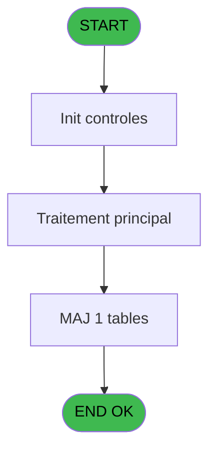

# REF IDE 529 - Browse - arc_pv_cust_packages

> **Analyse**: Phases 1-4 2026-02-03 12:32 -> 12:32 (17s) | Assemblage 12:32
> **Pipeline**: V7.2 Enrichi
> **Structure**: 4 onglets (Resume | Ecrans | Donnees | Connexions)

<!-- TAB:Resume -->

## 1. FICHE D'IDENTITE

| Attribut | Valeur |
|----------|--------|
| Projet | REF |
| IDE Position | 529 |
| Nom Programme | Browse - arc_pv_cust_packages |
| Fichier source | `Prg_529.xml` |
| Dossier IDE | General |
| Taches | 1 (1 ecrans visibles) |
| Tables modifiees | 1 |
| Programmes appeles | 0 |
| :warning: Statut | **ORPHELIN_POTENTIEL** |

## 2. DESCRIPTION FONCTIONNELLE

**Browse - arc_pv_cust_packages** assure la gestion complete de ce processus.

Le flux de traitement s'organise en **1 blocs fonctionnels** :

- **Traitement** (1 tache) : traitements metier divers

**Donnees modifiees** : 1 tables en ecriture (arc_pv_cust_packages).

## 3. BLOCS FONCTIONNELS

### 3.1 Traitement (1 tache)

Traitements internes.

---

#### 529 - Browse - arc_pv_cust_packages [[ECRAN]](#ecran-t1)

**Role** : Traitement : Browse - arc_pv_cust_packages.
**Ecran** : 320 x 200 DLU | [Voir mockup](#ecran-t1)

## 5. REGLES METIER

*(Aucune regle metier identifiee)*

## 6. CONTEXTE

- **Appele par**: (aucun)
- **Appelle**: 0 programmes | **Tables**: 1 (W:1 R:0 L:0) | **Taches**: 1 | **Expressions**: 0

<!-- TAB:Ecrans -->

## 8. ECRANS

### 8.1 Forms visibles (1 / 1)

| # | Position | Tache | Nom | Type | Largeur | Hauteur | Bloc |
|---|----------|-------|-----|------|---------|---------|------|
| 1 | 529 | 529 | Browse - arc_pv_cust_packages | Type0 | 320 | 200 | Traitement |

### 8.2 Mockups Ecrans

---

#### 529 - Browse - arc_pv_cust_packages
**Tache** : [529](#t1) | **Type** : Type0 | **Dimensions** : 320 x 200 DLU
**Bloc** : Traitement | **Titre IDE** : Browse - arc_pv_cust_packages

<!-- FORM-DATA:
{
    "width":  320,
    "vFactor":  8,
    "type":  "Type0",
    "hFactor":  4,
    "controls":  [
                     {
                         "x":  8,
                         "type":  "table",
                         "var":  "",
                         "name":  "",
                         "titleH":  12,
                         "color":  "110",
                         "w":  3303,
                         "y":  8,
                         "fmt":  "",
                         "parent":  null,
                         "text":  "",
                         "rowH":  13,
                         "h":  182,
                         "cols":  [
                                      {
                                          "title":  "arc_pos_id",
                                          "layer":  1,
                                          "w":  58
                                      },
                                      {
                                          "title":  "arc_package_id_out",
                                          "layer":  2,
                                          "w":  82
                                      },
                                      {
                                          "title":  "arc_package_id_in",
                                          "layer":  3,
                                          "w":  76
                                      },
                                      {
                                          "title":  "arc_date__start_",
                                          "layer":  4,
                                          "w":  68
                                      },
                                      {
                                          "title":  "arc_date__end_",
                                          "layer":  5,
                                          "w":  68
                                      },
                                      {
                                          "title":  "arc_cat",
                                          "layer":  6,
                                          "w":  32
                                      },
                                      {
                                          "title":  "arc_sub_cat",
                                          "layer":  7,
                                          "w":  50
                                      },
                                      {
                                          "title":  "arc_sub_sub_cat",
                                          "layer":  8,
                                          "w":  69
                                      },
                                      {
                                          "title":  "arc_description",
                                          "layer":  9,
                                          "w":  290
                                      },
                                      {
                                          "title":  "arc_action_type",
                                          "layer":  10,
                                          "w":  66
                                      },
                                      {
                                          "title":  "arc_#_days",
                                          "layer":  11,
                                          "w":  48
                                      },
                                      {
                                          "title":  "arc_price",
                                          "layer":  12,
                                          "w":  97
                                      },
                                      {
                                          "title":  "arc_discount",
                                          "layer":  13,
                                          "w":  52
                                      },
                                      {
                                          "title":  "arc_discount_reason",
                                          "layer":  14,
                                          "w":  82
                                      },
                                      {
                                          "title":  "arc_payer_xcust_id",
                                          "layer":  15,
                                          "w":  77
                                      },
                                      {
                                          "title":  "arc_payment_type",
                                          "layer":  16,
                                          "w":  94
                                      },
                                      {
                                          "title":  "arc_pms_transaction__",
                                          "layer":  17,
                                          "w":  91
                                      },
                                      {
                                          "title":  "arc_validated__",
                                          "layer":  18,
                                          "w":  64
                                      },
                                      {
                                          "title":  "arc_comment",
                                          "layer":  19,
                                          "w":  570
                                      },
                                      {
                                          "title":  "arc_bank_accounting_date",
                                          "layer":  20,
                                          "w":  108
                                      },
                                      {
                                          "title":  "arc_date_create",
                                          "layer":  21,
                                          "w":  68
                                      },
                                      {
                                          "title":  "arc_time_create",
                                          "layer":  22,
                                          "w":  64
                                      },
                                      {
                                          "title":  "arc_user_create",
                                          "layer":  23,
                                          "w":  66
                                      },
                                      {
                                          "title":  "arc_date_update",
                                          "layer":  24,
                                          "w":  68
                                      },
                                      {
                                          "title":  "arc_time_update",
                                          "layer":  25,
                                          "w":  66
                                      },
                                      {
                                          "title":  "arc_user_update",
                                          "layer":  26,
                                          "w":  67
                                      },
                                      {
                                          "title":  "arc_pv_service",
                                          "layer":  27,
                                          "w":  62
                                      },
                                      {
                                          "title":  "arc_cpk_quantity",
                                          "layer":  28,
                                          "w":  77
                                      },
                                      {
                                          "title":  "arc_cpk_unit_price",
                                          "layer":  29,
                                          "w":  97
                                      },
                                      {
                                          "title":  "arc_cpk_vat",
                                          "layer":  30,
                                          "w":  51
                                      },
                                      {
                                          "title":  "arc_cpk_article",
                                          "layer":  31,
                                          "w":  62
                                      },
                                      {
                                          "title":  "arc_date_purge",
                                          "layer":  32,
                                          "w":  68
                                      },
                                      {
                                          "title":  "arc_lieu_vente",
                                          "layer":  33,
                                          "w":  59
                                      },
                                      {
                                          "title":  "arc_vendeur",
                                          "layer":  34,
                                          "w":  55
                                      },
                                      {
                                          "title":  "arc_cpk_montant_prepaid",
                                          "layer":  35,
                                          "w":  102
                                      },
                                      {
                                          "title":  "arc_saisie_manuelle_prepaid",
                                          "layer":  36,
                                          "w":  112
                                      }
                                  ],
                         "rows":  36
                     },
                     {
                         "x":  12,
                         "type":  "edit",
                         "var":  "",
                         "y":  23,
                         "w":  51,
                         "fmt":  "",
                         "name":  "arc_pos_id",
                         "h":  10,
                         "color":  "110",
                         "text":  "",
                         "parent":  1
                     },
                     {
                         "x":  70,
                         "type":  "edit",
                         "var":  "",
                         "y":  23,
                         "w":  51,
                         "fmt":  "",
                         "name":  "arc_package_id_out",
                         "h":  10,
                         "color":  "110",
                         "text":  "",
                         "parent":  1
                     },
                     {
                         "x":  152,
                         "type":  "edit",
                         "var":  "",
                         "y":  23,
                         "w":  51,
                         "fmt":  "",
                         "name":  "arc_package_id_in",
                         "h":  10,
                         "color":  "110",
                         "text":  "",
                         "parent":  1
                     },
                     {
                         "x":  228,
                         "type":  "edit",
                         "var":  "",
                         "y":  23,
                         "w":  61,
                         "fmt":  "",
                         "name":  "arc_date__start_",
                         "h":  10,
                         "color":  "110",
                         "text":  "",
                         "parent":  1
                     },
                     {
                         "x":  296,
                         "type":  "edit",
                         "var":  "",
                         "y":  23,
                         "w":  61,
                         "fmt":  "",
                         "name":  "arc_date__end_",
                         "h":  10,
                         "color":  "110",
                         "text":  "",
                         "parent":  1
                     },
                     {
                         "x":  364,
                         "type":  "edit",
                         "var":  "",
                         "y":  23,
                         "w":  13,
                         "fmt":  "",
                         "name":  "arc_cat",
                         "h":  10,
                         "color":  "110",
                         "text":  "",
                         "parent":  1
                     },
                     {
                         "x":  396,
                         "type":  "edit",
                         "var":  "",
                         "y":  23,
                         "w":  13,
                         "fmt":  "",
                         "name":  "arc_sub_cat",
                         "h":  10,
                         "color":  "110",
                         "text":  "",
                         "parent":  1
                     },
                     {
                         "x":  446,
                         "type":  "edit",
                         "var":  "",
                         "y":  23,
                         "w":  13,
                         "fmt":  "",
                         "name":  "arc_sub_sub_cat",
                         "h":  10,
                         "color":  "110",
                         "text":  "",
                         "parent":  1
                     },
                     {
                         "x":  515,
                         "type":  "edit",
                         "var":  "",
                         "y":  23,
                         "w":  283,
                         "fmt":  "",
                         "name":  "arc_description",
                         "h":  10,
                         "color":  "110",
                         "text":  "",
                         "parent":  1
                     },
                     {
                         "x":  805,
                         "type":  "edit",
                         "var":  "",
                         "y":  23,
                         "w":  59,
                         "fmt":  "",
                         "name":  "arc_action_type",
                         "h":  10,
                         "color":  "110",
                         "text":  "",
                         "parent":  1
                     },
                     {
                         "x":  871,
                         "type":  "edit",
                         "var":  "",
                         "y":  23,
                         "w":  27,
                         "fmt":  "",
                         "name":  "arc_#_days",
                         "h":  10,
                         "color":  "110",
                         "text":  "",
                         "parent":  1
                     },
                     {
                         "x":  919,
                         "type":  "edit",
                         "var":  "",
                         "y":  23,
                         "w":  90,
                         "fmt":  "",
                         "name":  "arc_price",
                         "h":  10,
                         "color":  "110",
                         "text":  "",
                         "parent":  1
                     },
                     {
                         "x":  1016,
                         "type":  "edit",
                         "var":  "",
                         "y":  23,
                         "w":  32,
                         "fmt":  "",
                         "name":  "arc_discount",
                         "h":  10,
                         "color":  "110",
                         "text":  "",
                         "parent":  1
                     },
                     {
                         "x":  1068,
                         "type":  "edit",
                         "var":  "",
                         "y":  23,
                         "w":  13,
                         "fmt":  "",
                         "name":  "arc_discount_reason",
                         "h":  10,
                         "color":  "110",
                         "text":  "",
                         "parent":  1
                     },
                     {
                         "x":  1150,
                         "type":  "edit",
                         "var":  "",
                         "y":  23,
                         "w":  51,
                         "fmt":  "",
                         "name":  "arc_payer_xcust_id",
                         "h":  10,
                         "color":  "110",
                         "text":  "",
                         "parent":  1
                     },
                     {
                         "x":  1227,
                         "type":  "edit",
                         "var":  "",
                         "y":  23,
                         "w":  87,
                         "fmt":  "",
                         "name":  "arc_payment_type",
                         "h":  10,
                         "color":  "110",
                         "text":  "",
                         "parent":  1
                     },
                     {
                         "x":  1321,
                         "type":  "edit",
                         "var":  "",
                         "y":  23,
                         "w":  31,
                         "fmt":  "",
                         "name":  "arc_pms_transaction__",
                         "h":  10,
                         "color":  "110",
                         "text":  "",
                         "parent":  1
                     },
                     {
                         "x":  1412,
                         "type":  "edit",
                         "var":  "",
                         "y":  23,
                         "w":  31,
                         "fmt":  "",
                         "name":  "arc_validated__",
                         "h":  10,
                         "color":  "110",
                         "text":  "",
                         "parent":  1
                     },
                     {
                         "x":  1476,
                         "type":  "edit",
                         "var":  "",
                         "y":  23,
                         "w":  563,
                         "fmt":  "",
                         "name":  "arc_comment",
                         "h":  10,
                         "color":  "110",
                         "text":  "",
                         "parent":  1
                     },
                     {
                         "x":  2046,
                         "type":  "edit",
                         "var":  "",
                         "y":  23,
                         "w":  61,
                         "fmt":  "",
                         "name":  "arc_bank_accounting_date",
                         "h":  10,
                         "color":  "110",
                         "text":  "",
                         "parent":  1
                     },
                     {
                         "x":  2154,
                         "type":  "edit",
                         "var":  "",
                         "y":  23,
                         "w":  61,
                         "fmt":  "",
                         "name":  "arc_date_create",
                         "h":  10,
                         "color":  "110",
                         "text":  "",
                         "parent":  1
                     },
                     {
                         "x":  2222,
                         "type":  "edit",
                         "var":  "",
                         "y":  23,
                         "w":  33,
                         "fmt":  "",
                         "name":  "arc_time_create",
                         "h":  10,
                         "color":  "110",
                         "text":  "",
                         "parent":  1
                     },
                     {
                         "x":  2286,
                         "type":  "edit",
                         "var":  "",
                         "y":  23,
                         "w":  59,
                         "fmt":  "",
                         "name":  "arc_user_create",
                         "h":  10,
                         "color":  "110",
                         "text":  "",
                         "parent":  1
                     },
                     {
                         "x":  2352,
                         "type":  "edit",
                         "var":  "",
                         "y":  23,
                         "w":  61,
                         "fmt":  "",
                         "name":  "arc_date_update",
                         "h":  10,
                         "color":  "110",
                         "text":  "",
                         "parent":  1
                     },
                     {
                         "x":  2420,
                         "type":  "edit",
                         "var":  "",
                         "y":  23,
                         "w":  33,
                         "fmt":  "",
                         "name":  "arc_time_update",
                         "h":  10,
                         "color":  "110",
                         "text":  "",
                         "parent":  1
                     },
                     {
                         "x":  2486,
                         "type":  "edit",
                         "var":  "",
                         "y":  23,
                         "w":  59,
                         "fmt":  "",
                         "name":  "arc_user_update",
                         "h":  10,
                         "color":  "110",
                         "text":  "",
                         "parent":  1
                     },
                     {
                         "x":  2553,
                         "type":  "edit",
                         "var":  "",
                         "y":  23,
                         "w":  26,
                         "fmt":  "",
                         "name":  "arc_pv_service",
                         "h":  10,
                         "color":  "110",
                         "text":  "",
                         "parent":  1
                     },
                     {
                         "x":  2615,
                         "type":  "edit",
                         "var":  "",
                         "y":  23,
                         "w":  70,
                         "fmt":  "",
                         "name":  "arc_cpk_quantity",
                         "h":  10,
                         "color":  "110",
                         "text":  "",
                         "parent":  1
                     },
                     {
                         "x":  2692,
                         "type":  "edit",
                         "var":  "",
                         "y":  23,
                         "w":  90,
                         "fmt":  "",
                         "name":  "arc_cpk_unit_price",
                         "h":  10,
                         "color":  "110",
                         "text":  "",
                         "parent":  1
                     },
                     {
                         "x":  2789,
                         "type":  "edit",
                         "var":  "",
                         "y":  23,
                         "w":  22,
                         "fmt":  "",
                         "name":  "arc_cpk_vat",
                         "h":  10,
                         "color":  "110",
                         "text":  "",
                         "parent":  1
                     },
                     {
                         "x":  2840,
                         "type":  "edit",
                         "var":  "",
                         "y":  23,
                         "w":  48,
                         "fmt":  "",
                         "name":  "arc_cpk_article",
                         "h":  10,
                         "color":  "110",
                         "text":  "",
                         "parent":  1
                     },
                     {
                         "x":  2902,
                         "type":  "edit",
                         "var":  "",
                         "y":  23,
                         "w":  61,
                         "fmt":  "",
                         "name":  "arc_date_purge",
                         "h":  10,
                         "color":  "110",
                         "text":  "",
                         "parent":  1
                     },
                     {
                         "x":  2970,
                         "type":  "edit",
                         "var":  "",
                         "y":  23,
                         "w":  37,
                         "fmt":  "",
                         "name":  "arc_lieu_vente",
                         "h":  10,
                         "color":  "110",
                         "text":  "",
                         "parent":  1
                     },
                     {
                         "x":  3029,
                         "type":  "edit",
                         "var":  "",
                         "y":  23,
                         "w":  48,
                         "fmt":  "",
                         "name":  "arc_vendeur",
                         "h":  10,
                         "color":  "110",
                         "text":  "",
                         "parent":  1
                     },
                     {
                         "x":  3084,
                         "type":  "edit",
                         "var":  "",
                         "y":  23,
                         "w":  85,
                         "fmt":  "",
                         "name":  "arc_cpk_montant_prepaid",
                         "h":  10,
                         "color":  "110",
                         "text":  "",
                         "parent":  1
                     },
                     {
                         "x":  3186,
                         "type":  "edit",
                         "var":  "",
                         "y":  23,
                         "w":  31,
                         "fmt":  "",
                         "name":  "arc_saisie_manuelle_prepaid",
                         "h":  10,
                         "color":  "110",
                         "text":  "",
                         "parent":  1
                     }
                 ],
    "taskId":  "529",
    "height":  200
}
-->

<strong>Champs : 36 champs</strong>

| Pos (x,y) | Nom | Variable | Type |
|-----------|-----|----------|------|
| 12,23 | arc_pos_id | - | edit |
| 70,23 | arc_package_id_out | - | edit |
| 152,23 | arc_package_id_in | - | edit |
| 228,23 | arc_date__start_ | - | edit |
| 296,23 | arc_date__end_ | - | edit |
| 364,23 | arc_cat | - | edit |
| 396,23 | arc_sub_cat | - | edit |
| 446,23 | arc_sub_sub_cat | - | edit |
| 515,23 | arc_description | - | edit |
| 805,23 | arc_action_type | - | edit |
| 871,23 | arc_#_days | - | edit |
| 919,23 | arc_price | - | edit |
| 1016,23 | arc_discount | - | edit |
| 1068,23 | arc_discount_reason | - | edit |
| 1150,23 | arc_payer_xcust_id | - | edit |
| 1227,23 | arc_payment_type | - | edit |
| 1321,23 | arc_pms_transaction__ | - | edit |
| 1412,23 | arc_validated__ | - | edit |
| 1476,23 | arc_comment | - | edit |
| 2046,23 | arc_bank_accounting_date | - | edit |
| 2154,23 | arc_date_create | - | edit |
| 2222,23 | arc_time_create | - | edit |
| 2286,23 | arc_user_create | - | edit |
| 2352,23 | arc_date_update | - | edit |
| 2420,23 | arc_time_update | - | edit |
| 2486,23 | arc_user_update | - | edit |
| 2553,23 | arc_pv_service | - | edit |
| 2615,23 | arc_cpk_quantity | - | edit |
| 2692,23 | arc_cpk_unit_price | - | edit |
| 2789,23 | arc_cpk_vat | - | edit |
| 2840,23 | arc_cpk_article | - | edit |
| 2902,23 | arc_date_purge | - | edit |
| 2970,23 | arc_lieu_vente | - | edit |
| 3029,23 | arc_vendeur | - | edit |
| 3084,23 | arc_cpk_montant_prepaid | - | edit |
| 3186,23 | arc_saisie_manuelle_prepaid | - | edit |

## 9. NAVIGATION

Ecran unique: **Browse - arc_pv_cust_packages**

### 9.3 Structure hierarchique (1 tache)

| Position | Tache | Type | Dimensions | Bloc |
|----------|-------|------|------------|------|
| **529.1** | [**Browse - arc_pv_cust_packages** (529)](#t1) [mockup](#ecran-t1) | - | 320x200 | Traitement |

### 9.4 Algorigramme

> **Legende**: Vert = START/END OK | Rouge = END KO | Bleu = Decisions
> *Algorigramme auto-genere. Utiliser `/algorigramme` pour une synthese metier detaillee.*

<!-- TAB:Donnees -->

## 10. TABLES

### Tables utilisees (1)

| ID | Nom | Description | Type | R | W | L | Usages |
|----|-----|-------------|------|---|---|---|--------|
| 734 | arc_pv_cust_packages |  | DB |   | **W** |   | 1 |

### Colonnes par table (0 / 1 tables avec colonnes identifiees)

Table 734 - arc_pv_cust_packages (**W**) - 1 usages

*Table utilisee uniquement en Link ou aucune colonne Real identifiee dans le DataView.*

## 11. VARIABLES

*(Programme sans variables locales mappees)*

## 12. EXPRESSIONS

**0 / 0 expressions decodees (0%)**

### 12.1 Repartition par type

| Type | Expressions | Regles |
|------|-------------|--------|

### 12.2 Expressions cles par type

<!-- TAB:Connexions -->

## 13. GRAPHE D'APPELS

### 13.1 Chaine depuis Main (Callers)

**Chemin**: (pas de callers directs)

### 13.2 Callers

| IDE | Nom Programme | Nb Appels |
|-----|---------------|-----------|
| - | (aucun) | - |

### 13.3 Callees (programmes appeles)

### 13.4 Detail Callees avec contexte

| IDE | Nom Programme | Appels | Contexte |
|-----|---------------|--------|----------|
| - | (aucun) | - | - |

## 14. RECOMMANDATIONS MIGRATION

### 14.1 Profil du programme

| Metrique | Valeur | Impact migration |
|----------|--------|-----------------|
| Lignes de logique | 37 | Programme compact |
| Expressions | 0 | Peu de logique |
| Tables WRITE | 1 | Impact faible |
| Sous-programmes | 0 | Peu de dependances |
| Ecrans visibles | 1 | Ecran unique ou traitement batch |
| Code desactive | 0% (0 / 37) | Code sain |
| Regles metier | 0 | Pas de regle identifiee |

### 14.2 Plan de migration par bloc

#### Traitement (1 tache: 1 ecran, 0 traitement)

- **Strategie** : 1 composant(s) UI (Razor/React) avec formulaires et validation.
- Decomposer les taches en services unitaires testables.

### 14.3 Dependances critiques

| Dependance | Type | Appels | Impact |
|------------|------|--------|--------|
| arc_pv_cust_packages | Table WRITE (Database) | 1x | Schema + repository |

---
*Spec DETAILED generee par Pipeline V7.2 - 2026-02-03 12:32*
