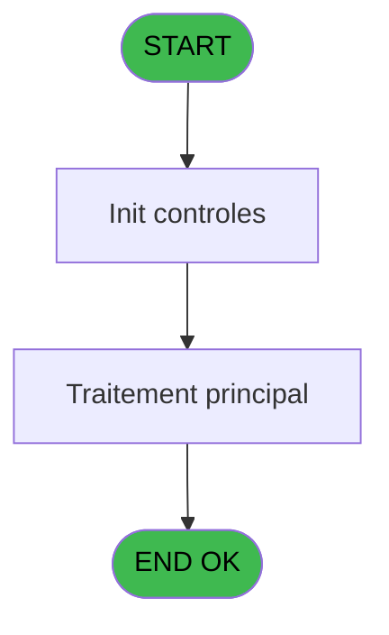

# REF IDE 531 - Calcul age

> **Analyse**: Phases 1-4 2026-02-03 12:33 -> 12:33 (16s) | Assemblage 12:33
> **Pipeline**: V7.2 Enrichi
> **Structure**: 4 onglets (Resume | Ecrans | Donnees | Connexions)

<!-- TAB:Resume -->

## 1. FICHE D'IDENTITE

| Attribut | Valeur |
|----------|--------|
| Projet | REF |
| IDE Position | 531 |
| Nom Programme | Calcul age |
| Fichier source | `Prg_531.xml` |
| Dossier IDE | General |
| Taches | 1 (0 ecrans visibles) |
| Tables modifiees | 0 |
| Programmes appeles | 0 |
| :warning: Statut | **ORPHELIN_POTENTIEL** |

## 2. DESCRIPTION FONCTIONNELLE

**Calcul age** assure la gestion complete de ce processus.

Le flux de traitement s'organise en **1 blocs fonctionnels** :

- **Calcul** (1 tache) : calculs de montants, stocks ou compteurs

**Logique metier** : 1 regles identifiees couvrant conditions metier.

## 3. BLOCS FONCTIONNELS

### 3.1 Calcul (1 tache)

Calculs metier : montants, stocks, compteurs.

---

#### 531 - Calcul age

**Role** : Calcul : Calcul age.

## 5. REGLES METIER

1 regles identifiees:

### Autres (1 regles)

#### [RM-001] Si Month (P.Date Selection [B])<=Month (P.Date Naissance [A]) alors Month (P.Date Selection [B])+12-Month (P.Date Naissance [A]) sinon Month (P.Date Selection [B])-Month (P.Date Naissance [A]))

| Element | Detail |
|---------|--------|
| **Condition** | `Month (P.Date Selection [B])<=Month (P.Date Naissance [A])` |
| **Si vrai** | Month (P.Date Selection [B])+12-Month (P.Date Naissance [A]) |
| **Si faux** | Month (P.Date Selection [B])-Month (P.Date Naissance [A])) |
| **Variables** | A (P.Date Naissance), B (P.Date Selection) |
| **Expression source** | Expression 7 : `IF (Month (P.Date Selection [B])<=Month (P.Date Naissance [A` |
| **Exemple** | Si Month (P.Date Selection [B])<=Month (P.Date Naissance [A]) → Month (P.Date Selection [B])+12-Month (P.Date Naissance [A]). Sinon → Month (P.Date Selection [B])-Month (P.Date Naissance [A])) |

## 6. CONTEXTE

- **Appele par**: (aucun)
- **Appelle**: 0 programmes | **Tables**: 0 (W:0 R:0 L:0) | **Taches**: 1 | **Expressions**: 7

<!-- TAB:Ecrans -->

## 8. ECRANS

*(Programme sans ecran visible)*

## 9. NAVIGATION

### 9.3 Structure hierarchique (1 tache)

| Position | Tache | Type | Dimensions | Bloc |
|----------|-------|------|------------|------|
| **531.1** | [**Calcul age** (531)](#t1) | - | - | Calcul |

### 9.4 Algorigramme

> **Legende**: Vert = START/END OK | Rouge = END KO | Bleu = Decisions
> *Algorigramme auto-genere. Utiliser `/algorigramme` pour une synthese metier detaillee.*

<!-- TAB:Donnees -->

## 10. TABLES

### Tables utilisees (0)

| ID | Nom | Description | Type | R | W | L | Usages |
|----|-----|-------------|------|---|---|---|--------|

### Colonnes par table (0 / 0 tables avec colonnes identifiees)

## 11. VARIABLES

### 11.1 Parametres entrants (3)

Variables recues en parametre.

| Lettre | Nom | Type | Usage dans |
|--------|-----|------|-----------|
| A | P.Date Naissance | Date | 4x parametre entrant |
| B | P.Date Selection | Date | 2x parametre entrant |
| C | P.Age_Nb_Mois_Calc | Numeric | 2x parametre entrant |

## 12. EXPRESSIONS

**7 / 7 expressions decodees (100%)**

### 12.1 Repartition par type

| Type | Expressions | Regles |
|------|-------------|--------|
| CONDITION | 5 | 5 |
| CONSTANTE | 1 | 0 |
| OTHER | 1 | 0 |

### 12.2 Expressions cles par type

#### CONDITION (5 expressions)

| Type | IDE | Expression | Regle |
|------|-----|------------|-------|
| CONDITION | 7 | `IF (Month (P.Date Selection [B])<=Month (P.Date Naissance [A]),Month (P.Date Selection [B])+12-Month (P.Date Naissance [A]),Month (P.Date Selection [B])-Month (P.Date Naissance [A]))` | [RM-001](#rm-RM-001) |
| CONDITION | 6 | `P.Age_Nb_Mois_Calc [C]=0` | - |
| CONDITION | 4 | `Year(P.Date Selection [B])-Year(P.Date Naissance [A])-IF(Month(P.Date Selection [B])>Month(P.Date Naissance [A]),1,0)` | - |
| CONDITION | 2 | `P.Date Naissance [A]='00/00/0000'DATE` | - |
| CONDITION | 3 | `P.Date Naissance [A]<>'00/00/0000'DATE` | - |

#### CONSTANTE (1 expressions)

| Type | IDE | Expression | Regle |
|------|-----|------------|-------|
| CONSTANTE | 1 | `40` | - |

#### OTHER (1 expressions)

| Type | IDE | Expression | Regle |
|------|-----|------------|-------|
| OTHER | 5 | `P.Age_Nb_Mois_Calc [C]` | - |

<!-- TAB:Connexions -->

## 13. GRAPHE D'APPELS

### 13.1 Chaine depuis Main (Callers)

**Chemin**: (pas de callers directs)

### 13.2 Callers

| IDE | Nom Programme | Nb Appels |
|-----|---------------|-----------|
| - | (aucun) | - |

### 13.3 Callees (programmes appeles)

### 13.4 Detail Callees avec contexte

| IDE | Nom Programme | Appels | Contexte |
|-----|---------------|--------|----------|
| - | (aucun) | - | - |

## 14. RECOMMANDATIONS MIGRATION

### 14.1 Profil du programme

| Metrique | Valeur | Impact migration |
|----------|--------|-----------------|
| Lignes de logique | 9 | Programme compact |
| Expressions | 7 | Peu de logique |
| Tables WRITE | 0 | Impact faible |
| Sous-programmes | 0 | Peu de dependances |
| Ecrans visibles | 0 | Ecran unique ou traitement batch |
| Code desactive | 0% (0 / 9) | Code sain |
| Regles metier | 1 | Quelques regles a preserver |

### 14.2 Plan de migration par bloc

#### Calcul (1 tache: 0 ecran, 1 traitement)

- **Strategie** : Services de calcul purs (Domain Services).
- Migrer la logique de calcul (stock, compteurs, montants)

### 14.3 Dependances critiques

| Dependance | Type | Appels | Impact |
|------------|------|--------|--------|

---
*Spec DETAILED generee par Pipeline V7.2 - 2026-02-03 12:33*
