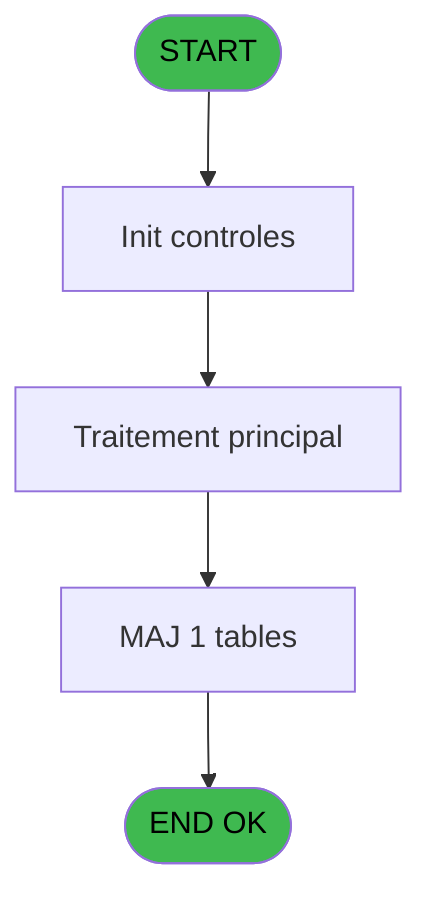

# REF IDE 556 - Browse - easy_check_in

> **Analyse**: Phases 1-4 2026-02-03 12:44 -> 12:44 (17s) | Assemblage 12:45
> **Pipeline**: V7.2 Enrichi
> **Structure**: 4 onglets (Resume | Ecrans | Donnees | Connexions)

<!-- TAB:Resume -->

## 1. FICHE D'IDENTITE

| Attribut | Valeur |
|----------|--------|
| Projet | REF |
| IDE Position | 556 |
| Nom Programme | Browse - easy_check_in |
| Fichier source | `Prg_556.xml` |
| Dossier IDE | General |
| Taches | 1 (1 ecrans visibles) |
| Tables modifiees | 1 |
| Programmes appeles | 0 |
| :warning: Statut | **ORPHELIN_POTENTIEL** |

## 2. DESCRIPTION FONCTIONNELLE

**Browse - easy_check_in** assure la gestion complete de ce processus.

Le flux de traitement s'organise en **1 blocs fonctionnels** :

- **Traitement** (1 tache) : traitements metier divers

**Donnees modifiees** : 1 tables en ecriture (easy_check_in).

## 3. BLOCS FONCTIONNELS

### 3.1 Traitement (1 tache)

Traitements internes.

---

#### 556 - Browse - easy_check_in [[ECRAN]](#ecran-t1)

**Role** : Traitement : Browse - easy_check_in.
**Ecran** : 6694 x 480 DLU | [Voir mockup](#ecran-t1)

## 5. REGLES METIER

*(Aucune regle metier identifiee)*

## 6. CONTEXTE

- **Appele par**: (aucun)
- **Appelle**: 0 programmes | **Tables**: 1 (W:1 R:0 L:0) | **Taches**: 1 | **Expressions**: 0

<!-- TAB:Ecrans -->

## 8. ECRANS

### 8.1 Forms visibles (1 / 1)

| # | Position | Tache | Nom | Type | Largeur | Hauteur | Bloc |
|---|----------|-------|-----|------|---------|---------|------|
| 1 | 556 | 556 | Browse - easy_check_in | Type0 | 6694 | 480 | Traitement |

### 8.2 Mockups Ecrans

---

#### 556 - Browse - easy_check_in
**Tache** : [556](#t1) | **Type** : Type0 | **Dimensions** : 6694 x 480 DLU
**Bloc** : Traitement | **Titre IDE** : Browse - easy_check_in

<!-- FORM-DATA:
{
    "width":  6694,
    "vFactor":  8,
    "type":  "Type0",
    "hFactor":  4,
    "controls":  [
                     {
                         "x":  8,
                         "type":  "table",
                         "var":  "",
                         "name":  "",
                         "titleH":  12,
                         "color":  "",
                         "w":  6672,
                         "y":  8,
                         "fmt":  "",
                         "parent":  null,
                         "text":  "",
                         "rowH":  13,
                         "h":  400,
                         "cols":  [
                                      {
                                          "title":  "eci_code_societe",
                                          "layer":  1,
                                          "w":  70
                                      },
                                      {
                                          "title":  "eci_compte",
                                          "layer":  2,
                                          "w":  49
                                      },
                                      {
                                          "title":  "eci_filiation",
                                          "layer":  3,
                                          "w":  45
                                      },
                                      {
                                          "title":  "eci_code_prestation",
                                          "layer":  4,
                                          "w":  80
                                      },
                                      {
                                          "title":  "eci_categorie_prestation",
                                          "layer":  5,
                                          "w":  96
                                      },
                                      {
                                          "title":  "eci_num_questionnaire",
                                          "layer":  6,
                                          "w":  90
                                      },
                                      {
                                          "title":  "eci_num_categorie",
                                          "layer":  7,
                                          "w":  75
                                      },
                                      {
                                          "title":  "eci_type_questionnaire",
                                          "layer":  8,
                                          "w":  90
                                      },
                                      {
                                          "title":  "eci_taille",
                                          "layer":  9,
                                          "w":  36
                                      },
                                      {
                                          "title":  "eci_poids",
                                          "layer":  10,
                                          "w":  44
                                      },
                                      {
                                          "title":  "eci_pointure_ski",
                                          "layer":  11,
                                          "w":  178
                                      },
                                      {
                                          "title":  "eci_pointure_chaussure",
                                          "layer":  12,
                                          "w":  178
                                      },
                                      {
                                          "title":  "eci_niveau_pratique",
                                          "layer":  13,
                                          "w":  80
                                      },
                                      {
                                          "title":  "eci_type_pratique",
                                          "layer":  14,
                                          "w":  70
                                      },
                                      {
                                          "title":  "eci_type_glisse",
                                          "layer":  15,
                                          "w":  61
                                      },
                                      {
                                          "title":  "eci_casque",
                                          "layer":  16,
                                          "w":  178
                                      },
                                      {
                                          "title":  "eci_reglage",
                                          "layer":  17,
                                          "w":  47
                                      },
                                      {
                                          "title":  "eci_num_questionnaire_cours",
                                          "layer":  18,
                                          "w":  116
                                      },
                                      {
                                          "title":  "eci_num_categorie_cours",
                                          "layer":  19,
                                          "w":  101
                                      },
                                      {
                                          "title":  "eci_type_cours",
                                          "layer":  20,
                                          "w":  61
                                      },
                                      {
                                          "title":  "eci_niv_cours",
                                          "layer":  21,
                                          "w":  56
                                      },
                                      {
                                          "title":  "eci_langue_parlee",
                                          "layer":  22,
                                          "w":  178
                                      },
                                      {
                                          "title":  "eci_nom_contact",
                                          "layer":  23,
                                          "w":  178
                                      },
                                      {
                                          "title":  "eci_num_portable",
                                          "layer":  24,
                                          "w":  178
                                      },
                                      {
                                          "title":  "eci_prenom_contact",
                                          "layer":  25,
                                          "w":  178
                                      },
                                      {
                                          "title":  "eci_couches",
                                          "layer":  26,
                                          "w":  52
                                      },
                                      {
                                          "title":  "eci_maquillage",
                                          "layer":  27,
                                          "w":  59
                                      },
                                      {
                                          "title":  "eci_doudou",
                                          "layer":  28,
                                          "w":  178
                                      },
                                      {
                                          "title":  "eci_nager",
                                          "layer":  29,
                                          "w":  41
                                      },
                                      {
                                          "title":  "eci_position_dormir",
                                          "layer":  30,
                                          "w":  75
                                      },
                                      {
                                          "title":  "eci_allergies",
                                          "layer":  31,
                                          "w":  178
                                      },
                                      {
                                          "title":  "eci_nom_autorise",
                                          "layer":  32,
                                          "w":  178
                                      },
                                      {
                                          "title":  "eci_prenom_autorise",
                                          "layer":  33,
                                          "w":  178
                                      },
                                      {
                                          "title":  "eci_portable_autorise",
                                          "layer":  34,
                                          "w":  178
                                      },
                                      {
                                          "title":  "eci_paracetamol",
                                          "layer":  35,
                                          "w":  66
                                      },
                                      {
                                          "title":  "eci_date_maj",
                                          "layer":  36,
                                          "w":  68
                                      },
                                      {
                                          "title":  "eci_heure_maj",
                                          "layer":  37,
                                          "w":  58
                                      },
                                      {
                                          "title":  "eci_user_maj",
                                          "layer":  38,
                                          "w":  55
                                      },
                                      {
                                          "title":  "eci_nom_autorise2",
                                          "layer":  39,
                                          "w":  178
                                      },
                                      {
                                          "title":  "eci_prenom_autorise2",
                                          "layer":  40,
                                          "w":  178
                                      },
                                      {
                                          "title":  "eci_portable_autorise2",
                                          "layer":  41,
                                          "w":  178
                                      },
                                      {
                                          "title":  "eci_nom_autorise3",
                                          "layer":  42,
                                          "w":  178
                                      },
                                      {
                                          "title":  "eci_prenom_autorise3",
                                          "layer":  43,
                                          "w":  178
                                      },
                                      {
                                          "title":  "eci_portable_autorise3",
                                          "layer":  44,
                                          "w":  178
                                      },
                                      {
                                          "title":  "eci_nom_contact2",
                                          "layer":  45,
                                          "w":  178
                                      },
                                      {
                                          "title":  "eci_prenom_contact2",
                                          "layer":  46,
                                          "w":  178
                                      },
                                      {
                                          "title":  "eci_num_portable2",
                                          "layer":  47,
                                          "w":  178
                                      },
                                      {
                                          "title":  "eci_nom_contact3",
                                          "layer":  48,
                                          "w":  178
                                      },
                                      {
                                          "title":  "eci_prenom_contact3",
                                          "layer":  49,
                                          "w":  178
                                      },
                                      {
                                          "title":  "eci_num_portable3",
                                          "layer":  50,
                                          "w":  178
                                      },
                                      {
                                          "title":  "eci_autonomie_8_ans",
                                          "layer":  51,
                                          "w":  86
                                      },
                                      {
                                          "title":  "eci_niveau_pratique_snow",
                                          "layer":  52,
                                          "w":  105
                                      },
                                      {
                                          "title":  "eci_type_pratique_snow",
                                          "layer":  53,
                                          "w":  95
                                      },
                                      {
                                          "title":  "eci_tel_skieur",
                                          "layer":  54,
                                          "w":  178
                                      }
                                  ],
                         "rows":  54
                     },
                     {
                         "x":  12,
                         "type":  "edit",
                         "var":  "",
                         "y":  23,
                         "w":  9,
                         "fmt":  "",
                         "name":  "eci_code_societe",
                         "h":  10,
                         "color":  "110",
                         "text":  "",
                         "parent":  1
                     },
                     {
                         "x":  82,
                         "type":  "edit",
                         "var":  "",
                         "y":  23,
                         "w":  42,
                         "fmt":  "",
                         "name":  "eci_compte",
                         "h":  10,
                         "color":  "110",
                         "text":  "",
                         "parent":  1
                     },
                     {
                         "x":  131,
                         "type":  "edit",
                         "var":  "",
                         "y":  23,
                         "w":  13,
                         "fmt":  "",
                         "name":  "eci_filiation",
                         "h":  10,
                         "color":  "110",
                         "text":  "",
                         "parent":  1
                     },
                     {
                         "x":  176,
                         "type":  "edit",
                         "var":  "",
                         "y":  23,
                         "w":  37,
                         "fmt":  "",
                         "name":  "eci_code_prestation",
                         "h":  10,
                         "color":  "110",
                         "text":  "",
                         "parent":  1
                     },
                     {
                         "x":  256,
                         "type":  "edit",
                         "var":  "",
                         "y":  23,
                         "w":  9,
                         "fmt":  "",
                         "name":  "eci_categorie_prestation",
                         "h":  10,
                         "color":  "110",
                         "text":  "",
                         "parent":  1
                     },
                     {
                         "x":  352,
                         "type":  "edit",
                         "var":  "",
                         "y":  23,
                         "w":  46,
                         "fmt":  "",
                         "name":  "eci_num_questionnaire",
                         "h":  10,
                         "color":  "110",
                         "text":  "",
                         "parent":  1
                     },
                     {
                         "x":  442,
                         "type":  "edit",
                         "var":  "",
                         "y":  23,
                         "w":  46,
                         "fmt":  "",
                         "name":  "eci_num_categorie",
                         "h":  10,
                         "color":  "110",
                         "text":  "",
                         "parent":  1
                     },
                     {
                         "x":  517,
                         "type":  "edit",
                         "var":  "",
                         "y":  23,
                         "w":  26,
                         "fmt":  "",
                         "name":  "eci_type_questionnaire",
                         "h":  10,
                         "color":  "110",
                         "text":  "",
                         "parent":  1
                     },
                     {
                         "x":  607,
                         "type":  "edit",
                         "var":  "",
                         "y":  23,
                         "w":  18,
                         "fmt":  "",
                         "name":  "eci_taille",
                         "h":  10,
                         "color":  "110",
                         "text":  "",
                         "parent":  1
                     },
                     {
                         "x":  643,
                         "type":  "edit",
                         "var":  "",
                         "y":  23,
                         "w":  37,
                         "fmt":  "",
                         "name":  "eci_poids",
                         "h":  10,
                         "color":  "110",
                         "text":  "",
                         "parent":  1
                     },
                     {
                         "x":  687,
                         "type":  "edit",
                         "var":  "",
                         "y":  23,
                         "w":  171,
                         "fmt":  "",
                         "name":  "eci_pointure_ski",
                         "h":  10,
                         "color":  "110",
                         "text":  "",
                         "parent":  1
                     },
                     {
                         "x":  865,
                         "type":  "edit",
                         "var":  "",
                         "y":  23,
                         "w":  171,
                         "fmt":  "",
                         "name":  "eci_pointure_chaussure",
                         "h":  10,
                         "color":  "110",
                         "text":  "",
                         "parent":  1
                     },
                     {
                         "x":  1043,
                         "type":  "edit",
                         "var":  "",
                         "y":  23,
                         "w":  14,
                         "fmt":  "",
                         "name":  "eci_niveau_pratique",
                         "h":  10,
                         "color":  "110",
                         "text":  "",
                         "parent":  1
                     },
                     {
                         "x":  1123,
                         "type":  "edit",
                         "var":  "",
                         "y":  23,
                         "w":  14,
                         "fmt":  "",
                         "name":  "eci_type_pratique",
                         "h":  10,
                         "color":  "110",
                         "text":  "",
                         "parent":  1
                     },
                     {
                         "x":  1193,
                         "type":  "edit",
                         "var":  "",
                         "y":  23,
                         "w":  14,
                         "fmt":  "",
                         "name":  "eci_type_glisse",
                         "h":  10,
                         "color":  "110",
                         "text":  "",
                         "parent":  1
                     },
                     {
                         "x":  1254,
                         "type":  "edit",
                         "var":  "",
                         "y":  23,
                         "w":  171,
                         "fmt":  "",
                         "name":  "eci_casque",
                         "h":  10,
                         "color":  "110",
                         "text":  "",
                         "parent":  1
                     },
                     {
                         "x":  1432,
                         "type":  "edit",
                         "var":  "",
                         "y":  23,
                         "w":  14,
                         "fmt":  "",
                         "name":  "eci_reglage",
                         "h":  10,
                         "color":  "110",
                         "text":  "",
                         "parent":  1
                     },
                     {
                         "x":  1479,
                         "type":  "edit",
                         "var":  "",
                         "y":  23,
                         "w":  46,
                         "fmt":  "",
                         "name":  "eci_num_questionnaire_cours",
                         "h":  10,
                         "color":  "110",
                         "text":  "",
                         "parent":  1
                     },
                     {
                         "x":  1595,
                         "type":  "edit",
                         "var":  "",
                         "y":  23,
                         "w":  46,
                         "fmt":  "",
                         "name":  "eci_num_categorie_cours",
                         "h":  10,
                         "color":  "110",
                         "text":  "",
                         "parent":  1
                     },
                     {
                         "x":  1696,
                         "type":  "edit",
                         "var":  "",
                         "y":  23,
                         "w":  14,
                         "fmt":  "",
                         "name":  "eci_type_cours",
                         "h":  10,
                         "color":  "110",
                         "text":  "",
                         "parent":  1
                     },
                     {
                         "x":  1757,
                         "type":  "edit",
                         "var":  "",
                         "y":  23,
                         "w":  14,
                         "fmt":  "",
                         "name":  "eci_niv_cours",
                         "h":  10,
                         "color":  "110",
                         "text":  "",
                         "parent":  1
                     },
                     {
                         "x":  1813,
                         "type":  "edit",
                         "var":  "",
                         "y":  23,
                         "w":  171,
                         "fmt":  "",
                         "name":  "eci_langue_parlee",
                         "h":  10,
                         "color":  "110",
                         "text":  "",
                         "parent":  1
                     },
                     {
                         "x":  1991,
                         "type":  "edit",
                         "var":  "",
                         "y":  23,
                         "w":  171,
                         "fmt":  "",
                         "name":  "eci_nom_contact",
                         "h":  10,
                         "color":  "110",
                         "text":  "",
                         "parent":  1
                     },
                     {
                         "x":  2169,
                         "type":  "edit",
                         "var":  "",
                         "y":  23,
                         "w":  171,
                         "fmt":  "",
                         "name":  "eci_num_portable",
                         "h":  10,
                         "color":  "110",
                         "text":  "",
                         "parent":  1
                     },
                     {
                         "x":  2347,
                         "type":  "edit",
                         "var":  "",
                         "y":  23,
                         "w":  171,
                         "fmt":  "",
                         "name":  "eci_prenom_contact",
                         "h":  10,
                         "color":  "110",
                         "text":  "",
                         "parent":  1
                     },
                     {
                         "x":  2525,
                         "type":  "edit",
                         "var":  "",
                         "y":  23,
                         "w":  14,
                         "fmt":  "",
                         "name":  "eci_couches",
                         "h":  10,
                         "color":  "110",
                         "text":  "",
                         "parent":  1
                     },
                     {
                         "x":  2577,
                         "type":  "edit",
                         "var":  "",
                         "y":  23,
                         "w":  14,
                         "fmt":  "",
                         "name":  "eci_maquillage",
                         "h":  10,
                         "color":  "110",
                         "text":  "",
                         "parent":  1
                     },
                     {
                         "x":  2636,
                         "type":  "edit",
                         "var":  "",
                         "y":  23,
                         "w":  171,
                         "fmt":  "",
                         "name":  "eci_doudou",
                         "h":  10,
                         "color":  "110",
                         "text":  "",
                         "parent":  1
                     },
                     {
                         "x":  2814,
                         "type":  "edit",
                         "var":  "",
                         "y":  23,
                         "w":  14,
                         "fmt":  "",
                         "name":  "eci_nager",
                         "h":  10,
                         "color":  "110",
                         "text":  "",
                         "parent":  1
                     },
                     {
                         "x":  2855,
                         "type":  "edit",
                         "var":  "",
                         "y":  23,
                         "w":  14,
                         "fmt":  "",
                         "name":  "eci_position_dormir",
                         "h":  10,
                         "color":  "110",
                         "text":  "",
                         "parent":  1
                     },
                     {
                         "x":  2930,
                         "type":  "edit",
                         "var":  "",
                         "y":  23,
                         "w":  171,
                         "fmt":  "",
                         "name":  "eci_allergies",
                         "h":  10,
                         "color":  "110",
                         "text":  "",
                         "parent":  1
                     },
                     {
                         "x":  3108,
                         "type":  "edit",
                         "var":  "",
                         "y":  23,
                         "w":  171,
                         "fmt":  "",
                         "name":  "eci_nom_autorise",
                         "h":  10,
                         "color":  "110",
                         "text":  "",
                         "parent":  1
                     },
                     {
                         "x":  3286,
                         "type":  "edit",
                         "var":  "",
                         "y":  23,
                         "w":  171,
                         "fmt":  "",
                         "name":  "eci_prenom_autorise",
                         "h":  10,
                         "color":  "110",
                         "text":  "",
                         "parent":  1
                     },
                     {
                         "x":  3464,
                         "type":  "edit",
                         "var":  "",
                         "y":  23,
                         "w":  171,
                         "fmt":  "",
                         "name":  "eci_portable_autorise",
                         "h":  10,
                         "color":  "110",
                         "text":  "",
                         "parent":  1
                     },
                     {
                         "x":  3642,
                         "type":  "edit",
                         "var":  "",
                         "y":  23,
                         "w":  14,
                         "fmt":  "",
                         "name":  "eci_paracetamol",
                         "h":  10,
                         "color":  "110",
                         "text":  "",
                         "parent":  1
                     },
                     {
                         "x":  3708,
                         "type":  "edit",
                         "var":  "",
                         "y":  23,
                         "w":  61,
                         "fmt":  "",
                         "name":  "eci_date_maj",
                         "h":  10,
                         "color":  "110",
                         "text":  "",
                         "parent":  1
                     },
                     {
                         "x":  3776,
                         "type":  "edit",
                         "var":  "",
                         "y":  23,
                         "w":  46,
                         "fmt":  "",
                         "name":  "eci_heure_maj",
                         "h":  10,
                         "color":  "110",
                         "text":  "",
                         "parent":  1
                     },
                     {
                         "x":  3834,
                         "type":  "edit",
                         "var":  "",
                         "y":  23,
                         "w":  48,
                         "fmt":  "",
                         "name":  "eci_user_maj",
                         "h":  10,
                         "color":  "110",
                         "text":  "",
                         "parent":  1
                     },
                     {
                         "x":  3889,
                         "type":  "edit",
                         "var":  "",
                         "y":  23,
                         "w":  171,
                         "fmt":  "",
                         "name":  "eci_nom_autorise2",
                         "h":  10,
                         "color":  "110",
                         "text":  "",
                         "parent":  1
                     },
                     {
                         "x":  4067,
                         "type":  "edit",
                         "var":  "",
                         "y":  23,
                         "w":  171,
                         "fmt":  "",
                         "name":  "eci_prenom_autorise2",
                         "h":  10,
                         "color":  "110",
                         "text":  "",
                         "parent":  1
                     },
                     {
                         "x":  4245,
                         "type":  "edit",
                         "var":  "",
                         "y":  23,
                         "w":  171,
                         "fmt":  "",
                         "name":  "eci_portable_autorise2",
                         "h":  10,
                         "color":  "110",
                         "text":  "",
                         "parent":  1
                     },
                     {
                         "x":  4423,
                         "type":  "edit",
                         "var":  "",
                         "y":  23,
                         "w":  171,
                         "fmt":  "",
                         "name":  "eci_nom_autorise3",
                         "h":  10,
                         "color":  "110",
                         "text":  "",
                         "parent":  1
                     },
                     {
                         "x":  4601,
                         "type":  "edit",
                         "var":  "",
                         "y":  23,
                         "w":  171,
                         "fmt":  "",
                         "name":  "eci_prenom_autorise3",
                         "h":  10,
                         "color":  "110",
                         "text":  "",
                         "parent":  1
                     },
                     {
                         "x":  4779,
                         "type":  "edit",
                         "var":  "",
                         "y":  23,
                         "w":  171,
                         "fmt":  "",
                         "name":  "eci_portable_autorise3",
                         "h":  10,
                         "color":  "110",
                         "text":  "",
                         "parent":  1
                     },
                     {
                         "x":  4957,
                         "type":  "edit",
                         "var":  "",
                         "y":  23,
                         "w":  171,
                         "fmt":  "",
                         "name":  "eci_nom_contact2",
                         "h":  10,
                         "color":  "110",
                         "text":  "",
                         "parent":  1
                     },
                     {
                         "x":  5135,
                         "type":  "edit",
                         "var":  "",
                         "y":  23,
                         "w":  171,
                         "fmt":  "",
                         "name":  "eci_prenom_contact2",
                         "h":  10,
                         "color":  "110",
                         "text":  "",
                         "parent":  1
                     },
                     {
                         "x":  5313,
                         "type":  "edit",
                         "var":  "",
                         "y":  23,
                         "w":  171,
                         "fmt":  "",
                         "name":  "eci_num_portable2",
                         "h":  10,
                         "color":  "110",
                         "text":  "",
                         "parent":  1
                     },
                     {
                         "x":  5491,
                         "type":  "edit",
                         "var":  "",
                         "y":  23,
                         "w":  171,
                         "fmt":  "",
                         "name":  "eci_nom_contact3",
                         "h":  10,
                         "color":  "110",
                         "text":  "",
                         "parent":  1
                     },
                     {
                         "x":  5669,
                         "type":  "edit",
                         "var":  "",
                         "y":  23,
                         "w":  171,
                         "fmt":  "",
                         "name":  "eci_prenom_contact3",
                         "h":  10,
                         "color":  "110",
                         "text":  "",
                         "parent":  1
                     },
                     {
                         "x":  5847,
                         "type":  "edit",
                         "var":  "",
                         "y":  23,
                         "w":  171,
                         "fmt":  "",
                         "name":  "eci_num_portable3",
                         "h":  10,
                         "color":  "110",
                         "text":  "",
                         "parent":  1
                     },
                     {
                         "x":  6025,
                         "type":  "edit",
                         "var":  "",
                         "y":  23,
                         "w":  14,
                         "fmt":  "",
                         "name":  "eci_autonomie_8_ans",
                         "h":  10,
                         "color":  "110",
                         "text":  "",
                         "parent":  1
                     },
                     {
                         "x":  6111,
                         "type":  "edit",
                         "var":  "",
                         "y":  23,
                         "w":  14,
                         "fmt":  "",
                         "name":  "eci_niveau_pratique_snow",
                         "h":  10,
                         "color":  "110",
                         "text":  "",
                         "parent":  1
                     },
                     {
                         "x":  6216,
                         "type":  "edit",
                         "var":  "",
                         "y":  23,
                         "w":  14,
                         "fmt":  "",
                         "name":  "eci_type_pratique_snow",
                         "h":  10,
                         "color":  "110",
                         "text":  "",
                         "parent":  1
                     },
                     {
                         "x":  6311,
                         "type":  "edit",
                         "var":  "",
                         "y":  23,
                         "w":  171,
                         "fmt":  "",
                         "name":  "eci_tel_skieur",
                         "h":  10,
                         "color":  "110",
                         "text":  "",
                         "parent":  1
                     }
                 ],
    "taskId":  "556",
    "height":  480
}
-->

<strong>Champs : 54 champs</strong>

| Pos (x,y) | Nom | Variable | Type |
|-----------|-----|----------|------|
| 12,23 | eci_code_societe | - | edit |
| 82,23 | eci_compte | - | edit |
| 131,23 | eci_filiation | - | edit |
| 176,23 | eci_code_prestation | - | edit |
| 256,23 | eci_categorie_prestation | - | edit |
| 352,23 | eci_num_questionnaire | - | edit |
| 442,23 | eci_num_categorie | - | edit |
| 517,23 | eci_type_questionnaire | - | edit |
| 607,23 | eci_taille | - | edit |
| 643,23 | eci_poids | - | edit |
| 687,23 | eci_pointure_ski | - | edit |
| 865,23 | eci_pointure_chaussure | - | edit |
| 1043,23 | eci_niveau_pratique | - | edit |
| 1123,23 | eci_type_pratique | - | edit |
| 1193,23 | eci_type_glisse | - | edit |
| 1254,23 | eci_casque | - | edit |
| 1432,23 | eci_reglage | - | edit |
| 1479,23 | eci_num_questionnaire_cours | - | edit |
| 1595,23 | eci_num_categorie_cours | - | edit |
| 1696,23 | eci_type_cours | - | edit |
| 1757,23 | eci_niv_cours | - | edit |
| 1813,23 | eci_langue_parlee | - | edit |
| 1991,23 | eci_nom_contact | - | edit |
| 2169,23 | eci_num_portable | - | edit |
| 2347,23 | eci_prenom_contact | - | edit |
| 2525,23 | eci_couches | - | edit |
| 2577,23 | eci_maquillage | - | edit |
| 2636,23 | eci_doudou | - | edit |
| 2814,23 | eci_nager | - | edit |
| 2855,23 | eci_position_dormir | - | edit |
| 2930,23 | eci_allergies | - | edit |
| 3108,23 | eci_nom_autorise | - | edit |
| 3286,23 | eci_prenom_autorise | - | edit |
| 3464,23 | eci_portable_autorise | - | edit |
| 3642,23 | eci_paracetamol | - | edit |
| 3708,23 | eci_date_maj | - | edit |
| 3776,23 | eci_heure_maj | - | edit |
| 3834,23 | eci_user_maj | - | edit |
| 3889,23 | eci_nom_autorise2 | - | edit |
| 4067,23 | eci_prenom_autorise2 | - | edit |
| 4245,23 | eci_portable_autorise2 | - | edit |
| 4423,23 | eci_nom_autorise3 | - | edit |
| 4601,23 | eci_prenom_autorise3 | - | edit |
| 4779,23 | eci_portable_autorise3 | - | edit |
| 4957,23 | eci_nom_contact2 | - | edit |
| 5135,23 | eci_prenom_contact2 | - | edit |
| 5313,23 | eci_num_portable2 | - | edit |
| 5491,23 | eci_nom_contact3 | - | edit |
| 5669,23 | eci_prenom_contact3 | - | edit |
| 5847,23 | eci_num_portable3 | - | edit |
| 6025,23 | eci_autonomie_8_ans | - | edit |
| 6111,23 | eci_niveau_pratique_snow | - | edit |
| 6216,23 | eci_type_pratique_snow | - | edit |
| 6311,23 | eci_tel_skieur | - | edit |

## 9. NAVIGATION

Ecran unique: **Browse - easy_check_in**

### 9.3 Structure hierarchique (1 tache)

| Position | Tache | Type | Dimensions | Bloc |
|----------|-------|------|------------|------|
| **556.1** | [**Browse - easy_check_in** (556)](#t1) [mockup](#ecran-t1) | - | 6694x480 | Traitement |

### 9.4 Algorigramme

> **Legende**: Vert = START/END OK | Rouge = END KO | Bleu = Decisions
> *Algorigramme auto-genere. Utiliser `/algorigramme` pour une synthese metier detaillee.*

<!-- TAB:Donnees -->

## 10. TABLES

### Tables utilisees (1)

| ID | Nom | Description | Type | R | W | L | Usages |
|----|-----|-------------|------|---|---|---|--------|
| 771 | easy_check_in |  | DB |   | **W** |   | 1 |

### Colonnes par table (0 / 1 tables avec colonnes identifiees)

Table 771 - easy_check_in (**W**) - 1 usages

*Table utilisee uniquement en Link ou aucune colonne Real identifiee dans le DataView.*

## 11. VARIABLES

*(Programme sans variables locales mappees)*

## 12. EXPRESSIONS

**0 / 0 expressions decodees (0%)**

### 12.1 Repartition par type

| Type | Expressions | Regles |
|------|-------------|--------|

### 12.2 Expressions cles par type

<!-- TAB:Connexions -->

## 13. GRAPHE D'APPELS

### 13.1 Chaine depuis Main (Callers)

**Chemin**: (pas de callers directs)

### 13.2 Callers

| IDE | Nom Programme | Nb Appels |
|-----|---------------|-----------|
| - | (aucun) | - |

### 13.3 Callees (programmes appeles)

### 13.4 Detail Callees avec contexte

| IDE | Nom Programme | Appels | Contexte |
|-----|---------------|--------|----------|
| - | (aucun) | - | - |

## 14. RECOMMANDATIONS MIGRATION

### 14.1 Profil du programme

| Metrique | Valeur | Impact migration |
|----------|--------|-----------------|
| Lignes de logique | 55 | Programme compact |
| Expressions | 0 | Peu de logique |
| Tables WRITE | 1 | Impact faible |
| Sous-programmes | 0 | Peu de dependances |
| Ecrans visibles | 1 | Ecran unique ou traitement batch |
| Code desactive | 0% (0 / 55) | Code sain |
| Regles metier | 0 | Pas de regle identifiee |

### 14.2 Plan de migration par bloc

#### Traitement (1 tache: 1 ecran, 0 traitement)

- **Strategie** : 1 composant(s) UI (Razor/React) avec formulaires et validation.
- Decomposer les taches en services unitaires testables.

### 14.3 Dependances critiques

| Dependance | Type | Appels | Impact |
|------------|------|--------|--------|
| easy_check_in | Table WRITE (Database) | 1x | Schema + repository |

---
*Spec DETAILED generee par Pipeline V7.2 - 2026-02-03 12:45*
