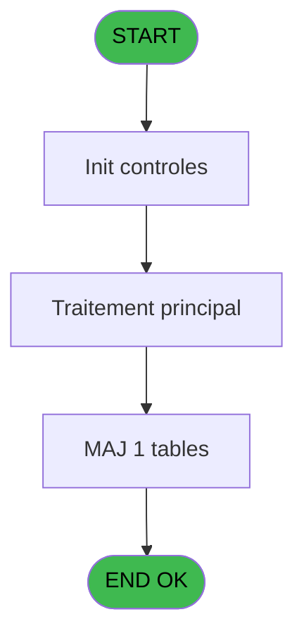

# REF IDE 567 - Browse - vrl_hp

> **Analyse**: Phases 1-4 2026-02-03 12:49 -> 12:49 (17s) | Assemblage 12:49
> **Pipeline**: V7.2 Enrichi
> **Structure**: 4 onglets (Resume | Ecrans | Donnees | Connexions)

<!-- TAB:Resume -->

## 1. FICHE D'IDENTITE

| Attribut | Valeur |
|----------|--------|
| Projet | REF |
| IDE Position | 567 |
| Nom Programme | Browse - vrl_hp |
| Fichier source | `Prg_567.xml` |
| Dossier IDE | Ventes |
| Taches | 1 (1 ecrans visibles) |
| Tables modifiees | 1 |
| Programmes appeles | 0 |
| :warning: Statut | **ORPHELIN_POTENTIEL** |

## 2. DESCRIPTION FONCTIONNELLE

**Browse - vrl_hp** assure la gestion complete de ce processus.

Le flux de traitement s'organise en **1 blocs fonctionnels** :

- **Traitement** (1 tache) : traitements metier divers

**Donnees modifiees** : 1 tables en ecriture (vrl_hp).

## 3. BLOCS FONCTIONNELS

### 3.1 Traitement (1 tache)

Traitements internes.

---

#### 567 - Browse - vrl_hp [[ECRAN]](#ecran-t1)

**Role** : Traitement : Browse - vrl_hp.
**Ecran** : 1527 x 480 DLU | [Voir mockup](#ecran-t1)

## 5. REGLES METIER

*(Aucune regle metier identifiee)*

## 6. CONTEXTE

- **Appele par**: (aucun)
- **Appelle**: 0 programmes | **Tables**: 1 (W:1 R:0 L:0) | **Taches**: 1 | **Expressions**: 0

<!-- TAB:Ecrans -->

## 8. ECRANS

### 8.1 Forms visibles (1 / 1)

| # | Position | Tache | Nom | Type | Largeur | Hauteur | Bloc |
|---|----------|-------|-----|------|---------|---------|------|
| 1 | 567 | 567 | Browse - vrl_hp | Type0 | 1527 | 480 | Traitement |

### 8.2 Mockups Ecrans

---

#### 567 - Browse - vrl_hp
**Tache** : [567](#t1) | **Type** : Type0 | **Dimensions** : 1527 x 480 DLU
**Bloc** : Traitement | **Titre IDE** : Browse - vrl_hp

<!-- FORM-DATA:
{
    "width":  1527,
    "vFactor":  8,
    "type":  "Type0",
    "hFactor":  4,
    "controls":  [
                     {
                         "x":  8,
                         "type":  "table",
                         "var":  "",
                         "name":  "",
                         "titleH":  12,
                         "color":  "",
                         "w":  1665,
                         "y":  8,
                         "fmt":  "",
                         "parent":  null,
                         "text":  "",
                         "rowH":  13,
                         "h":  400,
                         "cols":  [
                                      {
                                          "title":  "vhp_date_conso",
                                          "layer":  1,
                                          "w":  68
                                      },
                                      {
                                          "title":  "vhp_code_repas_nenc_vil",
                                          "layer":  2,
                                          "w":  104
                                      },
                                      {
                                          "title":  "vhp_groupe",
                                          "layer":  3,
                                          "w":  290
                                      },
                                      {
                                          "title":  "vhp_nb_real",
                                          "layer":  4,
                                          "w":  50
                                      },
                                      {
                                          "title":  "vhp_nb_prev",
                                          "layer":  5,
                                          "w":  54
                                      },
                                      {
                                          "title":  "vhp_repas",
                                          "layer":  6,
                                          "w":  43
                                      },
                                      {
                                          "title":  "vhp_motif_annulation",
                                          "layer":  7,
                                          "w":  570
                                      },
                                      {
                                          "title":  "vhp_date_der_modif",
                                          "layer":  8,
                                          "w":  81
                                      },
                                      {
                                          "title":  "vhp_heure_der_modif",
                                          "layer":  9,
                                          "w":  86
                                      },
                                      {
                                          "title":  "vhp_user_der_modif",
                                          "layer":  10,
                                          "w":  80
                                      },
                                      {
                                          "title":  "vhp_lieu_sejour",
                                          "layer":  11,
                                          "w":  62
                                      },
                                      {
                                          "title":  "vhp_date_operation",
                                          "layer":  12,
                                          "w":  79
                                      },
                                      {
                                          "title":  "vhp_nb_repas_regul",
                                          "layer":  13,
                                          "w":  81
                                      }
                                  ],
                         "rows":  13
                     },
                     {
                         "x":  12,
                         "type":  "edit",
                         "var":  "",
                         "y":  23,
                         "w":  61,
                         "fmt":  "",
                         "name":  "vhp_date_conso",
                         "h":  10,
                         "color":  "110",
                         "text":  "",
                         "parent":  1
                     },
                     {
                         "x":  80,
                         "type":  "edit",
                         "var":  "",
                         "y":  23,
                         "w":  37,
                         "fmt":  "",
                         "name":  "vhp_code_repas_nenc_vil",
                         "h":  10,
                         "color":  "110",
                         "text":  "",
                         "parent":  1
                     },
                     {
                         "x":  184,
                         "type":  "edit",
                         "var":  "",
                         "y":  23,
                         "w":  283,
                         "fmt":  "",
                         "name":  "vhp_groupe",
                         "h":  10,
                         "color":  "110",
                         "text":  "",
                         "parent":  1
                     },
                     {
                         "x":  474,
                         "type":  "edit",
                         "var":  "",
                         "y":  23,
                         "w":  32,
                         "fmt":  "",
                         "name":  "vhp_nb_real",
                         "h":  10,
                         "color":  "110",
                         "text":  "",
                         "parent":  1
                     },
                     {
                         "x":  524,
                         "type":  "edit",
                         "var":  "",
                         "y":  23,
                         "w":  32,
                         "fmt":  "",
                         "name":  "vhp_nb_prev",
                         "h":  10,
                         "color":  "110",
                         "text":  "",
                         "parent":  1
                     },
                     {
                         "x":  578,
                         "type":  "edit",
                         "var":  "",
                         "y":  23,
                         "w":  20,
                         "fmt":  "",
                         "name":  "vhp_repas",
                         "h":  10,
                         "color":  "110",
                         "text":  "",
                         "parent":  1
                     },
                     {
                         "x":  621,
                         "type":  "edit",
                         "var":  "",
                         "y":  23,
                         "w":  563,
                         "fmt":  "",
                         "name":  "vhp_motif_annulation",
                         "h":  10,
                         "color":  "110",
                         "text":  "",
                         "parent":  1
                     },
                     {
                         "x":  1191,
                         "type":  "edit",
                         "var":  "",
                         "y":  23,
                         "w":  61,
                         "fmt":  "",
                         "name":  "vhp_date_der_modif",
                         "h":  10,
                         "color":  "110",
                         "text":  "",
                         "parent":  1
                     },
                     {
                         "x":  1272,
                         "type":  "edit",
                         "var":  "",
                         "y":  23,
                         "w":  46,
                         "fmt":  "",
                         "name":  "vhp_heure_der_modif",
                         "h":  10,
                         "color":  "110",
                         "text":  "",
                         "parent":  1
                     },
                     {
                         "x":  1358,
                         "type":  "edit",
                         "var":  "",
                         "y":  23,
                         "w":  48,
                         "fmt":  "",
                         "name":  "vhp_user_der_modif",
                         "h":  10,
                         "color":  "110",
                         "text":  "",
                         "parent":  1
                     },
                     {
                         "x":  1438,
                         "type":  "edit",
                         "var":  "",
                         "y":  23,
                         "w":  9,
                         "fmt":  "",
                         "name":  "vhp_lieu_sejour",
                         "h":  10,
                         "color":  "110",
                         "text":  "",
                         "parent":  1
                     },
                     {
                         "x":  1500,
                         "type":  "edit",
                         "var":  "",
                         "y":  23,
                         "w":  61,
                         "fmt":  "",
                         "name":  "vhp_date_operation",
                         "h":  10,
                         "color":  "110",
                         "text":  "",
                         "parent":  1
                     },
                     {
                         "x":  1579,
                         "type":  "edit",
                         "var":  "",
                         "y":  23,
                         "w":  37,
                         "fmt":  "",
                         "name":  "vhp_nb_repas_regul",
                         "h":  10,
                         "color":  "110",
                         "text":  "",
                         "parent":  1
                     }
                 ],
    "taskId":  "567",
    "height":  480
}
-->

<strong>Champs : 13 champs</strong>

| Pos (x,y) | Nom | Variable | Type |
|-----------|-----|----------|------|
| 12,23 | vhp_date_conso | - | edit |
| 80,23 | vhp_code_repas_nenc_vil | - | edit |
| 184,23 | vhp_groupe | - | edit |
| 474,23 | vhp_nb_real | - | edit |
| 524,23 | vhp_nb_prev | - | edit |
| 578,23 | vhp_repas | - | edit |
| 621,23 | vhp_motif_annulation | - | edit |
| 1191,23 | vhp_date_der_modif | - | edit |
| 1272,23 | vhp_heure_der_modif | - | edit |
| 1358,23 | vhp_user_der_modif | - | edit |
| 1438,23 | vhp_lieu_sejour | - | edit |
| 1500,23 | vhp_date_operation | - | edit |
| 1579,23 | vhp_nb_repas_regul | - | edit |

## 9. NAVIGATION

Ecran unique: **Browse - vrl_hp**

### 9.3 Structure hierarchique (1 tache)

| Position | Tache | Type | Dimensions | Bloc |
|----------|-------|------|------------|------|
| **567.1** | [**Browse - vrl_hp** (567)](#t1) [mockup](#ecran-t1) | - | 1527x480 | Traitement |

### 9.4 Algorigramme

> **Legende**: Vert = START/END OK | Rouge = END KO | Bleu = Decisions
> *Algorigramme auto-genere. Utiliser `/algorigramme` pour une synthese metier detaillee.*

<!-- TAB:Donnees -->

## 10. TABLES

### Tables utilisees (1)

| ID | Nom | Description | Type | R | W | L | Usages |
|----|-----|-------------|------|---|---|---|--------|
| 783 | vrl_hp |  | DB |   | **W** |   | 1 |

### Colonnes par table (0 / 1 tables avec colonnes identifiees)

Table 783 - vrl_hp (**W**) - 1 usages

*Table utilisee uniquement en Link ou aucune colonne Real identifiee dans le DataView.*

## 11. VARIABLES

*(Programme sans variables locales mappees)*

## 12. EXPRESSIONS

**0 / 0 expressions decodees (0%)**

### 12.1 Repartition par type

| Type | Expressions | Regles |
|------|-------------|--------|

### 12.2 Expressions cles par type

<!-- TAB:Connexions -->

## 13. GRAPHE D'APPELS

### 13.1 Chaine depuis Main (Callers)

**Chemin**: (pas de callers directs)

### 13.2 Callers

| IDE | Nom Programme | Nb Appels |
|-----|---------------|-----------|
| - | (aucun) | - |

### 13.3 Callees (programmes appeles)

### 13.4 Detail Callees avec contexte

| IDE | Nom Programme | Appels | Contexte |
|-----|---------------|--------|----------|
| - | (aucun) | - | - |

## 14. RECOMMANDATIONS MIGRATION

### 14.1 Profil du programme

| Metrique | Valeur | Impact migration |
|----------|--------|-----------------|
| Lignes de logique | 14 | Programme compact |
| Expressions | 0 | Peu de logique |
| Tables WRITE | 1 | Impact faible |
| Sous-programmes | 0 | Peu de dependances |
| Ecrans visibles | 1 | Ecran unique ou traitement batch |
| Code desactive | 0% (0 / 14) | Code sain |
| Regles metier | 0 | Pas de regle identifiee |

### 14.2 Plan de migration par bloc

#### Traitement (1 tache: 1 ecran, 0 traitement)

- **Strategie** : 1 composant(s) UI (Razor/React) avec formulaires et validation.
- Decomposer les taches en services unitaires testables.

### 14.3 Dependances critiques

| Dependance | Type | Appels | Impact |
|------------|------|--------|--------|
| vrl_hp | Table WRITE (Database) | 1x | Schema + repository |

---
*Spec DETAILED generee par Pipeline V7.2 - 2026-02-03 12:49*
