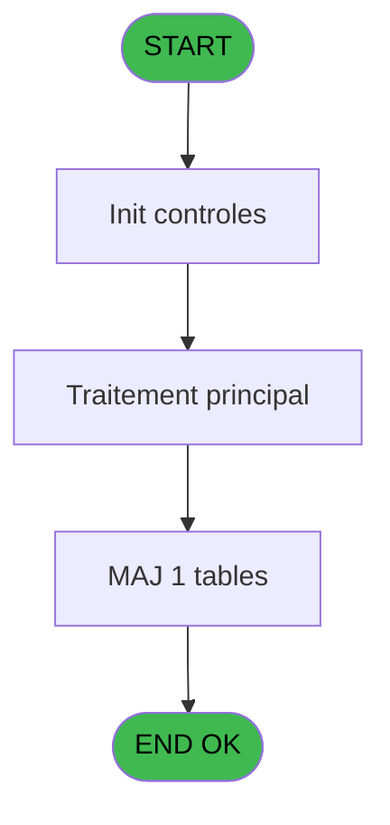
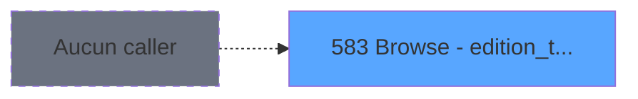

# REF IDE 583 - Browse - edition_tableau_recap

> **Analyse**: Phases 1-4 2026-02-03 12:56 -> 12:56 (17s) | Assemblage 12:56
> **Pipeline**: V7.2 Enrichi
> **Structure**: 4 onglets (Resume | Ecrans | Donnees | Connexions)

<!-- TAB:Resume -->

## 1. FICHE D'IDENTITE

| Attribut | Valeur |
|----------|--------|
| Projet | REF |
| IDE Position | 583 |
| Nom Programme | Browse - edition_tableau_recap |
| Fichier source | `Prg_583.xml` |
| Dossier IDE | Impression |
| Taches | 1 (1 ecrans visibles) |
| Tables modifiees | 1 |
| Programmes appeles | 0 |
| :warning: Statut | **ORPHELIN_POTENTIEL** |

## 2. DESCRIPTION FONCTIONNELLE

**Browse - edition_tableau_recap** assure la gestion complete de ce processus.

Le flux de traitement s'organise en **1 blocs fonctionnels** :

- **Impression** (1 tache) : generation de tickets et documents

**Donnees modifiees** : 1 tables en ecriture (edition_tableau_recap).

## 3. BLOCS FONCTIONNELS

### 3.1 Impression (1 tache)

Generation des documents et tickets.

---

#### 583 - Browse - edition_tableau_recap [[ECRAN]](#ecran-t1)

**Role** : Generation du document : Browse - edition_tableau_recap.
**Ecran** : 2193 x 480 DLU | [Voir mockup](#ecran-t1)

## 5. REGLES METIER

*(Aucune regle metier identifiee)*

## 6. CONTEXTE

- **Appele par**: (aucun)
- **Appelle**: 0 programmes | **Tables**: 1 (W:1 R:0 L:0) | **Taches**: 1 | **Expressions**: 0

<!-- TAB:Ecrans -->

## 8. ECRANS

### 8.1 Forms visibles (1 / 1)

| # | Position | Tache | Nom | Type | Largeur | Hauteur | Bloc |
|---|----------|-------|-----|------|---------|---------|------|
| 1 | 583 | 583 | Browse - edition_tableau_recap | Type0 | 2193 | 480 | Impression |

### 8.2 Mockups Ecrans

---

#### 583 - Browse - edition_tableau_recap
**Tache** : [583](#t1) | **Type** : Type0 | **Dimensions** : 2193 x 480 DLU
**Bloc** : Impression | **Titre IDE** : Browse - edition_tableau_recap

<!-- FORM-DATA:
{
    "width":  2193,
    "vFactor":  8,
    "type":  "Type0",
    "hFactor":  4,
    "controls":  [
                     {
                         "x":  8,
                         "type":  "table",
                         "var":  "",
                         "name":  "",
                         "titleH":  12,
                         "color":  "",
                         "w":  2171,
                         "y":  8,
                         "fmt":  "",
                         "parent":  null,
                         "text":  "",
                         "rowH":  13,
                         "h":  400,
                         "cols":  [
                                      {
                                          "title":  "chrono",
                                          "layer":  1,
                                          "w":  30
                                      },
                                      {
                                          "title":  "operateur",
                                          "layer":  2,
                                          "w":  55
                                      },
                                      {
                                          "title":  "date_comptable",
                                          "layer":  3,
                                          "w":  68
                                      },
                                      {
                                          "title":  "numero_session",
                                          "layer":  4,
                                          "w":  68
                                      },
                                      {
                                          "title":  "type",
                                          "layer":  5,
                                          "w":  19
                                      },
                                      {
                                          "title":  "ordre_edition",
                                          "layer":  6,
                                          "w":  52
                                      },
                                      {
                                          "title":  "type_approversement_coffre",
                                          "layer":  7,
                                          "w":  111
                                      },
                                      {
                                          "title":  "mode_de_paiement",
                                          "layer":  8,
                                          "w":  78
                                      },
                                      {
                                          "title":  "avec_change",
                                          "layer":  9,
                                          "w":  56
                                      },
                                      {
                                          "title":  "code_devise",
                                          "layer":  10,
                                          "w":  52
                                      },
                                      {
                                          "title":  "quantite_devise",
                                          "layer":  11,
                                          "w":  68
                                      },
                                      {
                                          "title":  "taux_devise",
                                          "layer":  12,
                                          "w":  97
                                      },
                                      {
                                          "title":  "montant",
                                          "layer":  13,
                                          "w":  101
                                      },
                                      {
                                          "title":  "montant_monnaie",
                                          "layer":  14,
                                          "w":  101
                                      },
                                      {
                                          "title":  "montant_produits",
                                          "layer":  15,
                                          "w":  101
                                      },
                                      {
                                          "title":  "montant_cartes",
                                          "layer":  16,
                                          "w":  101
                                      },
                                      {
                                          "title":  "montant_cheques",
                                          "layer":  17,
                                          "w":  101
                                      },
                                      {
                                          "title":  "montant_od",
                                          "layer":  18,
                                          "w":  101
                                      },
                                      {
                                          "title":  "societe",
                                          "layer":  19,
                                          "w":  30
                                      },
                                      {
                                          "title":  "compte_village",
                                          "layer":  20,
                                          "w":  60
                                      },
                                      {
                                          "title":  "filiation_village",
                                          "layer":  21,
                                          "w":  58
                                      },
                                      {
                                          "title":  "imputation",
                                          "layer":  22,
                                          "w":  58
                                      },
                                      {
                                          "title":  "sous_imputation",
                                          "layer":  23,
                                          "w":  64
                                      },
                                      {
                                          "title":  "libelle",
                                          "layer":  24,
                                          "w":  94
                                      },
                                      {
                                          "title":  "libelle_complementaire",
                                          "layer":  25,
                                          "w":  94
                                      },
                                      {
                                          "title":  "nom_gm",
                                          "layer":  26,
                                          "w":  178
                                      },
                                      {
                                          "title":  "quantite_article",
                                          "layer":  27,
                                          "w":  61
                                      },
                                      {
                                          "title":  "prix_article",
                                          "layer":  28,
                                          "w":  97
                                      }
                                  ],
                         "rows":  28
                     },
                     {
                         "x":  12,
                         "type":  "edit",
                         "var":  "",
                         "y":  23,
                         "w":  22,
                         "fmt":  "",
                         "name":  "chrono",
                         "h":  10,
                         "color":  "110",
                         "text":  "",
                         "parent":  1
                     },
                     {
                         "x":  42,
                         "type":  "edit",
                         "var":  "",
                         "y":  23,
                         "w":  48,
                         "fmt":  "",
                         "name":  "operateur",
                         "h":  10,
                         "color":  "110",
                         "text":  "",
                         "parent":  1
                     },
                     {
                         "x":  97,
                         "type":  "edit",
                         "var":  "",
                         "y":  23,
                         "w":  61,
                         "fmt":  "",
                         "name":  "date_comptable",
                         "h":  10,
                         "color":  "110",
                         "text":  "",
                         "parent":  1
                     },
                     {
                         "x":  165,
                         "type":  "edit",
                         "var":  "",
                         "y":  23,
                         "w":  61,
                         "fmt":  "",
                         "name":  "numero_session",
                         "h":  10,
                         "color":  "110",
                         "text":  "",
                         "parent":  1
                     },
                     {
                         "x":  233,
                         "type":  "edit",
                         "var":  "",
                         "y":  23,
                         "w":  9,
                         "fmt":  "",
                         "name":  "type",
                         "h":  10,
                         "color":  "110",
                         "text":  "",
                         "parent":  1
                     },
                     {
                         "x":  252,
                         "type":  "edit",
                         "var":  "",
                         "y":  23,
                         "w":  14,
                         "fmt":  "",
                         "name":  "ordre_edition",
                         "h":  10,
                         "color":  "110",
                         "text":  "",
                         "parent":  1
                     },
                     {
                         "x":  304,
                         "type":  "edit",
                         "var":  "",
                         "y":  23,
                         "w":  9,
                         "fmt":  "",
                         "name":  "type_approversement_coffre",
                         "h":  10,
                         "color":  "110",
                         "text":  "",
                         "parent":  1
                     },
                     {
                         "x":  415,
                         "type":  "edit",
                         "var":  "",
                         "y":  23,
                         "w":  26,
                         "fmt":  "",
                         "name":  "mode_de_paiement",
                         "h":  10,
                         "color":  "110",
                         "text":  "",
                         "parent":  1
                     },
                     {
                         "x":  493,
                         "type":  "edit",
                         "var":  "",
                         "y":  23,
                         "w":  9,
                         "fmt":  "",
                         "name":  "avec_change",
                         "h":  10,
                         "color":  "110",
                         "text":  "",
                         "parent":  1
                     },
                     {
                         "x":  549,
                         "type":  "edit",
                         "var":  "",
                         "y":  23,
                         "w":  20,
                         "fmt":  "",
                         "name":  "code_devise",
                         "h":  10,
                         "color":  "110",
                         "text":  "",
                         "parent":  1
                     },
                     {
                         "x":  601,
                         "type":  "edit",
                         "var":  "",
                         "y":  23,
                         "w":  61,
                         "fmt":  "",
                         "name":  "quantite_devise",
                         "h":  10,
                         "color":  "110",
                         "text":  "",
                         "parent":  1
                     },
                     {
                         "x":  669,
                         "type":  "edit",
                         "var":  "",
                         "y":  23,
                         "w":  90,
                         "fmt":  "",
                         "name":  "taux_devise",
                         "h":  10,
                         "color":  "110",
                         "text":  "",
                         "parent":  1
                     },
                     {
                         "x":  766,
                         "type":  "edit",
                         "var":  "",
                         "y":  23,
                         "w":  94,
                         "fmt":  "",
                         "name":  "montant",
                         "h":  10,
                         "color":  "110",
                         "text":  "",
                         "parent":  1
                     },
                     {
                         "x":  867,
                         "type":  "edit",
                         "var":  "",
                         "y":  23,
                         "w":  94,
                         "fmt":  "",
                         "name":  "montant_monnaie",
                         "h":  10,
                         "color":  "110",
                         "text":  "",
                         "parent":  1
                     },
                     {
                         "x":  968,
                         "type":  "edit",
                         "var":  "",
                         "y":  23,
                         "w":  94,
                         "fmt":  "",
                         "name":  "montant_produits",
                         "h":  10,
                         "color":  "110",
                         "text":  "",
                         "parent":  1
                     },
                     {
                         "x":  1069,
                         "type":  "edit",
                         "var":  "",
                         "y":  23,
                         "w":  94,
                         "fmt":  "",
                         "name":  "montant_cartes",
                         "h":  10,
                         "color":  "110",
                         "text":  "",
                         "parent":  1
                     },
                     {
                         "x":  1170,
                         "type":  "edit",
                         "var":  "",
                         "y":  23,
                         "w":  94,
                         "fmt":  "",
                         "name":  "montant_cheques",
                         "h":  10,
                         "color":  "110",
                         "text":  "",
                         "parent":  1
                     },
                     {
                         "x":  1271,
                         "type":  "edit",
                         "var":  "",
                         "y":  23,
                         "w":  94,
                         "fmt":  "",
                         "name":  "montant_od",
                         "h":  10,
                         "color":  "110",
                         "text":  "",
                         "parent":  1
                     },
                     {
                         "x":  1372,
                         "type":  "edit",
                         "var":  "",
                         "y":  23,
                         "w":  9,
                         "fmt":  "",
                         "name":  "societe",
                         "h":  10,
                         "color":  "110",
                         "text":  "",
                         "parent":  1
                     },
                     {
                         "x":  1402,
                         "type":  "edit",
                         "var":  "",
                         "y":  23,
                         "w":  42,
                         "fmt":  "",
                         "name":  "compte_village",
                         "h":  10,
                         "color":  "110",
                         "text":  "",
                         "parent":  1
                     },
                     {
                         "x":  1462,
                         "type":  "edit",
                         "var":  "",
                         "y":  23,
                         "w":  18,
                         "fmt":  "",
                         "name":  "filiation_village",
                         "h":  10,
                         "color":  "110",
                         "text":  "",
                         "parent":  1
                     },
                     {
                         "x":  1520,
                         "type":  "edit",
                         "var":  "",
                         "y":  23,
                         "w":  51,
                         "fmt":  "",
                         "name":  "imputation",
                         "h":  10,
                         "color":  "110",
                         "text":  "",
                         "parent":  1
                     },
                     {
                         "x":  1578,
                         "type":  "edit",
                         "var":  "",
                         "y":  23,
                         "w":  18,
                         "fmt":  "",
                         "name":  "sous_imputation",
                         "h":  10,
                         "color":  "110",
                         "text":  "",
                         "parent":  1
                     },
                     {
                         "x":  1642,
                         "type":  "edit",
                         "var":  "",
                         "y":  23,
                         "w":  87,
                         "fmt":  "",
                         "name":  "libelle",
                         "h":  10,
                         "color":  "110",
                         "text":  "",
                         "parent":  1
                     },
                     {
                         "x":  1736,
                         "type":  "edit",
                         "var":  "",
                         "y":  23,
                         "w":  87,
                         "fmt":  "",
                         "name":  "libelle_complementaire",
                         "h":  10,
                         "color":  "110",
                         "text":  "",
                         "parent":  1
                     },
                     {
                         "x":  1830,
                         "type":  "edit",
                         "var":  "",
                         "y":  23,
                         "w":  171,
                         "fmt":  "",
                         "name":  "nom_gm",
                         "h":  10,
                         "color":  "110",
                         "text":  "",
                         "parent":  1
                     },
                     {
                         "x":  2008,
                         "type":  "edit",
                         "var":  "",
                         "y":  23,
                         "w":  22,
                         "fmt":  "",
                         "name":  "quantite_article",
                         "h":  10,
                         "color":  "110",
                         "text":  "",
                         "parent":  1
                     },
                     {
                         "x":  2069,
                         "type":  "edit",
                         "var":  "",
                         "y":  23,
                         "w":  90,
                         "fmt":  "",
                         "name":  "prix_article",
                         "h":  10,
                         "color":  "110",
                         "text":  "",
                         "parent":  1
                     }
                 ],
    "taskId":  "583",
    "height":  480
}
-->

<strong>Champs : 28 champs</strong>

| Pos (x,y) | Nom | Variable | Type |
|-----------|-----|----------|------|
| 12,23 | chrono | - | edit |
| 42,23 | operateur | - | edit |
| 97,23 | date_comptable | - | edit |
| 165,23 | numero_session | - | edit |
| 233,23 | type | - | edit |
| 252,23 | ordre_edition | - | edit |
| 304,23 | type_approversement_coffre | - | edit |
| 415,23 | mode_de_paiement | - | edit |
| 493,23 | avec_change | - | edit |
| 549,23 | code_devise | - | edit |
| 601,23 | quantite_devise | - | edit |
| 669,23 | taux_devise | - | edit |
| 766,23 | montant | - | edit |
| 867,23 | montant_monnaie | - | edit |
| 968,23 | montant_produits | - | edit |
| 1069,23 | montant_cartes | - | edit |
| 1170,23 | montant_cheques | - | edit |
| 1271,23 | montant_od | - | edit |
| 1372,23 | societe | - | edit |
| 1402,23 | compte_village | - | edit |
| 1462,23 | filiation_village | - | edit |
| 1520,23 | imputation | - | edit |
| 1578,23 | sous_imputation | - | edit |
| 1642,23 | libelle | - | edit |
| 1736,23 | libelle_complementaire | - | edit |
| 1830,23 | nom_gm | - | edit |
| 2008,23 | quantite_article | - | edit |
| 2069,23 | prix_article | - | edit |

## 9. NAVIGATION

Ecran unique: **Browse - edition_tableau_recap**

### 9.3 Structure hierarchique (1 tache)

| Position | Tache | Type | Dimensions | Bloc |
|----------|-------|------|------------|------|
| **583.1** | [**Browse - edition_tableau_recap** (583)](#t1) [mockup](#ecran-t1) | - | 2193x480 | Impression |

### 9.4 Algorigramme

> **Legende**: Vert = START/END OK | Rouge = END KO | Bleu = Decisions
> *Algorigramme auto-genere. Utiliser `/algorigramme` pour une synthese metier detaillee.*

<!-- TAB:Donnees -->

## 10. TABLES

### Tables utilisees (1)

| ID | Nom | Description | Type | R | W | L | Usages |
|----|-----|-------------|------|---|---|---|--------|
| 492 | edition_tableau_recap |  | DB |   | **W** |   | 1 |

### Colonnes par table (0 / 1 tables avec colonnes identifiees)

Table 492 - edition_tableau_recap (**W**) - 1 usages

*Table utilisee uniquement en Link ou aucune colonne Real identifiee dans le DataView.*

## 11. VARIABLES

*(Programme sans variables locales mappees)*

## 12. EXPRESSIONS

**0 / 0 expressions decodees (0%)**

### 12.1 Repartition par type

| Type | Expressions | Regles |
|------|-------------|--------|

### 12.2 Expressions cles par type

<!-- TAB:Connexions -->

## 13. GRAPHE D'APPELS

### 13.1 Chaine depuis Main (Callers)

**Chemin**: (pas de callers directs)

### 13.2 Callers

| IDE | Nom Programme | Nb Appels |
|-----|---------------|-----------|
| - | (aucun) | - |

### 13.3 Callees (programmes appeles)

### 13.4 Detail Callees avec contexte

| IDE | Nom Programme | Appels | Contexte |
|-----|---------------|--------|----------|
| - | (aucun) | - | - |

## 14. RECOMMANDATIONS MIGRATION

### 14.1 Profil du programme

| Metrique | Valeur | Impact migration |
|----------|--------|-----------------|
| Lignes de logique | 29 | Programme compact |
| Expressions | 0 | Peu de logique |
| Tables WRITE | 1 | Impact faible |
| Sous-programmes | 0 | Peu de dependances |
| Ecrans visibles | 1 | Ecran unique ou traitement batch |
| Code desactive | 0% (0 / 29) | Code sain |
| Regles metier | 0 | Pas de regle identifiee |

### 14.2 Plan de migration par bloc

#### Impression (1 tache: 1 ecran, 0 traitement)

- **Strategie** : Templates HTML -> PDF via wkhtmltopdf ou Puppeteer.
- `PrintService` injectable avec choix imprimante

### 14.3 Dependances critiques

| Dependance | Type | Appels | Impact |
|------------|------|--------|--------|
| edition_tableau_recap | Table WRITE (Database) | 1x | Schema + repository |

---
*Spec DETAILED generee par Pipeline V7.2 - 2026-02-03 12:56*
