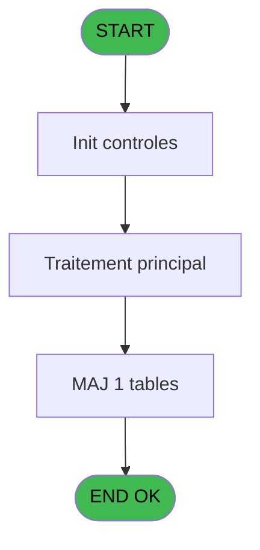

# REF IDE 588 - Browse - wording_mention_legal

> **Analyse**: Phases 1-4 2026-02-03 12:58 -> 12:58 (17s) | Assemblage 12:58
> **Pipeline**: V7.2 Enrichi
> **Structure**: 4 onglets (Resume | Ecrans | Donnees | Connexions)

<!-- TAB:Resume -->

## 1. FICHE D'IDENTITE

| Attribut | Valeur |
|----------|--------|
| Projet | REF |
| IDE Position | 588 |
| Nom Programme | Browse - wording_mention_legal |
| Fichier source | `Prg_588.xml` |
| Dossier IDE | General |
| Taches | 1 (1 ecrans visibles) |
| Tables modifiees | 1 |
| Programmes appeles | 0 |
| :warning: Statut | **ORPHELIN_POTENTIEL** |

## 2. DESCRIPTION FONCTIONNELLE

**Browse - wording_mention_legal** assure la gestion complete de ce processus.

Le flux de traitement s'organise en **1 blocs fonctionnels** :

- **Traitement** (1 tache) : traitements metier divers

**Donnees modifiees** : 1 tables en ecriture (wording_mention_legal).

## 3. BLOCS FONCTIONNELS

### 3.1 Traitement (1 tache)

Traitements internes.

---

#### 588 - Browse - wording_mention_legal [[ECRAN]](#ecran-t1)

**Role** : Traitement : Browse - wording_mention_legal.
**Ecran** : 6543 x 480 DLU | [Voir mockup](#ecran-t1)

## 5. REGLES METIER

*(Aucune regle metier identifiee)*

## 6. CONTEXTE

- **Appele par**: (aucun)
- **Appelle**: 0 programmes | **Tables**: 1 (W:1 R:0 L:0) | **Taches**: 1 | **Expressions**: 0

<!-- TAB:Ecrans -->

## 8. ECRANS

### 8.1 Forms visibles (1 / 1)

| # | Position | Tache | Nom | Type | Largeur | Hauteur | Bloc |
|---|----------|-------|-----|------|---------|---------|------|
| 1 | 588 | 588 | Browse - wording_mention_legal | Type0 | 6543 | 480 | Traitement |

### 8.2 Mockups Ecrans

---

#### 588 - Browse - wording_mention_legal
**Tache** : [588](#t1) | **Type** : Type0 | **Dimensions** : 6543 x 480 DLU
**Bloc** : Traitement | **Titre IDE** : Browse - wording_mention_legal

<!-- FORM-DATA:
{
    "width":  6543,
    "vFactor":  8,
    "type":  "Type0",
    "hFactor":  4,
    "controls":  [
                     {
                         "x":  8,
                         "type":  "table",
                         "var":  "",
                         "name":  "",
                         "titleH":  12,
                         "color":  "",
                         "w":  6521,
                         "y":  8,
                         "fmt":  "",
                         "parent":  null,
                         "text":  "",
                         "rowH":  13,
                         "h":  400,
                         "cols":  [
                                      {
                                          "title":  "societe",
                                          "layer":  1,
                                          "w":  30
                                      },
                                      {
                                          "title":  "nom",
                                          "layer":  2,
                                          "w":  290
                                      },
                                      {
                                          "title":  "adresse",
                                          "layer":  3,
                                          "w":  1130
                                      },
                                      {
                                          "title":  "telephone",
                                          "layer":  4,
                                          "w":  122
                                      },
                                      {
                                          "title":  "fax",
                                          "layer":  5,
                                          "w":  122
                                      },
                                      {
                                          "title":  "adresse_internet",
                                          "layer":  6,
                                          "w":  290
                                      },
                                      {
                                          "title":  "tva_intracomm",
                                          "layer":  7,
                                          "w":  290
                                      },
                                      {
                                          "title":  "libelle_1",
                                          "layer":  8,
                                          "w":  1410
                                      },
                                      {
                                          "title":  "libelle_2",
                                          "layer":  9,
                                          "w":  1410
                                      },
                                      {
                                          "title":  "libelle_3",
                                          "layer":  10,
                                          "w":  1410
                                      }
                                  ],
                         "rows":  10
                     },
                     {
                         "x":  12,
                         "type":  "edit",
                         "var":  "",
                         "y":  23,
                         "w":  9,
                         "fmt":  "",
                         "name":  "societe",
                         "h":  10,
                         "color":  "110",
                         "text":  "",
                         "parent":  1
                     },
                     {
                         "x":  42,
                         "type":  "edit",
                         "var":  "",
                         "y":  23,
                         "w":  283,
                         "fmt":  "",
                         "name":  "nom",
                         "h":  10,
                         "color":  "110",
                         "text":  "",
                         "parent":  1
                     },
                     {
                         "x":  332,
                         "type":  "edit",
                         "var":  "",
                         "y":  23,
                         "w":  1123,
                         "fmt":  "",
                         "name":  "adresse",
                         "h":  10,
                         "color":  "110",
                         "text":  "",
                         "parent":  1
                     },
                     {
                         "x":  1462,
                         "type":  "edit",
                         "var":  "",
                         "y":  23,
                         "w":  115,
                         "fmt":  "",
                         "name":  "telephone",
                         "h":  10,
                         "color":  "110",
                         "text":  "",
                         "parent":  1
                     },
                     {
                         "x":  1584,
                         "type":  "edit",
                         "var":  "",
                         "y":  23,
                         "w":  115,
                         "fmt":  "",
                         "name":  "fax",
                         "h":  10,
                         "color":  "110",
                         "text":  "",
                         "parent":  1
                     },
                     {
                         "x":  1706,
                         "type":  "edit",
                         "var":  "",
                         "y":  23,
                         "w":  283,
                         "fmt":  "",
                         "name":  "adresse_internet",
                         "h":  10,
                         "color":  "110",
                         "text":  "",
                         "parent":  1
                     },
                     {
                         "x":  1996,
                         "type":  "edit",
                         "var":  "",
                         "y":  23,
                         "w":  283,
                         "fmt":  "",
                         "name":  "tva_intracomm",
                         "h":  10,
                         "color":  "110",
                         "text":  "",
                         "parent":  1
                     },
                     {
                         "x":  2286,
                         "type":  "edit",
                         "var":  "",
                         "y":  23,
                         "w":  1403,
                         "fmt":  "",
                         "name":  "libelle_1",
                         "h":  10,
                         "color":  "110",
                         "text":  "",
                         "parent":  1
                     },
                     {
                         "x":  3696,
                         "type":  "edit",
                         "var":  "",
                         "y":  23,
                         "w":  1403,
                         "fmt":  "",
                         "name":  "libelle_2",
                         "h":  10,
                         "color":  "110",
                         "text":  "",
                         "parent":  1
                     },
                     {
                         "x":  5106,
                         "type":  "edit",
                         "var":  "",
                         "y":  23,
                         "w":  1403,
                         "fmt":  "",
                         "name":  "libelle_3",
                         "h":  10,
                         "color":  "110",
                         "text":  "",
                         "parent":  1
                     }
                 ],
    "taskId":  "588",
    "height":  480
}
-->

<strong>Champs : 10 champs</strong>

| Pos (x,y) | Nom | Variable | Type |
|-----------|-----|----------|------|
| 12,23 | societe | - | edit |
| 42,23 | nom | - | edit |
| 332,23 | adresse | - | edit |
| 1462,23 | telephone | - | edit |
| 1584,23 | fax | - | edit |
| 1706,23 | adresse_internet | - | edit |
| 1996,23 | tva_intracomm | - | edit |
| 2286,23 | libelle_1 | - | edit |
| 3696,23 | libelle_2 | - | edit |
| 5106,23 | libelle_3 | - | edit |

## 9. NAVIGATION

Ecran unique: **Browse - wording_mention_legal**

### 9.3 Structure hierarchique (1 tache)

| Position | Tache | Type | Dimensions | Bloc |
|----------|-------|------|------------|------|
| **588.1** | [**Browse - wording_mention_legal** (588)](#t1) [mockup](#ecran-t1) | - | 6543x480 | Traitement |

### 9.4 Algorigramme

> **Legende**: Vert = START/END OK | Rouge = END KO | Bleu = Decisions
> *Algorigramme auto-genere. Utiliser `/algorigramme` pour une synthese metier detaillee.*

<!-- TAB:Donnees -->

## 10. TABLES

### Tables utilisees (1)

| ID | Nom | Description | Type | R | W | L | Usages |
|----|-----|-------------|------|---|---|---|--------|
| 826 | wording_mention_legal |  | DB |   | **W** |   | 1 |

### Colonnes par table (0 / 1 tables avec colonnes identifiees)

Table 826 - wording_mention_legal (**W**) - 1 usages

*Table utilisee uniquement en Link ou aucune colonne Real identifiee dans le DataView.*

## 11. VARIABLES

*(Programme sans variables locales mappees)*

## 12. EXPRESSIONS

**0 / 0 expressions decodees (0%)**

### 12.1 Repartition par type

| Type | Expressions | Regles |
|------|-------------|--------|

### 12.2 Expressions cles par type

<!-- TAB:Connexions -->

## 13. GRAPHE D'APPELS

### 13.1 Chaine depuis Main (Callers)

**Chemin**: (pas de callers directs)

### 13.2 Callers

| IDE | Nom Programme | Nb Appels |
|-----|---------------|-----------|
| - | (aucun) | - |

### 13.3 Callees (programmes appeles)

### 13.4 Detail Callees avec contexte

| IDE | Nom Programme | Appels | Contexte |
|-----|---------------|--------|----------|
| - | (aucun) | - | - |

## 14. RECOMMANDATIONS MIGRATION

### 14.1 Profil du programme

| Metrique | Valeur | Impact migration |
|----------|--------|-----------------|
| Lignes de logique | 11 | Programme compact |
| Expressions | 0 | Peu de logique |
| Tables WRITE | 1 | Impact faible |
| Sous-programmes | 0 | Peu de dependances |
| Ecrans visibles | 1 | Ecran unique ou traitement batch |
| Code desactive | 0% (0 / 11) | Code sain |
| Regles metier | 0 | Pas de regle identifiee |

### 14.2 Plan de migration par bloc

#### Traitement (1 tache: 1 ecran, 0 traitement)

- **Strategie** : 1 composant(s) UI (Razor/React) avec formulaires et validation.
- Decomposer les taches en services unitaires testables.

### 14.3 Dependances critiques

| Dependance | Type | Appels | Impact |
|------------|------|--------|--------|
| wording_mention_legal | Table WRITE (Database) | 1x | Schema + repository |

---
*Spec DETAILED generee par Pipeline V7.2 - 2026-02-03 12:58*
