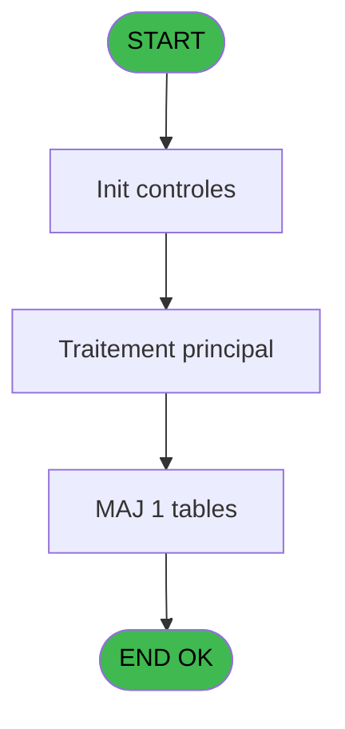

# REF IDE 590 - Browse - import_go__imgo

> **Analyse**: Phases 1-4 2026-02-03 12:58 -> 12:59 (17s) | Assemblage 12:59
> **Pipeline**: V7.2 Enrichi
> **Structure**: 4 onglets (Resume | Ecrans | Donnees | Connexions)

<!-- TAB:Resume -->

## 1. FICHE D'IDENTITE

| Attribut | Valeur |
|----------|--------|
| Projet | REF |
| IDE Position | 590 |
| Nom Programme | Browse - import_go__imgo |
| Fichier source | `Prg_590.xml` |
| Dossier IDE | General |
| Taches | 1 (1 ecrans visibles) |
| Tables modifiees | 1 |
| Programmes appeles | 0 |
| :warning: Statut | **ORPHELIN_POTENTIEL** |

## 2. DESCRIPTION FONCTIONNELLE

**Browse - import_go__imgo** assure la gestion complete de ce processus.

Le flux de traitement s'organise en **1 blocs fonctionnels** :

- **Traitement** (1 tache) : traitements metier divers

**Donnees modifiees** : 1 tables en ecriture (import_go__imgo).

## 3. BLOCS FONCTIONNELS

### 3.1 Traitement (1 tache)

Traitements internes.

---

#### 590 - Browse - import_go__imgo [[ECRAN]](#ecran-t1)

**Role** : Traitement : Browse - import_go__imgo.
**Ecran** : 5205 x 480 DLU | [Voir mockup](#ecran-t1)

## 5. REGLES METIER

*(Aucune regle metier identifiee)*

## 6. CONTEXTE

- **Appele par**: (aucun)
- **Appelle**: 0 programmes | **Tables**: 1 (W:1 R:0 L:0) | **Taches**: 1 | **Expressions**: 0

<!-- TAB:Ecrans -->

## 8. ECRANS

### 8.1 Forms visibles (1 / 1)

| # | Position | Tache | Nom | Type | Largeur | Hauteur | Bloc |
|---|----------|-------|-----|------|---------|---------|------|
| 1 | 590 | 590 | Browse - import_go__imgo | Type0 | 5205 | 480 | Traitement |

### 8.2 Mockups Ecrans

---

#### 590 - Browse - import_go__imgo
**Tache** : [590](#t1) | **Type** : Type0 | **Dimensions** : 5205 x 480 DLU
**Bloc** : Traitement | **Titre IDE** : Browse - import_go__imgo

<!-- FORM-DATA:
{
    "width":  5205,
    "vFactor":  8,
    "type":  "Type0",
    "hFactor":  4,
    "controls":  [
                     {
                         "x":  8,
                         "type":  "table",
                         "var":  "",
                         "name":  "",
                         "titleH":  12,
                         "color":  "",
                         "w":  5183,
                         "y":  8,
                         "fmt":  "",
                         "parent":  null,
                         "text":  "",
                         "rowH":  13,
                         "h":  400,
                         "cols":  [
                                      {
                                          "title":  "imgo_sequence",
                                          "layer":  1,
                                          "w":  63
                                      },
                                      {
                                          "title":  "imgo_no_ligne",
                                          "layer":  2,
                                          "w":  58
                                      },
                                      {
                                          "title":  "imgo_village",
                                          "layer":  3,
                                          "w":  290
                                      },
                                      {
                                          "title":  "imgo_identifiant_vendeur",
                                          "layer":  4,
                                          "w":  98
                                      },
                                      {
                                          "title":  "imgo_nom",
                                          "layer":  5,
                                          "w":  178
                                      },
                                      {
                                          "title":  "imgo_prenom",
                                          "layer":  6,
                                          "w":  122
                                      },
                                      {
                                          "title":  "imgo_date_debut",
                                          "layer":  7,
                                          "w":  69
                                      },
                                      {
                                          "title":  "imgo_date_fin",
                                          "layer":  8,
                                          "w":  68
                                      },
                                      {
                                          "title":  "imgo_emploi",
                                          "layer":  9,
                                          "w":  178
                                      },
                                      {
                                          "title":  "imgo_numero_chambre_demandee",
                                          "layer":  10,
                                          "w":  136
                                      },
                                      {
                                          "title":  "imgo_num_chbre_pré_attribuee_Go",
                                          "layer":  11,
                                          "w":  138
                                      },
                                      {
                                          "title":  "imgo_num_chbre_pré_attribuee_Gm",
                                          "layer":  12,
                                          "w":  140
                                      },
                                      {
                                          "title":  "imgo_qualite",
                                          "layer":  13,
                                          "w":  50
                                      },
                                      {
                                          "title":  "imgo_contrat",
                                          "layer":  14,
                                          "w":  66
                                      },
                                      {
                                          "title":  "imgo_flag_validation",
                                          "layer":  15,
                                          "w":  80
                                      },
                                      {
                                          "title":  "imgo_flag_chambre_inconnue_go",
                                          "layer":  16,
                                          "w":  131
                                      },
                                      {
                                          "title":  "imgo_flag_chambre_inconnue_gm",
                                          "layer":  17,
                                          "w":  133
                                      },
                                      {
                                          "title":  "imgo_compte_adherent",
                                          "layer":  18,
                                          "w":  92
                                      },
                                      {
                                          "title":  "imgo_numero_compte",
                                          "layer":  19,
                                          "w":  86
                                      },
                                      {
                                          "title":  "imgo_chambre_attribuée",
                                          "layer":  20,
                                          "w":  96
                                      },
                                      {
                                          "title":  "imgo_message_erreur_affectation",
                                          "layer":  21,
                                          "w":  2810
                                      },
                                      {
                                          "title":  "imgo_code_logement",
                                          "layer":  22,
                                          "w":  84
                                      }
                                  ],
                         "rows":  22
                     },
                     {
                         "x":  12,
                         "type":  "edit",
                         "var":  "",
                         "y":  23,
                         "w":  51,
                         "fmt":  "",
                         "name":  "imgo_sequence",
                         "h":  10,
                         "color":  "110",
                         "text":  "",
                         "parent":  1
                     },
                     {
                         "x":  75,
                         "type":  "edit",
                         "var":  "",
                         "y":  23,
                         "w":  51,
                         "fmt":  "",
                         "name":  "imgo_no_ligne",
                         "h":  10,
                         "color":  "110",
                         "text":  "",
                         "parent":  1
                     },
                     {
                         "x":  133,
                         "type":  "edit",
                         "var":  "",
                         "y":  23,
                         "w":  283,
                         "fmt":  "",
                         "name":  "imgo_village",
                         "h":  10,
                         "color":  "110",
                         "text":  "",
                         "parent":  1
                     },
                     {
                         "x":  423,
                         "type":  "edit",
                         "var":  "",
                         "y":  23,
                         "w":  59,
                         "fmt":  "",
                         "name":  "imgo_identifiant_vendeur",
                         "h":  10,
                         "color":  "110",
                         "text":  "",
                         "parent":  1
                     },
                     {
                         "x":  521,
                         "type":  "edit",
                         "var":  "",
                         "y":  23,
                         "w":  171,
                         "fmt":  "",
                         "name":  "imgo_nom",
                         "h":  10,
                         "color":  "110",
                         "text":  "",
                         "parent":  1
                     },
                     {
                         "x":  699,
                         "type":  "edit",
                         "var":  "",
                         "y":  23,
                         "w":  115,
                         "fmt":  "",
                         "name":  "imgo_prenom",
                         "h":  10,
                         "color":  "110",
                         "text":  "",
                         "parent":  1
                     },
                     {
                         "x":  821,
                         "type":  "edit",
                         "var":  "",
                         "y":  23,
                         "w":  61,
                         "fmt":  "",
                         "name":  "imgo_date_debut",
                         "h":  10,
                         "color":  "110",
                         "text":  "",
                         "parent":  1
                     },
                     {
                         "x":  890,
                         "type":  "edit",
                         "var":  "",
                         "y":  23,
                         "w":  61,
                         "fmt":  "",
                         "name":  "imgo_date_fin",
                         "h":  10,
                         "color":  "110",
                         "text":  "",
                         "parent":  1
                     },
                     {
                         "x":  958,
                         "type":  "edit",
                         "var":  "",
                         "y":  23,
                         "w":  171,
                         "fmt":  "",
                         "name":  "imgo_emploi",
                         "h":  10,
                         "color":  "110",
                         "text":  "",
                         "parent":  1
                     },
                     {
                         "x":  1136,
                         "type":  "edit",
                         "var":  "",
                         "y":  23,
                         "w":  59,
                         "fmt":  "",
                         "name":  "imgo_numero_chambre_demandee",
                         "h":  10,
                         "color":  "110",
                         "text":  "",
                         "parent":  1
                     },
                     {
                         "x":  1272,
                         "type":  "edit",
                         "var":  "",
                         "y":  23,
                         "w":  59,
                         "fmt":  "",
                         "name":  "imgo_num_chbre_pré_attribuee_Go",
                         "h":  10,
                         "color":  "110",
                         "text":  "",
                         "parent":  1
                     },
                     {
                         "x":  1410,
                         "type":  "edit",
                         "var":  "",
                         "y":  23,
                         "w":  59,
                         "fmt":  "",
                         "name":  "imgo_num_chbre_pré_attribuee_Gm",
                         "h":  10,
                         "color":  "110",
                         "text":  "",
                         "parent":  1
                     },
                     {
                         "x":  1550,
                         "type":  "edit",
                         "var":  "",
                         "y":  23,
                         "w":  37,
                         "fmt":  "",
                         "name":  "imgo_qualite",
                         "h":  10,
                         "color":  "110",
                         "text":  "",
                         "parent":  1
                     },
                     {
                         "x":  1600,
                         "type":  "edit",
                         "var":  "",
                         "y":  23,
                         "w":  59,
                         "fmt":  "",
                         "name":  "imgo_contrat",
                         "h":  10,
                         "color":  "110",
                         "text":  "",
                         "parent":  1
                     },
                     {
                         "x":  1666,
                         "type":  "edit",
                         "var":  "",
                         "y":  23,
                         "w":  31,
                         "fmt":  "",
                         "name":  "imgo_flag_validation",
                         "h":  10,
                         "color":  "110",
                         "text":  "",
                         "parent":  1
                     },
                     {
                         "x":  1746,
                         "type":  "edit",
                         "var":  "",
                         "y":  23,
                         "w":  31,
                         "fmt":  "",
                         "name":  "imgo_flag_chambre_inconnue_go",
                         "h":  10,
                         "color":  "110",
                         "text":  "",
                         "parent":  1
                     },
                     {
                         "x":  1877,
                         "type":  "edit",
                         "var":  "",
                         "y":  23,
                         "w":  31,
                         "fmt":  "",
                         "name":  "imgo_flag_chambre_inconnue_gm",
                         "h":  10,
                         "color":  "110",
                         "text":  "",
                         "parent":  1
                     },
                     {
                         "x":  2010,
                         "type":  "edit",
                         "var":  "",
                         "y":  23,
                         "w":  46,
                         "fmt":  "",
                         "name":  "imgo_compte_adherent",
                         "h":  10,
                         "color":  "110",
                         "text":  "",
                         "parent":  1
                     },
                     {
                         "x":  2102,
                         "type":  "edit",
                         "var":  "",
                         "y":  23,
                         "w":  46,
                         "fmt":  "",
                         "name":  "imgo_numero_compte",
                         "h":  10,
                         "color":  "110",
                         "text":  "",
                         "parent":  1
                     },
                     {
                         "x":  2188,
                         "type":  "edit",
                         "var":  "",
                         "y":  23,
                         "w":  31,
                         "fmt":  "",
                         "name":  "imgo_chambre_attribuée",
                         "h":  10,
                         "color":  "110",
                         "text":  "",
                         "parent":  1
                     },
                     {
                         "x":  2284,
                         "type":  "edit",
                         "var":  "",
                         "y":  23,
                         "w":  2803,
                         "fmt":  "",
                         "name":  "imgo_message_erreur_affectation",
                         "h":  10,
                         "color":  "110",
                         "text":  "",
                         "parent":  1
                     },
                     {
                         "x":  5094,
                         "type":  "edit",
                         "var":  "",
                         "y":  23,
                         "w":  37,
                         "fmt":  "",
                         "name":  "imgo_code_logement",
                         "h":  10,
                         "color":  "110",
                         "text":  "",
                         "parent":  1
                     }
                 ],
    "taskId":  "590",
    "height":  480
}
-->

<strong>Champs : 22 champs</strong>

| Pos (x,y) | Nom | Variable | Type |
|-----------|-----|----------|------|
| 12,23 | imgo_sequence | - | edit |
| 75,23 | imgo_no_ligne | - | edit |
| 133,23 | imgo_village | - | edit |
| 423,23 | imgo_identifiant_vendeur | - | edit |
| 521,23 | imgo_nom | - | edit |
| 699,23 | imgo_prenom | - | edit |
| 821,23 | imgo_date_debut | - | edit |
| 890,23 | imgo_date_fin | - | edit |
| 958,23 | imgo_emploi | - | edit |
| 1136,23 | imgo_numero_chambre_demandee | - | edit |
| 1272,23 | imgo_num_chbre_pré_attribuee_Go | - | edit |
| 1410,23 | imgo_num_chbre_pré_attribuee_Gm | - | edit |
| 1550,23 | imgo_qualite | - | edit |
| 1600,23 | imgo_contrat | - | edit |
| 1666,23 | imgo_flag_validation | - | edit |
| 1746,23 | imgo_flag_chambre_inconnue_go | - | edit |
| 1877,23 | imgo_flag_chambre_inconnue_gm | - | edit |
| 2010,23 | imgo_compte_adherent | - | edit |
| 2102,23 | imgo_numero_compte | - | edit |
| 2188,23 | imgo_chambre_attribuée | - | edit |
| 2284,23 | imgo_message_erreur_affectation | - | edit |
| 5094,23 | imgo_code_logement | - | edit |

## 9. NAVIGATION

Ecran unique: **Browse - import_go__imgo**

### 9.3 Structure hierarchique (1 tache)

| Position | Tache | Type | Dimensions | Bloc |
|----------|-------|------|------------|------|
| **590.1** | [**Browse - import_go__imgo** (590)](#t1) [mockup](#ecran-t1) | - | 5205x480 | Traitement |

### 9.4 Algorigramme

> **Legende**: Vert = START/END OK | Rouge = END KO | Bleu = Decisions
> *Algorigramme auto-genere. Utiliser `/algorigramme` pour une synthese metier detaillee.*

<!-- TAB:Donnees -->

## 10. TABLES

### Tables utilisees (1)

| ID | Nom | Description | Type | R | W | L | Usages |
|----|-----|-------------|------|---|---|---|--------|
| 829 | import_go__imgo |  | DB |   | **W** |   | 1 |

### Colonnes par table (0 / 1 tables avec colonnes identifiees)

Table 829 - import_go__imgo (**W**) - 1 usages

*Table utilisee uniquement en Link ou aucune colonne Real identifiee dans le DataView.*

## 11. VARIABLES

*(Programme sans variables locales mappees)*

## 12. EXPRESSIONS

**0 / 0 expressions decodees (0%)**

### 12.1 Repartition par type

| Type | Expressions | Regles |
|------|-------------|--------|

### 12.2 Expressions cles par type

<!-- TAB:Connexions -->

## 13. GRAPHE D'APPELS

### 13.1 Chaine depuis Main (Callers)

**Chemin**: (pas de callers directs)

### 13.2 Callers

| IDE | Nom Programme | Nb Appels |
|-----|---------------|-----------|
| - | (aucun) | - |

### 13.3 Callees (programmes appeles)

### 13.4 Detail Callees avec contexte

| IDE | Nom Programme | Appels | Contexte |
|-----|---------------|--------|----------|
| - | (aucun) | - | - |

## 14. RECOMMANDATIONS MIGRATION

### 14.1 Profil du programme

| Metrique | Valeur | Impact migration |
|----------|--------|-----------------|
| Lignes de logique | 23 | Programme compact |
| Expressions | 0 | Peu de logique |
| Tables WRITE | 1 | Impact faible |
| Sous-programmes | 0 | Peu de dependances |
| Ecrans visibles | 1 | Ecran unique ou traitement batch |
| Code desactive | 0% (0 / 23) | Code sain |
| Regles metier | 0 | Pas de regle identifiee |

### 14.2 Plan de migration par bloc

#### Traitement (1 tache: 1 ecran, 0 traitement)

- **Strategie** : 1 composant(s) UI (Razor/React) avec formulaires et validation.
- Decomposer les taches en services unitaires testables.

### 14.3 Dependances critiques

| Dependance | Type | Appels | Impact |
|------------|------|--------|--------|
| import_go__imgo | Table WRITE (Database) | 1x | Schema + repository |

---
*Spec DETAILED generee par Pipeline V7.2 - 2026-02-03 12:59*
