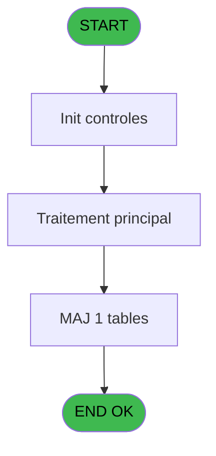

# REF IDE 597 - Browse - retour_forfait_ski

> **Analyse**: Phases 1-4 2026-02-03 13:01 -> 13:02 (18s) | Assemblage 13:02
> **Pipeline**: V7.2 Enrichi
> **Structure**: 4 onglets (Resume | Ecrans | Donnees | Connexions)

<!-- TAB:Resume -->

## 1. FICHE D'IDENTITE

| Attribut | Valeur |
|----------|--------|
| Projet | REF |
| IDE Position | 597 |
| Nom Programme | Browse - retour_forfait_ski |
| Fichier source | `Prg_597.xml` |
| Dossier IDE | General |
| Taches | 1 (1 ecrans visibles) |
| Tables modifiees | 1 |
| Programmes appeles | 0 |
| :warning: Statut | **ORPHELIN_POTENTIEL** |

## 2. DESCRIPTION FONCTIONNELLE

**Browse - retour_forfait_ski** assure la gestion complete de ce processus.

Le flux de traitement s'organise en **1 blocs fonctionnels** :

- **Traitement** (1 tache) : traitements metier divers

**Donnees modifiees** : 1 tables en ecriture (retour_forfait_ski).

## 3. BLOCS FONCTIONNELS

### 3.1 Traitement (1 tache)

Traitements internes.

---

#### 597 - Browse - retour_forfait_ski [[ECRAN]](#ecran-t1)

**Role** : Traitement : Browse - retour_forfait_ski.
**Ecran** : 1596 x 480 DLU | [Voir mockup](#ecran-t1)

## 5. REGLES METIER

*(Aucune regle metier identifiee)*

## 6. CONTEXTE

- **Appele par**: (aucun)
- **Appelle**: 0 programmes | **Tables**: 1 (W:1 R:0 L:0) | **Taches**: 1 | **Expressions**: 0

<!-- TAB:Ecrans -->

## 8. ECRANS

### 8.1 Forms visibles (1 / 1)

| # | Position | Tache | Nom | Type | Largeur | Hauteur | Bloc |
|---|----------|-------|-----|------|---------|---------|------|
| 1 | 597 | 597 | Browse - retour_forfait_ski | Type0 | 1596 | 480 | Traitement |

### 8.2 Mockups Ecrans

---

#### 597 - Browse - retour_forfait_ski
**Tache** : [597](#t1) | **Type** : Type0 | **Dimensions** : 1596 x 480 DLU
**Bloc** : Traitement | **Titre IDE** : Browse - retour_forfait_ski

<!-- FORM-DATA:
{
    "width":  1596,
    "vFactor":  8,
    "type":  "Type0",
    "hFactor":  4,
    "controls":  [
                     {
                         "x":  8,
                         "type":  "table",
                         "var":  "",
                         "name":  "",
                         "titleH":  12,
                         "color":  "110",
                         "w":  1574,
                         "y":  8,
                         "fmt":  "",
                         "parent":  null,
                         "text":  "",
                         "rowH":  13,
                         "h":  400,
                         "cols":  [
                                      {
                                          "title":  "rfs_code_saison",
                                          "layer":  1,
                                          "w":  65
                                      },
                                      {
                                          "title":  "rfs_date_retour",
                                          "layer":  2,
                                          "w":  68
                                      },
                                      {
                                          "title":  "rfs_nb_forfait_demi_journee",
                                          "layer":  3,
                                          "w":  107
                                      },
                                      {
                                          "title":  "rfs_nb_forfait_1jour",
                                          "layer":  4,
                                          "w":  75
                                      },
                                      {
                                          "title":  "rfs_nb_forfait_2jours",
                                          "layer":  5,
                                          "w":  79
                                      },
                                      {
                                          "title":  "rfs_nb_forfait_3jours",
                                          "layer":  6,
                                          "w":  79
                                      },
                                      {
                                          "title":  "rfs_nb_forfait_4jours",
                                          "layer":  7,
                                          "w":  79
                                      },
                                      {
                                          "title":  "rfs_nb_forfait_5jours",
                                          "layer":  8,
                                          "w":  79
                                      },
                                      {
                                          "title":  "rfs_nb_forfait_6jours",
                                          "layer":  9,
                                          "w":  79
                                      },
                                      {
                                          "title":  "rfs_nb_forfait_7jours",
                                          "layer":  10,
                                          "w":  79
                                      },
                                      {
                                          "title":  "rfs_nb_forfait_8jours",
                                          "layer":  11,
                                          "w":  79
                                      },
                                      {
                                          "title":  "rfs_nb_forfait_9jours",
                                          "layer":  12,
                                          "w":  79
                                      },
                                      {
                                          "title":  "rfs_nb_forfait_10jours",
                                          "layer":  13,
                                          "w":  84
                                      },
                                      {
                                          "title":  "rfs_nb_forfait_11jours",
                                          "layer":  14,
                                          "w":  84
                                      },
                                      {
                                          "title":  "rfs_nb_forfait_12jours",
                                          "layer":  15,
                                          "w":  84
                                      },
                                      {
                                          "title":  "rfs_nb_forfait_13jours",
                                          "layer":  16,
                                          "w":  84
                                      },
                                      {
                                          "title":  "rfs_nb_forfait_14jours",
                                          "layer":  17,
                                          "w":  84
                                      },
                                      {
                                          "title":  "rfs_nb_forfait_15jours",
                                          "layer":  18,
                                          "w":  84
                                      },
                                      {
                                          "title":  "rfs_nb_forfait_total_journee",
                                          "layer":  19,
                                          "w":  106
                                      }
                                  ],
                         "rows":  19
                     },
                     {
                         "x":  12,
                         "type":  "edit",
                         "var":  "",
                         "y":  23,
                         "w":  9,
                         "fmt":  "",
                         "name":  "rfs_code_saison",
                         "h":  10,
                         "color":  "110",
                         "text":  "",
                         "parent":  1
                     },
                     {
                         "x":  77,
                         "type":  "edit",
                         "var":  "",
                         "y":  23,
                         "w":  61,
                         "fmt":  "",
                         "name":  "rfs_date_retour",
                         "h":  10,
                         "color":  "110",
                         "text":  "",
                         "parent":  1
                     },
                     {
                         "x":  145,
                         "type":  "edit",
                         "var":  "",
                         "y":  23,
                         "w":  18,
                         "fmt":  "",
                         "name":  "rfs_nb_forfait_demi_journee",
                         "h":  10,
                         "color":  "110",
                         "text":  "",
                         "parent":  1
                     },
                     {
                         "x":  252,
                         "type":  "edit",
                         "var":  "",
                         "y":  23,
                         "w":  18,
                         "fmt":  "",
                         "name":  "rfs_nb_forfait_1jour",
                         "h":  10,
                         "color":  "110",
                         "text":  "",
                         "parent":  1
                     },
                     {
                         "x":  327,
                         "type":  "edit",
                         "var":  "",
                         "y":  23,
                         "w":  18,
                         "fmt":  "",
                         "name":  "rfs_nb_forfait_2jours",
                         "h":  10,
                         "color":  "110",
                         "text":  "",
                         "parent":  1
                     },
                     {
                         "x":  406,
                         "type":  "edit",
                         "var":  "",
                         "y":  23,
                         "w":  18,
                         "fmt":  "",
                         "name":  "rfs_nb_forfait_3jours",
                         "h":  10,
                         "color":  "110",
                         "text":  "",
                         "parent":  1
                     },
                     {
                         "x":  485,
                         "type":  "edit",
                         "var":  "",
                         "y":  23,
                         "w":  18,
                         "fmt":  "",
                         "name":  "rfs_nb_forfait_4jours",
                         "h":  10,
                         "color":  "110",
                         "text":  "",
                         "parent":  1
                     },
                     {
                         "x":  564,
                         "type":  "edit",
                         "var":  "",
                         "y":  23,
                         "w":  18,
                         "fmt":  "",
                         "name":  "rfs_nb_forfait_5jours",
                         "h":  10,
                         "color":  "110",
                         "text":  "",
                         "parent":  1
                     },
                     {
                         "x":  643,
                         "type":  "edit",
                         "var":  "",
                         "y":  23,
                         "w":  18,
                         "fmt":  "",
                         "name":  "rfs_nb_forfait_6jours",
                         "h":  10,
                         "color":  "110",
                         "text":  "",
                         "parent":  1
                     },
                     {
                         "x":  722,
                         "type":  "edit",
                         "var":  "",
                         "y":  23,
                         "w":  18,
                         "fmt":  "",
                         "name":  "rfs_nb_forfait_7jours",
                         "h":  10,
                         "color":  "110",
                         "text":  "",
                         "parent":  1
                     },
                     {
                         "x":  801,
                         "type":  "edit",
                         "var":  "",
                         "y":  23,
                         "w":  18,
                         "fmt":  "",
                         "name":  "rfs_nb_forfait_8jours",
                         "h":  10,
                         "color":  "110",
                         "text":  "",
                         "parent":  1
                     },
                     {
                         "x":  880,
                         "type":  "edit",
                         "var":  "",
                         "y":  23,
                         "w":  18,
                         "fmt":  "",
                         "name":  "rfs_nb_forfait_9jours",
                         "h":  10,
                         "color":  "110",
                         "text":  "",
                         "parent":  1
                     },
                     {
                         "x":  959,
                         "type":  "edit",
                         "var":  "",
                         "y":  23,
                         "w":  18,
                         "fmt":  "",
                         "name":  "rfs_nb_forfait_10jours",
                         "h":  10,
                         "color":  "110",
                         "text":  "",
                         "parent":  1
                     },
                     {
                         "x":  1043,
                         "type":  "edit",
                         "var":  "",
                         "y":  23,
                         "w":  18,
                         "fmt":  "",
                         "name":  "rfs_nb_forfait_11jours",
                         "h":  10,
                         "color":  "110",
                         "text":  "",
                         "parent":  1
                     },
                     {
                         "x":  1127,
                         "type":  "edit",
                         "var":  "",
                         "y":  23,
                         "w":  18,
                         "fmt":  "",
                         "name":  "rfs_nb_forfait_12jours",
                         "h":  10,
                         "color":  "110",
                         "text":  "",
                         "parent":  1
                     },
                     {
                         "x":  1211,
                         "type":  "edit",
                         "var":  "",
                         "y":  23,
                         "w":  18,
                         "fmt":  "",
                         "name":  "rfs_nb_forfait_13jours",
                         "h":  10,
                         "color":  "110",
                         "text":  "",
                         "parent":  1
                     },
                     {
                         "x":  1295,
                         "type":  "edit",
                         "var":  "",
                         "y":  23,
                         "w":  18,
                         "fmt":  "",
                         "name":  "rfs_nb_forfait_14jours",
                         "h":  10,
                         "color":  "110",
                         "text":  "",
                         "parent":  1
                     },
                     {
                         "x":  1379,
                         "type":  "edit",
                         "var":  "",
                         "y":  23,
                         "w":  18,
                         "fmt":  "",
                         "name":  "rfs_nb_forfait_15jours",
                         "h":  10,
                         "color":  "110",
                         "text":  "",
                         "parent":  1
                     },
                     {
                         "x":  1463,
                         "type":  "edit",
                         "var":  "",
                         "y":  23,
                         "w":  18,
                         "fmt":  "",
                         "name":  "rfs_nb_forfait_total_journee",
                         "h":  10,
                         "color":  "110",
                         "text":  "",
                         "parent":  1
                     }
                 ],
    "taskId":  "597",
    "height":  480
}
-->

<strong>Champs : 19 champs</strong>

| Pos (x,y) | Nom | Variable | Type |
|-----------|-----|----------|------|
| 12,23 | rfs_code_saison | - | edit |
| 77,23 | rfs_date_retour | - | edit |
| 145,23 | rfs_nb_forfait_demi_journee | - | edit |
| 252,23 | rfs_nb_forfait_1jour | - | edit |
| 327,23 | rfs_nb_forfait_2jours | - | edit |
| 406,23 | rfs_nb_forfait_3jours | - | edit |
| 485,23 | rfs_nb_forfait_4jours | - | edit |
| 564,23 | rfs_nb_forfait_5jours | - | edit |
| 643,23 | rfs_nb_forfait_6jours | - | edit |
| 722,23 | rfs_nb_forfait_7jours | - | edit |
| 801,23 | rfs_nb_forfait_8jours | - | edit |
| 880,23 | rfs_nb_forfait_9jours | - | edit |
| 959,23 | rfs_nb_forfait_10jours | - | edit |
| 1043,23 | rfs_nb_forfait_11jours | - | edit |
| 1127,23 | rfs_nb_forfait_12jours | - | edit |
| 1211,23 | rfs_nb_forfait_13jours | - | edit |
| 1295,23 | rfs_nb_forfait_14jours | - | edit |
| 1379,23 | rfs_nb_forfait_15jours | - | edit |
| 1463,23 | rfs_nb_forfait_total_journee | - | edit |

## 9. NAVIGATION

Ecran unique: **Browse - retour_forfait_ski**

### 9.3 Structure hierarchique (1 tache)

| Position | Tache | Type | Dimensions | Bloc |
|----------|-------|------|------------|------|
| **597.1** | [**Browse - retour_forfait_ski** (597)](#t1) [mockup](#ecran-t1) | - | 1596x480 | Traitement |

### 9.4 Algorigramme

> **Legende**: Vert = START/END OK | Rouge = END KO | Bleu = Decisions
> *Algorigramme auto-genere. Utiliser `/algorigramme` pour une synthese metier detaillee.*

<!-- TAB:Donnees -->

## 10. TABLES

### Tables utilisees (1)

| ID | Nom | Description | Type | R | W | L | Usages |
|----|-----|-------------|------|---|---|---|--------|
| 841 | retour_forfait_ski |  | DB |   | **W** |   | 1 |

### Colonnes par table (0 / 1 tables avec colonnes identifiees)

Table 841 - retour_forfait_ski (**W**) - 1 usages

*Table utilisee uniquement en Link ou aucune colonne Real identifiee dans le DataView.*

## 11. VARIABLES

*(Programme sans variables locales mappees)*

## 12. EXPRESSIONS

**0 / 0 expressions decodees (0%)**

### 12.1 Repartition par type

| Type | Expressions | Regles |
|------|-------------|--------|

### 12.2 Expressions cles par type

<!-- TAB:Connexions -->

## 13. GRAPHE D'APPELS

### 13.1 Chaine depuis Main (Callers)

**Chemin**: (pas de callers directs)

### 13.2 Callers

| IDE | Nom Programme | Nb Appels |
|-----|---------------|-----------|
| - | (aucun) | - |

### 13.3 Callees (programmes appeles)

### 13.4 Detail Callees avec contexte

| IDE | Nom Programme | Appels | Contexte |
|-----|---------------|--------|----------|
| - | (aucun) | - | - |

## 14. RECOMMANDATIONS MIGRATION

### 14.1 Profil du programme

| Metrique | Valeur | Impact migration |
|----------|--------|-----------------|
| Lignes de logique | 20 | Programme compact |
| Expressions | 0 | Peu de logique |
| Tables WRITE | 1 | Impact faible |
| Sous-programmes | 0 | Peu de dependances |
| Ecrans visibles | 1 | Ecran unique ou traitement batch |
| Code desactive | 0% (0 / 20) | Code sain |
| Regles metier | 0 | Pas de regle identifiee |

### 14.2 Plan de migration par bloc

#### Traitement (1 tache: 1 ecran, 0 traitement)

- **Strategie** : 1 composant(s) UI (Razor/React) avec formulaires et validation.
- Decomposer les taches en services unitaires testables.

### 14.3 Dependances critiques

| Dependance | Type | Appels | Impact |
|------------|------|--------|--------|
| retour_forfait_ski | Table WRITE (Database) | 1x | Schema + repository |

---
*Spec DETAILED generee par Pipeline V7.2 - 2026-02-03 13:02*
